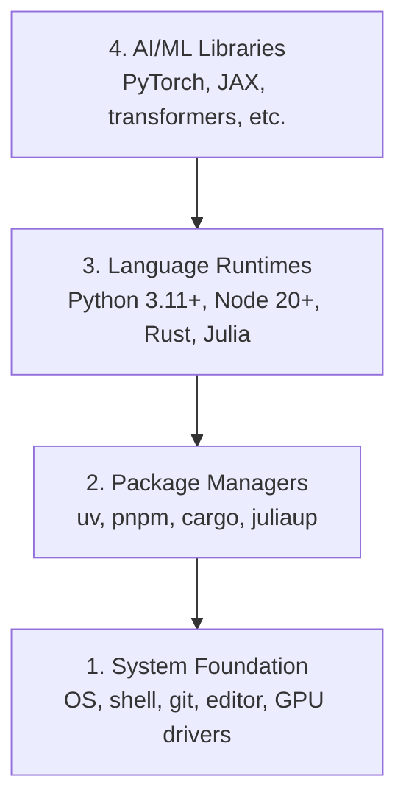

# بيئة التنمية

> أدواتك تشكل تفكيرك، قم بتنظيمها مرة واحدة، قم بتنظيمها بشكل صحيح.

**Type:** Build
**Languages:** Python, Node.js, Rust
**Prerequisites:** None
**Time:** ~45 minutes

## أهداف التعلم

- قم بتعيين Python 3.11+، Node.js 20+، و Rust من الصفر
- تكوين بيئات افتراضية ومديري الحزم للمبنيات المتكملة
- التحقق من وصول GPU مع CUDA / MPS وإجراء عملية اختبار التنسور
- فهم كومة أربع طبقات: النظام، الحزم، أوقات تشغيل، مكتبات الذكاء الاصطناعي

## المشكلة

أنت على وشك تعلم هندسة الذكاء الاصطناعي عبر 500 دروس تستخدم بايثون، الكتابة النمطية، الخرق، وجوليا. إذا تم تدمير بيئتك، كل دروس واحد يصبح معركة ضد الأدوات بدلا من التعلم.

معظم الناس يخطون إعداد البيئة ثم يقضون ساعات في تحليل أخطاء الاستيراد، نزاعات الإصدارات، ووقودات CUDA المفقودة. سنقوم بهذا مرة واحدة، بشكل صحيح.

## المفهوم

بيئة هندسة الذكاء الاصطناعي لديها أربع طبقات:



نضع من أسفل إلى أعلى كل طبقة تعتمد على الطبقة التي تحتها

```figure
s0-env-stack
```

## بناءها

### الخطوة الأولى: أساس النظام

تحقق من نظامك ووضع الأساسيات

```bash
# macOS
xcode-select --install
brew install git curl wget

# Ubuntu/Debian
sudo apt update && sudo apt install -y build-essential git curl wget

# Windows (use WSL2)
wsl --install -d Ubuntu-24.04
```

### الخطوة الثانية: Python مع UV

نحن نستخدم`uv` هو 10-100x أسرع من البوابة ويعالج البيئات الافتراضية تلقائيا.

```bash
curl -LsSf https://astral.sh/uv/install.sh | sh

uv python install 3.12

uv venv
source .venv/bin/activate  # or .venv\Scripts\activate on Windows

uv pip install numpy matplotlib jupyter
```

التحقق من:

```python
import sys
print(f"Python {sys.version}")

import numpy as np
print(f"NumPy {np.__version__}")
a = np.array([1, 2, 3])
print(f"Vector: {a}, dot product with itself: {np.dot(a, a)}")
```

### الخطوة 3: Node.js مع pnpm

للدرسات TypScript (وكلاء، خادمات MCP، تطبيقات الويب).

```bash
curl -fsSL https://fnm.vercel.app/install | bash
fnm install 22
fnm use 22

npm install -g pnpm

node -e "console.log('Node', process.version)"
```

**macOS / Apple Silicon (M1/M2/M3/M4):**إذا توقف التركيب عن`Error: Cannot install under Rosetta 2 in ARM default prefix (/opt/homebrew)`، محطةك تعمل تحت " روزيتا 2 "`arch`بصمات`i386`(هومبريو) هو بناء أليف أرم64، قم بتثبيت (أرم64) القسري، قم بتسجيله في قذفك، ثم قم بإعادة تشغيل الأوامر أعلاه من (أرم64).`fnm install 22`:

```bash
arch -arm64 brew install fnm
echo 'eval "$(fnm env --use-on-cd)"' >> ~/.zshrc
source ~/.zshrc
```

### الخطوة الرابعة: الدرونة

للدروس الحرجة للأداء (الاضافة، الأنظمة).

```bash
curl --proto '=https' --tlsv1.2 -sSf https://sh.rustup.rs | sh

rustc --version
cargo --version
```

### الخطوة 5: جوليا (اختياري)

لدروس الرياضيات الثقيلة حيث يضيء جوليا.

```bash
curl -fsSL https://install.julialang.org | sh

julia -e 'println("Julia ", VERSION)'
```

### الخطوة 6: إعداد GPU (إذا كان لديك واحد)

**NVIDIA (Linux / Windows):**

```bash
nvidia-smi

# Install PyTorch with CUDA
uv pip install torch torchvision torchaudio --index-url https://download.pytorch.org/whl/cu124
```

**macOS / Apple Silicon (M1/M2/M3/M4):**لا يوجد أي "كودا" على "ماك" متوقعة، لا فشل.**not**مرر`--index-url .../cuXXX`(هذه العجلات هي لينكس ويندوز فقط، لذلك فشل التثبيت). قم بتثبيت البناء العادي، الذي يتضمن MPS (المعدل) GPU الخلفي من آبل:

```bash
uv pip install torch torchvision torchaudio
```

التحقق (يعمل على أي منصة):

```python
import torch
print(f"CUDA available: {torch.cuda.is_available()}")           # False on macOS — expected
print(f"MPS available:  {torch.backends.mps.is_available()}")   # True on Apple Silicon
if torch.cuda.is_available():
    print(f"GPU: {torch.cuda.get_device_name(0)}")
```

لا يوجد نظام معين للكمبيوترات (GPU) ؟ لا مشكلة. معظم الدروس تعمل على جهاز معين للكمبيوترات (CPU).

### الخطوة 7: تحقق من المسار الذي تريد البدء به

إشغال كل أمر في هذا الدروس من جذور مخزن، المجلد الذي
يحتوي على`README.md`و`phases/`قبل الرحلة يُفحص فقط ما تحتاج إليه
يبدأ الطريق المحدد. يفرض أدوات لاحقة بشكل افتراضي حتى يرى المتعلم الجديد
رد واضح بدلاً من جدار من التحذيرات

ابدأ سلسلة المبتدئين الكاملة:

```bash
python3 phases/00-setup-and-tooling/01-dev-environment/code/verify.py --route beginner
```

أو تحقق فقط من الطريق الذي تريده:

```bash
python3 phases/00-setup-and-tooling/01-dev-environment/code/verify.py --route ml-foundations
python3 phases/00-setup-and-tooling/01-dev-environment/code/verify.py --route llm-engineering
python3 phases/00-setup-and-tooling/01-dev-environment/code/verify.py --route agents
python3 phases/00-setup-and-tooling/01-dev-environment/code/verify.py --route mcp
python3 phases/00-setup-and-tooling/01-dev-environment/code/verify.py --route agent-skills
python3 phases/00-setup-and-tooling/01-dev-environment/code/verify.py --route certification
```

إضافة`--show-later`عندما تريد نفس التحقيق قبل الرحلة للتفتيش الأدوات الاختيارية
و الاعتماد المستخدمة في الدروس اللاحقة.
الطريق المختار.

كل عملية فاشلة مطلوبة تتضمن المسار المكتشف أو خطأ الاستيراد
القيادة التصحيحية الدقيقة. مهارات العميل وطرق الشهادة أيضاً
التحقق من المضيف اليدوي لأن نص Python لا يمكن أن يثبت أن المضيف AI
اكتشفت مهارة أو أن المهارات التي اخترتها قابلة للكتابة

عندما يمر المبتدئ قبل الرحلة، فإنه يطبخ الدروس الأولى الدراسة:

```text
Ready to start Beginner course.
Next: python3 phases/01-math-foundations/01-linear-algebra-intuition/code/vectors.py
```

## استخدمها

بيئتك جاهزة لبدء المسار الذي تحققت منه
عندما يطلب الدروس منهم بدلاً من حظر دروسك الأولى على الإطلاق
هنا ما ستستخدمه في جميع أنحاء المناهج الدراسية:

| Language | Used In | Package Manager |
|----------|---------|-----------------|
| Python | Phases 1-12 (ML, DL, NLP, Vision, Audio, LLMs) | uv |
| TypeScript | Phases 13-17 (Tools, Agents, Swarms, Infra) | pnpm |
| Rust | Phases 12, 15-17 (Performance-critical systems) | cargo |
| Julia | Phase 1 (Math foundations) | Pkg |

## أرسله

هذا الدروس ينتج نص التحقق يمكن لأي شخص تشغيله للتحقق من إعداداتهم.

انظر`outputs/prompt-env-check.md`لمستشارات تساعد مساعدات الذكاء الاصطناعي على تشخيص مشاكل البيئة

## التمارين

1. إشغال النص التحقق وإصلاح أي أخطاء
2. قم بإنشاء بيئة افتراضية Python لهذا الدورة و قم بتثبيت PyTorch
3. اكتب "مرحباً للعالم" بكلّ الألغات الأربعة و إشغلي كلّها
