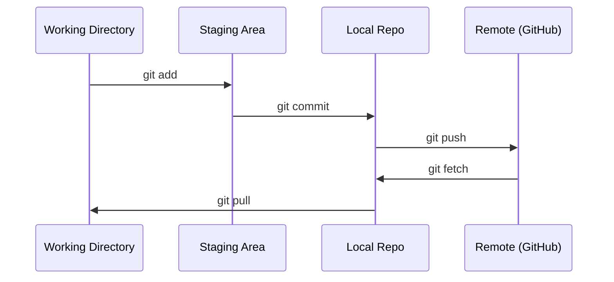

# التعاون

> التحكم في الإصدار ليس اختيارياً كل تجربة، كل نموذج، كل درس تقوم بناؤه هنا يتم تتبعه

**Type:** Learn
**Languages:** --
**Prerequisites:** Phase 0, Lesson 01
**Time:** ~30 minutes

## أهداف التعلم

- قم بتهيئة هوية git واستخدام سير العمل اليومي لإضافة، إلتزام، ودفع
- إنشاء ودمج فروع للتجارب المعزولة دون كسر الرأس
- اكتب`.gitignore`لا تستثني نقاط التفتيش النموذجية والملفات الثنائية الكبيرة
- التنقل في تاريخ الإجراءات مع `git log`لفهم تطور المشروع

## المشكلة

أنت على وشك كتابة مئات ملفات رمزية عبر 20 مرحلة بدون التحكم في النسخة ستفقد العمل وتكسر الأشياء التي لا تستطيع إعادة إصلاحها،

غيت هي الأداة. غيت هوب هو حيث يعيش البرمجة. هذا الدروس يغطي ما تحتاجه لهذا الدورة ولا شيء آخر.

## المفهوم



ثلاثة أشياء يجب أن نتذكرها:
1. إدخار في كثير من الأحيان (`git commit`)
2. اضغط على جهاز التحكم عن بعد (`git push`)
3. فرع التجارب (`git checkout -b experiment`)

```figure
s0-commit-dag
```

## بناءها

### الخطوة 1: إعداد git

```bash
git config --global user.name "Your Name"
git config --global user.email "you@example.com"
```

### الخطوة الثانية: سير العمل اليومي

```bash
git status
git add file.py
git commit -m "Add perceptron implementation"
git push origin main
```

### الخطوة الثالثة: التفرع للتجارب

```bash
git checkout -b experiment/new-optimizer

# ... make changes, commit ...

git checkout main
git merge experiment/new-optimizer
```

### الخطوة الرابعة: العمل مع هذا الدورة الإستثمارية

لا يمكنك دفع إلى إعادة التطبيق في نفس الدورة  فقط الحافظين لديهم إمكانية الوصول إلى الكتابة. فوكه على GitHub أولا (حافظة الزر، أعلى اليمين) لذلك `origin`النصوص الخاصة بك:

```bash
git clone https://github.com/YOUR-USERNAME/ai-engineering-from-scratch.git
cd ai-engineering-from-scratch

git checkout -b my-progress
# work through lessons, commit your code
git push origin my-progress
```

## استخدمها

لهذا المسار، تحتاج بالضبط إلى هذه الأوامر:

| Command | When |
|---------|------|
| `git clone` | Get the course repo |
| `git add` + `git commit` | Save your work |
| `git push` | Back it up to GitHub |
| `git checkout -b` | Try something without breaking main |
| `git log --oneline` | See what you've done |

هذا كل شيء، لا تحتاج إلى إعادة التأثير أو إعادة التأهيل أو وحدات فرعية لهذا الدورة

## التمارين

1. إزداد هذا الإستعراض، قم بتخصيص الشوكة، وإنشاء فرع يدعى`my-progress`, إصنع ملفاً , إلتزامها , إدفعها
2. إخلق`.gitignore`التي تستبعد ملفات النموذجية لمواقع التفتيش (`.pt`،`.pth`،`.safetensors`)
3. انظر تاريخ التزامات هذا الإنتقال مع`git log --oneline`وقرأ كيف تم إضافة الدروس

## الشروط الرئيسية

| Term | What people say | What it actually means |
|------|----------------|----------------------|
| Commit | "Saving" | A snapshot of your entire project at a point in time |
| Branch | "A copy" | A pointer to a commit that moves forward as you work |
| Merge | "Combining code" | Taking changes from one branch and applying them to another |
| Remote | "The cloud" | A copy of your repo hosted somewhere else (GitHub, GitLab) |
