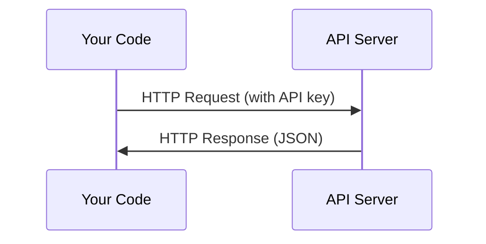

# أجهزة الإرسال و المفاتيح

> كل API تعمل بنفس الطريقة: إرسال طلب، الحصول على رد. التفاصيل تتغير، النمط لا.

**Type:** Build
**Languages:** Python, TypeScript
**Prerequisites:** Phase 0, Lesson 01
**Time:** ~30 minutes

## أهداف التعلم

- تخزين مفاتيح API بأمان باستخدام متغيرات البيئة و `.env`الملفات
- إجراء مكالمة API LLM باستخدام كل من SDK Python Anthropic و HTTP خام
- مقارنة أشكال طلب/رد HTTP القائمة على SDK والحمية للتحليل
- تحديد وتعامل الأخطاء الشائعة في إطار إطار الإعدادات الإلكترونية بما في ذلك الحدود المحددة للتصديق والحدود المتعلقة بالمعدلات

## المشكلة

بدءا من المرحلة 11، ستدعون APIs LLM (Anthropic، OpenAI، Google). في المرحلة 13-16 ستقوم ببناء وكلاء يستخدمون هذه APIs في حلقات. تحتاج إلى معرفة كيفية عمل مفاتيح API، وكيفية تخزينها بأمان، وكيفية إجراء أول مكالمة API.

## المفهوم



كل مكالمة من خلال إطار الإتصال:
1. نقطة نهاية (URL)
2. مفتاح API (تصديق)
3. هيئة الطلب (ما تريد)
4. جسم الاستجابة (ما تحصل عليه)

```figure
s0-secret-inject
```

## بناءها

### الخطوة 1: تخزين مفاتيح API بأمان

لا تضع أبداً مفاتيح API في الرمز. استخدم متغيرات البيئة.

```bash
export ANTHROPIC_API_KEY="sk-ant-..."
export OPENAI_API_KEY="sk-..."
```

أو استخدم`.env`الملف (إضافة إلى `.gitignore`):

```
ANTHROPIC_API_KEY=sk-ant-...
OPENAI_API_KEY=sk-...
```

### الخطوة 2: أول مكالمة API (بايتون)

```python
import os

import anthropic

client = anthropic.Anthropic()

MODEL = os.environ.get("LLM_MODEL", "claude-sonnet-5")

response = client.messages.create(
    model=MODEL,
    max_tokens=256,
    messages=[{"role": "user", "content": "What is a neural network in one sentence?"}]
)

print(response.content[0].text)
```

`LLM_MODEL`يختار معرف النموذج الأنفروبي ، والإعداد الافتراضي هو اسم Sonnet غير المحدد. يتابع مزودي آخرون (OpenAI ، Google ، وغيرهم) نفس نمط مفتاح بالإضافة إلى معرف النموذج ، ولكن لكل منهما SDK وندوبايت الخاص به ، وخطة طلب / رد.

### الخطوة الثالثة: الدعوة الأولى لل API (TypeScript)

```typescript
import Anthropic from "@anthropic-ai/sdk";

const client = new Anthropic();

const MODEL = process.env.LLM_MODEL ?? "claude-sonnet-5";

const response = await client.messages.create({
  model: MODEL,
  max_tokens: 256,
  messages: [{ role: "user", content: "What is a neural network in one sentence?" }],
});

console.log(response.content[0].text);
```

### الخطوة الرابعة: HTTP الخام (لا SDK)

```python
import os
import urllib.request
import json

url = "https://api.anthropic.com/v1/messages"
headers = {
    "Content-Type": "application/json",
    "x-api-key": os.environ["ANTHROPIC_API_KEY"],
    "anthropic-version": "2023-06-01",
}
body = json.dumps({
    "model": os.environ.get("LLM_MODEL", "claude-sonnet-5"),
    "max_tokens": 256,
    "messages": [{"role": "user", "content": "What is a neural network in one sentence?"}],
}).encode()

req = urllib.request.Request(url, data=body, headers=headers, method="POST")
with urllib.request.urlopen(req) as resp:
    result = json.loads(resp.read())
    print(result["content"][0]["text"])
```

هذا ما تفعله SDK تحت الغطاء. فهم المكالمة HTTP الخام يساعد عند إصلاح البيانات.

## استخدمها

لهذا الطبق:

| API | When you need it | Free tier |
|-----|-----------------|-----------|
| Anthropic (Claude) | Phases 11-16 (agents, tools) | $5 credit on signup |
| OpenAI | Phase 11 (comparison) | $5 credit on signup |
| Hugging Face | Phases 4-10 (models, datasets) | Free |

لا تحتاج إليهم جميعاً الآن، قم بتعيينهم عندما يتطلب ذلك الدروس

## أرسله

هذا الدرس ينتج عن:
- `outputs/prompt-api-troubleshooter.md`- تشخيص أخطاء API الشائعة

## التمارين

1. احصل على مفتاح API الأنثروبيك وجعل أول مكالمة API
2. جرب النسخة الخامة HTTP ومقارنة تنسيق الاستجابة إلى النسخة SDK
3. استخدم عمدا مفتاح API خاطئ وقراءة رسالة الخطأ

## الشروط الرئيسية

| Term | What people say | What it actually means |
|------|----------------|----------------------|
| API key | "Password for the API" | A unique string that identifies your account and authorizes requests |
| Rate limit | "They're throttling me" | Maximum requests per minute/hour to prevent abuse and ensure fair usage |
| Token | "A word" (in API context) | A billing unit: input and output tokens are counted and charged separately |
| Streaming | "Real-time responses" | Getting the response word by word instead of waiting for the full response |
