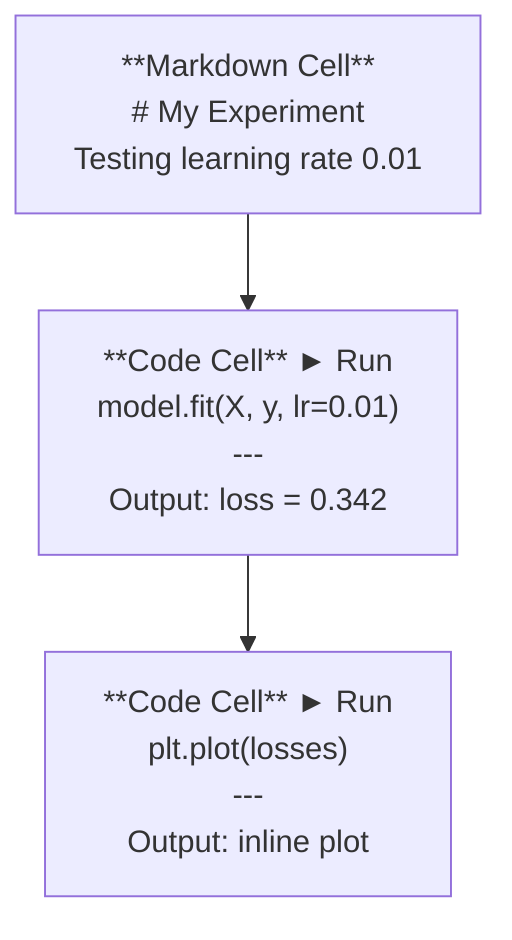
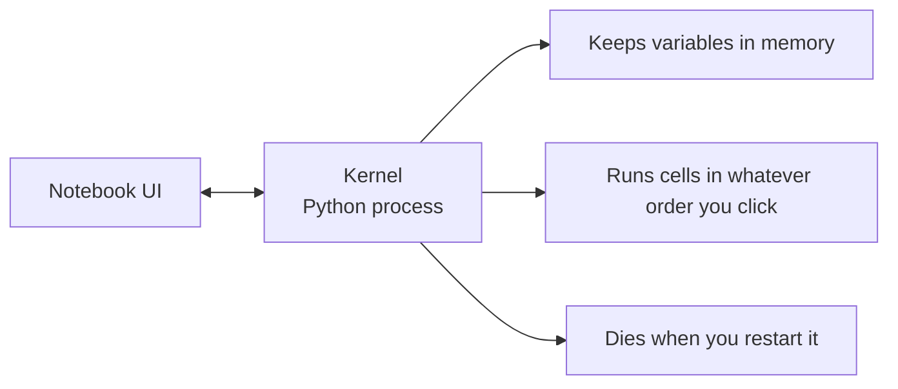

# كتيبات الملاحظات Jupyter

> أجهزة المكتب الملاحظة هي مقعد المختبر لمهندسة الذكاء الاصطناعي. أنت تقوم بتصميم أول نموذج هنا، ثم نقلب ما يعمل إلى الإنتاج.

**Type:** Build
**Languages:** Python
**Prerequisites:** Phase 0, Lesson 01
**Time:** ~30 minutes

## أهداف التعلم

- تثبيت وإطلاق JupyterLab، Jupyter Notebook، أو VS Code مع تمديد Jupyter
- استخدم الأوامر السحرية (`%timeit`،`%%time`،`%matplotlib inline`) لتقييم الموازنة وتصور الخطوط الداخلية
- تمييز بين متى تستخدم المكتبات الملاحظة مقابل النصوص وتطبيق سير العمل "استكشاف في المكتبات الملاحظة، شحن في النصوص"
- تحديد وتجنب فخ المكتبات المكتوبة الشائعة: التنفيذ خارج النظام، الحالة الخفية، وتسربات الذاكرة

## المشكلة

كل ورقة الذكاء الاصطناعي، والدروسات، والمسابقات كاجل تستخدم كابينة ملاحظة جوبيتر. يسمحون لك بتشغيل الكود في قطع، ورؤية الخروقات في خط، ومزيج الكود مع التفسيرات، وتكرار بسرعة. إذا حاولت تعلم الذكاء الاصطناعي دون كابينة ملاحظة، كنت تفعل واجبات رياضية دون رسالة خدش.

لكن المكتبات لديها فخ حقيقية الناس يستخدمونها لكل شيء بما في ذلك الأشياء التي هم فظيعون فيها معرفة متى تستخدم المكتبة ومتى تستخدم السيناريو سوف تنقذك من إصلاح الكوابيس في وقت لاحق

## المفهوم

دفتر ملاحظات هو قائمة من الخلايا. كل خلية هي إما رمز أو نص.



النواة هي عملية بيثون تعمل في الخلفية. عندما تقوم بتشغيل خلية، فإنها ترسل الرمز إلى النواة، التي تنفذها وتعيد النتيجة. جميع الخلايا تشارك نفس النواة، لذلك تبقى المتغيرات بين الخلايا.



هذا الجزء "أياً كان الطلب الذي تنقر عليه" هو كل من القوة العظمى والمسدس.

```figure
s0-cell-order
```

## بناءها

### الخطوة 1: اختر واجهتك

ثلاثة خيارات، شكل واحد:

| Interface | Install | Best for |
|-----------|---------|----------|
| JupyterLab | `pip install jupyterlab` then `jupyter lab` | Full IDE experience, multiple tabs, file browser, terminal |
| Jupyter Notebook | `pip install notebook` then `jupyter notebook` | Simple, lightweight, one notebook at a time |
| VS Code | Install "Jupyter" extension | Already in your editor, git integration, debugging |

كل ثلاثة يقرأون و يكتبون نفس الشيء`.ipynb`الملفات. اختر ما تشاء. جوبيتر لاب هو الأكثر شيوعا في العمل الذكاء الاصطناعي.

```bash
pip install jupyterlab
jupyter lab
```

### الخطوة الثانية: اختصارات لوحة المفاتيح التي تهم

تعملين في وضعين.`Escape`لنظام الأوامر (الشرط الأزرق على اليسار) ، `Enter`لنظام التحرير (المقرب الأخضر).

**Command mode (most used):**

| Key | Action |
|-----|--------|
| `Shift+Enter` | Run cell, move to next |
| `A` | Insert cell above |
| `B` | Insert cell below |
| `DD` | Delete cell |
| `M` | Convert to markdown |
| `Y` | Convert to code |
| `Z` | Undo cell operation |
| `Ctrl+Shift+H` | Show all shortcuts |

**Edit mode:**

| Key | Action |
|-----|--------|
| `Tab` | Autocomplete |
| `Shift+Tab` | Show function signature |
| `Ctrl+/` | Toggle comment |

`Shift+Enter`هو واحد ستستخدمها ألف مرة في اليوم، تعلمها أولاً.

### الخطوة الثالثة: أنواع الخلايا

**Code cells**تشغيل Python وتظهر الخروج:

```python
import numpy as np
data = np.random.randn(1000)
data.mean(), data.std()
```

الناتج: `(0.0032, 0.9987)`

**Markdown cells**إرسال النص المنسق. استخدمهم لتوثيق ما تفعلونه ولماذا. يدعم العناوين، الكثافة، الصفحة المقطعية، رياضيات لاتيكس (`$E = mc^2$`الجداول والصور

### الخطوة الرابعة: أوامر سحرية

هذه ليست بيثون، إنها أوامر خاصة بـ (جوبيتر) تبدأ بـ`%`(سحر الخط) أو `%%`(سحر الخلايا).

**Time your code:**

```python
%timeit np.random.randn(10000)
```

الناتج: `45.2 us +/- 1.3 us per loop`

```python
%%time
model.fit(X_train, y_train, epochs=10)
```

الناتج: `Wall time: 2.34 s`

`%timeit`يُشغّل الرمز عدة مرات ومتوسطات. `%%time`أستخدمها مرة واحدة`%timeit`لـ "ميكروبنش مارك"`%%time`لرحلات التدريب

**Enable inline plots:**

```python
%matplotlib inline
```

كلّ شخص`plt.plot()`أو`plt.show()`الآن يُسجل مباشرةً في دفتر الملاحظات

**Install packages without leaving the notebook:**

```python
!pip install scikit-learn
```

- نعم`!`المُضاف يُشغّل أيّ أمر قذيفة.

**Check environment variables:**

```python
%env CUDA_VISIBLE_DEVICES
```

### الخطوة 5: عرض الناتج الغني في الخط

أجهزة الملاحظات تظهر تلقائيًا آخر تعبير في الخلية، ولكن يمكنك التحكم بها:

```python
import pandas as pd

df = pd.DataFrame({
    "model": ["Linear", "Random Forest", "Neural Net"],
    "accuracy": [0.72, 0.89, 0.94],
    "training_time": [0.1, 2.3, 45.6]
})
df
```

هذا يعطي جدول HTML مقسوم، وليس مخزن نص. نفس الشيء مع السطحات:

```python
import matplotlib.pyplot as plt

plt.figure(figsize=(8, 4))
plt.plot([1, 2, 3, 4], [1, 4, 2, 3])
plt.title("Inline Plot")
plt.show()
```

يظهر المسار مباشرة تحت الخلية. هذا هو السبب في أن المكتبات تهيمن على عمل الذكاء الاصطناعي. يمكنك رؤية البيانات، المسار، والرقم معا.

للصور:

```python
from IPython.display import Image, display
display(Image(filename="architecture.png"))
```

### الخطوة 6: Google Colab

كولاب هو حاسوب يوبيتر مجاني في السحابة. يمنحك GPU، مكتبات مثبتة مسبقا، وتكامل Google Drive. لا توجد إعدادات مطلوبة.

1. إذهب إلى[colab.research.google.com](https://colab.research.google.com)
2. قم بتحميل أي `.ipynb`الملف من هذه الدورة
3. وقت تشغيل > تغيير نوع وقت تشغيل > GPU T4 (بجانب)

اختلافات في الـ Colab عن الـ Jupyter المحلي:
- لا تستمر الملفات بين الجلسات (إلا في القيادة أو التنزيل)
- المثبتة مسبقاً: نومبي، باندا، ماتبلوتليب، مشعل، تنسروفلو، سلكارن
- `from google.colab import files`لتحميل/تنزيل الملفات
- `from google.colab import drive; drive.mount('/content/drive')`للتخزين المستمر
- وقت الإجراءات بعد 90 دقيقة من عدم النشاط (مستوى مجاني)

## استخدمها

### المكتبات الملاحظة مقابل النصوص: متى تستخدم أي

| Use notebooks for | Use scripts for |
|-------------------|-----------------|
| Exploring a dataset | Training pipelines |
| Prototyping a model | Reusable utilities |
| Visualizing results | Anything with `if __name__` |
| Explaining your work | Code that runs on a schedule |
| Quick experiments | Production code |
| Course exercises | Packages and libraries |

القاعدة:**explore in notebooks, ship in scripts**. . .

سير عمل شائع في الذكاء الاصطناعي:
1. استكشاف البيانات في دفتر الملاحظات
2. النموذج الأول في دفتر الملاحظات
3. بمجرد أن يعمل، نقلها إلى `.py`الملفات
4. استيراد تلك`.py`الملفات إلى المذكرة لمزيد من التجارب

### الفخاخ الشائعة

**Out-of-order execution.**تقوم بتشغيل الخلية 5، ثم الخلية 2، ثم الخلية 7. يعمل المذكرة على جهازك ولكن تتعطل عندما يقوم شخص ما بتشغيلها من أعلى إلى أسفل.

**Hidden state.**تقوم بحذف خلية ولكن المتغير الذي أنشأه لا يزال في الذاكرة. يبدو دفتر الملاحظات نظيفاً لكنه يعتمد على خلية شبح.

**Memory leaks.**تحميل مجموعة بيانات 4 جيجابايت، تدريب نموذج، تحميل مجموعة بيانات أخرى. لا شيء يتم تحريره.`del variable_name`و`gc.collect()`أو إعادة تشغيل النواة

## أرسله

هذا الدرس ينتج عن:
- `outputs/prompt-notebook-helper.md`لإعداد إصدارات إصدارات الملاحظات

## التمارين

1. افتح JupyterLab، و إخلق دفتر ملاحظات، واستخدم `%timeit`مقارنة فهم القائمة مقابل النمبي لإنشاء صف من 100،000 عدد عشوائي
2. قم بإنشاء دفتر ملاحظات مع كل من خلايى التسجيل والكود التي تحميل CSV، وعرض إطار بيانات، وتخطيط الرسم البياني. ثم تشغيل الكرنيل > إعادة تشغيل وتشغيل كل للتحقق من أنها تعمل من أعلى إلى أسفل
3. خذ الرمز من`code/notebook_tips.py`، ضعه في دفتر ملاحظات كولاب ، و تشغيله مع جهاز GPU مجاني

## الشروط الرئيسية

| Term | What people say | What it actually means |
|------|----------------|----------------------|
| Kernel | "The thing running my code" | A separate Python process that executes cells and keeps variables in memory |
| Cell | "A code block" | An independently runnable unit in a notebook, either code or markdown |
| Magic command | "Jupyter tricks" | Special commands prefixed with `%` or `%%` that control the notebook environment |
| `.ipynb` | "Notebook file" | A JSON file containing cells, outputs, and metadata. Stands for IPython Notebook |

## المزيد من القراءة

- [JupyterLab Docs](https://jupyterlab.readthedocs.io/)لجميع مجموعة الميزات
- [Google Colab FAQ](https://research.google.com/colaboratory/faq.html)لحدات وخصائص خاصة بالكولاب
- [28 Jupyter Notebook Tips](https://www.dataquest.io/blog/jupyter-notebook-tips-tricks-shortcuts/)لقطع مختصر لمستخدم الطاقة
