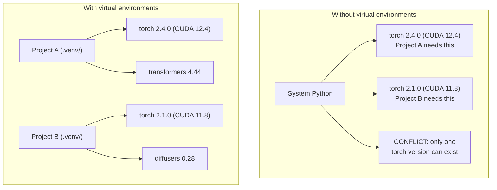

# بيئة Python

> الجحيم الإعتماد حقيقي، البيئات الافتراضية هي العلاج

**Type:** Build
**Languages:** Shell
**Prerequisites:** Phase 0, Lesson 01
**Time:** ~30 minutes

## أهداف التعلم

- إعداد بيئات افتراضية معزولة باستخدام `uv`،`venv`أو`conda`
- اكتب`pyproject.toml`مع مجموعات الاعتماد الاختيارية و توليد ملفات القفل من أجل قابلية التكرار
- التشخيص وإصلاح الحيل الشائعة: التثبيتات العالمية، اختلاط المواد المزروعة والكود، عدم مطابقة إصدارات CUDA
- تنفيذ استراتيجية بيئية على مراحل للمشاريع التي تتعارض مع الاعتمادات

## المشكلة

تقوم بتثبيت PyTorch 2.4 لمشروع التنسيق الدقيق. الأسبوع المقبل، مشروع آخر يحتاج PyTorch 2.1 لأن بناء CUDA له محصوم. تقوم بتحديث عالمي، ويتوقف المشروع الأول. تخفض الترتيب، ويتوقف الثاني.

هذا هو الجحيم الاعتماد. يحدث باستمرار في العمل الذكاء الاصطناعي / ML لأن:

- (بيتورش) ، (جاكس) ، و (تنسور فلو) كل واحد يُرسل خطة (كودا) الخاصة به
- المكتبات النموذجية تعطي إصدارات إطار محددة
- عالمية`pip install`يكتب ما كان هناك من قبل
- إن إعدادات CUDA 11.8 لا تعمل مع برامج تشغيل CUDA 12.x (و العكس)

الحل: كل مشروع يحصل على بيئة معزولة مع حزمة خاصة به.

## المفهوم



```figure
s0-env-isolation
```

## بناءها

### الخيار 1: uv venv (توصيبه)

`uv`هو أسرع مدير حزم Python (10-100 مرة أسرع من pip). إنه يتعامل مع البيئات الافتراضية ، وإصدارات Python ، وقرار الاعتماد في أداة واحدة.

```bash
curl -LsSf https://astral.sh/uv/install.sh | sh

uv python install 3.12

cd your-project
uv venv
source .venv/bin/activate
```

إعداد الحزم:

```bash
uv pip install torch numpy
```

إعداد مشروع مع `pyproject.toml`في خطوة واحدة:

```bash
uv init my-ai-project
cd my-ai-project
uv add torch numpy matplotlib
```

### الخيار الثاني: venv (المبني)

إذا لم تستطع تثبيتها`uv`، سفن (بايتون) مع`venv`:

```bash
python3 -m venv .venv
source .venv/bin/activate  # Linux/macOS
.venv\Scripts\activate     # Windows

pip install torch numpy
```

أبطأ من`uv`، ولكنه يعمل في كل مكان يتم تثبيته

### الخيار الثالث: الكوندا (عندما تحتاجها)

تقوم "كوندا" بإدارة الاعتمادات غير البايتونية مثل مجموعات أدوات "CUDA" و "cuDNN" و "C" المكتبات. استخدمه عندما:

- تحتاج إلى نسخة محددة من مجموعة أدوات CUDA دون تثبيتها على مستوى النظام
- أنت على مجموعة مشتركة حيث لا يمكنك تثبيت حزم النظام
- تعليمات تثبيت المكتبة تقول "استخدم الكوندا"

```bash
# Install miniconda (not the full Anaconda)
curl -LsSf https://repo.anaconda.com/miniconda/Miniconda3-latest-Linux-x86_64.sh -o miniconda.sh
bash miniconda.sh -b

conda create -n myproject python=3.12
conda activate myproject

conda install pytorch torchvision torchaudio pytorch-cuda=12.4 -c pytorch -c nvidia
```

قاعدة واحدة: إذا كنت تستخدم conda لبيئة، استخدم conda لجميع الحزم في تلك البيئة.`pip install`في حالة تعرض لخطر الإصابة تسبب صراعات الاعتماد التي تكون مؤلمة للتحليل

### لهذا الدورة: استراتيجية في كل مرحلة

يمكنك إنشاء بيئة واحدة لدورة كاملة لا تفعل. المراحل المختلفة تحتاج إلى اعتمادات مختلفة (أحياناً متناقضة)

الاستراتيجية:

```
ai-engineering-from-scratch/
├── .venv/                    <-- shared lightweight env for phases 0-3
├── phases/
│   ├── 04-neural-networks/
│   │   └── .venv/            <-- PyTorch env
│   ├── 05-cnns/
│   │   └── .venv/            <-- same PyTorch env (symlink or shared)
│   ├── 08-transformers/
│   │   └── .venv/            <-- might need different transformer versions
│   └── 11-llm-apis/
│       └── .venv/            <-- API SDKs, no torch needed
```

النص في`code/env_setup.sh`يخلق بيئة أساسية لهذا الدورة.

## pyproject.toml أساسيات

كل مشروع بايثون يجب أن يكون له`pyproject.toml`إنه يُستبدل`setup.py`،`setup.cfg`و`requirements.txt`في ملف واحد

```toml
[project]
name = "ai-engineering-from-scratch"
version = "0.1.0"
requires-python = ">=3.11"
dependencies = [
    "numpy>=1.26",
    "matplotlib>=3.8",
    "jupyter>=1.0",
    "scikit-learn>=1.4",
]

[project.optional-dependencies]
torch = ["torch>=2.3", "torchvision>=0.18"]
llm = ["anthropic>=0.39", "openai>=1.50"]
```

ثم قم بتثبيت:

```bash
uv pip install -e ".[torch]"    # base + PyTorch
uv pip install -e ".[llm]"     # base + LLM SDKs
uv pip install -e ".[torch,llm]" # everything
```

## أوراق القفل

يقوم ملف قفل بتحديد كل إعتماد (بما في ذلك الإصدارات المتغيرة) إلى نسخة دقيقة. وهذا يضمن قابلية التكرار: أي شخص يثبت من ملف القفل يحصل على نفس الحزم بالضبط.

```bash
# uv generates uv.lock automatically when using uv add
uv add numpy

# pip-tools approach
uv pip compile pyproject.toml -o requirements.lock
uv pip install -r requirements.lock
```

إرسال ملف القفل الخاص بك إلى git عندما يقوم شخص ما بتنسيق repo، يقومون بتثبيت من الملف القفل ويحصلون على نسخ متطابقة.

## الأخطاء الشائعة

### 1. التثبيت على مستوى العالم

```bash
pip install torch  # BAD: installs to system Python

source .venv/bin/activate
pip install torch  # GOOD: installs to virtual environment
```

تحقق من مكان حزمك

```bash
which python       # should show .venv/bin/python, not /usr/bin/python
which pip           # should show .venv/bin/pip
```

### 2. خليط البيب و الكوندا

```bash
conda create -n myenv python=3.12
conda activate myenv
conda install pytorch -c pytorch
pip install some-other-package   # BAD: can break conda's dependency tracking
conda install some-other-package # GOOD: let conda manage everything
```

إذا كان عليك استخدام pip داخل conda (بعض الحزم هي فقط حزمة) ، قم بتثبيت جميع حزمة conda أولاً، ثم حزمة pip تستمر.

### 3. نسيان تفعيل

```bash
python train.py           # uses system Python, missing packages
source .venv/bin/activate
python train.py           # uses project Python, packages found
```

يجب أن يظهر طلب القبو اسم البيئة:

```
(.venv) $ python train.py
```

### 4. التزام . ونف إلى git

```bash
echo ".venv/" >> .gitignore
```

البيئات الافتراضية هي 200 ميغابايت إلى 2 جيجابايت. إنها محلية، ليست محمولة بين الآلات.`pyproject.toml`وبدلاً من ذلك، قفل الملف

### 5. إصدار CUDA غير متطابق

```bash
nvidia-smi                # shows driver CUDA version (e.g., 12.4)
python -c "import torch; print(torch.version.cuda)"  # shows PyTorch CUDA version

# These must be compatible.
# PyTorch CUDA version must be <= driver CUDA version.
```

## استخدمها

قم بتشغيل النص الإعدادي لإنشاء بيئة الدورة:

```bash
bash phases/00-setup-and-tooling/06-python-environments/code/env_setup.sh
```

هذا يخلق`.venv`في الجذر الاحتياطي مع الاعتمادات الأساسية مثبتة ومحققة.

## التمارين

1. أركض`env_setup.sh`و التحقق من أن جميع الفحصات تمت
2. إنشاء بيئة افتراضية ثانية، وتثبيت نسخة مختلفة من numpy في ذلك، وتأكيد البيئتين منفصلة
3. اكتب`pyproject.toml`لمشروع يحتاج كل من PyTorch و SDK Anthropic
4. قم بتثبيت حزمة عمداً عالمياً (بدون تفعيل venv) ، لاحظ أين تذهب، ثم إزالتها

## الشروط الرئيسية

| Term | What people say | What it actually means |
|------|----------------|----------------------|
| Virtual environment | "A venv" | An isolated directory containing a Python interpreter and packages, separate from the system Python |
| Lockfile | "Pinned dependencies" | A file listing every package and its exact version, guaranteeing identical installs across machines |
| pyproject.toml | "The new setup.py" | The standard Python project configuration file, replacing setup.py/setup.cfg/requirements.txt |
| Transitive dependency | "A dependency of a dependency" | Package B depends on C; if you install A which depends on B, C is a transitive dependency of A |
| CUDA mismatch | "My GPU isn't working" | PyTorch was compiled for a different CUDA version than what your GPU driver supports |
