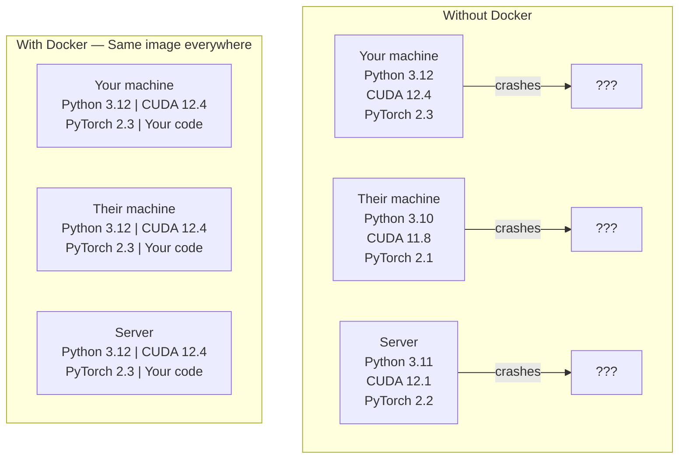

# "دوكر" لـ"AI"

> الحاويات تجعل "العمل على آلتي" شيء من الماضي.

**Type:** Build
**Languages:** Docker
**Prerequisites:** Phase 0, Lessons 01 and 03
**Time:** ~60 minutes

## أهداف التعلم

- قم ببناء صورة Docker معتمدة على GPU مع مكتبات CUDA و PyTorch و AI من ملف Docker
- قم بتصميم المجلدات المضيفة كحجم لمواصلة النماذج ومجموعات البيانات والرموز عبر إعادة بناء الحاويات
- قم بتشغيل مجموعة أدوات NVIDIA Container لتعرض GPUs داخل الحاويات
- قم بتنظيم تطبيقات الذكاء الاصطناعي متعددة الخدمات (خادم المعلومات + قاعدة بيانات المتجهات) باستخدام Docker Compose

## المشكلة

لقد تدربت نموذج على جهاز الكمبيوتر المحمول الخاص بك مع PyTorch 2.3، CUDA 12.4، و Python 3.12. زميلك لديه PyTorch 2.1، CUDA 11.8، و Python 3.10.

مشاريع الذكاء الاصطناعي هي كوابيس الاعتماد. مجموعة نموذجية تشمل Python، PyTorch، مدفعي CUDA، cuDNN، مكتبات على مستوى النظام C، والحزم المتخصصة مثل flash-attn التي تحتاج إلى إصدارات محفزة دقيقة. Docker يحزم كل هذا في صورة واحدة التي تعمل بشكل متطابق في كل مكان.

## المفهوم

يلف Docker كودك ومرحلة تشغيله ومكتباتك وأدوات النظام في وحدة معزولة تسمى حاوية. فكر في ذلك كمحرك افتراضي خفيف الوزن، إلا أنه يشارك في جوهر نظام التشغيل المضيف بدلاً من تشغيل نفسه، لذلك يبدأ في ثواني بدلاً من دقائق.



### لماذا تحتاج مشاريع الذكاء الاصطناعي إلى Docker أكثر من معظم

1. **GPU drivers are fragile.**لا يعمل رمز CUDA 12.4 على CUDA 11.8. يُعزل Docker مجموعة أدوات CUDA داخل الحاوية أثناء مشاركة مدير GPU المضيف من خلال مجموعة أدوات حاوية NVIDIA.

2. **Model weights are large.**نموذج معايير 7B هو 14 جيجابايت في fp16. لا تريد إعادة تنزيلها في كل مرة تقوم فيها بإعادة بناء. يسمح لك أحجام Docker بتثبيت دليل النماذج من المضيف.

3. **Multi-service architectures are common.**تطبيق الذكاء الاصطناعي الحقيقي ليس مجرد نص بيثون. إنه خادم استنتاج، قاعدة بيانات متجهة لـ RAG، ربما محطة على شبكة الإنترنت. Docker Compose ينسق كل هذا بأمر واحد.

### المفردات الرئيسية

| Term | What it means |
|------|---------------|
| Image | A read-only template. Your recipe. Built from a Dockerfile. |
| Container | A running instance of an image. Your kitchen. |
| Dockerfile | Instructions to build an image. Layer by layer. |
| Volume | Persistent storage that survives container restarts. |
| docker-compose | A tool for defining multi-container applications in YAML. |

### أنماط الحاويات الشائعة في الذكاء الاصطناعي

```
Dev Container
  Full toolkit. Editor support. Jupyter. Debugging tools.
  Used during development and experimentation.

Training Container
  Minimal. Just the training script and dependencies.
  Runs on GPU clusters. No editor, no Jupyter.

Inference Container
  Optimized for serving. Small image. Fast cold start.
  Runs behind a load balancer in production.
```

```figure
s0-image-layers
```

## بناءها

### الخطوة الأولى: تثبيت Docker

```bash
# macOS
brew install --cask docker
open /Applications/Docker.app

# Ubuntu
curl -fsSL https://get.docker.com | sh
sudo usermod -aG docker $USER
# Log out and back in for group change to take effect
```

التحقق من:

```bash
docker --version
docker run hello-world
```

### الخطوة 2: قم بتثبيت مجموعة أدوات حاويات NVIDIA (لينكس مع GPU NVIDIA)

يسمح هذا للحاويات Docker بالوصول إلى GPU الخاص بك. يمكن لمستخدمي macOS و Windows (WSL2) تخطي هذا؛ Docker Desktop يتعامل مع GPU عبر مختلفة على تلك المنصات.

```bash
distribution=$(. /etc/os-release;echo $ID$VERSION_ID)
curl -fsSL https://nvidia.github.io/libnvidia-container/gpgkey | sudo gpg --dearmor -o /usr/share/keyrings/nvidia-container-toolkit-keyring.gpg
curl -s -L https://nvidia.github.io/libnvidia-container/$distribution/libnvidia-container.list | \
    sed 's#deb https://#deb [signed-by=/usr/share/keyrings/nvidia-container-toolkit-keyring.gpg] https://#g' | \
    sudo tee /etc/apt/sources.list.d/nvidia-container-toolkit.list

sudo apt-get update
sudo apt-get install -y nvidia-container-toolkit
sudo nvidia-ctk runtime configure --runtime=docker
sudo systemctl restart docker
```

اختبار وصول GPU داخل الحاوية:

```bash
docker run --rm --gpus all nvidia/cuda:12.4.1-base-ubuntu22.04 nvidia-smi
```

إذا رأيت معلومات المصفوفات، فإن مجموعة الأدوات تعمل.

### الخطوة الثالثة: فهم الصور الأساسية

اختيار الصورة الأساسية الصحيحة يوفر ساعات من التحليل

```
nvidia/cuda:12.4.1-devel-ubuntu22.04
  Full CUDA toolkit. Compilers included.
  Use for: building packages that need nvcc (flash-attn, bitsandbytes)
  Size: ~4 GB

nvidia/cuda:12.4.1-runtime-ubuntu22.04
  CUDA runtime only. No compilers.
  Use for: running pre-built code
  Size: ~1.5 GB

pytorch/pytorch:2.6.0-cuda12.4-cudnn9-runtime
  PyTorch pre-installed on top of CUDA.
  Use for: skipping the PyTorch install step
  Size: ~6 GB

python:3.12-slim
  No CUDA. CPU only.
  Use for: inference on CPU, lightweight tools
  Size: ~150 MB
```

### الخطوة الرابعة: كتابة ملف Docker للتطوير الذكاء الاصطناعي

هنا هو الملف الدوكر في`code/Dockerfile`تمشي من خلالها

```dockerfile
FROM nvidia/cuda:12.4.1-devel-ubuntu22.04

ENV DEBIAN_FRONTEND=noninteractive
ENV PYTHONUNBUFFERED=1

RUN apt-get update && apt-get install -y --no-install-recommends \
    software-properties-common \
    git \
    curl \
    build-essential \
    && add-apt-repository -y ppa:deadsnakes/ppa \
    && apt-get update && apt-get install -y --no-install-recommends \
    python3.12 \
    python3.12-venv \
    python3.12-dev \
    && rm -rf /var/lib/apt/lists/*

RUN update-alternatives --install /usr/bin/python python /usr/bin/python3.12 1

RUN curl -sSL https://raw.githubusercontent.com/pypa/get-pip/3b73145063be545b649ad9ca83ea8da5fc915a4f/public/get-pip.py -o /tmp/get-pip.py \
    && echo "a341e1a43e38001c551a1508a73ff23636a11970b61d901d9a1cad2a18f57055  /tmp/get-pip.py" | sha256sum -c - \
    && python /tmp/get-pip.py \
    && rm /tmp/get-pip.py \
    && update-alternatives --install /usr/bin/pip pip /usr/local/bin/pip3.12 1

RUN python -m pip install --no-cache-dir --upgrade pip setuptools wheel

RUN python -m pip install --no-cache-dir \
    torch==2.6.0+cu124 \
    torchvision==0.21.0+cu124 \
    torchaudio==2.6.0+cu124 \
    --index-url https://download.pytorch.org/whl/cu124

RUN python -m pip install --no-cache-dir \
    numpy \
    pandas \
    scikit-learn \
    matplotlib \
    jupyter \
    transformers \
    datasets \
    accelerate \
    safetensors

WORKDIR /workspace

VOLUME ["/workspace", "/models"]

EXPOSE 8888

CMD ["python"]
```

بناءه:

```bash
docker build -t ai-dev -f phases/00-setup-and-tooling/07-docker-for-ai/code/Dockerfile .
```

يستغرق هذا بعض الوقت في المرة الأولى (تحميل صورة أساسية CUDA + PyTorch). تستخدم المكونات اللاحقة طبقات مخزن.

إشغله

```bash
docker run --rm -it --gpus all \
    -v $(pwd):/workspace \
    -v ~/models:/models \
    ai-dev python -c "import torch; print(f'PyTorch {torch.__version__}, CUDA: {torch.cuda.is_available()}')"
```

أطلقوا " جوبيتر " داخل الحاوية:

```bash
docker run --rm -it --gpus all \
    -v $(pwd):/workspace \
    -v ~/models:/models \
    -p 8888:8888 \
    ai-dev jupyter notebook --ip=0.0.0.0 --port=8888 --no-browser --allow-root
```

### الخطوة 5: مقاعد حجم للبيانات والنماذج

إنّ محطات الحجم مهمة للعمل الذكيّ. بدونها، ستختفي تحميلات النموذج البالغ عددها 14 جيجا غيترا عندما يتوقف الحاوية.

```bash
# Mount your code
-v $(pwd):/workspace

# Mount a shared models directory
-v ~/models:/models

# Mount datasets
-v ~/datasets:/data
```

داخل نص التدريب الخاص بك، الحمل من المسار المثبت:

```python
from transformers import AutoModel

model = AutoModel.from_pretrained("/models/llama-7b")
```

النموذج يعيش على نظام الملفات المضيفة اعيد بناء الحاوية بقدر ما تريد دون إعادة التنزيل

### الخطوة 6: Docker Compose للتطبيقات الذكاء الاصطناعي متعددة الخدمات

تطبيق RAG الحقيقي يحتاج إلى خادم استنتاج وقاعدة بيانات متجهة. Docker Compose يعمل على كل منهما بأمر واحد.

انظر`code/docker-compose.yml`:

```yaml
services:
  ai-dev:
    build:
      context: .
      dockerfile: Dockerfile
    deploy:
      resources:
        reservations:
          devices:
            - driver: nvidia
              count: all
              capabilities: [gpu]
    volumes:
      - ../../../:/workspace
      - ~/models:/models
      - ~/datasets:/data
    ports:
      - "8888:8888"
    stdin_open: true
    tty: true
    command: jupyter notebook --ip=0.0.0.0 --port=8888 --no-browser --allow-root

  qdrant:
    image: qdrant/qdrant:v1.12.5
    ports:
      - "6333:6333"
      - "6334:6334"
    volumes:
      - qdrant_data:/qdrant/storage

volumes:
  qdrant_data:
```

ابدأ كل شيء

```bash
cd phases/00-setup-and-tooling/07-docker-for-ai/code
docker compose up -d
```

الآن حاوية تطوير الذكاء الاصطناعي الخاصة بك يمكن الوصول إلى قاعدة بيانات المتجهات في `http://qdrant:6333`أيدوليكر كومبوز يخلق شبكة مشتركة تلقائياً

اختبر الاتصال من داخل حاوية الذكاء الاصطناعي:

```python
from qdrant_client import QdrantClient

client = QdrantClient(host="qdrant", port=6333)
print(client.get_collections())
```

توقف كل شيء

```bash
docker compose down
```

إضافة`-v`أيضاً حذف حجم qdrant:

```bash
docker compose down -v
```

### الخطوة 7: أوامر Docker المفيدة لعمل الذكاء الاصطناعي

```bash
# List running containers
docker ps

# List all images and their sizes
docker images

# Remove unused images (reclaim disk space)
docker system prune -a

# Check GPU usage inside a running container
docker exec -it <container_id> nvidia-smi

# Copy a file from container to host
docker cp <container_id>:/workspace/results.csv ./results.csv

# View container logs
docker logs -f <container_id>
```

## استخدمها

لديك الآن بيئة تطوير الذكاء الاصطناعي قابلة للتكرار.

- استخدام`docker compose up`لبدء البيانات البيانية البيانية و البيانات البيانية
- قم بتجميع كودك ونماذجك وبياناتك كجزء من الكتلة حتى لا يضيع أي شيء بين إعادة البناء
- عندما يتطلب درساً حزمة Python جديدة، أضفها إلى ملف Docker و أعد بناءها
- شارك ملفك مع زملائك في الفريق، يحصلون على نفس البيئة بالضبط

### لا يوجد معالجة معالجة؟

إزالة`--gpus all`لا يزال الحاوية تعمل للدرس القائم على المعالجة المركزية. يكتشف PyTorch غياب CUDA ويعود إلى المعالجة المركزية تلقائيا.

## التمارين

1. قم بإنشاء الملف الدوكر وتشغيل`python -c "import torch; print(torch.__version__)"`داخل الحاوية
2. إبدأ بثقة المكونات المكونة من المرفق وتحقق من إمكانية الوصول إلى Qdrant من حاوية الذكاء الاصطناعي في `http://qdrant:6333/collections`
3. إضافة`flask`إلى ملف دوكر، إعادة بناء، وإدارة خادم API بسيط على ميناء 5000. خريطة البورط مع `-p 5000:5000`
4. قياس حجم الصورة مع `docker images`حاولي تغيير الصورة الأساسية من`devel`إلى`runtime`و مقارنة الأحجام

## الشروط الرئيسية

| Term | What people say | What it actually means |
|------|----------------|----------------------|
| Container | "Lightweight VM" | An isolated process using the host kernel, with its own filesystem and network |
| Image layer | "Cached step" | Each Dockerfile instruction creates a layer. Unchanged layers are cached, so rebuilds are fast. |
| NVIDIA Container Toolkit | "GPU in Docker" | A runtime hook that exposes host GPUs to containers via `--gpus` flag |
| Volume mount | "Shared folder" | A directory on the host mapped into the container. Changes persist after the container stops. |
| Base image | "Starting point" | The `FROM` image your Dockerfile builds on top of. Determines what is pre-installed. |
