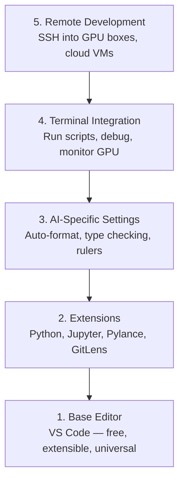

# إعداد المحرر

> محررك هو مساعدك في الطيران، قم بتهيئها مرة واحدة حتى لا تخرج من طريقك وتبدأ في سحب وزنها

**Type:** Build
**Languages:** --
**Prerequisites:** Phase 0, Lesson 01
**Time:** ~20 minutes

## أهداف التعلم

- قم بتثبيت VS Code مع التوسعات الأساسية لـ Python و Jupyter و linting و SSH عن بعد
- إعداد تنسيق على حفظ، وتحقق من النوع، وتحريك خروج المكتبة للجوارات العملية الذكية
- قم بتعيين SSH عن بعد لتحرير وتحليل الكود على أجهزة GPU عن بعد كما لو كانت محلية
- تقييم بدائل المحرر (Cursor و Windsurf و Neovim) وتبادلاتها لعمل الذكاء الاصطناعي

## المشكلة

سوف تقضي آلاف الساعات داخل المحرر بكتابة Python، وتشغيل المكتبات الملاحظة، وتحليل خيوط التدريب، وتضمين SSH في مربعات GPU. محرر غير مُهيِّن يُحول كل جلسة إلى اصطدام: لا تكميل تلقائي، لا تلميحات النص، لا أخطاء داخل الخط، وصيغة يدوية، وتدفق عمل محطّي غير مسموح.

الإعداد الصحيح يستغرق 20 دقيقة، وتقفز من ذلك يكلفك 20 دقيقة كل يوم.

## المفهوم

إنشاء محرر هندسي الذكاء الاصطناعي يحتاج إلى خمسة أشياء:



```figure
s0-lsp-roundtrip
```

## بناءها

### الخطوة 1: قم بتثبيت رمز VS

VS Code هو المحرر الموصى به. إنه مجاني، يعمل على كل نظام تشغيل، ويحتوي على دعم لمكتبات جوبيتر من الدرجة الأولى، ويتغطي النظام البيئي التوسيعي كل ما تحتاجه للعمل الذكاء الاصطناعي.

قم بتنزيلها من [code.visualstudio.com](https://code.visualstudio.com/). . .

التحقق من المحطة:

```bash
code --version
```

إذا`code`لا يوجد على macOS، افتح VS Code، اضغط `Cmd+Shift+P`، وتدخل "أوامر القبو"، و اختر "ثمّن "رمز" في PATH".

### الخطوة الثانية: قم بتثبيت الإضافات الضرورية

افتح المحطة المتكاملة في رمز VS (`` Ctrl+`على كل منصة) ووضع التوسعات التي تهم العمل في الذكاء الاصطناعي:

```bash
code --install-extension ms-python.python
code --install-extension ms-python.vscode-pylance
code --install-extension ms-toolsai.jupyter
code --install-extension eamodio.gitlens
code --install-extension ms-vscode-remote.remote-ssh
code --install-extension ms-python.debugpy
code --install-extension ms-python.black-formatter
code --install-extension charliermarsh.ruff
```

ما يفعله كل واحد:

| Extension | Why |
|-----------|-----|
| Python | Language support, virtual env detection, run/debug |
| Pylance | Fast type checking, autocomplete, import resolution |
| Jupyter | Run notebooks inside VS Code, variable explorer |
| GitLens | See who changed what, inline git blame |
| Remote SSH | Open a folder on a remote GPU box as if it were local |
| Debugpy | Step-through debugging for Python |
| Black Formatter | Auto-format on save, consistent style |
| Ruff | Fast linting, catches common mistakes |

الملف`code/.vscode/extensions.json`في هذه الدروس تحتوي على قائمة التوصيات الكاملة. عند فتح مجلد المشروع، سيطلب منك VS Code تثبيتها.

### الخطوة الثالثة: إعداد الإعدادات

نسخ الإعدادات من `code/.vscode/settings.json`في هذه الدروس، أو تطبيقها يدويا من خلال `Settings > Open Settings (JSON)`. . .

الإعدادات الرئيسية لعمل الذكاء الاصطناعي:

```jsonc
{
    "python.analysis.typeCheckingMode": "basic",
    "editor.formatOnSave": true,
    "editor.rulers": [88, 120],
    "notebook.output.scrolling": true,
    "files.autoSave": "afterDelay"
}
```

لماذا هذه الأمور مهمة:

- **Type checking on basic**: يلتقط أنواع الحجج الخطأ قبل تشغيلها. يوفّر وقت التحويض على عدم مطابقة شكل الجهاز التنسوري ومعايير API الخطأ.
- **Format on save**لا تفكر أبداً في تنسيقها مرة أخرى، السوداء يتعاملون معها
- **Rulers at 88 and 120**: غلف أسود في 88، علامة 120 تظهر عندما تصبح السلاسل الوثائقية والعبارات طويلة جدا.
- **Notebook output scrolling**: حلقات التدريب طباعة الآلاف من الخطوط. دون التداول، لوحة الخروج تنفجر.
- **Auto-save**ستنسى حفظ. سكرات التدريب الخاصة بك سوف تشغيل رمز قديم. حفظ تلقائي يمنع ذلك.

### الخطوة الرابعة: دمج المحطة

المحطة المتكاملة لـ VS Code هي حيث تقوم بتشغيل نصوص التدريب ومراقبة GPU وإدارة البيئات.

أضعها بشكل صحيح

```jsonc
{
    "terminal.integrated.defaultProfile.osx": "zsh",
    "terminal.integrated.defaultProfile.linux": "bash",
    "terminal.integrated.fontSize": 13,
    "terminal.integrated.scrollback": 10000
}
```

المختصرات المفيدة:

| Action | macOS | Linux/Windows |
|--------|-------|---------------|
| Toggle terminal | `` Ctrl+` `` | `` Ctrl+` `` |
| New terminal | `` Ctrl+Shift+` `` | `` Ctrl+Shift+` `` |
| Split terminal | `Cmd+\` | `Ctrl+Shift+5` |

محطات منفصلة مفيدة: واحدة لتشغيل النص الخاص بك، واحدة لمراقبة GPU مع `nvidia-smi -l 1`أو`watch -n 1 nvidia-smi`. . .

### الخطوة 5: تطوير عن بعد (SSH إلى صناديق GPU)

هذا هو أهم امتداد للعمل الذكاء الاصطناعي. سوف تقوم بتدريب على آلات بعيدة (أجهزة VM السحابية، خادم المختبرات، لامبدا، Vast.ai). SSH عن بعد يسمح لك بفتح نظام الملفات عن بعد، وتحرير الملفات، وتشغيل المحطات، وتحريف كل شيء كما لو كان محليا.

الإعداد:

1. قم بتثبيت امتداد SSH عن بعد (أجريت في الخطوة 2).
2. اضغط`Ctrl+Shift+P`(أو `Cmd+Shift+P`), النموذج "Remote-SSH: Connect to Host".
3. أدخل`user@your-gpu-box-ip`. . .
4. VS Code يثبت مكون الخادم على الآلة البعيدة تلقائياً.

للوصول بدون كلمة مرور، قم بتعيين مفاتيح SSH:

```bash
ssh-keygen -t ed25519 -C "your-email@example.com"
ssh-copy-id user@your-gpu-box-ip
```

إضافة المضيف إلى `~/.ssh/config`لسهولة:

```
Host gpu-box
    HostName 203.0.113.50
    User ubuntu
    IdentityFile ~/.ssh/id_ed25519
    ForwardAgent yes
```

الآن`Remote-SSH: Connect to Host > gpu-box`يتصل فوراً

## البدائل

### الملازم

[cursor.com](https://cursor.com)هو فوك VS Code مع إنشاء رمز AI مدمج. يستخدم نفس النظام البيئي التوسع وصيغة الإعدادات. إذا كنت تستخدم Cursor، كل شيء في هذه الدروس لا يزال ينطبق. استيراد نفس `settings.json`و`extensions.json`. . .

### السفر الرياحي

[windsurf.com](https://windsurf.com)نفس القصة: نفس التوسعات، نفس شكل الإعدادات، نفس دعم SSH عن بعد.

### فيم/نيوفيم

إذا كنت تستخدم Vim أو Neovim بالفعل وتكون منتجة في ذلك، ابق هناك. الحد الأدنى من الإعدادات للعمل في AI Python:

- **pyright**أو**pylsp**للتحقق من النوع (بإستخدام المكنسة المعدنية أو التركيب اليدوي)
- **nvim-lspconfig**للتكامل مع خادم اللغة
- **jupyter-vim**أو**molten-nvim**لتنفيذ مثل دفتر الملاحظات
- **telescope.nvim**للبحث عن الملف/الرمز
- **none-ls.nvim**مع الأسود والقافل للتصميم/التصوير

إذا لم تستخدم Vim بالفعل، لا تبدأ الآن. منحنى التعلم سوف يتنافس مع تعلم هندسة الذكاء الاصطناعي. استخدم VS Code.

## استخدمها

مع هذا الإعداد، سير عملك اليومي يبدو مثل:

1. افتح مجلد المشروع في VS Code (أو قم بالاتصال عبر Remote SSH إلى مربع GPU).
2. اكتب Python في المحرر مع الكمال التلقائي، وتلميحات النقرة، وأخطاء داخل الخط.
3. أطلق أدوات الملاحظات من "جوبيتر" متوافقة مع إضافة "جوبيتر".
4. استخدم المحطة المتكاملة لخطوط التدريب`uv pip install`و مراقبة GPU
5. مراجعة التغييرات مع GitLens قبل التزام.

## التمارين

1. قم بتثبيت رمز VS وجميع التوسعات المدرجة في الخطوة 2
2. نسخة `settings.json`من هذا الدروس إلى إعدادات VS Code
3. افتح ملف Python وتحقق من أن Pylance يظهر إشارات النمط والتنسيقات الأسود على حفظ
4. إذا كان لديك إمكانية الوصول إلى جهاز بعيد، قم بتعيين نظام SSH عن بعد وفتح مجلد عليه

## الشروط الرئيسية

| Term | What people say | What it actually means |
|------|----------------|----------------------|
| LSP | "Autocomplete engine" | Language Server Protocol: a standard for editors to get type info, completions, and diagnostics from a language-specific server |
| Pylance | "The Python plugin" | Microsoft's Python language server using Pyright for type checking and IntelliSense |
| Remote SSH | "Working on the server" | VS Code extension that runs a lightweight server on a remote machine and streams the UI to your local editor |
| Format on save | "Auto-prettier" | The editor runs a formatter (Black, Ruff) every time you save, so code style is always consistent |
