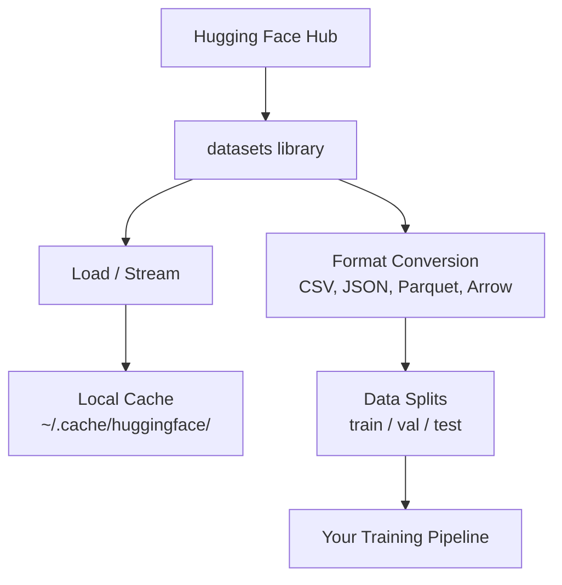

# إدارة البيانات

> البيانات هي الوقود، كيفية إدارةها تعتمد على سرعة السير

**Type:** Build
**Language:**بايثون
**Prerequisites:** Phase 0, Lesson 01
**Time:** ~45 minutes

## أهداف التعلم

- تحميل، تدفق، وتخزين المجموعات البيانية باستخدام وجه العناق `datasets`المكتبة
- تحويل بين تنسيقات CSV ، JSON ، Parquet ، و Arrow و شرح تعديلاتها
- إنشاء ثنائيات قابلة للتكرار/تحقق/اختبار مع بذور عشوائية ثابتة
- إدارة ملفات النموذج الكبيرة ومجموعة البيانات باستخدام `.gitignore`، Git LFS، أو DVC

## المشكلة

كل مشروع ذكاء اصطناعي يبدأ بالبيانات. تحتاج إلى العثور على مجموعات بيانات، تنزيلها، وتحويلها بين أشكال، وتقسيمها للتدريب والتقييم، وتصميمها حتى تكون التجارب قابلة للتكرار. القيام بذلك يدويا في كل مرة بطيئة ومعرضة للخطأ. تحتاج إلى سير عمل متكرر.

## المفهوم



الوجه المُعنى`datasets`المكتبة هي الطريقة القياسية لحمل البيانات لعمل الذكاء الاصطناعي. إنها تتعامل مع تنزيل، التخزين الآلي، تحويل النموذج، وتدفق خارج الصندوق.

```figure
s0-data-pipeline
```

## بناءها

### الخطوة 1: قم بتثبيت مكتبة مجموعات البيانات

```bash
pip install datasets huggingface_hub
```

### الخطوة الثانية: تحميل مجموعة بيانات

```python
from datasets import load_dataset

dataset = load_dataset("stanfordnlp/imdb")
print(dataset)
print(dataset["train"][0])
```

هذا ينزل مجموعة بيانات مراجعة الأفلام من IMDB. بعد التنزيل الأول، فإنه يحمل من التخزين الآلي في `~/.cache/huggingface/datasets/`. . .

### الخطوة 3: تدفق مجموعات بيانات كبيرة

بعض مجموعات البيانات كبيرة جداً للاستيعاب على القرص. تحملها التدفق صف بعد صف دون تنزيل الكامل.

```python
dataset = load_dataset("wikimedia/wikipedia", "20220301.en", split="train", streaming=True)

for i, example in enumerate(dataset):
    print(example["title"])
    if i >= 4:
        break
```

التدفق يمنحك`IterableDataset`تقوم بمعالجة الصفوف عندما تصل. استهلاك الذاكرة يبقى ثابتًا بغض النظر عن حجم مجموعة البيانات.

### الخطوة الرابعة: تنسيقات مجموعة البيانات

- نعم`datasets`المكتبة تستخدم Apache Arrow تحت الغطاء. يمكنك تحويل إلى تنسيقات أخرى اعتمادا على ما يحتاجه خط الأنابيب الخاص بك.

```python
dataset = load_dataset("stanfordnlp/imdb", split="train")

dataset.to_csv("imdb_train.csv")
dataset.to_json("imdb_train.json")
dataset.to_parquet("imdb_train.parquet")
```

مقارنة النموذج:

| Format | Size | Read Speed | Best For |
|--------|------|-----------|----------|
| CSV | Large | Slow | Human readability, spreadsheets |
| JSON | Large | Slow | APIs, nested data |
| Parquet | Small | Fast | Analytics, columnar queries |
| Arrow | Small | Fastest | In-memory processing (what `datasets` uses internally) |

للعمل الذكية، Parquet هو أفضل تنسيق التخزين. السهم هو ما تعمل مع في الذاكرة. CSV و JSON هي للتبادل.

### الخطوة 5: تقسيم البيانات

كل مشروع من مشروعات التكنولوجيا المسلحة يحتاج إلى ثلاثة تقسيمات:

- **Train**: يتعلم النموذج من هذا (عادةً 80%)
- **Validation**: تتحقق من التقدم أثناء التدريب (عادةً 10%)
- **Test**: التقييم النهائي بعد الانتهاء من التدريب (عادة 10%)

بعض مجموعات البيانات تأتي قبل الانقسام عندما لا تفعل، تقسيمها بنفسك:

```python
dataset = load_dataset("stanfordnlp/imdb", split="train")

split = dataset.train_test_split(test_size=0.2, seed=42)
train_val = split["train"].train_test_split(test_size=0.125, seed=42)

train_ds = train_val["train"]
val_ds = train_val["test"]
test_ds = split["test"]

print(f"Train: {len(train_ds)}, Val: {len(val_ds)}, Test: {len(test_ds)}")
```

دائماً أضع بذرة لتحقيق قابلية التكاثر نفس البذرة تنتج نفس الانقسام في كل مرة

### الخطوة 6: النماذج التنزيل والخزينة

النماذج هي ملفات كبيرة.`huggingface_hub`المكتبة تتعامل مع تحميل وتخزين.

```python
from huggingface_hub import hf_hub_download, snapshot_download

model_path = hf_hub_download(
    repo_id="sentence-transformers/all-MiniLM-L6-v2",
    filename="config.json"
)
print(f"Cached at: {model_path}")

model_dir = snapshot_download("sentence-transformers/all-MiniLM-L6-v2")
print(f"Full model at: {model_dir}")
```

النماذج متخزنة إلى `~/.cache/huggingface/hub/`بمجرد تنزيلها، يتم تحميلها على الفور على الركضات التالية.

### الخطوة 7: التعامل مع الملفات الكبيرة

الوزن النموذجي ومجموعات بيانات كبيرة يجب ألا تذهب إلى git. ثلاثة خيارات:

**Option A: .gitignore (simplest)**

```
*.bin
*.safetensors
*.pt
*.onnx
data/*.parquet
data/*.csv
models/
```

**Option B: Git LFS (track large files in git)**

```bash
git lfs install
git lfs track "*.bin"
git lfs track "*.safetensors"
git add .gitattributes
```

يقوم Git LFS بتخزين المؤشرات في repo الخاص بك والملفات الفعلية على خادم منفصل. يقدم لك GitHub 1 جيجابايت مجانا.

**Option C: DVC (data version control)**

```bash
pip install dvc
dvc init
dvc add data/training_set.parquet
git add data/training_set.parquet.dvc data/.gitignore
git commit -m "Track training data with DVC"
```

إنّ DVC يخلق صغار`.dvc`المعلومات نفسها تعيش في S3، GCS، أو آخر خلفية تخزين عن بعد.

| Approach | Complexity | Best For |
|----------|-----------|----------|
| .gitignore | Low | Personal projects, downloaded data you can re-fetch |
| Git LFS | Medium | Teams sharing model weights via git |
| DVC | High | Reproducible experiments, large datasets, teams |

لهذا المسار`.gitignore`استخدم DVC عندما تحتاج إلى إعادة إنتاج التجارب الدقيقة عبر الآلات

### الخطوة الثامنة: أنماط التخزين

**Local storage**يعمل على مجموعات البيانات تحت 10 جيجابايت. HF cache يعالج هذا تلقائيا.

**Cloud storage**هو لأي شيء أكبر أو مشترك بين الآلات:

```python
import os

local_path = os.path.expanduser("~/.cache/huggingface/datasets/")

# s3_path = "s3://my-bucket/datasets/"
# gcs_path = "gs://my-bucket/datasets/"
```

يدمج DVC مع S3 و GCS مباشرة:

```bash
dvc remote add -d myremote s3://my-bucket/dvc-store
dvc push
```

لهذا الدورة، التخزين المحلي كافية. يصبح التخزين السحابي ذو أهمية عندما تقوم بتحسين على حالات GPU عن بعد.

## مجموعات بيانات تستخدم في هذه الدورة

| Dataset | Lessons | Size | What It Teaches |
|---------|---------|------|----------------|
| IMDB | Tokenization, classification | 84 MB | Text classification basics |
| WikiText | Language modeling | 181 MB | Next-token prediction |
| SQuAD | QA systems | 35 MB | Question answering, spans |
| Common Crawl (subset) | Embeddings | Varies | Large-scale text processing |
| MNIST | Vision basics | 21 MB | Image classification fundamentals |
| COCO (subset) | Multimodal | Varies | Image-text pairs |

لا تحتاج إلى تنزيل كل هذه الأن. كل درس يحدد ما يحتاجه.

## استخدمها

إشغال النص المفيد للتحقق من أن كل شيء يعمل:

```bash
python code/data_utils.py
```

هذا ينقل مجموعة بيانات صغيرة، ويحولها، ويقسمها، ويقوم بطبع ملخص.

## أرسله

هذا الدرس ينتج عن:
- `code/data_utils.py`- إمكانية إعادة استخدام البيانات وتخزينها
- `outputs/prompt-data-helper.md`- السرعة للعثور على مجموعة البيانات المناسبة لمهمة

## التمارين

1. إحملها`glue`مجموعة بيانات مع `mrpc`إعداد وتفتيش الخمسة الأمثلة الأولى
2. -أشغل`c4`مجموعة بيانات و احتساب عدد الأمثلة التي يمكنك معالجتها في 10 ثوان
3. تحويل مجموعة البيانات إلى Parquet ومقارنة حجم الملف إلى CSV
4. إعداد 70/15/15 قطعة/قيمة/اختبار مع بذرة ثابتة وتحقق من الأحجام

## الشروط الرئيسية

| Term | What people say | What it actually means |
|------|----------------|----------------------|
| Dataset split | "Training data" | A named subset (train/val/test) used at different stages of the ML lifecycle |
| Streaming | "Load it lazily" | Processing data row by row from a remote source without downloading the full dataset |
| Parquet | "Compressed CSV" | A columnar file format optimized for analytical queries and storage efficiency |
| Arrow | "Fast dataframe" | An in-memory columnar format used internally by the datasets library for zero-copy reads |
| Git LFS | "Git for big files" | An extension that stores large files outside the git repo while keeping pointers in version control |
| DVC | "Git for data" | A version control system for datasets and models that integrates with cloud storage |
| Cache | "Already downloaded" | A local copy of previously fetched data, stored at ~/.cache/huggingface/ by default |
