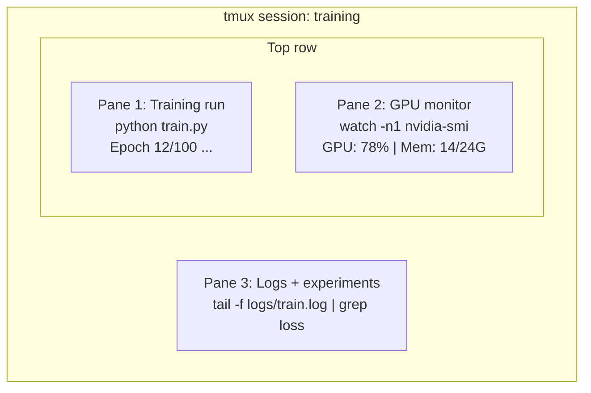

# المحطة وشركة شل

> المحطة هي حيث يعيش مهندسو الذكاء الاصطناعي، اجعل نفسك مريحة هنا.

**Type:** Learn
**Languages:** --
**Prerequisites:** Phase 0, Lesson 01
**Time:** ~35 minutes

## أهداف التعلم

- استخدم الأنابيب، إعادة التوجيه، و `grep`للفيلتر ومعالجة سجلات التدريب من خط الأوامر
- إعداد جلسات tmux مستمرة مع لوحات متعددة للتدريب المتزامن ومراقبة GPU
- مراقبة نظام وموارد الجيبو مع `htop`،`nvtop`و`nvidia-smi`
- نقل الملفات بين الآلات المحلية والبعيدة باستخدام SSH، `scp`و`rsync`

## المشكلة

سوف تقضي وقتًا أكبر في المحطة أكثر من أي محرر. تدريبات التدريب، مراقبة GPU، تتابع السجلات، جلسات SSH عن بعد، إدارة البيئة. كل تدفق عمل من الذكاء الاصطناعي يلمس القذيفة. إذا كنت بطيئًا هنا، فأنت بطيئ في كل مكان.

هذه الدروس تغطي المهارات النهائية التي تهم العمل الذكاء الاصطناعي لا تاريخ من يونيكس لا غوص عميقة في نص الباش فقط ما تحتاجه

## المفهوم



ثلاثة أشياء تعمل في وقت واحد، محطة واحدة يمكنك أن تخرج، تذهب إلى المنزل، تعود إلى SSH، وتعيد التصل، التدريب يستمر.

```figure
s0-shell-pipeline
```

## بناءها

### الخطوة الأولى: تعرف قذفك

تحقق من القذيفة التي تعمل عليها:

```bash
echo $SHELL
```

معظم الأنظمة تستخدم`bash`أو`zsh`كلتا العمليات تعمل بشكل جيد، والإرشادات في هذه الدورة تعمل في كلتا

أشياء رئيسية يجب أن تعرفها:

```bash
# Move around
cd ~/projects/ai-engineering-from-scratch
pwd
ls -la

# History search (most useful shortcut you'll learn)
# Ctrl+R then type part of a previous command
# Press Ctrl+R again to cycle through matches

# Clear terminal
clear   # or Ctrl+L

# Cancel a running command
# Ctrl+C

# Suspend a running command (resume with fg)
# Ctrl+Z
```

### الخطوة الثانية: التشغيل والإعادة توجيه

التشغيل يربط الأوامر معًا. هكذا تقوم بمعالجة السجلات، ومخرجات المرشحات، وأدوات السلسلة. ستستخدم هذا باستمرار.

```bash
# Count how many times "loss" appears in a log
cat train.log | grep "loss" | wc -l

# Extract just the loss values from training output
grep "loss:" train.log | awk '{print $NF}' > losses.txt

# Watch a log file update in real time, filtering for errors
tail -f train.log | grep --line-buffered "ERROR"

# Sort experiments by final accuracy
grep "final_accuracy" results/*.log | sort -t= -k2 -n -r

# Redirect stdout and stderr to separate files
python train.py > output.log 2> errors.log

# Redirect both to the same file
python train.py > train_full.log 2>&1
```

ثلاثة إعادة توجيهات تحتاجها:

| Symbol | What it does |
|--------|-------------|
| `>` | Write stdout to file (overwrite) |
| `>>` | Append stdout to file |
| `2>` | Write stderr to file |
| `2>&1` | Send stderr to same place as stdout |
| `\|` | Send stdout of one command as stdin to the next |

### الخطوة الثالثة: عمليات الخلفية

تدريبات تستغرق ساعات لا تريد أن تبقي محطة الطاقة مفتوحة طوال الوقت

```bash
# Run in background (output still goes to terminal)
python train.py &

# Run in background, immune to hangup (closing terminal won't kill it)
nohup python train.py > train.log 2>&1 &

# Check what's running in background
jobs
ps aux | grep train.py

# Bring a background job to foreground
fg %1

# Kill a background process
kill %1
# or find its PID and kill that
kill $(pgrep -f "train.py")
```

الفرق بين`&`،`nohup`و`screen`-أجل`tmux`:

| Method | Survives terminal close? | Can reattach? |
|--------|-------------------------|---------------|
| `command &` | No | No |
| `nohup command &` | Yes | No (check log file) |
| `screen` / `tmux` | Yes | Yes |

لأي شيء أطول من بضع دقائق، استخدم "tmux".

### الخطوة الرابعة:

تسمح لك tmux بإنشاء جلسات محطة مستمرة مع أجهزة متعددة. هذه هي الأداة الوحيدة الأكثر فائدة لإدارة عمليات التدريب.

```bash
# Install
# macOS
brew install tmux
# Ubuntu
sudo apt install tmux

# Start a named session
tmux new -s training

# Split horizontally
# Ctrl+B then "

# Split vertically
# Ctrl+B then %

# Navigate between panes
# Ctrl+B then arrow keys

# Detach (session keeps running)
# Ctrl+B then d

# Reattach
tmux attach -t training

# List sessions
tmux ls

# Kill a session
tmux kill-session -t training
```

جلسة عمل نموذجية لـ AI:

```bash
tmux new -s train

# Pane 1: start training
python train.py --epochs 100 --lr 1e-4

# Ctrl+B, " to split, then run GPU monitor
watch -n1 nvidia-smi

# Ctrl+B, % to split vertically, tail the logs
tail -f logs/experiment.log

# Now detach with Ctrl+B, d
# SSH out, go get coffee, come back
# tmux attach -t train
```

### الخطوة 5: مراقبة مع htop و nvtop

```bash
# System processes (better than top)
htop

# GPU processes (if you have NVIDIA GPU)
# Install: sudo apt install nvtop (Ubuntu) or brew install nvtop (macOS)
nvtop

# Quick GPU check without nvtop
nvidia-smi

# Watch GPU usage update every second
watch -n1 nvidia-smi

# See which processes are using the GPU
nvidia-smi --query-compute-apps=pid,name,used_memory --format=csv
```

`htop`الوصفات التي ستستخدمها:
- `F6`أو`>`للتنظيم حسب العمود (التنظيم حسب الذاكرة للعثور على تسرب الذاكرة)
- `F5`لتحويل طريقة عرض الأشجار (انظر عمليات الأطفال)
- `F9`لقتل عملية
- `/`للبحث عن اسم العملية

### الخطوة 6: SSH لربط GPU عن بعد

عندما تستأجر GPU السحابية (Lambda، RunPod، Vast.ai) ، يمكنك الاتصال عبر SSH.

```bash
# Basic connection
ssh user@gpu-box-ip

# With a specific key
ssh -i ~/.ssh/my_gpu_key user@gpu-box-ip

# Copy files to remote
scp model.pt user@gpu-box-ip:~/models/

# Copy files from remote
scp user@gpu-box-ip:~/results/metrics.json ./

# Sync a whole directory (faster for many files)
rsync -avz ./data/ user@gpu-box-ip:~/data/

# Port forward (access remote Jupyter/TensorBoard locally)
ssh -L 8888:localhost:8888 user@gpu-box-ip
# Now open localhost:8888 in your browser

# SSH config for convenience
# Add to ~/.ssh/config:
# Host gpu
#     HostName 192.168.1.100
#     User ubuntu
#     IdentityFile ~/.ssh/gpu_key
#
# Then just:
# ssh gpu
```

### الخطوة 7: أسماء مستعار مفيدة للعمل الذكاء الاصطناعي

إضافة هذه إلى الخاص بك`~/.bashrc`أو`~/.zshrc`:

```bash
source phases/00-setup-and-tooling/10-terminal-and-shell/code/shell_aliases.sh
```

أو نسخ ما تريد من الاسم الاسمية الرئيسية

```bash
# GPU status at a glance
alias gpu='nvidia-smi --query-gpu=index,name,utilization.gpu,memory.used,memory.total,temperature.gpu --format=csv,noheader'

# Kill all Python training processes
alias killtraining='pkill -f "python.*train"'

# Quick virtual environment activate
alias ae='source .venv/bin/activate'

# Watch training loss
alias watchloss='tail -f logs/*.log | grep --line-buffered "loss"'
```

انظر`code/shell_aliases.sh`للفيلم الكامل

### الخطوة 8: أنماط نهاية الذكاء الاصطناعي الشائعة

هذه النقاط تأتي مراراً وتكراراً في الممارسة العملية:

```bash
# Run training, log everything, notify when done
python train.py 2>&1 | tee train.log; echo "DONE" | mail -s "Training complete" you@email.com

# Compare two experiment logs side by side
diff <(grep "accuracy" exp1.log) <(grep "accuracy" exp2.log)

# Find the largest model files (clean up disk space)
find . -name "*.pt" -o -name "*.safetensors" | xargs du -h | sort -rh | head -20

# Download a model from Hugging Face
wget https://huggingface.co/model/resolve/main/model.safetensors

# Untar a dataset
tar xzf dataset.tar.gz -C ./data/

# Count lines in all Python files (see how big your project is)
find . -name "*.py" | xargs wc -l | tail -1

# Check disk space (training data fills disks fast)
df -h
du -sh ./data/*

# Environment variable check before training
env | grep -i cuda
env | grep -i torch
```

## استخدمها

هنا عندما تأتي كل أداة إلى اللعب خلال هذه الدورة:

| Tool | When you use it |
|------|----------------|
| tmux | Every training run (Phases 3+) |
| `tail -f` + `grep` | Monitoring training logs |
| `nohup` / `&` | Quick background tasks |
| `htop` / `nvtop` | Debugging slow training, OOM errors |
| SSH + `rsync` | Working on cloud GPUs |
| Piping + redirects | Processing experiment results |
| Aliases | Saving time on repetitive commands |

## التمارين

1. قم بتثبيت tmux، وإنشاء جلسة مع ثلاث لوحات، وإجراء `htop`في واحد`watch -n1 date`في آخر، وخطوط بيثون في الثالث. إزالة وإعادة ربط.
2. إضافة الاسم التلقائي من `code/shell_aliases.sh`إلى قذارتك إعداد وإعادة التحميل مع `source ~/.zshrc`(أو `~/.bashrc`)
3. إعداد سجل تدريب مزيف مع `for i in $(seq 1 100); do echo "epoch $i loss: $(echo "scale=4; 1/$i" | bc)"; sleep 0.1; done > fake_train.log`ثم استخدم`grep`،`tail`و`awk`لاستخراج سوى قيم الخسارة
4. قم بتعيين إدخال إعداد SSH لخادم لديك الوصول إليه (أو استخدامه `localhost`لممارسة النص).

## الشروط الرئيسية

| Term | What people say | What it actually means |
|------|----------------|----------------------|
| Shell | "The terminal" | The program that interprets your commands (bash, zsh, fish) |
| tmux | "Terminal multiplexer" | A program that lets you run multiple terminal sessions inside one window, and detach/reattach |
| Pipe | "The bar thing" | The `\|` operator that sends one command's output as input to another |
| PID | "Process ID" | A unique number assigned to every running process, used to monitor or kill it |
| nohup | "No hangup" | Runs a command immune to the hangup signal, so closing the terminal won't kill it |
| SSH | "Connecting to the server" | Secure Shell, an encrypted protocol for running commands on a remote machine |
