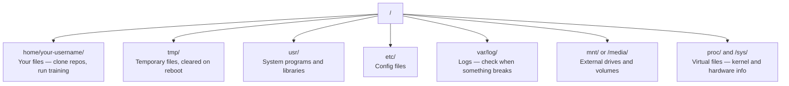

# لينكس للذكاء الاصطناعي

> معظم الذكاء الاصطناعي يعمل على لينكس يجب ان تعرف ما يكفي لكي لا تكون عالقاً

**Type:** Learn
**Languages:** --
**Prerequisites:** Phase 0, Lesson 01
**Time:** ~30 minutes

## أهداف التعلم

- التنقل في نظام الملفات لينكس وإجراء عمليات الملفات الأساسية من خط الأوامر
- إدارة الإذنات الملفية مع `chmod`و`chown`لحل أخطاء "منح السماح"
- قم بتثبيت حزم النظام مع `apt`ووضع صندوق جديد لـ (GPU) للعمل الذكي
- تحديد الاختلافات بين macOS و Linux التي عادة ما تعثّر على المطورين الذين يعملون على أجهزة بعيدة

## المشكلة

تطوير على macOS أو Windows. ولكن في اللحظة التي تقوم بها في صندوق GPU السحابية، أو تستأجر مثالاً للامبدا، أو تقوم بتشغيل جهاز EC2، أنت تهبط في أوبونتو. المحطة هي واجهتك الوحيدة لا يوجد "فيندر" ولا "إكسبلورر" ولا "GUI". إذا لم تتمكن من التنقل في نظام الملفات، وتثبيت الحزم، وإدارة العمليات من خط الأوامر، فأنت عالق في دفع ساعات عمل الجيبو المتداولة أثناء بحثك في جوجل "كيفية فك زيب ملف في لينكس".

هذا دليل للبقاء. يغطى بالضبط ما تحتاج إليه لتشغيل جهاز لينكس عن بعد للعمل على الذكاء الاصطناعي. لا شيء آخر.

## ترتيب نظام الملفات

لينكس يُنظم كل شيء تحت جذور واحدة`/`لا يوجد`C:\`أو`/Volumes`المجلات التي ستلمسها فعلاً:



دليل منزلك هو`~`أو`/home/your-username`كل ما تفعله تقريباً يحدث هنا

## الأوامر الأساسية

هذه هي الأوامر الخمسة عشر التي تغطي 95٪ من ما ستفعله على مربع GPU عن بعد.

### التنقل

```bash
pwd                         # Where am I?
ls                          # What's here?
ls -la                      # What's here, including hidden files with details?
cd /path/to/dir             # Go there
cd ~                        # Go home
cd ..                       # Go up one level
```

### الملفات والمؤشرات

```bash
mkdir my-project            # Create a directory
mkdir -p a/b/c              # Create nested directories in one shot

cp file.txt backup.txt      # Copy a file
cp -r src/ src-backup/      # Copy a directory (recursive)

mv old.txt new.txt          # Rename a file
mv file.txt /tmp/           # Move a file

rm file.txt                 # Delete a file (no trash, it's gone)
rm -rf my-dir/              # Delete a directory and everything inside
```

`rm -rf`لا يوجد إعادة التأجيل، تحقق من المسار قبل الضربة على الدخول

### قراءة الملفات

```bash
cat file.txt                # Print entire file
head -20 file.txt           # First 20 lines
tail -20 file.txt           # Last 20 lines
tail -f log.txt             # Follow a log file in real time (Ctrl+C to stop)
less file.txt               # Scroll through a file (q to quit)
```

### البحث

```bash
grep "error" training.log           # Find lines containing "error"
grep -r "learning_rate" .           # Search all files in current directory
grep -i "cuda" config.yaml          # Case-insensitive search

find . -name "*.py"                 # Find all Python files under current dir
find . -name "*.ckpt" -size +1G     # Find checkpoint files larger than 1GB
```

## الإذن

كل ملف في لينكس لديه مالك وفرص الإذن سوف تجد هذا عندما لا تنفذ النصوص أو لا يمكنك الكتابة إلى دليل

```bash
ls -l train.py
# -rwxr-xr-- 1 user group 2048 Mar 19 10:00 train.py
#  ^^^             owner permissions: read, write, execute
#     ^^^          group permissions: read, execute
#        ^^        everyone else: read only
```

الإصلاحات المشتركة:

```bash
chmod +x train.sh           # Make a script executable
chmod 755 deploy.sh         # Owner: full, others: read+execute
chmod 644 config.yaml       # Owner: read+write, others: read only

chown user:group file.txt   # Change who owns a file (needs sudo)
```

عندما يقول شيء "الاجازة رفضت" انها دائما تقريبا مشكلة الإذن. `chmod +x`أو`sudo`سوف تصحح معظم الحالات

## إدارة الحزمة (مستحقة)

استخدامات Ubuntu`apt`هكذا تقوم بتثبيت البرمجيات على مستوى النظام

```bash
sudo apt update             # Refresh the package list (always do this first)
sudo apt install -y htop    # Install a package (-y skips confirmation)
sudo apt install -y build-essential  # C compiler, make, etc. Needed by many Python packages
sudo apt install -y tmux    # Terminal multiplexer (keep sessions alive after disconnect)

apt list --installed        # What's installed?
sudo apt remove htop        # Uninstall
```

الحزم المشتركة التي ستثبّتها على صندوق جديد لـ (GPU):

```bash
sudo apt update && sudo apt install -y \
    build-essential \
    git \
    curl \
    wget \
    tmux \
    htop \
    unzip \
    python3-venv
```

## المستخدمين و sudo

عادة ما تكون مستخدمًا منتظمًا. بعض العمليات تحتاج إلى وصول الجذر (الإدارة).

```bash
whoami                      # What user am I?
sudo command                # Run a single command as root
sudo su                     # Become root (exit to go back, use sparingly)
```

في حالات مجرى GPU السحاب، أنت عادة المستخدم الوحيد ولديك بالفعل إمكانية الوصول إلى sudo. لا تشغيل كل شيء كجذر. استخدم sudo فقط عندما يكون هناك حاجة.

## العمليات والأنظمة

عندما يتوقف تدريبك أو تحتاج للتحقق من ما يجري

```bash
htop                        # Interactive process viewer (q to quit)
ps aux | grep python        # Find running Python processes
kill 12345                  # Gracefully stop process with PID 12345
kill -9 12345               # Force kill (use when graceful doesn't work)
nvidia-smi                  # GPU processes and memory usage
```

نظام (د) يدير الخدمات (الشيطانيات الخلفية). ستستخدمها إذا قمت بتشغيل خوادم الاستخدام:

```bash
sudo systemctl start nginx          # Start a service
sudo systemctl stop nginx           # Stop it
sudo systemctl restart nginx        # Restart it
sudo systemctl status nginx         # Check if it's running
sudo systemctl enable nginx         # Start automatically on boot
```

## مساحة القرص

علبات GPU غالباً ما تكون محدودة مساحة القرص. النماذج ومجموعات البيانات تملأها بسرعة.

```bash
df -h                       # Disk usage for all mounted drives
df -h /home                 # Disk usage for /home specifically

du -sh *                    # Size of each item in current directory
du -sh ~/.cache             # Size of your cache (pip, huggingface models land here)
du -sh /data/checkpoints/   # Check how big your checkpoints are

# Find the biggest space hogs
du -h --max-depth=1 / 2>/dev/null | sort -hr | head -20
```

الجهاز المشترك لإنقاذ المساحة:

```bash
# Clear pip cache
pip cache purge

# Clear apt cache
sudo apt clean

# Remove old checkpoints you don't need
rm -rf checkpoints/epoch_01/ checkpoints/epoch_02/
```

## شبكات

سوف تنزيل النماذج ونقل الملفات و تضغط على APIs من خط الأوامر.

```bash
# Download files
wget https://example.com/model.bin                   # Download a file
curl -O https://example.com/data.tar.gz              # Same thing with curl
curl -s https://api.example.com/health | python3 -m json.tool  # Hit an API, pretty-print JSON

# Transfer files between machines
scp model.bin user@remote:/data/                     # Copy file to remote machine
scp user@remote:/data/results.csv .                  # Copy file from remote to local
scp -r user@remote:/data/checkpoints/ ./local-dir/   # Copy directory

# Sync directories (faster than scp for large transfers, resumes on failure)
rsync -avz --progress ./data/ user@remote:/data/
rsync -avz --progress user@remote:/results/ ./results/
```

استخدام`rsync`- لقد انتهت`scp`لا شيء كبير، إنه يُحمل فقط الإتصال المتقطع

## أبقوا الجلسات حية

عندما تضعها في صندوق بعيد، إغلاق الكمبيوتر المحمول يقتل تدريبك.

```bash
tmux new -s train           # Start a new session named "train"
# ... start your training, then:
# Ctrl+B, then D            # Detach (training keeps running)

tmux ls                     # List sessions
tmux attach -t train        # Reattach to session

# Inside tmux:
# Ctrl+B, then %            # Split pane vertically
# Ctrl+B, then "            # Split pane horizontally
# Ctrl+B, then arrow keys   # Switch between panes
```

دائماً أدير وظائف تدريب طويلة داخل المتحرك

## WSL2 لمستخدمي Windows

إذا كنت على ويندوز، WSL2 يعطيك بيئة لينكس حقيقية دون إعادة تشغيل مزدوجة.

```bash
# In PowerShell (admin)
wsl --install -d Ubuntu-24.04

# After restart, open Ubuntu from Start menu
sudo apt update && sudo apt upgrade -y
```

وسل2 تشغيل نواة لينكس حقيقية كل شيء في هذه الدروس يعمل بداخلها. ملفات ويندوز الخاصة بك في`/mnt/c/Users/YourName/`من داخل WSL.

يعمل GPU pasthrough مع برامج تشغيل NVIDIA مثبتة على جانب Windows. قم بتثبيت برامج تشغيل Windows NVIDIA (وليس لينكس) ، وسوف تكون CUDA متاحة داخل WSL2.

## Gotchas: macOS إلى Linux

أشياء ستعثر عليك إذا كنت قادما من macOS:

| macOS | Linux | Notes |
|-------|-------|-------|
| `brew install` | `sudo apt install` | Different package names sometimes. `brew install htop` vs `sudo apt install htop` works the same, but `brew install readline` vs `sudo apt install libreadline-dev` does not. |
| `open file.txt` | `xdg-open file.txt` | But you won't have a GUI on a remote box. Use `cat` or `less`. |
| `pbcopy` / `pbpaste` | Not available | Pipe to/from clipboard doesn't exist over SSH. |
| `~/.zshrc` | `~/.bashrc` | macOS defaults to zsh. Most Linux servers use bash. |
| `/opt/homebrew/` | `/usr/bin/`, `/usr/local/bin/` | Binaries live in different places. |
| `sed -i '' 's/a/b/' file` | `sed -i 's/a/b/' file` | macOS sed needs an empty string after `-i`. Linux does not. |
| Case-insensitive filesystem | Case-sensitive filesystem | `Model.py` and `model.py` are two different files on Linux. |
| Line endings `\n` | Line endings `\n` | Same. But Windows uses `\r\n`, which breaks bash scripts. Run `dos2unix` to fix. |

## بطاقة مرجع سريعة

```
Navigation:     pwd, ls, cd, find
Files:          cp, mv, rm, mkdir, cat, head, tail, less
Search:         grep, find
Permissions:    chmod, chown, sudo
Packages:       apt update, apt install
Processes:      htop, ps, kill, nvidia-smi
Services:       systemctl start/stop/restart/status
Disk:           df -h, du -sh
Network:        curl, wget, scp, rsync
Sessions:       tmux new/attach/detach
```

```figure
s0-process-fork
```

## التمارين

1. SSH إلى أي جهاز لينكس (أو فتح WSL2) والتنقل إلى دليل منزلك. إنشاء مجلد مشروع، وإنشاء ثلاثة ملفات فارغة داخلها مع `touch`، ثم قم بإدراجهم مع`ls -la`. . .
2. إثباط`htop`مع apt، تشغيله، وتحديد أي عملية تستخدم أكثر الذاكرة.
3. أبدأ جلسة التمكس، أبدأ`sleep 300`داخلها، انفصل، قائمة جلسات، وإعادة ربط.
4. استخدام`df -h`للتحقق من مساحة القرص المتاحة ، ثم استخدم `du -sh ~/.cache/*`لإيجاد ما يأخذ مساحة في مخزنك
5. نقل ملف من جهازك المحلي إلى جهاز بعيد عن بعد باستخدام `scp`، ثم قم بنفس النقل مع`rsync`و مقارنة الخبرة.
