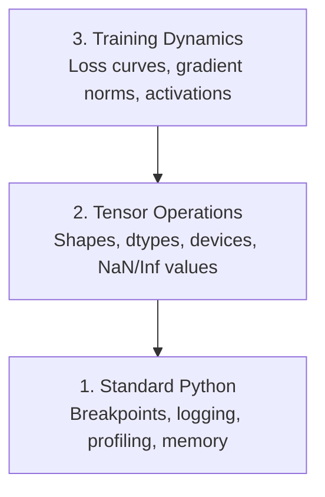

# إصلاح الأخطاء وتصميم الملفات الشخصية

> أسوأ حشرات الذكاء الاصطناعي لا تتحطم، إنها تتدرب بصمت على القمامة وتبلغ عن منحنى خسارة جميل.

**Type:** Build
**Language:**بايثون
**Prerequisites:** Lesson 1 (Dev Environment), basic PyTorch familiarity
**Time:** ~60 minutes

## أهداف التعلم

- استخدم مشروط `breakpoint()`و`debug_print`لتحقق من أشكال الانسدادات، وأنواعها، وقيم NaN في منتصف التدريب
- حلقات التدريب المهنية مع `cProfile`،`line_profiler`و`tracemalloc`للعثور على ضغوط الزجاجة
- اكتشاف الأخطاء المشتركة في الذكاء الاصطناعي: عدم مطابقة الشكل ، وفقدان NaN ، تسرب البيانات ، وتنسورات الجهاز الخطأ
- قم بتعيين TensorBoard لتصور منحنى الخسارة، وخطوط الوزن، وتوزيعات التراجع

## المشكلة

ينفشل رمز الذكاء الاصطناعي بشكل مختلف عن الرمز العادي. ينهار تطبيق الويب مع تعقب كومة. يمر حلقة تدريب خاطئة لمدة 8 ساعات، يحرق 200 دولار في وقت GPU، وينتج نموذج يتوقع متوسط كل مدخل.`.detach()`أو اللبنانات التي تسرب في الميزات

تحتاج إلى أدوات التحكم التي تلتقط هذه الفشل الصامت قبل أن تضيع وقتك والحساب.

## المفهوم

التحليل الذكري يعمل على ثلاثة مستويات:



معظم الناس يقفزون مباشرة إلى المستوى 3 (يبحثون في TensorBoard) لكن 80% من حشرات الذكاء الاصطناعي تعيش في المستويات 1 و 2.

```figure
s0-flame-hot
```

## بناءها

### الجزء الأول: إصلاح الخطأ في الطباعة (نعم، يعمل)

يتم رفض إزالة الخطأ في الطباعة. لا ينبغي أن يكون كذلك. بالنسبة للرمز التنسوري، فإن بيان الطباعة المستهدف يفوق الدخول من خلال جهاز إزالة الخطأ لأنك تحتاج إلى رؤية الأشكال والأنواع ومناطقي القيمة في وقت واحد.

```python
def debug_print(name, tensor):
    print(f"{name}: shape={tensor.shape}, dtype={tensor.dtype}, "
          f"device={tensor.device}, "
          f"min={tensor.min().item():.4f}, max={tensor.max().item():.4f}, "
          f"mean={tensor.mean().item():.4f}, "
          f"has_nan={tensor.isnan().any().item()}")
```

اتصل بهذا بعد كل عملية مشبوهة عندما يكتشف الحشاشة إزالة بصماتها بسيطة

### الجزء الثاني: جهاز إزالة الخطأ في Python (pdb و breakpoint)

إنّ جهاز إزالة الحذاء المدمج يُقلل من تقديره لعمله الذكاء الاصطناعي`breakpoint()`في حلقة التدريب الخاصة بك وتفتيش الجهاز التنسوري بشكل تفاعلي.

```python
def training_step(model, batch, criterion, optimizer):
    inputs, labels = batch
    outputs = model(inputs)
    loss = criterion(outputs, labels)

    if loss.item() > 100 or torch.isnan(loss):
        breakpoint()

    loss.backward()
    optimizer.step()
```

عندما يضعك جهاز التحليل في القيادة مفيدة:

- `p outputs.shape`للتحقق من الأشكال
- `p loss.item()`لتحديد قيمة الخسارة
- `p torch.isnan(outputs).sum()`لعدة الناتج
- `p model.fc1.weight.grad`للتحقق من التراجع
- `c`أن تستمر`q`التخلي عن العمل

هذا إصلاح مشروط، تتوقف فقط عندما يبدو أن شيء ما خاطئ، بالنسبة لدورة تدريبية 10,000 خطوة، هذا يهم

### الجزء الثالث: تسجيلات Python

استبدل بيانات الطباعة بتسجيل عندما يتجاوز إصلاحك التحقق السريع.

```python
import logging

logging.basicConfig(
    level=logging.INFO,
    format="%(asctime)s [%(levelname)s] %(message)s",
    handlers=[
        logging.FileHandler("training.log"),
        logging.StreamHandler()
    ]
)
logger = logging.getLogger(__name__)

logger.info("Starting training: lr=%.4f, batch_size=%d", lr, batch_size)
logger.warning("Loss spike detected: %.4f at step %d", loss.item(), step)
logger.error("NaN loss at step %d, stopping", step)
```

تسجيل الدخول يعطيك علامات الزمنية ومستويات الدرجة الحادة وتخرج الملفات عندما تفشل عملية التدريب في الساعة الثالثة صباحاً، تريد ملف سجل الدخول، وليس الناتج المحمول الذي يزول خارج الشاشة.

### الجزء الرابع: أجزاء إشارات التوقيت

معرفة أين يذهب الوقت هي الخطوة الأولى نحو التكيف.

```python
import time

class Timer:
    def __init__(self, name=""):
        self.name = name

    def __enter__(self):
        self.start = time.perf_counter()
        return self

    def __exit__(self, *args):
        elapsed = time.perf_counter() - self.start
        print(f"[{self.name}] {elapsed:.4f}s")

with Timer("data loading"):
    batch = next(dataloader_iter)

with Timer("forward pass"):
    outputs = model(batch)

with Timer("backward pass"):
    loss.backward()
```

النتيجة الشائعة: تحميل البيانات يستغرق 60٪ من وقت التدريب.`num_workers > 0`في جهاز تحميل البيانات الخاص بك، وليس معالجة المعالجة المعالجة أسرع.

### الجزء 5: cProfile و line_profiiler

عندما تحتاج إلى أكثر من توقيت يدوي:

```bash
python -m cProfile -s cumtime train.py
```

هذا يظهر كل مكالمة وظيفة مرتبة حسب الوقت التراكمي.

```bash
pip install line_profiler
```

```python
@profile
def train_step(model, data, target):
    output = model(data)
    loss = F.cross_entropy(output, target)
    loss.backward()
    return loss

# Run with: kernprof -l -v train.py
```

### الجزء السادس: تحليل الذاكرة

#### ذاكرة المعالجة المركزية مع tracemalloc

```python
import tracemalloc

tracemalloc.start()

# your code here
model = build_model()
data = load_dataset()

snapshot = tracemalloc.take_snapshot()
top_stats = snapshot.statistics("lineno")
for stat in top_stats[:10]:
    print(stat)
```

#### ذاكرة CPU مع ذاكرة_ملفات

```bash
pip install memory_profiler
```

```python
from memory_profiler import profile

@profile
def load_data():
    raw = read_csv("data.csv")       # watch memory jump here
    processed = preprocess(raw)       # and here
    return processed
```

اجري مع`python -m memory_profiler your_script.py`لمشاهدة استخدام الذاكرة خطًا بعد خط.

#### ذاكرة GPU مع PyTorch

```python
import torch

if torch.cuda.is_available():
    print(torch.cuda.memory_summary())

    print(f"Allocated: {torch.cuda.memory_allocated() / 1e9:.2f} GB")
    print(f"Cached: {torch.cuda.memory_reserved() / 1e9:.2f} GB")
```

عندما تضغط على OOM (من خارج الذاكرة):

1. تقليل حجم اللحظة (أول شيء يحاولون فعله دائماً)
2. استخدام`torch.cuda.empty_cache()`لتحرير الذاكرة المتخزنة
3. استخدام`del tensor`يليها `torch.cuda.empty_cache()`للقطاع الوسطى الكبير
4. استخدام دقة مختلطة (`torch.cuda.amp`) لتقليل استهلاك الذاكرة إلى النصف
5. استخدم التفتيش المتحرك للنماذج العميقة جدا

### الجزء السابع: حشرات الذكاء الاصطناعي الشائعة وكيفية القبض عليها

#### عدم مطابقة الشكل

الحشرة الأكثر شيوعاً، الجهاز لديه شكل`[batch, features]`عندما يتوقع النموذج`[batch, channels, height, width]`. . .

```python
def check_shapes(model, sample_input):
    print(f"Input: {sample_input.shape}")
    hooks = []

    def make_hook(name):
        def hook(module, inp, out):
            in_shape = inp[0].shape if isinstance(inp, tuple) else inp.shape
            out_shape = out.shape if hasattr(out, "shape") else type(out)
            print(f"  {name}: {in_shape} -> {out_shape}")
        return hook

    for name, module in model.named_modules():
        hooks.append(module.register_forward_hook(make_hook(name)))

    with torch.no_grad():
        model(sample_input)

    for h in hooks:
        h.remove()
```

إستخدم هذه مرة واحدة مع مجموعة عينات، إنها ترسم كل تحول شكل في نموذجك

#### خسارة

فقدان النفط النووي يعني انفجار شيء

- معدل التعلم مرتفع جدا
- التقسيم بفارق في الخسارة الجمركية
- سجل صفر أو رقم سلبي
- التدفقات المتفجرة في RNNs

```python
def detect_nan(model, loss, step):
    if torch.isnan(loss):
        print(f"NaN loss at step {step}")
        for name, param in model.named_parameters():
            if param.grad is not None:
                if torch.isnan(param.grad).any():
                    print(f"  NaN gradient in {name}")
                if torch.isinf(param.grad).any():
                    print(f"  Inf gradient in {name}")
        return True
    return False
```

#### تسرب البيانات

نموذجك يحصل على دقة 99٪ على مجموعة الاختبار يبدو رائعاً إنه حشيش

```python
def check_data_leakage(train_set, test_set, id_column="id"):
    train_ids = set(train_set[id_column].tolist())
    test_ids = set(test_set[id_column].tolist())
    overlap = train_ids & test_ids
    if overlap:
        print(f"DATA LEAKAGE: {len(overlap)} samples in both train and test")
        return True
    return False
```

أيضا تحقق من تسرب زمني: باستخدام البيانات المستقبلية للتنبؤ بالماضي. فرز حسب العلامة الزمنية قبل الانقسام.

#### آلة خاطئة

الجهازات المضغوطة على أجهزة مختلفة (CPU vs GPU) تسبب أخطاء في وقت تشغيل. ولكن في بعض الأحيان يبقى الجهاز المضغوط صامتًا على CPU بينما كل شيء آخر على GPU، وتعمل التدريب ببطء.

```python
def check_devices(model, *tensors):
    model_device = next(model.parameters()).device
    print(f"Model device: {model_device}")
    for i, t in enumerate(tensors):
        if t.device != model_device:
            print(f"  WARNING: tensor {i} on {t.device}, model on {model_device}")
```

### الجزء الثامن: أساسيات لوحة التنسور

تينسوربورد يظهر لك ما يحدث داخل التدريب مع مرور الوقت.

```bash
pip install tensorboard
```

```python
from torch.utils.tensorboard import SummaryWriter

writer = SummaryWriter("runs/experiment_1")

for step in range(num_steps):
    loss = train_step(model, batch)

    writer.add_scalar("loss/train", loss.item(), step)
    writer.add_scalar("lr", optimizer.param_groups[0]["lr"], step)

    if step % 100 == 0:
        for name, param in model.named_parameters():
            writer.add_histogram(f"weights/{name}", param, step)
            if param.grad is not None:
                writer.add_histogram(f"grads/{name}", param.grad, step)

writer.close()
```

أطلقها

```bash
tensorboard --logdir=runs
```

ما الذي يجب البحث عنه:

- **Loss not decreasing**: معدل التعلم منخفض جداً أو مشكلة معماري النموذج
- **Loss oscillating wildly**: معدل التعلم مرتفع جدا
- **Loss goes to NaN**: عدم الاستقرار الرقمي (انظر القسم NaN أعلاه)
- **Train loss decreasing, val loss increasing**: التكيف الزائد
- **Weight histograms collapsing to zero**: تراجعات تختفي
- **Gradient histograms exploding**: تحتاج إلى قطع التراجع

### الجزء 9: إصلاح رمز VS

للتحليل التفاعلي، قم بتشغيل رمز VS باستخدام `launch.json`:

```json
{
    "version": "0.2.0",
    "configurations": [
        {
            "name": "Debug Training",
            "type": "debugpy",
            "request": "launch",
            "program": "${file}",
            "console": "integratedTerminal",
            "justMyCode": false
        }
    ]
}
```

حدد نقاط الانقطاع عن طريق النقر على القنابل. استخدم نافذة المتغيرات لفحص خصائص التنسور. إضافة إضافة إضافة إضافة إضافة إضافة إضافة إضافة إضافة إضافة إضافة إضافة إضافة إضافة إضافة إضافة إضافة إضافة إضافة إضافة إضافة إضافة إضافة إضافة إضافة إضافة إضافة إضافة إضافة إضافة إضافة إضافة إضافة إضافة إضافة إضافة إضافة إضافة إضافة إضافة إضافة إضافة إضافة إضافة إضافة إضافة إضافة إضافة إضافة إضافة إضافة إضافة إضافة إضافة إضافة إضافة إضافة إضافة إضافة إضافة إضافة إضافة إضافة إضافة إضافة إضافة إضافة إضافة إضافة إضافة إضافة إضافة إضافة إضافة إضافة إضافة إضافة إضافة إضافة إضافة إضافة إضافة إضافة إضافة إضافة إضافة إضافة إضافة إضافة إضافة إضافة إضافة إضافة إضافة إضافة إضافة إضافة إضافة إضافة إضافة إضافة إضافة إضافة إضافة إضافة إضافة إضافة إضافة إضافة إضافة إضافة إضافة إضافة إضافة إضافة إضافة إضافة إضافة إضافة إضافة إضافة إضافة إضافة إضافة إضافة إضافة إضافة إضافة إضافة إضافة إضافة إضافة إضافة إضافة إضافة إضافة إضافة إضافة إضافة إضافة إضافة إضافة إضافة إضافة إضافة إضافة إضافة إضافة إضافة إضافة إضافة إضافة إضافة إضافة إضافة إضافة إضافة إضافة إضافة إض

مفيد للدخول من خلال خطوط التشغيل المسبق للمعلومات حيث تريد أن ترى كل تحول.

## استخدمها

هنا هو سير العمل التحريف الذي يلتقط معظم الأخطاء الذكية الذكية:

1. **Before training**أخرج`check_shapes`مع مجموعة عينات. التحقق من أن أبعاد المدخل والخروج تتطابق مع التوقعات.
2. **First 10 steps**استخدام:`debug_print`تأكد من عدم وجود أي شيء هو NaN والقيم في نطاق معقول.
3. **During training**: فقدان السجلات، معدل التعلم، ومعايير التراجع. استخدم TensorBoard للتصور.
4. **When something breaks**: إسقط `breakpoint()`في نقطة الفشل، فحص التنسورات بشكل تفاعلي
5. **For performance**وقت تحميل البيانات مقابل التسلل للأمام مقابل الخلفية. ذاكرة الملف الشخصي إذا كنت قريبة من OOM.

## أرسله

تشغيل نص مجموعة أدوات التحليل:

```bash
python phases/00-setup-and-tooling/12-debugging-and-profiling/code/debug_tools.py
```

انظر`outputs/prompt-debug-ai-code.md`للاستعلام الذي يساعد على تشخيص الأخطاء الخاصة بالذكاء الاصطناعي.

## التمارين

1. أركض`debug_tools.py`ويقرأ من خلال إصدار كل قسم. تعديل النموذج الوهمي لتقديم NaN (تلميح: تقسيم صفر في الممر الأمامي) ومشاهدة الكاشف يلتقطها.
2. تحليل حلقة تدريب مع `cProfile`و تحديد أبطأ وظيفة.
3. استخدام`tracemalloc`لمعرفة الخط في خط أنابيب تحميل البيانات الخاص بك يخصص أكثر الذاكرة.
4. قم بتعيين TensorBoard لتمارين تدريبية بسيطة وتحديد ما إذا كان النموذج يزداد من الملاءمة.
5. استخدام`breakpoint()`داخل حلقة تدريب. تمارس فحص أشكال الجهاز، وأقوال التراجع من طلب إزالة العيوب.
