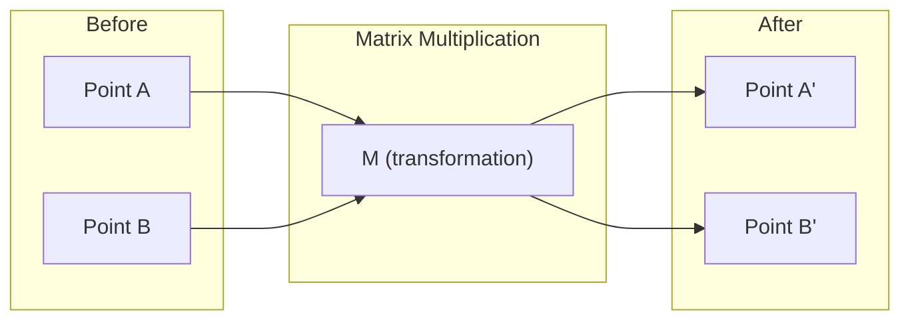
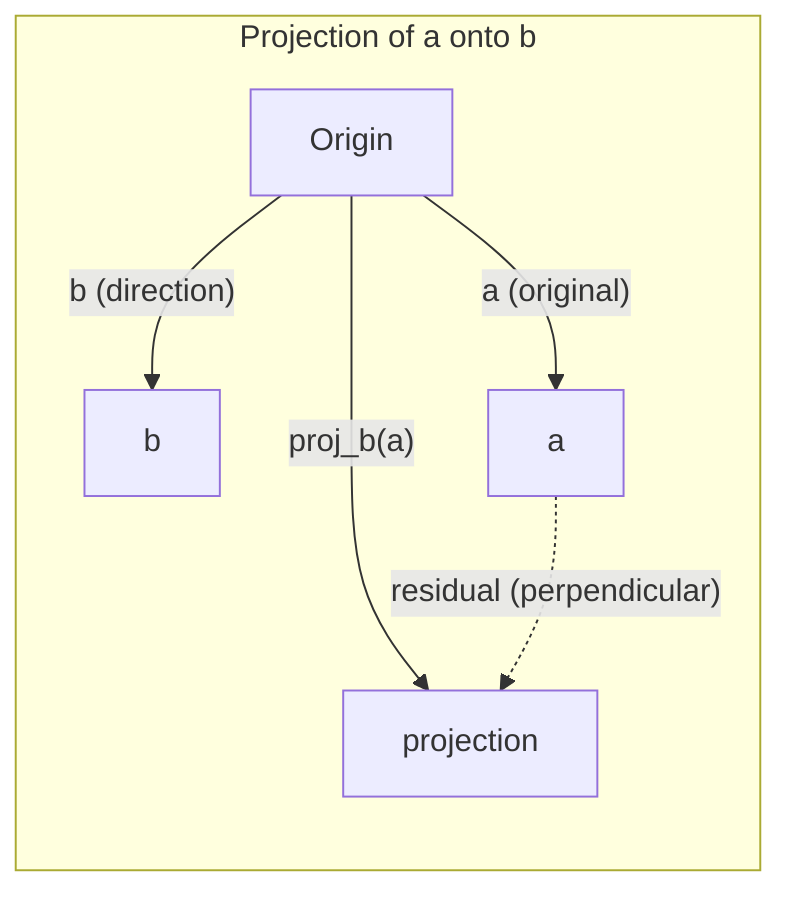

# الهندسة الخريطة

> كل نموذج من الذكاء الاصطناعي هو مجرد رياضيات المصفوفة ترتدي قبعة فاخرة.

**Type:** Learn
**Languages:** Python, Julia
**Prerequisites:** Phase 0
**Time:** ~60 minutes

## أهداف التعلم

- تنفيذ عمليات المتجهة والصفائح (اضافة، نسبة نقطة، مضاعفة المصفوفة) من الصفر في Python
- شرح بشكل هندسي ما يفعله منتج النقاط والتنبيه وعملية غرام-شميد
- تحديد الاستقلال الخطي، والرتبة، والقاعدة لمجموعة من المتجهات باستخدام تخفيض الصف
- ربط مفاهيم الجبر الخطى لتطبيقات الذكاء الاصطناعي الخاصة بهم: التوابل، درجات الاهتمام، و LoRA

## المشكلة

افتح أي ورقة ML. في الصفحة الأولى، سترى المتجهات، والصفوف، ومنتجات النقاط، والتحولات. بدون بديهية الجبر الخطوي، هذه مجرد رموز. مع ذلك، يمكنك أن ترى ما تقوم بشبكة عصبية في الواقع -- تحريك النقاط حول الفضاء.

لا تحتاجين أن تكوني عالمة رياضيات عليك أن ترى ما تعنيه هذه العمليات هندسياً ثم ترميها بنفسك

## المفهوم

### المتجهون هم النقاط (والاتجاهات)

المتجه هو مجرد قائمة بالأرقام. لكن تلك الأرقام تعني شيئاً -- إنها إحداثيات في الفضاء.

**2D vector [3, 2]:**

| x | y | Point |
|---|---|-------|
| 3 | 2 | The vector points from origin (0,0) to (3, 2) on the plane |

المتجه لديه الحجم مربع ((3^2 + 2^2) = مربع ((13) ويرجع إلى الأعلى و إلى اليمين.

في الذكاء الاصطناعي، يمثل المتجهون كل شيء:
- كلمة → متجه من 768 رقم (معناها" في إضافة الفضاء)
- صورة → متجه من ملايين قيم البيكسل
- مستخدم → متجه تفضيلات

### المصفوفات هي التحولات

المصفوفة تحول متجه واحد إلى متجه آخر يمكن أن تدور أو تتحكم أو تمتد أو تتحرك



في الذكاء الاصطناعي، المصفوفات هي النموذج:
- أوزان الشبكة العصبية → المصفوفات التي تحول المدخل إلى الخروج
- نقاط الاهتمام → المصفوفات التي تقرر ما الذي يجب التركيز عليه
- التوابل → المصفوفات التي ترسم الكلمات إلى المتجهات

### تشابه معايير منتج النقطة

ضرب النقاط من متجهين يخبرك كم هم متشابهين

```
a · b = a₁×b₁ + a₂×b₂ + ... + aₙ×bₙ

Same direction:      a · b > 0  (similar)
Perpendicular:       a · b = 0  (unrelated)
Opposite direction:  a · b < 0  (dissimilar)
```

هذا حرفيا كيف تعمل محركات البحث وأنظمة التوصيات و RAG -- إيجاد المتجهات مع منتجات النقاط العالية.

### الاستقلال الخطوي

المتجهات مستقلة خطيا إذا لم يتم كتابة أي متجه في المجموعة كجمع من الآخرين. إذا كان v1، v2، v3 مستقلين، فهي تتفوق على مساحة 3D. إذا كان واحد هو مزيج من الآخرين، فإنها تتفوق فقط على طائرة.

لماذا يهم الذكاء الاصطناعي: يجب أن يكون لدى ماتريكيز الميزات عمود مستقلين خطيا. إذا كانت الميزاتتان مترابطة تمامًا (تعتمدة خطياً) ، لا يمكن للنموذج تمييز آثارها. هذا يسبب التعددية الخطية في التراجع - تصبح ماتريكيز الوزن غير مستقرة ، وتتسبب التغيرات الصغيرة في المدخلات في تذبذبات الخروج البرية.

**Concrete example:**

```
v1 = [1, 0, 0]
v2 = [0, 1, 0]
v3 = [2, 1, 0]   # v3 = 2*v1 + v2
```

v1 و v2 مستقلة - ولا هي مضاعفة مستوى أو مزيج من الآخر. ولكن v3 = 2 * v1 + v2 ، لذلك {v1، v2، v3} هو مجموعة متعلقة. جميع هذه المتجهات الثلاثة تقع في خط xy. مهما كنت تجمعها، لا يمكنك الوصول إلى [0, 0, 1]. لديك ثلاثة متجهات ولكن فقط بقياسين من الحرية.

في مجموعة بيانات: إذا كان feature_3 = 2*feature_1 + feature_2, إضافة feature_3 يعطي النموذج صفر معلومات جديدة. أسوأ من ذلك، فإنه يجعل المعادلات الطبيعية فردية - لا يوجد حل فريد للوزن.

### الأساس والرتب

القاعدة هي مجموعة صغيرة من المتجهات المستقلة خطيا التي تغطي المساحة بأكملها. عدد المتجهات القاعدة هو بعد المساحة.

الأساس القياسي للفضاء الثلاثي الأبعاد هو {[1,0,0], [0,1,0], [0,0,1]}. ولكن أي ثلاثة متجهات مستقلة في 3D تشكل أساسًا صالحًا. اختيار الأساس هو اختيار نظام التنسيق.

صف المصفوفة = عدد الأعمدة المستقلة خطيا = عدد الصفوف المستقلة خطيا. إذا كان صف < min(صفوف، صفوف) ، فإن المصفوفة هي ناقصة الصف. وهذا يعني:
- النظام لديه العديد من الحلول (أو لا)
- المعلومات تضيع في التحول
- لا يمكن عكس المصفوفة

| Situation | Rank | What it means for ML |
|-----------|------|---------------------|
| Full rank (rank = min(m, n)) | Maximum possible | Unique least-squares solution exists. Model is well-conditioned. |
| Rank deficient (rank < min(m, n)) | Below maximum | Features are redundant. Infinitely many weight solutions. Regularization needed. |
| Rank 1 | 1 | Every column is a scaled copy of one vector. All data lies on a line. |
| Near rank-deficient (small singular values) | Numerically low | Matrix is ill-conditioned. Tiny input noise causes large output changes. Use SVD truncation or ridge regression. |

### الإشارة

متجهات التخطيط**a**على المتجه **b**يعطي مكون **a**في اتجاه**b**:

```
proj_b(a) = (a dot b / b dot b) * b
```

البقية (a - proj_b(a)) هي عمودية ل b. هذا التفكك المُستقيم هو أساس التثبيت الأدنى من المربعات.

التنبيه في كل مكان في ML:
- التراجع الخطى يقلل من المسافة من الملاحظات إلى مساحة العمود -- الحل هو التنبؤ
- تقوم مركز التحكم في الأداء بتقديم البيانات على اتجاهات أقصى اختلاف
- الاهتمام في المحولات يحسب توقعات الأسئلة على المفاتيح



**Example:**a = [3, 4]، b = [1, 0]

proj_b(a) = (3*1 + 4*0) / (1*1 + 0*0) * [1, 0] = 3 * [1, 0] = [3, 0]

يضع التنبيه عنصر y. هذا هو تقليل الأبعاد في أبسط شكله - يرمي الاتجاهات التي لا تهتم بها.

### عملية جرام-شميدت

تحويل أي مجموعة من المتجهات المستقلة إلى قاعدة أوثونورمالية. يعني أوثونورمالية كل متجه له طول 1 وكل زوج عمودي.

الخوارزمية:
1. خذ الجهاز الجهاز الأول، وتطبيقه
2. خذ المتجه الثاني، وقل من إلقاءه على الأول، وتطبيع
3. خذ المتجه الثالث، وقل من إلقائه على جميع المتجهات السابقة، وتطبيع
4. تكرار المتجهات المتبقية

```
Input:  v1, v2, v3, ... (linearly independent)

u1 = v1 / |v1|

w2 = v2 - (v2 dot u1) * u1
u2 = w2 / |w2|

w3 = v3 - (v3 dot u1) * u1 - (v3 dot u2) * u2
u3 = w3 / |w3|

Output: u1, u2, u3, ... (orthonormal basis)
```

هكذا يعمل تدمير QR داخلياً. Q هو الأساس العادي، R يلتقط معايير التنبيه. يستخدم تدمير QR في:
- حل الأنظمة الخطية (أكثر استقرارًا من القضاء على غوس)
- الحساب القيم الخاصة (الخوارزمية QR)
- تراجع أقل مربعات (الوسيلة العددية القياسية)

```figure
eigen-directions
```

## بناءها

### الخطوة 1: المتجهات من الصفر (بيتون)

```python
class Vector:
    def __init__(self, components):
        self.components = list(components)
        self.dim = len(self.components)

    def __add__(self, other):
        return Vector([a + b for a, b in zip(self.components, other.components)])

    def __sub__(self, other):
        return Vector([a - b for a, b in zip(self.components, other.components)])

    def dot(self, other):
        return sum(a * b for a, b in zip(self.components, other.components))

    def magnitude(self):
        return sum(x**2 for x in self.components) ** 0.5

    def normalize(self):
        mag = self.magnitude()
        return Vector([x / mag for x in self.components])

    def cosine_similarity(self, other):
        return self.dot(other) / (self.magnitude() * other.magnitude())

    def __repr__(self):
        return f"Vector({self.components})"


a = Vector([1, 2, 3])
b = Vector([4, 5, 6])

print(f"a + b = {a + b}")
print(f"a · b = {a.dot(b)}")
print(f"|a| = {a.magnitude():.4f}")
print(f"cosine similarity = {a.cosine_similarity(b):.4f}")
```

### الخطوة الثانية: المصفوفات من الصفر (بيتون)

```python
class Matrix:
    def __init__(self, rows):
        self.rows = [list(row) for row in rows]
        self.shape = (len(self.rows), len(self.rows[0]))

    def __matmul__(self, other):
        if isinstance(other, Vector):
            return Vector([
                sum(self.rows[i][j] * other.components[j] for j in range(self.shape[1]))
                for i in range(self.shape[0])
            ])
        rows = []
        for i in range(self.shape[0]):
            row = []
            for j in range(other.shape[1]):
                row.append(sum(
                    self.rows[i][k] * other.rows[k][j]
                    for k in range(self.shape[1])
                ))
            rows.append(row)
        return Matrix(rows)

    def transpose(self):
        return Matrix([
            [self.rows[j][i] for j in range(self.shape[0])]
            for i in range(self.shape[1])
        ])

    def __repr__(self):
        return f"Matrix({self.rows})"


rotation_90 = Matrix([[0, -1], [1, 0]])
point = Vector([3, 1])

rotated = rotation_90 @ point
print(f"Original: {point}")
print(f"Rotated 90°: {rotated}")
```

### الخطوة الثالثة: لماذا هذا مهم بالنسبة لذكاء الاصطناعي

```python
import random

random.seed(42)
weights = Matrix([[random.gauss(0, 0.1) for _ in range(3)] for _ in range(2)])
input_vector = Vector([1.0, 0.5, -0.3])

output = weights @ input_vector
print(f"Input (3D): {input_vector}")
print(f"Output (2D): {output}")
print("This is what a neural network layer does -- matrix multiplication.")
```

### الخطوة الرابعة: نسخة جوليا

```julia
a = [1.0, 2.0, 3.0]
b = [4.0, 5.0, 6.0]

println("a + b = ", a + b)
println("a · b = ", a ⋅ b)       # Julia supports unicode operators
println("|a| = ", √(a ⋅ a))
println("cosine = ", (a ⋅ b) / (√(a ⋅ a) * √(b ⋅ b)))

# Matrix-vector multiplication
W = [0.1 -0.2 0.3; 0.4 0.5 -0.1]
x = [1.0, 0.5, -0.3]
println("Wx = ", W * x)
println("This is a neural network layer.")
```

### الخطوة 5: الاستقلال الخطي والتنبيه من الصفر (بيتون)

```python
def is_linearly_independent(vectors):
    n = len(vectors)
    dim = len(vectors[0].components)
    mat = Matrix([v.components[:] for v in vectors])
    rows = [row[:] for row in mat.rows]
    rank = 0
    for col in range(dim):
        pivot = None
        for row in range(rank, len(rows)):
            if abs(rows[row][col]) > 1e-10:
                pivot = row
                break
        if pivot is None:
            continue
        rows[rank], rows[pivot] = rows[pivot], rows[rank]
        scale = rows[rank][col]
        rows[rank] = [x / scale for x in rows[rank]]
        for row in range(len(rows)):
            if row != rank and abs(rows[row][col]) > 1e-10:
                factor = rows[row][col]
                rows[row] = [rows[row][j] - factor * rows[rank][j] for j in range(dim)]
        rank += 1
    return rank == n


def project(a, b):
    scalar = a.dot(b) / b.dot(b)
    return Vector([scalar * x for x in b.components])


def gram_schmidt(vectors):
    orthonormal = []
    for v in vectors:
        w = v
        for u in orthonormal:
            proj = project(w, u)
            w = w - proj
        if w.magnitude() < 1e-10:
            continue
        orthonormal.append(w.normalize())
    return orthonormal


v1 = Vector([1, 0, 0])
v2 = Vector([1, 1, 0])
v3 = Vector([1, 1, 1])
basis = gram_schmidt([v1, v2, v3])
for i, u in enumerate(basis):
    print(f"u{i+1} = {u}")
    print(f"  |u{i+1}| = {u.magnitude():.6f}")

print(f"u1 · u2 = {basis[0].dot(basis[1]):.6f}")
print(f"u1 · u3 = {basis[0].dot(basis[2]):.6f}")
print(f"u2 · u3 = {basis[1].dot(basis[2]):.6f}")
```

## استخدمها

الآن نفس الشيء مع NumPy -- ما سوف تستخدم في الواقع في الممارسة:

```python
import numpy as np

a = np.array([1, 2, 3], dtype=float)
b = np.array([4, 5, 6], dtype=float)

print(f"a + b = {a + b}")
print(f"a · b = {np.dot(a, b)}")
print(f"|a| = {np.linalg.norm(a):.4f}")
print(f"cosine = {np.dot(a, b) / (np.linalg.norm(a) * np.linalg.norm(b)):.4f}")

W = np.random.randn(2, 3) * 0.1
x = np.array([1.0, 0.5, -0.3])
print(f"Wx = {W @ x}")
```

### الرتبة، التنبؤ، والكرو باستخدام NumPy

```python
import numpy as np

A = np.array([[1, 2], [2, 4]])
print(f"Rank: {np.linalg.matrix_rank(A)}")

a = np.array([3, 4])
b = np.array([1, 0])
proj = (np.dot(a, b) / np.dot(b, b)) * b
print(f"Projection of {a} onto {b}: {proj}")

Q, R = np.linalg.qr(np.random.randn(3, 3))
print(f"Q is orthogonal: {np.allclose(Q @ Q.T, np.eye(3))}")
print(f"R is upper triangular: {np.allclose(R, np.triu(R))}")
```

### بيتورش -- الجهازات العصبية هي المتجهات مع التشغيل الذاتي

```python
import torch

x = torch.randn(3, requires_grad=True)
y = torch.tensor([1.0, 0.0, 0.0])

similarity = torch.dot(x, y)
similarity.backward()

print(f"x = {x.data}")
print(f"y = {y.data}")
print(f"dot product = {similarity.item():.4f}")
print(f"d(dot)/dx = {x.grad}")
```

إن تراجع منتج النقطة فيما يتعلق بـ x هو فقط y. قام PyTorch بحساب هذا تلقائيًا. كل عملية في شبكة عصبية بنيت من عمليات مثل هذه -- مضاعفات المصفوفة، منتجات النقطة، التنبؤات -- وتتبع التراجعات تلقائيًا من خلال كل منها.

لقد قمت ببناء ما يفعله (نمبي) في سطر واحد الآن تعرف ما يحدث تحت القبو

## أرسله

هذا الدرس ينتج عن:
- `outputs/prompt-linear-algebra-tutor.md`-- طلب لمساعدات الذكاء الاصطناعي لتعليم الجبر الخطوي من خلال الحدس الهندسي

## العلاقات

كل شيء في هذا الدروس يرتبط بأجزاء معينة من الذكاء الاصطناعي الحديث:

| Concept | Where it shows up |
|---------|------------------|
| Dot product | Attention scores in transformers, cosine similarity in RAG |
| Matrix multiply | Every neural network layer, every linear transformation |
| Linear independence | Feature selection, avoiding multicollinearity |
| Rank | Determining if a system is solvable, LoRA (low-rank adaptation) |
| Projection | Linear regression (projecting onto column space), PCA |
| Gram-Schmidt / QR | Numerical solvers, eigenvalue computation |
| Orthonormal basis | Stable numerical computation, whitening transforms |

(لورا) تستحق ذكر خاص إنه يحدد النماذج اللغوية الكبيرة عن طريق تفكيك تحديثات الوزن إلى ماتريص منخفضة الدرجة. بدلاً من تحديث ماتريكس الوزن 4096x4096 (16M ملامح) ، تقوم لورا بتحديث ماتريكس من حجم 4096x16 و 16x4096 (131K ملامح). القيود 16 المرتبة يعني لورا يفترض أن تحديث الوزن يعيش في 16 بعد الفضاء الفرعي من كامل 4096 بعد الفضاء. هذا الجبر الخطى يقوم بعمل حقيقي

## التمارين

1. تنفيذ`Vector.angle_between(other)`الذي يعيد الزاوية في درجات بين متجهين
2. قم بإنشاء صفة مقياسية ثنائية الأبعاد تضاعف إحداثيات x وتضاعف إحداثيات y ثلاث مرات ثم قم بتطبيقها على المتجه [1, 1]
3. وبالنظر إلى 5 متجهات عشوائية تشبه الكلمات (البعرض 50) ، العثور على اثنين من أكثر التشابه باستخدام تشابه كوزين
4. التحقق من أن خروج غرام-شميت هو حقا أوثونورمال: تحقق من أن كل زوج لديه نقطة الناتج 0 وكل متجه له حجم 1
5. قم بإنشاء ماتريك 3x3 مع رتبة 2. التحقق باستخدام `rank()`ثم شرح أي كائن هندسي تتجاوز الأعمدة.
6. ارضوا الناقل [١، ٢، ٣] إلى [١، ١، ١] ما الذي يمثل النتيجة الهندسية؟

## الشروط الرئيسية

| Term | What people say | What it actually means |
|------|----------------|----------------------|
| Vector | "An arrow" | A list of numbers representing a point or direction in n-dimensional space |
| Matrix | "A table of numbers" | A transformation that maps vectors from one space to another |
| Dot product | "Multiply and sum" | A measure of how aligned two vectors are -- the core of similarity search |
| Embedding | "Some AI magic" | A vector that represents the meaning of something (word, image, user) |
| Linear independence | "They don't overlap" | No vector in the set can be written as a combination of the others |
| Rank | "How many dimensions" | The number of linearly independent columns (or rows) in a matrix |
| Projection | "The shadow" | The component of one vector in the direction of another |
| Basis | "The coordinate axes" | A minimal set of independent vectors that span the space |
| Orthonormal | "Perpendicular unit vectors" | Vectors that are mutually perpendicular and each have length 1 |
