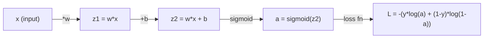
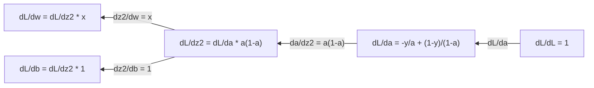
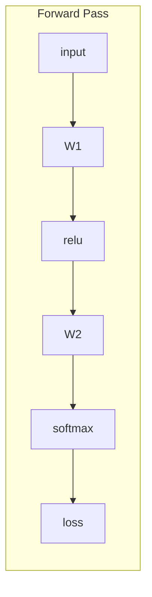
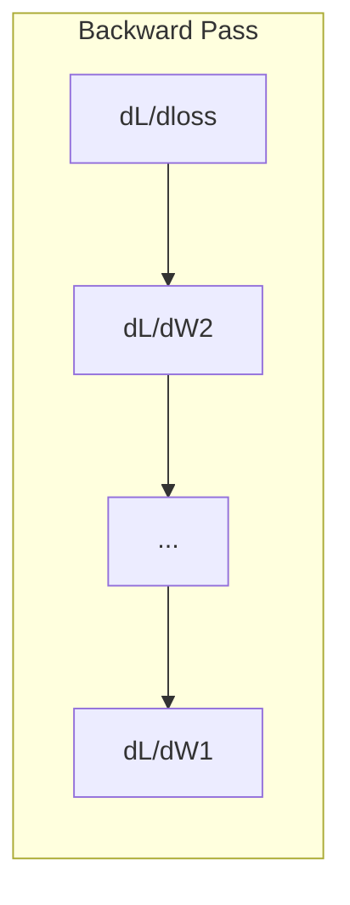

# الحسابات للتعلم الآلي

> المشتقات تخبرك في أي طريق هو الهبوط هذا كل ما تحتاج الشبكة العصبية إلى تعلمه

**Type:** Learn
**Language:**بايثون
**Prerequisites:** Phase 1, Lessons 01-03
**Time:** ~60 minutes

## أهداف التعلم

- محاسبة المشتقات العددية والتحليلية للعملات المشتركة للطاقة المعدنية (x^2, sigmoid, cross-entropy)
- تنفيذ انخفاض التدرج من الصفر لتقليل وظيفة الخسارة في 1D و 2D
- استنباط تراجع النموذج الخطوي وتدريبها عن طريق تحديثات الوزن اليدوية
- شرح المصفوفة الهسسيّة، مقربات سلسلة تايلور، وربطها بأساليب التحسين

## المشكلة

لديك شبكة عصبية مع ملايين الوزن كل وزن هو عقدة عليك أن تجد أي اتجاه لتدور كل عقدة واحدة لتجعل النموذج أقل خطأ قليلاً

بدون الحسابات، تدريب شبكة عصبية يعني تجربة التغييرات العشوائية وتأمل في الأفضل. مع المشتقات، أنت تعرف بالضبط كيف كل وزن يؤثر على الخطأ. أنت تحول كل الزر في الطريق الصحيح، في كل مرة.

## المفهوم

### ما هو المشتق؟

المشتقات تقيس معدل التغيير. بالنسبة لـ y = f(x) ، فإن المشتقات f'(x) تخبرك: إذا قمت بتشغيل x بمقدار صغير، كم يغير؟

من الناحية الجيموترية، المشتق هي ميل الخط المتعلق في نقطة.

**f(x) = x^2:**

| x | f(x) | f'(x) (slope) |
|---|------|---------------|
| 0 | 0    | 0 (flat, at the bottom) |
| 1 | 1    | 2 |
| 2 | 4    | 4 (tangent line slope at this point) |
| 3 | 9    | 6 |

عند x=2، فإن الميل هو 4 إذا حركت x قليلا إلى اليمين، يزيد من حوالي 4 مرات هذا المبلغ. عند x=0، الميل هو 0. أنت في أسفل الصحن.

التعريف الرسمي:

```
f'(x) = lim   f(x + h) - f(x)
        h->0  -----------------
                     h
```

في الرمز، تخطي الحد وتستخدم فقط h صغير جدا. هذا هو المشتق الرقمي.

### المشتقات الجزئية: متغير واحد في كل مرة

المواد الحقيقية لديها العديد من المدخلات. فقدان الشبكة العصبية يعتمد على آلاف الوزن. المشتق جزئي يحتفظ جميع المتغيرات ثابتة باستثناء واحدة، ثم يأخذ المشتق فيما يتعلق بذلك واحد.

```
f(x, y) = x^2 + 3xy + y^2

df/dx = 2x + 3y     (treat y as a constant)
df/dy = 3x + 2y     (treat x as a constant)
```

كل مشتق جزئي يجيب: إذا دفعت فقط هذا الوزن واحد، كيف يتغير الخسارة؟

### المتحدر: متجه لجميع المشتقات الجزئية

الجدار يجمع كل مشتق جزئي إلى متجه واحد. بالنسبة للعمل f ((x، y، z) ، الجدار هو:

```
grad f = [ df/dx, df/dy, df/dz ]
```

يُحدّد التسلّل في اتجاه صعود أكثر خطورة، لتحقيق الحدّ الأدنى من وظيفة، اذهب في الاتجاه المعاكس.

**Contour plot of f(x,y) = x^2 + y^2:**

تشكل الوظيفة شكل وعاء مع دائرات مركزة كخطوط شكل. الحد الأدنى هو (0, 0).

| Point | grad f | -grad f (descent direction) |
|-------|--------|----------------------------|
| (1, 1) | [2, 2] (points uphill, away from minimum) | [-2, -2] (points downhill, toward minimum) |
| (0, 0) | [0, 0] (flat, at the minimum) | [0, 0] |

هذا هو انخفاض التراجع في صورة حساب التراجع، سلبه، اتخاذ خطوة.

### الارتباط مع التحسين

تدريب شبكة عصبية هو تحسين. لديك وظيفة الخسارة L ((w1، w2، ..., wn) التي تقيس مدى خطأ النموذج. تريد تقليل ذلك.

```
Gradient descent update rule:

  w_new = w_old - learning_rate * dL/dw

For every weight:
  1. Compute the partial derivative of loss with respect to that weight
  2. Subtract a small multiple of it from the weight
  3. Repeat
```

معدل التعلم يحدد حجم الخطوة، كبير جداً و أنت تتجاوز، صغير جداً و أنت تتجول.

**Loss landscape (1D slice):**

تُشكّل وظيفة الخسارة L ((w) منحنى مع القمم والوعيّات مع تغير الوزن w.

| Feature | Description |
|---------|-------------|
| Global minimum | The lowest point on the entire curve -- the best solution |
| Local minimum | A valley that is lower than its neighbors but not the lowest overall |
| Slope | Gradient descent follows the slope downhill from any starting point |

يتبع التنحدر التدريجي التسلل الهبوطي. يمكن أن يعلق في الحد الأدنى المحلي، ولكن في المساحات العالية الأبعاد (ملايين الوزن) هذه نادرًا ما تكون مشكلة عملية.

### المشتقات الرقمية مقابل التحليلية

هناك طريقتان لحساب مشتق

التحليلي: تطبيق قواعد الحساب يدويا. بالنسبة f  x) = x^2, المشتق هي f  x) = 2x. بالضبط. سريع.

عددي: تقريري باستخدام التعريف. حساب f ((x+h) و f ((x-h) لـ h صغير، ثم استخدام الفرق.

```
Numerical (central difference):

f'(x) ~= f(x + h) - f(x - h)
          -----------------------
                  2h

h = 0.0001 works well in practice
```

المشتقات الرقمية بطيئة ولكن تعمل لأي وظيفة. المشتقات التحليلية سريعة ولكن تتطلب منك استنباط الصيغة. استخدام إطار الشبكات العصبية نهج ثالث: التمييز الآلي، الذي يحسب المشتقات الدقيقة ميكانيكيا. سترى ذلك في المرحلة 3.

### المشتقات المستخدمة يدوياً للعمل البسيط

هذه هي المشتقات التي ستراها مرارا وتكرارا في ML.

```
Function        Derivative       Used in
--------        ----------       -------
f(x) = x^2     f'(x) = 2x      Loss functions (MSE)
f(x) = wx + b  f'(w) = x        Linear layer (gradient w.r.t. weight)
                f'(b) = 1        Linear layer (gradient w.r.t. bias)
                f'(x) = w        Linear layer (gradient w.r.t. input)
f(x) = e^x     f'(x) = e^x     Softmax, attention
f(x) = ln(x)   f'(x) = 1/x     Cross-entropy loss
f(x) = 1/(1+e^-x)  f'(x) = f(x)(1-f(x))   Sigmoid activation
```

بالنسبة f ((x) = x^2:

```
f(x) = x^2    f'(x) = 2x

  x    f(x)   f'(x)   meaning
  -2    4      -4      slope tilts left (decreasing)
  -1    1      -2      slope tilts left (decreasing)
   0    0       0      flat (minimum!)
   1    1       2      slope tilts right (increasing)
   2    4       4      slope tilts right (increasing)
```

بالنسبة f(w) = wx + b مع x=3، b=1:

```
f(w) = 3w + 1    f'(w) = 3

The derivative with respect to w is just x.
If x is big, a small change in w causes a big change in output.
```

### قاعدة السلسلة

عندما تكون الوظائف مرتبة، قاعدة السلسلة تخبرك كيفية التمييز.

```
If y = f(g(x)), then dy/dx = f'(g(x)) * g'(x)

Example: y = (3x + 1)^2
  outer: f(u) = u^2       f'(u) = 2u
  inner: g(x) = 3x + 1    g'(x) = 3
  dy/dx = 2(3x + 1) * 3 = 6(3x + 1)
```

شبكات العصبية هي سلسلة من الوظائف: المدخل -> خطي -> تفعيل -> خطي -> تفعيل -> خسارة. التنشر الخلفي هو قاعدة سلسلة تطبق مرارا من الخروج إلى المدخل. وهذا هو الخوارزمية بأكملها.

### المصفوفة الهيسي

المرتفعات تخبرك بالمهد، والحسية تخبرك بالمنعطف

المادية الهسسي هي المصفوفة من المشتقات الجزئية من النظام الثاني. بالنسبة للعمل f ((x1، x2، ..., xn) ، فإن مدخل (i، j) من المادية الهسسي هو:

```
H[i][j] = d^2f / (dx_i * dx_j)
```

لـ 2 متغيرات f ((x، y):

```
H = | d^2f/dx^2    d^2f/dxdy |
    | d^2f/dydx    d^2f/dy^2 |
```

**What the Hessian tells you at a critical point (where gradient = 0):**

| Hessian property | Meaning | Example surface |
|-----------------|---------|-----------------|
| Positive definite (all eigenvalues > 0) | Local minimum | Bowl pointing up |
| Negative definite (all eigenvalues < 0) | Local maximum | Bowl pointing down |
| Indefinite (mixed eigenvalues) | Saddle point | Horse saddle shape |

**Example:**f(x, y) = x^2 - y^2 (عمل السرير)

```
df/dx = 2x       df/dy = -2y
d^2f/dx^2 = 2    d^2f/dy^2 = -2    d^2f/dxdy = 0

H = | 2   0 |
    | 0  -2 |

Eigenvalues: 2 and -2 (one positive, one negative)
--> Saddle point at (0, 0)
```

مقارنة مع f ((x, y) = x^2 + y^2 (وعاء):

```
H = | 2  0 |
    | 0  2 |

Eigenvalues: 2 and 2 (both positive)
--> Local minimum at (0, 0)
```

**Why the Hessian matters in ML:**

تستخدم طريقة نيوتن خطوات التحسين الأفضل من تراجع التراجع. بدلاً من اتباع التنحى فحسب، فإنها تأخذ بعين الاعتبار منحنى:

```
Newton's update:    w_new = w_old - H^(-1) * gradient
Gradient descent:   w_new = w_old - lr * gradient
```

طريقة نيوتن تتقارب أسرع لأن "إعادة تقييم" هيسيان التدفق -- الاتجاهات الرافية تحصل على خطوات أصغر، الاتجاهات المسطحة تحصل على خطوات أكبر.

المشكلة: لشبكة عصبية مع N المعلمات، هي Hessian N x N. نموذج مع 1 مليون المعلمات سوف تحتاج إلى 1 تريليون مدخل المصفوفة. وهذا هو السبب في أننا نستخدم التقارير.

| Method | What it uses | Cost | Convergence |
|--------|-------------|------|-------------|
| Gradient descent | First derivatives only | O(N) per step | Slow (linear) |
| Newton's method | Full Hessian | O(N^3) per step | Fast (quadratic) |
| L-BFGS | Approximate Hessian from gradient history | O(N) per step | Medium (superlinear) |
| Adam | Per-parameter adaptive rates (diagonal Hessian approx) | O(N) per step | Medium |
| Natural gradient | Fisher information matrix (statistical Hessian) | O(N^2) per step | Fast |

في الممارسة العملية، آدم هو المحسن الافتراضي للتعلم العميق. إنه يقترب من المعلومات من الدرجة الثانية بأسعار رخيصة عن طريق تتبع المتوسط الجاري وتباين التدرج لكل پیرامتر.

### تقارب سلسلة تايلور

يمكن تقريب أي وظيفة سلاسة محليا عن طريق الكتلة:

```
f(x + h) = f(x) + f'(x)*h + (1/2)*f''(x)*h^2 + (1/6)*f'''(x)*h^3 + ...
```

كلما تضيف المزيد من المصطلحات، كلما كانت التقريبات أفضل -- ولكن فقط بالقرب من النقطة x.

**Why Taylor series matter for ML:**

- **First-order Taylor = gradient descent.**عندما تستخدم f(x + h) ~ f(x) + f'(x) *h، فإنك تقوم بتقريب خطي. يقلل التنزل التدريجي هذا النموذج الخطي للاختيار h = -lr * f'(x.

- **Second-order Taylor = Newton's method.**باستخدام f(x + h) ~ f(x) + f'(x) *h + (1/2) *f'(x) *h^2 ، تحصل على نموذج مربع. تحد من ذلك يمنح h = -f'(x) / f'(x) -- خطوة نيوتن.

- **Loss function design.**إن MSE و entropy متسطّة، مما يعني أنّ توسعاتها Taylor تتصرف بشكل جيد. هذه ليست حادثة. الخسائر السلسة تجعل التكيفّيّة قابلة للتنبؤ.

```
Approximation order    What it captures    Optimization method
-------------------    -----------------   -------------------
0th order (constant)   Just the value      Random search
1st order (linear)     Slope               Gradient descent
2nd order (quadratic)  Curvature           Newton's method
Higher orders          Finer structure     Rarely used in ML
```

المفهوم الرئيسي: كل التحسين القائم على التراجع هو حقا حول تقريب وظيفة الخسارة محليا وتحقيق الحد الأدنى من هذا التقريب.

### الإجماليات في ML

المشتقات تخبرك بمعدلات التغيير. الكاملات تحسب التراكم -- المساحة تحت منحنى.

في ML، نادراً ما تقوم بحساب التكاملات يدوياً، لكن المفهوم موجود في كل مكان:

**Probability.**بالنسبة لمتغير عشوائي مستمر مع كثافة p ((x):
```
P(a < X < b) = integral from a to b of p(x) dx
```
المساحة تحت منحنى كثافة الاحتمال بين a و b هي احتمال الهبوط في هذا النطاق.

**Expected value.**النتيجة المتوسطة الموزعة بالاحتمال:
```
E[f(X)] = integral of f(x) * p(x) dx
```
الخسارة المتوقعة على توزيع البيانات هي جزء لا يتجزأ. التدريب يقلل من التقريب التجريبي لهذا.

**KL divergence.**تقيس مدى اختلاف توزيعين:
```
KL(p || q) = integral of p(x) * log(p(x) / q(x)) dx
```
يستخدم في VAEs، نزيف المعرفة، والإستنتاج البايسي.

**Normalization constants.**في استنتاج بايزي:
```
p(w | data) = p(data | w) * p(w) / integral of p(data | w) * p(w) dw
```
المعاد هو جزء متكامل على جميع قيم المعلمات المحتملة. غالبا ما يكون غير قابلة للتحدي، وهذا هو السبب في أننا نستخدم التقريبات مثل MCMC والإستنتاج المتغير.

| Integral concept | Where it appears in ML |
|-----------------|----------------------|
| Area under curve | Probability from density functions |
| Expected value | Loss functions, risk minimization |
| KL divergence | VAEs, policy optimization, distillation |
| Normalization | Bayesian posteriors, softmax denominator |
| Marginal likelihood | Model comparison, evidence lower bound (ELBO) |

### قاعدة سلسلة متعددة المتغيرات في الرسم البياني الحسابي

لا تنطبق قاعدة السلسلة على الوظائف المتعددة في خط. في شبكة عصبية، تتراوح المتغيرات وتدمج. إليك كيف تتدفق المشتقات من خلال مرور بسيط للأمام:



الممر الخلفي يحسب التراجع من يمين إلى يسار:



كل سهم يضاعف بمشتقات محلية. تراجع لأي معادلة هو ناتج من جميع المشتقات المحلية على طول المسار من الخسارة إلى تلك المعادلة. عندما تتفرق المسارات وتدمج، يمكنك جمع المساهمات (قاعدة سلسلة متعددة المتغيرات).

هذا كل التنشر الخلفي هو: قاعدة سلسلة تطبق بشكل منهجي من خلال الرسم البياني الحسابي، من الخروج إلى المدخلات.

### المصفوفة جاكوبية

عندما تقوم وظيفة بتخريط متجه إلى متجه (مثل طبقة شبكة عصبية) ، فإن مشتقها هو المصفوفة. يحتوي جيكوبيان على كل مشتق جزئي لكل خروج فيما يتعلق بكل مدخل.

بالنسبة إلى f: R^n -> R^m، فإن J Jacobian هو ماتريكس m x n:

| | x1 | x2 | ... | xn |
|---|---|---|---|---|
| f1 | df1/dx1 | df1/dx2 | ... | df1/dxn |
| f2 | df2/dx1 | df2/dx2 | ... | df2/dxn |
| ... | ... | ... | ... | ... |
| fm | dfm/dx1 | dfm/dx2 | ... | dfm/dxn |

لن تقوم بحساب الجيكوبيانات يدوياً لشبكات العصبية. يديرها بيتورش. ولكن معرفة وجودها تساعدك على فهم الأشكال في الانتشار الخلفي: إذا كانت الطبقة تقوم بتخطيط R^n إلى R^m، فإن جيكوبيانها m x n. يتدفق التدفق الخلفي عبر نقل هذه المصفوفة.

### لماذا هذا مهم للشبكات العصبية

كل وزن في شبكة عصبية يحصل على تراجع. تراجع يخبرك كيفية ضبط هذا الوزن لتقليل الخسارة.





كل تحديث للوزن:
- `W1 = W1 - lr * dL/dW1`
- `W2 = W2 - lr * dL/dW2`

المخطط الأمامي يحسب التنبؤ والخسارة، المخطط الخلفي يحسب تراجع الخسارة فيما يتعلق بكل وزن، ثم كل وزن يأخذ خطوة صغيرة أسفل التلال. كرر لملايين الخطوات. وهذا هو التعلم العميق.

```figure
derivative-tangent
```

## بناءها

### الخطوة الأولى: المشتق العددي من الصفر

```python
def numerical_derivative(f, x, h=1e-7):
    return (f(x + h) - f(x - h)) / (2 * h)

def f(x):
    return x ** 2

for x in [-2, -1, 0, 1, 2]:
    numerical = numerical_derivative(f, x)
    analytical = 2 * x
    print(f"x={x:2d}  f'(x) numerical={numerical:.6f}  analytical={analytical:.1f}")
```

المشتق العددي يطابق المشتق التحليلي مع العديد من الأماكن العشرية.

### الخطوة الثانية: مشتقات جزئية ومحافظات

```python
def numerical_gradient(f, point, h=1e-7):
    gradient = []
    for i in range(len(point)):
        point_plus = list(point)
        point_minus = list(point)
        point_plus[i] += h
        point_minus[i] -= h
        partial = (f(point_plus) - f(point_minus)) / (2 * h)
        gradient.append(partial)
    return gradient

def f_multi(point):
    x, y = point
    return x**2 + 3*x*y + y**2

grad = numerical_gradient(f_multi, [1.0, 2.0])
print(f"Numerical gradient at (1,2): {[f'{g:.4f}' for g in grad]}")
print(f"Analytical gradient at (1,2): [2*1+3*2, 3*1+2*2] = [{2*1+3*2}, {3*1+2*2}]")
```

### الخطوة الثالثة: التراجع التدريجي للعثور على الحد الأدنى من f ((x) = x^2

```python
x = 5.0
lr = 0.1
for step in range(20):
    grad = 2 * x
    x = x - lr * grad
    print(f"step {step:2d}  x={x:8.4f}  f(x)={x**2:10.6f}")
```

بدءا من x=5، كل خطوة تتحرك أقرب إلى x=0 (الأقل).

### الخطوة الرابعة: انخفاض درجي على وظيفة 2D

```python
def f_2d(point):
    x, y = point
    return x**2 + y**2

point = [4.0, 3.0]
lr = 0.1
for step in range(30):
    grad = numerical_gradient(f_2d, point)
    point = [p - lr * g for p, g in zip(point, grad)]
    loss = f_2d(point)
    if step % 5 == 0 or step == 29:
        print(f"step {step:2d}  point=({point[0]:7.4f}, {point[1]:7.4f})  f={loss:.6f}")
```

### الخطوة 5: مقارنة المشتقات العددية والتحليلية

```python
import math

test_functions = [
    ("x^2",      lambda x: x**2,          lambda x: 2*x),
    ("x^3",      lambda x: x**3,          lambda x: 3*x**2),
    ("sin(x)",   lambda x: math.sin(x),   lambda x: math.cos(x)),
    ("e^x",      lambda x: math.exp(x),   lambda x: math.exp(x)),
    ("1/x",      lambda x: 1/x,           lambda x: -1/x**2),
]

x = 2.0
print(f"{'Function':<12} {'Numerical':>12} {'Analytical':>12} {'Error':>12}")
print("-" * 50)
for name, f, df in test_functions:
    num = numerical_derivative(f, x)
    ana = df(x)
    err = abs(num - ana)
    print(f"{name:<12} {num:12.6f} {ana:12.6f} {err:12.2e}")
```

### الخطوة 6: حساب الهسسي عددا

```python
def hessian_2d(f, x, y, h=1e-5):
    fxx = (f(x + h, y) - 2 * f(x, y) + f(x - h, y)) / (h ** 2)
    fyy = (f(x, y + h) - 2 * f(x, y) + f(x, y - h)) / (h ** 2)
    fxy = (f(x + h, y + h) - f(x + h, y - h) - f(x - h, y + h) + f(x - h, y - h)) / (4 * h ** 2)
    return [[fxx, fxy], [fxy, fyy]]

def saddle(x, y):
    return x ** 2 - y ** 2

def bowl(x, y):
    return x ** 2 + y ** 2

H_saddle = hessian_2d(saddle, 0.0, 0.0)
H_bowl = hessian_2d(bowl, 0.0, 0.0)
print(f"Saddle Hessian: {H_saddle}")  # [[2, 0], [0, -2]] -- mixed signs
print(f"Bowl Hessian:   {H_bowl}")    # [[2, 0], [0, 2]]  -- both positive
```

يحتوي الحسسي لـ 2 و -2 (أشارة مختلطة تؤكد نقطة السرير). والقوطة لديها قيم خاصة 2 و 2 (كلتا إيجابية، تؤكد الحد الأدنى).

### الخطوة 7: تقريب تايلور في العمل

```python
import math

def taylor_approx(f, f_prime, f_double_prime, x0, h, order=2):
    result = f(x0)
    if order >= 1:
        result += f_prime(x0) * h
    if order >= 2:
        result += 0.5 * f_double_prime(x0) * h ** 2
    return result

x0 = 0.0
for h in [0.1, 0.5, 1.0, 2.0]:
    true_val = math.sin(h)
    t1 = taylor_approx(math.sin, math.cos, lambda x: -math.sin(x), x0, h, order=1)
    t2 = taylor_approx(math.sin, math.cos, lambda x: -math.sin(x), x0, h, order=2)
    print(f"h={h:.1f}  sin(h)={true_val:.4f}  order1={t1:.4f}  order2={t2:.4f}")
```

قريب من x0=0, sin(x) ~ x (تايلور من الدرجة الأولى). التقريب ممتاز ل h صغير ولكن ينفصل ل h كبير. هذا هو السبب في أن تراجع التراجع يعمل بشكل أفضل مع معدلات التعلم الصغيرة - كل خطوة يفترض التقريب الخطي دقيق.

### الخطوة الثامنة: لماذا هذا مهم لشبكة عصبية

```python
import random

random.seed(42)

w = random.gauss(0, 1)
b = random.gauss(0, 1)
lr = 0.01

xs = [1.0, 2.0, 3.0, 4.0, 5.0]
ys = [3.0, 5.0, 7.0, 9.0, 11.0]

for epoch in range(200):
    total_loss = 0
    dw = 0
    db = 0
    for x, y in zip(xs, ys):
        pred = w * x + b
        error = pred - y
        total_loss += error ** 2
        dw += 2 * error * x
        db += 2 * error
    dw /= len(xs)
    db /= len(xs)
    total_loss /= len(xs)
    w -= lr * dw
    b -= lr * db
    if epoch % 40 == 0 or epoch == 199:
        print(f"epoch {epoch:3d}  w={w:.4f}  b={b:.4f}  loss={total_loss:.6f}")

print(f"\nLearned: y = {w:.2f}x + {b:.2f}")
print(f"Actual:  y = 2x + 1")
```

كل حلقة تدريبية مبنية على التراجع تتبع هذا النمط: التنبؤ، فقدان الحساب، تراجع الحساب، وزن التحديث.

## استخدمها

مع NumPy، نفس العمليات أسرع وأكثر وضوحا:

```python
import numpy as np

x = np.array([1, 2, 3, 4, 5], dtype=float)
y = np.array([3, 5, 7, 9, 11], dtype=float)

w, b = np.random.randn(), np.random.randn()
lr = 0.01

for epoch in range(200):
    pred = w * x + b
    error = pred - y
    loss = np.mean(error ** 2)
    dw = np.mean(2 * error * x)
    db = np.mean(2 * error)
    w -= lr * dw
    b -= lr * db

print(f"Learned: y = {w:.2f}x + {b:.2f}")
```

لقد بنيت للتو انخفاض التراجعية من الصفر PyTorch تلقائي الحسابات التراجعية، ولكن حلقة التحديث هو نفسه.

## التمارين

1. تنفيذ`numerical_second_derivative(f, x)`استخدام `numerical_derivative`ثاني مشتق من x^3 عند x=2 هو 12.
2. استخدم نسبة تراجع التراجع لتحديد الحد الأدنى من f ((x, y) = (x - 3) ^ 2 + (y + 1) ^ 2. تبدأ من (0, 0). يجب أن تتحلى الإجابة إلى (3, -1).
3. إضافة الزخم إلى حلقة هبوط التدرج: الحفاظ على متجه السرعة الذي يتراكم في التدرج السابق. مقارنة سرعة التقارب مع ودون الزخم على f ((x) = x^4 - 3x^2.

## الشروط الرئيسية

| Term | What people say | What it actually means |
|------|----------------|----------------------|
| Derivative | "The slope" | The rate of change of a function at a point. Tells you how much the output changes per unit change in input. |
| Partial derivative | "Derivative of one variable" | The derivative with respect to one variable while all others are held constant. |
| Gradient | "Direction of steepest ascent" | A vector of all partial derivatives. Points in the direction that increases the function fastest. |
| Gradient descent | "Go downhill" | Subtract the gradient (times a learning rate) from the parameters to reduce the loss. The core of neural network training. |
| Learning rate | "Step size" | A scalar that controls how big each gradient descent step is. Too large: diverge. Too small: converge slowly. |
| Chain rule | "Multiply the derivatives" | The rule for differentiating composed functions: df/dx = df/dg * dg/dx. The mathematical basis of backpropagation. |
| Jacobian | "Matrix of derivatives" | When a function maps vectors to vectors, the Jacobian is the matrix of all partial derivatives of outputs with respect to inputs. |
| Numerical derivative | "Finite differences" | Approximating a derivative by evaluating the function at two nearby points and computing the slope between them. |
| Backpropagation | "Reverse-mode autodiff" | Computing gradients layer by layer from output to input using the chain rule. How neural networks learn. |
| Hessian | "Matrix of second derivatives" | The matrix of all second-order partial derivatives. Describes the curvature of a function. Positive definite Hessian at a critical point means local minimum. |
| Taylor series | "Polynomial approximation" | Approximating a function near a point using its derivatives: f(x+h) ~ f(x) + f'(x)h + (1/2)f''(x)h^2 + ... The basis for understanding why gradient descent and Newton's method work. |
| Integral | "Area under the curve" | The accumulation of a quantity over a range. In ML, integrals define probabilities, expected values, and KL divergence. |

## المزيد من القراءة

- [3Blue1Brown: Essence of Calculus](https://www.3blue1brown.com/topics/calculus)- البصرية للشتات والتكاملات وقاعدة السلسلة
- [Stanford CS231n: Backpropagation](https://cs231n.github.io/optimization-2/)- كيف تتدفق التدرج عبر طبقات الشبكة العصبية
