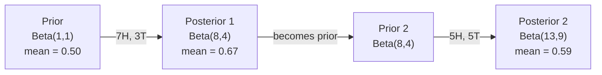

# نظرية بايز

> الاحتمال يتعلق بما تتوقعه، نظرية بايز يتعلق بما تتعلمينه

**Type:** Build
**Language:**بايثون
**Prerequisites:** Phase 1, Lesson 06 (Probability Fundamentals)
**Time:** ~75 minutes

## أهداف التعلم

- تطبيق نظرية بايز لحساب الاحتمالات اللاحقة من السابقات والاحتمالات والدليل
- بناء تصنيف نصي بييز البديل من الصفر مع تسطيح لابلاس وحسابات الموقع السجل
- مقارنة تقدير MLE و MAP و شرح كيف أن MAP تتوافق مع تنظيم L2
- تنفيذ التحديثات البايسية المتسلسلة باستخدام مسبقات التوافق بين البينوميات بيتا للاختبار A / B

## المشكلة

الاختبار الطبي دقيق بنسبة 99٪، الاختبار إيجابي، ما هي فرصك في الإصابة بالمرض؟

معظم الناس يقولون 99٪. الإجابة الحقيقية تعتمد على مدى نادرة المرض. إذا كان 1 من كل 10،000 شخص لديه، النتيجة الإيجابية تعطيك فقط حوالي 1% فرصة المرض. النتيجة الإيجابية الأخرى 99٪ هي إنذارات كاذبة من الناس الصحيين.

هذا ليس سؤال خدعة. إنه نظرية بايز. كل مرشح للفريد الإلكتروني، كل تشخيص طبي، كل نموذج تعلم الآلة الذي يقدر عدم اليقين يستخدم هذا التفكير بالضبط. تبدأ بالاعتقاد. ترى الأدلة. تحديث.

إذا قمت ببناء أنظمة ML دون فهم هذا، سوف تفسر الخروجات النموذجية بشكل خاطئ، وتحدد حدود سيئة، وتشحن توقعات ثقة مفرطة.

## المفهوم

### من احتمال المشترك إلى بايز

تعرف من الدروس 06 بالفعل أن الاحتمال المشروط هو:

```
P(A|B) = P(A and B) / P(B)
```

و بالتناظر:

```
P(B|A) = P(A and B) / P(A)
```

كل من المصطلحات تشارك نفس العداد: P ((A و B). ضعها متساوية وإعادة ترتيبها:

```
P(A and B) = P(A|B) * P(B) = P(B|A) * P(A)

Therefore:

P(A|B) = P(B|A) * P(A) / P(B)
```

هذه هي نظرية (بايز) أربعة كميات معادلة واحدة

### الأجزاء الأربعة

| Part | Name | What it means |
|------|------|---------------|
| P(A\|B) | Posterior | Your updated belief about A after seeing evidence B |
| P(B\|A) | Likelihood | How probable the evidence B is if A is true |
| P(A) | Prior | Your belief about A before seeing any evidence |
| P(B) | Evidence | Total probability of seeing B under all possibilities |

المفهوم الدليل P ((B) يعمل كمنع للطبيعية. يمكنك توسيعه باستخدام قانون الاحتمال الكلي:

```
P(B) = P(B|A) * P(A) + P(B|not A) * P(not A)
```

### مثال على الاختبار الطبي

يصاب مرض واحد من بين 10 آلاف شخص. الاختبار دقيق بنسبة 99٪ (يقوم بتصيد 99٪ من المرضى، ويقدم نتائج إيجابية كاذبة في 1٪ من الوقت).

```
P(sick)          = 0.0001     (prior: disease is rare)
P(positive|sick) = 0.99       (likelihood: test catches it)
P(positive|healthy) = 0.01    (false positive rate)

P(positive) = P(positive|sick) * P(sick) + P(positive|healthy) * P(healthy)
            = 0.99 * 0.0001 + 0.01 * 0.9999
            = 0.000099 + 0.009999
            = 0.010098

P(sick|positive) = P(positive|sick) * P(sick) / P(positive)
                 = 0.99 * 0.0001 / 0.010098
                 = 0.0098
                 = 0.98%
```

أقل من 1٪، عندما تكون حالة نادرة، حتى الاختبارات الدقيقة تنتج في الغالب نتائج إيجابية كاذبة. لهذا السبب يطلب الأطباء اختبارات تأكيد.

### مثال على مرشحات البريد الإلكتروني

تتلقى رسالة بريد إلكتروني تحتوي على كلمة "لوتري" هل هي رسالة غير مرسلة؟

```
P(spam)                = 0.3      (30% of email is spam)
P("lottery"|spam)      = 0.05     (5% of spam emails contain "lottery")
P("lottery"|not spam)  = 0.001    (0.1% of legitimate emails contain "lottery")

P("lottery") = 0.05 * 0.3 + 0.001 * 0.7
             = 0.015 + 0.0007
             = 0.0157

P(spam|"lottery") = 0.05 * 0.3 / 0.0157
                  = 0.955
                  = 95.5%
```

كلمة واحدة تحول احتمال من 30% إلى 95.5% مرشح بريد غير مرغوب فيه حقيقي يطبق بايز على مئات الكلمات في وقت واحد.

### البغاء بايز: افتراض الاستقلال

يمتد بييز البسيط هذا إلى العديد من الميزات عن طريق افتراض أن جميع الميزات مستقلة مشروطًا نظراً للطبقة:

```
P(class | feature_1, feature_2, ..., feature_n)
  = P(class) * P(feature_1|class) * P(feature_2|class) * ... * P(feature_n|class)
    / P(feature_1, feature_2, ..., feature_n)
```

الجزء "ساف" هو افتراض الاستقلال. في النص، لا تكون حالات الكلمات مستقلة ("جديدة" و "يورك" مرتبطة). ولكن هذا الافتراض يعمل بشكل مفاجئ في الممارسة العملية لأن المصنف يحتاج فقط إلى تصنيف الفئات، وليس إنتاج احتمالات مقياسية.

بما أن المُعادل هو نفسه لجميع الفصول، يمكنك تخطي ذلك وتقارن العدّيات:

```
score(class) = P(class) * product of P(feature_i | class)
```

اختر الصف الذي يحصل على أعلى درجة

### تقدير الحد الأقصى للاحتمالات (MLE)

كيف تحصل على P "ميزة "من "مجموعة" من بيانات التدريب؟

```
P("free"|spam) = (number of spam emails containing "free") / (total spam emails)
```

هذا هو MLE: اختيار قيم المعايير التي تجعل البيانات الملاحظة أكثر احتمالية. أنت تعظيم وظيفة الاحتمال، والتي بالنسبة للعد التفريقية تقلل إلى التردد النسبي.

المشكلة: إذا لم تظهر كلمة في البريد الإلكتروني أثناء التدريب، فإن MLE يعطي احتمال صفر. كلمة واحدة غير مرئية تقتل المنتج بأكمله.

```
P(word|class) = (count(word, class) + 1) / (total_words_in_class + vocabulary_size)
```

إضافة 1 لكل عدد يضمن عدم وجود احتمال هو أبدا صفر.

### الحد الأقصى a posteriori (MAP)

يسأل MLE: ما هي المعايير التي تُعزز P ((معلومات المعايير)) ؟

يطرح MAP: ما هي المعايير التي تُعزز P(معايير في البيانات) ؟

من خلال نظرية بايز:

```
P(parameters|data) proportional to P(data|parameters) * P(parameters)
```

يضيف MAP سابقة على المعلمات نفسها. إذا كنت تعتقد أن المعلمات يجب أن تكون صغيرة، فإنك ترميز ذلك كقبلة تعاقب القيم الكبيرة. هذا هو نفسه من تنظيم L2 في ML. عقوبة "الجزء" في تراجع الخضروة هو حرفيا قبل غوسية على الوزن.

| Estimation | Optimizes | ML equivalent |
|------------|-----------|---------------|
| MLE | P(data\|params) | Unregularized training |
| MAP | P(data\|params) * P(params) | L2 / L1 regularization |

### البايسية مقابل المتردد: الفرق العملي

يُعتبر علماء التكرار المعايير غير معروفة، ويقولون: "إذا كررت هذه التجربة عدة مرات، ماذا سيحدث؟"

يُعتبر البايزيون المعايير تقسيمًا. يسألون: "نظراً لما لاحظت، ما الذي أؤمن به عن المعايير؟"

بالنسبة لبناء أنظمة ML، الفرق العملي:

| Aspect | Frequentist | Bayesian |
|--------|-------------|----------|
| Output | Point estimate | Distribution over values |
| Uncertainty | Confidence intervals (about procedure) | Credible intervals (about parameter) |
| Small data | Can overfit | Prior acts as regularization |
| Computation | Usually faster | Often requires sampling (MCMC) |

معظم أساليب الإنتاج المعدنية هي المتكررة (SGD، تقديرات النقاط). أساليب بايزيونية تظهر عندما تحتاج إلى عدم اليقين المعدل (قرارات طبية، نظم أساسية للسلامة) أو عندما تكون البيانات نادرة (تعلم القليل من اللقطات، بدء البرد).

### لماذا تفكير بايسي مهم لـ ML

العلاقة أعمق من التشابه

**Priors are regularization.**السابق غوسي على الوزن هو L2 التنظيم. سابق لابلاس هو L1. كلما أضفت مصطلح التنظيم، أنت تقوم بإعداد بيان بايسي حول أي قيم المعلمات تتوقع.

**Posteriors are uncertainty.**لا يخبرك احتمال واحد متوقع عن مدى ثقة النموذج في تلك التقديرات. تقديم أساليب بايسيون لك توزيع: "أعتقد أن P(سبام) هو بين 0.8 و 0.95. "

**Bayes updates are online learning.**ما بعد اليوم يصبح ما قبل غداً عندما يرى نموذجك بيانات جديدة، يقوم بتحديث معتقداته تدريجياً بدلاً من إعادة التدريب من الصفر.

**Model comparison is Bayesian.**معايير المعلومات البايزية (BIC) ، والاحتمال الحدودي، وعوامل بايز جميعها تستخدم التفكير البايزية للاختيار بين النماذج دون إعادة التكيف.

```figure
bayes-update
```

## بناءها

### الخطوة 1: وظيفة نظرية بايز

```python
def bayes(prior, likelihood, false_positive_rate):
    evidence = likelihood * prior + false_positive_rate * (1 - prior)
    posterior = likelihood * prior / evidence
    return posterior

result = bayes(prior=0.0001, likelihood=0.99, false_positive_rate=0.01)
print(f"P(sick|positive) = {result:.4f}")
```

### الخطوة الثانية: تصنيف "بايز" البديل

```python
import math
from collections import defaultdict

class NaiveBayes:
    def __init__(self, smoothing=1.0):
        self.smoothing = smoothing
        self.class_counts = defaultdict(int)
        self.word_counts = defaultdict(lambda: defaultdict(int))
        self.class_word_totals = defaultdict(int)
        self.vocab = set()

    def train(self, documents, labels):
        for doc, label in zip(documents, labels):
            self.class_counts[label] += 1
            words = doc.lower().split()
            for word in words:
                self.word_counts[label][word] += 1
                self.class_word_totals[label] += 1
                self.vocab.add(word)

    def predict(self, document):
        words = document.lower().split()
        total_docs = sum(self.class_counts.values())
        vocab_size = len(self.vocab)
        best_class = None
        best_score = float("-inf")
        for cls in self.class_counts:
            score = math.log(self.class_counts[cls] / total_docs)
            for word in words:
                count = self.word_counts[cls].get(word, 0)
                total = self.class_word_totals[cls]
                score += math.log((count + self.smoothing) / (total + self.smoothing * vocab_size))
            if score > best_score:
                best_score = score
                best_class = cls
        return best_class
```

احتمالات السجل تمنع التدفقات. مضاعفة العديد من الاحتمالات الصغيرة تنتج أرقام صغيرة جداً للوصول إلى نقطة عائمة. جمع احتمالات السجل مستقرة عدداً وموازية رياضية.

### الخطوة الثالثة: تدريب على بيانات البريد الإلكتروني

```python
train_docs = [
    "win free money now",
    "free lottery ticket winner",
    "claim your prize today free",
    "urgent offer free cash",
    "congratulations you won free",
    "meeting tomorrow at noon",
    "project update attached",
    "can we schedule a call",
    "quarterly report review",
    "lunch on thursday sounds good",
    "team standup notes attached",
    "please review the pull request",
]

train_labels = [
    "spam", "spam", "spam", "spam", "spam",
    "ham", "ham", "ham", "ham", "ham", "ham", "ham",
]

classifier = NaiveBayes()
classifier.train(train_docs, train_labels)

test_messages = [
    "free money waiting for you",
    "meeting rescheduled to friday",
    "you won a free prize",
    "please review the attached report",
]

for msg in test_messages:
    print(f"  '{msg}' -> {classifier.predict(msg)}")
```

### الخطوة الرابعة: تحقق من الاحتمالات المتعلقة

```python
def show_top_words(classifier, cls, n=5):
    vocab_size = len(classifier.vocab)
    total = classifier.class_word_totals[cls]
    probs = {}
    for word in classifier.vocab:
        count = classifier.word_counts[cls].get(word, 0)
        probs[word] = (count + classifier.smoothing) / (total + classifier.smoothing * vocab_size)
    sorted_words = sorted(probs.items(), key=lambda x: x[1], reverse=True)
    for word, prob in sorted_words[:n]:
        print(f"    {word}: {prob:.4f}")

print("\nTop spam words:")
show_top_words(classifier, "spam")
print("\nTop ham words:")
show_top_words(classifier, "ham")
```

## استخدمها

سفن سكيت-تعلم جاهزة للإنتاج تنفيذات بييز الباهية:

```python
from sklearn.feature_extraction.text import CountVectorizer
from sklearn.naive_bayes import MultinomialNB
from sklearn.metrics import classification_report

vectorizer = CountVectorizer()
X_train = vectorizer.fit_transform(train_docs)
clf = MultinomialNB()
clf.fit(X_train, train_labels)

X_test = vectorizer.transform(test_messages)
predictions = clf.predict(X_test)
for msg, pred in zip(test_messages, predictions):
    print(f"  '{msg}' -> {pred}")
```

نفس الخوارزمية. CountVectorizer يدير التوجيه وبناء المفردات. MultinomialNB يدير السلسة والاحتمالات السجلة داخليا. نسخة من الصفر تفعل الشيء نفسه في 40 سطر.

## أرسله

فمجموعة NaiveBayes التي تم بناؤها هنا تظهر خط الأنابيب الكامل: التكنولوجيا، وتقدير الاحتمالات مع تسطيح Laplace، وتنبؤ الفضاء السجل.`code/bayes.py`تعمل من نهاية إلى نهاية بدون أي اعتمادات خارج مكتبة Python القياسية.

### الاولى المتزوجة

عندما تنتمي الاولى والخلفية إلى نفس عائلة التوزيعات، يسمى الاولى "مُتوافق". وهذا يجعل تحديث البايزيانية نظيفة الجبرياً -- تحصل على شكل مغلق خلفي دون تكامل عددي.

| Likelihood | Conjugate Prior | Posterior | Example |
|-----------|----------------|-----------|---------|
| Bernoulli | Beta(a, b) | Beta(a + successes, b + failures) | Coin flip bias estimation |
| Normal (known variance) | Normal(mu_0, sigma_0) | Normal(weighted mean, smaller variance) | Sensor calibration |
| Poisson | Gamma(a, b) | Gamma(a + sum of counts, b + n) | Modeling arrival rates |
| Multinomial | Dirichlet(alpha) | Dirichlet(alpha + counts) | Topic modeling, language models |

لماذا هذا مهم: بدون سابقات متجانسة، تحتاج إلى عينات مونت كارلو أو استنتاج التغيرات لتقريب الظهر. مع سابقات متجانسة، يمكنك فقط تحديث اثنين من الأرقام.

توزيع بيتا هو الأكثر شيوعاً قبل المرتبطة في الممارسة العملية. بيتا ((أ، ب) يمثل معتقدك حول مبرمير احتمال. المتوسط هو a/(a+b). كلما كان أكبر a+b، كلما كان التوزيع أكثر تركيزاً (ثقة).

الحالات الخاصة من قبل البيتا:
- بيتا 1 = موحدة. ليس لديك رأي حول المعيار.
- بيتا ((10, 10) = ذروته عند 0.5 أنت تعتقد بقوة أن المعلم قريب من 0.5
- بيتا ((1، 10) = منحرف نحو 0 تعتقد أن المعيار صغير.

قاعدة التحديث بسيطة جداً:

```
Prior:     Beta(a, b)
Data:      s successes, f failures
Posterior: Beta(a + s, b + f)
```

لا يوجد تكاملات، لا تجميع عينات، مجرد إضافة

### تحديث بايزي متسلسل

استنتاج بايزيان هو بطبيعة الحال تسلسلي. ما بعد اليوم يصبح ما قبل غدا. هكذا تتعلم الأنظمة الحقيقية بشكل تدريجي دون إعادة معالجة جميع البيانات التاريخية.

مثال ملموس: تقدير ما إذا كان العملة عادلة.

**Day 1: No data yet.**
تبدأ بـ (بيتا) 1، 1 -- مسبقاً موحداً. ليس لديك رأي.
- متوسط سابق: 0.5
- الـ (prior) مسطح على طول [0, 1]

**Day 2: Observe 7 heads, 3 tails.**
الخلفي = بيتا ((1 + 7 ، 1 + 3) = بيتا ((8, 4)
- متوسط الخلفي: 8/12 = 0.667
- الأدلة تشير إلى أن العملة محايدة نحو الرؤوس

**Day 3: Observe 5 more heads, 5 more tails.**
استخدموا مؤخرة البارحة كأسبقية اليوم
الخلفي = بيتا ((8 + 5 ، 4 + 5) = بيتا ((13, 9)
- متوسط الخلفي: 13/22 = 0.591
- البيانات الجديدة المتوازنة سحبت التقدير إلى الوراء نحو 0.5



ترتيب الملاحظات لا يهم. تحديث بيتا ((1,1) مع كل 12 رأسًا و 8 ذيلًا في وقت واحد يعطي بيتا ((13, 9) - نفس النتيجة. التحديث التسلسلي وتحديث اللحوم متساوية رياضياً. ولكن التحديث التسلسلي يسمح لك بإجراء قرارات في كل خطوة دون تخزين البيانات الخام.

هذا هو أساس التعلم عبر الإنترنت في أنظمة ML الإنتاج. تستخدم تسمسون العينات للصيادين، وأنظمة التوصية المتزايدة، وكاشفات الانحرافات المتدفقة جميعها هذا النمط.

### الاتصال بإختبار A/B

اختبار A/B هو استنتاج بايزيان في التظاهر.

الإعداد: تقوم بتجربة لونين زرين: الفارق A (الأزرق) والفارق B (الأخضر). تريد أن تعرف أي من هذه الفارقين يحصل على مزيد من النقرات.

اختبار بييزيان A/B:

1. **Prior.**ابدأ بـ (بيتا) 1، 1 لكلتا الطرق، لا تفضيل سابق
2. **Data.**الفارق A: 50 نقرة من 1000 عرض. الفارق B: 65 نقرة من 1000 عرض.
3. **Posteriors.**
   - ج: بيتا ((1 + 50 ، 1 + 950) = بيتا ((51 ، 951) ، المتوسط = 0.051
   - ب: بيتا ((1 + 65، 1 + 935) = بيتا ((66, 936). المتوسط = 0.066
4. **Decision.**الحساب P ((B > A) -- احتمال أن معدل تحويل الحقيقي B هو أعلى من A.

الحساب P ((B > A) تحليليًا صعب. لكن مونت كارلو يجعله طفيفًا:

```
1. Draw 100,000 samples from Beta(51, 951)  -> samples_A
2. Draw 100,000 samples from Beta(66, 936)  -> samples_B
3. P(B > A) = fraction of samples where B > A
```

إذا كان P(B > A) > 0.95, فأنت ترسل النوع B. إذا كان بين 0.05 و 0.95, فأنت تستمر في جمع البيانات. إذا كان P(B > A) < 0.05, فأنت ترسل النوع A.

المزايا على اختبار A/B المتكرر:
- تحصل على بيان احتمال مباشر: "هناك فرصة 97% B هو أفضل"
- لا يوجد أي إرتباط مع قيمة (ب) لا يوجد "فشل في رفض الفرضية الصفرية"
- يمكنك التحقق من النتائج في أي وقت دون زيادة معدلات الإيجابية الكاذبة (لا يوجد "مشكلة في البحث")
- يمكنك دمج المعرفة السابقة (على سبيل المثال، تشير التجارب السابقة إلى معدلات التحويل عادة ما تكون 3-8%)

| Aspect | Frequentist A/B | Bayesian A/B |
|--------|----------------|--------------|
| Output | p-value | P(B > A) |
| Interpretation | "How surprising is this data if A=B?" | "How likely is B better than A?" |
| Early stopping | Inflates false positives | Safe at any point (given a well-chosen prior and correctly specified model) |
| Prior knowledge | Not used | Encoded as Beta prior |
| Decision rule | p < 0.05 | P(B > A) > threshold |

## التمارين

1. **Multiple tests.**اختبار المريض إيجابي مرتين على اختبارات مستقلة (كلتا 99٪ دقة، انتشار المرض 1 في 10,000). ما هو P(مرض) بعد كلتا الاختبارات؟ استخدم ما بعد الاختبار الأول كما قبل للثاني.

2. **Smoothing impact.**قم بتشغيل تصنيف البريد الإلكتروني مع قيم التسهيل من 0.01، 0.1، 1.0، و 10.0. كيف تتغير احتمالات الكلمة العليا؟ ماذا يحدث مع التسهيل = 0 وكلمة تظهر فقط في الخنزير؟

3. **Add features.**تمديد فئة NaiveBayes لاستخدام طول الرسالة (قصير/طويل) أيضًا كميزة إلى جانب عدد الكلمات. تقدير P(short dizerspam) و P(short dizerham) من بيانات التدريب ووضعها في درجة التنبؤ.

4. **MAP by hand.**بالنظر إلى البيانات الملاحظة (7 رؤوس في 10 رمضات عملة) ، احسب تقدير MAP للتحيز باستخدام قبل Beta(2,2). قارنه بتقدير MLE (7/10).

## الشروط الرئيسية

| Term | What people say | What it actually means |
|------|----------------|----------------------|
| Prior | "My initial guess" | P(hypothesis) before observing evidence. In ML: the regularization term. |
| Likelihood | "How well the data fits" | P(evidence\|hypothesis). How probable the observed data is under a specific hypothesis. |
| Posterior | "My updated belief" | P(hypothesis\|evidence). The prior multiplied by the likelihood, then normalized. |
| Evidence | "The normalizing constant" | P(data) across all hypotheses. Ensures the posterior sums to 1. |
| Naive Bayes | "That simple text classifier" | A classifier that assumes features are independent given the class. Works well despite the false assumption. |
| Laplace smoothing | "Add-one smoothing" | Adding a small count to every feature to prevent zero probabilities from unseen data. |
| MLE | "Just use the frequencies" | Choose parameters that maximize P(data\|parameters). No prior. Can overfit with small data. |
| MAP | "MLE with a prior" | Choose parameters that maximize P(data\|parameters) * P(parameters). Equivalent to regularized MLE. |
| Log-probability | "Work in log space" | Using log(P) instead of P to avoid floating-point underflow when multiplying many small numbers. |
| False positive | "A wrong alarm" | The test says positive, but the true state is negative. Drives the base rate fallacy. |

## المزيد من القراءة

- [3Blue1Brown: Bayes' theorem](https://www.youtube.com/watch?v=HZGCoVF3YvM)- شرح بصري مع مثال الاختبار الطبي
- [Stanford CS229: Generative Learning Algorithms](https://cs229.stanford.edu/notes2022fall/cs229-notes2.pdf)- البيانات البديلة وارتباطها مع النماذج التمييزية
- [Think Bayes](https://greenteapress.com/wp/think-bayes/)- كتاب مجاني، إحصاءات بييزية مع رمز بيثون
- [scikit-learn Naive Bayes](https://scikit-learn.org/stable/modules/naive_bayes.html)- تنفيذات الإنتاج ومتى تستخدم كل فارقة
