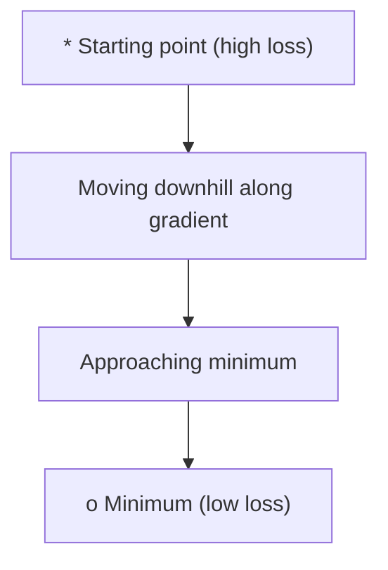
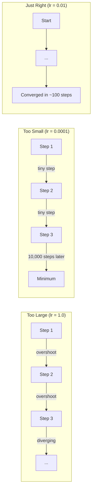
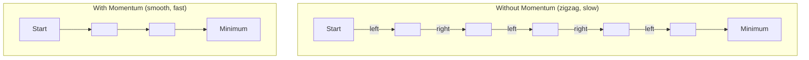
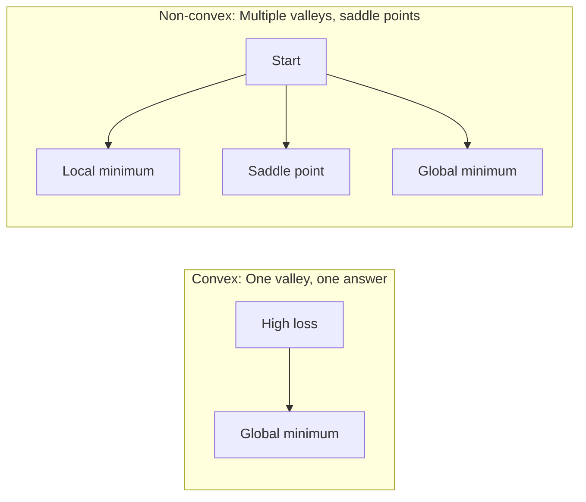
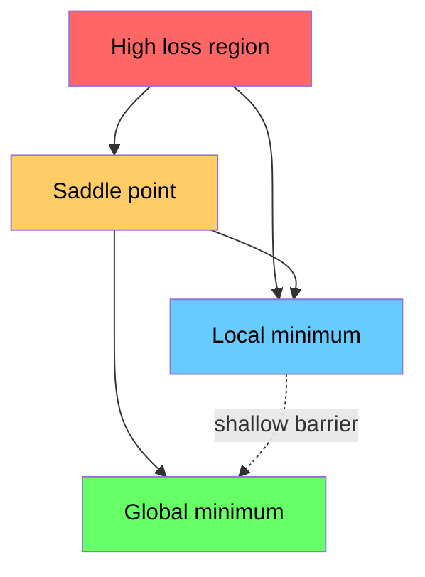

# التحسين

> تدريب شبكة عصبية لا شيء أكثر من العثور على قاع الوادي.

**Type:** Build
**Language:**بايثون
**Prerequisites:** Phase 1, Lessons 04-05 (Derivatives, Gradients)
**Time:** ~75 minutes

## أهداف التعلم

- تنفيذ انخفاض نطاق الفانيليا، SGD مع الزخم، وأدم من الصفر
- مقارنة التقارب المثالي على وظيفة روزينبروك وشرح لماذا آدم يتكيف مع معدلات التعلم لكل وزن
- تمييز المناظر الطبيعية المتعقبة عن المناظر الطبيعية غير المتعقبة للخسائر وتوضيح دور نقاط القمر في الأبعاد العالية
- إعداد جدولات معدل التعلم (تدهور الخطوات، تغيير الجهاز، التدفئة) لتحقيق استقرار التدريب

## المشكلة

لديك وظيفة الخسارة، إنها تخبرك كم هو النموذج الخطأ لديك تراجعات، إنها تخبرك بأي اتجاه يزيد الخسارة سوءاً، الآن تحتاج إلى استراتيجية للمشي أسفل التل.

النهج البديل بسيط: تحرك على خلاف التراجع. قم بتقييم الخطوة بأعداد تسمى معدل التعلم أكرر هذا هو انخفاض التسلسل، ويعمل. لكن "الأعمال" لديها تحذيرات معدل التعلم كبير جداً و أنت تتجاوز الوادي بالكامل، تقفز بين الجدران. صغير جداً و تتجول نحو الإجابة عبر آلاف الخطوات غير الضرورية اضرب نقطة السرير وتوقف عن التحرك حتى لو لم تجد الحد الأدنى

كل محسن في التعلم العميق هو إجابة على نفس السؤال: كيف تصل إلى قاع الوادي بشكل أسرع وأكثر موثوقية؟

## المفهوم

### ما تعنيه التحسين

التكامل هو العثور على قيم المدخلات التي تقلل (أو تزيد) من وظيفة. في التعلم الآلي، فإن الوظيفة هي الخسارة. المدخلات هي وزن النموذج. التدريب هو التكامل.

```
minimize L(w) where:
  L = loss function
  w = model weights (could be millions of parameters)
```

### التراجع المتسارع (فانيلا)

أسهل محفزات. حساب تراجع الخسارة فيما يتعلق بكل وزن. تحريك كل وزن في الاتجاه المعاكس لتراجعها. مقياس الخطوة من خلال معدل التعلم.

```
w = w - lr * gradient
```

هذا هو الخوارزمية بأكملها خط واحد



### معدل التعلم: أهم المعيار المفرط

معدل التعلم يحدد حجم الخطوة ويقرر كل شيء حول التقارب



لا توجد صيغة لمعدل التعلم الصحيح. يمكنك العثور عليه من خلال التجربة. نقاط البداية المشتركة: 0.001 لـ آدم، 0.01 لـ SGD مع الزخم.

### الجدول المالي مقابل اللحظة مقابل اللحظة الصغيرة

يحتسب تراجع تراجع فانيلا تراجع على مجموعة البيانات بأكملها قبل اتخاذ خطوة واحدة. هذا يسمى تراجع تراجع دفعة. إنه مستقيم ولكن بطيء.

تحسب التراجع المتحرك (SGD) التراجع على عينة عشوائية واحدة وتخطى على الفور. إنه ضجيج ولكن سريع.

إنخفاض تراجع المرافق في الحزمة الصغيرة يفرق الفرق. احسب التراجع على حزمة صغيرة (32, 64, 128, 256 عينات) ، ثم خطوة. هذا ما يستخدمه الجميع في الواقع.

| Variant | Batch size | Gradient quality | Speed per step | Noise |
|---------|-----------|-----------------|---------------|-------|
| Batch GD | Entire dataset | Exact | Slow | None |
| SGD | 1 sample | Very noisy | Fast | High |
| Mini-batch | 32-256 | Good estimate | Balanced | Moderate |

الضجيج في المجموعة الصغيرة و المجموعة ليست حشرة.

### الزخم: الكرة تتدفق أسفل التلال

ينظر نزول تراجع نسبة الفانيلا فقط إلى تراجع الحالي. إذا كان تراجع الزيغزاج (شائع في الوادي الضيقة) ، فإن التقدم بطيء. يصلح الزخم هذا عن طريق تراكم تراجع الماضي في معنى السرعة.

```
v = beta * v + gradient
w = w - lr * v
```

التشابه: كرة تتدحرج أسفل التلال. لا تتوقف وتبدأ مرة أخرى في كل ضربة. إنها تبني السرعة في اتجاهات متسقة وتخفف التذبذب.



`beta`(عادة 0.9) يسيطر على كمية التاريخ التي يجب حفظها. بيتا أعلى يعني المزيد من الزخم، مسارات أكثر سلاسة، ولكن استجابة أبطأ لتغيرات الاتجاه.

### آدم: معدلات التعلم التكيفية

الوزن المختلف يحتاج إلى معدلات مختلفة للتعلم. الوزن الذي نادرا ما يحصل على تراجعات كبيرة يجب أن يتخذ خطوات أكبر عندما يفعل أخيرا. الوزن الذي يحصل على تراجعات ضخمة باستمرار يجب أن يتخذ خطوات أصغر.

آدم (تقدير اللحظة التكيفية) يتتبع شيئين لكل وزن:

1. اللحظة الأولى (م): المتوسط الجاري للمحافظات (مثل الزخم)
2. اللحظة الثانية (v): المتوسط الجاري للمراحل المربعة (حجم المراحل)

```
m = beta1 * m + (1 - beta1) * gradient
v = beta2 * v + (1 - beta2) * gradient^2

m_hat = m / (1 - beta1^t)    bias correction
v_hat = v / (1 - beta2^t)    bias correction

w = w - lr * m_hat / (sqrt(v_hat) + epsilon)
```

التقسيم من قبل`sqrt(v_hat)`والوزن ذو تراجعات كبيرة يتم تقسيمه بأعداد كبيرة (خطوة فعالة صغيرة). والوزن ذو تراجعات صغيرة يتم تقسيمه بأعداد صغيرة (خطوة فعالة كبيرة). كل وزن يحصل على معدل تعلمه التكيفي الخاص به.

المعلمات المضادة المتبنية: `lr=0.001, beta1=0.9, beta2=0.999, epsilon=1e-8`هذه الإعدادات القابلة للتشغيل تعمل بشكل جيد معظم المشاكل

### جدول مواعيد التعلم

معدل التعلم الثابت هو تنازل. في بداية التدريب، تريد خطوات كبيرة لتقدم سريعًا. في وقت متأخر من التدريب، تريد خطوات صغيرة لتحسين الحد الأدنى.

الجدول المشترك:

| Schedule | Formula | Use case |
|----------|---------|----------|
| Step decay | lr = lr * factor every N epochs | Simple, manual control |
| Exponential decay | lr = lr_0 * decay^t | Smooth reduction |
| Cosine annealing | lr = lr_min + 0.5 * (lr_max - lr_min) * (1 + cos(pi * t / T)) | Transformers, modern training |
| Warmup + decay | Linear ramp up, then decay | Large models, prevents early instability |

### الملتوية مقابل غير الملتوية

وظيفة متواصلة لديها الحد الأدنى. التراجع التدريجي دائما يجد ذلك.`f(x) = x^2`هو مخروط.

وظائف فقدان الشبكة العصبية غير متواصلة. لديها العديد من الحد الأدنى المحليين ، نقاط القيادة ، والمناطق السطحية.



في الممارسة العملية، فإن الحد الأدنى المحلي في الشبكات العصبية العالية الابعاد نادرا ما تكون مشكلة. معظم الحد الأدنى المحلي لديه قيم الخسارة القريبة من الحد الأدنى العالمي. نقاط السادل (مستقلة في بعض الاتجاهات، منحنية في غيرها) هي العقبة الحقيقية. الدفع والضوضاء من المجموعات الصغيرة تساعد على تفاديهم.

### تصور المشهد الخسائر

الخسارة هي وظيفة لجميع الوزن. بالنسبة لنموذج مع مليون وزن، فإن المشهد الخسارة يعيش في الفضاء 1000،001 بعد. نحن نتصور ذلك عن طريق اختيار اتجاهين عشوائية في الفضاء الوزن وتخطيط الخسارة على طول تلك الاتجاهات، مما ينتج سطح 2D.



يُعظم الحد الأدنى الحاد بشكل سيء. يُعظم الحد الأدنى السطح بشكل جيد. هذا أحد الأسباب التي تسبب فيها أن SGD مع الزخم غالباً ما يتفوق على Adam على دقة الاختبار النهائي: ضجيجها يمنع الاستقرار في الحد الأدنى الحاد.

```figure
gradient-descent
```

## بناءها

### الخطوة الأولى: تحديد وظيفة الاختبار

وظيفة روزنبروك هي مقياس تحسين كلاسيكي. يقع الحد الأدنى عند (1, 1) داخل وادي منحني ضيق يسهل العثور عليه ولكن من الصعب اتباعه.

```
f(x, y) = (1 - x)^2 + 100 * (y - x^2)^2
```

```python
def rosenbrock(params):
    x, y = params
    return (1 - x) ** 2 + 100 * (y - x ** 2) ** 2

def rosenbrock_gradient(params):
    x, y = params
    df_dx = -2 * (1 - x) + 200 * (y - x ** 2) * (-2 * x)
    df_dy = 200 * (y - x ** 2)
    return [df_dx, df_dy]
```

### الخطوة الثانية: انخفاض نسبة الفانيليا

```python
class GradientDescent:
    def __init__(self, lr=0.001):
        self.lr = lr

    def step(self, params, grads):
        return [p - self.lr * g for p, g in zip(params, grads)]
```

### الخطوة الثالثة: الدفع المالي مع الزخم

```python
class SGDMomentum:
    def __init__(self, lr=0.001, momentum=0.9):
        self.lr = lr
        self.momentum = momentum
        self.velocity = None

    def step(self, params, grads):
        if self.velocity is None:
            self.velocity = [0.0] * len(params)
        self.velocity = [
            self.momentum * v + g
            for v, g in zip(self.velocity, grads)
        ]
        return [p - self.lr * v for p, v in zip(params, self.velocity)]
```

### الخطوة الرابعة: آدم

```python
class Adam:
    def __init__(self, lr=0.001, beta1=0.9, beta2=0.999, epsilon=1e-8):
        self.lr = lr
        self.beta1 = beta1
        self.beta2 = beta2
        self.epsilon = epsilon
        self.m = None
        self.v = None
        self.t = 0

    def step(self, params, grads):
        if self.m is None:
            self.m = [0.0] * len(params)
            self.v = [0.0] * len(params)

        self.t += 1

        self.m = [
            self.beta1 * m + (1 - self.beta1) * g
            for m, g in zip(self.m, grads)
        ]
        self.v = [
            self.beta2 * v + (1 - self.beta2) * g ** 2
            for v, g in zip(self.v, grads)
        ]

        m_hat = [m / (1 - self.beta1 ** self.t) for m in self.m]
        v_hat = [v / (1 - self.beta2 ** self.t) for v in self.v]

        return [
            p - self.lr * mh / (vh ** 0.5 + self.epsilon)
            for p, mh, vh in zip(params, m_hat, v_hat)
        ]
```

### الخطوة 5: اجري ومقارنة

```python
def optimize(optimizer, func, grad_func, start, steps=5000):
    params = list(start)
    history = [params[:]]
    for _ in range(steps):
        grads = grad_func(params)
        params = optimizer.step(params, grads)
        history.append(params[:])
    return history

start = [-1.0, 1.0]

gd_history = optimize(GradientDescent(lr=0.0005), rosenbrock, rosenbrock_gradient, start)
sgd_history = optimize(SGDMomentum(lr=0.0001, momentum=0.9), rosenbrock, rosenbrock_gradient, start)
adam_history = optimize(Adam(lr=0.01), rosenbrock, rosenbrock_gradient, start)

for name, history in [("GD", gd_history), ("SGD+M", sgd_history), ("Adam", adam_history)]:
    final = history[-1]
    loss = rosenbrock(final)
    print(f"{name:6s} -> x={final[0]:.6f}, y={final[1]:.6f}, loss={loss:.8f}")
```

الناتج المتوقع: آدم يتقارب أسرع. SGD مع الزخم يتبع مسارًا أكثر سلاسة. GD الفانيليا تقدم ببطء على طول الوادي الضيق.

## استخدمها

في الممارسة العملية، استخدموا محفزات PyTorch أو JAX. أنها تتعامل مع مجموعات المعلمات، وتدهور الوزن، وتقطيع التراجع، وتسارع GPU.

```python
import torch

model = torch.nn.Linear(784, 10)

sgd = torch.optim.SGD(model.parameters(), lr=0.01, momentum=0.9)
adam = torch.optim.Adam(model.parameters(), lr=0.001)
adamw = torch.optim.AdamW(model.parameters(), lr=0.001, weight_decay=0.01)

scheduler = torch.optim.lr_scheduler.CosineAnnealingLR(adam, T_max=100)
```

قواعد الإبهام:

- تبدأ مع آدم (lr=0.001) يعمل معظم المشاكل دون ضبط.
- الانتقال إلى SGD مع الزخم (lr=0.01, الزخم=0.9) عندما تحتاج إلى أفضل دقة نهائية ويمكنك تحمل المزيد من التنسيق.
- استخدم AdamW (أدم مع تفكيك الوزن منفصل) للمتحولات.
- استخدموا دائما جدول معدل التعلم لتربية تستمر لأكثر من عدة فترات.
- إذا كان التدريب غير مستقرا، خفض معدل التعلم. إذا كان التدريب بطيء جدا، زيادة.

## أرسله

هذه الدروس تنتج طلباً لانتخاب المُحسن. انظر `outputs/prompt-optimizer-guide.md`. . .

فصول المحسنة التي بنيت هنا تظهر مرة أخرى في المرحلة 3 عندما نعمل على شبكة عصبية من الصفر.

## التمارين

1. **Learning rate sweep.**قم بتشغيل انخفاض تراجع نسبة الفانيلا على وظيفة روزنبروك مع معدلات التعلم [0.0001, 0.0005, 0.001, 0.005, 0.01]. رسم أو طباعة الخسارة النهائية بعد 5000 خطوة لكل منها. احصل على أكبر معدل التعلم الذي لا يزال يتقارب.

2. **Momentum comparison.**قم بتشغيل SGD مع قيم الزخم [0.0، 0.5، 0.9، 0.99] على وظيفة روزنبروك. تتبع الخسارة في كل خطوة. أي قيمة الزخم تتقارب أسرع؟ أي تخطي؟

3. **Saddle point escape.**تحديد الوظيفة `f(x, y) = x^2 - y^2`(نقطة السرير في الأصل). تبدأ من (0.01, 0.01). مقارن كيف يتصرف الفانيليا GD، SGD مع الزخم، و آدم. أي يفر من نقطة السرير؟

4. **Implement learning rate decay.**إضافة جدول للتحلل المتعرض للفئة GradientDescent: `lr = lr_0 * 0.999^step`مقارنة التقارب مع ودون التدهور على وظيفة روزنبروك.

## الشروط الرئيسية

| Term | What people say | What it actually means |
|------|----------------|----------------------|
| Gradient descent | "Go downhill" | Update weights by subtracting the gradient scaled by the learning rate. The most basic optimizer. |
| Learning rate | "Step size" | A scalar that controls how far each update moves the weights. Too large causes divergence. Too small wastes compute. |
| Momentum | "Keep rolling" | Accumulate past gradients into a velocity vector. Dampens oscillations and accelerates movement through consistent directions. |
| SGD | "Random sampling" | Stochastic gradient descent. Compute gradient on a random subset instead of the full dataset. Almost always means mini-batch SGD in practice. |
| Mini-batch | "A chunk of data" | A small subset of training data (32-256 samples) used to estimate the gradient. Balances speed and gradient accuracy. |
| Adam | "The default optimizer" | Adaptive Moment Estimation. Tracks per-weight running averages of gradients and squared gradients to give each weight its own learning rate. |
| Bias correction | "Fix the cold start" | Adam's first and second moments are initialized to zero. Bias correction divides by (1 - beta^t) to compensate during early steps. |
| Learning rate schedule | "Change lr over time" | A function that adjusts the learning rate during training. Large steps early, small steps late. |
| Convex function | "One valley" | A function where any local minimum is the global minimum. Gradient descent always finds it. Neural network losses are not convex. |
| Saddle point | "Flat but not a minimum" | A point where the gradient is zero but it is a minimum in some directions and a maximum in others. Common in high dimensions. |
| Loss landscape | "The terrain" | The loss function plotted over weight space. Visualized by slicing along two random directions. |
| Convergence | "Getting there" | The optimizer has reached a point where further steps do not meaningfully reduce the loss. |

## المزيد من القراءة

- [Sebastian Ruder: An overview of gradient descent optimization algorithms](https://ruder.io/optimizing-gradient-descent/)- مسح شامل لجميع المحفسين الرئيسيين
- [Why Momentum Really Works (Distill)](https://distill.pub/2017/momentum/)- التصور التفاعلي لديناميكيات الزخم
- [Adam: A Method for Stochastic Optimization (Kingma & Ba, 2014)](https://arxiv.org/abs/1412.6980)- ورقة آدم الأصلية، قابلة للقراءة وقصيرة
- [Visualizing the Loss Landscape of Neural Nets (Li et al., 2018)](https://arxiv.org/abs/1712.09913)- الورقة التي أظهرت الحد الأدنى الحاد مقابل المستقيم
