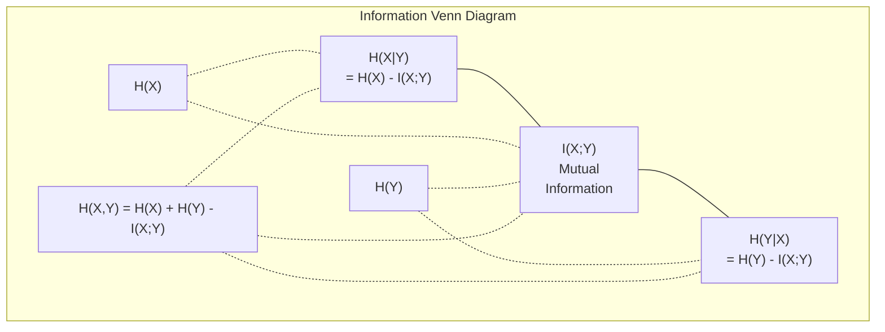

# نظرية المعلومات

> نظرية المعلومات تقيس المفاجأة وظائف الخسارة بنيت عليها

**Type:** Learn
**Language:**بايثون
**Prerequisites:** Phase 1, Lesson 06 (Probability)
**Time:** ~60 minutes

## أهداف التعلم

- احسب الانتروبيا، الانتروبيا المتقاطعة، والانتروبيا الكلورولوجية الانحراف من الصفر و اشرح علاقتهم
- استنتاج لماذا تقليل الخسارة المتقاطعة من الانتروبيا يعادل زيادة احتمالات التسجيل
- الحساب المعلومات المتبادلة بين الميزات والهدف لتصنيف أهمية الميزات
- شرح التعقيد على أنه حجم المفردات الفعالة الذي يختار نموذج اللغة من بينها

## المشكلة

أنتِ تتصلين`CrossEntropyLoss()`في كل نموذج تصنيف تدرب. ترى "الغموض" في كل ورقة نموذج لغة. تقرأ عن اختلاف KL في VAEs، التقطير، و RLHF. هذه ليست مفاهيم منفصلة. كلها نفس الفكرة ارتداء قبعات مختلفة.

نظرية المعلومات تعطيك اللغة للتفكير حول عدم اليقين والضغط والتنبؤ. اختراعه كلود شانون في عام 1948 لحل مشاكل الاتصال. اتضح أن تدريب شبكة عصبية هو مشكلة الاتصال: يحاول النموذج نقل اللقب الصحيح من خلال قناة ضوضاء من الوزن المتعلم.

هذا الدروس يبني كل صيغة من الصفر حتى ترى من أين تأتي ولماذا تعمل.

## المفهوم

### محتوى المعلومات (المفاجأة)

عندما يحدث شيء غير محتمل، يحمل المزيد من المعلومات رأس العملة الهبوط؟ ليس مفاجئاً. ربح في اليانصيب؟ مفاجئاً جداً.

محتوى المعلومات في حدث مع احتمال p هو:

```
I(x) = -log(p(x))
```

استخدام القاعدة الثانية يمنحك البط، استخدام القاعدة الطبيعية يمنحك الناتس، نفس الفكرة، وحدات مختلفة.

```
Event              Probability    Surprise (bits)
Fair coin heads    0.5            1.0
Rolling a 6        0.167          2.58
1-in-1000 event    0.001          9.97
Certain event      1.0            0.0
```

بعض الأحداث لا تحمل معلومات مطلقة كنت تعرف أنها ستحدث

### الإنتروبي (المفاجأة المتوسطة)

الانتروبيا هي المفاجأة المتوقعة على جميع النتائج المحتملة للتوزيع.

```
H(P) = -sum( p(x) * log(p(x)) )  for all x
```

العملة العادلة لديها أقصى قدر من الإنتروبيّة لمتغير ثنائيّ: 1 بت. العملة المتحيزة (99% من الرأس) لديها انتروبيّة منخفضة: 0.08 بت. أنت تعرف ما سيحدث بالفعل، لذلك كلّ إصطفاء لا يخبرك تقريباً بشيء.

```
Fair coin:    H = -(0.5 * log2(0.5) + 0.5 * log2(0.5)) = 1.0 bit
Biased coin:  H = -(0.99 * log2(0.99) + 0.01 * log2(0.01)) = 0.08 bits
```

إنتروبيا تقيس عدم اليقين غير القابل للتقليل في التوزيع لا يمكنك الضغط تحت ذلك

### التشغيل المتقاطع (العمل الذي تستخدمه كل يوم)

القياس المتقاطع للاندروبي يقيس متوسط المفاجأة عندما تستخدم التوزيع Q لتشفير الأحداث التي تأتي في الواقع من التوزيع P.

```
H(P, Q) = -sum( p(x) * log(q(x)) )  for all x
```

P هو التوزيع الحقيقي (الملفات). Q هو التنبؤات الخاصة بنموذجك. إذا تطابق Q P بشكل مثالي، فإن الإنتروبي المتقاطع يساوي الإنتروبي. أي عدم مطابق يزيد من ذلك.

في التصنيف، P هو متجه واحد حار (الفئة الحقيقية لديها احتمال 1، كل شيء آخر 0). هذا يسهل التقاطع إلى:

```
H(P, Q) = -log(q(true_class))
```

هذه هي الصيغة الكاملة للخسارة المتقاطعة للإنتروبيا للتصنيف.

### التباين (بين التوزيعات)

يُقيّم اختلاف KL كم من المفاجأة الإضافية تحصل عليها من استخدام Q بدلاً من P.

```
D_KL(P || Q) = sum( p(x) * log(p(x) / q(x)) )  for all x
             = H(P, Q) - H(P)
```

إن الانتروبيا المتقاطعة هي الانتروبيا بالإضافة إلى الانتشار KL. بما أن الانتروبيا من التوزيع الحقيقي ثابتة أثناء التدريب، فإن تقليل الانتروبيا المتقاطعة هو نفس تقليل الانتشار KL. أنت تدفع توزيع نموذجك نحو التوزيع الحقيقي.

الاختلاف KL ليس متناغم: D_KL(P  Q) != D_KL(Q  P).

### المعلومات المتبادلة

المعلومات المتبادلة تقيس ما الذي يخبرك به معرفة متغير واحد عن الآخر.

```
I(X; Y) = H(X) - H(X|Y)
        = H(X) + H(Y) - H(X, Y)
```

إذا كانت X و Y مستقلة، فإن المعلومات المتبادلة هي صفر. معرفة واحدة لا تخبرك بأي شيء عن الأخرى. إذا كانت متقاربة تمامًا، فإن المعلومات المتبادلة تساوي إطار أي من المتغيرات.

في اختيار الميزات، تعني المعلومات المتبادلة العالية بين الميزة والهدف أن الميزة مفيدة.

### الإنتروبي المشروط

H(Y في X) يقيس كم من عدم اليقين يبقى حول Y بعد مشاهدة X.

```
H(Y|X) = H(X,Y) - H(X)
```

هناك شيئان متطرفان
- إذا كان X يحدد تماما Y، ثم H(Y X) = 0. معرفة X يزيل كل عدم اليقين حول Y. المثال: X = درجة حرارة في سيلسييوس، Y = درجة حرارة في فارينهايت.
- إذا لم يخبرك X أي شيء عن Y، فإن H(YX من دون) = H(Y). معرفة X لا تقلل من عدم اليقين على الإطلاق.

إنتروبيا مشروطة هي دائما غير سلبية ولا تتجاوز H(Y):

```
0 <= H(Y|X) <= H(Y)
```

في التعلم الآلي، تظهر الإنتروبي المشروط في أشجار القرار. في كل انقسام، يختار الخوارزمي ميزة X التي تقلل من H(Y) - وهي ميزة تبتعد عن أكثر عدم اليقين حول علامة Y.

### الإنتروبي المشترك

H ((X,Y) هي الانتروبيا من التوزيع المشترك ل X و Y معا.

```
H(X,Y) = -sum sum p(x,y) * log(p(x,y))   for all x, y
```

الخصائص الرئيسية:

```
H(X,Y) <= H(X) + H(Y)
```

إن المساواة تنطبق عندما تكون X و Y مستقلين. إذا شاركوا المعلومات، فإن الانتروبيا المشتركة أقل من مجموع الانتروبيات الفردية. إنتروبيا "المفقودة" هي بالضبط المعلومات المتبادلة.



العلاقات:
- H(X,Y) = H(X) + H(Y أن يكون X) = H(Y) + H(X أن يكون
- (X;Y) = H(X) - H(IX
- H(X,Y) = H(X) + H(Y) - I(X;Y)

### المعلومات المتبادلة (التعمق العميق)

المعلومات المتبادلة I(X;Y) تعدد كمية معرفة متغير واحد تقلل من عدم اليقين حول الآخر.

```
I(X;Y) = H(X) - H(X|Y)
       = H(Y) - H(Y|X)
       = H(X) + H(Y) - H(X,Y)
       = sum sum p(x,y) * log(p(x,y) / (p(x) * p(y)))
```

الخصائص:
- I ((X;Y) >= 0 دائماً. لا تفقد المعلومات من خلال ملاحظة شيء.
- I(X;Y) = 0 إذا و فقط إذا X و Y مستقلين.
- I(X;Y) = I(Y;X) هو متماثل، على عكس الانحراف KL.
- I  X) = H  X) المتغير يشارك كل معلوماته مع نفسه.

**Mutual information for feature selection.**في ML، تريد ميزات تكون موثوقة حول الهدف. المعلومات المتبادلة تعطيك طريقة مبدئية لتصنيف الميزات:

1. لكل ميزة X_i، احسب I(X_i؛ Y) حيث Y هو المتغير المستهدف.
2. صفوف الدرجة حسب درجة MI
3. أبقوا أجزاء الـ "ك" العليا

هذا يعمل على أي علاقة بين الميزة والهدف -- خطية أو غير خطية أو متوحدة أو لا. التواصل يلتقط العلاقات الخطية فقط.

| Method | Detects | Computational cost | Handles categorical? |
|--------|---------|-------------------|---------------------|
| Pearson correlation | Linear relationships | O(n) | No |
| Spearman correlation | Monotonic relationships | O(n log n) | No |
| Mutual information | Any statistical dependency | O(n log n) with binning | Yes |

### التسمم والانتروبيا المتقاطعة

التصنيف القياسي يستخدم أهداف صعبة: [0, 0, 1, 0]. يصبح الفئة الحقيقية احتمالية 1, كل شيء آخر يحصل على 0.

```
soft_target = (1 - epsilon) * hard_target + epsilon / num_classes
```

مع الـ (إيبسلون) = 0.1 و 4 فئات:
- الهدف الصعب: [0، 0، 1، 0]
- الهدف الناعم: [0.025, 0.025, 0.925, 0.025]

من منظور نظرية المعلومات، يزيد تسهيل اللقب من الانتروبيا لتوزيع الهدف. الهدف الصلب واحد حار لديه الانتروبيا 0 - لا يوجد عدم اليقين. الهدف الناعم لديه الانتروبيا الإيجابية.

لماذا يساعد هذا:
- يمنع النموذج من قيادة الوصول إلى القيم المتطرفة (ستحتاج إلى علامات لا نهاية لها لتطابق الهدف الواحد في حالة التشويق المتقاطع)
- يعمل كتحديد: النموذج لا يمكن أن يكون واثقًا بنسبة 100٪
- تحسين التصفية: الاحتمالات المتوقعة تعكس بشكل أفضل عدم اليقين الحقيقي
- يقلل من الفجوة بين التدريب والسلوك الاستنتاجي

الخسارة المتقاطعة للاندروبي مع تسهيل العلامات تصبح:

```
L = (1 - epsilon) * CE(hard_target, prediction) + epsilon * H_uniform(prediction)
```

المفهوم الثاني يعاقب التنبؤات التي هي بعيدة عن الموحدة -- التنظيم المباشر على الثقة.

### لماذا تعتبر التشريعات المتقاطعة خسارة التصنيف

ثلاثة وجهات نظر، نفس الاستنتاج.

**Information theory view.**القياس المتقاطع للاندروبي يقيّم كم البيت الذي تُهدر به باستخدام توزيع النموذج بدلاً من التوزيع الحقيقي.

**Maximum likelihood view.**بالنسبة لنموذجات التدريب N مع فئات صحيحة y_i:

```
Likelihood     = product( q(y_i) )
Log-likelihood = sum( log(q(y_i)) )
Negative log-likelihood = -sum( log(q(y_i)) )
```

هذه الخط الأخير هو فقدان الانتروبيا المتقاطعة. تقليل الانتروبيا المتقاطعة = زيادة احتمالات بيانات التدريب تحت نموذجك.

**Gradient view.**تراجع الانتروبيا المتقاطعة فيما يتعلق باللوجيتس بسيط (توقعت - صحيحة). نظيفة ومستقرة وسريعة في الحساب. لهذا السبب يزدوج بشكل مثالي مع softmax.

### البيتس مقابل الناتس

الفرق الوحيد هو قاعدة السجل

```
log base 2   -> bits      (information theory tradition)
log base e   -> nats      (machine learning convention)
log base 10  -> hartleys  (rarely used)
```

1 نات = 1/ln(2) بيت = 1.4427 بيت. PyTorch و TensorFlow تستخدم السجل الطبيعي (ناتس) حسب الاختيار.

### الارتباك

الارتباك هو معدل التقاطع بين النواحي، وهو ما يخبرك عن عدد الفعال من الخيارات المحتملة على قدم المساواة

```
Perplexity = 2^H(P,Q)   (if using bits)
Perplexity = e^H(P,Q)   (if using nats)
```

نموذج اللغة مع تعقيد 50 هو، في المتوسط، كما الخلط كما لو كان عليه اختيار بشكل متساوٍ من 50 رمزا ممكنة التالية. أقل هو أفضل.

حققت GPT-2 تعقيدًا يبلغ 30 على المعايير المشتركة. النماذج الحديثة في الأرقام الواحدة للمناطق الممثلة بشكل جيد.

```figure
entropy-kl
```

## بناءها

### الخطوة الأولى: محتوى المعلومات والإنتروبي

```python
import math

def information_content(p, base=2):
    if p <= 0 or p > 1:
        return float('inf') if p <= 0 else 0.0
    return -math.log(p) / math.log(base)

def entropy(probs, base=2):
    return sum(
        p * information_content(p, base)
        for p in probs if p > 0
    )

fair_coin = [0.5, 0.5]
biased_coin = [0.99, 0.01]
fair_die = [1/6] * 6

print(f"Fair coin entropy:   {entropy(fair_coin):.4f} bits")
print(f"Biased coin entropy: {entropy(biased_coin):.4f} bits")
print(f"Fair die entropy:    {entropy(fair_die):.4f} bits")
```

### الخطوة الثانية: الانتروبيا المتقاطعة والانحراف الكلي

```python
def cross_entropy(p, q, base=2):
    total = 0.0
    for pi, qi in zip(p, q):
        if pi > 0:
            if qi <= 0:
                return float('inf')
            total += pi * (-math.log(qi) / math.log(base))
    return total

def kl_divergence(p, q, base=2):
    return cross_entropy(p, q, base) - entropy(p, base)

true_dist = [0.7, 0.2, 0.1]
good_model = [0.6, 0.25, 0.15]
bad_model = [0.1, 0.1, 0.8]

print(f"Entropy of true dist:     {entropy(true_dist):.4f} bits")
print(f"CE (good model):          {cross_entropy(true_dist, good_model):.4f} bits")
print(f"CE (bad model):           {cross_entropy(true_dist, bad_model):.4f} bits")
print(f"KL divergence (good):     {kl_divergence(true_dist, good_model):.4f} bits")
print(f"KL divergence (bad):      {kl_divergence(true_dist, bad_model):.4f} bits")
```

### الخطوة الثالثة: التشابه المتقاطع كخسارة التصنيف

```python
def softmax(logits):
    max_logit = max(logits)
    exps = [math.exp(z - max_logit) for z in logits]
    total = sum(exps)
    return [e / total for e in exps]

def cross_entropy_loss(true_class, logits):
    probs = softmax(logits)
    return -math.log(probs[true_class])

logits = [2.0, 1.0, 0.1]
true_class = 0

probs = softmax(logits)
loss = cross_entropy_loss(true_class, logits)

print(f"Logits:      {logits}")
print(f"Softmax:     {[f'{p:.4f}' for p in probs]}")
print(f"True class:  {true_class}")
print(f"Loss:        {loss:.4f} nats")
print(f"Perplexity:  {math.exp(loss):.2f}")
```

### الخطوة الرابعة: التقاطع بين النخاعات يساوي احتمال التسجيل السلبي

```python
import random

random.seed(42)

n_samples = 1000
n_classes = 3
true_labels = [random.randint(0, n_classes - 1) for _ in range(n_samples)]
model_logits = [[random.gauss(0, 1) for _ in range(n_classes)] for _ in range(n_samples)]

ce_loss = sum(
    cross_entropy_loss(label, logits)
    for label, logits in zip(true_labels, model_logits)
) / n_samples

nll = -sum(
    math.log(softmax(logits)[label])
    for label, logits in zip(true_labels, model_logits)
) / n_samples

print(f"Cross-entropy loss:      {ce_loss:.6f}")
print(f"Negative log-likelihood: {nll:.6f}")
print(f"Difference:              {abs(ce_loss - nll):.2e}")
```

### الخطوة 5: المعلومات المتبادلة

```python
def mutual_information(joint_probs, base=2):
    rows = len(joint_probs)
    cols = len(joint_probs[0])

    margin_x = [sum(joint_probs[i][j] for j in range(cols)) for i in range(rows)]
    margin_y = [sum(joint_probs[i][j] for i in range(rows)) for j in range(cols)]

    mi = 0.0
    for i in range(rows):
        for j in range(cols):
            pxy = joint_probs[i][j]
            if pxy > 0:
                mi += pxy * math.log(pxy / (margin_x[i] * margin_y[j])) / math.log(base)
    return mi

independent = [[0.25, 0.25], [0.25, 0.25]]
dependent = [[0.45, 0.05], [0.05, 0.45]]

print(f"MI (independent): {mutual_information(independent):.4f} bits")
print(f"MI (dependent):   {mutual_information(dependent):.4f} bits")
```

## استخدمها

نفس المفاهيم باستخدام NumPy، الطريقة التي ستستخدمها في الممارسة العملية:

```python
import numpy as np

def np_entropy(p):
    p = np.asarray(p, dtype=float)
    mask = p > 0
    result = np.zeros_like(p)
    result[mask] = p[mask] * np.log(p[mask])
    return -result.sum()

def np_cross_entropy(p, q):
    p, q = np.asarray(p, dtype=float), np.asarray(q, dtype=float)
    mask = p > 0
    return -(p[mask] * np.log(q[mask])).sum()

def np_kl_divergence(p, q):
    return np_cross_entropy(p, q) - np_entropy(p)

true = np.array([0.7, 0.2, 0.1])
pred = np.array([0.6, 0.25, 0.15])
print(f"Entropy:    {np_entropy(true):.4f} nats")
print(f"Cross-ent:  {np_cross_entropy(true, pred):.4f} nats")
print(f"KL div:     {np_kl_divergence(true, pred):.4f} nats")
```

ماذا بنيت من الصفر ؟`torch.nn.CrossEntropyLoss()`الآن تعرف لماذا تخسر خلال التدريب: التوزيع المتوقع لنموذجك يقترب من التوزيع الحقيقي، مقاس في نات من المعلومات المهدرة.

## التمارين

1. قم بحساب الانتروبية من الأبجدية الإنجليزية على افتراض توزيع متساوي (26 حرفا) ثم تقدرها باستخدام ترددات الحروف الفعلية. أي منها أعلى ولماذا؟

2. النموذج يخرج علامات [5.0، 2.0، 0.5] لعينة ذات الفئة الحقيقية 1. حساب الخسارة المتقاطعة للاندروبي يدويا، ثم التحقق من مع `cross_entropy_loss`أي منطقة ستعطى صفر الخسارة؟

3. أظهر أن الاختلاف KL ليس متماثلًا. اختر توزيعين P و Q وحسب D_K_K  Q) و DL  Q  P). شرح لماذا تختلفان.

4. قم ببناء وظيفة تحسب الارتباك لسلسلة من التنبؤات الرمزية. مع إعطاء قائمة من (true_token_index، predicted_logits) أزواج، أعيد الارتباك لسلسلة.

## الشروط الرئيسية

| Term | What people say | What it actually means |
|------|----------------|----------------------|
| Information content | "Surprise" | The number of bits (or nats) needed to encode an event: -log(p) |
| Entropy | "Randomness" | The average surprise across all outcomes of a distribution. Measures irreducible uncertainty. |
| Cross-entropy | "The loss function" | Average surprise when using model distribution Q to encode events from true distribution P. |
| KL divergence | "Distance between distributions" | Extra bits wasted by using Q instead of P. Equals cross-entropy minus entropy. Not symmetric. |
| Mutual information | "How related are X and Y" | Reduction in uncertainty about X from knowing Y. Zero means independent. |
| Softmax | "Turn logits into probabilities" | Exponentiate and normalize. Maps any real-valued vector to a valid probability distribution. |
| Perplexity | "How confused the model is" | Exponential of cross-entropy. The effective vocabulary size the model is choosing from at each step. |
| Bits | "Shannon's unit" | Information measured with log base 2. One bit resolves one fair coin flip. |
| Nats | "ML's unit" | Information measured with natural log. Used by PyTorch and TensorFlow by default. |
| Negative log-likelihood | "NLL loss" | Identical to cross-entropy loss for one-hot labels. Minimizing it maximizes the probability of correct predictions. |

## المزيد من القراءة

- [Shannon 1948: A Mathematical Theory of Communication](https://people.math.harvard.edu/~ctm/home/text/others/shannon/entropy/entropy.pdf)- الورقة الأصلية، لا تزال قابلة للقراءة
- [Visual Information Theory (Chris Olah)](https://colah.github.io/posts/2015-09-Visual-Information/)- أفضل تفسير بصري للانتروبيا واختلاف KL
- [PyTorch CrossEntropyLoss docs](https://pytorch.org/docs/stable/generated/torch.nn.CrossEntropyLoss.html)- كيف ينفذ الإطار ما قمت ببناءه للتو
