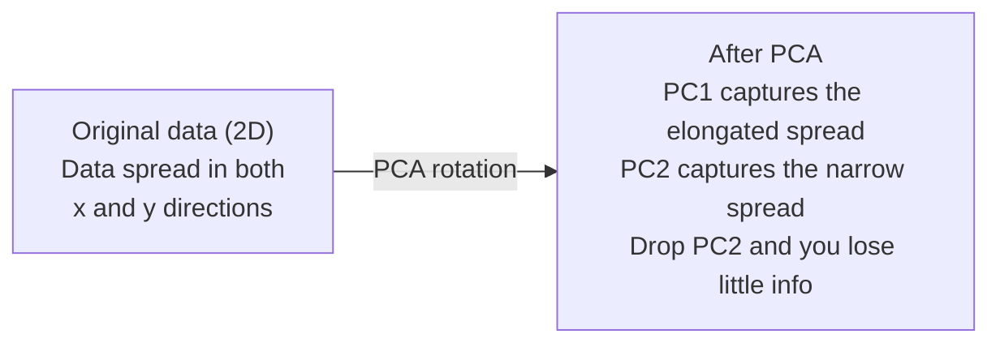

# تقليل الجهد

> البيانات الابعاد العالي لديها بنية يمكنك العثور عليها بالنظر من الزاوية الصحيحة

**Type:** Build
**Language:**بايثون
**Prerequisites:** Phase 1, Lessons 01 (Linear Algebra Intuition), 02 (Vectors, Matrices & Operations), 03 (Eigenvalues & Eigenvectors), 06 (Probability & Distributions)
**Time:** ~90 minutes

## أهداف التعلم

- تنفيذ PCA من الصفر: بيانات المركز، حساب ماتريكس التباين، المكونات الخاصة، والمشروع
- استخدام نسبة التباين الموضحة و طريقة الكوع لتحديد عدد المكونات الرئيسية
- مقارنة PCA، t-SNE، و UMAP لتحديد الأرقام MNIST في 2D وتفسير تعادلاتها
- تطبيق PCA النواة مع kernel RBF لفرق هيكلات البيانات غير الخطية التي لا يمكن أن تتعامل مع PCA القياسية

## المشكلة

لديك مجموعة بيانات مع 784 ميزة لكل عينة. ربما تكون قيم البيكسل من الأرقام المكتوبة يدويا. ربما تكون مستويات التعبير الجيني. ربما تكون إشارات سلوك المستخدم. لا يمكنك تصور 784 بعد. لا يمكنك رسمها. لا يمكنك حتى التفكير فيها.

لكن معظم هذه الميزات 784 هي ضئيلة. المعلومات الفعلية تعيش على سطح أصغر بكثير. لا تحتاج "7" مكتوبة يدوياً إلى 784 أرقام مستقلة لوصفها. تحتاج إلى عدد قليل: زاوية السحب، وطول العصا المتقاطعة، كم ينحني. الباقي هو الضجيج.

تقليل الأبعاد يجد تلك السطح الأصغر يأخذ بياناتك البعد 784 ويضغط عليها إلى أبعاد 2، 10 أو 50 مع الحفاظ على الهيكل الذي يهم

## المفهوم

### لعنة الأبعاد

الفضاء العالي الأبعاد غير بديهي ثلاثة أشياء تتحطم مع نمو الأبعاد

**Distance becomes meaningless.**في الأبعاد العالية، تبدأ المسافة بين نقطتين عشوائية إلى نفس القيمة. إذا كانت كل نقطة نفس المسافة تقريباً من كل نقطة أخرى، فإن البحث عن أقرب جيران يتوقف عن العمل.

```
Dimension    Avg distance ratio (max/min between random points)
2            ~5.0
10           ~1.8
100          ~1.2
1000         ~1.02
```

**Volume concentrates in corners.**إنّه من المفترض أن يكون هناك كوب واحد في أبعاد d لديه زوايا 2^d. في 100 أبعاد، يكون كلّ الحجم تقريباً في الزوايا، بعيداً عن المركز.

**You need exponentially more data.**للحفاظ على نفس كثافة العينات في الفضاء، الانتقال من 2D إلى 20D يعني أنك بحاجة إلى 10^18 مرات أكثر من البيانات. أنت لا تملك أبدا ما يكفي. تقليل الأبعاد يعيد كثافة البيانات إلى شيء يمكن العمل عليه.

### الـ "PCA": العثور على الاتجاهات التي تهم

تحليل المكون الرئيسي يجد المحور الذي تتغير فيه بياناتك أكثر. يدور نظام التنسيق الخاص بك بحيث يتقاط المحور الأول أكبر اختلاف، والثاني أكبر اختلاف، وهكذا.

الخوارزمية:

```
1. Center the data        (subtract the mean from each feature)
2. Compute covariance     (how features move together)
3. Eigendecomposition     (find the principal directions)
4. Sort by eigenvalue     (biggest variance first)
5. Project               (keep top k eigenvectors, drop the rest)
```

لماذا التكوين الخاص؟ المصفوفة التجاويزية متساوية وجزئية شبه محددة. المتجهات الخاصة بها هي اتجاهات متقاطعة في مساحة الميزات. القيم الخاصة تخبرك كم التباين كل اتجاه يلتقط. المتجهات الخاصة التي لديها أكبر نقاط القيمة الخاصة على طول اتجاه أقصى التباين.



- **Before PCA:**سحاب البيانات متوزع على شكل شفر على محور x و y
- **After PCA:**يتم تحويل نظام التنسيق بحيث يتوافق PC1 مع اتجاه أقصى اختلاف (توسع التنشر) و PC2 مع اتجاه الحد الأدنى للتنشر (توسع الضيق)
- **Dimensionality reduction:**إلقاء PC2 يرمز البيانات على PC1 ، فقدان معلومات قليلة جدا

### نسبة التباين المفسرة

كل مكون رئيسي يحتوي على جزء من مجموع التباين.

```
Component    Eigenvalue    Explained ratio    Cumulative
PC1          4.73          0.473              0.473
PC2          2.51          0.251              0.724
PC3          1.12          0.112              0.836
PC4          0.89          0.089              0.925
...
```

عندما يصل التباين المتراكم الذي تم شرحه إلى 0.95, تعرف أن العديد من المكونات تسجل 95% من المعلومات. كل شيء بعد ذلك هو في الغالب الضوضاء.

### اختيار عدد المكونات

ثلاثة استراتيجيات:

1. **Threshold.**احتفظ بما يكفي من المكونات لتفسير 90-95% من التباين.
2. **Elbow method.**-أوضح الخطة التباين لكل عنصر، ابحث عن انقطاع حاد
3. **Downstream performance.**استخدموا الـ PCA كـ معالجة مسبقة، قموا بتسحيب الـ k وقاس دقة النموذج، أفضل الـ k هو حيثما تكون مستوى الدقة.

### الحفاظ على الأحياء

تم تصميم تـ-SNE لتصور البيانات الارتفاعية إلى 2D (أو 3D) مع الحفاظ على نقاط قريبة من بعضها البعض.

الحسبان: في الفضاء الأصلي، حساب توزيع الاحتمال على أزواج من النقاط بناء على مسافاتها. النقاط القريبة تحصل على احتمال عال. النقاط البعيدة تحصل على احتمال منخفض. ثم العثور على ترتيب 2D حيث ينطبق نفس توزيع الاحتمال. النقاط التي كانت جيران في 784 بعد تبقى جيران في 2D.

الخصائص الرئيسية لـ t-SNE:
- غير خطي، يمكنه أن يفتح مجموعة معقدة لا يمكن لـ (بي سي ايه) أن يفعل
- مستقيم، أداء مختلف ينتج ترتيب مختلف
- تعين ملامح الارتباك كم عدد الجيران الذين يجب النظر إليهم (المدى النموذجي: 5-50).
- المسافات بين المجموعات في الخروج ليست ذات معنى. فقط المجموعات نفسها هي ذات معنى.
- بطيئة على مجموعات بيانات كبيرة.

### الـ UMAP: هيكل عالمي أسرع وأفضل

يعمل التقرب والتحديد المتعدد الموحد (UMAP) على غرار t-SNE ولكن مع مزيتين:
- أسرع، يستخدم الرسومات القريبة من الجيران بدلاً من الحسابات على كل المسافات المتزدوجة
- بنية عالمية أفضل: المواقع النسبية للمجموعات في الإنتاج تميل إلى أن تكون أكثر أهمية من في t-SNE.

يقوم UMAP ببناء رسم بياني معزز في الفضاء العالي الأبعاد (التمثيل الترفيهي الغامض) ثم يجد ترتيبًا منخفض الأبعاد يحافظ على هذا الرسم البياني قدر الإمكان.

المعلمات الرئيسية:
- `n_neighbors`: كم عدد الجيران يحددون الهيكل المحلي (مثل الارتباك)
- `min_dist`: كيف تتجمع النقاط بشكل ضيق في الخروج. القيم المنخفضة تخلق مجموعات أكثر كثافة.

### متى تستخدم أي

| Method | Use case | Preserves | Speed |
|--------|----------|-----------|-------|
| PCA | Preprocessing before training | Global variance | Fast (exact), works on millions of samples |
| PCA | Quick exploratory visualization | Linear structure | Fast |
| t-SNE | Publication-quality 2D plots | Local neighborhoods | Slow (< 10k samples ideal) |
| UMAP | 2D visualization at scale | Local + some global structure | Medium (handles millions) |
| PCA | Feature reduction for models | Variance-ranked features | Fast |
| t-SNE / UMAP | Understanding cluster structure | Cluster separation | Medium to slow |

قاعدة عامة: استخدام PCA للتعليم المسبق و ضغط البيانات. استخدام t-SNE أو UMAP عندما تحتاج إلى تصور الهيكل في 2D.

### الكهرباء الكهربائية

يجد نظام المواصفات المعتاد (PCA) الفضاءات الفرعية الخطية. يدور نظام التنسيقات الخاص بك ويضع المحاور. ولكن ماذا لو كانت البيانات على مجموعة غير خطية؟ حلقة في 2D لا يمكن فصلها بأي خط. لا يساعد PCA المعتاد.

يطبق PCA في الكرّة PCA في مساحة ميزات عالية الأبعاد التي تُحثّر من خلال وظيفة الكرّة، دون حساب مُباشر للمساويات في تلك المساحة. هذه هي خدعة الكرّة -- نفس الفكرة وراء SVMs.

الخوارزمية:
1. احسب ماتريكيس النواة K حيث K_ij = k(x_i, x_j)
2. مركز ماتريكيز النواة في مساحة الميزات
3. Eigendecompose المصفوفة المركزية النواة
4. العوامل الخاصة العليا (مقياسها بال1 / مربع ((قيمة خاصة)) هي التنبؤات

وظائف النواة المشتركة:

| Kernel | Formula | Good for |
|--------|---------|----------|
| RBF (Gaussian) | exp(-gamma * \|\|x - y\|\|^2) | Most nonlinear data, smooth manifolds |
| Polynomial | (x . y + c)^d | Polynomial relationships |
| Sigmoid | tanh(alpha * x . y + c) | Neural network-like mappings |

متى تستخدم PCA النووية مقابل PCA القياسية:

| Criterion | Standard PCA | Kernel PCA |
|-----------|-------------|------------|
| Data structure | Linear subspace | Nonlinear manifold |
| Speed | O(min(n^2 d, d^2 n)) | O(n^2 d + n^3) |
| Interpretability | Components are linear combinations of features | Components lack direct feature interpretation |
| Scalability | Works on millions of samples | Kernel matrix is n x n, memory-limited |
| Reconstruction | Direct inverse transform | Requires pre-image approximation |

المثال الكلاسيكي: الدوائر المركزة في 2D. حلقين من النقاط، واحد داخل الآخر. PCA القياسية تنشر كليهما على نفس الخط -- غير مفيد للتصنيف. الكرني PCA مع كرني RBF يرسم الدائرة الداخلية والدائرة الخارجية إلى مناطق مختلفة، مما يجعلها قابلة للفصل بشكل خطي.

### خطأ إعادة الإعمار

كم هو جيد تقليل الأبعاد الخاص بك؟ ضغطت 784 أبعاد إلى 50 ماذا فقدت؟

قياس خطأ إعادة الإعمار:
1. بيانات المشروع إلى أبعاد k: X_reduced = X @ W_k
2. إعادة الإعمار: X_hat = X_reduced @ W_k^T
3. الحساب MSE: متوسط (((X - X_hat) ^2)

بالنسبة لـ PCA، فإن خطأ إعادة الإعمار له علاقة نظيفة بالاختلاف الموضح:

```
Reconstruction error = sum of eigenvalues NOT included
Total variance = sum of ALL eigenvalues
Fraction lost = (sum of dropped eigenvalues) / (sum of all eigenvalues)
```

نسبة التباين الموضحة لكل مكون هي:

```
explained_ratio_k = eigenvalue_k / sum(all eigenvalues)
```

تخطيط التباين التراكمي الموضح ضد عدد المكونات يعطيك منحنى "المقدمة".
- الملتحى يتسطح (تناقص العائدات)
- يتجاوز التباين التراكمي عتبة (عادة 0.90 أو 0.95)
- مستوى أداء المهام في النهر

خطأ إعادة الإعمار مفيد أكثر من اختيار k. يمكنك استخدامه للكشف عن الطرفين: العينات التي لديها خطأ إعادة الإعمار مرتفع هي غير متساوية لا تناسب الفضاء الفرعي المكتشف. هذه هي أساس الكشف عن الطرفين القائم على PCA في أنظمة الإنتاج.

```figure
pca-axes
```

## بناءها

### الخطوة الأولى: PCA من الصفر

```python
import numpy as np

class PCA:
    def __init__(self, n_components):
        self.n_components = n_components
        self.components = None
        self.mean = None
        self.eigenvalues = None
        self.explained_variance_ratio_ = None

    def fit(self, X):
        self.mean = np.mean(X, axis=0)
        X_centered = X - self.mean

        cov_matrix = np.cov(X_centered, rowvar=False)

        eigenvalues, eigenvectors = np.linalg.eigh(cov_matrix)

        sorted_idx = np.argsort(eigenvalues)[::-1]
        eigenvalues = eigenvalues[sorted_idx]
        eigenvectors = eigenvectors[:, sorted_idx]

        self.components = eigenvectors[:, :self.n_components].T
        self.eigenvalues = eigenvalues[:self.n_components]
        total_var = np.sum(eigenvalues)
        self.explained_variance_ratio_ = self.eigenvalues / total_var

        return self

    def transform(self, X):
        X_centered = X - self.mean
        return X_centered @ self.components.T

    def fit_transform(self, X):
        self.fit(X)
        return self.transform(X)
```

### الخطوة الثانية: اختبار البيانات الاصطناعية

```python
np.random.seed(42)
n_samples = 500

t = np.random.uniform(0, 2 * np.pi, n_samples)
x1 = 3 * np.cos(t) + np.random.normal(0, 0.2, n_samples)
x2 = 3 * np.sin(t) + np.random.normal(0, 0.2, n_samples)
x3 = 0.5 * x1 + 0.3 * x2 + np.random.normal(0, 0.1, n_samples)

X_synthetic = np.column_stack([x1, x2, x3])

pca = PCA(n_components=2)
X_reduced = pca.fit_transform(X_synthetic)

print(f"Original shape: {X_synthetic.shape}")
print(f"Reduced shape:  {X_reduced.shape}")
print(f"Explained variance ratios: {pca.explained_variance_ratio_}")
print(f"Total variance captured: {sum(pca.explained_variance_ratio_):.4f}")
```

### الخطوة الثالثة: أرقام MNIST في 2D

```python
from sklearn.datasets import fetch_openml

mnist = fetch_openml("mnist_784", version=1, as_frame=False, parser="auto")
X_mnist = mnist.data[:5000].astype(float)
y_mnist = mnist.target[:5000].astype(int)

pca_mnist = PCA(n_components=50)
X_pca50 = pca_mnist.fit_transform(X_mnist)
print(f"50 components capture {sum(pca_mnist.explained_variance_ratio_):.2%} of variance")

pca_2d = PCA(n_components=2)
X_pca2d = pca_2d.fit_transform(X_mnist)
print(f"2 components capture {sum(pca_2d.explained_variance_ratio_):.2%} of variance")
```

### الخطوة الرابعة: مقارنة مع sklearn

```python
from sklearn.decomposition import PCA as SklearnPCA
from sklearn.manifold import TSNE

sklearn_pca = SklearnPCA(n_components=2)
X_sklearn_pca = sklearn_pca.fit_transform(X_mnist)

print(f"\nOur PCA explained variance:     {pca_2d.explained_variance_ratio_}")
print(f"Sklearn PCA explained variance: {sklearn_pca.explained_variance_ratio_}")

diff = np.abs(np.abs(X_pca2d) - np.abs(X_sklearn_pca))
print(f"Max absolute difference: {diff.max():.10f}")

tsne = TSNE(n_components=2, perplexity=30, random_state=42)
X_tsne = tsne.fit_transform(X_mnist)
print(f"\nt-SNE output shape: {X_tsne.shape}")
```

### الخطوة 5: مقارنة UMAP

```python
try:
    from umap import UMAP

    reducer = UMAP(n_components=2, n_neighbors=15, min_dist=0.1, random_state=42)
    X_umap = reducer.fit_transform(X_mnist)
    print(f"UMAP output shape: {X_umap.shape}")
except ImportError:
    print("Install umap-learn: pip install umap-learn")
```

## استخدمها

المواد المعدنية المعدنية المعدنية كمعالجة مسبقة قبل تصنيف:

```python
from sklearn.decomposition import PCA as SklearnPCA
from sklearn.linear_model import LogisticRegression
from sklearn.model_selection import train_test_split
from sklearn.metrics import accuracy_score

X_train, X_test, y_train, y_test = train_test_split(
    X_mnist, y_mnist, test_size=0.2, random_state=42
)

results = {}
for k in [10, 30, 50, 100, 200]:
    pca_k = SklearnPCA(n_components=k)
    X_tr = pca_k.fit_transform(X_train)
    X_te = pca_k.transform(X_test)

    clf = LogisticRegression(max_iter=1000, random_state=42)
    clf.fit(X_tr, y_train)
    acc = accuracy_score(y_test, clf.predict(X_te))
    var_captured = sum(pca_k.explained_variance_ratio_)
    results[k] = (acc, var_captured)
    print(f"k={k:>3d}  accuracy={acc:.4f}  variance={var_captured:.4f}")
```

أداء مرتفعات قبل 784 بعد.

## أرسله

هذا الدرس ينتج عن:
- `outputs/skill-dimensionality-reduction.md`- مهارة اختيار تقنية تقليل الأبعاد المناسبة لمهمة معينة

## التمارين

1. تعديل فئة PCA لدعم `inverse_transform`إعادة إصلاح أرقام MNIST من 10، 50، و 200 عنصر. طبع خطأ إعادة الإصلاح (المتوسط الفرق مربع من الأصلي) لكل منها.

2. قم بتشغيل t-SNE على نفس مجموعة فرعية MNIST مع قيم الارتباك من 5، 30 و 100. وصف كيف تتغير الخروج. لماذا يؤثر الارتباك على ضيق الكلاستر؟

3. خذ مجموعة بيانات ذات 50 ميزة حيث 5 فقط من المعلومات (إنشاء واحدة مع `sklearn.datasets.make_classification`تطبيق PCA وتحقق من ما إذا كان منحنى التباين الموضح يحدد بشكل صحيح أن البيانات هي فعلياً خمسة أبعاد.

## الشروط الرئيسية

| Term | What people say | What it actually means |
|------|----------------|----------------------|
| Curse of dimensionality | "Too many features" | Distances, volumes, and data density all behave counterintuitively as dimensions grow. Models need exponentially more data to compensate. |
| PCA | "Reduce dimensions" | Rotate your coordinate system so the axes align with the directions of maximum variance, then drop the low-variance axes. |
| Principal component | "An important direction" | An eigenvector of the covariance matrix. The direction in feature space along which the data varies most. |
| Explained variance ratio | "How much info this component has" | The fraction of total variance captured by one principal component. Sum the top k ratios to see how much k components preserve. |
| Covariance matrix | "How features correlate" | A symmetric matrix where entry (i,j) measures how feature i and feature j move together. Diagonal entries are individual variances. |
| t-SNE | "That cluster plot" | A nonlinear method that maps high-dimensional data to 2D by preserving pairwise neighborhood probabilities. Good for visualization, not for preprocessing. |
| UMAP | "Faster t-SNE" | A nonlinear method based on topological data analysis. Preserves both local and some global structure. Scales better than t-SNE. |
| Perplexity | "A t-SNE knob" | Controls the effective number of neighbors each point considers. Low perplexity focuses on very local structure. High perplexity captures broader patterns. |
| Manifold | "The surface the data lives on" | A lower-dimensional surface embedded in a higher-dimensional space. A sheet of paper crumpled in 3D is a 2D manifold. |

## المزيد من القراءة

- [A Tutorial on Principal Component Analysis](https://arxiv.org/abs/1404.1100)(شلينز) - استنتاج واضح للـ (PCA) من الصفر
- [How to Use t-SNE Effectively](https://distill.pub/2016/misread-tsne/)(واتينبرغ وغيره) - دليل تفاعلي لخدع T-SNE واختيارات المعلمات
- [UMAP documentation](https://umap-learn.readthedocs.io/)- النظرية والإرشادات العملية من مؤلفي UMAP
