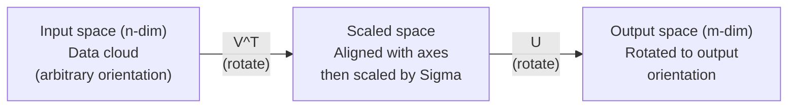
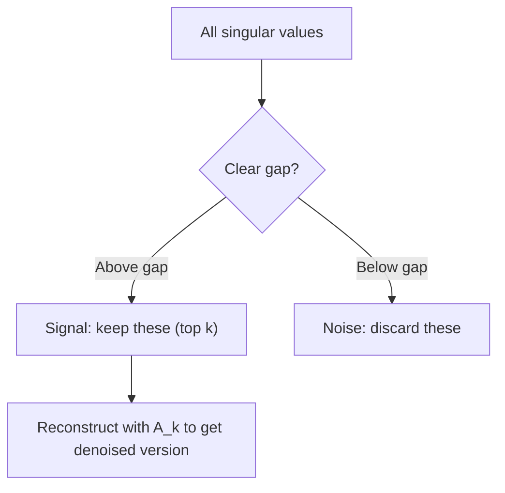

# التفكك في القيمة الفريدة

> (إس.دي.إس) هو سكين الجبر السويسري لكل ماتريك واحدة كل عالم بيانات يحتاج إلى واحدة

**Type:** Build
**Languages:** Python, Julia
**Prerequisites:** Phase 1, Lessons 01 (Linear Algebra Intuition), 02 (Vectors & Matrices Operations), 03 (Matrix Transformations)
**Time:** ~120 minutes

## أهداف التعلم

- تنفيذ SVD عبر تكرار الطاقة وتفسير المعنى الهندسي ل U، Sigma، و V^T
- تطبيق SVD المقطوعة لضغط الصورة وقياس نسبة الضغط مقابل خطأ إعادة الإعمار
- احسب مستوى "مور-بنروز" من خلال "SVD" لحل أنظمة أقل مربعات
- ربط SVD إلى PCA، وأنظمة التوصيات (عوامل متخفية) ، والتحليل النيمي المتخفية في NLP

## المشكلة

لديك ماتريكس 1000x2000. ربما تكون تصنيفات فيلم المستخدم. ربما تكون جدول ترددات في المستند. ربما تكون قيم البيكسل لصور. ربما تحتاج إلى ضغطها، وتخفيفها، وإيجاد هيكل مخفي فيها، أو حل نظام أقل مربعات معها. التكوين الخاص يعمل فقط على المصفوفات المربعة. حتى إذا كان ذلك، فإنه يتطلب من المصفوف أن يكون لديه مجموعة كاملة من المتجهات الخاصة المستقلة خطيا.

يعمل SVD على أي مصفوفة. أي شكل. أي رتبة. لا توجد شروط. إنه يفكك المصفوفة إلى ثلاثة عوامل تكشف عن هندسة ما تفعله المصفوفة إلى الفضاء. إنه الأكثر عامة وأكثر فائدة في جميع الجبر الخطى.

## المفهوم

### ما يفعله SVD بشكل هندسي

كل ماتريكس، بغض النظر عن الشكل، تقوم بعمليات ثلاث في التسلسل: تدور، وتحجم، وتدور.

```
A = U * Sigma * V^T

      m x n     m x m    m x n    n x n
     (any)    (rotate)  (scale)  (rotate)
```

في أي ماتريكس A، فإن SVD يعدلها إلى:
- V^T يدور المتجهات في مساحة المدخل (n-dimensional)
- مقياسات سيغما على طول كل محور (ممتد أو مضغوطات)
- U يدور النتيجة في مساحة الخروج (m-dimensional)



فكري به بهذه الطريقة. تسلم SVD ماتريكس. فإنه يقول لك: "تأخذ هذه المصفوفة كرة من المدخلات، أولا تدورها ب V^T، ثم تمددها إلى التخميس من خلال Sigma، ثم تدور التخميس من خلال U". القيم الفردية هي أطوال محور التخميس.

### التفكك الكامل

بالنسبة لمصفوفة A ذات الشكل m x n:

```
A = U * Sigma * V^T

where:
  U     is m x m, orthogonal (U^T U = I)
  Sigma is m x n, diagonal (singular values on the diagonal)
  V     is n x n, orthogonal (V^T V = I)

The singular values sigma_1 >= sigma_2 >= ... >= sigma_r > 0
where r = rank(A)
```

يطلق على أعمدة U متجهات مفردة اليسارية. يطلق على أعمدة V متجهات مفردة يمينية. يطلق على إدخالات خطافية Sigma قيم مفردة. وهي دائمًا غير سلبية وتقوم بتنظيمها بشكل تقليدي في ترتيب ينخفض.

### المتجهات الفردية اليسرى، القيم الفردية، المتجهات الفردية اليمنى

كل مكون من SVD له معنى هندسي متميز.

**Right singular vectors (columns of V):**هذه تشكل أساسًا أوثنورمالًا لمرحلة المدخل (R^n). وهي الاتجاهات في مساحة المدخل التي تقوم المصفوفة بتخطيطها إلى الاتجاهات المثبتة في مساحة الخروج. فكر في هذه الجهازات كنظام التنسيق الطبيعي للمجال.

**Singular values (diagonal of Sigma):**هذه هي عوامل التوسع. القيمة الفردية الثانية تخبرك كم تمتد المصفوفة المتجهات على طول المتجهة الفردية الثانية اليمنى. القيمة الفردية من الصفر تعني أن المصفوفة تحطم هذا الاتجاه بالكامل.

**Left singular vectors (columns of U):**هذه تشكل أساسًا عاديًا للفضاء الخارجي (R^m). المتجه الفردي الأيسر هو الاتجاه في الفضاء الخارجي حيث يقع المتجه الفردي الأيمن الأيادي (بعد التوسع).

العلاقة بينهما:

```
A * v_i = sigma_i * u_i

The matrix A takes the i-th right singular vector v_i,
scales it by sigma_i, and maps it to the i-th left singular vector u_i.
```

هذا يعطيك صورة من التنسيقات إلى التنسيقات لما تفعله أي ماتريكس

### شكل المنتج الخارجي

يمكن كتابة SVD كجمع من المصفوفات الدرجة-1:

```
A = sigma_1 * u_1 * v_1^T + sigma_2 * u_2 * v_2^T + ... + sigma_r * u_r * v_r^T

Each term sigma_i * u_i * v_i^T is a rank-1 matrix (an outer product).
The full matrix is the sum of r such matrices, where r is the rank.
```

هذا النموذج هو أساس التقريب منخفض الرتب. كل عبارة يضيف طبقة واحدة من الهيكل. العبارة الأولى تسجل نمط واحد أهم. الثانية تسجل الأهم التالي. وهكذا. تقسيم هذا المبلغ يمنحك أفضل تقريب ممكن في أي صف معين.

```
Rank-1 approx:    A_1 = sigma_1 * u_1 * v_1^T
                  (captures the dominant pattern)

Rank-2 approx:    A_2 = sigma_1 * u_1 * v_1^T + sigma_2 * u_2 * v_2^T
                  (captures the two most important patterns)

Rank-k approx:    A_k = sum of top k terms
                  (optimal by the Eckart-Young theorem)
```

### العلاقة مع التكوين الخاص

SVD و Eigendecomposition مرتبطة بعمق. القيم والمتجهات الفردية ل A تأتي مباشرة من القيم والمتجهات الخاصة A^T A و A^T.

```
A^T A = V * Sigma^T * U^T * U * Sigma * V^T
      = V * Sigma^T * Sigma * V^T
      = V * D * V^T

where D = Sigma^T * Sigma is a diagonal matrix with sigma_i^2 on the diagonal.

So:
- The right singular vectors (V) are eigenvectors of A^T A
- The singular values squared (sigma_i^2) are eigenvalues of A^T A

Similarly:
A A^T = U * Sigma * V^T * V * Sigma^T * U^T
      = U * Sigma * Sigma^T * U^T

So:
- The left singular vectors (U) are eigenvectors of A A^T
- The eigenvalues of A A^T are also sigma_i^2
```

هذا الاتصال يخبرك بثلاث أشياء:
1. القيم الفردية هي دائما حقيقية وغير سلبية (إنها جذور مربعة من القيم الخاصة للمصفوفة شبه محددة إيجابية).
2. يمكنك حساب SVD عن طريق التكوين الخاص من A^T A، ولكن هذا يربع رقم الحالة وفقد الدقة الرقمية.
3. عندما يكون A مربعًا ويمثل إيجابيًا شبه محددًا ، فإن SVD و Eigendecomposition هما نفس الشيء.

### التقريبات المتقصرة: تقريب منخفض

يذكر نظرية إيكارت-يونغ-ميرسكي أن أفضل تقارب من صفوف k إلى A (في كل من قاعدة فروبينيوس والطيفية) يتم الحصول عليه عن طريق الحفاظ على القيم الفردية العليا فقط ومتجهاتها المقابلة:

```
A_k = U_k * Sigma_k * V_k^T

where:
  U_k     is m x k  (first k columns of U)
  Sigma_k is k x k  (top-left k x k block of Sigma)
  V_k     is n x k  (first k columns of V)

Approximation error = sigma_{k+1}  (in spectral norm)
                    = sqrt(sigma_{k+1}^2 + ... + sigma_r^2)  (in Frobenius norm)
```

هذا ليس مجرد تقريب "جيد". إنه من المحتمل أن يكون أفضل تقريب ممكن لدرجة k. لا توجد ماتريكس أخرى من الدرجة k أقرب إلى A.

| Component | Relative magnitude | Kept in rank-3 approx? |
|-----------|-------------------|------------------------|
| sigma_1 | Largest | Yes |
| sigma_2 | Large | Yes |
| sigma_3 | Medium-large | Yes |
| sigma_4 | Medium | No (error) |
| sigma_5 | Medium-small | No (error) |
| sigma_6 | Small | No (error) |
| sigma_7 | Very small | No (error) |
| sigma_8 | Tiny | No (error) |

الحفاظ على أعلى 3: A_3 يلتقط أكبر ثلاثة قيم فردية. الخطأ = القيم المتبقية (sigma_4 إلى sigma_8).

إذا كانت القيم الفردية تتحلل بسرعة، فإن k الصغير يستولى على معظم المصفوفة. إذا كانت تتحلل ببطء، فإن المصفوفة لا تملك بنية منخفضة الرتب.

### ضغط الصورة مع SVD

صورة على نطاق الرمادي هي ماتريكية من كثافة البيكسل. صورة 800 × 600 لديها 480,000 قيم. SVD يسمح لك تقريرها مع أقل بكثير.

```
Original image: 800 x 600 = 480,000 values

SVD with rank k:
  U_k:      800 x k values
  Sigma_k:  k values
  V_k:      600 x k values
  Total:    k * (800 + 600 + 1) = k * 1401 values

  k=10:   14,010 values   (2.9% of original)
  k=50:   70,050 values  (14.6% of original)
  k=100: 140,100 values  (29.2% of original)

  The compression ratio improves as k gets smaller,
  but visual quality degrades.
```

المعلومات الرئيسية: الصور الطبيعية لها قيم فردية تتدهور بسرعة. الأقوال الفردية الأولى تتقاط الهيكل الواسع (الشكالات والتحركات). والآخرين يلتقطون التفاصيل الدقيقة والضوضاء. تقصير في المرتبة 50 غالبا ما ينتج صورة تبدو متطابقة تقريبًا مع الأصلية مع استخدام 85٪ أقل من التخزين.

### الجهاز التنفيذي للأنظمة التوصية

جائزة نتفليكس جعلت هذا مشهوداً. لديك ماتريكس تصنيف المستخدمين للأفلام حيث تفتقر معظم الإدخالات.

```
             Movie1  Movie2  Movie3  Movie4  Movie5
  User1      [  5      ?       3       ?       1  ]
  User2      [  ?      4       ?       2       ?  ]
  User3      [  3      ?       5       ?       ?  ]
  User4      [  ?      ?       ?       4       3  ]

  ? = unknown rating
```

الفكرة: هذه المصفوفة المصفوفة لديها رتبة منخفضة. لا يمتلك المستخدمون ذوق مستقل تماما. هناك عدد قليل من العوامل الخفية (العمل مقابل الدراما، القديم مقابل الجديد، الدماغ مقابل الدموية) التي تفسر معظم الاختيارات.

يزرق SVD على ماتريك التصنيفات (المملئة) إلى:
- U: ملفات المستخدم في الفضاء المتخفي
- إشارة: أهمية كل عامل متخفي
- V^T: ملفات الفيلم في الفضاء المتخفي

تصنيف المستخدم المتوقع لفيلم هو نسبة نقطة من ملف الشخصية المستخدم مع ملف الشخصية الفيلم (موزنًا بقيم فردية). يملأ التقريب المنخفض المرتبة الإدخالات المفقودة.

في الممارسة العملية، تستخدم المتغيرات مثل SVD أو ALS المتزايد من سيمون فانك (التبديل على الأقل مربعات) التي تتعامل مع البيانات المفقودة مباشرة. ولكن الفكرة الأساسية هي نفسها: تدهور العوامل الخفية عن طريق SVD.

### التفاصيل في النمط النووي: التحليل النيزكي المتخفي

تحليل اللاتنت المفصل (LSA) ، والذي يسمى أيضاً مؤشر اللاتنت المفصل (LSI) ، يطبق SVD على ماتريكس الوثيقة المحددة.

```
             Doc1   Doc2   Doc3   Doc4
  "cat"      [  3      0      1      0  ]
  "dog"      [  2      0      0      1  ]
  "fish"     [  0      4      1      0  ]
  "pet"      [  1      1      1      1  ]
  "ocean"    [  0      3      0      0  ]

After SVD with rank k=2:

  Each document becomes a point in 2D "concept space."
  Each term becomes a point in the same 2D space.
  Documents about similar topics cluster together.
  Terms with similar meanings cluster together.

  "cat" and "dog" end up near each other (land pets).
  "fish" and "ocean" end up near each other (water concepts).
  Doc1 and Doc3 cluster if they share similar topics.
```

كانت LSA واحدة من أوائل الطرق الناجحة لاستيعاب التشابه الدلالي من النص الخام. تعمل لأنه تميل إلى ظهور مصطلحات متجانسة في وثائق مماثلة، لذلك تقوم SVD بتجميعها في نفس الأبعاد الخفية. يمكن اعتبار تضمين الكلمات الحديثة (Word2Vec، GloVe) نذراً لهذه الفكرة.

### الـ SVD للحد من الضوضاء

البيانات الضوضاء لديها إشارة مركزة في أعلى القيم الفردية والضوضاء تنتشر على جميع القيم الفردية.

**Clean signal singular values:**

| Component | Magnitude | Type |
|-----------|-----------|------|
| sigma_1 | Very large | Signal |
| sigma_2 | Large | Signal |
| sigma_3 | Medium | Signal |
| sigma_4 | Near zero | Negligible |
| sigma_5 | Near zero | Negligible |

**Noisy signal singular values (noise adds to all):**

| Component | Magnitude | Type |
|-----------|-----------|------|
| sigma_1 | Very large | Signal |
| sigma_2 | Large | Signal |
| sigma_3 | Medium | Signal |
| sigma_4 | Small | Noise |
| sigma_5 | Small | Noise |
| sigma_6 | Small | Noise |
| sigma_7 | Small | Noise |



يستخدم هذا في معالجة الإشارات والقياس العلمي وتنظيف البيانات. في أي وقت يكون لديك ماتريكس فاسدة من ضجيج إضافي، فإن SVD المقطوع هو وسيلة مبدئية لفرق الإشارة عن الضجيج.

### الاختلافات السوداء عبر SVD

يُعمّل "مور-بنروز" الجهاز السودوي A+ عكس المصفوفة إلى المصفوفات غير المربعية والوحيدة. يجعلها SVD محاسبة بسيطة.

```
If A = U * Sigma * V^T, then:

A+ = V * Sigma+ * U^T

where Sigma+ is formed by:
  1. Transpose Sigma (swap rows and columns)
  2. Replace each non-zero diagonal entry sigma_i with 1/sigma_i
  3. Leave zeros as zeros

For A (m x n):      A+ is (n x m)
For Sigma (m x n):  Sigma+ is (n x m)
```

يحلّ المُضاد السودويّ مشاكل أقلّ المربعات. إذا لم يكن لدى Ax = b حلّ دقيق (نظامٍ مُعَدّدٍ) ، فإنّ x = A+ b هو حلّ أقلّ المربعات (يُقلّل من أنّها تعتبر أقلّ المربعات).

```
Overdetermined system (more equations than unknowns):

  [1  1]         [3]
  [2  1] x   =   [5]       No exact solution exists.
  [3  1]         [6]

  x_ls = A+ b = V * Sigma+ * U^T * b

  This gives the x that minimizes the sum of squared residuals.
  Same result as the normal equations (A^T A)^(-1) A^T b,
  but numerically more stable.
```

### مزايا الاستقرار الرقمي

الحساب الخاص بتكوين A^T A مربع القيم الفردية (قيمات A^T A الخاصة هي sigma_i^2). هذا مربع عدد الحالة، وتعزيز الأخطاء العددية.

```
Example:
  A has singular values [1000, 1, 0.001]
  Condition number of A: 1000 / 0.001 = 10^6

  A^T A has eigenvalues [10^6, 1, 10^{-6}]
  Condition number of A^T A: 10^6 / 10^{-6} = 10^{12}

  Computing SVD directly: works with condition number 10^6
  Computing via A^T A:     works with condition number 10^{12}
                           (6 extra digits of precision lost)
```

الخوارزميات الحديثة SVD (Golub-Kahan بيدiagonalization) تعمل مباشرة على A، أبدا تشكيل A^T A. هذا هو السبب في أنك يجب دائما تفضيل `np.linalg.svd(A)`- لقد انتهت`np.linalg.eig(A.T @ A)`. . .

### اتصال مع PCA

(بي سي ايه) هو (سڤيد) على البيانات المركزة، هذه ليست مقارنة، إنها حرفيا نفس الحسابات.

```
Given data matrix X (n_samples x n_features), centered (mean subtracted):

Covariance matrix: C = (1/(n-1)) * X^T X

PCA finds eigenvectors of C. But:

  X = U * Sigma * V^T    (SVD of X)

  X^T X = V * Sigma^2 * V^T

  C = (1/(n-1)) * V * Sigma^2 * V^T

So the principal components are exactly the right singular vectors V.
The explained variance for each component is sigma_i^2 / (n-1).

In sklearn, PCA is implemented using SVD, not eigendecomposition.
It is faster and more numerically stable.
```

هذا يعني أن كل ما تعلمته عن تقليل الأبعاد في الدروس 10 هو SVD تحت الغطاء. PCA هو التطبيق الأكثر شيوعا من SVD في التعلم الآلي.

```figure
svd-rank-reconstruction
```

## بناءها

### الخطوة 1: SVD من الصفر باستخدام التكرار الطاقة

الفكرة: للعثور على أكبر قيمة فردية ومجهراتها، استخدم التكرار القوى على A^T A (أو A^T). ثم تخفيف المصفوفة وتكرر للقيمة الفردية التالية.

```python
import numpy as np

def power_iteration(M, num_iters=100):
    n = M.shape[1]
    v = np.random.randn(n)
    v = v / np.linalg.norm(v)

    for _ in range(num_iters):
        Mv = M @ v
        v = Mv / np.linalg.norm(Mv)

    eigenvalue = v @ M @ v
    return eigenvalue, v

def svd_from_scratch(A, k=None):
    m, n = A.shape
    if k is None:
        k = min(m, n)

    sigmas = []
    us = []
    vs = []

    A_residual = A.copy().astype(float)

    for _ in range(k):
        AtA = A_residual.T @ A_residual
        eigenvalue, v = power_iteration(AtA, num_iters=200)

        if eigenvalue < 1e-10:
            break

        sigma = np.sqrt(eigenvalue)
        u = A_residual @ v / sigma

        sigmas.append(sigma)
        us.append(u)
        vs.append(v)

        A_residual = A_residual - sigma * np.outer(u, v)

    U = np.column_stack(us) if us else np.empty((m, 0))
    S = np.array(sigmas)
    V = np.column_stack(vs) if vs else np.empty((n, 0))

    return U, S, V
```

### الخطوة الثانية: اختبار ومقارنة مع NumPy

```python
np.random.seed(42)
A = np.random.randn(5, 4)

U_ours, S_ours, V_ours = svd_from_scratch(A)
U_np, S_np, Vt_np = np.linalg.svd(A, full_matrices=False)

print("Our singular values:", np.round(S_ours, 4))
print("NumPy singular values:", np.round(S_np, 4))

A_reconstructed = U_ours @ np.diag(S_ours) @ V_ours.T
print(f"Reconstruction error: {np.linalg.norm(A - A_reconstructed):.8f}")
```

### الخطوة 3: عرض لضغط الصورة

```python
def compress_image_svd(image_matrix, k):
    U, S, Vt = np.linalg.svd(image_matrix, full_matrices=False)
    compressed = U[:, :k] @ np.diag(S[:k]) @ Vt[:k, :]
    return compressed

image = np.random.seed(42)
rows, cols = 200, 300
image = np.random.randn(rows, cols)

for k in [1, 5, 10, 20, 50]:
    compressed = compress_image_svd(image, k)
    error = np.linalg.norm(image - compressed) / np.linalg.norm(image)
    original_size = rows * cols
    compressed_size = k * (rows + cols + 1)
    ratio = compressed_size / original_size
    print(f"k={k:>3d}  error={error:.4f}  storage={ratio:.1%}")
```

### الخطوة الرابعة: تقليل الضوضاء

```python
np.random.seed(42)
clean = np.outer(np.sin(np.linspace(0, 4*np.pi, 100)),
                 np.cos(np.linspace(0, 2*np.pi, 80)))
noise = 0.3 * np.random.randn(100, 80)
noisy = clean + noise

U, S, Vt = np.linalg.svd(noisy, full_matrices=False)
denoised = U[:, :5] @ np.diag(S[:5]) @ Vt[:5, :]

print(f"Noisy error:    {np.linalg.norm(noisy - clean):.4f}")
print(f"Denoised error: {np.linalg.norm(denoised - clean):.4f}")
print(f"Improvement:    {(1 - np.linalg.norm(denoised - clean) / np.linalg.norm(noisy - clean)):.1%}")
```

### الخطوة 5: الاختلاف

```python
A = np.array([[1, 1], [2, 1], [3, 1]], dtype=float)
b = np.array([3, 5, 6], dtype=float)

U, S, Vt = np.linalg.svd(A, full_matrices=False)
S_inv = np.diag(1.0 / S)
A_pinv = Vt.T @ S_inv @ U.T

x_svd = A_pinv @ b
x_lstsq = np.linalg.lstsq(A, b, rcond=None)[0]
x_pinv = np.linalg.pinv(A) @ b

print(f"SVD pseudoinverse solution:  {x_svd}")
print(f"np.linalg.lstsq solution:   {x_lstsq}")
print(f"np.linalg.pinv solution:    {x_pinv}")
```

## استخدمها

الظهور الكامل يعمل في `code/svd.py`. إشغيله لترى SVD تطبيق على ضغط الصورة، وأنظمة التوصيات، التحليل الامتناع، وتقليل الضوضاء.

```bash
python svd.py
```

نسخة جوليا في`code/svd.jl`يظهر نفس المفاهيم باستخدام الوطني جوليا `svd()`وظيفة و`LinearAlgebra`الحزمة

```bash
julia svd.jl
```

## أرسله

هذا الدرس ينتج عن:
- `outputs/skill-svd.md`- مهارة لمعرفة متى وكيفية تطبيق SVD في المشاريع الحقيقية

## التمارين

1. قم بتنفيذ SVD الكامل من الصفر دون استخدام التكرار القوي. بدلاً من ذلك ، احسب التكوين الخاص A^T A للحصول على V والقيم الفردية ، ثم احسب U = A V Sigma^{-1}. قارن دقة العددية مع إصدار التكرار القوي الخاص بك ومع NumPy.

2. تحميل صورة حقيقية على نطاق الرمادي (أو تحويل واحدة إلى نطاق الرمادي). ضغطها على الصفوف 1، 5، 10، 25، 50، 100. لكل صف، احسب نسبة الضغط والخطأ النسبي. العثور على الصف الذي يصبح الصورة مقبولة بصريا.

3. قم ببناء نظام توصيات صغير. قم بإنشاء ماتريكية تصنيفات فيلم مستخدم 10 × 8 مع بعض الإدخالات المعروفة. املأ الإدخالات المفقودة بوسائل الصف. احسب SVD واستعادة تقريب الدرجة 3. استخدم المصفوفة المعدة لإتنبؤ بالتصنيفات المفقودة. تحقق من أن التنبؤات معقولة.

4. قم بإنشاء ماتريكية 100 × 50 من المستندات المختلفة مع 3 مواضيع اصطناعية. لكل موضوع 5 مصطلحات مرتبطة. أضف الضوضاء. تطبيق SVD وتحقق من أن القيم الثلاثة الأولى من الفردية أكبر بكثير من البقية. مشروع المستندات في الفضاء الخاطئ 3D وتحقق من أن المستندات من نفس مجموعة الموضوع معا.

5. قم بتوليد ماتريكس منخفضة الصفحة النظيفة (الصفحة 3 ، حجم 50x40) واضافة ضجيج غوسيان في مستويات مختلفة (سيغما = 0.1 ، 0.5 ، 1.0 ، 2.0). لكل مستوى ضجيج ، العثور على درجة التقطيع الأمثل عن طريق مسح k من 1 إلى 40 وقياس خطأ إعادة الإعمار ضد المصفحة النظيفة. رسم كيف يتغير k الأمثل مع مستوى الضجيج.

## الشروط الرئيسية

| Term | What people say | What it actually means |
|------|----------------|----------------------|
| SVD | "Factor any matrix" | Decompose A into U Sigma V^T where U and V are orthogonal and Sigma is diagonal with non-negative entries. Works for any matrix of any shape. |
| Singular value | "How important this component is" | The i-th diagonal entry of Sigma. Measures how much the matrix stretches along the i-th principal direction. Always non-negative, sorted in decreasing order. |
| Left singular vector | "Output direction" | A column of U. The direction in output space that the i-th right singular vector maps to (after scaling by sigma_i). |
| Right singular vector | "Input direction" | A column of V. The direction in input space that the matrix maps to the i-th left singular vector (after scaling by sigma_i). |
| Truncated SVD | "Low-rank approximation" | Keep only the top k singular values and their vectors. Produces the provably best rank-k approximation to the original matrix (Eckart-Young theorem). |
| Rank | "True dimensionality" | The number of non-zero singular values. Tells you how many independent directions the matrix actually uses. |
| Pseudoinverse | "Generalized inverse" | V Sigma+ U^T. Inverts non-zero singular values, leaves zeros as zeros. Solves least-squares problems for non-square or singular matrices. |
| Condition number | "How sensitive to errors" | sigma_max / sigma_min. A large condition number means small input changes cause large output changes. SVD reveals this directly. |
| Latent factor | "Hidden variable" | A dimension in the low-rank space discovered by SVD. In recommendations, a latent factor might correspond to genre preference. In NLP, it might correspond to a topic. |
| Frobenius norm | "Total matrix size" | Square root of the sum of squared entries. Equals the square root of the sum of squared singular values. Used to measure approximation error. |
| Eckart-Young theorem | "SVD gives the best compression" | For any target rank k, the truncated SVD minimizes the approximation error over all possible rank-k matrices. |
| Power iteration | "Find the biggest eigenvector" | Repeatedly multiply a random vector by the matrix and normalize. Converges to the eigenvector with the largest eigenvalue. The building block of many SVD algorithms. |

## المزيد من القراءة

- [Gilbert Strang: Linear Algebra and Its Applications, Chapter 7](https://math.mit.edu/~gs/linearalgebra/)- علاج الدماغ المريض بالتهابات المزمنة
- [3Blue1Brown: But what is the SVD?](https://www.youtube.com/watch?v=vSczTbgc8Rc)- الحس البدني الهندسي لـ SVD
- [We Recommend a Singular Value Decomposition](https://www.ams.org/publicoutreach/feature-column/fcarc-svd)- نظرة عامة متاحة من الجمعية الأمريكية للرياضيات
- [Netflix Prize and Matrix Factorization](https://sifter.org/~simon/journal/20061211.html)- المقال الأصلي من سايمون فانك على موقع SVD للحصول على توصيات
- [Latent Semantic Analysis](https://en.wikipedia.org/wiki/Latent_semantic_analysis)- التطبيق الأصلي لـ NLP لـ SVD
- [Numerical Linear Algebra by Trefethen and Bau](https://people.maths.ox.ac.uk/trefethen/text.html)- المعيار الذهبي لفهم خوارزميات SVD وخصائصها الرقمية
