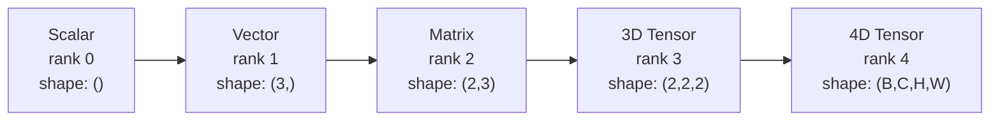
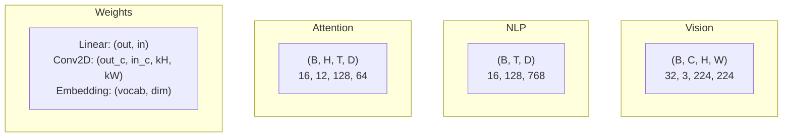
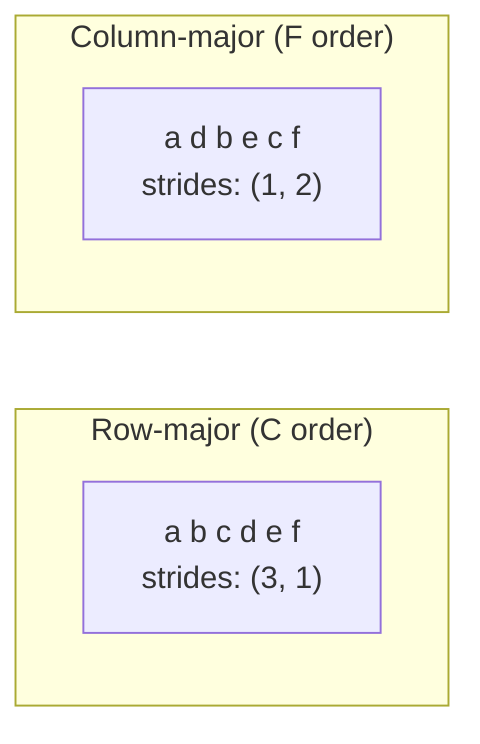
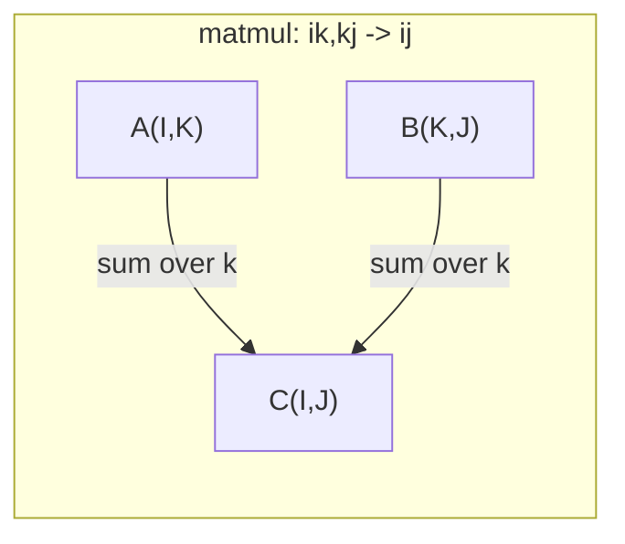

# عمليات التنسور

> الجهاز هو اللغة المشتركة بين البيانات والتعلم العميق كل صورة، كل جملة، كل تراجع يتدفق من خلالها

**Type:** Build
**Language:**بايثون
**Prerequisites:** Phase 1, Lessons 01 (Linear Algebra Intuition), 02 (Vectors, Matrices & Operations)
**Time:** ~90 minutes

## أهداف التعلم

- تنفيذ فئة التنسور مع تشكيل، خطوات، إعادة تشكيل، نقل، وعمليات العنصر الحكيمة من الصفر
- تطبيق قواعد البث للعمل على ضغطات مختلفة الأشكال دون نسخ البيانات
- اكتب تعبيرات الجملة لمنتجات النقاط، وتضاعفات المصفوفة، والمنتجات الخارجية، والعمليات المكتسبة
- تتبع أشكال الجهاز الدقيق من خلال كل خطوة من الاهتمام متعدد الرؤوس

## المشكلة

تقوم ببناء محول، والمركز الأمامي يبدو نظيفاً، تقوم بتشغيله وتحصل على:`RuntimeError: mat1 and mat2 shapes cannot be multiplied (32x768 and 512x768)`أنت تنظر إلى الأشكال، تحاول تحويلها، والآن تقول`Expected 4D input (got 3D input)`تضيفين ضغطاً غير مُضغوط، ثمّ شيء آخر ينكسر.

أخطاء الشكل هي الأخطاء الأكثر شيوعا في التعليم العميق. إنها ليست صعبة من الناحية الفكرية - كل عملية لها عقد شكل - لكنها تتضاعف بسرعة. المحول لديه عشرات التغييرات، والتحويلات، والإرسالات المتسلسلة معًا. محور خاطئ واحد وتصاعد الخطأ والأسوأ من ذلك، بعض الأخطاء في الشكل لا تلقي على الأخطاء على الإطلاق. إنهم ينتجون الصمت القمامة عن طريق الإذاعة على طول البعد الخطأ أو الجمع على المحور الخطأ.

المصفوفات تتعامل مع العلاقات المتزاوجة بين مجموعتين من الأشياء. البيانات الحقيقية لا تناسب في ابعدين. مجموعة من 32 صورة RGB في 224x224 هو تنزور 4D: `(32, 3, 224, 224)`الاهتمام الذاتي مع 12 رأس هو أيضا 4D:`(batch, heads, seq_len, head_dim)`تحتاج إلى هيكل بيانات يجميع إلى عدد من الأبعاد، مع العمليات التي تتكون نظيفة على جميعها. تلك الهيكل هو الجهاز. إتقان العمليات والخطأ الشكل يصبح غير مهمة إصلاح.

## المفهوم

### ما هو الـ (تنسور)

الجهاز هو مجموعة متعددة الأبعاد من الأرقام مع نوع بيانات متساوية. عدد الأبعاد هو **rank**(أو **order**كل بعد هو**axis**- المُؤمنون**shape**هو طوبيل يصف الحجم على طول كل محور.



مجموع العناصر = المنتج من جميع الأحجام. شكل `(2, 3, 4)`يحتفظ`2 * 3 * 4 = 24`العناصر

### أشكال التنسور في التعلم العميق

أنواع البيانات المختلفة خريطة إلى أشكال تنسور محددة حسب الاتفاقية.



يستخدم PyTorch NCHW (القنوات الأولى). تثنيات TensorFlow إلى NHWC (القنوات الأخيرة). تكوينات غير مطابقة تسبب تباطؤات أو أخطاء صامتة.

### كيف يعمل ترتيب الذاكرة

صف 2D في الذاكرة هو تسلسل 1D من البايت. **Strides**أخبرك كم عنصر يجب أن تخطي لتحرك خطوة واحدة على طول كل محور



لا يتحرك الترانسبوس البيانات، بل يتبادل الخطوات، مما يجعل الجهاز الجهاز الجهاز الجهاز الجهاز الجهاز الجهاز الجهاز الجهاز الجهاز الجهاز الجهاز الجهاز الجهاز الجهاز الجهاز الجهاز الجهاز الجهاز الجهاز الجهاز الجهاز الجهاز الجهاز الجهاز الجهاز الجهاز الجهاز الجهاز الجهاز الجهاز الجهاز الجهاز الجهاز الجهاز الجهاز الجهاز الجهاز الجهاز الجهاز الجهاز الجهاز الجهاز الجهاز الجهاز الجهاز الجهاز الجهاز الجهاز الجهاز الجهاز الجهاز الجهاز الجهاز الجهاز الجهاز الجهاز الجهاز الجهاز الجهاز الجهاز الجهاز الجهاز**non-contiguous**-- عناصر صف لم تعد متجاورة في الذاكرة.

### قواعد الإذاعة

يسمح لك البث بتشغيل مضغوطات مختلفة الأشكال دون نسخ البيانات. تحسّن الأشكال من اليمين. يُوافق الأبعاد عندما تكون متساوية أو تكون واحدة هي 1.

```
Tensor A:     (8, 1, 6, 1)
Tensor B:        (7, 1, 5)
Padded B:     (1, 7, 1, 5)
Result:       (8, 7, 6, 5)
```

### إنسم: العملية العالمية للضغط

ويتم جمع محورات الإدخال ولكن لا يتم جمع المحورات في الخروج. يتم الاحتفاظ بالمحورات في كليهما.



النماذج الرئيسية: `i,i->`(منتج نقطة)`i,j->ij`(المنتج الخارجي)`ii->`(الآثر)`ij->ji`(تحول)`bij,bjk->bik`(بارتش ماتمول) ،`bhtd,bhsd->bhts`(نقطة الاهتمام)

```figure
tensor-broadcast
```

## بناءها

الرمز يعيش في`code/tensors.py`كل خطوة تشير إلى التنفيذ هناك.

### الخطوة الأولى: تخزين التنفس والخطوات

تخزين الجهاز السريع قائمة مسطحة من الأرقام بالإضافة إلى بيانات الأشكال. تدخلات تخبر منطق المؤشر كيفية رسم خريطة مؤشرات متعددة الأبعاد إلى مواقع مسطحة.

```python
class Tensor:
    def __init__(self, data, shape=None):
        if isinstance(data, (list, tuple)):
            self._data, self._shape = self._flatten_nested(data)
        elif isinstance(data, np.ndarray):
            self._data = data.flatten().tolist()
            self._shape = tuple(data.shape)
        else:
            self._data = [data]
            self._shape = ()

        if shape is not None:
            total = reduce(lambda a, b: a * b, shape, 1)
            if total != len(self._data):
                raise ValueError(
                    f"Cannot reshape {len(self._data)} elements into shape {shape}"
                )
            self._shape = tuple(shape)

        self._strides = self._compute_strides(self._shape)

    @staticmethod
    def _compute_strides(shape):
        if len(shape) == 0:
            return ()
        strides = [1] * len(shape)
        for i in range(len(shape) - 2, -1, -1):
            strides[i] = strides[i + 1] * shape[i + 1]
        return tuple(strides)
```

للشكل`(3, 4)`، تقدمات هي`(4, 1)`-- تخطي 4 عناصر لتقدم صف واحد، تخطي عنصر واحد لتقدم عمود واحد.

### الخطوة الثانية: إعادة تصفيف، ضغط، إزالة الضغط

يغير الشكل دون تغيير ترتيب العناصر. يجب أن يبقى العدد الإجمالي من العناصر نفسه. استخدام `-1`لبعضه واحد لتحديد حجمها

```python
t = Tensor(list(range(12)), shape=(2, 6))
r = t.reshape((3, 4))
r = t.reshape((-1, 3))
```

سحب يزيل المحورات من الحجم 1 . إدراج unsqueez واحد. غير الضغط أمر حاسم للتسجيل -- متجه التحيز`(D,)`إضافة إلى اللحظة`(B, T, D)`تحتاج إلى عدم الضغط على`(1, 1, D)`. . .

```python
t = Tensor(list(range(6)), shape=(1, 3, 1, 2))
s = t.squeeze()
v = Tensor([1, 2, 3])
u = v.unsqueeze(0)
```

### الخطوة الثالثة: نقل وتحويل

نقل تبادل محورين، إعادة ترتيب المحورين، هكذا تحول بين NCHW و NHWC

```python
mat = Tensor(list(range(6)), shape=(2, 3))
tr = mat.transpose(0, 1)

t4d = Tensor(list(range(24)), shape=(1, 2, 3, 4))
perm = t4d.permute((0, 2, 3, 1))
```

بعد نقل أو تحويل، يكون الجهاز غير متواصل في الذاكرة.`view`الفشل في الجهاز غير المتواصل -- استخدام `reshape`أو اتصل`.contiguous()`أولاً

### الخطوة الرابعة: عمليات الحد من العناصر

عمليات معرفت العنصر (إضافة، مضاعفة، خصم) تطبق بشكل مستقل على كل عنصر وتحافظ على الشكل. التخفيضات (الجمل، المتوسط، أقصى) تنهار محور واحد أو أكثر.

```python
a = Tensor([[1, 2], [3, 4]])
b = Tensor([[10, 20], [30, 40]])
c = a + b
d = a * 2
s = a.sum(axis=0)
```

متوسط التجميع العالمي في CNN: `(B, C, H, W).mean(axis=[2, 3])`تنتج`(B, C)`. المتوسط المتبع في التجميع في النمط النووي: `(B, T, D).mean(axis=1)`تنتج`(B, D)`. . .

### الخطوة 5: البث باستخدام NumPy

- نعم`demo_broadcasting_numpy()`وظيفة في `tensors.py`يظهر أنماط الأساس.

```python
activations = np.random.randn(4, 3)
bias = np.array([0.1, 0.2, 0.3])
result = activations + bias

images = np.random.randn(2, 3, 4, 4)
scale = np.array([0.5, 1.0, 1.5]).reshape(1, 3, 1, 1)
result = images * scale

a = np.array([1, 2, 3]).reshape(-1, 1)
b = np.array([10, 20, 30, 40]).reshape(1, -1)
outer = a * b
```

المسافة المتزاوجة عبر البث: إعادة تشكيل `(M, 2)`إلى`(M, 1, 2)`و`(N, 2)`إلى`(1, N, 2)`, سحب , مربع , جمع على طول المحور الأخير , تأخذ الجذر التربيعي. النتيجة: `(M, N)`. . .

### الخطوة 6: عمليات إينسم

- نعم`demo_einsum()`و`demo_einsum_gallery()`المهام تمر عبر كل نمط مشترك

```python
a = np.array([1.0, 2.0, 3.0])
b = np.array([4.0, 5.0, 6.0])
dot = np.einsum("i,i->", a, b)

A = np.array([[1, 2], [3, 4], [5, 6]], dtype=float)
B = np.array([[7, 8, 9], [10, 11, 12]], dtype=float)
matmul = np.einsum("ik,kj->ij", A, B)

batch_A = np.random.randn(4, 3, 5)
batch_B = np.random.randn(4, 5, 2)
batch_mm = np.einsum("bij,bjk->bik", batch_A, batch_B)
```

تكلفة الحساب من الانقباض هو ناتج من جميع حجم المؤشر (المحتفظ بها والجمع).`bij,bjk->bik`مع B=32، I=128، J=64, K=128: `32 * 128 * 64 * 128 = 33,554,432`مضاعفات

### الخطوة 7: آلية الاهتمام عبر الانسوم

- نعم`demo_attention_einsum()`يطبق هذا الممثل الاهتمام متعدد الرؤوس من نهايتها إلى النهاية.

```python
B, H, T, D = 2, 4, 8, 16
E = H * D

X = np.random.randn(B, T, E)
W_q = np.random.randn(E, E) * 0.02

Q = np.einsum("bte,ek->btk", X, W_q)
Q = Q.reshape(B, T, H, D).transpose(0, 2, 1, 3)

scores = np.einsum("bhtd,bhsd->bhts", Q, K) / np.sqrt(D)
weights = softmax(scores, axis=-1)
attn_output = np.einsum("bhts,bhsd->bhtd", weights, V)

concat = attn_output.transpose(0, 2, 1, 3).reshape(B, T, E)
output = np.einsum("bte,ek->btk", concat, W_o)
```

كل خطوة عملية تنسرية: التنشر (ماتمل عبر einsum) ، وتقسيم الرأس (تغيير الشكل + نقل) ، ونقاط الاهتمام (مجموعة ماتمل عبر einsum) ، المجموعة الموزعة (مجموعة ماتمل عبر einsum) ، دمج الرأس (تغيير الشكل + إعادة تشكيل) ، وتقديم الإخراج (ماتمل عبر einsum).

## استخدمها

### الخدش مقابل النومبي

| Operation | Scratch (Tensor class) | NumPy |
|---|---|---|
| Create | `Tensor([[1,2],[3,4]])` | `np.array([[1,2],[3,4]])` |
| Reshape | `t.reshape((3,4))` | `a.reshape(3,4)` |
| Transpose | `t.transpose(0,1)` | `a.T` or `a.transpose(0,1)` |
| Squeeze | `t.squeeze(0)` | `np.squeeze(a, 0)` |
| Sum | `t.sum(axis=0)` | `a.sum(axis=0)` |
| Einsum | N/A | `np.einsum("ij,jk->ik", a, b)` |

### الخدش مقابل بيتورش

```python
import torch

t = torch.tensor([[1, 2, 3], [4, 5, 6]], dtype=torch.float32)
t.shape
t.stride()
t.is_contiguous()

t.reshape(3, 2)
t.unsqueeze(0)
t.transpose(0, 1)
t.transpose(0, 1).contiguous()

torch.einsum("ik,kj->ij", A, B)
```

يضيف PyTorch autograd، دعم GPU، وبرامج BLAS المثلى. تكون أشكال الشكل متشابهة. إذا فهمت نسخة الخدش، تصبح أخطاء شكل PyTorch قابلة للقراءة.

### كل طبقة من شبكة العصبية كعملية تنزورية

| Operation | Tensor Form | Einsum |
|---|---|---|
| Linear layer | `Y = X @ W.T + b` | `"bd,od->bo"` + bias |
| Attention QKV | `Q = X @ W_q` | `"btd,dh->bth"` |
| Attention scores | `Q @ K.T / sqrt(d)` | `"bhtd,bhsd->bhts"` |
| Attention output | `softmax(scores) @ V` | `"bhts,bhsd->bhtd"` |
| Batch norm | `(X - mu) / sigma * gamma` | element-wise + broadcast |
| Softmax | `exp(x) / sum(exp(x))` | element-wise + reduction |

## أرسله

هذا الدروس يخرج اثنين من الاستخدامات المتكررة:

1. **`outputs/prompt-tensor-shapes.md`**-- طلب منهجي لإلغاء إصلاحات عدم مطابقة شكل التنسور. يتضمن جداول القرار لكل عملية شائعة (ماتمول، البث، القط، خطية، Conv2d، باتشنورم، softmax) و جدول بحث لإصلاح.

2. **`outputs/prompt-tensor-debugger.md`**-- خطوة خطوة تحذير تطلبك إلصاق في أي مساعد الذكاء الاصطناعي عندما خطأ الشكل يمنعك. إطعامها رسالة الخطأ وأشكال التنسور الخاص بك، الحصول على إصلاح دقيق.

## التمارين

1. **Easy -- Reshape round-trip.**خذ ضغط الشكل`(2, 3, 4)`. أعيد تشكيله`(6, 4)`، ثم إلى`(24,)`ثم عودوا إلى`(2, 3, 4)`يتم الحفاظ على ترتيب عناصر التحقق في كل خطوة من خلال طباعة البيانات المسطحة.

2. **Medium -- Implement broadcasting.**تمديد `Tensor`الفصل مع `broadcast_to(shape)`طريقة توسيع أبعاد الحجم 1 لتطابق شكل الهدف. ثم تعديل `_elementwise_op`للتبث التلقائي قبل التشغيل. اختبار مع الأشكال `(3, 1)`و`(1, 4)`إنتاج`(3, 4)`. . .

3. **Hard -- Build einsum from scratch.**تنفيذ قاعدة`einsum(subscripts, *tensors)`وظيفة تتعامل مع: نقطة المنتج (`i,i->`(), مضاعفة المصفوفة (`ij,jk->ik`المنتج الخارجي (`i,j->ij`() وترانسبوس (`ij->ji`) تحليل سلسلة المخططات الفرعية، وتحديد المؤشرات المقلدة، والحلقة على جميع مجموعات المؤشرات. مقارنة نتائجك مع `np.einsum`. . .

4. **Hard -- Attention shape tracker.**اكتب وظيفة تأخذ `batch_size`،`seq_len`،`embed_dim`و`num_heads`كما المدخلات والطباعة الشكل الدقيق في كل خطوة من الرأس المتعددة الاهتمام: المدخل، Q / K / V التنبيه، رأس الانقسام، نقاط الاهتمام، ووزن softmax، المجموع الموزن، رأس دمج، التنبيه الخروج. التحقق من`demo_attention_einsum()`الناتج

## الشروط الرئيسية

| Term | What people say | What it actually means |
|---|---|---|
| Tensor | "A matrix but more dimensions" | A multi-dimensional array with uniform type and defined shape, strides, and operations |
| Rank | "The number of dimensions" | The number of axes. A matrix has rank 2, not rank equal to its matrix rank |
| Shape | "The size of the tensor" | A tuple listing the size along each axis. `(2, 3)` means 2 rows, 3 columns |
| Stride | "How memory is laid out" | The number of elements to skip to advance one position along each axis |
| Broadcasting | "It just works when shapes differ" | A strict set of rules: align from right, dimensions must be equal or one must be 1 |
| Contiguous | "The tensor is normal" | Elements stored sequentially in memory with no gaps or reordering from the logical layout |
| Einsum | "A fancy way to write matmul" | A general notation that expresses any tensor contraction, outer product, trace, or transpose in one line |
| View | "Same as reshape" | A tensor sharing the same memory buffer but with different shape/stride metadata. Fails on non-contiguous data |
| Contraction | "Summing over an index" | The general operation where a shared index between tensors is multiplied and summed, producing a lower-rank result |
| NCHW / NHWC | "PyTorch vs TensorFlow format" | Memory layout conventions for image tensors. NCHW puts channels before spatial dims, NHWC puts them after |

## المزيد من القراءة

- [NumPy Broadcasting](https://numpy.org/doc/stable/user/basics.broadcasting.html)-- القواعد القنونية مع أمثلة مرئية
- [PyTorch Tensor Views](https://pytorch.org/docs/stable/tensor_view.html)-- عندما تعمل المشاهدات وعندما تُنسخ
- [einops](https://github.com/arogozhnikov/einops)-- مكتبة تجعل إعادة تشكيل الجهاز القراءة و الآمنة
- [The Illustrated Transformer](https://jalammar.github.io/illustrated-transformer/)-- تظهر أشكال الجهاز التنسوري تتدفق عبر الاهتمام
- [Einstein Summation in NumPy](https://numpy.org/doc/stable/reference/generated/numpy.einsum.html)-- وثائق كاملة مع أمثلة
