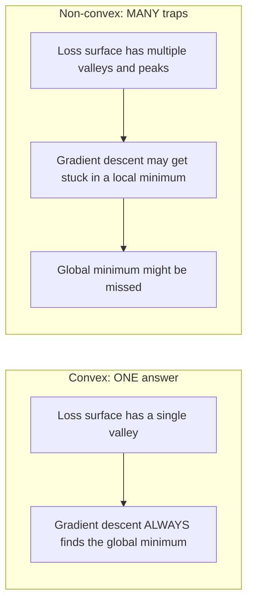
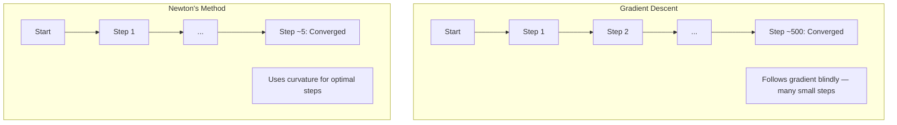
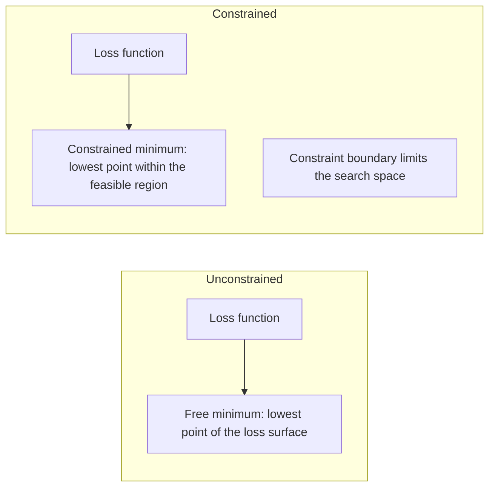
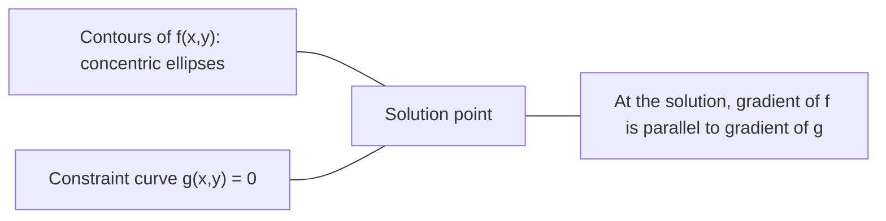

# التحسين الملتوي

> المشاكل الملتوية لديها وادي واحد شبكات عصبية لديها ملايين معرفة الفرق مهم

**Type:** Build
**Language:**بايثون
**Prerequisites:** Phase 1, Lessons 04 (Calculus for ML), 08 (Optimization)
**Time:** ~90 minutes

## أهداف التعلم

- اختبار ما إذا كانت الوظيفة متواصلة باستخدام التعريف والمشتق الثاني والمعايير الهسسي
- قم بتطبيق طريقة نيوتن ومقارنة التقارب التربيعي له مع تراجع التراجع
- حل مشاكل التحسين المحدود باستخدام مضاعفات لاجرنج وتفسير ظروف KKT
- شرح لماذا لا تكون المناظر الطبيعية للخسائر في الشبكات العصبية متواصلة ومع ذلك فإن SGD لا تزال تجد حلول جيدة

## المشكلة

درس 08 علمك انخفاض التدفق والزخم، و آدم. هؤلاء المتحفسين يسيرون أسفل على أي سطح. لكنهم يأتون مع عدم وجود ضمانات. انخفاض التدفق على المناظر الطبيعية غير الملتوية قد يقع في الحد الأدنى المحلي السيئ، أو يعلق على نقطة السعد، أو يتذبذب إلى الأبد. استخدمتها على أي حال لأن الشبكات العصبية غير متدفقة وليس هناك بديل.

ولكن العديد من المشاكل في التعلم الآلي متواضعة. التراجع الخطوي، التراجع اللوجستي، SVMs، LASSO، التراجع الصخري. بالنسبة لهؤلاء، هناك شيء أقوى: التحسين مع ضمانات رياضية. مشكلة متواضعة لديها وادي واحد بالضبط. أي خوارزمية تسير أسفل التلال سوف تصل إلى الحد الأدنى العالمي. لا حاجة لإعادة التشغيل. لا جدولات معدل التعلم. لا صلاة.

فهم التخفيف يفعله ثلاثة أشياء. أولاً، فإنه يخبرك عندما تكون مشكلتك سهلة (تخفيف) مقابل صعبة (غير متخفيف). ثانياً، فإنه يمنحك أدوات أسرع مثل طريقة نيوتن للمشاكل المتخففة. ثالثاً، فإنه يفسّر المفاهيم التي تظهر في جميع أنحاء ML: التنظيم كقيض، الثنائيّة في SVMs، ولماذا التعلم العميق يعمل على الرغم من انتهاك كل خصائص لطيفة تعطي لك التخفيف.

## المفهوم

### مجموعات متواصلة

مجموعة S متواصلة إذا كان لكل نقطتين في S، فإن قطاع الخط بينها يقع أيضاً بالكامل في S.

| Convex sets | Not convex |
|---|---|
| **Rectangle**: any two points inside can be connected by a line segment that stays inside | **Star/crescent shape**: a line between two interior points can pass outside the set |
| **Triangle**: same property holds for all interior points | **Donut/annulus**: the hole means some line segments leave the set |
| The line segment between any two points stays within the set | The line segment between some pairs of points exits the set |

الاختبار الرسمي: بالنسبة لأي نقاط x و y في S وأي t في [0, 1] ، فإن نقطة tx + (1-t) y هي أيضا في S.

أمثلة على مجموعات متواصلة:
- خط، طائرة، كل R^n
- كرة (حلقة، كرة، هائبرسفيرة)
- نصف مساحة: {x: a^T x <= b}
- التقاطع لأي عدد من مجموعات الملتوية

أمثلة على مجموعات غير متواصلة:
- كعك (أنولوس)
- اتحاد دوائر منفصلة
- أي مجموعة مع "دنت" أو "ثقب"

### وظائف متواصلة

وظيفة f متواصلة إذا كانت مجالها مجموعة متواصلة وبالنسبة لأي نقطتين x و y في مجالها وكل t في [0, 1]:

```
f(tx + (1-t)y) <= t*f(x) + (1-t)*f(y)
```

جغرافيا: القطاع الخطوي بين أي نقطتين على الرسم البياني يقع فوق أو على الرسم البياني.

| Property | Convex function | Non-convex function |
|---|---|---|
| **Line segment test** | The line between any two points on the graph lies **above or on** the curve | The line between some points on the graph dips **below** the curve |
| **Shape** | Single bowl/valley curving upward | Multiple peaks and valleys with mixed curvature |
| **Local minima** | Every local minimum is the global minimum | Multiple local minima may exist at different heights |

الوظائف الملتوية المشتركة:
- f(x) = x^2 (المقارنة)
- f(x) = ‬‬‬‬‬‬‬‬‬‬‬‬‬‬‬‬‬‬‬‬‬‬‬‬‬‬‬‬‬‬‬‬‬‬‬‬‬‬‬‬‬‬‬‬‬‬‬‬‬‬‬‬‬‬‬‬‬‬‬‬‬‬‬‬‬‬‬‬‬‬‬‬‬‬‬‬‬‬‬‬‬‬‬‬‬‬‬‬‬‬‬‬‬‬‬‬‬‬‬‬‬‬‬‬‬‬‬‬‬‬‬‬‬‬‬‬‬‬‬‬‬‬‬‬‬‬‬‬‬‬‬‬‬‬‬‬‬‬‬‬‬‬‬‬‬‬‬‬‬‬‬‬‬‬‬‬‬‬‬‬‬‬‬‬‬‬‬‬‬‬‬‬‬‬‬‬‬‬‬‬‬‬‬‬‬‬‬‬‬‬‬‬‬‬‬‬‬‬‬‬‬‬‬‬‬‬‬‬‬‬‬‬‬‬‬‬‬‬‬‬‬‬‬‬‬‬‬‬‬‬‬‬‬‬‬‬‬‬‬‬‬‬‬‬‬‬‬‬‬‬‬‬‬‬‬‬‬‬‬‬‬‬‬‬‬‬‬‬‬‬‬‬‬‬‬‬‬‬‬‬‬‬‬‬‬‬‬‬‬‬‬‬‬‬‬‬‬‬‬‬‬‬‬‬‬‬‬‬‬‬‬‬‬‬‬‬‬‬‬‬‬‬‬‬‬‬‬‬‬‬‬‬‬‬‬‬‬‬‬‬‬‬‬‬‬‬‬‬‬‬‬‬‬‬‬‬‬‬‬‬‬‬‬‬‬‬‬‬‬‬‬‬‬‬‬‬‬‬‬‬‬‬‬‬‬‬‬‬‬‬‬‬‬‬‬‬‬‬‬‬‬‬‬‬‬‬‬‬‬‬‬‬‬‬‬‬‬‬‬‬‬‬‬‬‬‬‬‬‬‬‬‬‬‬‬‬‬‬‬‬‬‬‬‬‬‬‬‬‬‬‬‬‬‬‬‬‬‬‬‬‬‬‬‬‬‬‬‬‬‬‬‬‬‬‬‬‬‬‬‬‬‬‬‬‬‬‬‬‬‬‬‬‬‬‬‬‬‬‬‬‬‬‬‬
- f(x) = e^x (معدل)
- f(x) = max(0, x) (ReLU، على الرغم من قطعة خطية)
- f(x) = -log(x) لـ x > 0 (سجل سلبي)
- أي وظيفة خطية f ((x) = a^T x + b (كلاً متواصلة ومعقبة)

### اختبار التخثر

ثلاثة اختبارات عملية، من أسهل إلى أكثر صرامة.

**Test 1: Second derivative test (1D).**إذا f'(x) >= 0 لجميع x، ثم f هو متواصل.

- f(x) = x^2: f'(x) = 2 >= 0. مخروط.
- f(x) = x^3: f''(x) = 6x. سلبي ل x < 0. ليس متواضع.
- f(x) = e^x: f'(x) = e^x > 0. مخطط.

**Test 2: Hessian test (multivariate).**إذا كانت المصفوفة الهسسي H(x) نصف محددة إيجابية لجميع x ، فهي مخففة. المصفوفة الهسسي هي المصفوفة الثانية من المشتقات الجزئية.

**Test 3: Definition test.**تحقق من عدم المساواة f(tx + (1-t) y) <= t*f(x) + (1-t) *f(y) مباشرة. مفيد للعملات التي يصعب حساب المشتقات.

### لماذا الارتباط مهم

النظريه المركزية لتحسين الملتوي:

**For a convex function, every local minimum is a global minimum.**

هذا يعني أن هبوط التسلسل لا يمكن أن يقع في حجز. أي مسار هبوط يُؤدي إلى نفس الإجابة. يتم ضمان التقارب إلى الحل الأمثل.



النتائج:
- لا حاجة لإعادة تشغيل عشوائي
- لا حاجة إلى جدول أعمال معقدة
- إثباتات التقارب ممكنة (تعتمد المعدل على خصائص الوظيفة)
- الحل فريد (حتى المناطق المستقرة)

### المواصلات المواصلة مقابل غير المواصلة في ML

| Problem | Convex? | Why |
|---------|---------|-----|
| Linear regression (MSE) | Yes | Loss is quadratic in weights |
| Logistic regression | Yes | Log-loss is convex in weights |
| SVM (hinge loss) | Yes | Maximum of linear functions |
| LASSO (L1 regression) | Yes | Sum of convex functions is convex |
| Ridge regression (L2) | Yes | Quadratic + quadratic = convex |
| Neural network (any loss) | No | Nonlinear activations create non-convex landscape |
| k-means clustering | No | Discrete assignment step |
| Matrix factorization | No | Product of unknowns |

النماذج الخطية مع الخسائر الملتوية هي الملتوية. في اللحظة التي تضيف فيها طبقات مخفية مع تنشيطات غير خطية، تتوقف الملتوية.

### المصفوفة الهيسي

H H H من وظيفة f: R^n -> R هي المصفوفة n x n من المشتقات الجزئية الثانية.

```
H[i][j] = d^2 f / (dx_i dx_j)
```

بالنسبة f ((x, y) = x^2 + 3xy + y^2:

```
df/dx = 2x + 3y       d^2f/dx^2 = 2      d^2f/dxdy = 3
df/dy = 3x + 2y       d^2f/dydx = 3      d^2f/dy^2 = 2

H = [ 2  3 ]
    [ 3  2 ]
```

"الهيسي" يخبرك عن التوتر:
- قيمة خاصة كلها إيجابية: تعمل المادية نحو الأعلى في كل اتجاه (ملتوية في تلك النقطة)
- القيم الخاصة كلها سلبية: منحنى إلى أسفل في كل اتجاه (مؤثرة، أقصى محلية)
- علامات مختلطة: نقطة السرير (تلتوي في بعض الاتجاهات، وتتوي في بعضها)
- القيمة الفردية الصفرة: مسطحة في هذا الاتجاه (تدهور)

بالنسبة للخسّة، يجب أن يكون الهيسيّان شبه محدّدًا إيجابيًا (جميع القيم الخاصة >= 0) في كل مكان، وليس فقط في نقطة واحدة.

### طريقة نيوتن

يستخدم طريقة نيوتن معلومات من النظام الثاني (الهيسيان). يتناسب مع تقريب مربع في النقطة الحالية ويقفز مباشرة إلى الحد الأدنى من ذلك التربيعي.

```
Update rule:
  x_new = x - H^(-1) * gradient

Compare to gradient descent:
  x_new = x - lr * gradient
```

طريقة نيوتن تحل محل معدل التعلم المتعدد بالهسيان المعاكس. هذا يعدل تلقائيًا حجم الخطوة والاتجاه بناءً على التوتر المحلي.



المزايا:
- التقارب التربيعي بالقرب من الحد الأدنى (مربع الخطأ في كل خطوة)
- لا معدل تعلم للتنسيق
- متغير النطاق (يعمل بغض النظر عن كيفية تعريف المشكلة)

الإعاقة:
- الحسابات الهسسي تكلفة O  n^2) الذاكرة و O  n^3) للعكس
- بالنسبة لشبكة عصبية ذات 1 مليون وزن، وهذا هو 10^12 إدخالات و 10^18 عمليات
- غير مميز للتعلم العميق

### التحسين المحدود

التحسين غير المقيد: تقليل f ((x) على جميع x.
التحسين المحدود: تقليل f ((x) مع مراعاة القيود.

المشكلة الحقيقية لها قيود تريد تقليل التكلفة ولكن ميزانيتك محدودة تريد تقليل الأخطاء ولكن تعقييد النموذج محدود



### مضاعفات اللجرنج

طريقة مضاعفات لاغرانج تحويل مشكلة مقيدة إلى مشكلة غير مقيدة.

المشكلة: تقليل f ((x) مع حكم g ((x) = 0.

الحل: إدخال متغير جديد (لامبدا مضاعف لاغرانج) وحل مشكلة غير مقيدة:

```
L(x, lambda) = f(x) + lambda * g(x)
```

في الحل، تراجع L هو صفر:

```
dL/dx = df/dx + lambda * dg/dx = 0
dL/dlambda = g(x) = 0
```

الحد الأدنى المحدود، يجب أن يكون تراجع f متوازياً مع تراجع g. إذا لم تكن متوازية، يمكنك التحرك على طول سطح القيود وتقليل f أكثر.



مثال: تقليل f ((x,y) = x^2 + y^2 مع عرض x + y = 1.

```
L = x^2 + y^2 + lambda(x + y - 1)

dL/dx = 2x + lambda = 0  =>  x = -lambda/2
dL/dy = 2y + lambda = 0  =>  y = -lambda/2
dL/dlambda = x + y - 1 = 0

From first two: x = y
Substituting: 2x = 1, so x = y = 0.5, lambda = -1
```

أقرب نقطة على الخط x + y = 1 إلى الأصل هي (0.5، 0.5).

### شروط الـ KKT

ظروف كاروش-كوهن-توكر تمتد مضاعفات لاجرنج إلى قيود عدم المساواة.

المشكلة: تقليل f  x) تحت ضوء g  i  x) <= 0 بالنسبة i = 1 ، ..., m.

ظروف KKT (التي تكون ضرورية لتحقيق التكمل الأمثل):

```
1. Stationarity:    df/dx + sum(lambda_i * dg_i/dx) = 0
2. Primal feasibility:  g_i(x) <= 0  for all i
3. Dual feasibility:    lambda_i >= 0  for all i
4. Complementary slackness:  lambda_i * g_i(x) = 0  for all i
```

التباطل التكميلي هو المفهوم الرئيسي: إما أن القيود نشطة (g_i = 0 ، يجلس الحل على الحدود) أو أن المضاعف هو صفر (لا يهم القيود). القيود التي لا تؤثر على الحل لديها lambda = 0.

ظروف KKT هي مركزية لـ SVM. المتجهات الداعمة هي نقاط البيانات التي يكون فيها القيود نشطًا (lambda > 0). جميع نقاط البيانات الأخرى لها lambda = 0 ولا تؤثر على حدود القرار.

### التنظيم كتحسين محدود

إن تنظيم L1 و L2 ليسوا خدوش تعسفية بل مشاكل تحسين محدودة في التظاهر.

**L2 regularization (Ridge):**

```
minimize  Loss(w)  subject to  ||w||^2 <= t

Equivalent unconstrained form:
minimize  Loss(w) + lambda * ||w||^2
```

القيود في الاضطرابات <= t يحدد كرة (حلقة في 2D، كرة 3D). الحل هو حيث تلمس خطوط الخسارة هذه الكرة أولا.

**L1 regularization (LASSO):**

```
minimize  Loss(w)  subject to  ||w||_1 <= t

Equivalent unconstrained form:
minimize  Loss(w) + lambda * ||w||_1
```

القيود التي لا يمكن أن تكون لها <= t تعريف الماس (مربع مدرج في 2D).

| Property | L2 constraint (circle) | L1 constraint (diamond) |
|---|---|---|
| **Constraint shape** | Circle (sphere in higher dims) | Diamond (rotated square in 2D) |
| **Where loss contour touches** | Smooth boundary — any point on the circle | Corner — aligned with an axis |
| **Solution behavior** | Weights are small but nonzero | Some weights are exactly zero (sparse) |
| **Result** | Weight shrinkage | Feature selection |

هذا يفسر لماذا تنتج L1 نماذج نادرة (اختيار الميزات) بينما L2 تقلص فقط من الوزن. الماس لديه زوايا متسلطة مع المحاور. من المرجح أن تلمس خطوط الخسارة زاوية ، مما يضع وزن واحد أو أكثر بالضبط إلى الصفر.

### الثنائي

كل مشكلة تحسين مقيد (الأولي) لديها مشكلة رفيقة (المتزامن). بالنسبة للمشاكل المتواصلة، فإن الأولي والمتزامن لديهم نفس القيمة المثلى. هذه ثنائية قوية.

وظيفة لاجرنجية مزدوجة:

```
Primal: minimize f(x) subject to g(x) <= 0
Lagrangian: L(x, lambda) = f(x) + lambda * g(x)
Dual function: d(lambda) = min_x L(x, lambda)
Dual problem: maximize d(lambda) subject to lambda >= 0
```

لماذا الثنائيات مهمة:
- المشكلة المزدوجة أسهل في بعض الأحيان لحلها من المشكلة الأساسية
- يتم حل SVM في شكلها المزدوج ، حيث تعتمد المشكلة على منتجات النقاط بين نقاط البيانات (تمكين خدعة النواة)
- يقدم المزدوج حدوداً أدناه على المثالي الأولي، مفيدًا للتحقق من جودة الحل

بالنسبة لـ (SVM) على وجه التحديد:

```
Primal: find w, b that maximize the margin 2/||w|| subject to
        y_i(w^T x_i + b) >= 1 for all i

Dual:   maximize sum(alpha_i) - 0.5 * sum_ij(alpha_i * alpha_j * y_i * y_j * x_i^T x_j)
        subject to alpha_i >= 0 and sum(alpha_i * y_i) = 0

The dual only involves dot products x_i^T x_j.
Replace x_i^T x_j with K(x_i, x_j) to get the kernel trick.
```

### لماذا يتحسن التعلم العميق على الرغم من عدم التواصل

وظائف فقدان الشبكة العصبية غير متواصلة بشكل كبير. من خلال كل قياس كلاسيكي، يجب أن تفشل تحسينها. ومع ذلك، فإن هبوط التراجع الاستوتيكي يجد حلول جيدة بشكل موثوق. العديد من العوامل تفسر هذا.

**Most local minima are good enough.**في المساحات العالية الأبعاد، النقاط الحرجة العشوائية (حيث يكون التراجع صفر) هي نقاط القيادة بشكل ساحق، وليس الحد الأدنى المحلي. القليل من الحد الأدنى المحلي الموجودة تميل إلى أن يكون لها قيم الخسارة القريبة من الحد الأدنى العالمي. فمن غير المرجح للغاية أن تكون عالقة في الحد الأدنى المحلي الفظيع عندما يكون مساحة المعلمات مليوني أبعاد.

**Saddle points, not local minima, are the real obstacle.**في وظيفة مع n معايير، نقطة السرير لديها مزيج من اتجاهات التوتر الإيجابية والسلبية. بالنسبة لمكانة حرجة عشوائية في أبعاد عالية، فإن احتمال أن تكون جميع القيم الخاصة n إيجابية (الأقل من المحلي) هو حوالي 2 ^ - n. تقريبا جميع النقاط الحرجة هي نقاط السرير. ضجيج SGD يساعد على تفاديهم.

**Overparameterization smooths the landscape.**شبكات ذات ملامح أكثر من أمثلة التدريب لديها أسطح الخسارة أكثر سلاسة، والمزيد من الاتصال. شبكات أوسع لديها أدنى الحد الأدنى المحلي السيئ. هذا غير بديهي ولكن ثابت تجريبيا.

**Loss landscape structure:**

| Property | Low-dimensional space | High-dimensional space |
|---|---|---|
| **Landscape** | Many isolated peaks and valleys | Smoothly connected valleys |
| **Minima** | Many isolated local minima | Few bad local minima; most are near-optimal |
| **Navigation** | Hard to find global minimum | Many paths lead to good solutions |
| **Critical points** | Mix of local minima and saddle points | Overwhelmingly saddle points, not local minima |

**Stochastic noise acts as implicit regularization.**تضيف SGD الارتباطات الصغيرة الضجيج الذي يمنع الاستقرار في الحد الأدنى الحاد. الحد الأدنى الحاد يزيد من التكيف؛ الحد الأدنى السطح يعملي. التحيز الضجيج تحسين نحو المناطق السطحية لمشهد الخسائر.

### أساليب النظام الثاني في الممارسة العملية

طريقة نيوتن النقية غير عملية للنماذج الكبيرة. العديد من التقارير تجعل المعلومات من الدرجة الثانية قابلة للاستخدام.

**L-BFGS (Limited-memory BFGS):**تقترب من الهسسيان العكسي باستخدام آخر m اختلافات تراجيع. يتطلب O(mn) الذاكرة بدلا من O(n^2). يعمل بشكل جيد للمشاكل التي تصل إلى ~ 10,000 ملامح. يستخدم في ML الكلاسيكية (التراجع اللوجستي ، CRFs) ولكن ليس التعلم العميق.

**Natural gradient:**يستخدم مصفوفة معلومات فيشر (الهيسيان المتوقع من احتمالات التسجيل) بدلاً من المصفوفة المعتادة. هذا يعطي حساب لجيومétrي توزيعات الاحتمالات. K-FAC (Kronecker-Factored Approximate Curvature) يقترب من مصفوفة فيشر كمنتج كروينكر ، مما يجعلها عملية للشبكات العصبية.

**Hessian-free optimization:**يستخدم التراجع المشترك لحل Hx = g دون أن تشكل H. يتطلب فقط منتجات المتجهة الهسسي، والتي يمكن تحديدها في وقت O ((n) عن طريق التمييز الآلي.

**Diagonal approximations:**اللحظة الثانية لآدم هي تقارب متقطع مع متقطع هيسيان. يمتد AdaHessian هذا باستخدام عناصر متقطع هيسيان الفعلية عبر مقياس هاتشينسون.

| Method | Memory | Per-step cost | When to use |
|--------|--------|--------------|-------------|
| Gradient descent | O(n) | O(n) | Baseline, large models |
| Newton's method | O(n^2) | O(n^3) | Small convex problems |
| L-BFGS | O(mn) | O(mn) | Medium convex problems |
| Adam | O(n) | O(n) | Deep learning default |
| K-FAC | O(n) | O(n) per layer | Research, large-batch training |

```figure
convex-vs-nonconvex
```

## بناءها

### الخطوة الأولى: فحص التوتر

بناء وظيفة التي تختبر التخفيف تجريبيا عن طريق أخذ عينات من نقاط وتحقق من التعريف.

```python
import random
import math

def check_convexity(f, dim, bounds=(-5, 5), samples=1000):
    violations = 0
    for _ in range(samples):
        x = [random.uniform(*bounds) for _ in range(dim)]
        y = [random.uniform(*bounds) for _ in range(dim)]
        t = random.uniform(0, 1)
        mid = [t * xi + (1 - t) * yi for xi, yi in zip(x, y)]
        lhs = f(mid)
        rhs = t * f(x) + (1 - t) * f(y)
        if lhs > rhs + 1e-10:
            violations += 1
    return violations == 0, violations
```

### الخطوة الثانية: طريقة نيوتن للثانية

قم بتطبيق طريقة نيوتن باستخدام هسيان صريح. قارن سرعة التقارب مع انخفاض التراجع.

```python
def newtons_method(f, grad_f, hessian_f, x0, steps=50, tol=1e-12):
    x = list(x0)
    history = [x[:]]
    for _ in range(steps):
        g = grad_f(x)
        H = hessian_f(x)
        det = H[0][0] * H[1][1] - H[0][1] * H[1][0]
        if abs(det) < 1e-15:
            break
        H_inv = [
            [H[1][1] / det, -H[0][1] / det],
            [-H[1][0] / det, H[0][0] / det],
        ]
        dx = [
            H_inv[0][0] * g[0] + H_inv[0][1] * g[1],
            H_inv[1][0] * g[0] + H_inv[1][1] * g[1],
        ]
        x = [x[0] - dx[0], x[1] - dx[1]]
        history.append(x[:])
        if sum(gi ** 2 for gi in g) < tol:
            break
    return history
```

### الخطوة الثالثة: محلل مضاعف اللجرنج

حل التحسين المحدود باستخدام انخفاض التدرج على لغرانجي.

```python
def lagrange_solve(f_grad, g_val, g_grad, x0, lr=0.01,
                   lr_lambda=0.01, steps=5000):
    x = list(x0)
    lam = 0.0
    history = []
    for _ in range(steps):
        fg = f_grad(x)
        gv = g_val(x)
        gg = g_grad(x)
        x = [
            xi - lr * (fgi + lam * ggi)
            for xi, fgi, ggi in zip(x, fg, gg)
        ]
        lam = lam + lr_lambda * gv
        history.append((x[:], lam, gv))
    return history
```

### الخطوة الرابعة: مقارنة النظام الأول والنظام الثاني

أستخدم طريقة نيوتن على نفس المرتبة، و أعد الخطوات إلى التقارب

```python
def quadratic(x):
    return 5 * x[0] ** 2 + x[1] ** 2

def quadratic_grad(x):
    return [10 * x[0], 2 * x[1]]

def quadratic_hessian(x):
    return [[10, 0], [0, 2]]
```

طريقة نيوتن سوف تتحرك في خطوة واحدة (إنها دقيقة بالنسبة إلى التربيعية). سيقوم التنزل التدريجي بمئات الخطوات لأن القيم الخاصة لـ Hessian تختلف بمعدل 5 ، مما يخلق واديًا مُطولًا.

## استخدمها

تحليل التخثر ينطبق مباشرة عند اختيار نماذج وموصلات ML.

بالنسبة للمشاكل المتعثرة (التراجع اللوجستي، SVMs، LASSO):
- استخدام حلول مخصصة (liblinear، CVXPY، scipy.optimize.minimize مع طريقة='L-BFGS-B')
- توقع حل عالمي فريد
- أساليب النظام الثاني عملية و سريعة

بالنسبة للمشاكل غير الملتوية (شبكات عصبية):
- استخدام أساليب النظام الأول (SGD، آدم)
- اقبل أن الحل يعتمد على البداية والتصوير عشوائي
- استخدام المقاييس المفرطة، الضوضاء، وخطوط جدول معدل التعلم كتنظيم ضمني
- لا تضيعوا الوقت في البحث عن الحد الأدنى العالمي. الحد الأدنى المحلي الجيد يكفي.

```python
from scipy.optimize import minimize

result = minimize(
    fun=lambda w: sum((y - X @ w) ** 2) + 0.1 * sum(w ** 2),
    x0=np.zeros(d),
    method='L-BFGS-B',
    jac=lambda w: -2 * X.T @ (y - X @ w) + 0.2 * w,
)
```

بالنسبة لـ SVM، يسمح لك الصيغة المزدوجة باستخدام خدعة النواة:

```python
from sklearn.svm import SVC

svm = SVC(kernel='rbf', C=1.0)
svm.fit(X_train, y_train)
print(f"Support vectors: {svm.n_support_}")
```

## التمارين

1. **Convexity gallery.**اختبر هذه الوظائف من أجل التخفيف باستخدام المحقق: f(x) = x^4, f(x) = sin(x), f(x,y) = x^2 + y^2, f(x,y) = x*y, f(x) = max(x, 0). شرح لماذا كل نتيجة منطقية.

2. **Newton vs gradient descent race.**قم بتشغيل كلا الطرق على f ((x,y) = 50*x^2 + y^2 من نقطة البداية (10, 10). كم عدد الخطوات التي تحتاجها كل واحدة لتحقيق الخسارة < 1e-10؟ ماذا يحدث للنحو التنحدر عندما يزداد عدد الحالة (النسبة من أكبر إلى أصغر قيمة خاصة هيسيان) ؟

3. **Lagrange multiplier geometry.**الحد الأدنى من f ((x,y) = (x-3)^2 + (y-3)^2 تخضع لـ x + 2y = 4. التحقق من الحل عن طريق التحقق من أن تراجع f متوازيا مع تراجع g في الحل.

4. **Regularization constraint.**تنفيذ تحسين مقيد L1: تقليل (x-3)^2 + (y-2)^2 موضوعًا لـ ‬x ‬ ‬ ‬ ‬ ‬ ‬ ‬ ‬ ‬ ‬ ‬ ‬ ‬ ‬ ‬ ‬ ‬ ‬ ‬ ‬ ‬ ‬ ‬ ‬ ‬ ‬ ‬ ‬ ‬ ‬ ‬ ‬ ‬ ‬ ‬ ‬ ‬ ‬ ‬ ‬ ‬ ‬ ‬ ‬ ‬ ‬ ‬ ‬ ‬ ‬ ‬ ‬ ‬ ‬ ‬ ‬ ‬ ‬ ‬ ‬ ‬ ‬ ‬ ‬ ‬ ‬ ‬ ‬ ‬ ‬ ‬ ‬ ‬ ‬ ‬ ‬ ‬ ‬ ‬ ‬ ‬ ‬ ‬ ‬ ‬ ‬ ‬ ‬ ‬ ‬ ‬ ‬ ‬ ‬ ‬ ‬ ‬ ‬ ‬ ‬ ‬ ‬ ‬ ‬ ‬ ‬ ‬ ‬ ‬ ‬ ‬ ‬ ‬ ‬ ‬ ‬ ‬ ‬ ‬ ‬ ‬ ‬ ‬ ‬ ‬ ‬ ‬ ‬ ‬ ‬ ‬ ‬ ‬ ‬ ‬ ‬ ‬ ‬ ‬ ‬ ‬ ‬ ‬ ‬ ‬ ‬ ‬ ‬ ‬ ‬ ‬ ‬ ‬ ‬ ‬ ‬ ‬ ‬ ‬ ‬ ‬ ‬ ‬ ‬ ‬ ‬ ‬ ‬ ‬ ‬ ‬ ‬ ‬ ‬ ‬ ‬ ‬ ‬ ‬ ‬ ‬ ‬ ‬ ‬ ‬ ‬ ‬ ‬ ‬ ‬ ‬ ‬ ‬ ‬ ‬ ‬ ‬ ‬ ‬ ‬ ‬ ‬ ‬ ‬ ‬ ‬ ‬ ‬ ‬ ‬ ‬ ‬ ‬ ‬ ‬ ‬ ‬ ‬ ‬ ‬ ‬ ‬ ‬ ‬ ‬ ‬ ‬ ‬ ‬ ‬ ‬ ‬ ‬ ‬ ‬ ‬ ‬ ‬ ‬ 

5. **Hessian eigenvalue analysis.**احسب Hessian من وظيفة روزنبروك في (1,1) و (-1,1). احسب القيم الخاصة في كلا النقاط. ماذا تخبرك القيم الخاصة عن التوتر في الحد الأدنى مقابل بعيدا عنه؟

## الشروط الرئيسية

| Term | What it means |
|------|---------------|
| Convex set | A set where the line segment between any two points in the set stays inside the set |
| Convex function | A function where the line between any two points on its graph lies above or on the graph. Equivalently, Hessian is positive semidefinite everywhere |
| Local minimum | A point lower than all nearby points. For convex functions, every local minimum is the global minimum |
| Global minimum | The lowest point of a function over its entire domain |
| Hessian matrix | The matrix of all second partial derivatives. Encodes curvature information |
| Positive semidefinite | A matrix whose eigenvalues are all non-negative. The multidimensional analogue of "second derivative >= 0" |
| Condition number | Ratio of largest to smallest eigenvalue of the Hessian. High condition number means elongated valleys and slow gradient descent |
| Newton's method | Second-order optimizer that uses the inverse Hessian to determine step direction and size. Quadratic convergence near the minimum |
| Lagrange multiplier | A variable introduced to convert a constrained optimization problem into an unconstrained one |
| KKT conditions | Necessary conditions for optimality with inequality constraints. Generalize Lagrange multipliers |
| Complementary slackness | At the solution, either a constraint is active or its multiplier is zero. Never both nonzero |
| Duality | Every constrained problem has a companion dual problem. For convex problems, both have the same optimal value |
| Strong duality | Primal and dual optimal values are equal. Holds for convex problems satisfying Slater's condition |
| L-BFGS | Approximate second-order method that stores the last m gradient differences instead of the full Hessian |
| Saddle point | A point where the gradient is zero but it is a minimum in some directions and a maximum in others |
| Overparameterization | Using more parameters than training examples. Smooths the loss landscape and reduces bad local minima |

## المزيد من القراءة

- [Boyd & Vandenberghe: Convex Optimization](https://web.stanford.edu/~boyd/cvxbook/)- الكتب المدرسية القياسية، متوفرة مجانًا على الإنترنت
- [Bottou, Curtis, Nocedal: Optimization Methods for Large-Scale Machine Learning (2018)](https://arxiv.org/abs/1606.04838)- الجسور نظرية التحسين الملتوية وممارسة التعلم العميق
- [Choromanska et al.: The Loss Surfaces of Multilayer Networks (2015)](https://arxiv.org/abs/1412.0233)- لماذا لا تكون المناظر الطبيعية الشبكة العصبية الملتوية سيئة كما تبدو
- [Nocedal & Wright: Numerical Optimization](https://link.springer.com/book/10.1007/978-0-387-40065-5)- إشارة شاملة لنهج نيوتن، L-BFGS، وتحسين القيود
