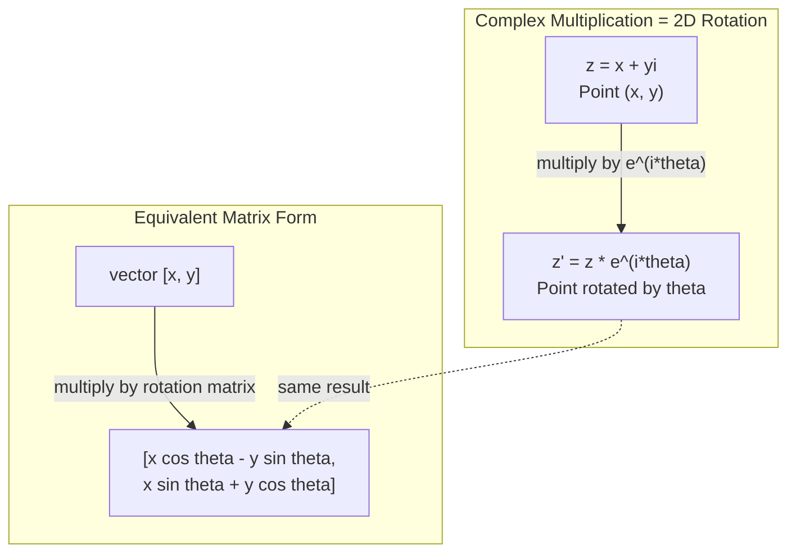
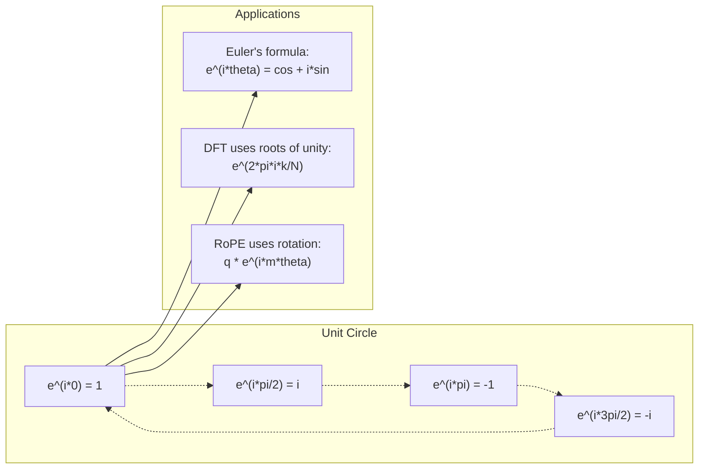

# الأرقام المعقدة لذكاء الذكاء الاصطناعي

> الجذر التربيعي من -1 ليس خيالي. إنه مفتاح التناوبات، والترددات، ونصف معالجة الإشارات.

**Type:** Learn
**Language:**بايثون
**Prerequisites:** Phase 1, Lessons 01-04 (linear algebra, calculus)
**Time:** ~60 minutes

## أهداف التعلم

- أداء الحسابات المعقدة (اضافة، مضاعفة، تقسيم، مضافية) في كل من الشكل المستطيل والقطبي
- تطبيق صيغة أولر لتحويل بين المعارض المعقدة والظروف الثلاثية
- تنفيذ تحويل فوريه المميز باستخدام جذور معقدة من الوحدة
- شرح كيفية الدوران المعقدة التي تتمثل في رمزات المواقع الصناعية في المتحولات

## المشكلة

فتحت ورقة حول تحويلات فوريير وهناك`i`في كل مكان. تنظر إلى ترانسفورمات التشفير الموضعي وترى`sin`و`cos`في ترددات مختلفة -- الأجزاء الحقيقية والخيالية من المكثفات المعقدة.

يبدو الأرقام المعقدة مجردة. يبدو أن نظام الأرقام المبني على الجذر التربيعي من -1 يبدو مثل خدعة رياضية. لكنه ليس خدعة. إنه اللغة الطبيعية للدورات والتذبذب. في كل مرة تدور فيها شيء أو تتأرجح أو تتذبذب، الأرقام المعقدة هي الأداة الصحيحة.

بدون فهم الأرقام المعقدة، لا يمكنك فهم تحويل فوريه المختلف. لا يمكنك فهم FFT. لا يمكنك فهم كيفية عمل RoPE (إدراج الموقف المتحرك) في نماذج اللغة الحديثة. لا يمكنك فهم لماذا تشفيرات الموقف السينوسيدال في ورقة المحول الأصلية تستخدم تردداتها.

هذه الدروس تبني الرياضيات المعقدة من الصفر، وتربطها بالهندسة، وتريك بالضبط أين تظهر الأرقام المعقدة في التعلم الآلي.

## المفهوم

### ما هو الرقم المعقد؟

عدد معقد يحتوي على جزءين: جزء حقيقي و جزء خيالي.

```
z = a + bi

where:
  a is the real part
  b is the imaginary part
  i is the imaginary unit, defined by i^2 = -1
```

هذا هو الأمر. تمد خط الأعداد إلى مستوى. الأرقام الحقيقية تقع على محور واحد. الأرقام الخيالية تقع على الآخر. كل عدد معقد هو نقطة في هذا المستوى.

### الحساب المعقد

**Addition.**أضف الأجزاء الحقيقية معاً، أضف الأجزاء الخيالية معاً.

```
(a + bi) + (c + di) = (a + c) + (b + d)i

Example: (3 + 2i) + (1 + 4i) = 4 + 6i
```

**Multiplication.**استخدم قانون التوزيع وتذكر أن i^2 = -1.

```
(a + bi)(c + di) = ac + adi + bci + bdi^2
                 = ac + adi + bci - bd
                 = (ac - bd) + (ad + bc)i

Example: (3 + 2i)(1 + 4i) = 3 + 12i + 2i + 8i^2
                            = 3 + 14i - 8
                            = -5 + 14i
```

**Conjugate.**أعدّ علامة الجزء الخيالي

```
conjugate of (a + bi) = a - bi
```

إن نسبة عدد معقد ومجموعه هو دائمًا حقيقي:

```
(a + bi)(a - bi) = a^2 + b^2
```

**Division.**مضاعفة العداد والسماسرة بموجب المكونات من السماسرة.

```
(a + bi) / (c + di) = (a + bi)(c - di) / (c^2 + d^2)
```

هذا يزيل الجزء الخيالي من المُعنى، مما يعطي رقمًا معقدًا نظيفًا.

### الطائرة المعقدة

الطائرة المعقدة ترسم كل رقم معقد إلى نقطة ثنائية الأبعاد. المحور الأفقي هو المحور الحقيقي، والمحور الرأسي هو المحور الخيالي.

```
z = 3 + 2i  corresponds to the point (3, 2)
z = -1 + 0i corresponds to the point (-1, 0) on the real axis
z = 0 + 4i  corresponds to the point (0, 4) on the imaginary axis
```

عدد معقد هو في نفس الوقت نقطة و متجه من الأصل. هذا التفسير المزدوج هو ما يجعل الأرقام المعقدة مفيدة للجيومétrie.

### شكل قطبي

يمكن وصف أي نقطة في المسطح عن طريق مسافةها من المنشأ و زاويته من المحور الحقيقي الإيجابي.

```
z = r * (cos(theta) + i*sin(theta))

where:
  r = |z| = sqrt(a^2 + b^2)     (magnitude, or modulus)
  theta = atan2(b, a)             (phase, or argument)
```

الشكل المستقيم (a + bi) جيد للجمع. الشكل القطبي (r، theta) جيد للضرب.

**Multiplication in polar form.**ضرب الكبيرة، أضف الزوايا.

```
z1 = r1 * e^(i*theta1)
z2 = r2 * e^(i*theta2)

z1 * z2 = (r1 * r2) * e^(i*(theta1 + theta2))
```

هذا هو السبب في أن الأرقام المعقدة مثالية للدورات. مضاعفة عدد معقد مع الحجم 1 هو دوران نقي.

### صيغة أولر

الجسر بين المكثفين المعقدين والتغنومترية:

```
e^(i*theta) = cos(theta) + i*sin(theta)
```

هذه هي أهم صيغة في هذه الدروس عندما يكون ثيتا = بي:

```
e^(i*pi) = cos(pi) + i*sin(pi) = -1 + 0i = -1

Therefore: e^(i*pi) + 1 = 0
```

خمسة ثابتات أساسية (e، i، pi، 1, 0) مرتبطة في معادلة واحدة.

### لماذا صيغة أويلر مهمة ل ML

صيغة (أولر) تقول ذلك`e^(i*theta)`تتبع دائرة الوحدة كما يتغير ثيتا. عند ثيتا = 0 ، أنت في (1, 0). عند ثيتا = بي / 2 ، أنت في (0, 1). عند ثيتا = بي ، أنت في (-1, 0). عند ثيتا = 3 * بي / 2 ، أنت في (0, -1).

هذا يعني أن المُعَدّيات المعقدة هي دورانات، والدورات موجودة في كل مكان في معالجة الإشارات و ML.

### اتصال مع الدوران الثنائي الأبعاد

مضاعفة الرقم المعقد (x + yi) ب e^(i*theta) تدور النقطة (x, y) عن طريق زاوية theta حول المنشأ.

```
Rotation via complex multiplication:
  (x + yi) * (cos(theta) + i*sin(theta))
  = (x*cos(theta) - y*sin(theta)) + (x*sin(theta) + y*cos(theta))i

Rotation via matrix multiplication:
  [cos(theta)  -sin(theta)] [x]   [x*cos(theta) - y*sin(theta)]
  [sin(theta)   cos(theta)] [y] = [x*sin(theta) + y*cos(theta)]
```

يُنتجون نتائج متطابقة. المضاعفة المعقدة هي الدوران في 2D. المصفوفة الدورانية هي مجرد مضاعفة معقدة مكتوبة في علامة المصفوفة.



### الفازورات والإشارات المتناوبة

المجموعة المعقدة المضادة e^(i*omega*t) هي نقطة تدور حول دائرة الوحدة عند تردد الزاوية omega. مع زيادة t، تتبع النقطة الدائرة.

الجزء الحقيقي من هذه النقطة الدورية هو cos(omega*t) الجزء الخيالي هو sin(omega*t) إشارة السينوسوديل هو ظل عدد معقد الدوران.

```
e^(i*omega*t) = cos(omega*t) + i*sin(omega*t)

Real part:      cos(omega*t)    -- a cosine wave
Imaginary part: sin(omega*t)    -- a sine wave
```

هذه هي تمثيل الفازور. بدلاً من تتبع موجة سينوسية متذبذبة، تتبع سهمًا يتناوب بسلاسة. تحولات المراحل تصبح تعويضات الزاوية. تغيرات الضمنية تصبح تغيرات الكبيرة. إضافة الإشارات تصبح إضافة متجهة.

### جذور الوحدة

الجذور N- من الوحدة هي N نقاط على مسافة متساوية على دائرة الوحدة:

```
w_k = e^(2*pi*i*k/N)    for k = 0, 1, 2, ..., N-1
```

بالنسبة لـ N = 4، الجذور هي: 1، i، -1، -i (نقاط البوصلة الأربعة).
بالنسبة لـ N = 8 تحصل على نقاط البوصلة الأربعة بالإضافة إلى الأربعة شوارع.

جذور الوحدة هي أساس تحويل فوريه المميز. يقوم DFT بتفكيك الإشارة إلى مكونات عند هذه الترددات N المتساوية المساحة.

### اتصال مع DFT

تحويل فوريه المفصل للإشارة x[0] ، x[1], ..., x[N-1] هو:

```
X[k] = sum_{n=0}^{N-1} x[n] * e^(-2*pi*i*k*n/N)
```

كل X[k] يقيس مدى ارتباط الإشارة مع الجذر k-th من الوحدة -- سينوسيد معقد في تردد k. DFT يكسّر الإشارة إلى N الفازورات المدوّرة ويقول لك حجم ومرحلة كل منها.

### لماذا أنا لست خيالي

كلمة "خيالية" هي حادث تاريخي. استخدمها ديكارتس بشكل مرفوض. ولكن i ليس أكثر خيالا من عددات سلبية كانت عندما رفض الناس لأول مرة. الأرقام السلبية تجيب "ما الذي يمكنك خصم 5 من 3 للحصول؟" الوحدة الخيالية تجيب "ما الذي يمكنك التربيع للحصول على -1؟"

أكثر فائدة: i هو عامل دوران 90 درجة. ضرب عدد حقيقي ب i مرة واحدة، تدور 90 درجة إلى المحور الخيالية. ضرب ب i مرة أخرى (i^2) ، تدور 90 درجة أخرى -- الآن أنت تُشير في الاتجاه الحقيقي السلبي. هذا هو السبب i^2 = -1.

هذا هو السبب في أن الأرقام المعقدة موجودة في كل مكان في الهندسة. أي شيء يتناور -- موجات كهرومغناطيسية، وحالات كمية، تذبذبات الإشارة، تشفير المواقع -- يتم وصفها بطبيعة الحال بأرقام معقدة.

### المعقدة المعروضات مقابل وظائف التغنومترية

قبل صيغة أولر، كتب المهندسون الإشارات بأنها A*cos(omega*t + phi) -- amplitude A، فريدة أوميغا، مرحلة phi. هذا يعمل ولكن يجعل الحساب مؤلمًا. إضافة اثنين من الكوزينات مع مراحل مختلفة تتطلب هويات تثريغونومترية.

مع المكثفات المعقدة، نفس الإشارة هي A * e ^ ((i * * * * omega * t + phi)). إضافة إشارات اثنتين هي مجرد إضافة اثنين من الأرقام المعقدة. ضرب (تجديد) هو مجرد ضرب الكبرى وإضافة الزوايا. تحولات المرحلة تصبح إضافة الزاوية. تحولات التردد تصبح مضاعفة بواسطة الفازورات.

انتقلت مجال معالجة الإشارات بأكمله إلى علامة تعريضية معقدة لأن الرياضيات أكثر نظافة. "الإشارة الحقيقية" هي دائمًا الجزء الحقيقي من التمثيل المعقد. يتم حمل الجزء الخيالي معًا كحاسبة ، مما يجعل جميع الجبر يعمل بشكل طبيعي.

### اتصال مع المحولات

**Sinusoidal positional encodings**(ورقة "تنسفورمير" الأصلية):

```
PE(pos, 2i) = sin(pos / 10000^(2i/d))
PE(pos, 2i+1) = cos(pos / 10000^(2i/d))
```

أزواج الخطيئة والجسم هي الأجزاء الحقيقية والخيالية من المضادات المعقدة في ترددات مختلفة. كل تردد يوفر "قرار" مختلف لموقف التشفير. تتغير ترددات منخفضة ببطء (موقف قاسي). تتغير ترددات عالية بسرعة (موقف جيد). معاً يعطي كل موقف بصمة أصابع تردد فريدة.

**RoPE (Rotary Position Embedding)**يزيد هذا الأمر. يضاعف صراحة المتجهات السائدة والكليدية بواسطة ماتريسيات دوران معقدة. يصبح الموقف النسبي بين رموزين زاوية دوران. يتم حساب الاهتمام باستخدام هذه المتجهات المدوجة ، مما يجعل النموذج حساسًا للموقف النسبي من خلال مضاعفة معقدة.

| Operation | Algebraic Form | Geometric Meaning |
|-----------|---------------|-------------------|
| Addition | (a+c) + (b+d)i | Vector addition in the plane |
| Multiplication | (ac-bd) + (ad+bc)i | Rotate and scale |
| Conjugate | a - bi | Reflect over real axis |
| Magnitude | sqrt(a^2 + b^2) | Distance from origin |
| Phase | atan2(b, a) | Angle from positive real axis |
| Division | multiply by conjugate | Reverse rotation and rescale |
| Power | r^n * e^(i*n*theta) | Rotate n times, scale by r^n |



```figure
roots-of-unity
```

## بناءها

### الخطوة الأولى: فئة معقدة

بناء فئة أرقام معقدة تدعم الحساب والحجم والمرحلة والتحويل بين الأشكال المستقيمة والقطبي.

```python
import math

class Complex:
    def __init__(self, real, imag=0.0):
        self.real = real
        self.imag = imag

    def __add__(self, other):
        return Complex(self.real + other.real, self.imag + other.imag)

    def __mul__(self, other):
        r = self.real * other.real - self.imag * other.imag
        i = self.real * other.imag + self.imag * other.real
        return Complex(r, i)

    def __truediv__(self, other):
        denom = other.real ** 2 + other.imag ** 2
        r = (self.real * other.real + self.imag * other.imag) / denom
        i = (self.imag * other.real - self.real * other.imag) / denom
        return Complex(r, i)

    def magnitude(self):
        return math.sqrt(self.real ** 2 + self.imag ** 2)

    def phase(self):
        return math.atan2(self.imag, self.real)

    def conjugate(self):
        return Complex(self.real, -self.imag)
```

### الخطوة الثانية: التحويل القطبي وصيغة أولر

```python
def to_polar(z):
    return z.magnitude(), z.phase()

def from_polar(r, theta):
    return Complex(r * math.cos(theta), r * math.sin(theta))

def euler(theta):
    return Complex(math.cos(theta), math.sin(theta))
```

التحقق من: `euler(theta).magnitude()`يجب أن يكون دائما 1.0. `euler(0)`يجب أن يعطي (1, 0). `euler(pi)`يجب أن يعطي (-1, 0).

### الخطوة الثالثة: التناوب

تدورة نقطة (x, y) من زاوية theta هو مضاعفة معقدة واحدة:

```python
point = Complex(3, 4)
rotated = point * euler(math.pi / 4)
```

الحجم يبقى نفسه فقط الزاوية تتغير

### الخطوة الرابعة: DFT من الرياضيات المعقدة

```python
def dft(signal):
    N = len(signal)
    result = []
    for k in range(N):
        total = Complex(0, 0)
        for n in range(N):
            angle = -2 * math.pi * k * n / N
            total = total + Complex(signal[n], 0) * euler(angle)
        result.append(total)
    return result
```

هذا هو O(N^2) DFT. كل خروج X[k] هو جمع عينات الإشارة مضاعفة بجذور الوحدة.

### الخطوة 5: DFT العكسية

يقوم DFT العكسي بإعادة تشكيل الإشارة الأصلية من طيفها. التغييرات الوحيدة من DFT الأمامية: قم بتعديل الإشارة في المُعبر وتقسمها ب N.

```python
def idft(spectrum):
    N = len(spectrum)
    result = []
    for n in range(N):
        total = Complex(0, 0)
        for k in range(N):
            angle = 2 * math.pi * k * n / N
            total = total + spectrum[k] * euler(angle)
        result.append(Complex(total.real / N, total.imag / N))
    return result
```

هذا يعطيك إعادة بناء مثالية. تطبيق DFT، ثم IDFT، وتحصل على إشارة الأصلية إلى دقة الآلة. لا يوجد معلومات ضائعة.

### الخطوة السادسة: جذور الوحدة

```python
def roots_of_unity(N):
    return [euler(2 * math.pi * k / N) for k in range(N)]
```

التحقق من اثنين من الخصائص:
- كل جذور لها حجم بالضبط 1.
- مجموع جميع الجذور N هو صفر (إنها تُلغي بالتناظر).

هذه الخصائص هي ما يجعل DFT قابلة للتحويل. جذور الوحدة تشكل أساساً متقاطعًا للمجال المتردد.

## استخدمها

بايثون لديه دعم متكامل للأرقام المعقدة.`j`يمثل الوحدة الخيالية

```python
z = 3 + 2j
w = 1 + 4j

print(z + w)
print(z * w)
print(abs(z))

import cmath
print(cmath.phase(z))
print(cmath.exp(1j * cmath.pi))
```

بالنسبة للمصفوفات، يتعامل numpy بالأرقام المعقدة بشكل طبيعي:

```python
import numpy as np

z = np.array([1+2j, 3+4j, 5+6j])
print(np.abs(z))
print(np.angle(z))
print(np.conj(z))
print(np.real(z))
print(np.imag(z))

signal = np.sin(2 * np.pi * 5 * np.linspace(0, 1, 128))
spectrum = np.fft.fft(signal)
freqs = np.fft.fftfreq(128, d=1/128)
```

## أرسله

أركض`code/complex_numbers.py`لإنتاج`outputs/skill-complex-arithmetic.md`. . .

## التمارين

1. **Complex arithmetic by hand.**احسب (2 + 3i) * (4 - i) والتحقق من خلال الرمز. ثم احسب (5 + 2i) / (1 - 3i). رسم كلا النتائج على المستوى المعقد وتحقق من أن الضربة تدور وتحقيق النطاق الأول.

2. **Rotation sequence.**ابدأ من النقطة (1, 0). مضاعفة ب e^(i*pi/6) اثني عشر مرة. تحقق من أنك تعود إلى (1, 0) بعد 12 مضاعفة. طبع الإحداثيات في كل خطوة وتأكد أنها تتبع 12 غون عادية.

3. **DFT of a known signal.**قم بإنشاء إشارة هي مجموع من الخطأ ((2 * بيكس * 3 * ت) و 0.5 * بيكس * 2 * بيكس * 7 * ت) المسائل في 32 نقطة. قم بتشغيل DFT الخاص بك. تحقق من أن الطيف الكبير له ذروات في ترددات 3 و 7, مع ذروة في 7 تكون نصف ارتفاع الذروة في 3.

4. **Roots of unity visualization.**احسب الجذر الثامن من الوحدة. تحقق من أن الجملة إلى الصفر. تحقق من أن مضاعفة أي جذور بالجذر البدائي e^(2 * pi * i / 8) يعطي الجذر التالي.

5. **Rotation matrix equivalence.**لـ 10 زوايا عشوائية و 10 نقاط عشوائية، تحقق من أن مضاعفة معقدة تعطى نفس النتيجة مثل مضاعفة المصفوفة المتجهة مع المصفوفة الدورانية 2x2. طبع أقصى فرق عددي.

## الشروط الرئيسية

| Term | What it means |
|------|---------------|
| Complex number | A number a + bi where a is the real part, b is the imaginary part, and i^2 = -1 |
| Imaginary unit | The number i, defined by i^2 = -1. Not imaginary in the philosophical sense -- it is a rotation operator |
| Complex plane | The 2D plane where the x-axis is real and the y-axis is imaginary. Also called the Argand plane |
| Magnitude (modulus) | The distance from the origin: sqrt(a^2 + b^2). Written as \|z\| |
| Phase (argument) | The angle from the positive real axis: atan2(b, a). Written as arg(z) |
| Conjugate | The mirror image across the real axis: conjugate of a + bi is a - bi |
| Polar form | Expressing z as r * e^(i*theta) instead of a + bi. Makes multiplication easy |
| Euler's formula | e^(i*theta) = cos(theta) + i*sin(theta). Connects exponentials to trigonometry |
| Phasor | A rotating complex number e^(i*omega*t) representing a sinusoidal signal |
| Roots of unity | The N complex numbers e^(2*pi*i*k/N) for k = 0 to N-1. N equally spaced points on the unit circle |
| DFT | Discrete Fourier Transform. Decomposes a signal into complex sinusoidal components using roots of unity |
| RoPE | Rotary Position Embedding. Uses complex multiplication to encode relative position in transformer attention |

## المزيد من القراءة

- [Visual Introduction to Euler's Formula](https://betterexplained.com/articles/intuitive-understanding-of-eulers-formula/)- يُبني الحس البدني الهندسي دون علامات ثقيلة
- [Su et al.: RoFormer (2021)](https://arxiv.org/abs/2104.09864)- الورقة التي تعرضت إدخال الموقف الدواري باستخدام الدوران المعقد
- [Vaswani et al.: Attention Is All You Need (2017)](https://arxiv.org/abs/1706.03762)- ورقة "ترانسفارمر" الأصلية مع تشفيرات موقفية سينوسيدالية
- [3Blue1Brown: Euler's formula with introductory group theory](https://www.youtube.com/watch?v=mvmuCPvRoWQ)- تفسير بصري لسبب e^(i*pi) = -1
- [Needham: Visual Complex Analysis](https://global.oup.com/academic/product/visual-complex-analysis-9780198534464)- أفضل معالجة بصرية للأرقام المعقدة، مليئة بالبصيرة الهندسية
- [Strang: Introduction to Linear Algebra, Ch. 10](https://math.mit.edu/~gs/linearalgebra/)- الأرقام المعقدة في سياق الجبر الخطوي والقيم الخاصة
