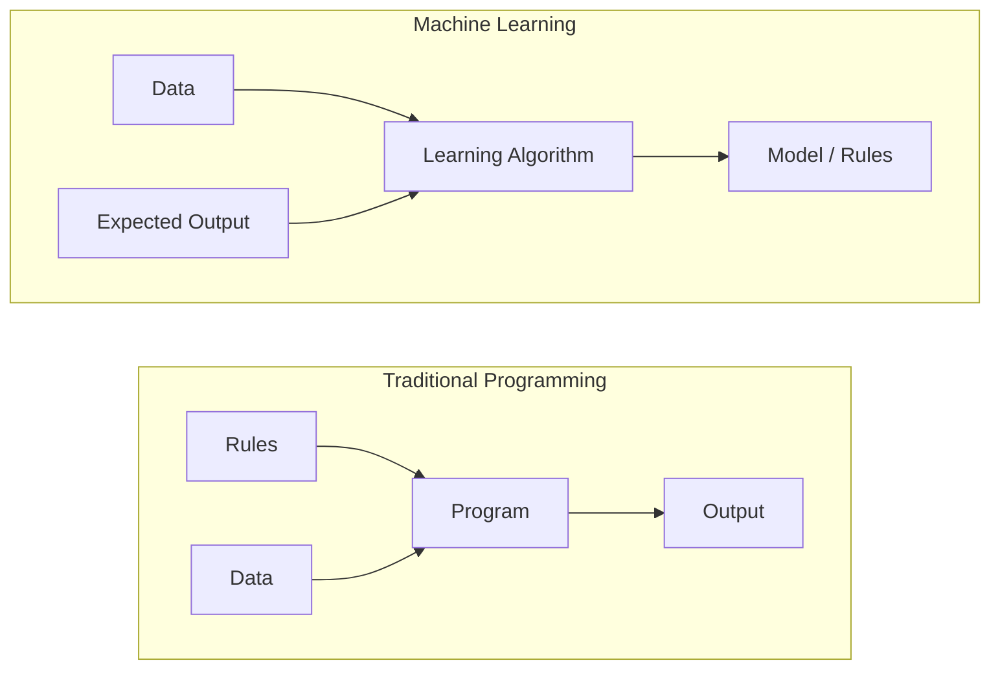
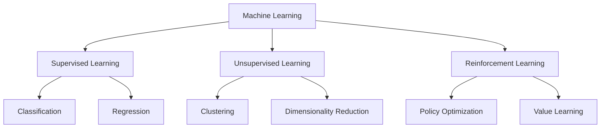
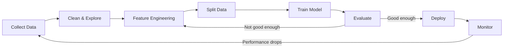
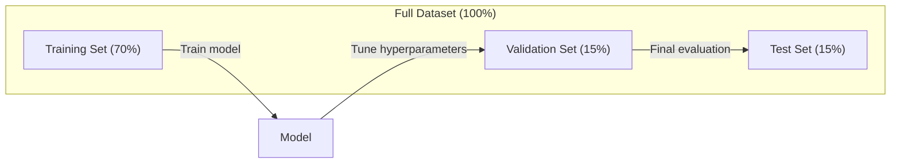
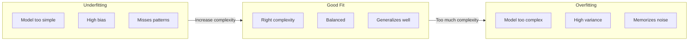
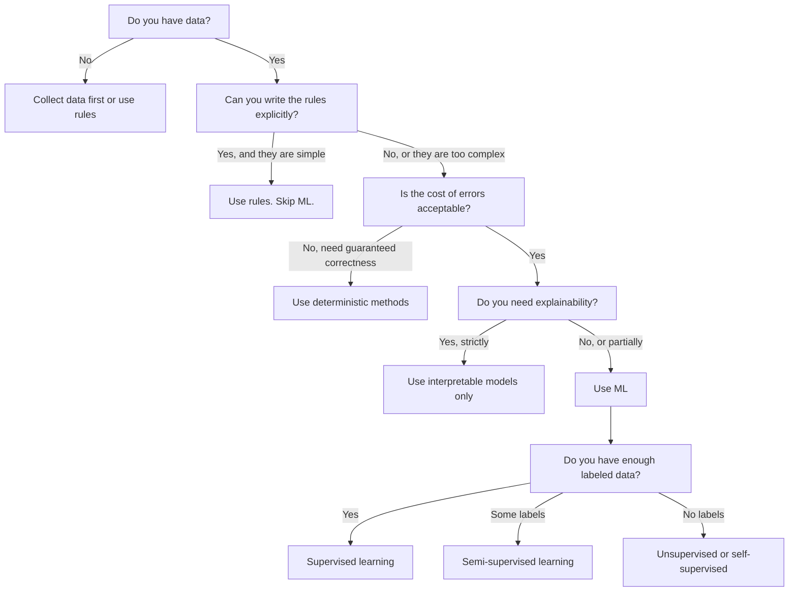

# ما هو التعلم الآلي

> تعلم الآلة هو تعليم الكمبيوتر للعثور على أنماط في البيانات بدلا من كتابة القواعد يدويا.

**Type:** Learn
**Languages:** Python
**Prerequisites:** Phase 1 (Math Foundations)
**Time:** ~45 minutes

## أهداف التعلم

- شرح الفرق بين التعلم المراقب والغير المراقب والتعلم المُعزز وتحديد النوع الذي ينطبق على مشكلة معينة
- تنفيذ أقرب تصنيف مركزي من الصفر وتقييمها ضد خط أساسي عشوائي
- تمييز بين مهام التصنيف والعودة واختيار وظيفة الخسارة المناسبة لكل منها
- تقييم ما إذا كانت مشكلة تجارية معينة مناسبة لمعالجة المعلومات أو تحل بشكل أفضل باستخدام قواعد تحديدية

## المشكلة

تريد بناء مرشح للشحوم. النهج التقليدي: الجلوس و كتابة مئات القواعد. "إذا كان البريد الإلكتروني يحتوي على "مال مجاني"، ضع علامة على أنها شحوم. إذا كان لديها أكثر من 3 علامات صرخة، ضع علامة على أنها شحوم. " أنت تقضي أسابيع في كتابة القواعد. ثم يقوم المتسللون بتغيير صياغته. قواعدك تنتهك. أنت تكتب المزيد من القواعد. الدورة لا تنتهي أبدا.

تعلم الآلة يغير هذا. بدلاً من كتابة القواعد، تعطى الكمبيوتر الآلاف من الرسائل الإلكترونية المسموحة ("رغوة" أو "ليس رغوة") وتدعها تفكر في القواعد بنفسه. الكمبيوتر يجد أنماط لم تكن قد فكرت بها. عندما يغير الرغوة التكتيكات، تقوم بتدريب جديد على البيانات بدلاً من إعادة كتابة الرمز.

هذا التحول من "قواعد البرمجة" إلى "التعلم من البيانات" هو جوهر التعلم الآلي. كل محرك توصيات، ومساعد صوتي، وسيارة ذاتية القيادة، ونموذج اللغة يعمل بهذه الطريقة.

## المفهوم

### التعلم من البيانات وليس من القواعد

البرمجة التقليدية والتعلم الآلي يحل المشاكل في اتجاهات معارضة.



البرمجة التقليدية: أنت تكتب القواعد. البرنامج يطبقها على البيانات لإنتاج الخروج.

تعلم الآلة: توفر البيانات والمخرجات المتوقعة. ال خوارزمية تكتشف القواعد.

"النموذج" الذي يأتي من التدريب هو القواعد، ويشكّل بأرقام (وزن، ملامح). فإنه يُعمّل من الأمثلة التي رأىها لتحقيق التنبؤات على البيانات التي لم يسبق له أن رأى.

### الأنواع الثلاثة من التعلم الآلي



**Supervised Learning**: لديك زوجات المدخلات والمخرجات. يتعلم النموذج رسم الخواص إلى الخواص.
- "هنا 10 آلاف صورة تحمل علامة القط أو الكلب، تعلم كيف تفصل بينها".
- "هنا ميزات المنزل وأسعارها، تعلم التنبؤ بالأسعار".

**Unsupervised Learning**لديك مدخلات فقط لا تسميات النموذج يجد هيكلًا بنفسه
- "هنا 10 آلاف تاريخ مشتريات العملاء، إبحث عن مجموعات طبيعية"
- "هنا 1000 نقطة بيانات بعدية، خفض إلى 2 أبعاد مع الحفاظ على الهيكل".

**Reinforcement Learning**: يقوم العميل بعمل في بيئة ويتلقى مكافآت أو عقوبات. يتعلم استراتيجية (سياسة) لتعظيم الكمية الكاملة من المكافأة.
- "لعب هذه اللعبة، +1 للفوز، -1 للفقدان، اكتشف استراتيجية".
- "تحكم في ذراع الروبوت هذا +1 لالتقاط الكائن، -0.01 لكل ثانية مضيعة".

معظم ما ستبني في الممارسة يستخدم التعلم المشرف عليه. التعلم غير المشرف عليه شائع للتعليم المسبق والاستكشاف. تعزيز التعلم قوى AI اللعبة، الروبوتات، و RLHF لنماذج اللغة.

### ما وراء الثلاثة الكبرى

الفئات الثلاث أعلاه نظيفة، ولكن العالم الحقيقي ML غالبا ما يغمض الخطوط.

**Semi-supervised learning**يستخدم مجموعة صغيرة من البيانات المعلقة ومجموعة كبيرة من البيانات غير المعلقة. قد يكون لديك 100 صورة طبية معلقة و100000 صورة غير معلقة.

- **Label propagation:**قم ببناء رسم بياني يربط نقاط البيانات المماثلة. تمتد العلامات من العقد المسموحة إلى الجيران غير المسموحين من خلال الرسم البياني.
- **Pseudo-labeling:**تدريب نموذج على البيانات المعلقة، استخدمه للتنبؤ باللوائح للبيانات غير المعلقة، ثم إعادة تدريب على كل شيء.
- **Consistency regularization:**يجب أن يعطي النموذج نفس التنبؤ للمدخول ونسخة متضايقة قليلاً من تلك المدخلات. هذا يعمل حتى دون علامات.

**Self-supervised learning**يخلق الإشراف من البيانات نفسها. لا حاجة إلى علامات بشرية على الإطلاق. النموذج يخلق مهمة التنبؤ الخاصة به من بنية البيانات.

- **Masked language modeling (BERT):**إخفاء 15٪ من الكلمات في الجملة، تدريب النموذج على التنبؤ بالكلمات المفقودة. "التسميات" تأتي من النص الأصلي.
- **Contrastive learning (SimCLR):**خذ صورة، وإنشأ نسختين متزايدة، ومرح النموذج بتعرفها على أنها جاءت من نفس الصورة بينما تميزها عن نسخة متزايدة من الصور الأخرى.
- **Next-token prediction (GPT):**توقع الكلمة التالية مع كل الكلمات السابقة. كل وثيقة نصية تصبح مثال تدريب.

هذه ليست فئات منفصلة عن الثلاثة الكبرى. إنها استراتيجيات تجمع بين الأفكار المراقبة وغير المراقبة. يتم إشراف التعلم الذاتي تقنياً (النموذج يتوقع شيئاً) ، ولكن يتم إنشاء اللقبات تلقائيًا ، وليس من قبل البشر.

### التصنيف مقابل الرجوع

هذه هي المهام الرئيسية الثانية للتعلم المشرف عليه.

| Aspect | Classification | Regression |
|--------|---------------|------------|
| Output | Discrete categories | Continuous numbers |
| Example | "Is this email spam?" | "What will the house price be?" |
| Output space | {cat, dog, bird} | Any real number |
| Loss function | Cross-entropy, accuracy | Mean squared error, MAE |
| Decision | Boundaries between classes | A curve that fits the data |

الجوابات المرتبطة بالصنف هي: "أي فئة؟" والرجوع يرد: "كم؟"

بعض المشاكل يمكن أن تكون في إطار أي من الطرق. التنبؤ إذا كان السهم يرتفع أو ينخفض هو التصنيف. التنبؤ بسعر دقيق هو التراجع.

### سير عمل ML

كل مشروع للتعلم الآلي يتبع نفس الخط الأنابيب، بغض النظر عن الخوارزمية.



**Collect Data**جمع البيانات الخامة، فأكثر البيانات أفضل دائماً تقريباً، لكن الجودة هي أكثر أهمية من الكمية.

**Clean & Explore**: التعامل مع القيم المفقودة، وإزالة المكررات، وتصور التوزيعات، وتحديد الانحرافات. هذه الخطوة غالبا ما تستغرق 60-80% من إجمالي وقت المشروع.

**Feature Engineering**تحويل البيانات الخام إلى ميزات يمكن أن تستخدمها النموذج. تحويل التواريخ إلى أيام الأسبوع. تطبيع العمود العددي. تشفير المتغيرات الفئوية. الميزات الجيدة مهمة أكثر من الخوارزميات المهنية.

**Split Data**: تقسيمها إلى مجموعات تدريبية وتصديق وتختبارات. يقوم النموذج بتدريب على بيانات التدريب، ويقوم بتحديد المعايير المفرطة على بيانات التحقق، ويقوم تقرير الأداء النهائي على بيانات التجارب.

**Train Model**: إرسال بيانات التدريب إلى خوارزمية. يقوم خوارزمية بتعديل المعلمات الداخلية لتقليل وظيفة الخسارة.

**Evaluate**: قياس الأداء على بيانات التحقق من التحقق من التحقق من التحقق من التحقق من التحقق من التحقق من التحقق من التحقق من التحقق من التحقق من التحقق من التحقق من التحقق من التحقق من التحقق من التحقق من التحقق من التحقق من التحقق من التحقق من التحقق من التحقق من التحقق من التحقق من التحقق من التحقق من التحقق من التحقق من التحقق من التحقق من التحقق من التحقق من التحقق من التحقق من التحقق من التحقق من التحقق من التحقق من التحقق من التحقق من التحقق من التحقق من التحقق من التحقق من التحقق من التحقق من التحقق من التحقق من التحقق من التحقق من التحقق من التحقق من التحقق من التحقق من التحققق من التحققق من التحققق من التحققق من التحقققق من التحقققق من التحقققق من التحقققق من التحقققق من التحقققق.

**Deploy**: وضع النموذج في الإنتاج حيث يقوم بتنبؤات على بيانات جديدة.

**Monitor**: تتبع الأداء مع مرور الوقت. تغير توزيع البيانات (تحرك البيانات) ، وتدهور النماذج. عندما تنخفض الأداء، إعادة التدريب.

### التدريب والتحقق من الوصول إلى الاختبار

هذا هو المفهوم الأهم الذي يخطئ به المبتدئين. يجب عليك تقييم نموذجك على بيانات لم يرها أثناء التدريب. وإلا كنت تقيس التذاكر، وليس التعلم.



| Split | Purpose | When used | Typical size |
|-------|---------|-----------|-------------|
| Training | Model learns from this data | During training | 60-80% |
| Validation | Tune hyperparameters, compare models | After each training run | 10-20% |
| Test | Final unbiased performance estimate | Once, at the very end | 10-20% |

مجموعة الاختبارات مقدسة. تنظر إليها مرة واحدة بالضبط. إذا كنت تستمر في تعديل نموذجك بناء على أداء الاختبار، كنت تدرب على نحو فعال على مجموعة الاختبارات وأرقامك المبلغ عنها لا معنى لها.

بالنسبة لمجموعات بيانات صغيرة، استخدم التحقق من التحقق من التحقق من التحقق من التحقق من التحقق من التحقق من التحقق من التحقق من التحقق من التحقق من التحقق من التحقق من التحقق من التحقق من التحقق من التحقق من التحقق من التحقق من التحقق من التحقق من التحقق من التحقق من التحقق من التحقق من التحقق من التحقق من التحقق من التحقق من التحقق من التحقق من التحقق من التحقق من التحقق من التحقق من التحقق من التحقق من التحقق من التحقق من التحقق من التحقق من التحقق من التحقق من التحقق من التحقق من التحقق من التحقق من التحقق من التحقق من التحقق من التحقق من التحقق من التحقق من التحقق من التحقق من التحقق من التحقق من التحقق من التحقق من التحقق من التحقق.

### التكيف المفرط مقابل التكيف السهل



**Underfitting**: النموذج بسيط جداً لا يمكن التقاط الأنماط في البيانات. خط مستقيم يحاول أن يتناسب مع علاقة منحنية. خطأ تدريب كبير. خطأ اختبار كبير.

**Overfitting**: النموذج معقد جداً ويتذكر بيانات التدريب، بما في ذلك ضجيجها. منحنى متحرك يمر عبر كل نقطة تدريب ولكن يفشل في البيانات الجديدة. خطأ التدريب منخفض. خطأ الاختبار مرتفع.

**Good fit**: يتم تصوير النموذج أنماط حقيقية دون حفظ الضوضاء. خطأ التدريب وخطأ الاختبار منخفضة نسبيا.

علامات الإصلاح الزائد:
- دقة التدريب أعلى بكثير من دقة التحقق
- النموذج يعمل بشكل جيد على بيانات التدريب ولكن بشكل سيء على بيانات جديدة
- إضافة المزيد من بيانات التدريب تحسن الأداء (النموذج كان يتذكر وليس يتعلم)

أجهزة إصلاحية:
- الحصول على المزيد من البيانات التدريبية
- تقليل تعقيد النموذج (أقل معايير، بنية أبسط)
- التنظيم (إضافة عقوبة على الأوزان الكبيرة)
- الإقلاع عن العمل (تخفيض العصبية بشكل عشوائي أثناء التدريب)
- التوقف المبكر (توقف التدريب عندما يبدأ خطأ التحقق من التحقق من التحقق من التحقق من التحقق من التحقق من التحقق من التحقق من التحقق من التحقق من التحقق من التحقق من التحقق من التحقق من التحقق من التحقق من التحقق من التحقق من التحقق من التحقق من التحقق من التحقق من التحقق من التحقق من التحقق من التحقق من التحقق من التحقق من التحقق من التحقق من التحقق من التحقق من التحقق من التحقق من التحقق من التحقق من التحقق من التحقق من التحقق من التحقق من التحقق من التحقق من التحقق من التحقق من التحقق من التحقق من التحقق من التحقق من التحقق من التحقق من التحقق من التحقق من التحقق من التحقق من التحقق من التحقق من التحقق من التحقق من التحقق من التحقق من التحقق من التحقق من التحقق من التحقق من التحقق من التحقق من التحقق من التحقق من التحقق من التحقق من التحقق من التحقق من التحقق من التحقق من التحقق من التحقق من التحقق من التحقق من التحقق من التحقق من التحقق من التحقق من التحقق من التحقق من التحقق من التحقق من التحقق من التحقق من التحقق من التحقق من التحقق من التحقق من التحقق من التحقق من التحقق من التحقق من التحقق من التحق.

أجهزة للاستعداد:
- استخدم نموذج أكثر تعقيداً
- إضافة مزيد من الميزات
- تقليل التنظيم
- القطار أطول

### التجارة بين التنوعات المتحيزة

هذا هو الإطار الرياضي وراء الإفراط في التكيف والإفراط في التكيف.

**Bias**: خطأ من افتراضات خاطئة في النموذج. نموذج خطي لديه تحيز كبير عندما تكون العلاقة الحقيقية غير خطية. التحيز العالي يؤدي إلى عدم الالتزام.

**Variance**: خطأ من الحساسية إلى التقلبات الصغيرة في بيانات التدريب. نموذج ذو اختلاف كبير يعطي توقعات مختلفة جدا عند تدريب على مجموعات فرعية مختلفة من البيانات. يؤدي التباين العالي إلى الإفراط في التكيف.

| Model complexity | Bias | Variance | Result |
|-----------------|------|----------|--------|
| Too low (linear model for curved data) | High | Low | Underfitting |
| Just right | Medium | Medium | Good generalization |
| Too high (degree-20 polynomial for 10 points) | Low | High | Overfitting |

الخطأ الكلي = التحيز^2 + التباين + الضجيج غير القابل للتقليل

لا يمكنك تقليل الضجيج غير القابل للحد من الضجيج (إنه عشوائية في البيانات نفسها). تريد العثور على نقطة حلوة حيث يتم تقليل التباين^2 + التباين.

### لا يوجد نظرية الغداء المجانية

لا يوجد خوارزمية واحدة تعمل بشكل أفضل لكل مشكلة. خوارزمية تعمل بشكل جيد على فئة واحدة من المشاكل سوف تؤدي بشكل سيء على أخرى. هذا هو السبب في أن علماء البيانات يحاولون خوارزميات متعددة ومقارنة النتائج.

في الممارسة العملية، يعتمد الاختيار على:
- كم عدد البيانات التي لديك
- كم عدد الميزات
- سواء كانت العلاقة خطية أو غير خطية
- إذا كنت بحاجة إلى تفسير
- كم من الحوسبة يمكنك تحمل

### متى لا تستخدم تعلم الآلة

إنّه أداة قوية، لكنّها ليست دائماً الأداة المناسبة. قبل أن تصل إلى نموذج، اسأل نفسك إن كنتِ في حاجة إليه فعلاً.

**Do not use ML when:**

- **Rules are simple and well-defined.**حسابات الضرائب، خوارزميات التصنيف، تحويلات الوحدات، إذا كنت تستطيع كتابة المنطق في بضعة بيانات إن، نموذج يضيف التعقيد دون فائدة.
- **You have no data or very little data.**المعلمين يحتاجون إلى أمثلة للتعلم من خلالها، مع 10 نقاط بيانات، لا يمكنك تدريب أي شيء ذي معنى. جمع البيانات أولاً.
- **The cost of being wrong is catastrophic and you need guaranteed correctness.**حساب الجرعة الطبية، التحكم في مفاعل نووي، التحقق المشفر. نماذج ML احتمالية. فإنها سوف تكون خاطئة في بعض الأحيان. إذا كان "أحيانا خاطئة" غير مقبولة، استخدم أساليب تحديد.
- **A lookup table or heuristic solves the problem.**إذا كان العد الأدنى أو الجدول البسيط يغطي 99٪ من الحالات، فإن إضافة ML يزيد من تكلفة الصيانة دون تحسين كبير.
- **You cannot explain the decision and explainability is required.**تتطلب الصناعات المنظمة (الاقتراض، التأمين، العدالة الجنائية) أحياناً أن تكون كل قرار قابل للتفسير بالكامل. بعض نماذج ML يمكن تفسيرها (التراجع السري، أشجار القرار الصغيرة). معظمها لا يمكن تفسيرها.
- **The problem changes faster than you can retrain.**إذا كانت القواعد تتغير كل يوم وتستغرق إعادة التدريب أسبوعاً، فإن النموذج دائمًا قديم.

استخدم هذا الرسم البياني للقرار:



```figure
f3-learning-boundary
```

## بناءها

الرمز في`code/ml_intro.py`يطبق أقرب تصنيف مركزي من الصفر، أبسط خوارزمية ML ممكنة. يظهر الفكرة الأساسية: تعلم من البيانات، ثم التنبؤ على البيانات الجديدة.

### الخطوة الأولى: أقرب مركزية من الصفر

يقوم أقرب مصنف مركزي بحساب مركز (متوسط) كل فئة في بيانات التدريب. للتنبؤ ، يعين كل نقطة جديدة إلى الفئة التي يكون مركزها أقرب.

```python
class NearestCentroid:
    def fit(self, X, y):
        self.classes = np.unique(y)
        self.centroids = np.array([
            X[y == c].mean(axis=0) for c in self.classes
        ])

    def predict(self, X):
        distances = np.array([
            np.sqrt(((X - c) ** 2).sum(axis=1))
            for c in self.centroids
        ])
        return self.classes[distances.argmin(axis=0)]
```

هذا هو الخوارزمية بأكملها. فيت يحسب وسائل اثنين. التنبؤ يحسب المسافات. لا تراجع تراجع، لا تكرار، لا حواجز فائقة.

### الخطوة الثانية: تدريب على البيانات الاصطناعية

نحن نخلق مجموعة بيانات تصنيف 2D مع فئتين تتداخل قليلا. مصنف المركزية رسم حدود القرار الخطية بين مراكز الفئة.

```python
rng = np.random.RandomState(42)
X_class0 = rng.randn(100, 2) + np.array([1.0, 1.0])
X_class1 = rng.randn(100, 2) + np.array([-1.0, -1.0])
X = np.vstack([X_class0, X_class1])
y = np.array([0] * 100 + [1] * 100)
```

### الخطوة الثالثة: مقارنة مع الخطوط الأساسية

يجب مقارنة كل نموذج ML مع خط أساسي بسيط. هنا، يتوقع خط أساسي فئة عشوائية. إذا لم يتغلب نموذج ML الخاص بك على التخمين عشوائي، فشيئا خاطئ.

```python
baseline_preds = rng.choice([0, 1], size=len(y_test))
baseline_acc = np.mean(baseline_preds == y_test)
```

يجب أن يكون مصنف المركزية أكثر من 90٪ دقة على مجموعة البيانات النظيفة.

### لماذا هذا مهم

أقرب تصنيف مركزي بسيط بشكل بسيط. ليس لديه أي مفاصيل فائقة، ولا تكرار، ولا نزول تراجع. ومع ذلك فإنه يلتقط نمط ML الأساسي:

1. **Learn**تمثيل من بيانات التدريب (المركز المركزي)
2. **Predict**على البيانات الجديدة باستخدام هذه التمثيل (أقرب مسافة)
3. **Evaluate**مقابل خط أساسي (التخمين العشوائي)

كل خوارزمية ML، من الرجوع اللوجستي إلى المحولات، تتبع نفس النمط ثلاثي الخطوات. يصبح التمثيل أكثر تعقيدًا، ولكن سير العمل يبقى نفسه.

### الخطوة الرابعة: ما لا يمكن أن يفعله مركز المجموعات

يفترض أقرب مصنف مركزي أن كل فئة تشكل بقعة واحدة. يرسم حدود القرار الخطية. يفشل عندما:

- الفئات لديها مجموعة متعددة (على سبيل المثال، يمكن كتابة رقم "1" بطرق مختلفة)
- الحدود القرارية غير خطية (على سبيل المثال ، تغلف فئة واحدة حول أخرى)
- الميزات لها مقياس مختلف جدا (تهيمن المسافة على ميزة أكبر مقياس)

هذه القيود تحفز كل خوارزمية أخرى سوف تتعلم. قريب K يدير العديد من المجموعات. شجرة القرار تتعامل مع الحدود غير الخطية. تحل مقياس الميزات مشكلة النطاق. كل درس يبني على قيود السابقة.

## استخدمها

يقدم sklearn `NearestCentroid`ومدفّعات البيانات الاصطناعية:

```python
from sklearn.neighbors import NearestCentroid
from sklearn.datasets import make_classification
from sklearn.model_selection import train_test_split

X, y = make_classification(
    n_samples=500, n_features=2, n_redundant=0,
    n_clusters_per_class=1, random_state=42
)
X_train, X_test, y_train, y_test = train_test_split(X, y, test_size=0.3)

clf = NearestCentroid()
clf.fit(X_train, y_train)
print(f"Accuracy: {clf.score(X_test, y_test):.3f}")
```

## أرسله

هذا الدرس يُنتج`outputs/prompt-ml-problem-framer.md`-- إرسال استشارة تحويل مشاكل الأعمال الغامضة إلى مهام تحديد المعلومات أعطيه وصف للمشكلة ("نريد تقليل التزايد" أو "تنبؤ بالطلب للربع القادم") ويحدد نوع التعلم ويحدد هدف التنبؤ ويعد ميزات المرشحين ويحدد مقياس النجاح ويحدد خطة أساسية ويعرض على مشاكل مثل تسرب البيانات أو عدم توازن الفئة. استخدمها في بداية أي مشروع من مشروع ML لتجنب بناء الشيء الخطأ.

## الشروط الرئيسية

| Term | What people say | What it actually means |
|------|----------------|----------------------|
| Model | "The AI" | A mathematical function with learnable parameters that maps inputs to outputs |
| Training | "Teaching the AI" | Running an optimization algorithm to adjust model parameters so predictions match known outputs |
| Feature | "An input column" | A measurable property of the data that the model uses to make predictions |
| Label | "The answer" | The known output for a training example, used to compute the error signal |
| Hyperparameter | "A setting you tweak" | A parameter set before training that controls the learning process (learning rate, number of layers) |
| Loss function | "How wrong the model is" | A function that measures the gap between predicted and actual outputs, which training tries to minimize |
| Overfitting | "It memorized the test" | The model learned training-specific noise instead of general patterns, so it fails on new data |
| Underfitting | "It didn't learn anything" | The model is too simple to capture the real patterns in the data |
| Generalization | "It works on new data" | The model's ability to make accurate predictions on data it was not trained on |
| Cross-validation | "Testing on different chunks" | Repeatedly splitting data into train/test folds and averaging results, giving a more robust performance estimate |
| Regularization | "Keeping weights small" | Adding a penalty term to the loss function that discourages overly complex models |
| Data drift | "The world changed" | The statistical distribution of incoming data shifts over time, degrading model performance |

## التمارين

1. خذ أي مجموعة بيانات (مثل Iris، Titanic) وقسمها 70/15/15 إلى قطار/تأكييد/اختبار. شرح لماذا لا يجب ضبط المعايير العالية على مجموعة الاختبار.
2. أذكر ثلاثة مشاكل حقيقية. لكل منها، حدد ما إذا كانت تصنيف، تراجع، أو تجمع، وما إذا كانت تحت الإشراف أو بدون إشراف.
3. النموذج يحصل على دقة 99٪ على بيانات التدريب ولكن 60٪ على بيانات الاختبار. تشخيص المشكلة وإدراج ثلاثة أشياء كنت تحاول إصلاحها.

## المزيد من القراءة

- [An Introduction to Statistical Learning](https://www.statlearning.com/)- كتاب دراسي مجاني يضم جميع أساليب ML الكلاسيكية مع أمثلة عملية
- [Google's Machine Learning Crash Course](https://developers.google.com/machine-learning/crash-course)- مقدمة بصرية مخففة لمفاهيم ML
- [Scikit-learn User Guide](https://scikit-learn.org/stable/user_guide.html)- المرجح العملي لتنفيذ ML في Python
