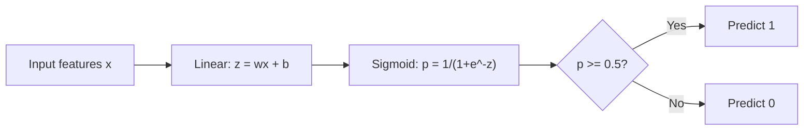
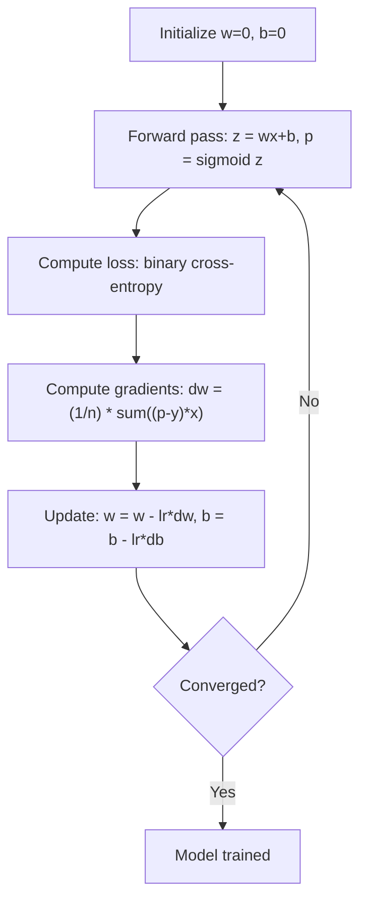

# التراجع اللوجستي

> التراجع اللوجستي يلتوي خط مستقيم إلى منحنى S للإجابة على الأسئلة نعم أو لا مع احتمالات.

**Type:** Build
**Languages:** Python
**Prerequisites:** Phase 2 Lesson 1-2 (What Is ML, Linear Regression)
**Time:** ~90 minutes

## أهداف التعلم

- تنفيذ التراجع اللوجستي من الصفر باستخدام وظيفة sigmoid وخسارة الانتروبيا المتقاطعة الثنائية
- الحساب وتفسير الدقة، والذكرى، والنقطة F1، ومصفوفة الارتباك للتصنيف الثنائي
- شرح لماذا تفشل MSE في التصنيف ولماذا تنتج التشريعات الثنائية المتقاطعة سطح تكلفة متواصل
- بناء نموذج تراجع softmax للتصنيف متعدد الفئات وتقييم تعادلات ضبط العدالة

## المشكلة

تريد التنبؤ ما إذا كان الورم خبيثًا أو خبيثًا نظراً لقياسه. تحاول التراجع الخطي. يخرج أرقام مثل 0.3 أو 1.7 أو -0.5. ماذا يعني ذلك؟ هل 1.7 "خبيثًا للغاية"؟ هل -0.5 "خبيثًا للغاية"؟ التراجع الخطي يخرج أرقام غير محدودة. تحتاج التصنيف إلى احتمالات محدودة بين 0 و 1 ، وقرار واضح: نعم أو لا.

تحل الرجعة اللوجستية هذا الأمر. تأخذ نفس الجمع الخطي (wx + b) وتمررها من خلال وظيفة sigmoid، والتي تضرب أي عدد في النطاق (0, 1). الخروج هو احتمال. تحدد عتبة (عادة 0.5) وتخذ قرارًا.

هذه هي واحدة من أكثر خوارزميات استخداماً على نطاق واسع في الممارسة العملية. على الرغم من اسمه، فإن الرجوع اللوجستي هو خوارزمية تصنيف، وليس خوارزمية الرجوع. يأتي الاسم من الوظيفة اللوجستية (السيغمويد) التي تستخدمها.

## المفهوم

### لماذا لا يتم تصنيف الرجوع الخطوي

تخيل التنبؤ بالمرحلة المطلوبة (1/0) بناءً على ساعات الدراسة. التراجع الخطري يتناسب مع خط عبر البيانات:

```
hours:  1   2   3   4   5   6   7   8   9   10
actual: 0   0   0   0   1   1   1   1   1   1
```

يمكن أن ينتج التكيف الخطري توقعات مثل -0.2 في الساعة 1 و 1.3 في الساعة 10. هذه القيم ليست احتمالات. إنها تقل عن 0 و فوق 1. أسوأ من ذلك، فإن خيار واحد (شخص ما درس 50 ساعة) سيسحب الخط بأكمله، ويتغير التوقعات للجميع.

التصنيف يحتاج إلى وظيفة:
- قيم الخروج بين 0 و 1 (احتمالات)
- يخلق انتقال حاد (حدود القرار)
- لا يتم تشويهها بواسطة المتفاصيل بعيدة عن الحدود

### وظيفة سيغمويد

وظيفة sigmoid تفعل بالضبط هذا:

```
sigmoid(z) = 1 / (1 + e^(-z))
```

الخصائص:
- عندما يكون z كبير و إيجابي، sigmoid ((z) يقترب من 1
- عندما z كبير و سلبي، sigmoid ((z) يقترب من 0
- عندما z = 0، sigmoid(z) = 0.5
- الخروج دائما ما يكون بين 0 و 1
- الوظيفة سلسة ويمكن التمييز في كل مكان

المشتق لها شكل مريح: sigmoid'(z) = sigmoid(z) * (1 - sigmoid(z)). وهذا يجعل حساب التراجع فعالا.

### التراجع اللوجستي = النموذج الخطوي + Sigmoid

يقوم النموذج بحساب z = wx + b (مثل التراجع الخطوي) ، ثم يطبق sigmoid:



إنخراج p يتم تفسيره على أنه P ((y=1)) x) ، احتمال أن المدخل ينتمي إلى الفئة 1. الحدود القرارية حيث wx + b = 0, مما يجعل إنخراج sigmoid بالضبط 0.5.

### الخسارة المتقاطعة الثنائية

لا يمكنك استخدام MSE للتراجع اللوجستي. يخلق MSE مع sigmoid سطحًا غير متواصلًا للتكلفة مع العديد من الحد الأدنى المحلي. بدلاً من ذلك ، استخدم التشابه الثنائي (خسارة السجل):

```
Loss = -(1/n) * sum(y * log(p) + (1-y) * log(1-p))
```

لماذا هذا يعمل:
- عندما ي=1 و p قريب من 1: log(1) = 0، لذلك الخسارة قريبة من 0 (صحيحة، منخفضة التكلفة)
- عندما ي=1 و p قريب من 0: log(0) يقترب من اللانهاية السلبية، لذلك الخسارة هائلة (خطأ، تكلفة عالية)
- عندما y=0 و p قريب من 0: log(1) = 0, لذلك الخسارة قريبة من 0 (صحيحة، منخفضة التكلفة)
- عندما ي=0 و p قريب من 1: log(0) يقترب من اللانهاية السلبية، لذلك الخسارة هائلة (خطأ، تكلفة عالية)

هذه الوظيفة الخسارة متناحلة للعودة اللوجستية، وتضمن الحد الأدنى العالمي الوحيد.

### انخفاض تدريجي للعودة اللوجستية

إن تراجعات الإنتروبي الثنائي مع sigmoid لها شكل نظيف:

```
dL/dw = (1/n) * sum((p - y) * x)
dL/db = (1/n) * sum(p - y)
```

هذه تبدو متطابقة مع تراجع خطي. الفرق هو أن p = sigmoid ((wx + b) بدلا من p = wx + b. يقدم sigmoid عدم الخطية، ولكن قاعدة تحديث التراجع تظل نفسها.



### حدود القرار

بالنسبة لدخل ثنائي الأبعاد (ميزانين) ، الحد القراري هو الخط الذي يلي:

```
w1*x1 + w2*x2 + b = 0
```

يتم تصنيف النقاط على جانب واحد على أنها 1 ، والنقاط على الجانب الآخر على أنها 0. تنتج رجعة اللوجستية حدود القرار الخطية دائمًا. إذا كنت بحاجة إلى حدود منحنية ، إما إضافة ميزات متعددة النقاط أو استخدام نموذج غير خطي.

### التصنيف المتعدد الفئات مع Softmax

التراجع اللوجستي الثنائي يتعامل مع فئتين. بالنسبة إلى فئتين k، استخدم وظيفة softmax:

```
softmax(z_i) = e^(z_i) / sum(e^(z_j) for all j)
```

كل فئة لديها متجه وزنها الخاص. يقوم النموذج بحساب درجة z_i لكل فئة، ثم تحويل softmax النتائج إلى احتمالات التي تضم إلى 1.

تصبح وظيفة الخسارة كجزء من التشكلات المتقاطعة:

```
Loss = -(1/n) * sum(sum(y_k * log(p_k)))
```

حيث y_k هو 1 للصف الحقيقي و 0 لجميع الآخرين (الترميز واحد الحار).

### مقاييس التقييم

الدقة وحدها ليست كافية. بالنسبة لمجموعة بيانات ذات 95% سلبية و 5% إيجابية، فإن النموذج الذي يتوقع سلبيا دائما يحصل على دقة 95% ولكن لا فائدة منها.

**Confusion Matrix**:

| | Predicted Positive | Predicted Negative |
|---|---|---|
| Actually Positive | True Positive (TP) | False Negative (FN) |
| Actually Negative | False Positive (FP) | True Negative (TN) |

**Precision**: من بين كل الإيجابيات المتوقعة، كم منها هي إيجابية فعلاً؟
```
Precision = TP / (TP + FP)
```

**Recall**من بين كل الإيجابيات الفعلية، كم من هذه التي أمسكناها؟
```
Recall = TP / (TP + FN)
```

**F1 Score**: متوسط منسجم للدقة والإستدعاء. يوازن كلا المقاييسين.
```
F1 = 2 * (Precision * Recall) / (Precision + Recall)
```

متى تحديد الأولويات:
- **Precision**: عندما تكون الإيجابيات الكاذبة مكلفة (مصفحات الرسائل غير المرغوب فيها، لا تريد حظر البريد الإلكتروني الشرعي)
- **Recall**: عندما تكون نتائج السلبية الكاذبة مكلفة (التمكن من فحص السرطان، لا تريد أن تفوت الورم)
- **F1**: عندما تحتاج إلى مقياس متوازن واحد

```figure
logistic-sigmoid
```

## بناءها

### الخطوة 1: وظيفة Sigmoid وتوليد البيانات

```python
import random
import math

def sigmoid(z):
    z = max(-500, min(500, z))
    return 1.0 / (1.0 + math.exp(-z))


random.seed(42)
N = 200
X = []
y = []

for _ in range(N // 2):
    X.append([random.gauss(2, 1), random.gauss(2, 1)])
    y.append(0)

for _ in range(N // 2):
    X.append([random.gauss(5, 1), random.gauss(5, 1)])
    y.append(1)

combined = list(zip(X, y))
random.shuffle(combined)
X, y = zip(*combined)
X = list(X)
y = list(y)

print(f"Generated {N} samples (2 classes, 2 features)")
print(f"Class 0 center: (2, 2), Class 1 center: (5, 5)")
print(f"First 5 samples:")
for i in range(5):
    print(f"  Features: [{X[i][0]:.2f}, {X[i][1]:.2f}], Label: {y[i]}")
```

### الخطوة الثانية: تراجع اللوجستية من الصفر

```python
class LogisticRegression:
    def __init__(self, n_features, learning_rate=0.01):
        self.weights = [0.0] * n_features
        self.bias = 0.0
        self.lr = learning_rate
        self.loss_history = []

    def predict_proba(self, x):
        z = sum(w * xi for w, xi in zip(self.weights, x)) + self.bias
        return sigmoid(z)

    def predict(self, x, threshold=0.5):
        return 1 if self.predict_proba(x) >= threshold else 0

    def compute_loss(self, X, y):
        n = len(y)
        total = 0.0
        for i in range(n):
            p = self.predict_proba(X[i])
            p = max(1e-15, min(1 - 1e-15, p))
            total += y[i] * math.log(p) + (1 - y[i]) * math.log(1 - p)
        return -total / n

    def fit(self, X, y, epochs=1000, print_every=200):
        n = len(y)
        n_features = len(X[0])
        for epoch in range(epochs):
            dw = [0.0] * n_features
            db = 0.0
            for i in range(n):
                p = self.predict_proba(X[i])
                error = p - y[i]
                for j in range(n_features):
                    dw[j] += error * X[i][j]
                db += error
            for j in range(n_features):
                self.weights[j] -= self.lr * (dw[j] / n)
            self.bias -= self.lr * (db / n)
            loss = self.compute_loss(X, y)
            self.loss_history.append(loss)
            if epoch % print_every == 0:
                print(f"  Epoch {epoch:4d} | Loss: {loss:.4f} | w: [{self.weights[0]:.3f}, {self.weights[1]:.3f}] | b: {self.bias:.3f}")
        return self

    def accuracy(self, X, y):
        correct = sum(1 for i in range(len(y)) if self.predict(X[i]) == y[i])
        return correct / len(y)


split = int(0.8 * N)
X_train, X_test = X[:split], X[split:]
y_train, y_test = y[:split], y[split:]

print("\n=== Training Logistic Regression ===")
model = LogisticRegression(n_features=2, learning_rate=0.1)
model.fit(X_train, y_train, epochs=1000, print_every=200)

print(f"\nTrain accuracy: {model.accuracy(X_train, y_train):.4f}")
print(f"Test accuracy:  {model.accuracy(X_test, y_test):.4f}")
print(f"Weights: [{model.weights[0]:.4f}, {model.weights[1]:.4f}]")
print(f"Bias: {model.bias:.4f}")
```

### الخطوة الثالثة: المصفوفات والمقاييس الخلطية من الصفر

```python
class ClassificationMetrics:
    def __init__(self, y_true, y_pred):
        self.tp = sum(1 for t, p in zip(y_true, y_pred) if t == 1 and p == 1)
        self.tn = sum(1 for t, p in zip(y_true, y_pred) if t == 0 and p == 0)
        self.fp = sum(1 for t, p in zip(y_true, y_pred) if t == 0 and p == 1)
        self.fn = sum(1 for t, p in zip(y_true, y_pred) if t == 1 and p == 0)

    def accuracy(self):
        total = self.tp + self.tn + self.fp + self.fn
        return (self.tp + self.tn) / total if total > 0 else 0

    def precision(self):
        denom = self.tp + self.fp
        return self.tp / denom if denom > 0 else 0

    def recall(self):
        denom = self.tp + self.fn
        return self.tp / denom if denom > 0 else 0

    def f1(self):
        p = self.precision()
        r = self.recall()
        return 2 * p * r / (p + r) if (p + r) > 0 else 0

    def print_confusion_matrix(self):
        print(f"\n  Confusion Matrix:")
        print(f"                  Predicted")
        print(f"                  Pos   Neg")
        print(f"  Actual Pos     {self.tp:4d}  {self.fn:4d}")
        print(f"  Actual Neg     {self.fp:4d}  {self.tn:4d}")

    def print_report(self):
        self.print_confusion_matrix()
        print(f"\n  Accuracy:  {self.accuracy():.4f}")
        print(f"  Precision: {self.precision():.4f}")
        print(f"  Recall:    {self.recall():.4f}")
        print(f"  F1 Score:  {self.f1():.4f}")


y_pred_test = [model.predict(x) for x in X_test]
print("\n=== Classification Report (Test Set) ===")
metrics = ClassificationMetrics(y_test, y_pred_test)
metrics.print_report()
```

### الخطوة الرابعة: تحليل حدود القرار

```python
print("\n=== Decision Boundary ===")
w1, w2 = model.weights
b = model.bias
print(f"Decision boundary: {w1:.4f}*x1 + {w2:.4f}*x2 + {b:.4f} = 0")
if abs(w2) > 1e-10:
    print(f"Solved for x2:     x2 = {-w1/w2:.4f}*x1 + {-b/w2:.4f}")

print("\nSample predictions near the boundary:")
test_points = [
    [3.0, 3.0],
    [3.5, 3.5],
    [4.0, 4.0],
    [2.5, 2.5],
    [5.0, 5.0],
]
for point in test_points:
    prob = model.predict_proba(point)
    pred = model.predict(point)
    print(f"  [{point[0]}, {point[1]}] -> prob={prob:.4f}, class={pred}")
```

### الخطوة 5: فئة متعددة مع softmax

```python
class SoftmaxRegression:
    def __init__(self, n_features, n_classes, learning_rate=0.01):
        self.n_features = n_features
        self.n_classes = n_classes
        self.lr = learning_rate
        self.weights = [[0.0] * n_features for _ in range(n_classes)]
        self.biases = [0.0] * n_classes

    def softmax(self, scores):
        max_score = max(scores)
        exp_scores = [math.exp(s - max_score) for s in scores]
        total = sum(exp_scores)
        return [e / total for e in exp_scores]

    def predict_proba(self, x):
        scores = [
            sum(self.weights[k][j] * x[j] for j in range(self.n_features)) + self.biases[k]
            for k in range(self.n_classes)
        ]
        return self.softmax(scores)

    def predict(self, x):
        probs = self.predict_proba(x)
        return probs.index(max(probs))

    def fit(self, X, y, epochs=1000, print_every=200):
        n = len(y)
        for epoch in range(epochs):
            grad_w = [[0.0] * self.n_features for _ in range(self.n_classes)]
            grad_b = [0.0] * self.n_classes
            total_loss = 0.0
            for i in range(n):
                probs = self.predict_proba(X[i])
                for k in range(self.n_classes):
                    target = 1.0 if y[i] == k else 0.0
                    error = probs[k] - target
                    for j in range(self.n_features):
                        grad_w[k][j] += error * X[i][j]
                    grad_b[k] += error
                true_prob = max(probs[y[i]], 1e-15)
                total_loss -= math.log(true_prob)
            for k in range(self.n_classes):
                for j in range(self.n_features):
                    self.weights[k][j] -= self.lr * (grad_w[k][j] / n)
                self.biases[k] -= self.lr * (grad_b[k] / n)
            if epoch % print_every == 0:
                print(f"  Epoch {epoch:4d} | Loss: {total_loss / n:.4f}")
        return self

    def accuracy(self, X, y):
        correct = sum(1 for i in range(len(y)) if self.predict(X[i]) == y[i])
        return correct / len(y)


random.seed(42)
X_3class = []
y_3class = []

centers = [(1, 1), (5, 1), (3, 5)]
for label, (cx, cy) in enumerate(centers):
    for _ in range(50):
        X_3class.append([random.gauss(cx, 0.8), random.gauss(cy, 0.8)])
        y_3class.append(label)

combined = list(zip(X_3class, y_3class))
random.shuffle(combined)
X_3class, y_3class = zip(*combined)
X_3class = list(X_3class)
y_3class = list(y_3class)

split_3 = int(0.8 * len(X_3class))
X_train_3 = X_3class[:split_3]
y_train_3 = y_3class[:split_3]
X_test_3 = X_3class[split_3:]
y_test_3 = y_3class[split_3:]

print("\n=== Multi-class Softmax Regression (3 classes) ===")
softmax_model = SoftmaxRegression(n_features=2, n_classes=3, learning_rate=0.1)
softmax_model.fit(X_train_3, y_train_3, epochs=1000, print_every=200)
print(f"\nTrain accuracy: {softmax_model.accuracy(X_train_3, y_train_3):.4f}")
print(f"Test accuracy:  {softmax_model.accuracy(X_test_3, y_test_3):.4f}")

print("\nSample predictions:")
for i in range(5):
    probs = softmax_model.predict_proba(X_test_3[i])
    pred = softmax_model.predict(X_test_3[i])
    print(f"  True: {y_test_3[i]}, Predicted: {pred}, Probs: [{', '.join(f'{p:.3f}' for p in probs)}]")
```

### الخطوة 6: ضبط العدوان

```python
print("\n=== Threshold Tuning ===")
print("Default threshold: 0.5. Adjusting the threshold trades precision for recall.\n")

thresholds = [0.3, 0.4, 0.5, 0.6, 0.7]
print(f"{'Threshold':>10} {'Accuracy':>10} {'Precision':>10} {'Recall':>10} {'F1':>10}")
print("-" * 52)

for t in thresholds:
    y_pred_t = [1 if model.predict_proba(x) >= t else 0 for x in X_test]
    m = ClassificationMetrics(y_test, y_pred_t)
    print(f"{t:>10.1f} {m.accuracy():>10.4f} {m.precision():>10.4f} {m.recall():>10.4f} {m.f1():>10.4f}")
```

## استخدمها

الآن نفس الشيء مع التعلم القصص.

```python
from sklearn.linear_model import LogisticRegression as SklearnLR
from sklearn.metrics import accuracy_score, precision_score, recall_score, f1_score
from sklearn.metrics import confusion_matrix, classification_report
from sklearn.model_selection import train_test_split
from sklearn.preprocessing import StandardScaler
import numpy as np

np.random.seed(42)
X_0 = np.random.randn(100, 2) + [2, 2]
X_1 = np.random.randn(100, 2) + [5, 5]
X_sk = np.vstack([X_0, X_1])
y_sk = np.array([0] * 100 + [1] * 100)

X_tr, X_te, y_tr, y_te = train_test_split(X_sk, y_sk, test_size=0.2, random_state=42)

scaler = StandardScaler()
X_tr_sc = scaler.fit_transform(X_tr)
X_te_sc = scaler.transform(X_te)

lr = SklearnLR()
lr.fit(X_tr_sc, y_tr)
y_pred = lr.predict(X_te_sc)

print("=== Scikit-learn Logistic Regression ===")
print(f"Accuracy:  {accuracy_score(y_te, y_pred):.4f}")
print(f"Precision: {precision_score(y_te, y_pred):.4f}")
print(f"Recall:    {recall_score(y_te, y_pred):.4f}")
print(f"F1:        {f1_score(y_te, y_pred):.4f}")
print(f"\nConfusion Matrix:\n{confusion_matrix(y_te, y_pred)}")
print(f"\nClassification Report:\n{classification_report(y_te, y_pred)}")
```

إن تنفيذك من الصفر ينتج نفس حدود القرار والمقاييس. يضيف Scikit-learn خيارات حل (liblinear، lbfgs، saga) ، والتنظيم الآلي، والاستراتيجيات متعددة الفئات (واحد مقابل آخر، متعددة النسخ) ، وتحسينات الاستقرار الرقمي.

## أرسله

هذا الدرس ينتج عن:
- `code/logistic_regression.py`- تراجع اللوجستية من الصفر مع المقاييس

## التمارين

1. إنشاء مجموعة بيانات غير قابلة للفصل بشكل خطي (على سبيل المثال ، دوائر مركزة). قم بتدريب التراجع اللوجستي ومراقبة فشله. ثم أضف ميزات متعددة النقاط (x1^2, x2^2, x1*x2) وتدريب مرة أخرى. أظهر أن الدقة تتحسن.
2. تنفيذ ماتريكسي الارتباك متعدد الفئات لنموذج 3 فئة softmax. الحساب الدقة لكل فئة والذكاء. أي فئة هي أصعب تصنيفها؟
3. قم ببناء منحنى ROC من الصفر. لـ 100 قيمة عتبة من 0 إلى 1 ، احسب معدل الإيجابية الحقيقية ومعدل الإيجابية الخاطئة. احسب AUC (المنطقة تحت المنحنى) باستخدام قاعدة التراسبيزويدية.

## الشروط الرئيسية

| Term | What people say | What it actually means |
|------|----------------|----------------------|
| Logistic regression | "Regression for classification" | A linear model followed by a sigmoid function that outputs class probabilities |
| Sigmoid function | "The S-curve" | The function 1/(1+e^(-z)) that maps any real number to the range (0, 1) |
| Binary cross-entropy | "Log loss" | The loss function -[y*log(p) + (1-y)*log(1-p)] that penalizes confident wrong predictions severely |
| Decision boundary | "The dividing line" | The surface where the model's output probability equals 0.5, separating predicted classes |
| Softmax | "Multi-class sigmoid" | A function that converts a vector of scores into probabilities that sum to 1 |
| Precision | "How many selected are relevant" | TP / (TP + FP), the fraction of positive predictions that are actually positive |
| Recall | "How many relevant are selected" | TP / (TP + FN), the fraction of actual positives that the model correctly identifies |
| F1 score | "Balanced accuracy" | The harmonic mean of precision and recall: 2*P*R / (P+R) |
| Confusion matrix | "The error breakdown" | A table showing TP, TN, FP, FN counts for each class pair |
| Threshold | "The cutoff" | The probability value above which the model predicts class 1 (default 0.5, tunable) |
| One-hot encoding | "Binary columns for categories" | Representing class k as a vector of zeros with a 1 at position k |
| Categorical cross-entropy | "Multi-class log loss" | The extension of binary cross-entropy to k classes using one-hot encoded labels |
