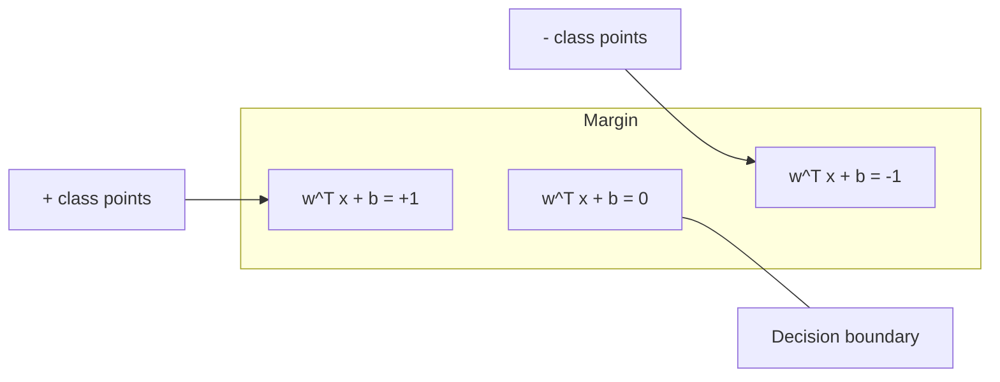
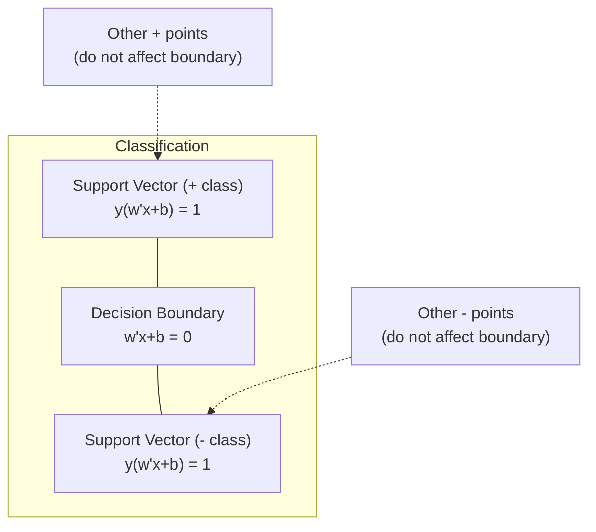
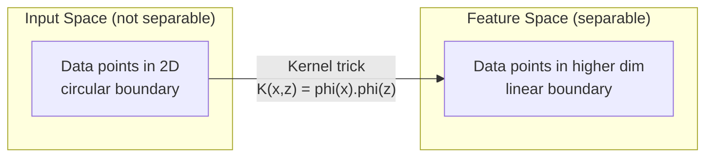

# آلات الدعم المتجهة

> إبحث عن أوسع شارع بين فئتين، هذه هي الفكرة

**Type:** Build
**Language:**بايثون
**Prerequisites:** Phase 1 (Lessons 08 Optimization, 14 Norms and Distances, 18 Convex Optimization)
**Time:** ~90 minutes

## أهداف التعلم

- تنفيذ SVM خطي من الصفر باستخدام فقدان المزج وتراجع التراجع على الصيغة الأساسية
- شرح مبدأ الحد الأقصى للخفض وتحديد متجهات الدعم من نموذج مدرب
- مقارنة الأجزاء الخطية والكثرية والRBF وشرح كيفية تجنب خدعة الأجزاء الخريطة المبرمة
- تقييم التنازل الذي يتم التحكم فيه بمعيار C بين عرض الحافة وأخطاء التصنيف

## المشكلة

لديك فئتين من نقاط البيانات و تحتاج إلى رسم خط (أو طائرة فائقة) يفصلها. يمكن أن تعمل خطوط لا نهاية لها. أي واحد يجب أن تختار؟

الحد الأكبر. الحد هو المسافة بين حدود القرار والأقرب نقاط البيانات على كل جانب. الحد الأوسع يعني أن المصنف أكثر ثقة وتعميم أفضل للبيانات غير المرئية.

هذه الحدس تؤدي إلى آلات الدعم المتجهة، واحدة من أكثر خوارزميات أروعة رياضيا في ML. كانت SVM طريقة التصنيف المهيمنة قبل التعلم العميق وتظل أفضل خيار لمجموعات بيانات صغيرة، والبيانات عالية الأبعاد، والمشاكل التي تحتاج إلى نموذج مبدئي ومفهوم جيد مع ضمانات نظرية.

تتصل SVM مباشرةً بالمرحلة الأولى: التكيف متواصل (المرحلة 18) ، ويتم قياس الحافة مع المعايير (المرحلة 14) ، وتستغل خدعة النواة منتجات النقاط للتعامل مع الحدود غير الخطية دون الحساب في الفضاء العالي الأبعاد.

## المفهوم

### تصنيف الحد الأقصى للخفض

نظراً للبيانات القابلة للفصل بشكل خطي مع علامات y_i في {-1, +1} و متجهات ميزة x_i، نريد طائرة خارقة w^T x + b = 0 التي تفصل الفئات.

المسافة من نقطة x_i إلى المخطط العابر هي:

```
distance = |w^T x_i + b| / ||w||
```

بالنسبة لمكان مصنف بشكل صحيح: y_i * (w^T x_i + b) > 0. الحافة هي ضعف المسافة من المخطط العابر إلى أقرب نقطة على كل جانب.



مشكلة التحسين:

```
maximize    2 / ||w||     (the margin width)
subject to  y_i * (w^T x_i + b) >= 1  for all i
```

على نحو مماثل (تحقيق الحد الأدنى من المعدلات من المعدلات من المعدلات من المعدلات من المعدلات من المعدلات من المعدلات من المعدلات من المعدلات من المعدلات من المعدلات من المعدلات من المعدلات من المعدلات من المعدلات من المعدلات من المعدات من المعدات من المعدات من المعدات من المعدات من المعدات من المعدات من المعدات من المعدات من المعدات من المعدات من المعدات من المعدات من المعدات من المعدات من المعدات من المعدات من المعدات من المعدات من المعدات من المعدات من المعدات من المعدات من المعدات من المعدات من المعدات من المعدات من المعدات من المعدات من المعدات من المعدات من المعدات من المعدات من المعدات من المعدات من المعدات من المعدات من المعدات من المعدات من المعدات من المعدات من المعدات من المعدات من المعدات من المعدات من المعدات من المعدات:

```
minimize    (1/2) ||w||^2
subject to  y_i * (w^T x_i + b) >= 1  for all i
```

هذا هو برنامج مربع متواصل. لديه حل عالمي فريد. نقاط البيانات التي تقع بالضبط على حدود الحافة (حيث y_i * (w^T x_i + b) = 1) هي متجهات الدعم. هي النقاط الوحيدة التي تحدد حدود القرار. تحريك أو إزالة أي نقطة غير متجهة الدعم، والحدود لا تتغير.

### متجهات الدعم: القليل الحرج



معظم نقاط التدريب لا علاقة لها بالضرورة. فقط متجهات الدعم هي المهمة. لهذا السبب تكون المواد السويدية فعالة في الذاكرة في وقت التنبؤ: تحتاج فقط إلى تخزين متجهات الدعم، وليس مجموعة التدريب بأكملها.

عدد متجهات الدعم يعطي أيضا حدود على خطأ التعميم. أقل متجهات الدعم بالنسبة إلى حجم مجموعة البيانات يعني التعميم الأفضل.

### الحافة الناعمة: التعامل مع الضجيج مع المعلم C

البيانات الحقيقية نادرًا ما تكون قابلة للفصل الكامل. قد تكون بعض النقاط على الجانب الخطأ من الحدود، أو داخل الحافة. يسمح صياغة الحافة الناعمة بالانتهاكات عن طريق إدخال متغيرات الهدوء.

```
minimize    (1/2) ||w||^2 + C * sum(xi_i)
subject to  y_i * (w^T x_i + b) >= 1 - xi_i
            xi_i >= 0  for all i
```

متغير التخفيف xi_i يقيس كمية نقطة i تنتهك الهامش.

| C value | Behavior |
|---------|----------|
| Large C | Penalizes violations heavily. Narrow margin, fewer misclassifications. Overfits |
| Small C | Allows more violations. Wide margin, more misclassifications. Underfits |

C هو قوة التنظيم، عكس. C الكبير = تقليص التنظيم. C الصغيرة = تقليص أكثر.

### فقدان المضغوطات: وظيفة فقدان SVM

يمكن إعادة كتابة SVM الحد الهائل كتحسين غير مقيد:

```
minimize    (1/2) ||w||^2 + C * sum(max(0, 1 - y_i * (w^T x_i + b)))
```

المصطلح max(0, 1 - y_i * f(x_i)) هو خسارة الحلزون. هو صفر عندما يتم تصنيف النقطة بشكل صحيح وخارج الحافة. هو خطي عندما تكون النقطة داخل الحافة أو غير مصنفة.

```
Hinge loss for a single point:

loss
  |
  | \
  |  \
  |   \
  |    \
  |     \_______________
  |
  +-----|-----|-------->  y * f(x)
       0     1

Zero loss when y*f(x) >= 1 (correctly classified, outside margin).
Linear penalty when y*f(x) < 1.
```

مقارنة مع الخسارة اللوجستية (التراجع اللوجستية):

```
Hinge:     max(0, 1 - y*f(x))          Hard cutoff at margin
Logistic:  log(1 + exp(-y*f(x)))        Smooth, never exactly zero
```

إن خسرة الحنجة تنتج حلول نادرة (فقط متجهات الدعم لها مساهمة غير صفر). يستخدم الخسارة اللوجستية جميع نقاط البيانات. وهذا يجعل SVM أكثر كفاءة في الذاكرة في وقت التنبؤ.

### تدريب جهاز SVM خطي مع انخفاض تراجع

يمكنك تدريب SVM خطي باستخدام انخفاض التراجع على الخسارة المزج زائد L2 التنظيم، دون حل QP المحدود:

```
L(w, b) = (lambda/2) * ||w||^2 + (1/n) * sum(max(0, 1 - y_i * (w^T x_i + b)))

Gradient with respect to w:
  If y_i * (w^T x_i + b) >= 1:  dL/dw = lambda * w
  If y_i * (w^T x_i + b) < 1:   dL/dw = lambda * w - y_i * x_i

Gradient with respect to b:
  If y_i * (w^T x_i + b) >= 1:  dL/db = 0
  If y_i * (w^T x_i + b) < 1:   dL/db = -y_i
```

يُطلق على هذا الصيغة الأساسية. يُجري في O(n * d) لكل عصر، حيث n هو عدد العينات و d هو عدد الميزات. بالنسبة للبيانات الكبيرة والنادرة والمتعددة العالية (تصنيف النص) ، هذا سريع.

### الصيغة المزدوجة و خدعة النواة

ثنائي اللجرنجية لمشكلة SVM (من الدروس الأولى 18 ، شروط KKT) هي:

```
maximize    sum(alpha_i) - (1/2) * sum_ij(alpha_i * alpha_j * y_i * y_j * (x_i . x_j))
subject to  0 <= alpha_i <= C
            sum(alpha_i * y_i) = 0
```

يتضمن الثنائي فقط منتجات النقاط x_i . x_j بين نقاط البيانات. هذه هي المعلومات الرئيسية. استبدل كل منتج نقطة بمهمة النواة K(x_i, x_j) ويمكن لـ SVM تعلم الحدود غير الخطية دون حساب التحويل صراحة.

```
Linear kernel:      K(x, z) = x . z
Polynomial kernel:  K(x, z) = (x . z + c)^d
RBF (Gaussian):     K(x, z) = exp(-gamma * ||x - z||^2)
```

يقوم النواة RBF بتخريط البيانات إلى مساحة غير محدودة. النقاط التي تقترب من مساحة المدخل لها قيمة النواة بالقرب من 1. النقاط التي تبعد عن بعضها لديها قيمة النواة بالقرب من 0.



خدعة النواة يحسب الناتج النقطي في الفضاء العالي الأبعاد دون الذهاب إلى هناك. بالنسبة للنواة متعددة النقاط من درجة d في أبعاد D، فإن مساحة الميزة الصريحة لها أبعاد O(D^d. ولكن يتم حساب K(x، z) في وقت O(D).

### (SVR)

يُصنع النقل الانسحابي للدعم أنبوبًا من عرض إيبسيلون حول البيانات. النقاط داخل الأنبوب لها خسارة صفرية. النقاط خارج الأنبوب تعاقب خطيًا.

```
minimize    (1/2) ||w||^2 + C * sum(xi_i + xi_i*)
subject to  y_i - (w^T x_i + b) <= epsilon + xi_i
            (w^T x_i + b) - y_i <= epsilon + xi_i*
            xi_i, xi_i* >= 0
```

يحدد معايير إيبسيلون عرض الأنابيب. الأنابيب الأوسع = أقل متجهات دعم = تناسب أكثر سلاسة. الأنابيب الأصغر = متجهات دعم أكثر = تناسب أكثر ضيقة.

### لماذا خسر المعلمون السريعون للتعلم العميق (ومتى ما زالوا يفوزون)

سيطرت المعلمات السريعة على التعلم الذكي من أواخر التسعينات حتى أوائل عامي 2010. فالتعلم العميق تجاوزهم لعدة أسباب:

| Factor | SVMs | Deep learning |
|--------|------|---------------|
| Feature engineering | Requires it | Learns features |
| Scalability | O(n^2) to O(n^3) for kernel | O(n) per epoch with SGD |
| Image/text/audio | Needs handcrafted features | Learns from raw data |
| Large datasets (>100k) | Slow | Scales well |
| GPU acceleration | Limited benefit | Massive speedup |

لا يزال الـ "سيفم" يفوزون في هذه الحالات:
- مجموعات بيانات صغيرة (مئات إلى آلاف العينات)
- بيانات نادرة عالية الأبعاد (نص مع ميزات TF-IDF)
- عندما تحتاج إلى ضمانات رياضية (حدود الهامش)
- عندما يكون وقت التدريب الحد الأدنى (السي.إس.إم الخطية سريعة جدا)
- التصنيف الثنائي مع هيكل هامش واضح
- الكشف عن التشوهات (معدل التحكم في المعدات الفنية من فئة واحدة)

```figure
svm-margin
```

## بناءها

### الخطوة الأولى: فقدان الدرع والتحرّك

أساس، حساب خسارة المزج للكبيرة و تراجعتها

```python
def hinge_loss(X, y, w, b):
    n = len(X)
    total_loss = 0.0
    for i in range(n):
        margin = y[i] * (dot(w, X[i]) + b)
        total_loss += max(0.0, 1.0 - margin)
    return total_loss / n
```

### الخطوة الثانية: SVM الخطية عبر انخفاض التدفق

تدريب من خلال تقليل خسارة المزج المعتاد لا حاجة لحل QP.

```python
class LinearSVM:
    def __init__(self, lr=0.001, lambda_param=0.01, n_epochs=1000):
        self.lr = lr
        self.lambda_param = lambda_param
        self.n_epochs = n_epochs
        self.w = None
        self.b = 0.0

    def fit(self, X, y):
        n_features = len(X[0])
        self.w = [0.0] * n_features
        self.b = 0.0

        for epoch in range(self.n_epochs):
            for i in range(len(X)):
                margin = y[i] * (dot(self.w, X[i]) + self.b)
                if margin >= 1:
                    self.w = [wj - self.lr * self.lambda_param * wj
                              for wj in self.w]
                else:
                    self.w = [wj - self.lr * (self.lambda_param * wj - y[i] * X[i][j])
                              for j, wj in enumerate(self.w)]
                    self.b -= self.lr * (-y[i])

    def predict(self, X):
        return [1 if dot(self.w, x) + self.b >= 0 else -1 for x in X]
```

### الخطوة الثالثة: وظائف النواة

تنفيذ الأجزاء الخطية والكثرية و RBF.

```python
def linear_kernel(x, z):
    return dot(x, z)

def polynomial_kernel(x, z, degree=3, c=1.0):
    return (dot(x, z) + c) ** degree

def rbf_kernel(x, z, gamma=0.5):
    diff = [xi - zi for xi, zi in zip(x, z)]
    return math.exp(-gamma * dot(diff, diff))
```

### الخطوة الرابعة: تحديد الحافة والمتجهات الداعمة

بعد التدريب، حدد نقاط المتجهات الداعمة وحسب عرض الحافة.

```python
def find_support_vectors(X, y, w, b, tol=1e-3):
    support_vectors = []
    for i in range(len(X)):
        margin = y[i] * (dot(w, X[i]) + b)
        if abs(margin - 1.0) < tol:
            support_vectors.append(i)
    return support_vectors
```

انظر`code/svm.py`للتنفيذ الكامل مع جميع الادعاءات.

## استخدمها

مع التعلم المُسلّق:

```python
from sklearn.svm import SVC, LinearSVC, SVR
from sklearn.preprocessing import StandardScaler
from sklearn.pipeline import Pipeline

clf = Pipeline([
    ("scaler", StandardScaler()),
    ("svm", SVC(kernel="rbf", C=1.0, gamma="scale")),
])
clf.fit(X_train, y_train)
print(f"Accuracy: {clf.score(X_test, y_test):.4f}")
print(f"Support vectors: {clf['svm'].n_support_}")
```

المهم: دائماً قم بتحديد ميزاتك قبل تدريب المعلم السريع. السريع السريع هو حساس لجميع الميزات لأن الحافة تعتمد على الميزات غير المتوسطة، وتشوه الهندسة.

لمجموعات بيانات كبيرة، استخدم `LinearSVC`(الصيغة الأولية، O ((n) لكل عصر) بدلاً من `SVC`(صيغة مزدوجة، O(n^2) إلى O(n^3)):

```python
from sklearn.svm import LinearSVC

clf = Pipeline([
    ("scaler", StandardScaler()),
    ("svm", LinearSVC(C=1.0, max_iter=10000)),
])
```

## التمارين

1. إنشاء مجموعة بيانات قابلة للفصل خطي 2D. قم بتدريب LinearSVM الخاص بك وتحديد متجهات الدعم. تحقق من أن متجهات الدعم هي النقاط القريبة من حدود القرار.

2. يختلف C من 0.001 إلى 1000 على مجموعة بيانات ضوضاء. رسم الحد القرار لكل قيمة C. لاحظ الانتقال من الهامش واسع (غير مناسب) إلى الهامش الضيق (تجاوز).

3. قم بإنشاء مجموعة بيانات تكون حدود الفئة دائرية (ليس خطية). أظهر أن SVM خطية تفشل. احسب ماتريكس النواة RBF و أظهر أن الفصول تصبح قابلة للفصل في مساحة الميزات التي يسببها النواة.

4. مقارنة خسارة الخزينة مقابل خسارة اللوجستية على نفس مجموعة البيانات. قم بتدريب SVM خطي والانسحاب اللوجستي. احسب عدد نقاط التدريب التي تساهم في حدود القرار لكل نموذج (متنقلات الدعم مقابل جميع النقاط).

5. قم بتنفيذ SVR (خسارة غير حساسة لـ epsilon). قم بتصويرها إلى y = sin(x) + ضجيج. رسم أنبوب epsilon حول التنبؤات وبرز متجهات الدعم (النقاط خارج الأنبوب).

## الشروط الرئيسية

| Term | What it actually means |
|------|----------------------|
| Support vectors | The training points closest to the decision boundary. The only points that determine the hyperplane |
| Margin | The distance between the decision boundary and the nearest support vectors. SVMs maximize this |
| Hinge loss | max(0, 1 - y*f(x)). Zero when correctly classified and outside the margin. Linear penalty otherwise |
| C parameter | Trade-off between margin width and classification errors. Large C = narrow margin, small C = wide margin |
| Soft margin | SVM formulation that allows margin violations via slack variables. Handles non-separable data |
| Kernel trick | Computing dot products in a high-dimensional feature space without explicitly mapping to that space |
| Linear kernel | K(x, z) = x . z. Equivalent to standard dot product. For linearly separable data |
| RBF kernel | K(x, z) = exp(-gamma * \|\|x-z\|\|^2). Maps to infinite dimensions. Learns any smooth boundary |
| Polynomial kernel | K(x, z) = (x . z + c)^d. Maps to a feature space of polynomial combinations |
| Dual formulation | Reformulation of the SVM problem that depends only on dot products between data points. Enables kernels |
| SVR | Support Vector Regression. Fits an epsilon-tube around the data. Points inside the tube have zero loss |
| Slack variables | xi_i: measures how much a point violates the margin. Zero for correctly classified points outside margin |
| Maximum margin | The principle of choosing the hyperplane that maximizes the distance to the nearest points of each class |

## المزيد من القراءة

- [Vapnik: The Nature of Statistical Learning Theory (1995)](https://link.springer.com/book/10.1007/978-1-4757-3264-1)- النص الأساسي حول الوسائط السريعة والتعلم الإحصائي
- [Cortes & Vapnik: Support-vector networks (1995)](https://link.springer.com/article/10.1007/BF00994018)- ورقة SVM الأصلية
- [Platt: Sequential Minimal Optimization (1998)](https://www.microsoft.com/en-us/research/publication/sequential-minimal-optimization-a-fast-algorithm-for-training-support-vector-machines/)- خوارزمية SMO التي جعلت تدريب SVM عملية
- [scikit-learn SVM documentation](https://scikit-learn.org/stable/modules/svm.html)- دليل عملي مع تفاصيل التنفيذ
- [LIBSVM: A Library for Support Vector Machines](https://www.csie.ntu.edu.tw/~cjlin/libsvm/)- مكتبة C ++ وراء معظم تنفيذات SVM
