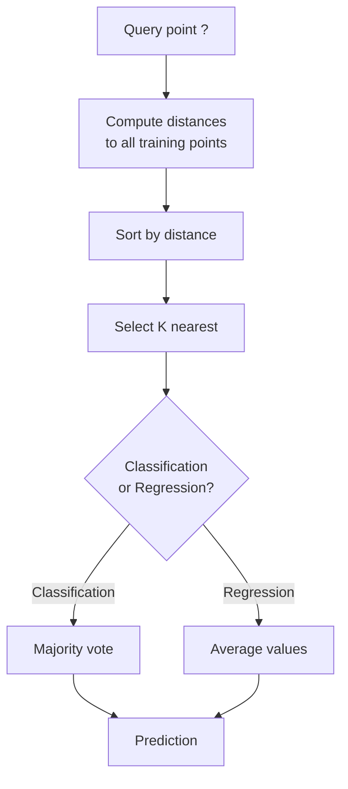
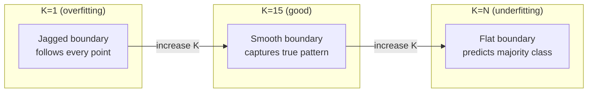
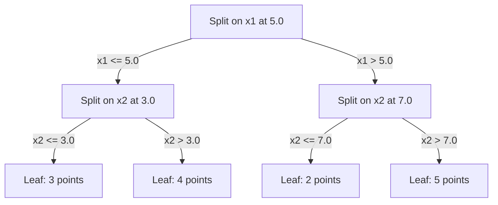

# K - أقرب جيران و مسافة

> تخزين كل شيء، توقع من خلال النظر إلى جيرانك أبسط خوارزمية تعمل فعلاً

**Type:** Build
**Language:**بايثون
**Prerequisites:** Phase 1 (Lesson 14 Norms and Distances)
**Time:** ~90 minutes

## أهداف التعلم

- تنفيذ تصنيف KNN والانسحاب من الصفر مع K قابلة للتكوين والتصويت الموزن عن المسافة
- مقارنة مقاييس المسافة L1، L2، cosine، و Minkowski واختيار واحدة مناسبة لنوع البيانات المحددة
- شرح لعنة الابعاد وتوضيح سبب تدهور KNN في المساحات الابعادية العالية
- بناء شجرة كيه دي لفعالية البحث القريب أقرب وجراحه عندما يتفوق على القوة الخام

## المشكلة

لديك مجموعة بيانات. نقطة بيانات جديدة تصل. تحتاج إلى تصنيفها أو التنبؤ بقيمةها. بدلاً من تعلم المعايير من البيانات (مثل التراجع الخطي أو SVM) ، يمكنك فقط العثور على نقاط التدريب K القريبة من النقطة الجديدة ودعهم يصوتون.

هذه أقرب جيران K. لا يوجد مرحلة تدريب. لا توجد معايير للتعلم. لا توجد وظيفة خسارة لتقليلها. تخزن مجموعة التدريب بأكملها وتحسب المسافات في وقت التنبؤ.

يبدو الأمر بسيطًا جدًا للعمل. ولكن KNN تنافس بشكل مفاجئ في العديد من المشاكل، خاصة مع مجموعات بيانات صغيرة ومتوسطة، وفهمها يكشف عميقًا عن مفاهيم أساسية: اختيار مقياس المسافة (الربط مع الدروس الثانية عشر من المرحلة) ، لعنة الابعاد، والفرق بين التعلم الباكس والسعاده.

تظهر KNN أيضًا في كل مكان في الذكاء الاصطناعي الحديث ، تحت أسماء مختلفة. تقوم قواعد بيانات المتجهات KNN بالبحث عن التوابل. يجد الجيل المُزيد من الاسترداد (RAG) أقرب قطع وثيقة K. تكتشف أنظمة التوصية مستخدمين أو عناصر مشابهة. ال خوارزمية هي نفسها. يختلف النطاق وبنية البيانات.

## المفهوم

### كيف تعمل KNN

نظراً لمجموعة بيانات من النقاط المعلقة ونقطة استفسار جديدة:

1. حساب المسافة من الاستفسار إلى كل نقطة في مجموعة البيانات
2. تصفية حسب المسافة
3. خذ أقرب نقاط K
4. للتصنيف: صوت الأغلبية بين الجيران K
5. بالنسبة للعودة: متوسط (أو متوسط وزني) قيم الجيران K



هذا هو الخوارزمية بأكملها لا توجد تكييفات لا نزول تراجع لا توجد حقول

### اختيار K

K هو المعيار المفرط الوحيد. إنه يسيطر على التداول بين التأثيرات:

| K | Behavior |
|---|----------|
| K = 1 | Decision boundary follows every point. Zero training error. High variance. Overfits |
| Small K (3-5) | Sensitive to local structure. Can capture complex boundaries |
| Large K | Smoother boundaries. More robust to noise. May underfit |
| K = N | Predicts the majority class for every point. Maximum bias |

نقطة بداية شائعة هي K = sqrt(N) لمجموعة بيانات من N نقاط. استخدم K غير مقارنة للتصنيف الثنائي لتجنب العلاقات.



### مقاييس المسافة

وظيفة المسافة تعريف ما يعني "قريب" المقاييس المختلفة تنتج جيران مختلفة، توقعات مختلفة.

**L2 (Euclidean)**هو الافتراض. المسافة على الخط المستقيم.

```
d(a, b) = sqrt(sum((a_i - b_i)^2))
```

حساسة للميزات، دائماً تقييم الميزات قبل استخدام L2 مع KNN.

**L1 (Manhattan)**يجمع الاختلافات المطلقة. أكثر قوة إلى المتفاصيل من L2 لأنه لا يربع الاختلافات.

```
d(a, b) = sum(|a_i - b_i|)
```

**Cosine distance**يُقيّم الزاوية بين المتجهات، دون تجاهل الحجم.

```
d(a, b) = 1 - (a . b) / (||a|| * ||b||)
```

**Minkowski**يُعمّل L1 و L2 مع المعلم p.

```
d(a, b) = (sum(|a_i - b_i|^p))^(1/p)

p=1: Manhattan
p=2: Euclidean
p->inf: Chebyshev (max absolute difference)
```

أي مقياس تستخدم يعتمد على البيانات:

| Data type | Best metric | Why |
|-----------|------------|-----|
| Numeric features, similar scale | L2 (Euclidean) | Default, works for spatial data |
| Numeric features, outliers | L1 (Manhattan) | Robust, does not amplify large differences |
| Text embeddings | Cosine | Magnitude is noise, direction is meaning |
| High-dimensional sparse | Cosine or L1 | L2 suffers from curse of dimensionality |
| Mixed types | Custom distance | Combine metrics per feature type |

### KNN الموزن

يمنح KNN القياسية وزنًا متساوٍ لجميع الجيران K. لكن جيرًا في المسافة 0.1 يجب أن يكون أكثر من واحد في المسافة 5.0.

**Distance-weighted KNN**يزن كل جيرانه عكسًا بالبعيد:

```
weight_i = 1 / (distance_i + epsilon)

For classification: weighted vote
For regression:     weighted average = sum(w_i * y_i) / sum(w_i)
```

يمنع الـ (إيبسيلون) من الانقسام بالصفر عندما تتطابق نقطة الاستفسار مع نقطة التدريب بالضبط.

إن KNN الموزن أقل حساسية لخيار K لأن الجيران البعيدين يساهمون قليلاً جداً بغض النظر.

### لعنة الأبعاد

أداء KNN يتدهور في أبعاد عالية. هذه ليست قلق غامض. إنها حقيقة رياضية.

**Problem 1: distances converge.**مع زيادة الأبعاد، يصل نسبة المسافة القصوى إلى المسافة الأدنى إلى 1. تصبح جميع النقاط "بعد" من السؤال على قدم المساواة.

```
In d dimensions, for random uniform points:

d=2:    max_dist / min_dist = varies widely
d=100:  max_dist / min_dist ~ 1.01
d=1000: max_dist / min_dist ~ 1.001

When all distances are nearly equal, "nearest" is meaningless.
```

**Problem 2: volume explodes.**لالتقاط الجيران K داخل جزء ثابت من البيانات، تحتاج إلى توسيع نصف قطر البحث لتغطية جزء أكبر بكثير من المساحة المميزة. "الجوار" في الأبعاد العالية يشمل معظم المساحة.

**Problem 3: corners dominate.**في وحدة كوب هائبر في d الأبعاد، تركز معظم الحجم بالقرب من الزوايا، وليس الوسط. الكرة المشاركة في الكوب تحتوي على جزء متلاشى من الحجم مع نمو d.

النتيجة العملية: تعمل KNN بشكل جيد حتى حوالي 20-50 ميزة. وبالإضافة إلى ذلك ، تحتاج إلى تقليل الأبعاد (PCA ، UMAP ، t-SNE) قبل تطبيق KNN ، أو تحتاج إلى استخدام هيكلات البحث القائمة على الأشجار التي تستغل الأبعاد السفلية الداخلية للبيانات.

### شجرة كيه دي: بحث سريع عن أقرب جيران

يقوم KNN بقوة قاسية بحساب المسافة من الاستفسار إلى كل نقطة تدريب. وهذا هو O(n * d) لكل استفسار. بالنسبة لمجموعات بيانات كبيرة، هذا بطيء جدا.

تقوم شجرة KD بتقسيم الفضاء بشكل متكرر على طول محور الميزات. في كل مستوى، تقسم على طول بعد واحد عند القيمة المتوسطة.



للعثور على أقرب جيران، عبر الشجرة إلى الورقة التي تحتوي على السؤال، ثم تراجع وتحقق من الشقق المجاورة فقط إذا كان يمكن أن تحتوي على نقاط أقرب.

متوسط وقت البحث: O(log n) للأبعاد المنخفضة. ولكن شجرة KD تتدهور إلى O(n) في الأبعاد العالية (d > 20) لأن التراجع يزيل فروع أقل وأقل.

### أشجار الكرة: أفضل للأبعاد المتوسطة

تقوم أشجار الكرة بتقسيم البيانات إلى كواكب متضخمة بدلاً من صناديق مرتبطة بالمحور. تحدد كل عقد كرة (الوسط + نصف قطر) تحتوي على جميع النقاط في تلك الشجرة الفرعية.

المزايا على الأشجار الكهربائية:
- تعمل بشكل أفضل في الأبعاد المتوسطة (حتى ~50)
- الجهاز غير المتحبط بالمحور
- الحدود الضيقة تعني أن المزيد من الفروع يتم قصها أثناء البحث

كل من شجرة كيه دي وشجرة الكرة هي خوارزميات دقيقة. للبحث على نطاق واسع حقا (ملايين النقاط ، مئات الأبعاد) ، تستخدم بدلاً من ذلك تقريبي أقرب الأساليب الجارية (HNSW ، IVF ، كمية المنتج). يتم تغطيتها في المرحلة 1 الدروس 14.

### التعلم الباكس مقابل التعلم السعيد

كين إن هو متعلم كسيل: لا يعمل في وقت التدريب وكل العمل في وقت التنبؤ. معظم الخوارزميات الأخرى (التراجع الخطي، SVMs، الشبكات العصبية) متعلمون حريصين: يقومون بحسابات ثقيلة في وقت التدريب لبناء نموذج صغير، ثم التنبؤات سريعة.

| Aspect | Lazy (KNN) | Eager (SVM, neural net) |
|--------|------------|------------------------|
| Training time | O(1) just store data | O(n * epochs) |
| Prediction time | O(n * d) per query | O(d) or O(parameters) |
| Memory at prediction | Store entire training set | Store model parameters only |
| Adapts to new data | Add points instantly | Retrain the model |
| Decision boundary | Implicit, computed on the fly | Explicit, fixed after training |

التعلم الباكس هو المثالي عندما:
- مجموعة البيانات تتغير بشكل متكرر (إضافة/إزالة النقاط دون إعادة التدريب)
- تحتاجين إلى توقعات لعدد قليل جدا من الأسئلة
- تريدون صفر وقت تدريب
- مجموعة البيانات صغيرة بما فيه الكفاية لبحث القوة القاسية سريعة

### KNN للعودة

بدلاً من التصويت بأغلبية، يعد KNN للعودة متوسطات القيم المستهدفة للجيران K.

```
prediction = (1/K) * sum(y_i for i in K nearest neighbors)

Or with distance weighting:
prediction = sum(w_i * y_i) / sum(w_i)
where w_i = 1 / distance_i
```

إن رجعة KNN تنتج توقعات ثابتة قطعة (أو سلمة قطعة مع الوزن). لا يمكن استخراجها خارج نطاق بيانات التدريب. إذا كان جميع أهداف التدريب بين 0 و100، لن تتوقع KNN 200 أبدا.

```figure
knn-smoothness
```

## بناءها

### الخطوة 1: وظائف المسافة

قم بتنفيذ مسافات L1، L2، كوزين، و Minkowski. هذه ترتبط مباشرة إلى المرحلة 1 الدروس 14.

```python
import math

def l2_distance(a, b):
    return math.sqrt(sum((ai - bi) ** 2 for ai, bi in zip(a, b)))

def l1_distance(a, b):
    return sum(abs(ai - bi) for ai, bi in zip(a, b))

def cosine_distance(a, b):
    dot_val = sum(ai * bi for ai, bi in zip(a, b))
    norm_a = math.sqrt(sum(ai ** 2 for ai in a))
    norm_b = math.sqrt(sum(bi ** 2 for bi in b))
    if norm_a == 0 or norm_b == 0:
        return 1.0
    return 1.0 - dot_val / (norm_a * norm_b)

def minkowski_distance(a, b, p=2):
    if p == float('inf'):
        return max(abs(ai - bi) for ai, bi in zip(a, b))
    return sum(abs(ai - bi) ** p for ai, bi in zip(a, b)) ** (1 / p)
```

### الخطوة الثانية: تصنيف KNN ومرجع

قم ببناء KNN الكامل مع K قابلة للتكوين، ومقياس المسافة، وميزان المسافة الاختياري.

```python
class KNN:
    def __init__(self, k=5, distance_fn=l2_distance, weighted=False,
                 task="classification"):
        self.k = k
        self.distance_fn = distance_fn
        self.weighted = weighted
        self.task = task
        self.X_train = None
        self.y_train = None

    def fit(self, X, y):
        self.X_train = X
        self.y_train = y

    def predict(self, X):
        return [self._predict_one(x) for x in X]
```

### الخطوة الثالثة: شجرة كيه دي للبحث الفعال

بناء شجرة كيه دي من الصفر التي تقسم بشكل متكرر على وسط كل بعد.

```python
class KDTree:
    def __init__(self, X, indices=None, depth=0):
        # Recursively partition the data
        self.axis = depth % len(X[0])
        # Split on median of the current axis
        ...

    def query(self, point, k=1):
        # Traverse to leaf, then backtrack
        ...
```

انظر`code/knn.py`لتنفيذ كامل مع جميع أساليب المساعدة والإثباتات.

### الخطوة الرابعة: تحسين الميزات

يتطلب KNN تحديد حجم الميزات لأن المسافات حساسة لجمعات الميزات. سوف تهيمن ميزة تتراوح بين 0 و 1000 على ميزة تتراوح بين 0 و 1.

```python
def standardize(X):
    n = len(X)
    d = len(X[0])
    means = [sum(X[i][j] for i in range(n)) / n for j in range(d)]
    stds = [
        max(1e-10, (sum((X[i][j] - means[j]) ** 2 for i in range(n)) / n) ** 0.5)
        for j in range(d)
    ]
    return [[((X[i][j] - means[j]) / stds[j]) for j in range(d)] for i in range(n)], means, stds
```

## استخدمها

مع التعلم المُسلّق:

```python
from sklearn.neighbors import KNeighborsClassifier
from sklearn.preprocessing import StandardScaler
from sklearn.pipeline import Pipeline

clf = Pipeline([
    ("scaler", StandardScaler()),
    ("knn", KNeighborsClassifier(n_neighbors=5, metric="euclidean")),
])
clf.fit(X_train, y_train)
print(f"Accuracy: {clf.score(X_test, y_test):.4f}")
```

يستخدم Scikit-learn تلقائيًا أشجار KD أو أشجار الكرة عندما يكون مجموعة البيانات كبيرة بما فيه الكفاية والبعمية منخفضة بما فيه الكفاية. بالنسبة للبيانات العالية الأبعاد ، فإنه يعود إلى القوة الخامة. يمكنك التحكم في هذا باستخدام `algorithm`المعلم

للبحث على نطاق واسع عن أقرب جيران (ملايين المتجهات) ، استخدم FAISS أو Annoy أو قاعدة بيانات متجهات:

```python
import faiss

index = faiss.IndexFlatL2(dimension)
index.add(embeddings)
distances, indices = index.search(query_vectors, k=5)
```

## التمارين

1. تنفيذ تصنيف KNN على مجموعة بيانات 2D ذات 3 فئات. رسم الحدود القرارية ل K=1, K=5, K=15, و K=N. لاحظ الانتقال من الإعدادات المفرطة إلى الإعدادات السيئة.

2. توليد 1000 نقطة عشوائية في 2، 5، 10، 50، 100، و 500 بعد. لكل بعد، حساب نسبة من أقصى مسافة زوجية إلى أدنى بعد زوجية. رسم النسبة مقابل بعد لتصور لعنة بعد.

3. مقارنة L1، L2، والمسافة الكوسينية لـ KNN على مشكلة تصنيف النص (استخدم متجهات TF-IDF). أي مقياس يعطي أفضل دقة؟ لماذا يميل الكوسين إلى الفوز للنص؟

4. تنفيذ شجرة كيه دي وقياس وقت الاستفسار مقابل القوة الخام لمجموعات البيانات من 1k، 10k، و 100k نقاط في 2D، 10D، و 50D. في أي بعد توقف شجرة كيه دي عن أن تكون أسرع من القوة الخام؟

5. قم ببناء مقياس KNN الموزن لـ y = sin(x) + الضجيج. قارنه مع KNN غير الموزن لـ K = 3, 10, 30.

## الشروط الرئيسية

| Term | What it actually means |
|------|----------------------|
| K-nearest neighbors | Non-parametric algorithm that predicts by finding the K closest training points to a query |
| Lazy learning | No computation at training time. All work happens at prediction time. KNN is the canonical example |
| Eager learning | Heavy computation at training time to build a compact model. Most ML algorithms are eager |
| Curse of dimensionality | In high dimensions, distances converge and neighborhoods expand to cover most of the space, making KNN ineffective |
| KD-tree | Binary tree that recursively partitions space along feature axes. O(log n) queries in low dimensions |
| Ball tree | Tree of nested hyperspheres. Works better than KD-trees in moderate dimensions (up to ~50) |
| Weighted KNN | Neighbors weighted inversely by distance. Closer neighbors have more influence on the prediction |
| Feature scaling | Normalizing features to comparable ranges. Required for distance-based methods like KNN |
| Majority vote | Classification by counting which class is most common among K neighbors |
| Brute force search | Computing distance to every training point. O(n*d) per query. Exact but slow for large n |
| Approximate nearest neighbor | Algorithms (HNSW, LSH, IVF) that find approximately nearest points much faster than exact search |
| Voronoi diagram | The partition of space where each region contains all points closer to one training point than any other. K=1 KNN produces Voronoi boundaries |

## المزيد من القراءة

- [Cover & Hart: Nearest Neighbor Pattern Classification (1967)](https://ieeexplore.ieee.org/document/1053964)- ورقة KNN الأساسية التي تثبت أن لديها معدل خطأ على الأكثر ضعف معدل بايز المثالي
- [Friedman, Bentley, Finkel: An Algorithm for Finding Best Matches in Logarithmic Expected Time (1977)](https://dl.acm.org/doi/10.1145/355744.355745)- الورق الأصلي من قاعدة كيه دي
- [Beyer et al.: When Is "Nearest Neighbor" Meaningful? (1999)](https://link.springer.com/chapter/10.1007/3-540-49257-7_15)- تحليل رسمي لعنة الابعاد للجيران الأقرب
- [scikit-learn Nearest Neighbors documentation](https://scikit-learn.org/stable/modules/neighbors.html)- دليل عملي مع اختيار الخوارزميات
- [FAISS: A Library for Efficient Similarity Search](https://github.com/facebookresearch/faiss)- مكتبة "ميتا" للبحث عن القريب القريب على نطاق مليار
