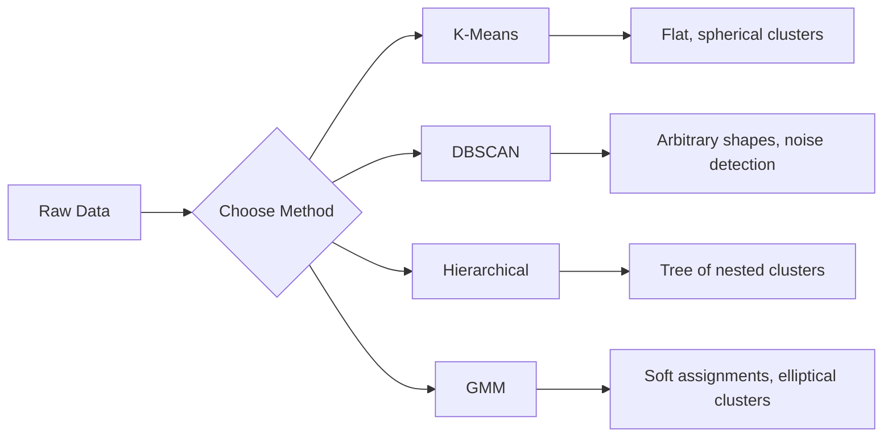

# التعلم بدون إشراف

> لا تسميات ولا معلم، الخوارزمية تجد الهيكل بمفردها

**Type:** Build
**Languages:** Python
**Prerequisites:** Phase 1 (Norms & Distances, Probability & Distributions), Phase 2 Lessons 1-6
**Time:** ~90 minutes

## أهداف التعلم

- تنفيذ نماذج K-Means و DBSCAN و Gaussian Mix Model من الصفر ومقارنة سلوك التجميع
- تقييم جودة الكلاستر باستخدام درجة الحكيمة و طريقة الكوع لتحديد K المثالي
- شرح متى تتفوق DBSCAN على K-Means وتحديد الخوارزمية التي تتعامل مع المجموعات غير الكونية والمتفاصيل
- بناء خط أنابيب اكتشاف التشوهات باستخدام طرق التجميع لمقاطع العلامة التي تختلف عن الأنماط الطبيعية

## المشكلة

كل درس من دروس ML حتى الآن افترضت بيانات مع علامات: "هنا مدخل، وهنا الخروج الصحيح". في العالم الحقيقي، العلامات مكلفة. مستشفى لديه ملايين سجلات المرضى ولكن لم يضع أحد علامة يدوية على كل واحد من هذه المرضات موقع التجارة الإلكترونية يحتوي على ملايين جلسات المستخدمين ولكن لا أحد لديه علامات يدوية على قطاعات العملاء. فريق الأمن لديه سجلات الشبكة لكن لم يلاحظ أحد كل شذوذ

يجد التعلم غير المشرف نمطًا دون أن يُخبر به ما يبحث عنه. يجمع نقاط البيانات المماثلة، ويكتشف الهياكل الخفية، ويظهر الخلل. إذا كان التعلم المشرف يتعلم من كتاب دراسي يحتوي على مفتاح الإجابة، فإن التعلم غير المشرف يحدق في البيانات الخام حتى تظهر الأنماط نفسها.

المشكلة: بدون علامات، لا يمكنك قياس "الصواب" أو "الخاطئ" مباشرة. تحتاج إلى أدوات مختلفة لتقييم ما إذا كانت الهيكل الذي وجدته خوارزميتك له معنى.

## المفهوم

### التجميع: تجميع الأشياء المماثلة معاً

يخصص التجميع كل نقطة بيانات إلى مجموعة (مجموعة) بحيث تكون النقاط داخل نفس المجموعة أكثر تشابهًا ببعضها البعض من النقاط في مجموعات أخرى. السؤال دائمًا هو: ما الذي يعنيه "مثل" ؟



### ك-معنى: حصان العمل

K-Means تقسم البيانات إلى مجموعات K بالضبط. لكل مجموعة مركز (مركز كتلها) ، وتنتمي كل نقطة إلى أقرب مركز.

خوارزمية لويد:

1. اختر نقاط عشوائية ك المركزية الأولية
2. تعيين كل نقطة بيانات إلى أقرب مركز
3. اعيد حساب كل مركز كمتوسط النقاط المخصصة لها
4. كرر الخطوات 2-3 حتى تتوقف المهام عن التغيير

تقوم الوظيفة الموضوعية (الدرجة السلبية) بقياس المسافة المربعة الإجمالية من كل نقطة إلى مركزها المخصص. يقلل K-Means هذا، لكنه يجد الحد الأدنى المحلي فقط. يمكن أن تؤدي التبنيات المختلفة إلى نتائج مختلفة.

### اختيار K

طرق قياسية:

**Elbow method:**أبحث عن "الكمب" حيث يوقف إضافة المزيد من المجموعات من تقليل الهبط بشكل كبير.

**Silhouette score:**للكل نقطة، قياس مدى تشابهها بمجموعة (أ) الخاصة بها مقابل أقرب مجموعة أخرى (ب). معدل الصورة هو (ب - أ) / أقصى عدد (أ) ، ب) ، يتراوح من -1 (مجموعة خاطئة) إلى +1 (مجموعة جيدة). متوسط على جميع النقاط للحصول على درجة عالمية.

### DBSCAN: التجميع القائم على الكثافة

يفترض K-Means أنّ المجموعات كُنْتَ كُرُوعية ويطلب منك اختيار K مقدماً. DBSCAN لا يفترض أيّاً من هذه المجموعات. يجد المجموعات كمناطق كثيفة منفصلة عن المنطقة النادرة.

ملامح:
- **eps**: نصف قطر الحي
- **min_samples**: الحد الأدنى من النقاط اللازمة لتشكيل منطقة كثيفة

ثلاثة أنواع من النقاط:
- **Core point**: يحتوي على على الأقل على نقطة min_samples ضمن مسافة eps
- **Border point**: داخل نقاط النقطة الأساسية ولكن ليس نفسها نقطة الأساسية
- **Noise point**لا يوجد أساس ولا حدود، هذه هي مستويات خارجية.

يربط DBSCAN النقاط الأساسية التي تقع ضمن نقاط eps من بعضها البعض إلى نفس الكلاستر. نقاط الحدود تنضم إلى الكلاستر من نقطة أساسية قريبة. نقاط الضوضاء لا تنتمي إلى أي مجموعة.

القوى: يجد مجموعات من أي شكل، ويقرر تلقائيا عدد المجموعات، ويحدد المتفاصيل. الضعف: الصراعات مع مجموعات من كثافة مختلفة.

### التجميع الهرمي

يُبني شجرة (ديندروغرام) من المجموعات المتعظمة.

التجميع (من الأسفل إلى الأعلى):
1. ابدأ كل نقطة كعنقود خاص بها
2. إدمج المجموعتين القريبتين
3. كرر حتى يبقى مجموعة واحدة فقط
4. قطع اللوحة في المستوى المطلوب للحصول على مجموعة K

يمكن قياس "القربة" بين المجموعات على النحو التالي:
- **Single linkage**: الحد الأدنى من المسافة بين أي نقطتين في المجموعتين
- **Complete linkage**: المسافة القصوى بين نقطتين
- **Average linkage**: متوسط المسافة بين كل الأزواج
- **Ward's method**: الاندماج الذي يسبب أصغر زيادة في إجمالي التباين داخل الكلاستر

### نماذج الخليط الغوسية (GMM)

يعطي K-Means تفويضات صعبة: كل نقطة تنتمي إلى مجموعة واحدة بالضبط. يعطي GMM تفويضات ناعمة: لكل نقطة احتمال أن تنتمي إلى كل مجموعة.

يفترض GMM أن البيانات تم إنشاؤها من مزيج من توزيعات K غوسية ، لكل منها متوسطها وتباينها. يتناوب خوارزمية التوقعات والإكمال (EM) بين:

- **E-step**: حساب احتمال أن كل نقطة تنتمي إلى كل غوسيان
- **M-step**: تحديث المتوسط، التغيرات، والوزن المختلط لكل غوسيان لتحقيق أقصى احتمال من البيانات

يمكن لـ GMM أن يطرح نماذج على مجموعات البنفسجية (ليس مجرد كرة مثل K-Means) ويعالج بشكل طبيعي مجموعات متداخلة.

### متى تستخدم أي

| Method | Best for | Avoid when |
|--------|----------|------------|
| K-Means | Large datasets, spherical clusters, known K | Irregular shapes, outliers present |
| DBSCAN | Unknown K, arbitrary shapes, outlier detection | Varying densities, very high dimensions |
| Hierarchical | Small datasets, need dendrogram, unknown K | Large datasets (O(n^2) memory) |
| GMM | Overlapping clusters, soft assignments needed | Very large datasets, too many dimensions |

### اكتشاف التشوهات مع تجميع

التجميع يدعم بطبيعة الحال اكتشاف الانحرافات:
- **K-Means**: النقاط بعيدة عن أي مركزية هي تشوهات
- **DBSCAN**: نقاط الضوضاء هي تشوهات من حيث التعريف
- **GMM**: نقاط مع احتمال منخفض تحت جميع غوسيانز هي تشابهات

```figure
kmeans-step
```

## بناءها

### الخطوة الأولى: K- يعني من الصفر

```python
import math
import random


def euclidean_distance(a, b):
    return math.sqrt(sum((ai - bi) ** 2 for ai, bi in zip(a, b)))


def kmeans(data, k, max_iterations=100, seed=42):
    random.seed(seed)
    n_features = len(data[0])

    centroids = random.sample(data, k)

    for iteration in range(max_iterations):
        clusters = [[] for _ in range(k)]
        assignments = []

        for point in data:
            distances = [euclidean_distance(point, c) for c in centroids]
            nearest = distances.index(min(distances))
            clusters[nearest].append(point)
            assignments.append(nearest)

        new_centroids = []
        for cluster in clusters:
            if len(cluster) == 0:
                new_centroids.append(random.choice(data))
                continue
            centroid = [
                sum(point[j] for point in cluster) / len(cluster)
                for j in range(n_features)
            ]
            new_centroids.append(centroid)

        if all(
            euclidean_distance(old, new) < 1e-6
            for old, new in zip(centroids, new_centroids)
        ):
            print(f"  Converged at iteration {iteration + 1}")
            break

        centroids = new_centroids

    return assignments, centroids
```

### الخطوة الثانية: طريقة الكوع والحساب في الصورة

```python
def compute_inertia(data, assignments, centroids):
    total = 0.0
    for point, cluster_id in zip(data, assignments):
        total += euclidean_distance(point, centroids[cluster_id]) ** 2
    return total


def silhouette_score(data, assignments):
    n = len(data)
    if n < 2:
        return 0.0

    clusters = {}
    for i, c in enumerate(assignments):
        clusters.setdefault(c, []).append(i)

    if len(clusters) < 2:
        return 0.0

    scores = []
    for i in range(n):
        own_cluster = assignments[i]
        own_members = [j for j in clusters[own_cluster] if j != i]

        if len(own_members) == 0:
            scores.append(0.0)
            continue

        a = sum(euclidean_distance(data[i], data[j]) for j in own_members) / len(own_members)

        b = float("inf")
        for cluster_id, members in clusters.items():
            if cluster_id == own_cluster:
                continue
            avg_dist = sum(euclidean_distance(data[i], data[j]) for j in members) / len(members)
            b = min(b, avg_dist)

        if max(a, b) == 0:
            scores.append(0.0)
        else:
            scores.append((b - a) / max(a, b))

    return sum(scores) / len(scores)


def find_best_k(data, max_k=10):
    print("Elbow method:")
    inertias = []
    for k in range(1, max_k + 1):
        assignments, centroids = kmeans(data, k)
        inertia = compute_inertia(data, assignments, centroids)
        inertias.append(inertia)
        print(f"  K={k}: inertia={inertia:.2f}")

    print("\nSilhouette scores:")
    for k in range(2, max_k + 1):
        assignments, centroids = kmeans(data, k)
        score = silhouette_score(data, assignments)
        print(f"  K={k}: silhouette={score:.4f}")

    return inertias
```

### الخطوة الثالثة: DBSCAN من الصفر

```python
def dbscan(data, eps, min_samples):
    n = len(data)
    labels = [-1] * n
    cluster_id = 0

    def region_query(point_idx):
        neighbors = []
        for i in range(n):
            if euclidean_distance(data[point_idx], data[i]) <= eps:
                neighbors.append(i)
        return neighbors

    visited = [False] * n

    for i in range(n):
        if visited[i]:
            continue
        visited[i] = True

        neighbors = region_query(i)

        if len(neighbors) < min_samples:
            labels[i] = -1
            continue

        labels[i] = cluster_id
        seed_set = list(neighbors)
        seed_set.remove(i)

        j = 0
        while j < len(seed_set):
            q = seed_set[j]

            if not visited[q]:
                visited[q] = True
                q_neighbors = region_query(q)
                if len(q_neighbors) >= min_samples:
                    for nb in q_neighbors:
                        if nb not in seed_set:
                            seed_set.append(nb)

            if labels[q] == -1:
                labels[q] = cluster_id

            j += 1

        cluster_id += 1

    return labels
```

### الخطوة الرابعة: نموذج الخليط الغوسي (الخوارزمية EM)

```python
def gmm(data, k, max_iterations=100, seed=42):
    random.seed(seed)
    n = len(data)
    d = len(data[0])

    indices = random.sample(range(n), k)
    means = [list(data[i]) for i in indices]
    variances = [1.0] * k
    weights = [1.0 / k] * k

    def gaussian_pdf(x, mean, variance):
        d = len(x)
        coeff = 1.0 / ((2 * math.pi * variance) ** (d / 2))
        exponent = -sum((xi - mi) ** 2 for xi, mi in zip(x, mean)) / (2 * variance)
        return coeff * math.exp(max(exponent, -500))

    for iteration in range(max_iterations):
        responsibilities = []
        for i in range(n):
            probs = []
            for j in range(k):
                probs.append(weights[j] * gaussian_pdf(data[i], means[j], variances[j]))
            total = sum(probs)
            if total == 0:
                total = 1e-300
            responsibilities.append([p / total for p in probs])

        old_means = [list(m) for m in means]

        for j in range(k):
            r_sum = sum(responsibilities[i][j] for i in range(n))
            if r_sum < 1e-10:
                continue

            weights[j] = r_sum / n

            for dim in range(d):
                means[j][dim] = sum(
                    responsibilities[i][j] * data[i][dim] for i in range(n)
                ) / r_sum

            variances[j] = sum(
                responsibilities[i][j]
                * sum((data[i][dim] - means[j][dim]) ** 2 for dim in range(d))
                for i in range(n)
            ) / (r_sum * d)
            variances[j] = max(variances[j], 1e-6)

        shift = sum(
            euclidean_distance(old_means[j], means[j]) for j in range(k)
        )
        if shift < 1e-6:
            print(f"  GMM converged at iteration {iteration + 1}")
            break

    assignments = []
    for i in range(n):
        assignments.append(responsibilities[i].index(max(responsibilities[i])))

    return assignments, means, weights, responsibilities
```

### الخطوة 5: توليد بيانات الاختبار وتشغيل كل شيء

```python
def make_blobs(centers, n_per_cluster=50, spread=0.5, seed=42):
    random.seed(seed)
    data = []
    true_labels = []
    for label, (cx, cy) in enumerate(centers):
        for _ in range(n_per_cluster):
            x = cx + random.gauss(0, spread)
            y = cy + random.gauss(0, spread)
            data.append([x, y])
            true_labels.append(label)
    return data, true_labels


def make_moons(n_samples=200, noise=0.1, seed=42):
    random.seed(seed)
    data = []
    labels = []
    n_half = n_samples // 2
    for i in range(n_half):
        angle = math.pi * i / n_half
        x = math.cos(angle) + random.gauss(0, noise)
        y = math.sin(angle) + random.gauss(0, noise)
        data.append([x, y])
        labels.append(0)
    for i in range(n_half):
        angle = math.pi * i / n_half
        x = 1 - math.cos(angle) + random.gauss(0, noise)
        y = 1 - math.sin(angle) - 0.5 + random.gauss(0, noise)
        data.append([x, y])
        labels.append(1)
    return data, labels


if __name__ == "__main__":
    centers = [[2, 2], [8, 3], [5, 8]]
    data, true_labels = make_blobs(centers, n_per_cluster=50, spread=0.8)

    print("=== K-Means on 3 blobs ===")
    assignments, centroids = kmeans(data, k=3)
    print(f"  Centroids: {[[round(c, 2) for c in cent] for cent in centroids]}")
    sil = silhouette_score(data, assignments)
    print(f"  Silhouette score: {sil:.4f}")

    print("\n=== Elbow Method ===")
    find_best_k(data, max_k=6)

    print("\n=== DBSCAN on 3 blobs ===")
    db_labels = dbscan(data, eps=1.5, min_samples=5)
    n_clusters = len(set(db_labels) - {-1})
    n_noise = db_labels.count(-1)
    print(f"  Found {n_clusters} clusters, {n_noise} noise points")

    print("\n=== GMM on 3 blobs ===")
    gmm_assignments, gmm_means, gmm_weights, _ = gmm(data, k=3)
    print(f"  Means: {[[round(m, 2) for m in mean] for mean in gmm_means]}")
    print(f"  Weights: {[round(w, 3) for w in gmm_weights]}")
    gmm_sil = silhouette_score(data, gmm_assignments)
    print(f"  Silhouette score: {gmm_sil:.4f}")

    print("\n=== DBSCAN on moons (non-spherical clusters) ===")
    moon_data, moon_labels = make_moons(n_samples=200, noise=0.1)
    moon_db = dbscan(moon_data, eps=0.3, min_samples=5)
    n_moon_clusters = len(set(moon_db) - {-1})
    n_moon_noise = moon_db.count(-1)
    print(f"  Found {n_moon_clusters} clusters, {n_moon_noise} noise points")

    print("\n=== K-Means on moons (will fail to separate) ===")
    moon_km, moon_centroids = kmeans(moon_data, k=2)
    moon_sil = silhouette_score(moon_data, moon_km)
    print(f"  Silhouette score: {moon_sil:.4f}")
    print("  K-Means splits moons poorly because they are not spherical")

    print("\n=== Anomaly detection with DBSCAN ===")
    anomaly_data = list(data)
    anomaly_data.append([20.0, 20.0])
    anomaly_data.append([-5.0, -5.0])
    anomaly_data.append([15.0, 0.0])
    anomaly_labels = dbscan(anomaly_data, eps=1.5, min_samples=5)
    anomalies = [
        anomaly_data[i]
        for i in range(len(anomaly_labels))
        if anomaly_labels[i] == -1
    ]
    print(f"  Detected {len(anomalies)} anomalies")
    for a in anomalies[-3:]:
        print(f"    Point {[round(v, 2) for v in a]}")
```

## استخدمها

مع Scikit-تعلم، نفس الخوارزميات هي خط واحد:

```python
from sklearn.cluster import KMeans, DBSCAN, AgglomerativeClustering
from sklearn.mixture import GaussianMixture
from sklearn.metrics import silhouette_score as sklearn_silhouette

km = KMeans(n_clusters=3, random_state=42).fit(data)
db = DBSCAN(eps=1.5, min_samples=5).fit(data)
agg = AgglomerativeClustering(n_clusters=3).fit(data)
gmm_model = GaussianMixture(n_components=3, random_state=42).fit(data)
```

تظهر لك الإصدارات من الصفر بالضبط ما تقوم به هذه المكتبات بالحساب. K-Means يتكرر بين تعيين وإعادة الحساب. DBSCAN ينمو مجموعات من بذور كثيفة. GMM يتناوب بين التوقعات والإكمال. إصدارات المكتبة تضيف الاستقرار الرقمي، والابتدائية الذكية (K-Means ++) ، وتسارع GPU، ولكن المنطق الأساسي هو نفسه.

## أرسله

هذه الدروس تنتج تنفيذات عمل من K-Means، DBSCAN، و GMM من الصفر. يمكن إعادة استخدام رمز التجميع كأساس لأساليب أكثر تقدما غير مرئية.

## التمارين

1. تنفيذ K-Means ++ التبني: بدلاً من اختيار مركزيات عشوائية ، اختر الأول عشوائيًا وكل مركزية لاحقة مع احتمال متناسب بمسافرتها إلى مربع من أقرب مركزية موجودة. مقارن سرعة التقارب مع التبني عشوائيًا.
2. إضافة مجموعة التجمعات الهرمية إلى الرمز. تنفيذ ربط وارد وتحقيق ديندروغرام (كقائمة مستوى من الاندماج). قطعها في مستويات مختلفة ومقارنة نتائج K-Means.
3. بناء خط أنابيب بسيطة للكشف عن الفجوة: تشغيل DBSCAN و GMM على نفس البيانات، نقاط العلامة التي تتفق كل منهج على أنها خارجية (الضوضاء في DBSCAN، احتمال منخفض في GMM). قياس التداخل ومناقشة عندما تختلف الطرق.

## الشروط الرئيسية

| Term | What people say | What it actually means |
|------|----------------|----------------------|
| Clustering | "Grouping similar things" | Partitioning data into subsets where within-group similarity exceeds between-group similarity, measured by a specific distance metric |
| Centroid | "The center of a cluster" | The mean of all points assigned to a cluster; used by K-Means as the cluster representative |
| Inertia | "How tight the clusters are" | Sum of squared distances from each point to its assigned centroid; lower is tighter |
| Silhouette score | "How well-separated clusters are" | For each point, (b - a) / max(a, b) where a is mean intra-cluster distance and b is mean nearest-cluster distance |
| Core point | "A point in a dense region" | A point with at least min_samples neighbors within eps distance, in DBSCAN |
| EM algorithm | "Soft K-Means" | Expectation-Maximization: iteratively compute membership probabilities (E-step) and update distribution parameters (M-step) |
| Dendrogram | "A tree of clusters" | A tree diagram showing the order and distance at which clusters were merged in hierarchical clustering |
| Anomaly | "An outlier" | A data point that does not conform to the expected pattern, identified as noise by DBSCAN or low-probability by GMM |

## المزيد من القراءة

- [Stanford CS229 - Unsupervised Learning](https://cs229.stanford.edu/notes2022fall/main_notes.pdf)- ملاحظات محاضرة أندرو نغ حول التجميع والإم
- [scikit-learn Clustering Guide](https://scikit-learn.org/stable/modules/clustering.html)- مقارنة عملية لجميع خوارزميات التجميع مع أمثلة مرئية
- [DBSCAN original paper (Ester et al., 1996)](https://www.aaai.org/Papers/KDD/1996/KDD96-037.pdf)- الورق الذي أدخل التجميع القائم على الكثافة
