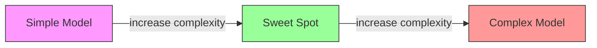
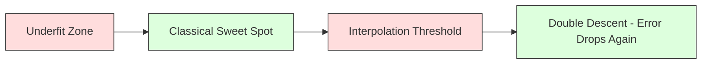
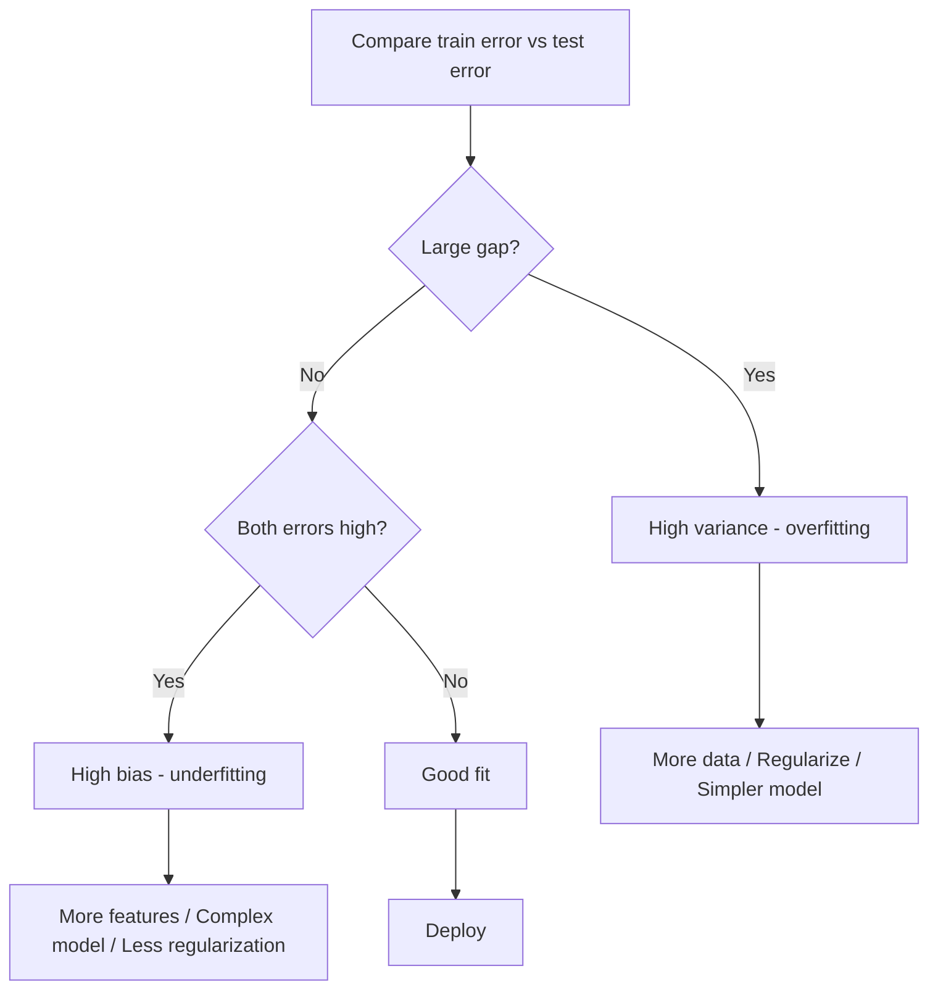
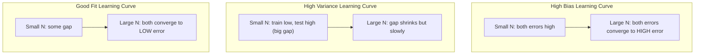
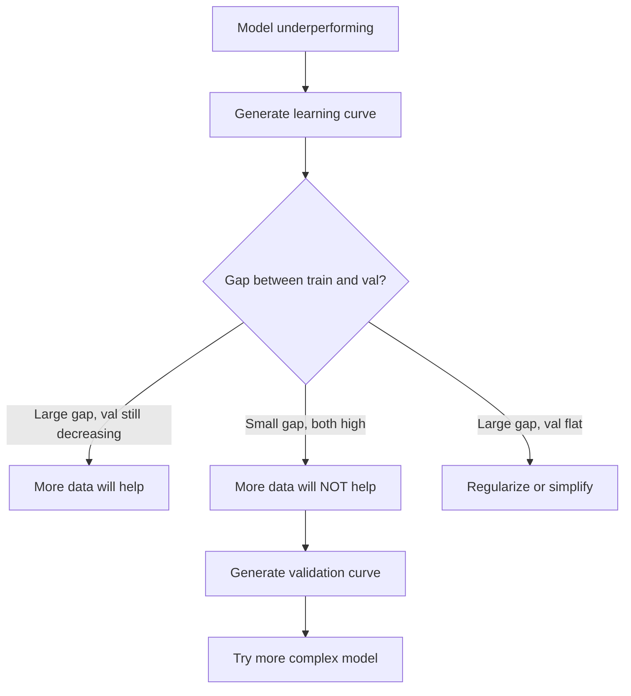

# التجارة المتعددة التغيرات

> كل خطأ نموذجي يأتي من أحد المصادر الثلاثة: التحيز، التباين، أو الضجيج. يمكنك التحكم فقط في أول اثنين.

**Type:** Learn
**Language:**بايثون
**Prerequisites:** Phase 2, Lessons 01-09 (ML basics, regression, classification, evaluation)
**Time:** ~75 minutes

## أهداف التعلم

- استنباط تحلل التباين المتوقع لخطأ التنبؤ وتفسير دور الضوضاء غير القابلة للتقليل
- التشخيص ما إذا كان النموذج يعاني من التحيز العالي أو التباين العالي باستخدام أنماط خطأ التدريب والاختبار
- شرح كيفية تقنيات التنظيم (L1، L2، الإقلاع، التوقف المبكر) التجارة التحيز للتباين
- تنفيذ التجارب التي تظهر التداول بين التفاوتات بين النماذج المتزايدة التعقيد

## المشكلة

لقد تدربت نموذجاً، لديه خطأ في بيانات التجارب، من أين يأتي هذا الخطأ؟

إذا كان نموذجك بسيطًا جدًا (التراجع الخطي على مجموعة بيانات متجاوزة) ، فسوف يفوت بشكل ثابت النمط الحقيقي. وهذا التحيز. إذا كان نموذجك معقدًا جدًا (عدد العدد من درجات 20 على 15 نقطة بيانات) ، فسوف يتناسب مع بيانات التدريب بشكل مثالي ولكن يعطي توقعاتًا مختلفة للغاية على البيانات الجديدة. وهذا هو التباين.

لا يمكنك تقليل كلا في نفس الوقت لمقدمة نموذج ثابتة. دفع التحيز إلى أسفل وتزايد التباين. دفع التباين إلى أسفل وتزايد التباين. فهم هذا التنازل هو المهارة التشخيصية الوحيدة الأكثر فائدة في التعلم الآلي. يخبرك ما إذا كان يجب أن تجعل نموذجك أكثر تعقيدا أو أقل تعقيدا، سواء للحصول على المزيد من البيانات أو هندسة ميزات أفضل، سواء للتنظيم أكثر أو أقل.

## المفهوم

### التحيزات: خطأ منهجي

يقيّم التحيز مدى عودة متوسط التنبؤات من القيمة الحقيقية. إذا قمت بتدريب نفس النموذج على مجموعة مختلفة من التدريبات المستمدة من نفس التوزيع ومتوسط التنبؤات، فإن التحيز هو الفجوة بين تلك المتوسط والحقيقة.

التحيز العالي يعني أن النموذج صلب جداً لا يمكن التقاط النمط الحقيقي. خط مستقيم يناسب المظلة سوف يفوت دائماً المنحنى، بغض النظر عن كمية البيانات التي تعطيها. هذا غير مناسب.

```
High bias (underfitting):
  Model always predicts roughly the same wrong thing.
  Training error: HIGH
  Test error: HIGH
  Gap between them: SMALL
```

### التباين: حساسية لبيانات التدريب

يُقيّم التباين مدى تغيير توقعاتك عند التدريب على مجموعات فرعية مختلفة من البيانات. إذا كانت التغييرات الصغيرة في مجموعة التدريب تسبب تغييرات كبيرة في النموذج، فإن التباين مرتفع.

التباين العالي يعني أن النموذج يتناسب مع الضجيج في بيانات التدريب، وليس الإشارة الأساسية. سيتدفق تعدد الدرجات 20 عبر كل نقطة التدريب ولكن يتذبذب بشكل وحشي بينها. هذا يزيد من التناسب.

```
High variance (overfitting):
  Model fits training data perfectly but fails on new data.
  Training error: LOW
  Test error: HIGH
  Gap between them: LARGE
```

### التفكك

بالنسبة لأي نقطة x، فإن الخطأ المتوقع للتنبؤ تحت الخسارة المربعة يتحلل بالضبط:

```
Expected Error = Bias^2 + Variance + Irreducible Noise

where:
  Bias^2   = (E[f_hat(x)] - f(x))^2
  Variance = E[(f_hat(x) - E[f_hat(x)])^2]
  Noise    = E[(y - f(x))^2]             (sigma^2)
```

- `f(x)`هو الوظيفة الحقيقية
- `f_hat(x)`هو توقعات نموذجك
- `E[...]`هو التوقعات على مجموعات تدريب مختلفة
- `y`هو العلامة الملاحظة (العمل الحقيقي بالإضافة إلى الضوضاء)

مصطلح الضوضاء لا يمكن تقليصه. لا يوجد نموذج يمكن أن تفعل أفضل من sigma^2 على البيانات الضوضاء. مهمتك هي إيجاد التوازن الصحيح بين التحيز^2 والتشابه.

### تعقيد النموذج مقابل خطأ



المنحنى الكلاسيكى على شكل U:

| Complexity | Bias | Variance | Total Error |
|-----------|------|----------|-------------|
| Too low | HIGH | LOW | HIGH (underfitting) |
| Just right | MODERATE | MODERATE | LOWEST |
| Too high | LOW | HIGH | HIGH (overfitting) |

### التنظيم كسيطرة على التغيرات المتحيزة

التنظيم يزيد عمداً من التحيز لتقليل التباين. إنه يقيّد النموذج حتى لا يستطيع مطاردة الضوضاء.

- **L2 (Ridge):**يقلل من كل الوزن نحو الصفر يحتفظ بكل الخصائص لكنه يقلل من تأثيرها
- **L1 (Lasso):**يدفع بعض الأوزان بالضبط إلى الصفر يقوم بإجراء اختيار الميزات
- **Dropout:**يُعيق العصبية بشكل عشوائي أثناء التدريب، ويُجبر على التمثيلات الزائدة.
- **Early stopping:**يتوقف التدريب قبل أن يتناسب النموذج بالكامل مع بيانات التدريب.

قوة التنظيم (lambda، معدل الانقطاع، عدد الفترات) تحكم مباشرة أين تجلس على منحنى التأثير والتبديل.

### النزول المزدوج: وجهة النظر الحديثة

تقول النظرية الكلاسيكية: بعد نقطة الحلوة، فإن التعقيد أكثر يؤلم دائماً. ولكن الأبحاث منذ عام 2019 أظهرت شيئاً غير متوقع. إذا استمررت في زيادة قدرة النموذج بعيدًا عن عتبة التقاطع (حيث يكون لدى النموذج ما يكفي من المعلمات لتتناسب مع بيانات التدريب بشكل مثالي) ، يمكن أن ينخفض خطأ التحقق مرة أخرى.



هذه الظاهرة "النزول المزدوج" تفسر لماذا الشبكات العصبية المفرطة بشكل كبير (مع أكثر بكثير من المعلمات من أمثلة التدريب) لا تزال تعميمًا جيدًا. التنازل الكلاسيكي عن التبعيض والتبديل ليس خطأً ، لكنه غير كامل للنظام الحديث.

الملاحظات الرئيسية حول الانخفاض المزدوج:
- يحدث في النماذج الخطية، شجرة القرار، وشبكات العصبية
- يمكن أن تؤذي المزيد من البيانات في منطقة التقاط النقاط (النزول المزدوج على نحو نموذجي)
- يمكن أن تسبب المزيد من فترات التدريب أيضا (النزول المزدوج في معنى العصر)
- التنظيم يُسطح ذروته لكن لا يُزيلها

لماذا يحدث هذا؟ عند عتبة التقاطع، يكون لدى النموذج قدرة كافية لتلائم جميع نقاط التدريب. يتم إضطلاعه إلى حل محدد جداً يمر عبر كل نقطة، وتسبب اضطرابات صغيرة في البيانات تغييرات كبيرة في التكيف. هنا حيث تصل النقاشات إلى ذروتها بعد هذا الحد، يحتوي النموذج على العديد من الحلول المحتملة التي تناسب البيانات بشكل مثالي. خوارزمية التعلم (على سبيل المثال، انخفاض التدفق مع التنظيم الضمني) تميل إلى اختيار أبسط واحد منهم. هذا التحيز الضمني نحو الحلول البسيطة هو السبب في أن النماذج المفروضة على المعايير تتعميم.

| Regime | Parameters vs Samples | Behavior |
|--------|----------------------|----------|
| Underparameterized | p << n | Classical tradeoff applies |
| Interpolation threshold | p ~ n | Variance peaks, test error spikes |
| Overparameterized | p >> n | Implicit regularization kicks in, test error drops |

لأغراض عملية: إذا كنت تستخدم شبكات عصبية أو مجموعات شجرة كبيرة، لا تتوقف عند عتبة التقاطع. إما البقاء أقل بكثير من ذلك (مع تنظيم صريح) أو تجاوزها. أسوأ مكان لتكون هو مباشرة عند العتبة.

### تشخيص نموذجك



| Symptom | Diagnosis | Fix |
|---------|-----------|-----|
| High train error, high test error | Bias | More features, complex model, less regularization |
| Low train error, high test error | Variance | More data, regularization, simpler model, dropout |
| Low train error, low test error | Good fit | Ship it |
| Train error decreasing, test error increasing | Overfitting in progress | Early stopping |

### استراتيجيات عملية

**When bias is the problem:**
- إضافة ميزات متعددة النظرية أو التفاعل
- استخدم نموذج أكثر مرونة (مجموعة الأشجار بدلاً من خطية)
- تقليل قوة التنظيم
- القطار أطول (إذا لم يتحرك بعد)

**When variance is the problem:**
- الحصول على المزيد من البيانات التدريبية
- استخدام التسريب (الغابات العشوائية)
- زيادة التنظيم (اللامبدا العالي، والمزيد من التوقف)
- اختيار الميزات (إزالة الميزات الضوضاء)
- استخدم التحقق المتقاطع للكشف عنه في وقت مبكر

### تجميع الطرق وتقليل التباين

أساليب الجمع هي الأداة الأكثر عملية لمحاربة التباين.

**Bagging (Bootstrap Aggregating)**يقوم بتدريب نماذج متعددة على عينات مختلفة من البث التدريبي من بيانات التدريب ، ثم يُمتوسط توقعاتهم. لكل نموذج فردي اختلاف كبير ، ولكن متوسط لديه اختلاف أقل بكثير. الغابات العشوائية تطبق على أشجار القرار.

لماذا يعمل بشكل رياضي: إذا كنت تقارن N التنبؤات المستقلة، كل مع التباين sigma^2, فإن التباين من المتوسط هو sigma^2 / N. النماذج ليست مستقلة حقا (كل منهم يرى بيانات مماثلة) ، لذلك الارتفاع أقل من 1/N، ولكنه لا يزال كبيرا.

**Boosting**يقلل من التحيز من خلال بناء النماذج بشكل متسلسل ، حيث يركز كل نموذج جديد على أخطاء الجمع حتى الآن. تعزيز التدريجية و AdaBoost هي الأمثلة الرئيسية. يمكن أن يزداد تعزيز إذا أضفت العديد من النماذج ، لذلك تحتاج إلى وقف مبكر أو تنظيم.

| Method | Primary Effect | Bias Change | Variance Change |
|--------|---------------|-------------|-----------------|
| Bagging | Reduces variance | No change | Decreases |
| Boosting | Reduces bias | Decreases | Can increase |
| Stacking | Reduces both | Depends on meta-learner | Depends on base models |
| Dropout | Implicit bagging | Slight increase | Decreases |

**Practical rule:**إذا كان نموذج الأساس الخاص بك لديه اختلاف كبير (شجرة عميقة، متعددة النقاط عالية الدرجة) ، استخدم التعبئة. إذا كان نموذج الأساس الخاص بك لديه تحيز كبير (أحذية ضئيلة، نماذج خطية بسيطة) ، استخدم تعزيز.

### منحنى التعلم

تعبر منحنى التعلم عن خطأ التدريب والتحقق من التحقق من التحقق من التحقق من التحقق من التحقق من التحقق من التحقق من التحقق من التحقق من التحقق من التحقق من التحقق من التحقق من التحقق من التحقق من التحقق من التحقق من التحقق من التحقق من التحقق من التحقق من التحقق من التحقق من التحقق من التحقق من التحقق من التحقق من التحقق من التحقق من التحقق من التحقق من التحقق من التحقق من التحقق من التحقق من التحقق من التحقق من التحقق من التحقق من التحقق من التحقق من التحقق من التحقق من التحقق من التحقق من التحقق من التحقق من التحقق من التحقق من التحقق من التحقق من التحقق من التحقق من التحقق من التحقق من التحقق من التحقق من التحقق من التحقق من التحقق من التحقق من التحقق من التحقق من التحقق من التحقق من التحقق من التحقق من التحقق من التحقق من التحقق من التحقق من التحقق من التحقق من التحقق من التحقق من التحقق من التحقق من التحقق.



كيف تقرأها:

| Scenario | Training Error | Validation Error | Gap | What It Means | What to Do |
|----------|---------------|-----------------|-----|---------------|------------|
| High bias | High | High | Small | Model cannot capture the pattern | More features, complex model, less regularization |
| High variance | Low | High | Large | Model memorizes training data | More data, regularization, simpler model |
| Good fit | Moderate | Moderate | Small | Model generalizes well | Ship it |
| High variance, improving | Low | Decreasing with more data | Shrinking | Variance problem that data can fix | Collect more data |
| High bias, flat | High | High and flat | Small and flat | More data will NOT help | Change model architecture |

المفهوم الحاسم: إذا كانت كل من المنحنيات قد استقر والفجوة صغيرة ولكن كل من الأخطاء كبيرة، فإن المزيد من البيانات لا فائدة منها. تحتاج إلى نموذج أفضل. إذا كانت الفجوة كبيرة وما زالت تقلص، فإن المزيد من البيانات ستساعد.

### كيفية خلق منحنى التعلم

هناك طريقتان:

**Approach 1: Vary training set size, fixed model.**حافظ على نموذج وفرامترات المعدات العالية ثابتة. تدريب على مجموعات فرعية كبيرة متزايدة من بيانات التدريب. قياس خطأ التدريب وأخطاء التحقق من التحقق من التحقق من التحقق من التحقق من التحقق من التحقق من التحقق من التحقق من التحقق من التحقق من التحقق من التحقق من التحقق من التحقق من التحقق من التحقق من التحقق من التحقق من التحقق من التحقق من التحقق من التحقق من التحقق من التحقق من التحقق من التحقق من التحقق من التحقق من التحقق من التحقق من التحقق من التحقق من التحقق من التحقق من التحقق من التحقق من التحقق من التحقق من التحقق من التحقق من التحقق من التحقق من التحقق من التحقق من التحقق من التحقق من التحقق من التحقق من التحقق من التحقق من التحقق.

**Approach 2: Vary model complexity, fixed data.**حافظ على ثابتة البيانات. مسح معايير التعقيد (درجة الكتلة، عمق الشجرة، عدد الطبقات). قياس خطأ التدريب وأخطاء التحقق من التحقق من التحقق من التحقق من التحقق من التحقق من التحقق من التحقق من التحقق من التحقق من التحقق من التحقق من التحقق من التحقق من التحقق من التحقق من التحقق من التحقق من التحقق من التحقق من التحقق من التحقق من التحقق من التحقق من التحقق من التحقق من التحقق من التحقق من التحقق من التحقق من التحقق من التحقق من التحقق من التحقق من التحقق من التحقق من التحقق من التحقق من التحقق من التحقق من التحقق من التحقق من التحقق من التحقق من التحقق من التحقق من التحقق من التحقق من التحقق من التحقق من التحقق من التحقق من التحقق من التحقق من التحقق من التحقق من التحققق من التحقق من التحقق.

كل منهج يكمّل الآخر. الأول يخبرك ما إذا كانت المزيد من البيانات ستساعدك. الثاني يخبرك ما إذا كان نموذج مختلف سيساعدك. اجري كلا منهما قبل اتخاذ قرارات حول خطوتك التالية.



```figure
bias-variance
```

## بناءها

الرمز في`code/bias_variance.py`يقوم بتجربة التفكيك الكامل للتحيز.

### الخطوة الأولى: توليد بيانات اصطناعية من وظيفة معروفة

نحن نستخدم`f(x) = sin(1.5x) + 0.5x`مع ضجيج غوسيان. معرفة الوظيفة الحقيقية يسمح لنا بحساب التحيز الدقيق والتشابه.

```python
def true_function(x):
    return np.sin(1.5 * x) + 0.5 * x

def generate_data(n_samples=30, noise_std=0.5, x_range=(-3, 3), seed=None):
    rng = np.random.RandomState(seed)
    x = rng.uniform(x_range[0], x_range[1], n_samples)
    y = true_function(x) + rng.normal(0, noise_std, n_samples)
    return x, y
```

### الخطوة الثانية: أخذ عينات من القفص والتناسب بالعدد المتعدد

لكل درجة متعددة النقاط، نقوم بسحب العديد من مجموعات تدريب البث، والتناسب مع متعددة النقاط، وتسجيل التنبؤات على شبكة اختبار ثابتة. وهذا يعطينا توزيع التنبؤات في كل نقطة اختبار.

```python
def fit_polynomial(x_train, y_train, degree, lam=0.0):
    X = np.column_stack([x_train ** d for d in range(degree + 1)])
    if lam > 0:
        penalty = lam * np.eye(X.shape[1])
        penalty[0, 0] = 0
        w = np.linalg.solve(X.T @ X + penalty, X.T @ y_train)
    else:
        w = np.linalg.lstsq(X, y_train, rcond=None)[0]
    return w
```

نحن نتناسب على 200 عينة مختلفة من الشرائح الناشئة. كل عينة من الشرائح الناشئة يتم استخدامه من نفس التوزيع الأساسي ولكن يحتوي على نقاط مختلفة.

### الخطوة الثالثة: حساب التحيز^2، تدهور التباين

مع 200 مجموعة من التنبؤات في كل نقطة اختبار، يمكننا حساب التفكك مباشرة من التعريف:

```python
mean_pred = predictions.mean(axis=0)
bias_sq = np.mean((mean_pred - y_true) ** 2)
variance = np.mean(predictions.var(axis=0))
total_error = np.mean(np.mean((predictions - y_true) ** 2, axis=1))
```

- `mean_pred`هل E[f_hat(x)] تم تقديرها من عينات البث
- `bias_sq`هو الفجوة المربعة بين المتوسط التنبؤ والحقيقة
- `variance`هو متوسط انتشار التنبؤات عبر عينات البوتستراب
- `total_error`يجب أن يكون التوجه تقريباً متساوياً^2 + التباين + الضجيج

### الخطوة الرابعة: منحنى التعلم

منحنى التعلم تُحذف حجم مجموعة التدريب مع الحفاظ على تعقيد النموذج ثابتًا. فإنها تُظهر ما إذا كان نموذجك محدودًا بالبيانات أو محدودًا بالقدرة.

```python
def demo_learning_curves():
    sizes = [10, 15, 20, 30, 50, 75, 100, 150, 200, 300]
    degree = 5

    for n in sizes:
        train_errors = []
        test_errors = []
        for seed in range(50):
            x_train, y_train = generate_data(n_samples=n, seed=seed * 100)
            w = fit_polynomial(x_train, y_train, degree)
            train_pred = predict_polynomial(x_train, w)
            train_mse = np.mean((train_pred - y_train) ** 2)
            test_pred = predict_polynomial(x_test, w)
            test_mse = np.mean((test_pred - y_test) ** 2)
            train_errors.append(train_mse)
            test_errors.append(test_mse)
        # Average over runs gives the learning curve point
```

بالنسبة لنموذج عالي التباين (درجة 5 مع بيانات صغيرة) ، ترى:
- خطأ التدريب يبدأ منخفضًا ويزداد مع زيادة البيانات يجعل الذاكرة أصعب
- خطأ الاختبار يبدأ عاليا و ينخفض مع نموذج الحصول على المزيد من الإشارة
- الفجوة تقلص مع المزيد من البيانات

بالنسبة لنموذج ذو التحيز العالي (درجة 1) ، تتقارب الأخطاء بسرعة إلى نفس القيمة العالية ، ولا يساعد المزيد من البيانات.

### الخطوة 5: مسح التأقلم

القانون يتضمن أيضاً`demo_regularization_sweep()`، الذي يصلح تعدد درجة عالية (درجة 15) ويقوم بتصفية قوة التنظيم من 0.001 إلى 100. هذا يظهر التداول بين التباعد والتبديل من زاوية مختلفة: بدلا من تغيير تعقيد النموذج، نقوم بتغيير قوة القيود.

```python
def demo_regularization_sweep():
    alphas = [0.001, 0.005, 0.01, 0.05, 0.1, 0.5, 1.0, 5.0, 10.0, 50.0, 100.0]
    for alpha in alphas:
        results = bias_variance_decomposition([15], lam=alpha)
        r = results[15]
        print(f"alpha={alpha:.3f}  bias={r['bias_sq']:.4f}  var={r['variance']:.4f}")
```

في النموذج الألفي المنخفض، يكون تعدد الدرجة 15 غير مقيد تقريبا. يهيمن التباين لأن النموذج يطارد الضوضاء في كل عينة من أشكال التشغيل. في النموذج الألفي العالي، تكون العقوبة قوية جدًا بحيث يصبح النموذج فعلياً وظيفة ثابتة تقريبًا. يهيمن التحيز. يقع النموذج الأمثل بين هذه التطرفات.

هذا هو نفس منحنى U من درجة متعددة الكلمات المتغيرة ، ولكن يتم التحكم فيه بواسطة زر متواصل بدلاً من واحد منفصل. في الممارسة العملية ، تعد التنظيم الطريقة المفضلة لتحكم التداول لأنه يسمح بالتحكم في الحبوب الدقيقة دون تغيير مجموعة الميزات.

## استخدمها

يقدم sklearn `learning_curve`و`validation_curve`لتلقيح هذه التشخيصات دون كتابة حلقات التشغيل.

### منحنى التحقق من الصحة: تعقيد نموذج التنظيف

```python
from sklearn.model_selection import validation_curve
from sklearn.pipeline import make_pipeline
from sklearn.preprocessing import PolynomialFeatures
from sklearn.linear_model import Ridge

degrees = list(range(1, 16))
train_scores_all = []
val_scores_all = []

for d in degrees:
    pipe = make_pipeline(PolynomialFeatures(d), Ridge(alpha=0.01))
    train_scores, val_scores = validation_curve(
        pipe, X, y, param_name="polynomialfeatures__degree",
        param_range=[d], cv=5, scoring="neg_mean_squared_error"
    )
    train_scores_all.append(-train_scores.mean())
    val_scores_all.append(-val_scores.mean())
```

هذا يعطي لك منحنى التداول بين التباين والتحيز مباشرة حيث تكون النتيجة الموثقة أسوأ نسبياً إلى النتيجة المتدربة، يتهيمن التباين. حيث يكون كلاهما سيئاً، يتهيمن التباين.

### منحنى التعلم: حجم مجموعة التدريب

```python
from sklearn.model_selection import learning_curve

pipe = make_pipeline(PolynomialFeatures(5), Ridge(alpha=0.01))
train_sizes, train_scores, val_scores = learning_curve(
    pipe, X, y, train_sizes=np.linspace(0.1, 1.0, 10),
    cv=5, scoring="neg_mean_squared_error"
)
train_mse = -train_scores.mean(axis=1)
val_mse = -val_scores.mean(axis=1)
```

قصة`train_mse`و`val_mse`ضد`train_sizes`الشكل يخبرك بكل شيء عن نموذجك

### التحقق المتقاطع مع مسح التنظيم

```python
from sklearn.model_selection import cross_val_score

alphas = [0.001, 0.01, 0.1, 1.0, 10.0, 100.0]
for alpha in alphas:
    pipe = make_pipeline(PolynomialFeatures(10), Ridge(alpha=alpha))
    scores = cross_val_score(pipe, X, y, cv=5, scoring="neg_mean_squared_error")
    print(f"alpha={alpha:>7.3f}  MSE={-scores.mean():.4f} +/- {scores.std():.4f}")
```

هذا يصفح قوة التنظيم لمعقدة النموذج الثابت. سترى نفس التداول بين التباعد والبديل: الفا المنخفضة تعني التباعد العالي، الفا العالي يعني التباعد العالي.

### جمع كل شيء معاً: عملية تشخيص كاملة

في الممارسة العملية، تقوم بتشخيص هذه التشخيصات بالتسلسل:

1. قم بتدريب نموذجك، احسب خطأ التدريب واختبارك
2. إذا كانت كلاهما مرتفعة، لديك مشكلة التحيز. قفز إلى الخطوة 4.
3. إذا كان القطار منخفضًا ولكن الاختبار مرتفعًا: لديك مشكلة التباين. قم بتوليد منحنى تعلم لمعرفة ما إذا كانت المزيد من البيانات ستساعد. إذا لم يكن كذلك، قم بتعيين التطبيق.
4. إنشأ منحنى التحقق من المكثفة الرئيسية، و ابحث عن نقطة الحلوة
5. في نقطة اللطيفة، قم بتوليد منحنى التعلم. إذا كانت الفجوة لا تزال كبيرة، تحتاج إلى المزيد من البيانات أو التنظيم.
6. حاول Ridge/ Lasso مع قيم ألفا مختلفة باستخدام `cross_val_score`اختر ألفا حيث يكون خطأ التحقق من الصلاحية المتقاطعة أقل

هذا يستغرق 10-15 دقيقة من الحساب لمعظم مجموعات البيانات الجدولية ويوفر ساعات من التخمين.

## أرسله

هذا الدرس ينتج عن:`outputs/prompt-model-diagnostics.md`

## التمارين

1. إشغلي عملية التفكك مع `noise_std=0`ما الذي يحدث مع مصطلح الخطأ غير المقلل؟ هل تتغير التعقيد المثالي؟

2. زيادة حجم مجموعة التدريب من 30 إلى 300. كيف يؤثر هذا على مكون التباين؟ هل يتحول المستوى الكلي المثالي؟

3. إضافة L2 التنظيم (رجج رجعة) إلى التجربة. بالنسبة لعدد متعدد درجة عالية ثابتة (درجة 15) ، مسح lambda من 0 إلى 100.

4. تعديل الوظيفة الحقيقية من تعدد إلى `sin(x)`كيف يتغير تدهور التضارب المتغير؟ هل لا يزال هناك درجة مثالية واضحة؟

5. تنفيذ لفئة جمعية (التخلف) بسيطة لشرطة التشغيل: تدريب 10 نماذج على عينات الشرائط التشغيل والتنبؤات المتوسطة. أظهر أن هذا يقلل من التباين دون زيادة التحيز كثيرا.

## الشروط الرئيسية

| Term | What people say | What it actually means |
|------|----------------|----------------------|
| Bias | "The model is too simple" | Systematic error from wrong assumptions. The gap between the average model prediction and truth. |
| Variance | "The model is overfitting" | Error from sensitivity to training data. How much predictions change across different training sets. |
| Irreducible error | "Noise in the data" | Error from randomness in the true data-generating process. No model can eliminate it. |
| Underfitting | "Not learning enough" | Model has high bias. It misses the real pattern even on training data. |
| Overfitting | "Memorizing the data" | Model has high variance. It fits noise in training data that does not generalize. |
| Regularization | "Constraining the model" | Adding a penalty to reduce model complexity, trading bias for lower variance. |
| Double descent | "More parameters can help" | Test error decreases again when model capacity far exceeds the interpolation threshold. |
| Model complexity | "How flexible the model is" | The capacity of a model to fit arbitrary patterns. Controlled by architecture, features, or regularization. |

## المزيد من القراءة

- [Hastie, Tibshirani, Friedman: Elements of Statistical Learning, Ch. 7](https://hastie.su.domains/ElemStatLearn/)-- المعالجة النهائية لتحلل التفاوت التفاوتية
- [Belkin et al., Reconciling modern machine learning practice and the bias-variance trade-off (2019)](https://arxiv.org/abs/1812.11118)- ورقة التنزل المزدوجة
- [Nakkiran et al., Deep Double Descent (2019)](https://arxiv.org/abs/1912.02292)-- التراجع المزدوج حسب العصر والعينة
- [Scott Fortmann-Roe: Understanding the Bias-Variance Tradeoff](http://scott.fortmann-roe.com/docs/BiasVariance.html)-- تفسير بصري واضح
