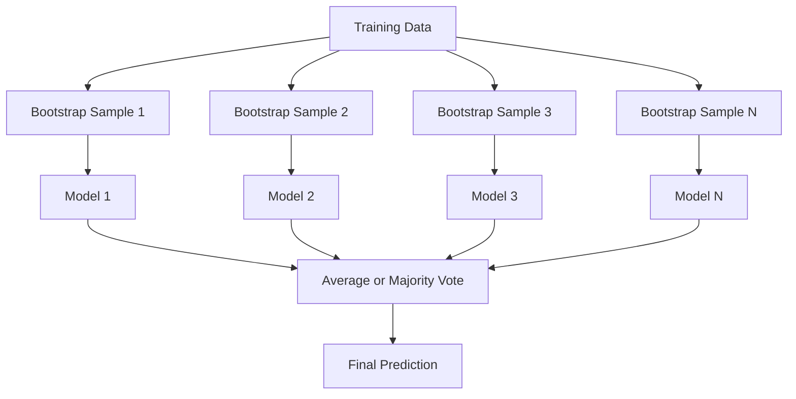
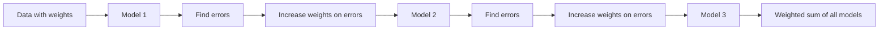
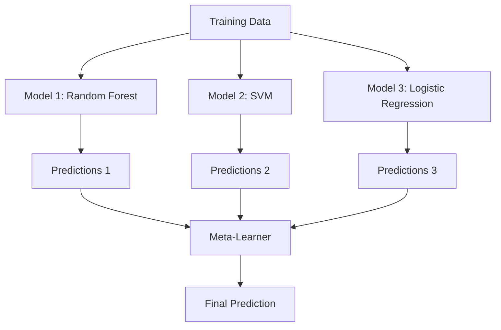

# تجميع الطرق

> مجموعة من المتعلمين الضعفاء، إذا تم دمجها بشكل صحيح، يصبح متعلم قوي. هذه ليست استعارية. إنها نظرية.

**Type:** Build
**Language:**بايثون
**Prerequisites:** Phase 2, Lesson 10 (Bias-Variance Tradeoff)
**Time:** ~120 minutes

## أهداف التعلم

- تنفيذ AdaBoost وتعزيز التدفق من الصفر وتشرح كيفية تعزيز التسلسل يقلل من التحيز
- بناء مجموعة التعبئة وتوضيح كيفية تقليل المتوسطات المتحولة للنموذج دون زيادة التحيز
- مقارنة التعبئة والتحفيز والترتيب من حيث أي مكونات الخطأ تهدف كل طريقة
- تقييم تنوع المجموعة وتفسير لماذا تحسن دقة التصويت الأغلبية مع متعلمين ضعفاء أكثر استقلالية

## المشكلة

شجرة قرار واحدة سريعة التدريب وسهلة التفسير، ولكنها تتجاوز. النموذج الخطي واحد لا يناسب حدود معقدة. يمكنك قضاء أيام في تصميم بنية النموذج المثالية. أو يمكنك دمج مجموعة من النماذج غير الكاملة والحصول على شيء أفضل من أي منهم بشكل فردي.

تقارير الجمع تفعل هذا بالضبط. إنها التقنية الأكثر موثوقية للفوز في مسابقات كاغل على بيانات الجدول ، وهي تعمل على تشغيل معظم أنظمة ML الإنتاجية ، وتوضح التداول بين التباين والفرق في العمل. يقلل التباين. يقلل التزايد من التباين. يتعلم التجميع أي نماذج يجب الوثوق بها في أي مدخلات.

## المفهوم

### لماذا تعمل المجموعات

لنفترض أن لديك N مصنفين مستقلين، كل منهم دقة p > 0.5.

```
P(majority correct) = sum over k > N/2 of C(N,k) * p^k * (1-p)^(N-k)
```

بالنسبة لـ 21 تصنيفًا يبلغ دقة 60٪ لكل منهما ، فإن دقة الأصوات الأغلبية حوالي 74٪. مع 101 تصنيفًا ، يرتفع إلى 84٪. يتم إلغاء الأخطاء عندما تقوم النماذج بخطاء مختلفة.

الاحتياج الرئيسي هو**diversity**إذا كانت جميع النماذج تتعرض لنفس الأخطاء، فإن الجمع بينها لا يساعد على شيء.

- مجموعة فرعية مختلفة من التدريب (التخلف)
- مجموعة فرعية مختلفة من الميزات (غابات عشوائية)
- تصحيح الخطأ التالي (تعزيز)
- عائلات النماذج المختلفة (الترتيب)

### التجميع (التجميع من الشريط)

يخلق التعبئة التنوع عن طريق تدريب كل نموذج على عينة مختلفة من بيانات التدريب.



يتم رسم عينة منقطعة التشغيل مع استبدال من البيانات الأصلية ، نفس الحجم من الأصلي. حوالي 63.2% من العينات الفريدة تظهر في كل قطعة التشغيل. يقدم الباقي 36.8% (عينات خارج الحقيبة) مجموعة التحقق المجانية.

يقلل التعبئة من التباين دون زيادة التحيزات كثيرا. كل شجرة فردية تتجاوز عينتها من الشريط الناشئ، ولكن التجاوز مختلف لكل شجرة، لذلك يُلغي متوسط الضوضاء.

**Random Forests**يتم تعديل هذه الميزات مع تدوير إضافي: في كل انقسام، يتم النظر في مجموعة فرعية عشوائية فقط من الخصائص. وهذا يؤدي إلى زيادة التنوع بين الأشجار.`sqrt(n_features)`للتصنيف و`n_features / 3`للعودة

### تعزيز (تصحيح الخطأ التسلسلي)

تعزيز نماذج القطارات تسلسلياً. كل نموذج جديد يركز على الأمثلة التي أخطأت فيها النماذج السابقة.



يقلل تعزيز التوتر. كل نموذج جديد يصحح الأخطاء المنهجية للمجموعة حتى الآن. التنبؤ النهائي هو جمع موازنة لجميع النماذج، حيث تحصل النماذج الأفضل على وزنهما أعلى.

المكافأة: يمكن أن يزداد التكيف إذا قمت بتشغيل الكثير من الجولات، لأنه يواصل تكييف الأمثلة الأصعب، بعضها قد يكون ضجيجا.

### إدارة

كان AdaBoost (التعزيز التكيفي) أول خوارزمية تعزيز عملية. يعمل مع أي متعلم أساسي ، عادةً أساس القرارات (شجرة عمق-1).

الخوارزمية:

```
1. Initialize sample weights: w_i = 1/N for all i

2. For t = 1 to T:
   a. Train weak learner h_t on weighted data
   b. Compute weighted error:
      err_t = sum(w_i * I(h_t(x_i) != y_i)) / sum(w_i)
   c. Compute model weight:
      alpha_t = 0.5 * ln((1 - err_t) / err_t)
   d. Update sample weights:
      w_i = w_i * exp(-alpha_t * y_i * h_t(x_i))
   e. Normalize weights to sum to 1

3. Final prediction: H(x) = sign(sum(alpha_t * h_t(x)))
```

النماذج التي لديها أخطاء أقل تحصل على ألفا أعلى. العينات التي يتم تصنيفها بشكل خاطئ تحصل على وزنها أعلى حتى النموذج التالي يركز على ذلك.

### زيادة تدريجية

تعزيز التدريج يجميع التدريج إلى وظائف الخسارة التعسفية. بدلاً من إعادة وزن العينات، فإنه يتناسب مع كل نموذج جديد إلى بقايا (التدريج السلبي للخسارة) من الجمع الحالي.

```
1. Initialize: F_0(x) = argmin_c sum(L(y_i, c))

2. For t = 1 to T:
   a. Compute pseudo-residuals:
      r_i = -dL(y_i, F_{t-1}(x_i)) / dF_{t-1}(x_i)
   b. Fit a tree h_t to the residuals r_i
   c. Find optimal step size:
      gamma_t = argmin_gamma sum(L(y_i, F_{t-1}(x_i) + gamma * h_t(x_i)))
   d. Update:
      F_t(x) = F_{t-1}(x) + learning_rate * gamma_t * h_t(x)

3. Final prediction: F_T(x)
```

بالنسبة لخسارة الخطأ المربع ، فإن البقايا الزائفة هي البقايا الفعلية فقط: `r_i = y_i - F_{t-1}(x_i)`كل شجرة تطابق حرفياً أخطاء الجمعية السابقة

معدل التعلم (التقلص) يتحكم في مقدار المساهمة لكل شجرة. تتطلب معدلات التعلم الأصغر المزيد من الأشجار ولكن تتعمق بشكل أفضل. القيم النموذجية: 0.01 إلى 0.3.

### XGBoost: لماذا يهيمن على بيانات الجدول

XGBoost (eXtreme Gradient Boosting) هو تعزيز التدفق مع تحسينات هندسية تجعله سريع ودقيق ومقاوم للضغط الزائد:

- **Regularized objective:**عقوبات L1 و L2 على أوزان الأوراق تمنع الأشجار الفردية من أن تكون واثقة جدا
- **Second-order approximation:**يستخدم المشتقات الأولى والثانية للخسارة، مما يمنح أفضل قرارات تقسيم
- **Sparsity-aware splits:**يتعامل مع القيم المفقودة بشكل طبيعي من خلال تعلم أفضل اتجاه للبيانات المفقودة في كل تقسيم
- **Column subsampling:**مثل الغابات العشوائية، تميز العينات في كل فصلا للتنوع
- **Weighted quantile sketch:**يجد بشكل فعال نقاط الانقسام لميزات مستمرة على البيانات الموزعة
- **Cache-aware block structure:**ترتيب الذاكرة المحسن لخطوط التخزين المتخزين لـ CPU

بالنسبة للبيانات الجدولية، فإن XGBoost (ومتحليها LightGBM) يتفوق باستمرار على الشبكات العصبية. هذا لن يتغير في أي وقت قريب. إذا تناسب بياناتك جدولًا يحتوي على صفوف وعمدات، فابدأ بتعزيز التدفق.

### التجميع (التعلم المتوسط)

يستخدم التجميع التنبؤات من نماذج أساسية متعددة كميزات للمتعلّم المتحول.



يتعلم المتعلم الأساسي ما النموذج الأساسي الذي يجب الوثوق به من أجل أي مدخلات. إذا كانت الغابة العشوائية أفضل في مناطق معينة والسي.إف.م في مناطق أخرى، سيتعلم المتعلم التعلمي التوجيه وفقا لذلك.

لتجنب تسرب البيانات، يجب إنشاء التنبؤات النموذج الأساسي عن طريق التحقق من التحقق من التحقق من التحقق من التحقق من التحقق من التحقق من التحقق من التحقق من التحقق من التحقق من التحقق من التحقق من التحقق من التحقق من التحقق من التحقق من التحقق من التحقق من التحقق من التحقق من التحقق من التحقق من التحقق من التحقق من التحقق من التحقق من التحقق من التحقق من التحقق من التحقق من التحقق من التحقق من التحقق من التحقق من التحقق من التحقق من التحقق من التحقق من التحقق من التحقق من التحقق من التحقق من التحقق من التحقق من التحقق من التحقق من التحقق من التحقق من التحقق من التحقق من التحققق من التحققق من التحققق من التحقققق من التحقققق من التحققققق من التحقققق من التحققققق من التحقققققق من التحقققققق.

### التصويت

أسهل مجموعة، فقط مزج التنبؤات مباشرة

- **Hard voting:**التصويت الأغلبية على علامات الفصل
- **Soft voting:**متوسط الاحتمالات المتوقعة، اختر الفئة ذات أعلى احتمالات متوسط عادة أفضل لأنه يستخدم معلومات الثقة.

```figure
f3-ensemble-average
```

## بناءها

### الخطوة الأولى: القرار (المعلم الأساسي)

الرمز في`code/ensembles.py`يطبق كل شيء من الصفر. نبدأ مع جذع قرار: شجرة مع شق واحد.

```python
class DecisionStump:
    def __init__(self):
        self.feature_idx = None
        self.threshold = None
        self.polarity = 1
        self.alpha = None

    def fit(self, X, y, weights):
        n_samples, n_features = X.shape
        best_error = float("inf")

        for f in range(n_features):
            thresholds = np.unique(X[:, f])
            for thresh in thresholds:
                for polarity in [1, -1]:
                    pred = np.ones(n_samples)
                    pred[polarity * X[:, f] < polarity * thresh] = -1
                    error = np.sum(weights[pred != y])
                    if error < best_error:
                        best_error = error
                        self.feature_idx = f
                        self.threshold = thresh
                        self.polarity = polarity

    def predict(self, X):
        n = X.shape[0]
        pred = np.ones(n)
        idx = self.polarity * X[:, self.feature_idx] < self.polarity * self.threshold
        pred[idx] = -1
        return pred
```

### الخطوة الثانية: إضافة AdaBoost من الصفر

```python
class AdaBoostScratch:
    def __init__(self, n_estimators=50):
        self.n_estimators = n_estimators
        self.stumps = []
        self.alphas = []

    def fit(self, X, y):
        n = X.shape[0]
        weights = np.full(n, 1 / n)

        for _ in range(self.n_estimators):
            stump = DecisionStump()
            stump.fit(X, y, weights)
            pred = stump.predict(X)

            err = np.sum(weights[pred != y])
            err = np.clip(err, 1e-10, 1 - 1e-10)

            alpha = 0.5 * np.log((1 - err) / err)
            weights *= np.exp(-alpha * y * pred)
            weights /= weights.sum()

            stump.alpha = alpha
            self.stumps.append(stump)
            self.alphas.append(alpha)

    def predict(self, X):
        total = sum(a * s.predict(X) for a, s in zip(self.alphas, self.stumps))
        return np.sign(total)
```

### الخطوة الثالثة: تعزيز التدريجية من الصفر

```python
class GradientBoostingScratch:
    def __init__(self, n_estimators=100, learning_rate=0.1, max_depth=3):
        self.n_estimators = n_estimators
        self.lr = learning_rate
        self.max_depth = max_depth
        self.trees = []
        self.initial_pred = None

    def fit(self, X, y):
        self.initial_pred = np.mean(y)
        current_pred = np.full(len(y), self.initial_pred)

        for _ in range(self.n_estimators):
            residuals = y - current_pred
            tree = SimpleRegressionTree(max_depth=self.max_depth)
            tree.fit(X, residuals)
            update = tree.predict(X)
            current_pred += self.lr * update
            self.trees.append(tree)

    def predict(self, X):
        pred = np.full(X.shape[0], self.initial_pred)
        for tree in self.trees:
            pred += self.lr * tree.predict(X)
        return pred
```

### الخطوة الرابعة: مقارنة مع السكلارن

يُحقق الرمز أن عملياتنا التنفيذية من الصفر تنتج دقة مماثلة لتدقيقات شركة Skelarn `AdaBoostClassifier`و`GradientBoostingClassifier`، ويقارن جميع الطرق جنبا إلى جنب

## استخدمها

### متى تستخدم كل طريقة

| Method | Reduces | Best for | Watch out for |
|--------|---------|----------|---------------|
| Bagging / Random Forest | Variance | Noisy data, many features | Does not help with bias |
| AdaBoost | Bias | Clean data, simple base learners | Sensitive to outliers and noise |
| Gradient Boosting | Bias | Tabular data, competitions | Slow to train, easy to overfit without tuning |
| XGBoost / LightGBM | Both | Production tabular ML | Many hyperparameters |
| Stacking | Both | Getting last 1-2% accuracy | Complex, risk of overfitting meta-learner |
| Voting | Variance | Quick combination of diverse models | Only helps if models are diverse |

### كومة الإنتاج للبيانات الجدولية

بالنسبة لمعظم مشاكل التنبؤ الجدولي، هذا هو الترتيب لمحاولة:

1. **LightGBM or XGBoost**مع المعايير الافتراضية
2. تحديد المقياسات، معدل التعلم، أعمق الحد الأقصى، وزن الطفل
3. إذا كنت بحاجة إلى 0.5% الأخيرة، بناء مجموعة التراكم مع 3-5 نماذج متنوعة
4. استخدم التحقق المتقاطع في جميع أنحاء

الشبكات العصبية على البيانات الجدولية هي تقريبا دائما أسوأ من تعزيز التراجع، على الرغم من محاولات البحث المستمرة. تتطابق TabNet، NODE، وأثناءها بعض الأحيان، ولكن نادرا ما تضرب XGBoost المنسقة جيدا.

## أرسله

هذا الدرس يُنتج`outputs/prompt-ensemble-selector.md`-- طلب لمساعدتك على اختيار طريقة الجمع الصحيح لمجموعة بيانات معينة. وصف بياناتك (القياس، أنواع الميزات، مستوى الضوضاء، توازن الفصول) والمشكلة التي تحلها. يستمر طلب المرور عبر قائمة التحقق من القرارات، ويوصي بطريقة، ويقترح بدء المعايير المفرطة، ويحذر من الأخطاء الشائعة لهذا الطرق. كما ينتج `outputs/skill-ensemble-builder.md`مع دليل اختيار كامل

## التمارين

1. تعديل تنفيذ AdaBoost لتتبع دقة التدريب بعد كل جولة. دقة الخطة مقابل عدد من المقدرات. متى يتقارب؟

2. تنفيذ غابة عشوائية من الصفر عن طريق إضافة ميزة عشوائية مناقشة إلى شجرة التراجعة. تدريب 100 شجرة مع `max_features=sqrt(n_features)`و متوسط التنبؤات. مقارنة تخفيض التباين مع شجرة واحدة.

3. في تنفيذ تعزيز التراجع، أضف التوقف المبكر: تتبع فقدان التحقق من التحقق بعد كل جولة وتوقف عندما لا تتحسن لمدة 10 جولات متتالية. كم عدد الأشجار التي تحتاج إليها في الواقع؟

4. بناء مجموعة التجميع مع ثلاثة نماذج أساسية (التراجع اللوجستي ، شجرة القرار ، k أقرب جيران) و متاهل التراجع اللوجستي. استخدم التحقق من التحقق من التحقق من التمييز الخمس مرات لتوليد الميزات الأساسية. مقارنة كل نموذج أساسي وحده.

5. إضافة إلى ذلك، قم بتشغيل XGBoost على نفس مجموعة البيانات مع معايير افتراضية. مقارنة دقةها بزيادة تراجيعك من الصفر. وقت كلتا. ما هو اختلاف السرعة؟

## الشروط الرئيسية

| Term | What people say | What it actually means |
|------|----------------|----------------------|
| Bagging | "Train on random subsets" | Bootstrap aggregating: train models on bootstrap samples, average predictions to reduce variance |
| Boosting | "Focus on hard examples" | Train models sequentially, each correcting errors of the ensemble so far, to reduce bias |
| AdaBoost | "Reweight the data" | Boosting via sample weight updates; misclassified points get higher weight for the next learner |
| Gradient boosting | "Fit the residuals" | Boosting via fitting each new model to the negative gradient of the loss function |
| XGBoost | "The Kaggle weapon" | Gradient boosting with regularization, second-order optimization, and systems-level speed tricks |
| Stacking | "Models on top of models" | Use predictions of base models as input features for a meta-learner |
| Random forest | "Many randomized trees" | Bagging with decision trees, adding random feature subsampling at each split for diversity |
| Ensemble diversity | "Make different mistakes" | Models must be uncorrelated in their errors for the ensemble to improve over individuals |
| Out-of-bag error | "Free validation" | Samples not in a bootstrap draw (~36.8%) serve as a validation set without needing a holdout |

## المزيد من القراءة

- [Schapire & Freund: Boosting: Foundations and Algorithms](https://mitpress.mit.edu/9780262526036/)-- الكتاب من قبل مؤلفي AdaBoost
- [Friedman: Greedy Function Approximation: A Gradient Boosting Machine (2001)](https://statweb.stanford.edu/~jhf/ftp/trebst.pdf)-- ورقة تعزيز التراجع الأصلية
- [Chen & Guestrin: XGBoost (2016)](https://arxiv.org/abs/1603.02754)-- ورقة XGBoost
- [Wolpert: Stacked Generalization (1992)](https://www.sciencedirect.com/science/article/abs/pii/S0893608005800231)- الورق الأصلي للدقة
- [scikit-learn Ensemble Methods](https://scikit-learn.org/stable/modules/ensemble.html)-- المرجع العملي
