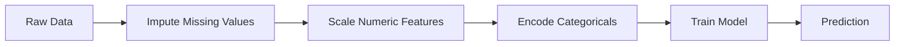
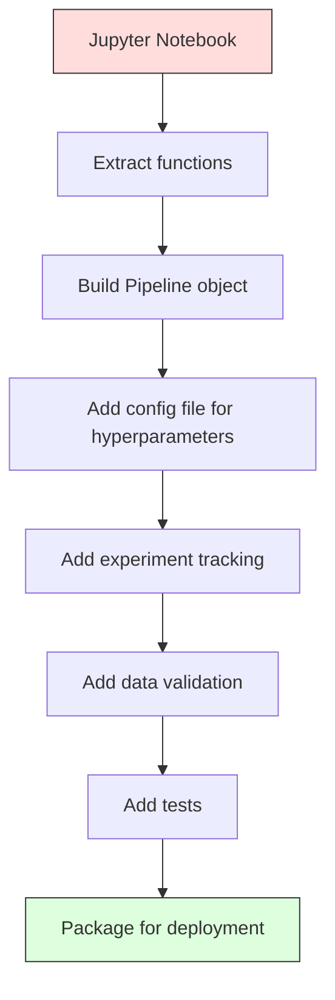

# خطوط أنابيب ML

> النموذج ليس منتج. خط أنابيب هو. خط أنابيب هو كل شيء من البيانات الخام إلى التنبؤ المنشأة، وكل خطوة يجب أن تكون قابلة للتكرار.

**Type:** Build
**Language:**بايثون
**Prerequisites:** Phase 2, Lesson 12 (Hyperparameter Tuning)
**Time:** ~120 minutes

## أهداف التعلم

- بناء خط أنابيب ML من الصفر الذي يسلسل السلسلة الإسبابية، وتوسيع النطاق، وتشفير، وتدريب النموذج في كائن واحد قابل للتنويع
- تحديد سيناريوهات تسرب البيانات وتوضيح كيفية منع خطوط الأنابيب منها عن طريق تركيب المحولات فقط على بيانات التدريب
- بناء ColumnTransformer الذي يطبق مختلف المعالجة المسبقة للميزات العددية والفئوية
- تنفيذ تسلسل خطوط الأنابيب وإثبات أن نفس خطوط الأنابيب المثبتة تنتج نتائج متطابقة في التدريب والإنتاج

## المشكلة

لديك دفتر ملاحظات يقوم بتحميل البيانات، وملء القيم المفقودة بالوسط، ويزيد من الميزات، ويدرب النموذج، ويقوم بطبع دقة.

بعد شهر، شخص ما يعيد تدريب النموذج ويحصل على نتائج مختلفة. تم حساب المتوسط على مجموعة البيانات الكاملة بما في ذلك بيانات التجارب (تسريب البيانات). لم يتم حفظ معايير التوسع، لذلك تستخدم الاستنتاج إحصاءات مختلفة. تم نسخة ورقية في الرمز الهندسي بين التدريب والخدمة، والنسخة تختلف. اكتسب العمود الفئوي قيمة جديدة في الإنتاج لم يسبق للمرسلين.

هذه ليست فرضية. إنها أهم أسباب فشل أنظمة ML في الإنتاج. خطوط الأنابيب تحل كل منها عن طريق حزم كل خطوة تحول إلى كائن واحد، منظمة، قابلة للتكرار.

## المفهوم

### ما هو خط الأنابيب

خط الأنابيب هو سلسلة مرتبة من تحويلات البيانات تليها نموذج. كل خطوة تأخذ خروج الخطوة السابقة كمدخول. يتم تثبيت خط الأنابيب بأكمله مرة واحدة على بيانات التدريب. في وقت الاستنتاج، يقوم نفس خط الأنابيب المثبت بتحويل البيانات الجديدة وتنتج التنبؤات.



خط الأنابيب يضمن:
- يتم تركيب التحويلات فقط على بيانات التدريب (لا تسرب)
- نفس التحويلات تطبق في وقت الاستنتاج
- يمكن أن يتم تصنيف الكائن بأكمله ونشره كصنع واحد
- يتم تطبيق التحقق المتقاطع من أنابيب النفط لكل طائرة، مما يمنع تسربات دقيقة

### تسرب بيانات: القاتل الصامت

يحدث تسرب البيانات عندما تتلوث المعلومات من مجموعة الاختبارات أو البيانات المستقبلية التدريب.

**Leaky (wrong):**
```python
X = df.drop("target", axis=1)
y = df["target"]

scaler = StandardScaler()
X_scaled = scaler.fit_transform(X)

X_train, X_test = X_scaled[:800], X_scaled[800:]
y_train, y_test = y[:800], y[800:]
```

لقد رأى المقياس بيانات الاختبار. يتضمن المتوسط والانحراف القياسي عينات الاختبار. وهذا يضخ تقديرات الدقة.

**Correct:**
```python
X_train, X_test = X[:800], X[800:]

scaler = StandardScaler()
X_train_scaled = scaler.fit_transform(X_train)
X_test_scaled = scaler.transform(X_test)
```

مع خط أنابيب، لا تحتاج إلى التفكير في هذا.

### خط أنابيب السكلارن

(سكلارن) `Pipeline`محولات السلاسل ومتقدّر`.fit()`،`.predict()`و`.score()`التي تطبق جميع الخطوات على نحوٍ مناسب.

```python
from sklearn.pipeline import Pipeline
from sklearn.preprocessing import StandardScaler
from sklearn.linear_model import LogisticRegression

pipe = Pipeline([
    ("scaler", StandardScaler()),
    ("model", LogisticRegression()),
])

pipe.fit(X_train, y_train)
predictions = pipe.predict(X_test)
```

عندما تتصلين`pipe.fit(X_train, y_train)`:
1. مكالمات من مستوى`fit_transform`على قطار X
2. النموذج المكالمات`fit`على قطار X_مقياس

عندما تتصلين`pipe.predict(X_test)`:
1. مكالمات من مستوى`transform`(ليس fit_transform) على X_test
2. النموذج المكالمات`predict`على اختبار X_test المقياس

المقياس لا يرى أبداً بيانات الاختبار أثناء التثبيت هذا هو النقطة

### العمودالمتحول: خطوط أنابيب مختلفة لعمدة مختلفة

مجموعات البيانات الحقيقية لديها أعداد وعمدات فصلية تحتاج إلى مختلف المعالجة المسبقة. `ColumnTransformer`-تتعامل مع هذا

```python
from sklearn.compose import ColumnTransformer
from sklearn.preprocessing import StandardScaler, OneHotEncoder
from sklearn.impute import SimpleImputer

numeric_pipe = Pipeline([
    ("impute", SimpleImputer(strategy="median")),
    ("scale", StandardScaler()),
])

categorical_pipe = Pipeline([
    ("impute", SimpleImputer(strategy="most_frequent")),
    ("encode", OneHotEncoder(handle_unknown="ignore")),
])

preprocessor = ColumnTransformer([
    ("num", numeric_pipe, ["age", "income", "score"]),
    ("cat", categorical_pipe, ["city", "gender", "plan"]),
])

full_pipeline = Pipeline([
    ("preprocess", preprocessor),
    ("model", GradientBoostingClassifier()),
])
```

- نعم`handle_unknown="ignore"`في OneHotEncoder أمر حاسم للإنتاج. عندما تظهر فئة جديدة (مدينة لم يسبق للمثال رؤيتها) ، فإنه ينتج متجهًا صفرًا بدلاً من الانهيار.

### تتبع التجربة

إن خط الأنابيب يجعل التدريب قابلاً للتكرار، ولكن عليك أيضاً تتبع ما حدث عبر التجارب: أي ملامح فائقة تم استخدامها، أي نسخة مجموعة بيانات، ما هي المعايير، أي رمز كان يعمل.

**MLflow**هو الحل المفتوح الأكثر شيوعا:

```python
import mlflow

with mlflow.start_run():
    mlflow.log_param("max_depth", 5)
    mlflow.log_param("n_estimators", 100)
    mlflow.log_param("learning_rate", 0.1)

    pipe.fit(X_train, y_train)
    accuracy = pipe.score(X_test, y_test)

    mlflow.log_metric("accuracy", accuracy)
    mlflow.sklearn.log_model(pipe, "model")
```

يتم تسجيل كل جولة مع المعايير والمقاييس والقطع الأثرية والنموذج الكامل. يمكنك مقارنة الجولات، وإعادة إنتاج أي تجربة، ونشر أي نسخة نموذج.

**Weights & Biases (wandb)**يقدم نفس الوظيفة مع لوحة التحكم المضيفة:

```python
import wandb

wandb.init(project="my-pipeline")
wandb.config.update({"max_depth": 5, "n_estimators": 100})

pipe.fit(X_train, y_train)
accuracy = pipe.score(X_test, y_test)

wandb.log({"accuracy": accuracy})
```

### النموذج الإصدار

بعد التتبع التجريبي، تحتاج إلى إدارة نسخة النموذج. أي نموذج في الإنتاج؟

سجل النموذج من MLflow يقدم:
- **Version tracking:**كل نموذج مدفوع يحصل على رقم نسخة
- **Stage transitions:**"مقام" "إنتاج" "مؤلف"
- **Approval workflow:**يجب أن يتم تعزيز النماذج صراحة للإنتاج
- **Rollback:**إعادة إلى النسخة السابقة على الفور

### إصدار البيانات مع DVC

يتم إصدار الكود مع git. يجب إصدار البيانات أيضًا، ولكن git لا يمكن التعامل مع الملفات الكبيرة. DVC (Data Version Control) يحل هذا.

```
dvc init
dvc add data/training.csv
git add data/training.csv.dvc data/.gitignore
git commit -m "Track training data"
dvc push
```

تخزين DVC البيانات الفعلية في التخزين عن بعد (S3 ، GCS ، Azure) وتحتفظ بـ `.dvc`ملف في Git يسجل الـ hash عندما تقوم بتحقق من التزامات Git`dvc checkout`يعيد البيانات الدقيقة التي استخدمت.

هذا يعني أن كل خطة إرسال تقوم بتوصيل كل من الرمز والبيانات قابلة للتكرار الكاملة

### التجارب المتكاملة

تجربة قابلة للتكرار تتطلب أربعة أشياء:

1. **Fixed random seeds:**وضع البذور للفطريات، والإطار، والإطار (المصباح، والسكولارن)
2. **Pinned dependencies:**requirements.txt أو poetry.lock مع نسخة دقيقة
3. **Versioned data:**DVC أو ما شابه
4. **Config files:**جميع المعايير العالية في إعداد، غير مدمجة بقوة

```python
import numpy as np
import random

def set_seed(seed=42):
    random.seed(seed)
    np.random.seed(seed)
    try:
        import torch
        torch.manual_seed(seed)
        torch.cuda.manual_seed_all(seed)
        torch.backends.cudnn.deterministic = True
    except ImportError:
        pass
```

### من المذكرة إلى خط الإنتاج



التقدم النموذجي:

1. **Notebook exploration:**التجارب السريعة، التصورات، أفكار الميزات
2. **Extract functions:**نقل المعالجة المسبقة، هندسة الميزات، التقييم إلى وحدات
3. **Build Pipeline:**تحويل السلسلة إلى خط أنابيب أو فئة مخصصة
4. **Config management:**نقل جميع المعايير العابرة إلى تشكيل YAML / JSON
5. **Experiment tracking:**إضافة التسجيلات MLflow أو wandb
6. **Data validation:**تحقق من النظام، والتوزيعات، وأنماط القيمة المفقودة قبل التدريب
7. **Tests:**اختبارات الوحدة للمتحولات، اختبارات التكامل لخط الأنابيب الكامل
8. **Deployment:**التسلسل للخط الأنبوب، لف في API (FastAPI، Flask) ، تحويلها

### أخطاء عامة في خط الأنابيب

| Mistake | Why it is bad | Fix |
|---------|-------------|-----|
| Fitting on full data before splitting | Data leakage | Use Pipeline with cross_val_score |
| Feature engineering outside pipeline | Different transforms at train vs serve | Put all transforms in the Pipeline |
| Not handling unknown categories | Production crash on new values | OneHotEncoder(handle_unknown="ignore") |
| Hardcoded column names | Breaks when schema changes | Use column name lists from config |
| No data validation | Silently wrong predictions on bad data | Add schema checks before prediction |
| Training/serving skew | Model sees different features in prod | One Pipeline object for both |

```figure
f3-pipeline-flow
```

## بناءها

الرمز في`code/pipeline.py`يُبني خط أنابيب ML كامل من الصفر:

### الخطوة الأولى: المحول المخصص

```python
class CustomTransformer:
    def __init__(self):
        self.means = None
        self.stds = None

    def fit(self, X):
        self.means = np.mean(X, axis=0)
        self.stds = np.std(X, axis=0)
        self.stds[self.stds == 0] = 1.0
        return self

    def transform(self, X):
        return (X - self.means) / self.stds

    def fit_transform(self, X):
        return self.fit(X).transform(X)
```

### الخطوة الثانية: خط أنابيب من الصفر

```python
class PipelineFromScratch:
    def __init__(self, steps):
        self.steps = steps

    def fit(self, X, y=None):
        X_current = X.copy()
        for name, step in self.steps[:-1]:
            X_current = step.fit_transform(X_current)
        name, model = self.steps[-1]
        model.fit(X_current, y)
        return self

    def predict(self, X):
        X_current = X.copy()
        for name, step in self.steps[:-1]:
            X_current = step.transform(X_current)
        name, model = self.steps[-1]
        return model.predict(X_current)
```

### الخطوة الثالثة: التحقق المتقاطع مع خط الأنابيب

يوضح الرمز كيفية منع التحقق من التحقق من التحقق من التحقق من التحقق من التحقق من التحقق من التحقق من التحقق من التحقق من التحقق من التحقق من التحقق من التحقق من التحقق من التحقق من التحقق من التحقق من التحقق من التحقق من التحقق من التحقق من التحقق من التحقق من التحقق من التحقق من التحقق من التحقق من التحقق من التحقق من التحقق من التحقق من التحقق من التحقق من التحقق من التحقق من التحقق من التحقق من التحقق من التحقق من التحقق من التحقق من التحقق من التحقق من التحقق من التحقق من التحقق من التحقق من التحقق من التحقق من التحقق من التحقق من التحقق من التحقق من التحقق من التحقق من التحقق من التحقق من التحقق من التحقق من التحقق من التحقق من التحقق من التدقق من التدقققق من التدققققق من التدققققق من التدقققققق من التدقققققق.

### الخطوة الرابعة: خط أنابيب الإنتاج الكامل مع sklearn

خط أنابيب كامل مع`ColumnTransformer`، العديد من مسارات المعالجة المسبقة، ونموذج، مدربة مع التحقق المناسب من التحقق من التحقق من التحقق من التحقق من التحقق من التحقق من التحقق من التحقق من التحقق من التحقق من التحقق من التحقق من التحقق من التحقق من التحقق من التحقق من التحقق من التحقق من التحقق من التحقق من التحقق من التحقق من التحقق من التحقق من التحقق من التحقق من التحقق من التحقق من التحقق من التحقق من التحقق من التحقق من التحقق من التحقق من التحقق من التحقق من التحقق من التحقق من التحقق من التحقق من التحقق من التحقق من التحقق من التحقق من التحقق من التحقق من التحقق من التحقق.

## أرسله

هذا الدرس ينتج عن:
- `outputs/prompt-ml-pipeline.md`-- مهارة لبناء وتحليل خط الأنابيب المعدنية
- `code/pipeline.py`-- خط أنابيب كامل من الصفر عبر sklearn

## التمارين

1. بناء خط أنابيب يتعامل مع مجموعة بيانات مع 3 أعمدة رقمية وعمدتين فصلية. استخدام `ColumnTransformer`لتطبيق الوصف المتوسط + التوسع على العدد والوصف الأكثر تكرارا + تشفير واحد حار على الفئات. تدريب مع التحقق المتقاطع 5 مرات.

2. إدخال تسرب البيانات عمداً: قم بتضمين المقياس على مجموعة البيانات الكاملة قبل التقسيم. مقارنة درجة التحقق من التحقق من التحقق من التحقق من التحقق من التحقق من التحقق من التحقق من التحقق من التحقق من التحقق من التحقق من التحقق من التحقق من التحقق من التحقق من التحقق من التحقق من التحقق من التحقق من التحقق من التحقق من التحقق من التحقق من التحقق من التحقق من التحقق من التحقق من التحقق من التحقق من التحقق من التحقق من التحقق من التحقق من التحقق من التحقق من التحقق من التحقق من التحقق من التحقق من التحقق من التحقق من التحقق من التحقق من التحقق من التحقق من التحقق من التحقق من التحقق من التحقق من التحقق من التحقق من التحقق من التحقق من التحقق من التحقق من التحقق من التحقق من التحقق من التحقق من التحقق من التحقق؟

3. قم بتسلسل خط الأنابيب الخاص بك مع`joblib.dump`قم بتحميلها في نص منفصل و قم بتشغيل التنبؤات

4. إضافة محول مخصص إلى خط الأنابيب الذي يخلق ميزات متعددة النقاط (درجة 2) لعدد الأعمدة الأهمين. أين يجب أن تذهب في خط الأنابيب؟

5. قم بتعيين تدفق ML لخط الأنابيب. قم بتشغيل 5 تجارب مع مختلف المعايير. استخدم واجهة المستخدم MLflow (`mlflow ui`(تقارن السباقات واختيار أفضل النموذج.

## الشروط الرئيسية

| Term | What people say | What it actually means |
|------|----------------|----------------------|
| Pipeline | "Chain of transforms + model" | An ordered sequence of fitted transformers and a model, applied as one unit to prevent leakage |
| Data leakage | "Test info leaked into training" | Using information from outside the training set to build the model, inflating performance estimates |
| ColumnTransformer | "Different preprocessing per column" | Applies different pipelines to different subsets of columns, combining results |
| Experiment tracking | "Logging your runs" | Recording parameters, metrics, artifacts, and code versions for every training run |
| MLflow | "Track and deploy models" | Open-source platform for experiment tracking, model registry, and deployment |
| DVC | "Git for data" | Version control system for large data files, storing hashes in git and data in remote storage |
| Model registry | "Model version catalog" | A system that tracks model versions with stage labels (staging, production, archived) |
| Training/serving skew | "It worked in the notebook" | Differences between how data is processed during training versus inference, causing silent errors |
| Reproducibility | "Same code, same result" | The ability to get identical results from the same code, data, and configuration |

## المزيد من القراءة

- [scikit-learn Pipeline docs](https://scikit-learn.org/stable/modules/compose.html)-- المرجع الرسمي لخط الأنابيب
- [MLflow documentation](https://mlflow.org/docs/latest/index.html)-- تتبع التجارب و سجل النماذج
- [DVC documentation](https://dvc.org/doc)-- إصدار البيانات
- [Sculley et al., Hidden Technical Debt in Machine Learning Systems (2015)](https://papers.nips.cc/paper/2015/hash/86df7dcfd896fcaf2674f757a2463eba-Abstract.html)-- ورقة أساسية حول تعقيد أنظمة ML
- [Google ML Best Practices: Rules of ML](https://developers.google.com/machine-learning/guides/rules-of-ml)-- نصيحة عملية للإنتاج
