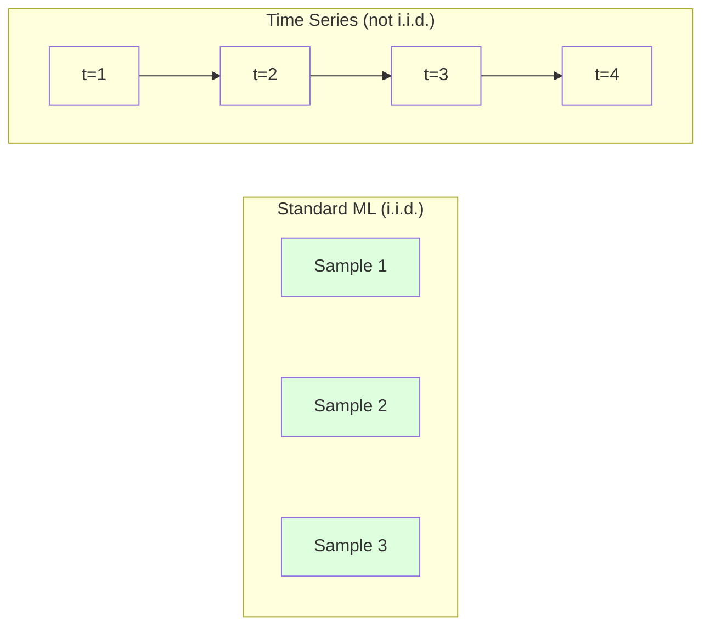
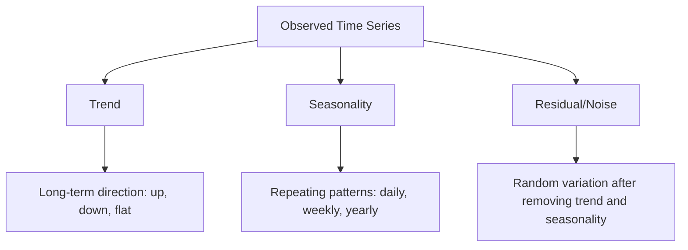
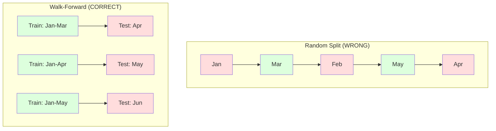

# أساسيات سلسلة الزمن

> الأداء السابق يتوقع النتائج المستقبلية إذا تحققت من الثبات أولاً

**Type:** Build
**Language:**بايثون
**Prerequisites:** Phase 2, Lessons 01-09
**Time:** ~90 minutes

## أهداف التعلم

- تحلل سلسلة زمنية إلى اتجاهات ومواسمية ومكونات بقايا واختبار الثبات
- تنفيذ ميزات تأخير وإحصاءات التداول لتحويل سلسلة زمنية إلى مشكلة تعلم تحت الإشراف
- بناء إطار للتحقق من التحقق من التحقق من التحقق من البيانات في المستقبل من التسريب إلى التدريب
- شرح لماذا تقسيمات القطار العشوائية/التجارب غير صالحة لسلسلة الزمن وإظهار الفجوة في الأداء مقابل تقسيمات الزمن المناسبة

## المشكلة

لديك بيانات مرتبة حسب الوقت، المبيعات اليومية، درجة الحرارة بالساعة، استخدام المعالجة المركزية لكل دقيقة، أسعار الأسهم الأسبوعية، تريد التنبؤ بالقيمة القادمة، الأسبوع المقبل، الربع القادم.

يمكنك الوصول إلى مجموعة أدوات ML القياسية: التقسيم العشوائي للقطار/التدريب، التحقق المتقاطع، المصفوفة المصفوفة، التنبؤ الخروج. كل خطوة خاطئة.

سلسلة الزمن تكسر الافتراضات التي يعتمد عليها ML القياسية. العينات ليست مستقلة - درجة حرارة اليوم تعتمد على البارحة. التقسيمات العشوائية تسرب المعلومات المستقبلية إلى الماضي. الميزات التي تبدو رائعة في اختبار الخلفية تفشل في الإنتاج لأنها تعتمد على أنماط تتغير مع مرور الوقت.

نموذج يحصل على دقة 95% مع التحقق العشوائي من التحقق من التحقق من التحقق من التحقق من التحقق من التحقق من التحقق من التحقق من التحقق من التحقق من التحقق من التحقق من التحقق من التحقق من التحقق من التحقق من التحقق من التحقق من التحقق من التحقق من التحقق من التحقق من التحقق من التحقق من التحقق من التحقق من التحقق من التحقق من التحقق من التحقق من التحقق من التحقق من التحقق من التحقق من التحقق من التحقق من التحقق من التحقق من التحقق من التحقق من التحقق من التحقق من التحقق من التحقق من التحقق من التحقق من التحقق من التحقق من التحقق من التحقق من التحقق من التحقق من التحقق من التحقق من التحققق من التحققق من التحققق من التحقققق من التحقققق من التحقققق من التحققققق من التحققققق من التحقققق في التحققققق في التحقققققق من التحققققق في التحقققققق في التحققققق في الت التققققققققق في الت الت الت الت التققققققققققققققق في الت الت الت الت الت.

هذا الدروس يغطي الأساسيات: ما يجعل بيانات الوقت مختلفة، وكيفية تقييم النماذج بصدق، وكيفية تحويل سلسلة الوقت إلى ميزات يمكن أن تستخدمها النماذج القياسية من خلال ML.

## المفهوم

### ما الذي يجعل سلسلة الزمن مختلفة

يفترض ML القياسي i.i.d. -- مستقلة وموزعة بشكل متطابق. يتم استخراج كل عينة من نفس التوزيع ، مستقلة عن عينات أخرى. تنتهك سلسلة الزمن كل من:

- **Not independent.**سعر الأسهم اليوم يعتمد على سعر الأسهم الأمس، مبيعات هذا الأسبوع تتوافق مع سعر الأسهم الأسبوع الماضي.
- **Not identically distributed.**التوزيع يتغير مع مرور الوقت، مبيعات ديسمبر تبدو مختلفة عن المبيعات في مارس.

هذه الانتهاكات ليست بسيطة. إنها تغير كيفية بناء الميزات، كيفية تقييم النماذج، والخوارزميات التي تعمل.



في نظام التشغيل المعتاد، العينات قابلة للتبادل. التشويش بها لا يغير أي شيء. في سلسلة الزمن، النظام هو كل شيء. التشويش يدمير الإشارة.

### مكونات سلسلة زمنية

كل سلسلة زمنية هي مزيج من:



- **Trend**التوجه الطويل الأجل، نمو الإيرادات بنسبة 10% سنوياً، ارتفاع درجة الحرارة العالمية.
- **Seasonality**: تكرار الأنماط في فترات ثابتة. ارتفاع مبيعات التجزئة في ديسمبر. ارتفاع استخدام مكيف الهواء في يوليو.
- **Residual**: أي شيء يبقى بعد إزالة الاتجاه والفصول. إذا كان البقايا تبدو مثل الضوضاء البيضاء، التفكك قبض على الإشارة.

### الثبات

سلسلة زمنية ثابتة إذا لم تتغير خصائصها الإحصائية (متوسط، المتغيرات، التواصل الذاتي) مع مرور الوقت. معظم طرق التنبؤ تتخذ ثابتة.

**Why it matters:**سلسلة غير ثابتة لديها معدل يتحرك. نموذج تدرب على بيانات من يناير تعلمت معدل مختلف عن ما سوف يظهر فبراير. سيكون خطأ منهجيا.

**How to check:**احسب متوسط التدفق والانحراف القياسي للتدفق على النافذة إذا كانت تتحرك، فإن السلسلة غير ثابتة.

**How to fix:**التفريق: بدلاً من نمذجة القيم الخامة، نمذجة التغيير بين القيم المتتالية:

```
diff[t] = value[t] - value[t-1]
```

إذا لم تجعل جولة واحدة من التفريق السلطة ثابتة، فاستخدمها مرة أخرى (التفريق من النظام الثاني). تحتاج معظم سلسلة العالم الحقيقي إلى جولتين على الأكثر.

**Example:**

المسلسل الأصلي: [100، 102, 106, 112, 120]
الفرق الأول: [2, 4, 6, 8] (ما زال يتجه نحو الأعلى)
الفرق الثاني: [2, 2, 2] (مستمر -- ثابت)

كان التسلسل الأصلي يمثل اتجاه مربع. التفريق الأول حولته إلى اتجاه خطي. التفريق الثاني جعل منه مسطحا. في الممارسة العملية، نادرا ما تحتاج إلى أكثر من جولتين.

**Formal test:**اختبار إضافية الكيس-ملء (ADF) هو اختبار إحصائي قياسي للتوقف. فرضية الصفر هي "السلسلة غير ثابتة". قيمة p أقل من 0.05 تعني أنه يمكنك رفض الصفر واستنتاج التوقف. نحن لا نطبق ADF من الصفر (تتطلب جدولات التوزيع غير المفصلية) ، ولكن نهج الإحصاءات المتحركة في رمزنا يعطي اختبارًا بصريًا عمليًا.

### التواصل الذاتي

تقيس التواصل الذاتي مدى ارتباط قيمة في الوقت t مع قيمة في الوقت t-k (خطوات k في الماضي). تقوم وظيفة التواصل الذاتي (ACF) بتخطيط هذه التواصل لكل فترة k.

**ACF tells you:**
- كم يذكر السلسلة بعد ذلك إذا انخفضت ACF إلى الصفر بعد التأخير 5، فإن القيم قبل أكثر من 5 خطوات غير ذات صلة.
- ما إذا كان هناك موسمية. إذا ارتفع ACF عند 12 (بيانات شهرية) ، فهناك موسمية سنوية.
- كم عدد الميزات المتأخرة التي يجب إنشاؤها. استخدم التأخيرات حتى يصبح ACF ضئيل.

**PACF (Partial Autocorrelation Function)**إذا كان اليوم يتوافق مع 3 أيام مضت فقط لأن كليهما يتوافق مع أمس، فإن PACF عند lag 3 سيكون صفر بينما ACF عند lag 3 لن يكون.

### خصائص التأخر: تحويل سلسلة الوقت إلى تعلم مشرف

تحتاج نماذج ML القياسية إلى صفة المصفوفة X وخطة الهدف y. سلسلة الزمن تعطيك عمود واحد من القيم. الجسر هو صفات التأخير.

خذ سلسلة [10, 12, 14, 13, 15] وخلق ميزات lag-1 و lag-2:

| lag_2 | lag_1 | target |
|-------|-------|--------|
| 10    | 12    | 14     |
| 12    | 14    | 13     |
| 14    | 13    | 15     |

الآن لديك مشكلة رجعة قياسية. أي نموذج ML (التراجع الخطي، الغابة العشوائية، زيادة التراجع) يمكن أن تتوقع الهدف من التأخيرات.

ميزات إضافية يمكنك تصميمها:
- **Rolling statistics:**المتوسط، std، min، أقصى على القيم الأخيرة k
- **Calendar features:**يوم الأسبوع، الشهر، هو عطلة، هو عطلة نهاية الأسبوع
- **Differenced values:**التغيير عن الخطوة السابقة
- **Expanding statistics:**المتوسط التراكمي، المبلغ التراكمي
- **Ratio features:**القيمة الحالية / المتوسط المتدفق (بعد ما عن المتوسط الأخير)
- **Interaction features:**التأخير1 * يوم_الأسبوع (أثار أيام الأسبوع على الزخم)

**How many lags?**استخدم وظيفة التواصل الذاتي. إذا كان ACF مهمًا حتى 10 تأخيرات، استخدم 10 تأخيرات على الأقل. إذا كان هناك تأخير موسمي أسبوعي، فاضافة 7 تأخيرات (وربما 14). المزيد من التأخيرات تعطى النموذج المزيد من التاريخ ولكن أيضا المزيد من الميزات للاستيعاب، مما يزيد من خطر الإفراط في التكيف.

**The target alignment trap.**عند إنشاء ميزات التأخير، يجب أن يكون الهدف قيمة في الوقت t، و يجب أن تستخدم جميع الميزات قيم في الوقت t-1 أو سابقة. إذا قمت بإدراج قيمة في الوقت t ك ميزة، لديك متنبؤ مثالي - ونموذج غير مفيد تماما. هذا هو الأخطاء الأكثر شيوعا في هندسة الميزات سلسلة الزمن.

### التحقق من التحقق

هذا هو المفهوم الأكثر أهمية في هذا الدروس. التحقق المتقاطع القياسي k-fold يخصص العينات بشكل عشوائي للتدريب والاختبار. بالنسبة لسلسلة الزمن، يسرق هذا المعلومات المستقبلية.



التحقق من التحقق من التحقق من التحقق من التحقق من التحقق من التحقق من التحقق من التحقق من التحقق من التحقق من التحقق من التحقق من التحقق من التحقق من التحقق من التحقق من التحقق من التحقق من التحقق من التحقق من التحقق من التحقق من التحقق من التحقق من التحقق من التحقق من التحقق من التحقق من التحقق من التحقق من التحقق من التحقق من التحقق من التحقق من التحقق من التحقق من التحقق من التحقق من التحقق من التحقق من التحقق من التحقق من التحقق من التحقق من التحقق من التحقق من التحقق من التحقق من التحقق من التحقق من التحقق من التحقق من التحقق من التحقق من التحقق من التحقق من التحقق من التحقق من التحقق من التحقق من التحقق من التحقق من التحقق من التحقق من التحقق من التحقق من التحقق من التحقق من التحقق من التحقق من التحقق من التحقق.
1. التدريب على البيانات حتى الوقت t
2. التنبؤ في الوقت t+1 (أو t+1 إلى t+k لخطوات متعددة)
3. انزلز النافذة للأمام
4. تكرار

كل طائرة اختبارية تحتوي فقط على بيانات تأتي بعد كل بيانات التدريب. لا تسرب في المستقبل. هذا يعطيك تقديرًا صادقًا لكيفية أداء النموذج عند نشرها.

**Expanding window**يستخدم جميع البيانات التاريخية للتدريب (تزايد النافذة). **Sliding window**يستخدم نافذة تدريبية ذات حجم ثابت (فانوس سلايت). استخدم توسيع عندما تعتقد أن البيانات القديمة لا تزال ذات صلة. استخدم سلايت عندما يتغير العالم وتؤلم البيانات القديمة.

### " إيرما " الإدراك

ARIMA هو نموذج سلسلة الزمن الكلاسيكية.

- **AR (Autoregressive):**التنبؤ من القيم السابقة. AR ((p) يستخدم القيم الأخيرة p.
- **I (Integrated):**التفريق لتحقيق الثبات.
- **MA (Moving Average):**التنبؤ من أخطاء التنبؤات السابقة. MA(q) يستخدم الأخطاء الق الأخيرة.

ARIMA ((p, d, q) يجمع بين الثلاثة. تختار p, d, q بناء على تحليل ACF/PACF أو البحث الآلي (ARIMA)

لن نطبق ARIMA من الصفر - يتطلب ذلك تحسينًا عدديًا يتجاوز نطاق هذا الدروس. المفهوم الرئيسي هو فهم ما يفعله كل مكون حتى تتمكن من تفسير نتائج ARIMA وتعرف متى تستخدمه.

### متى تستخدم ماذا

| Approach | Best For | Handles Seasonality | Handles External Features |
|----------|---------|-------------------|------------------------|
| Lag features + ML | Tabular with many external features | With calendar features | Yes |
| ARIMA | Single univariate series, short-term | SARIMA variant | No (ARIMAX for limited) |
| Exponential smoothing | Simple trend + seasonality | Yes (Holt-Winters) | No |
| Prophet | Business forecasting, holidays | Yes (Fourier terms) | Limited |
| Neural networks (LSTM, Transformer) | Long sequences, many series | Learned | Yes |

بالنسبة لمعظم المشاكل العملية ، تعد ميزات التأخير + تعزيز التدفق نقطة البداية القوية. فإنه يتعامل مع الميزات الخارجية بشكل طبيعي ، ولا يتطلب الثبات ، وسهل التحكم في التحليل.

### توقعات الأفق والاستراتيجيات

التنبؤات المتعددة الخطوات تتوقع خطوة واحدة في وقت واحد. التنبؤات المتعددة الخطوات تتوقع خطوات متعددة. هناك ثلاث استراتيجيات:

**Recursive (iterated):**التنبؤ بخطوة واحدة في الأمام، واستخدام التنبؤ كمدخول للخطوة التالية. بسيطة ولكن الأخطاء تتراكم -- كل التنبؤ يستخدم التنبؤ السابق، لذلك الأخطاء مزيد.

**Direct:**قم بتدريب نموذج منفصل لكل آفاق. يتوقع النموذج 1 t + 1 ، يتوقع النموذج 5 t + 5. لا يوجد تراكم خطأ ، ولكن كل نموذج لديه عينات تدريبية أقل ولا يتبادل المعلومات.

**Multi-output:**قم بتدريب نموذج واحد يخرج جميع الأفقات في وقت واحد. يشارك المعلومات عبر الأفقات ولكن يتطلب نموذج يدعم العديد من الخروجات (أو وظيفة خسارة مخصصة).

بالنسبة لمعظم المشاكل العملية، ابدأ بالتمثيل للأفقات القصيرة (1-5 خطوات) والمباشرة للأفقات الطويلة.

### الأخطاء الشائعة في سلسلة الزمن

| Mistake | Why it happens | How to fix |
|---------|---------------|-----------|
| Random train/test split | Habit from standard ML | Use walk-forward or temporal split |
| Using future features | Feature at time t included by mistake | Audit every feature for temporal alignment |
| Overfitting to seasonality | Model memorizes calendar patterns | Hold out a full seasonal cycle in the test set |
| Ignoring scale changes | Revenue doubles but patterns stay | Model percentage change instead of absolute |
| Too many lag features | "More history is better" | Use ACF to determine relevant lags |
| Not differencing | "The model will figure it out" | Tree models handle trends; linear models need stationarity |

```figure
f3-series-decompose
```

## بناءها

الرمز في`code/time_series.py`يطبق أساسيات البناء من الصفر.

### خليق الميزات

```python
def make_lag_features(series, n_lags):
    n = len(series)
    X = np.full((n, n_lags), np.nan)
    for lag in range(1, n_lags + 1):
        X[lag:, lag - 1] = series[:-lag]
    valid = ~np.isnan(X).any(axis=1)
    return X[valid], series[valid]
```

هذا يحول سلسلة 1D إلى صفوف المصفوفة حيث كل سطر لديه آخر `n_lags`القيم كخصائص، والقيمة الحالية كهدف.

### التحقق المتبادل

```python
def walk_forward_split(n_samples, n_splits=5, min_train=50):
    assert min_train < n_samples, "min_train must be less than n_samples"
    step = max(1, (n_samples - min_train) // n_splits)
    for i in range(n_splits):
        train_end = min_train + i * step
        test_end = min(train_end + step, n_samples)
        if train_end >= n_samples:
            break
        yield slice(0, train_end), slice(train_end, test_end)
```

كل قسم يضمن أن بيانات التدريب تأتي قبل بيانات الاختبار.

### نموذج بسيط للسيطرة التنازلية

نموذج AR نقي هو مجرد رجعة خطية على ميزات التأخير:

```python
class SimpleAR:
    def __init__(self, n_lags=5):
        self.n_lags = n_lags
        self.weights = None
        self.bias = None

    def fit(self, series):
        X, y = make_lag_features(series, self.n_lags)
        # Solve via normal equations
        X_b = np.column_stack([np.ones(len(X)), X])
        theta = np.linalg.lstsq(X_b, y, rcond=None)[0]
        self.bias = theta[0]
        self.weights = theta[1:]
        return self
```

هذا هو نفس المفهوم للعودة الخطية من الدروس 02, ولكن تطبق على نسخة متأخرة في الوقت من نفس المتغير.

### التحقق من الثبات

يقوم الرمز بحساب إحصاءات التدفق لتقييم ثابتة بصرياً وأرقاماً:

```python
def check_stationarity(series, window=50):
    rolling_mean = np.array([
        series[max(0, i - window):i].mean()
        for i in range(1, len(series) + 1)
    ])
    rolling_std = np.array([
        series[max(0, i - window):i].std()
        for i in range(1, len(series) + 1)
    ])
    return rolling_mean, rolling_std
```

إذا تغير متوسط التدفقات أو التد المحركات، فإن السلسلة غير ثابتة.

يختبر الرمز أيضاً الثبات عن طريق مقارنة النصف الأول والنصف الثاني من السلسلة. إذا كان الوسائل تختلف بأكثر من نصف انحراف قياسي أو يتجاوز نسبة التباين 2x، يتم إشارة السلسلة بأنها غير ثابتة.

### التواصل الذاتي

```python
def autocorrelation(series, max_lag=20):
    n = len(series)
    mean = series.mean()
    var = series.var()
    acf = np.zeros(max_lag + 1)
    for k in range(max_lag + 1):
        cov = np.mean((series[:n-k] - mean) * (series[k:] - mean))
        acf[k] = cov / var if var > 0 else 0
    return acf
```

## استخدمها

مع sklearn، تستخدم ميزات التأخير مباشرة مع أي رجسير:

```python
from sklearn.linear_model import Ridge
from sklearn.ensemble import GradientBoostingRegressor

X, y = make_lag_features(series, n_lags=10)

for train_idx, test_idx in walk_forward_split(len(X)):
    model = Ridge(alpha=1.0)
    model.fit(X[train_idx], y[train_idx])
    predictions = model.predict(X[test_idx])
```

بالنسبة لـ ARIMA، استخدم نماذج الإحصاءات:

```python
from statsmodels.tsa.arima.model import ARIMA

model = ARIMA(train_series, order=(5, 1, 2))
fitted = model.fit()
forecast = fitted.forecast(steps=30)
```

الرمز في`time_series.py`يظهر كلا النهجين ويقارن بينهما باستخدام التحقق من التحقق من المضي قدما.

### التسجيلات التاريخية

يقدم sklearn `TimeSeriesSplit`التي تنفذ التحقق من التحقق من التحقق من التحقق من التحقق من التحقق من التحقق من التحقق من التحقق من التحقق من التحقق من التحقق من التحقق من التحقق من التحقق من التحقق من التحقق من التحقق من التحقق من التحقق من التحقق من التحقق من التحقق من التحقق من التحقق من التحقق من التحقق من التحقق من التحقق من التحقق من التحقق من التحقق من التحقق من التحقق من التحقق من التحقق من التحقق من التحقق من التحقق من التحقق من التحقق من التحقق من التحقق من التحقق من التحقق من التحقق من التحقق من التحقق من التحقق من التحقق من التحقق من التحقق من التحقق من التحقق من التحقق من التحقق من التحقق من التحقق من التحقق من التحقق من التحقق من التحقق من التحقق من التحقق من التحقق من التحقق من التحقق من التحقق من التحقق من التحقق من التحقق من التحقق من التحقق من التحقق من التحقق من التحقق من التحقق من التحقق من التحقق من التحقق من التحقق من التحقق من التحقق من التحقق من التحقق من التحقق من التحقق من التحقق من التحقق من التحقق من التحقق من التحقق.

```python
from sklearn.model_selection import TimeSeriesSplit

tscv = TimeSeriesSplit(n_splits=5)
for train_index, test_index in tscv.split(X):
    X_train, X_test = X[train_index], X[test_index]
    y_train, y_test = y[train_index], y[test_index]
    model.fit(X_train, y_train)
    score = model.score(X_test, y_test)
```

هذا يعادل ما لدينا من الصفر`walk_forward_split`ولكن مدمج في إطار التحقق المتقاطع في sklearn. يمكنك استخدامه مع `cross_val_score`:

```python
from sklearn.model_selection import cross_val_score

scores = cross_val_score(model, X, y, cv=TimeSeriesSplit(n_splits=5))
print(f"Mean score: {scores.mean():.4f} +/- {scores.std():.4f}")
```

### مقاييس التقييم

تُستخدم التنبؤات المتسلسلة الزمنية مقاييس التراجعة، ولكن مع السياق الذي يدرك الوقت:

- **MAE (Mean Absolute Error):**متوسط y_true - y_pred = = = = = = = = = = = = = = = = = = = = = = = = = = = = = = = = = = = = = = = = = = = = = = = = = = = = = = = = = = = = = = = = = = = = = = = = = = = = = = = = = = = = = = = = = = = = = = = = = = = = = = = = = = = = = = = = = = = = = = = = = = = = = = = = = = = = = = = = = = = = = = = = = = = = = = = = = = = = = = = = = = = = = = = = = = = = = = = = = = = = = = = = = = = = = = = = = = = = = = = = = = = = = = = = = = = = = = = = = = = = = = = = = = = = = = = = = = = = = = = = = = = = = = = = = = = = = = = = = = = = = = = = = = = = = = = = = = = = = = = = = = = = = = = = = = = = = = = = = = = = = = = = = = = = = = = = = = = = = = = = = = = = = = = = = = = = = = = = = = = = = = = = = = = = = = = = = = = = = = = = = = = = = = = = = = = = = = = = = = = = = = = = = = = = = = = = = = = = = = = = = = = = = = = = = = = = = = = = = = = = = = = = = = = = = = = = = = = = = = = = = = = = = = = = = = = = = = = = = = = = = = = = = = = = = = = = = = = = = = = = = = = = = = = = = = = = = = = = = = = = =
- **RMSE (Root Mean Squared Error):**الجذر التربيعي لخطأ التربيعي المتوسط يعاقب الأخطاء الكبيرة أكثر من MAE. استخدم عندما الأخطاء الكبيرة أسوأ من العديد من الأخطاء الصغيرة.
- **MAPE (Mean Absolute Percentage Error):**متوسط خطأ / true_value = 100 . مستقل من المقياس ، مفيد للمقارنة بين سلسلة مختلفة. ولكن غير محددة عندما تكون القيم الحقيقية صفر.
- **Naive baseline comparison:**دائماً مقارنة مع خطوط أساس بسيطة. خط أساسية ساذجة موسمية تنبأ بالقيمة من فترة واحدة من قبل (الأمس، الأسبوع الماضي). إذا لم يتمكن نموذجك من هزيمة ساذجة، فشيئاً خاطئ.

### الميزات المتحركة

يظهر الرمز إضافة إحصاءات متداولة (متوسط، std، min، أقصى على نوافذ 7 و 14 يومًا) لميزات التأخير. هذه توفر للموديل معلومات عن الاتجاهات الأخيرة والتقلبات التي لا تتقاطها ميزات التأخير وحدها.

على سبيل المثال، إذا كان متوسط التدفق يرتفع، فهذا يشير إلى اتجاه صعودي. إذا كان التدفق يزداد، فهذا يشير إلى تقلبات متزايدة. هذه هي أنواع الأنماط التي يمكن أن تتعلم منها النماذج القائمة على الأشجار ولكن النماذج الخطية لا تستطيع.

## أرسله

هذا الدرس ينتج عن:
- `outputs/prompt-time-series-advisor.md`-- تحذير لإعداد مشاكل سلسلة زمنية
- `code/time_series.py`-- ميزات التأخير، التحقق من التحقق من التحقق من التحقق من التحقق من التحقق من التحقق من التحقق من التحقق من التحقق من التحقق من التحقق من التحقق من التحقق من التحقق من التحقق من التحقق من التحقق من التحقق من التحقق من التحقق من التحقق من التحقق من التحقق من التحقق من التحقق من التحقق من التحقق من التحقق من التحقق من التحقق من التحقق من التحقق من التحقق من التحقق من التحقق من التحقق من التحقق من التحقق من التحقق من التحقق من التحقق من التحقق من التحقق من التحقق من التحقق من التحقق من التحقق من التحقق من التحقق من التحقق من التحقق من التحقق من التحقق من التحقق من التحقق من التحقق من التحقق من التحقق من التحقق من التحقق من التحقق من التحقق من التحقق من التحقق من التحقق من التحقق من التحقق من التحقق من التحقق من التحقق

### القواعد التي يجب أن تتغلب عليها

قبل بناء أي نموذج، حدد خطوط أساسية:

1. **Last value (persistence).**توقع أن الغد سيكون نفس اليوم بالنسبة للعديد من المسلسلات، هذا من الصعب جداً أن نتغلب عليه
2. **Seasonal naive.**التنبؤ بأن اليوم سيكون نفس اليوم من الأسبوع الماضي (أو العام الماضي). إذا لم يتمكن نموذجك من هزيمة هذا، فإنه لم يتعلم أي نمط مفيد خارج الموسمية.
3. **Moving average.**توقع متوسط القيم الأخيرة من k. يضيء الضوضاء ولكن لا يمكنه التقاط التغيرات المفاجئة.

إذا فقدت نموذج ML المبدع الخاص بك إلى خط الأساس الموسمي البغيض، لديك خطأ. الأكثر شيوعا: تسرب في المستقبل في الميزات، طريقة التقييم الخطأ، أو السلسلة هو عشوائية حقا وغير متوقعة.

### نصائح مفيدة

1. **Start with plotting.**قبل أي نموذج، قم بتخطيط سلسلة الخام. ابحث عن الاتجاهات، والموسمية، والمعايير، والانقطاع الهيكلي (التغييرات المفاجئة في السلوك).

2. **Difference first, model second.**إذا كان لدى السلسلة اتجاه واضح، فلتفرق عليه قبل إنشاء ميزات تأخير. يمكن أن تتعامل النماذج القائمة على الأشجار مع الاتجاهات، ولكن النماذج الخطية لا تستطيع، ولا يؤذي التفرق أبدا.

3. **Hold out at least one full seasonal cycle.**إذا كان لديك موسمية أسبوعية، فإن مجموعة الاختبار تحتاج إلى أسبوع كامل على الأقل. إذا كان شهريًا، على الأقل شهر كامل. وإلا لا يمكنك تقييم ما إذا كان النموذج قد استنادا إلى النمط الموسمي.

4. **Monitor in production.**تتدهور نماذج سلسلة الزمن مع تغير العالم. تتبع أخطاء التنبؤ على أساس متدري. عندما تبدأ الأخطاء في الازدياد، قم بتدريب النموذج على البيانات الأخيرة.

5. **Beware of regime changes.**لن يتوقع نموذج مدرب على بيانات ما قبل الوباء سلوك ما بعد الوباء. تضم مؤشرات للتغيرات المعروفة في النظام كميزات ، أو استخدم نافذة زلقة تنسى البيانات القديمة.

6. **Log-transform skewed series.**غالبًا ما يتم تحويل الإيرادات والأسعار والحسابات إلى اليمين. أخذ السجل يثبت التباين ويجعل الأنماط المتعددة مضافة ، والتي يمكن أن تتعامل معها النماذج السطحية. التنبؤ في مساحة السجل ، ثم التكبير العريض للعودة إلى الوحدات الأصلية.

## التمارين

1. **Stationarity experiment.**إنشاء سلسلة مع اتجاه خطي. تحقق الثبات مع إحصاءات التدفق. تطبيق التفريق الأول. تحقق مرة أخرى. كم جولة من التفريق يستغرقها الاتجاه التربيعي؟

2. **Lag selection.**قم بحساب ACF على سلسلة موسمية (فترة = 7). أي التأخيرات لديها أعلى ارتباط ذاتي؟ قم بإنشاء ميزات التأخير باستخدام تلك التأخيرات فقط (وليس التأخيرات المتتالية). هل تتحسن الدقة مقارنة باستخدام التأخيرات 1 إلى 7؟

3. **Walk-forward vs random split.**تدريب رجعة الرصيف على ميزات التأخير. تقييم مع تقسيم عشوائي 80/20 مع التحقق من المضي قدما. كم تقييم عشوائي يزيد من تقدير الأداء؟

4. **Feature engineering.**إضافة متوسط التدفق (window=7), std التدفق (window=7), وخصائص يوم الأسبوع إلى ميزات التأخير. مقارنة الدقة مع ودون هذه الإضافات باستخدام التحقق من المضي قدما.

5. **Multi-step forecasting.**قم بتعديل نموذج AR للتنبؤ بخمس خطوات في المقدمة بدلاً من 1. مقارنة استراتيجيات: (أ) التنبؤ بخطوة واحدة، واستخدام التنبؤ كمدخول للخطوة التالية (تكرارية) ، و (ب) تدريب نماذج منفصلة لكل آفاق (مباشرة). أي منها أكثر دقة؟

## الشروط الرئيسية

| Term | What people say | What it actually means |
|------|----------------|----------------------|
| Stationarity | "The stats don't change over time" | A series whose mean, variance, and autocorrelation structure are constant over time |
| Differencing | "Subtract consecutive values" | Computing y[t] - y[t-1] to remove trends and achieve stationarity |
| Autocorrelation (ACF) | "How a series correlates with itself" | The correlation between a time series and a lagged copy of itself, as a function of the lag |
| Partial autocorrelation (PACF) | "Direct correlation only" | Autocorrelation at lag k after removing the effect of all shorter lags |
| Lag features | "Past values as inputs" | Using y[t-1], y[t-2], ..., y[t-k] as features to predict y[t] |
| Walk-forward validation | "Time-respecting cross-validation" | Evaluation where training data always precedes test data chronologically |
| ARIMA | "The classic time series model" | AutoRegressive Integrated Moving Average: combines past values (AR), differencing (I), and past errors (MA) |
| Seasonality | "Repeating calendar patterns" | Regular, predictable cycles in a time series tied to calendar periods (daily, weekly, yearly) |
| Trend | "The long-term direction" | A persistent increase or decrease in the series level over time |
| Expanding window | "Use all history" | Walk-forward validation where the training set grows with each fold |
| Sliding window | "Fixed-size history" | Walk-forward validation where the training set is a fixed-length window that slides forward |

## المزيد من القراءة

- [Hyndman and Athanasopoulos, Forecasting: Principles and Practice (3rd ed.)](https://otexts.com/fpp3/)- أفضل كتاب دراسي مجاني للتنبؤات
- [scikit-learn Time Series Split](https://scikit-learn.org/stable/modules/generated/sklearn.model_selection.TimeSeriesSplit.html)-- المفتاح المتحرك للأمام من sklearn
- [statsmodels ARIMA docs](https://www.statsmodels.org/stable/generated/statsmodels.tsa.arima.model.ARIMA.html)-- تنفيذ ARIMA مع التشخيص
- [Makridakis et al., The M5 Competition (2022)](https://www.sciencedirect.com/science/article/pii/S0169207021001874)-- منافسة توقعات واسعة النطاق تظهر أساليب ML مقابل أساليب إحصائية
