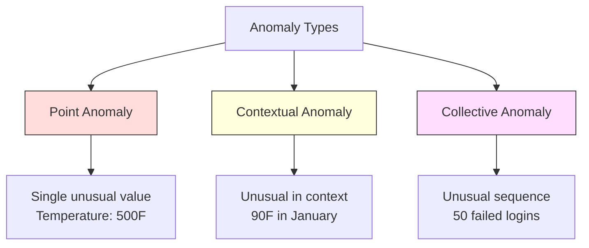
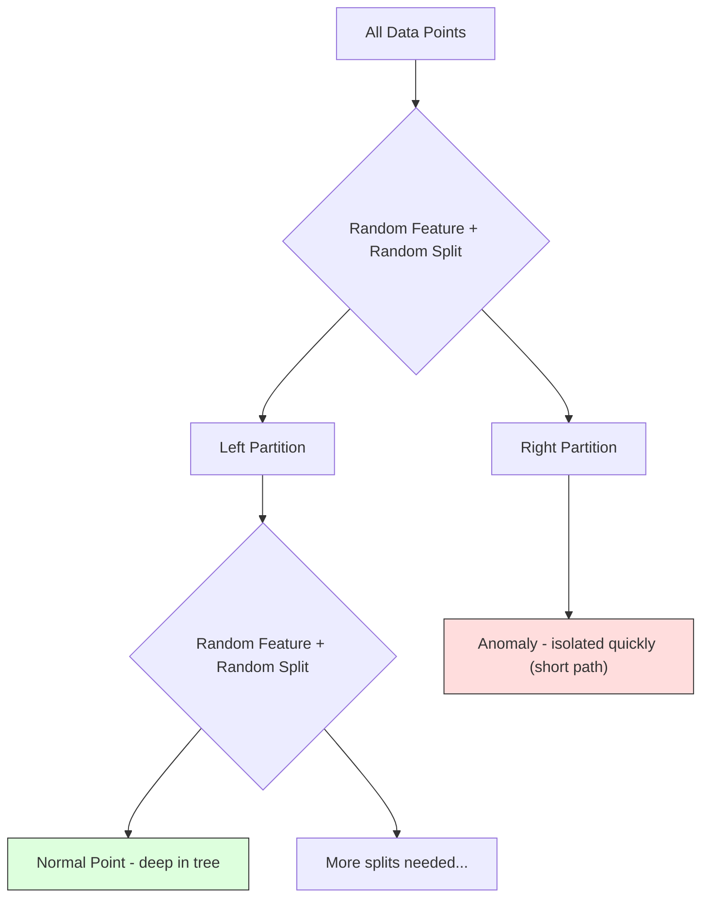
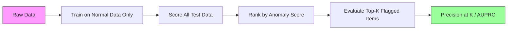

# اكتشاف التشوهات

> الطبيعي سهل التعريف غير الطبيعي هو أي شيء لا يناسب

**Type:** Build
**Language:**بايثون
**Prerequisites:** Phase 2, Lessons 01-09
**Time:** ~75 minutes

## أهداف التعلم

- تنفيذ أساليب اكتشاف الاختلافات الغابية من الصفر
- تمييز بين الانحرافات النقطية والسياقية والجماعية واختيار طريقة الكشف المناسبة لكل
- شرح لماذا يتم إطار الكشف عن الاختلافات على أنها نموذج بيانات طبيعية بدلاً من تصنيف الاختلافات
- مقارنة الكشف عن الفجوة غير المشرف عليها مع التصنيف المشرف عليها وتقييم التنازل بين تغطية الفجوة الجديدة والدقة

## المشكلة

تستخدم بطاقة ائتمان في نيويورك في الساعة الثانية مساءً، ثم في طوكيو في الساعة الثانية والخامسة مساءً. يقرأ جهاز استشعار مصنع 150 درجة عندما يكون المدى الطبيعي 80-120.

هذه هي شذوذات، إيجادها مهمة، الفساد يكلف مليارات، فشل المعدات يكلف وقت الإيقاف، وتسلل شبكة البيانات تكلفة.

التحدي: نادرا ما تكون قد وصفت أمثلة عن تشوهات. الاحتيال يمثل 0.1% من المعاملات تحدث فشلات في المعدات عدة مرات في السنة لا يمكنك تدريب مصنف قياسي لأن هناك تقريبا شيء في فئة "الغير طبيعي" للتعلم من. حتى لو كان لديك بعض العلامات، فإن الفوارق التي رأيتها ليست النوع الوحيد الذي ستواجهه. مخططات الغد تختلف عن اليوم

اكتشاف التشوهات يغير المشكلة. بدلاً من تعلم ما هو غير طبيعي، تعلم ما هو طبيعي. أي شيء يفترق عن الطبيعي مشبوه. هذا يعمل دون علامات، يتكيف مع أنواع جديدة من التشوهات، وتقليد إلى مجموعات بيانات ضخمة.

## المفهوم

### أنواع التشوهات

ليس كل التشوهات هي نفسها

- **Point anomalies.**نقطة بيانات واحدة غير عادية بغض النظر عن السياق قراءة درجة حرارة من 500 درجة.$50,000 from an account that normally spends $خمسين
- **Contextual anomalies.**نقطة بيانات غير عادية نظراً لسياقها، درجة حرارة 90 درجة طبيعية في الصيف، غير طبيعية في الشتاء، نفس القيمة، سياق مختلف.
- **Collective anomalies.**تسلسل من نقاط البيانات غير عادية كمجموعة، على الرغم من أن كل نقطة فردية قد تكون طبيعية. خمسة فشل تسجيل الدخول هو طبيعي. خمسين على التوالي هو هجوم بقوة قاسية.

معظم الطرق تكتشف تشوهات النقاط. تشوهات السياق تحتاج إلى خصائص الوقت أو الموقع. تشوهات جماعية تحتاج إلى طرق واعية بالترتيب.



### الإطارات التي لا يتم الإشراف عليها

في التصنيف القياسي، لديك علامات لكل من الفئات. في اكتشاف الانحرافات، عادة ما يكون لديك واحدة من ثلاثة حالات:

1. **Fully unsupervised.**لا تسمّيات على الإطلاق، تُصنع الكاشف على جميع البيانات، وتأمل أن تكون الخلل نادرة بما فيه الكفاية لعدم إفساد النموذج "العادي".
2. **Semi-supervised.**لديك مجموعة بيانات نظيفة من البيانات العادية فقط. تتناسب مع هذه مجموعة نظيفة وتسجل كل شيء آخر. هذا أقوى إعداد عندما يكون ذلك ممكنا.
3. **Weakly supervised.**لديك بعض الخلل المسموح بها. استخدمها لتقييم وليس للتدريب. تدريب دون إشراف، ثم قياس الدقة / التذكر على مجموعة الفرعية المسموحة.

المعلومات الرئيسية: اكتشاف الانحرافات مختلف بشكل أساسي عن التصنيف. أنت تقوم بتصميم نموذج لتوزيع البيانات الطبيعية، وليس الحدود القرارية بين فئتين.

### المراقبة ضد غير المراقبة: التداول

إذا كان لديك علامة على الانحرافات، هل يجب عليك استخدامها للتدريب (التصنيف المشرف عليه) أو للتقييم فقط (الاكتشاف غير المشرف عليه) ؟

**Supervised (treat as classification):**
- يلتقط نفس أنواع الانحرافات التي رأيتها من قبل
- دقة أعلى على أنواع الانحراف المعروفة
- يفتقد نوعاً من النوع المختلفة الجديدة تماماً
- يتطلب إعادة التدريب عند ظهور أنواع جديدة من الاختلافات
- يحتاج إلى أمثلة كافية من الاختلافات (غالبا ما تكون قليلة جدا)

**Unsupervised (model normal, flag deviations):**
- يلتقط أي انحراف عن الطبيعي، بما في ذلك الأنواع الجديدة
- لا يتطلب وجود تشوهات معينة
- معدل الإيجابية الكاذبة الأعلى (ليس كل شيء غير عادي سيء)
- أكثر قوة لتغيير التوزيع

في الممارسة العملية، فإن أفضل الأنظمة تجمع بين كل من: الكشف غير المشرف على التغطية الواسعة، والنماذج المشرفة للأنواع المعروفة من الانحرافات ذات الأولوية العالية، والتحقق البشري للوقائع المزدوجة.

### طريقة Z-Score

أسهل نهج: حساب متوسط و الانحراف القياسي لكل ميزة. علامة أي نقطة أكثر من k الانحراف القياسي من المتوسط.

```text
z_score = (x - mean) / std
anomaly if |z_score| > threshold
```

الحد الأساسي هو 3.0 (99.7% من البيانات الطبيعية تقع ضمن 3 انحرافات قياسية لتوزيع غوس).

**Strengths:**بسيط. سريع. قابل للتفسير ("هذه القيمة هي 4.5 انحرافات قياسية من الطبيعي").

**Weaknesses:**يفترض أن البيانات موزعة بشكل طبيعي. حساسة للخلفيات في بيانات التدريب (تغير الخلفيات المتوسط وتضخم المعدل، مما يجعل من الصعب اكتشافها).

**When it works well:**مراقبة ذات ميزة واحدة حيث تكون البيانات على شكل صاروخ تقريبًا، وقتاً استجابة الخادم، ومسامح التصنيع، وقراءات المستشعر مع خطوط أساس مستقرة.

**When it fails:**بيانات متعددة المجموعات (مواقع مكتبين مع درجات حرارة أساسية مختلفة) ، بيانات منحرفة (مبالغ المعاملات حيث 1000 دولار نادرة ولكن ليست غير شائعة) ، بيانات مع مستويات خارجية في مجموعة التدريب.

### طريقة IQR

أكثر قوة من النتائج Z يستخدم النطاق بين الأربعاء بدلا من المتوسط والانحراف القياسي

```
Q1 = 25th percentile
Q3 = 75th percentile
IQR = Q3 - Q1
lower_bound = Q1 - factor * IQR
upper_bound = Q3 + factor * IQR
anomaly if x < lower_bound or x > upper_bound
```

عامل الافتراض هو 1.5

**Strengths:**قوية إلى مستويات خارجية (الرسومات غير متأثرة بالقيم المتطرفة). يعمل على توزيعات متساهلة. لا افتراض للطبيعية.

**Weaknesses:**متغير فقط (يطبق لكل ميزة بشكل مستقل). لا يمكن اكتشاف الانحرافات التي غير عادية فقط عندما يتم النظر في الميزات معا (يمكن أن تكون نقطة طبيعية في كل ميزة بشكل فردي ولكن غير عادية في الفضاء المشترك).

**Practical note:**يطابق عامل 1.5 في IQR مع الحلاقات في مسار مربع. نقاط خارج الحلاقات هي مستويات خارجية محتملة. استخدام 3.0 بدلاً من 1.5 يجعل الكاشف أكثر تحافظاً (أقل علامات، أقل إيجابيات كاذبة). يعتمد العامل الصحيح على تسامحك للاجهزة الإنذار الكاذبة.

### غابة عزل

المفهوم الرئيسي: ان الانقسامات قليلة و مختلفة. في قسم عشوائي للبيانات، ان الانقسامات غير عشوائية أسهل في العزل --



**How it works:**
1. بناء العديد من الأشجار العشوائية (غابة عزلة)
2. في كل عقدة، اختر ميزة عشوائية وقيمة تقسيم عشوائية بين ميزة من و أقصى
3. استمر في الانقسام حتى يتم عزل كل نقطة (في ورقتها الخاصة)
4. التشوهات لديها أطوال مسار قصيرة في جميع الأشجار

**Why it works:**النقاط الطبيعية تعيش في مناطق كثيفة. تحتاج العديد من الانقسامات العشوائية لعزل واحد من جيرانها. التشوهات تعيش في المناطق النادرة. واحد أو اثنين من الانقسامات العشوائية يكفي لعزلهم.

يتم تعيين درجة الانحراف على متوسط طول المسار عبر جميع الأشجار، معتاد على طول المسار المتوقع لشجرة البحث الثنائية العشوائية:

```
score(x) = 2^(-average_path_length(x) / c(n))
```

أين`c(n)`هو طول المسار المتوقع لـ n عينات. النتيجة بالقرب من 1 تعني انعدام. النتيجة بالقرب من 0.5 تعني طبيعية. النتيجة بالقرب من 0 تعني طبيعية للغاية (عمقًا في مجموعات كثيفة).

**Strengths:**لا يوجد افتراضات التوزيع. يعمل في أبعاد عالية. القياس جيدًا (سلبلينير في حجم العينة لأن كل شجرة تستخدم عينة فرعية). يتعامل مع أنواع ميزات مختلطة.

**Weaknesses:**الصراعات مع الانحرافات في المناطق الكثيفة (تأثير التخفيض). الانقسام العشوائي أقل فعالية عندما تكون العديد من الميزات غير ذات صلة.

**Key hyperparameters:**
- `n_estimators`عدد الأشجار. 100 عادة ما يكون كافياً. المزيد من الأشجار تعطى درجات أكثر استقرارًا ولكن الحسابات بطيئة.
- `max_samples`عدد العينات لكل شجرة. 256 هو الافتراض في الورقة الأصلية. القيم الأصغر تجعل الأشجار الفردية أقل دقة ولكن تزيد من التنوع.
- `contamination`: جزء متوقع من الانحرافات. يستخدم فقط لتحديد العد. لا يؤثر على النتائج نفسها.

### عامل الفائدة المحلية (LOF)

مقارنة LOF كثافة المحلية حول نقطة مع كثافة حول جيرانها. نقطة في منطقة نادرة محاطة بمناطق كثيفة هي غير طبيعية.

**How it works:**
1. لكل نقطة، العثور على أقرب جيرانها k
2. احسب كثافة الوصول المحلي (كم كثافة الحي)
3. مقارنة كثافة كل نقطة مع كثافة جيرانها
4. إذا كانت النقطة لديها كثافة أقل بكثير من جيرانها، فإنها خارجية

**LOF score:**
- LOF قريب من 1.0 يعني كثافة مماثلة للجيران (طبيعية)
- LOF أكبر من 1.0 يعني كثافة أقل من الجيران (شكل غير طبيعي محتمل)
- LOF أكبر بكثير من 1.0 (مثل، 2.0+) يعني كثافة أقل بكثير (شكل غير طبيعي محتمل)

الجزء "المحلي" أمر حاسم. فكر في مجموعة بيانات مع مجموعة مليتين: مجموعة كثيفة من 1000 نقطة ومجموعة نادرة من 50 نقطة. نقطة على حافة المجموعة النادرة ليست غير عادية عالميا - لديها 50 جيران. ولكن من غير العادي محليا إذا كان جيرانها المباشرين أكثر كثافة من هو. LOF يلتقط هذه اللونات التي تفتقر إلى الأساليب العالمية.

**Strengths:**يكتشف الانحرافات المحلية (النقاط التي غير عادية في مجال حيّتهم، حتى لو لم تكن غير عادية عالمياً). يعمل على مجموعات ذات كثافة مختلفة.

**Weaknesses:**بطيئة على مجموعات بيانات كبيرة (O(n^2) للتنفيذ ساذج. حساسة لخيار k. لا تعمل بشكل جيد في الأبعاد العالية جدا (لعنة الأبعاد تؤثر على حسابات المسافة).

### المقارنة

| Method | Assumptions | Speed | Handles High Dims | Detects Local Anomalies |
|--------|------------|-------|-------------------|------------------------|
| Z-score | Normal distribution | Very fast | Yes (per feature) | No |
| IQR | None (per feature) | Very fast | Yes (per feature) | No |
| Isolation Forest | None | Fast | Yes | Partially |
| LOF | Distance is meaningful | Slow | Poorly | Yes |

### تحديات التقييم

تقييم كاشفات الاختلافات أصعب من تقييم المصنفات:

- **Extreme class imbalance.**مع وجود انشطة منخفضة بنسبة 0.1٪، التنبؤ "طبيعي" لكل شيء يعطي دقة بنسبة 99.9٪.
- **AUROC is misleading.**مع عدم التوازن الكبير، يمكن أن تبدو AUROC جيدة حتى عندما يفوت النموذج معظم الخلل في العدوان العملية.
- **Better metrics:**Precision@k (من العناصر التي تم وضع علامة k في الأعلى، كم عدد الخلل الحقيقي) ، AUPRC (المنطقة تحت منحنى استدعاء الدقة) ، والإستدعاء بمعدل ثابت إيجابي كاذب.



### خط أنابيب الكشف عن التشوهات

في الممارسة العملية، يلاحظ الكشف عن الاختلافات هذا التدفق العملي:

1. **Collect baseline data.**في المثالية، فترة تعرف فيها أنه لا توجد (أو قليل جداً) من الانشطة.
2. **Feature engineering.**الميزات الخام بالإضافة إلى الميزات المشتقة (إحصاءات التدفق، الميزات الزمنية، النسب).
3. **Train the detector.**يتناسب مع البيانات الأساسية، ويتعلم النموذج كيف يبدو "طبيعي"
4. **Score new data.**كل ملاحظة جديدة تحصل على درجة من الاختلافات
5. **Threshold selection.**اختر قطع النتيجة هذا قرار تجاري: أعلى عتبة يعني أقل إنذارات كاذبة ولكن أكثر تشوهات مفقودة.
6. **Alert and investigate.**النقاط المعلقة تذهب إلى مراجعة البشر أو الاستجابة الآلية.
7. **Feedback collection.**سجل ما إذا كانت العناصر المشار إليها هي حالات غير طبيعية حقيقية أو إنذارات كاذبة. استخدم هذه البيانات لتقييم الكاشف وتحديد العد الأدنى مع مرور الوقت.

لا يتم "إنهاء" خط الأنابيب أبداً. تتحول توزيعات البيانات، ويتم ظهور أنواع جديدة من الانحرافات، ويجب تعديل العدوان. تعامل كشف الانحرافات كنظام حي، وليس نموذج لمرة واحدة.

```figure
f3-anomaly-fence
```

## بناءها

الرمز في`code/anomaly_detection.py`يطبق النتائج Z-Score، IQR، و الغابة العزلة من الصفر.

### كاشف الدرجة الزيد

```python
def zscore_detect(X, threshold=3.0):
    mean = X.mean(axis=0)
    std = X.std(axis=0)
    std[std == 0] = 1.0
    z = np.abs((X - mean) / std)
    return z.max(axis=1) > threshold
```

بسيط ومجهري، يُعَلِّم نقطة إذا تجاوزت أيّة صفة العدّ.

### جهاز تحديد IQR

```python
def iqr_detect(X, factor=1.5):
    q1 = np.percentile(X, 25, axis=0)
    q3 = np.percentile(X, 75, axis=0)
    iqr = q3 - q1
    iqr[iqr == 0] = 1.0
    lower = q1 - factor * iqr
    upper = q3 + factor * iqr
    outside = (X < lower) | (X > upper)
    return outside.any(axis=1)
```

### الغابة العزلة من الصفر

تنفيذ من الصفر يبنى أشجار العزل التي تقسم عشوائيا مساحة الميزات:

```python
class IsolationTree:
    def __init__(self, max_depth):
        self.max_depth = max_depth

    def fit(self, X, depth=0):
        n, p = X.shape
        if depth >= self.max_depth or n <= 1:
            self.is_leaf = True
            self.size = n
            return self
        self.is_leaf = False
        self.feature = np.random.randint(p)
        x_min = X[:, self.feature].min()
        x_max = X[:, self.feature].max()
        if x_min == x_max:
            self.is_leaf = True
            self.size = n
            return self
        self.threshold = np.random.uniform(x_min, x_max)
        left_mask = X[:, self.feature] < self.threshold
        self.left = IsolationTree(self.max_depth).fit(X[left_mask], depth + 1)
        self.right = IsolationTree(self.max_depth).fit(X[~left_mask], depth + 1)
        return self
```

طول المسار لتحديد نقطة يحدد نتيجة تشابهاته. المسارات القصيرة تعني أكثر تشابهًا.

- نعم`IsolationForest`الطبقة تغلف العديد من الأشجار:

```python
class IsolationForest:
    def __init__(self, n_estimators=100, max_samples=256, seed=42):
        self.n_estimators = n_estimators
        self.max_samples = max_samples

    def fit(self, X):
        sample_size = min(self.max_samples, X.shape[0])
        max_depth = int(np.ceil(np.log2(sample_size)))
        for _ in range(self.n_estimators):
            idx = rng.choice(X.shape[0], size=sample_size, replace=False)
            tree = IsolationTree(max_depth=max_depth)
            tree.fit(X[idx])
            self.trees.append(tree)

    def anomaly_score(self, X):
        avg_path = average path length across all trees
        scores = 2.0 ** (-avg_path / c(max_samples))
        return scores
```

عامل التطبيع`c(n)`هو طول المسار المتوقع لبحث غير ناجح في شجرة البحث الثنائية مع n عناصر. يساوي `2 * H(n-1) - 2*(n-1)/n`أين`H`هذا التطبيع يضمن أن النتائج مقارنة عبر مجموعات بيانات من أبعاد مختلفة.

### سيناريوهات الاكتشاف

يخلق الرمز سيناريوهات اختبار متعددة:

1. **Single cluster with outliers.**مجموعة غوسية ثنائية الأبعاد مع تشوهات حقن بعيدا عن المركز جميع الأساليب يجب أن تعمل هنا
2. **Multimodal data.**ثلاث مجموعات من أبعاد مختلفة و كثافة مختلفة النقاط بين مجموعات غير طبيعية النتيجة Z تكافح لأن نطاقات الميزات واسعة
3. **High-dimensional data.**50 ميزة، ولكن الاختلافات تختلف في 5 منها فقط. اختبار ما إذا كانت الطرق يمكن أن تجد الاختلافات في مجموعة فرعية من الخصائص.

كل عرض يمثل مقارنة جميع الطرق باستخدام الدقة، والذكرى، F1، و Precision@k.

## استخدمها

مع sklearn (باستخدام تنفيذات المكتبة ، وليس من الصفر):

```python
from sklearn.ensemble import IsolationForest
from sklearn.neighbors import LocalOutlierFactor

iso = IsolationForest(n_estimators=100, contamination=0.05, random_state=42)
iso.fit(X_train)
predictions = iso.predict(X_test)

lof = LocalOutlierFactor(n_neighbors=20, contamination=0.05, novelty=True)
lof.fit(X_train)
predictions = lof.predict(X_test)
```

ملاحظة`contamination`يحدد الجزء المتوقع من الانحرافات. إعدادها بشكل صحيح مهم -- منخفض جدا يفتقد الانحرافات، عالية جدا يخلق إنذارات كاذبة.

الرمز في`anomaly_detection.py`يُقارن التنفيذات من الصفر مع التنفيذ على نفس البيانات.

### خيار التلوث

- نعم`contamination`يحدد المعلم في sklearn العدوان لتحويل نقاط الانحراف المستمرة إلى توقعات ثنائية.

```python
iso_5 = IsolationForest(contamination=0.05)
iso_10 = IsolationForest(contamination=0.10)
```

كلاهما ينتج نفس النتيجة من الاختلافات`iso_5`يُعَلِّمُ أعلى 5% بينما `iso_10`إذا كنت لا تعرف معدل الانحراف الحقيقي (عادة ما لا تعرف) ، حدد التلوث إلى "أوتوماتيكي" والعمل مع النتائج الخام مباشرة. حدد عتبة الخاصة بك بناء على التنازل التكلفة بين الإيجابيات الخاطئة والسلبيات الخاطئة.

### الـ "SVM" ذات الفئة الواحدة

كاشف آخر غير مرصد للشذوذ يستحق المعرفة. يتناسب SVM من فئة واحدة مع حدود حول البيانات العادية في مساحة ميزات عالية الأبعاد (باستخدام خدعة النواة).

```python
from sklearn.svm import OneClassSVM

oc_svm = OneClassSVM(kernel="rbf", gamma="auto", nu=0.05)
oc_svm.fit(X_train)
predictions = oc_svm.predict(X_test)
```

- نعم`nu`يقدر المعلمات القياسية على نسبة الانحرافات. يعمل SVM من فئة واحدة بشكل جيد على مجموعات بيانات صغيرة إلى متوسطة ولكن لا يتحسن حجمها إلى بيانات كبيرة جدا (تزداد ماتريكية النواة مربعاً).

### طريقة التشفير الذاتي (مشاهدة مسبقة)

إن المرسومات الذاتية هي شبكات عصبية تتعلم ضغط البيانات وإعادة بناءها. تدرب على البيانات الطبيعية. في وقت الاختبار، يكون لدى الخللات خطأ إعادة بناء مرتفع لأن الشبكة تعلمت إعادة بناء الأنماط الطبيعية فقط.

هذا ما تم تغطيته في المرحلة 3 (التعلم العميق) ، ولكن المبدأ هو نفسه: نموذج ما هو طبيعي، علامة ما يختلف.

### تجميع الكشف عن التشوهات

تماماً كما تعمل أساليب الجمع على تحسين التصنيف (الدرس 11) ، فإن الجمع بين كشافات عدة من حالات الطفرات يحسن الكشف.

1. تشغيل أجهزة كشف متعددة (معدل Z، IQR، غابة العزل، LOF)
2. عادي درجات كل جهاز كشف إلى [0, 1]
3. متوسط النتائج المعادية
4. نقاط العلم فوق العد الأدنى على متوسط النتيجة

هذا يقلل من الإيجابيات الكاذبة لأن الطرق المختلفة لديها أوضاع الفشل المختلفة. نقطة تمت علامتها من قبل كل من الطرق الأربعة هي بالتأكيد غير طبيعية تقريبا. نقطة تمت علامتها من قبل واحد فقط قد تكون غريبة من تلك الطريقة.

مجموعة أكثر تعقيدًا تعزز كل جهاز كشف حسب موثوقيته المقدرة (المقياسة على مجموعة التحقق من التحقق من المعروفة مع وجود خلافات، إذا كانت موجودة).

### اعتبارات الإنتاج

1. **Threshold drift.**مع تحول توزيع البيانات، يصبح العد الأدنى القديم. قم بمراقبة توزيع نقاط الفجوة وتعديلها بشكل دوري.
2. **Alert fatigue.**الكثير من الإنذارات الكاذبة والعملاء يتوقفون عن الإنتباه. ابدأ مع عتبة عالية (أقل من الإنباءات الأكثر موثوقية) وتخفيضها مع بناء الثقة.
3. **Ensemble approach.**في الإنتاج، قم بتجميع العديد من الكشفيات. قم بتشخيص نقطة فقط إذا اتفقت العديد من الطرق أنها غير طبيعية. وهذا يقلل من الإيجابيات الخاطئة بشكل كبير.
4. **Feature engineering.**الميزات الخام نادرًا ما تكون كافية. أضف إحصاءات التدفق والنسب والوقت منذ آخر حدث وميزات محددة للمنطقة. ميزة جيدة تعتبر مهمة أكثر من اختيار الكاشف.
5. **Feedback loop.**عندما يقوم المشغلون بفحص العناصر المشاركة في العلامة وتأكيدها أو رفضها، يرسلونها إلى النظام.

## أرسله

هذا الدرس ينتج عن:
- `outputs/skill-anomaly-detector.md`-- مهارة القرار لانتخاب الكاشف المناسب
- `code/anomaly_detection.py`-- نقطة Z، IQR، و الغابة العزلة من الصفر، مع مقارنة sklearn

### اختيار العدوان

نسبة الاختلافات مستمرة، تحتاج إلى عتبة لاتخاذ قرارات ثنائية، هذا قرار تجاري، وليس تقني.

فكر في سيناريوهات:
- **Fraud detection.**الغياب عن الاحتيال مكلف (إعادة الشحن، ثقة العملاء). إن تحذيرات كاذبة تكلف محلل بشري 5 دقائق للتحقيق. حدد العد أدنى للكشف عن المزيد من الاحتيال، تقبل المزيد من الاحتيال الكاذب.
- **Equipment maintenance.**إن إنذار كاذب يعني إغلاق غير ضروري$50,000. A missed failure means a $500 ألف إصلاح، حدد العد لتحقيق التوازن بين هذه التكاليف

في كلتا الحالتين، يعتمد العد الأفضل على نسبة التكلفة بين الإيجابيات الخاطئة والسلبيات الخاطئة.

### التوسع إلى الإنتاج

للكشف عن الاختلافات في الوقت الحقيقي في الإنتاج:

1. **Batch training, online scoring.**قم بتدريب النموذج بشكل دوري (اليوم، أسبوعي) على البيانات الطبيعية الأخيرة.
2. **Feature computation must match.**إذا كنت تدربت مع إحصاءات متداولة على مدى 30 يوماً، تحتاج إلى 30 يوماً من التاريخ لحساب الميزات للملاحظة الجديدة.
3. **Score distribution monitoring.**تتبع توزيع نقاط الفجوة عبر الزمن إذا كانت النتيجة المتوسطة تتحرك إلى الأعلى، إما أن البيانات تتغير أو أن النموذج قديم.
4. **Explainability.**عندما تُشير إلى وجود شذوذ، قل السبب. علامة Z: "الميزة X هي 4.2 انحرافات قياسية فوق الطبيعية".

## التمارين

1. **Threshold tuning.**قم بتشغيل جهاز كشف النتيجة Z مع حدود من 1.0 إلى 5.0 في خطوات من 0.5، قم بتحديد الدقة واستدعاء كل حد. أين هو نقطة الراحة للبيانات الخاصة بك؟

2. **Multivariate anomalies.**إنشاء بيانات 2D حيث تبدو كل ميزة بشكل فردي طبيعية ، ولكن الجمعية غير طبيعية (على سبيل المثال ، نقاط بعيدة عن خط المجموعة الرئيسية).

3. **LOF from scratch.**تنفيذ عامل خارجية محلية باستخدام قريبا من k الجيران. مقارنة مع LocalOutlierFactor sklearn على نفس البيانات. استخدام k=10 و k=50 - كيف يؤثر اختيار k على النتائج؟

4. **Streaming anomaly detection.**تعديل كاشف الدرجة ز لتعمل في إعداد التدفق: تحديث المتوسط والتشابهات الجارية مع وصول نقاط جديدة (الخوارزمية على الانترنت ويلفورد). مقارنة مع مجموعة من الدرجة ز على نفس البيانات.

5. **Real-world evaluation.**خذ مجموعة بيانات مع وجود تشوهات معروفة (مثل احتيال بطاقة الائتمان من كاجل) وقم بتقييم كل الأساليب الأربعة باستخدام precision@100، precision@500، و AUPRC. أي طريقة تعمل بشكل أفضل؟ لماذا؟

## الشروط الرئيسية

| Term | What people say | What it actually means |
|------|----------------|----------------------|
| Anomaly | "Outlier, unusual point" | A data point that deviates significantly from the expected pattern of normal data |
| Point anomaly | "A single weird value" | An individual observation that is unusual regardless of context |
| Contextual anomaly | "Normal value, wrong context" | An observation that is unusual given its context (time, location, etc.) but might be normal in another context |
| Isolation Forest | "Random splits to find outliers" | An ensemble of random trees that isolates anomalies with fewer splits than normal points |
| Local Outlier Factor | "Compare density to neighbors" | A method that flags points whose local density is much lower than their neighbors' density |
| Z-score | "Standard deviations from mean" | (x - mean) / std, measuring how far a point is from the center in units of standard deviation |
| IQR | "Interquartile range" | Q3 - Q1, measuring the spread of the middle 50% of data, used for robust outlier detection |
| Contamination | "Expected fraction of anomalies" | A hyperparameter telling the detector what proportion of the data it should flag as anomalous |
| Precision@k | "Of the top k flags, how many are real" | Precision computed on only the k most suspicious points, useful for imbalanced anomaly detection |
| AUPRC | "Area under precision-recall curve" | A metric that summarizes precision-recall performance across all thresholds, better than AUROC for imbalanced data |

## المزيد من القراءة

- [Liu et al., Isolation Forest (2008)](https://cs.nju.edu.cn/zhouzh/zhouzh.files/publication/icdm08b.pdf)-- ورقة الغابة العزلة الأصلية
- [Breunig et al., LOF: Identifying Density-Based Local Outliers (2000)](https://dl.acm.org/doi/10.1145/342009.335388)-- ورقة LOF الأصلية
- [scikit-learn Outlier Detection docs](https://scikit-learn.org/stable/modules/outlier_detection.html)-- نظرة عامة على جميع كاشفات تشوهات الكلورن
- [Chandola et al., Anomaly Detection: A Survey (2009)](https://dl.acm.org/doi/10.1145/1541880.1541882)-- مسح شامل لأساليب اكتشاف الاختلافات
- [Goldstein and Uchida, A Comparative Evaluation of Unsupervised Anomaly Detection Algorithms (2016)](https://journals.plos.org/plosone/article?id=10.1371/journal.pone.0152173)-- مقارنة تجربية لـ 10 طرق على مجموعات بيانات حقيقية
