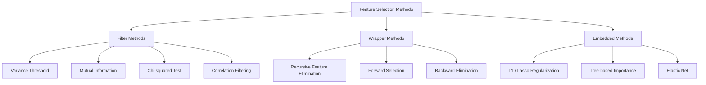
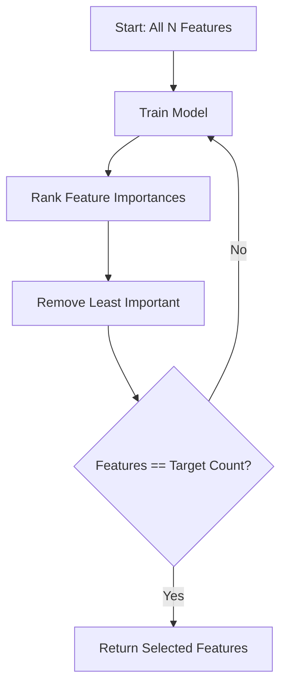
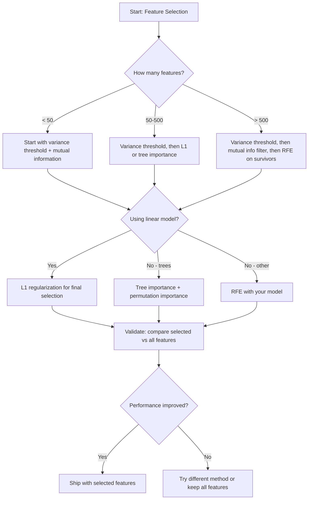

# اختيار الميزات

> مزيد من الميزات ليس أفضل الميزات الصحيحة هي الأفضل

**Type:** Build
**Language:**بايثون
**Prerequisites:** Phase 2, Lessons 01-09, 08 (feature engineering)
**Time:** ~75 minutes

## أهداف التعلم

- تنفيذ طرق التصفية (عدول التغيرات، المعلومات المتبادلة، المربع الصفري) وطرق الغلاف (RFE، الاختيار الأمامي) من الصفر
- شرح لماذا يتم التقاط العلاقات غير الخطية بين الميزات والهدف التي تفوت التواصل
- مقارنة تنظيم L1 (اختيار مدمج) مع RFE (اختيار الملفات) وتقييم التنازلات الحاسوبية الخاصة بهم
- بناء خط أنابيب اختيار الميزات التي تجمع بين أساليب متعددة وتظهر تحسين التعميم على البيانات التي تم احتفاظها

## المشكلة

لديك 500 ميزة، تتدرب نموذجك ببطء، يتجاوز مستمرًا، ولا أحد يستطيع تفسير ما تعلمته، تضيف المزيد من الميزات آملاً بتحسين الأداء، الأمر يزداد سوءًا.

هذا هو لعنة الأبعاد في العمل. مع نمو عدد الميزات، فإن حجم مساحة الميزات ينفجر. تصبح نقاط البيانات نادرة. تتقارب المسافات بين النقاط. يحتاج النموذج إلى المزيد من البيانات بشكل متزايد للعثور على أنماط حقيقية. تُغرق الميزات الضوضاء ميزات الإشارة. تصبح التكيف الزائد هي الافتراض الافتراضي.

اختيار الميزات هو العلاج. إزالة الضوضاء. إزالة الإفراط. الحفاظ على الميزات التي تحمل المعلومات الفعلية عن الهدف. النتيجة: تدريب أسرع، وتعميم أفضل، والنماذج التي يمكنك تفسيرها فعليا.

الهدف ليس استخدام كل المعلومات المتاحة، بل استخدام المعلومات الصحيحة.

## المفهوم

### ثلاثة فئات من اختيار الميزات

كل طريقة اختيار الميزات تقع في واحدة من ثلاث فئات:



**Filter methods**يُسجلون كل ميزة بشكل مستقل باستخدام مقياس إحصائي. لا يستخدمون نموذج. سريع، لكنهم يفتقدون تفاعلات الميزة.

**Wrapper methods**تدريب نموذج لتقييم مجموعات فرعية من الميزات. يستخدمون أداء النموذج كنتيجة. نتائج أفضل، ولكن مكلفة لأنهم يعيدون تدريب النموذج عدة مرات.

**Embedded methods**اختيار الميزات كجزء من تدريب النموذج. إعادة تنظيم L1 يقل الوزن إلى الصفر. تم تقسيم الأشجار القرارية على الميزات الأكثر فائدة. يحدث اختيار أثناء التثبيت، وليس كخطوة منفصلة.

### عتبة التباين

إن كان المصفاة الأسهل، إذا كانت ميزة ما تختلف بالكاد بين العينات، فإنها لا تحمل تقريبا أي معلومات.

فكر في ميزة هي 0.0 ل 999 من 1000 عينات. تغيرها قريب من الصفر. لا يمكن لأي نموذج استخدامها للتمييز بين الفئات. إزالتها.

```
variance(x) = mean((x - mean(x))^2)
```

حدد عتبة (مثل 0.01). اترك كل ميزة مع اختلاف أقل منها. هذا يزيل الميزات الثابتة أو شبه الثابتة دون النظر إلى المتغير المستهدف على الإطلاق.

متى تستخدم: كخطوة من قبل المعالجة قبل الأساليب الأخرى. فإنه يلتقط بظاهر ميزات غير مفيدة بتكلفة قريبة من الصفر.

الحد: يمكن أن يكون لدى ميزة اختلاف كبير ومازال ضجيجًا خالصًا.

### المعلومات المتبادلة

تقيس المعلومات المتبادلة إلى أي حد يقلل معرفة قيمة الصفة X من عدم اليقين حول الهدف Y.

```
I(X; Y) = sum_x sum_y p(x, y) * log(p(x, y) / (p(x) * p(y)))
```

إذا كان X و Y مستقلين، p(x، y) = p(x) * p(y) ، لذلك فإن مصطلح اللغ هو صفر و I(X؛ Y) = 0. كلما أخبرك X عن Y، كلما كانت المعلومات المتبادلة أعلى.

ميزة رئيسية على التواصل: المعلومات المتبادلة تلتقط العلاقات غير الخطية. قد يكون لدى ميزة صفر ارتباط مع الهدف ولكن معلومات متبادلة عالية لأن العلاقة مربعة أو دورية.

للميزات المستمرة، قم بتحديد الحاويات أولاً (التقدير القائم على التسجيلات القياسية). عدد الحاويات يؤثر على التقدير - عدد قليل جداً من الحاويات يفقد المعلومات، الكثير من الحاويات يضيف الضوضاء. خيار شائع: مربع ((n) الحاويات أو قاعدة ستورجز (1 + log2 ((n)).


### القضاء على الميزة المتكررة (RFE)

RFE هو طريقة لفائف. تستخدم أهمية الميزة الخاصة بالنموذج لتقطيعها بشكل متكرر:

1. تدريب النموذج مع جميع الميزات
2. ميزات الدرجة حسب الأهمية (معدلات النماذج الخطية، وتقليل النسبية للشجرة)
3. إزالة أقل أهمية
4. كرر حتى يبقى عدد الميزات المطلوبة



يعتبر RFE تفاعلات الميزات لأن النموذج يرى جميع الميزات المتبقية معاً. إزالة ميزة واحدة تغير أهمية أخرى. وهذا يجعلها أكثر دقة من طرق التصفية.

التكلفة: يمكنك تدريب النموذج N - أوقات الهدف. مع 500 ميزة و هدف من 10 ، أي 490 جولة تدريب. بالنسبة للنماذج الثمينة ، هذا بطيء. يمكنك تسريع ذلك عن طريق إزالة العديد من الميزات في كل خطوة (على سبيل المثال ، إزالة 10% السفلي في كل جولة).

### L1 (لاسو) التنظيم

يضيف التنظيم L1 القيمة المطلقة للوزن إلى وظيفة الخسارة:

```
loss = prediction_error + alpha * sum(|w_i|)
```

المعلم الفائقي يسيطر على مدى تعديل الميزات العدوانية، وترتيب الرفاف العالي يعني أن المزيد من الوزن يصل إلى الصفر بالضبط.

لماذا صفر بالضبط؟ إن عقوبة L1 تخلق منطقة قيودية على شكل الماس في مساحة الوزن. الحل الأمثل يميل إلى الهبوط في زاوية هذا الماس، حيث يبلغ وزن واحد أو أكثر من الصفر. إن تنظيم L2 (الخندق) يخلق قيودًا دائريًا حيث تقلص الوزن ولكن نادراً ما يصل إلى الصفر.

هذا هو اختيار ميزات مدمجة: يتعلم النموذج أثناء التدريب الميزات التي يجب تجاهلها. يتم إزالة الميزات التي لا تزن.

المزايا: تشغيل تدريب واحد، ومعالجة الميزات المتصلة (تختار واحد والصفر الآخرين) ، مدمجة في معظم تنفيذات النموذج الخطية.

الحد: يعمل فقط على النماذج الخطية. لا يمكن أن تتمكن من التقاط أهمية الميزات غير الخطية.

### أهمية الميزة المستندة إلى الأشجار

شجرة القرار ومجموعاتها (غابات عشوائية، زيادة التدفق) مرتبة طبيعياً. كل شق تقلل من النسب (جيني أو الانتروبيا للتصنيف، والفوارانس للتراجع). هي الميزات التي تنتج تقليلات أكبر من النسب.

بالنسبة للغابة العشوائية مع الأشجار T:

```
importance(feature_j) = (1/T) * sum over all trees of
    sum over all nodes splitting on feature_j of
        (n_samples * impurity_decrease)
```

هذا يعطي درجة أهمية طبيعية لكل ميزة. إنه يتعامل مع العلاقات غير الخطية والتفاعلات المميزة تلقائيا.

تحذير: الأهمية القائمة على الأشجار متحيزة تجاه الميزات ذات القيم الفريدة العديدة (الدرجة العالية). ستظهر عمود هوية عشوائية مهمة لأنه ينقسم كل عينة بشكل مثالي. استخدم أهمية المحوّل كتحقيق العقل الصحي.

### أهمية التحول

طريقة نموذجية:

1. تدريب النموذج وتسجيل أداء خط الأساس على بيانات التحقق من التحقق
2. لكل ميزة: خليط قيمها عشوائياً، قياس انخفاض الأداء
3. كلما زاد حجمها، كلما زاد أهمية الميزة

إذا لم يؤثر التشويش على أداء النموذج، فإن النموذج لا يعتمد عليه. إذا انهارت الأداء، فإن هذه الميزة حاسمة.

أهمية التحول تتجنب تحيز القرطانيّة من أهمية القائمة على الأشجار. ولكنها بطيئة: تقييم كامل واحد لكل ميزة، تكرر عدة مرات لتحقيق الاستقرار.

### جدول المقارنة

| Method | Type | Speed | Nonlinear | Feature Interactions |
|--------|------|-------|-----------|---------------------|
| Variance threshold | Filter | Very fast | No | No |
| Mutual information | Filter | Fast | Yes | No |
| Correlation filter | Filter | Fast | No | No |
| RFE | Wrapper | Slow | Depends on model | Yes |
| L1 / Lasso | Embedded | Fast | No (linear) | No |
| Tree importance | Embedded | Medium | Yes | Yes |
| Permutation importance | Model-agnostic | Slow | Yes | Yes |

### مخطط تدفق القرار



```figure
f3-feature-prune
```

## بناءها

### الخطوة 1: توليد بيانات اصطناعية مع هيكل الميزات المعروفة

```python
import numpy as np


def make_feature_selection_data(n_samples=500, seed=42):
    rng = np.random.RandomState(seed)

    x1 = rng.randn(n_samples)
    x2 = rng.randn(n_samples)
    x3 = rng.randn(n_samples)
    x4 = x1 + 0.1 * rng.randn(n_samples)
    x5 = x2 + 0.1 * rng.randn(n_samples)

    informative = np.column_stack([x1, x2, x3, x4, x5])

    correlated = np.column_stack([
        x1 * 0.9 + 0.1 * rng.randn(n_samples),
        x2 * 0.8 + 0.2 * rng.randn(n_samples),
        x3 * 0.7 + 0.3 * rng.randn(n_samples),
        x1 * 0.5 + x2 * 0.5 + 0.1 * rng.randn(n_samples),
        x2 * 0.6 + x3 * 0.4 + 0.1 * rng.randn(n_samples),
    ])

    noise = rng.randn(n_samples, 10) * 0.5

    X = np.hstack([informative, correlated, noise])
    y = (2 * x1 - 1.5 * x2 + x3 + 0.5 * rng.randn(n_samples) > 0).astype(int)

    feature_names = (
        [f"info_{i}" for i in range(5)]
        + [f"corr_{i}" for i in range(5)]
        + [f"noise_{i}" for i in range(10)]
    )

    return X, y, feature_names
```

نحن نعلم الحقيقة الأساسية: الصفات 0-4 هي معلوماتية (إضافة 3 و 4 هي نسخة متقاربة من 0 و 1), الصفات 5-9 هي متقاربة مع الصفات المعلوماتية، الصفات 10-19 هي ضوضاء نقية. طريقة اختيار جيدة يجب أن تصنف 0-4 أعلى و 10-19 أدنى.

### الخطوة الثانية: عتبة التباين

```python
def variance_threshold(X, threshold=0.01):
    variances = np.var(X, axis=0)
    mask = variances > threshold
    return mask, variances
```

### الخطوة الثالثة: المعلومات المتبادلة (المتفصلة)

```python
def discretize(x, n_bins=10):
    min_val, max_val = x.min(), x.max()
    if max_val == min_val:
        return np.zeros_like(x, dtype=int)
    bin_edges = np.linspace(min_val, max_val, n_bins + 1)
    binned = np.digitize(x, bin_edges[1:-1])
    return binned


def mutual_information(X, y, n_bins=10):
    n_samples, n_features = X.shape
    mi_scores = np.zeros(n_features)

    y_vals, y_counts = np.unique(y, return_counts=True)
    p_y = y_counts / n_samples

    for f in range(n_features):
        x_binned = discretize(X[:, f], n_bins)
        x_vals, x_counts = np.unique(x_binned, return_counts=True)
        p_x = dict(zip(x_vals, x_counts / n_samples))

        mi = 0.0
        for xv in x_vals:
            for yi, yv in enumerate(y_vals):
                joint_mask = (x_binned == xv) & (y == yv)
                p_xy = np.sum(joint_mask) / n_samples
                if p_xy > 0:
                    mi += p_xy * np.log(p_xy / (p_x[xv] * p_y[yi]))
        mi_scores[f] = mi

    return mi_scores
```

### الخطوة الرابعة: القضاء على الميزة المتكررة

```python
def simple_logistic_importance(X, y, lr=0.1, epochs=100):
    n_samples, n_features = X.shape
    w = np.zeros(n_features)
    b = 0.0

    for _ in range(epochs):
        z = X @ w + b
        pred = 1.0 / (1.0 + np.exp(-np.clip(z, -500, 500)))
        error = pred - y
        w -= lr * (X.T @ error) / n_samples
        b -= lr * np.mean(error)

    return w, b


def rfe(X, y, n_features_to_select=5, lr=0.1, epochs=100):
    n_total = X.shape[1]
    remaining = list(range(n_total))
    rankings = np.ones(n_total, dtype=int)
    rank = n_total

    while len(remaining) > n_features_to_select:
        X_subset = X[:, remaining]
        w, _ = simple_logistic_importance(X_subset, y, lr, epochs)
        importances = np.abs(w)

        least_idx = np.argmin(importances)
        original_idx = remaining[least_idx]
        rankings[original_idx] = rank
        rank -= 1
        remaining.pop(least_idx)

    for idx in remaining:
        rankings[idx] = 1

    selected_mask = rankings == 1
    return selected_mask, rankings
```

### الخطوة 5: اختيار ميزة L1

```python
def soft_threshold(w, alpha):
    return np.sign(w) * np.maximum(np.abs(w) - alpha, 0)


def l1_feature_selection(X, y, alpha=0.1, lr=0.01, epochs=500):
    n_samples, n_features = X.shape
    w = np.zeros(n_features)
    b = 0.0

    for _ in range(epochs):
        z = X @ w + b
        pred = 1.0 / (1.0 + np.exp(-np.clip(z, -500, 500)))
        error = pred - y

        gradient_w = (X.T @ error) / n_samples
        gradient_b = np.mean(error)

        w -= lr * gradient_w
        w = soft_threshold(w, lr * alpha)
        b -= lr * gradient_b

    selected_mask = np.abs(w) > 1e-6
    return selected_mask, w
```

### الخطوة 6: أهمية القائمة على الأشجار (شجرة القرار البسيطة)

```python
def gini_impurity(y):
    if len(y) == 0:
        return 0.0
    classes, counts = np.unique(y, return_counts=True)
    probs = counts / len(y)
    return 1.0 - np.sum(probs ** 2)


def best_split(X, y, feature_idx):
    values = np.unique(X[:, feature_idx])
    if len(values) <= 1:
        return None, -1.0

    best_threshold = None
    best_gain = -1.0
    parent_gini = gini_impurity(y)
    n = len(y)

    for i in range(len(values) - 1):
        threshold = (values[i] + values[i + 1]) / 2.0
        left_mask = X[:, feature_idx] <= threshold
        right_mask = ~left_mask

        n_left = np.sum(left_mask)
        n_right = np.sum(right_mask)

        if n_left == 0 or n_right == 0:
            continue

        gain = parent_gini - (n_left / n) * gini_impurity(y[left_mask]) - (n_right / n) * gini_impurity(y[right_mask])

        if gain > best_gain:
            best_gain = gain
            best_threshold = threshold

    return best_threshold, best_gain


def tree_importance(X, y, n_trees=50, max_depth=5, seed=42):
    rng = np.random.RandomState(seed)
    n_samples, n_features = X.shape
    importances = np.zeros(n_features)

    for _ in range(n_trees):
        sample_idx = rng.choice(n_samples, size=n_samples, replace=True)
        feature_subset = rng.choice(n_features, size=max(1, int(np.sqrt(n_features))), replace=False)

        X_boot = X[sample_idx]
        y_boot = y[sample_idx]

        tree_imp = _build_tree_importance(X_boot, y_boot, feature_subset, max_depth)
        importances += tree_imp

    total = importances.sum()
    if total > 0:
        importances /= total

    return importances


def _build_tree_importance(X, y, feature_subset, max_depth, depth=0):
    n_features = X.shape[1]
    importances = np.zeros(n_features)

    if depth >= max_depth or len(np.unique(y)) <= 1 or len(y) < 4:
        return importances

    best_feature = None
    best_threshold = None
    best_gain = -1.0

    for f in feature_subset:
        threshold, gain = best_split(X, y, f)
        if gain > best_gain:
            best_gain = gain
            best_feature = f
            best_threshold = threshold

    if best_feature is None or best_gain <= 0:
        return importances

    importances[best_feature] += best_gain * len(y)

    left_mask = X[:, best_feature] <= best_threshold
    right_mask = ~left_mask

    importances += _build_tree_importance(X[left_mask], y[left_mask], feature_subset, max_depth, depth + 1)
    importances += _build_tree_importance(X[right_mask], y[right_mask], feature_subset, max_depth, depth + 1)

    return importances
```

### الخطوة 7: قم بتشغيل جميع الأساليب ومقارنة

يستخدم ملف الرمز جميع الطرق الخمسة على مجموعة بيانات اصطناعية واحدة ويطبخ جدول مقارنة يظهر الميزات التي تختارها كل طريقة.

## استخدمها

مع scikit-learn، يتم إدراج اختيار الميزات في خط الأنابيب:

```python
from sklearn.feature_selection import (
    VarianceThreshold,
    mutual_info_classif,
    RFE,
    SelectFromModel,
)
from sklearn.linear_model import Lasso, LogisticRegression
from sklearn.ensemble import RandomForestClassifier

vt = VarianceThreshold(threshold=0.01)
X_filtered = vt.fit_transform(X)

mi_scores = mutual_info_classif(X, y)
top_k = np.argsort(mi_scores)[-10:]

rfe_selector = RFE(LogisticRegression(), n_features_to_select=10)
rfe_selector.fit(X, y)
X_rfe = rfe_selector.transform(X)

lasso_selector = SelectFromModel(Lasso(alpha=0.01))
lasso_selector.fit(X, y)
X_lasso = lasso_selector.transform(X)

rf = RandomForestClassifier(n_estimators=100)
rf.fit(X, y)
importances = rf.feature_importances_
```

تظهر التطبيقات من الصفر بالضبط ما يحدث داخل كل طريقة. عتبة التباين هو مجرد الحوسبة`var(X, axis=0)`وطبيق قناع. المعلومات المتبادلة هي حساب الترددات المشتركة والحافية في جدول الطوارئ. RFE هو حلقة التي تدرب، الصفوف، والحذاء. L1 هو انخفاض تراجع مع خطوة عتبة ناعمة. أهمية الشجرة تراكم تخفيضات النشاطات عبر الانقسامات. لا سحر - مجرد إحصاءات والحلقات.

إضافة إصدارات sklearn إلى قوة (على سبيل المثال، تستخدم mutual_info_classif تقدير كثافة k-NN بدلاً من التعبئة) ، والسرعة (تنفيذات C) ، وتكامل خط الأنابيب.

## أرسله

هذا الدرس ينتج عن:
- `outputs/skill-feature-selector.md`-- شجرة إشارة سريعة لقرار اختيار طريقة اختيار الميزات الصحيحة

## التمارين

1. **Forward selection**: تنفيذ عكس RFE. ابدأ مع صفرا من الميزات. في كل خطوة، أضف الميزة التي تحسن أداء النموذج الأكثر. توقف عند إضافة الميزات لم تعد تساعد. مقارنة الميزات المختارة مع نتائج RFE. أي أسرع؟ أي يعطي أفضل النتائج؟

2. **Stability selection**: تشغيل اختيار ميزة L1 50 مرة ، في كل مرة على نموذج فرعي عشوائي 80% من البيانات ، مع قيم ألفا مختلفة قليلاً. احتساب عدد المرات التي يتم اختيار كل ميزة. الميزات المختارة في > 80% من الجوائز "ستادية". مقارنة الميزات المستقرة مع اختيار L1 من الجوائز الواحدة. أي أكثر موثوقية؟

3. **Multicollinearity detection**: حساب مصفوفة التواصل لجميع الميزات. تنفيذ وظيفة التي، نظراً إلى عتبة التواصل (مثل 0.9), يزيل ميزة واحدة من كل زوج متواصلة للغاية (حفاظ على تلك التي لديها معلومات متبادلة أعلى مع الهدف). اختبار على مجموعة البيانات الاصطناعية والتحقق منها يزيل الميزات المتواصلة الزائدة.

4. **Feature selection pipeline**: عتبة التباين السلسلة، مرشح المعلومات المتبادلة، و RFE في خط أنابيب واحد. أولا إزالة ميزات التباين القريبة من الصفر، ثم الحفاظ على أعلى 50% من خلال المعلومات المتبادلة، ثم تشغيل RFE على الناجين. مقارنة هذا الخط أنابيب مع تشغيل RFE وحده على جميع الميزات. هل خط الأنابيب أسرع؟ هل هو دقيقة بنفس القدر؟

5. **Permutation importance from scratch**: تنفيذ أهمية المحوّل. لكل ميزة، خليق قيمها 10 مرات، وقاس متوسط الانخفاض في درجة F1. مقارنة التصنيف مع الأهمية القائمة على الأشجار. ابحث عن الحالات التي لا توافق فيها وتشرح السبب (تلميح: ميزات مرتبطة).

## الشروط الرئيسية

| Term | What people say | What it actually means |
|------|----------------|----------------------|
| Filter method | "Score features independently" | A feature selection approach that ranks features using a statistical measure without training a model, evaluating each feature in isolation |
| Wrapper method | "Use the model to pick features" | A feature selection approach that evaluates feature subsets by training a model and using its performance as the selection criterion |
| Embedded method | "The model selects features during training" | Feature selection that happens as part of model fitting, such as L1 regularization driving weights to zero |
| Mutual information | "How much one variable tells you about another" | A measure of the reduction in uncertainty about Y given knowledge of X, capturing both linear and nonlinear dependencies |
| Recursive Feature Elimination | "Train, rank, prune, repeat" | An iterative wrapper method that trains a model, removes the least important feature(s), and repeats until a target count is reached |
| L1 / Lasso regularization | "Penalty that kills features" | Adding the sum of absolute weight values to the loss function, which drives unimportant feature weights to exactly zero |
| Variance threshold | "Remove constant features" | Dropping features whose variance across samples falls below a specified threshold, filtering out features that carry no information |
| Feature importance | "Which features matter most" | A score indicating how much each feature contributes to model predictions, computed from split gains (trees) or coefficient magnitudes (linear) |
| Permutation importance | "Shuffle and measure the damage" | Evaluating feature importance by randomly shuffling each feature's values and measuring the resulting drop in model performance |
| Curse of dimensionality | "Too many features, not enough data" | The phenomenon where adding features increases the volume of the feature space exponentially, making data sparse and distances meaningless |

## المزيد من القراءة

- [An Introduction to Variable and Feature Selection (Guyon & Elisseeff, 2003)](https://jmlr.org/papers/v3/guyon03a.html)--البحث الأساسي حول طرق اختيار الميزات، لا تزال تستخدم على نطاق واسع
- [scikit-learn Feature Selection Guide](https://scikit-learn.org/stable/modules/feature_selection.html)-- مرجع عملي للوجهات المصفاة والغلفة والطرق المضمنة مع أمثلة رمزية
- [Stability Selection (Meinshausen & Buhlmann, 2010)](https://arxiv.org/abs/0809.2932)-- يجمع بين أخذ العينات الفرعية واختيار الميزات للحصول على نتائج قوية قابلة للتكرار
- [Beware Default Random Forest Importances (Strobl et al., 2007)](https://bmcbioinformatics.biomedcentral.com/articles/10.1186/1471-2105-8-25)-- يظهر تحيز القرطاني في الأهمية القائمة على الأشجار ويقدم أهمية مشروطة كبديل
