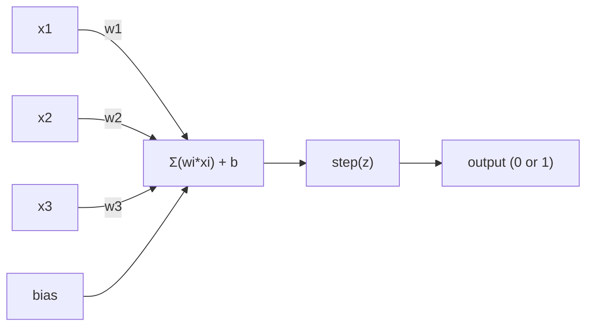
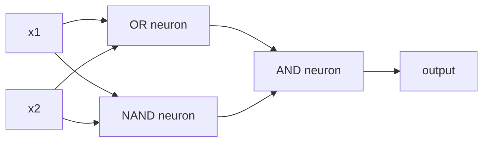

# (الـ (بيرسبترون

> إنّ الـ (بيرسبترون) هو ذرة الشبكات العصبية، فلتفتحه وتجد الوزن، والتحيز، والقرار.

**Type:** Build
**Languages:** Python
**Prerequisites:** Phase 1 (Linear Algebra Intuition)
**Time:** ~60 minutes

## أهداف التعلم

- تنفيذ Perception من الصفر في Python، بما في ذلك قاعدة تحديث الوزن و وظيفة تفعيل الخطوة
- شرح لماذا يمكن لمعرفة واحدة فقط حل المشاكل القابلة للفصل بشكل خطي وتوضيح حالة فشل XOR
- بناء عقار متعدد الطبقات من خلال تركيب بوابات OR، NAND، و AND لحل XOR
- تدريب شبكة طبقتين مع تنشيط sigmoid والانتشار الخلفي لتعلم XOR تلقائيًا

## المشكلة

تعرف المتجهات والمنتجات النقطية. تعرف أن المصفوفة تحول المدخلات إلى الخروج. ولكن كيف تدرس الآلة أي تحويل تستخدم؟

الإدراك الإجابة على هذا. إنها أبسط آلة تعلم ممكنة: تأخذ بعض المدخلات، وتضاعفها بالوزن، تضيف تحيزًا، وتخذ قرار ثنائي. ثم تعديل. هذا كل شبكة عصبية تم إنشاؤها هي طبقات من هذه الفكرة مكبأة معًا.

فهم الفهم يعني فهم ما يعني "التعلم" في الواقع في الرمز: ضبط الأرقام حتى تتطابق الخروج مع الواقع.

## المفهوم

### عصب واحد، قرار واحد

يأخذ الفهم n مدخلات، ويعد كل منها وزنا، ويعددهم، ويعد تحيز، ويمر النتيجة من خلال وظيفة تنشيط.



وظيفة الخطوة وحشية: إذا كان المجموع الموزن زائد التحيز >= 0، الخروج 1. خلاف ذلك، الخروج 0.

```
step(z) = 1  if z >= 0
           0  if z < 0
```

هذا تصنيف خطي. يحدد الوزن والتحيز خطًا (أو طائرة فائقة في الأبعاد العالية) يقسّم مساحة المدخل إلى منطقتين.

### حدود القرار

بالنسبة إلى مدخلين، يرسم الفحص خطاً عبر الفضاء الثنائي الأبعاد:

```
  x2
  ┤
  │  Class 1        /
  │    (0)          /
  │                /
  │               / w1·x1 + w2·x2 + b = 0
  │              /
  │             /     Class 2
  │            /        (1)
  ┼───────────/──────────── x1
```

كل شيء على جانب واحد من الخط ينتج 0. كل شيء على الجانب الآخر ينتج 1. التدريب يتنقل هذا الخط حتى يفصل الصف بشكل صحيح.

### قاعدة التعلم

قاعدة تعلم "الجهاز" بسيطة:

```
For each training example (x, y_true):
    y_pred = predict(x)
    error = y_true - y_pred

    For each weight:
        w_i = w_i + learning_rate * error * x_i
    bias = bias + learning_rate * error
```

إذا كان التنبؤ صحيحاً، فإن الخطأ = 0، لا يتغير أي شيء. إذا كان يتنبأ 0 ولكن يجب أن يكون 1, تزيد الوزن. إذا كان يتنبأ 1 ولكن يجب أن يكون 0, تقل الوزن. معدل التعلم يسيطر على مدى حجم كل تعديل.

### مشكلة XOR

ها هو المكان الذي ينهار فيه انظروا إلى هذه البوابات المنطقية

```
AND gate:           OR gate:            XOR gate:
x1  x2  out         x1  x2  out         x1  x2  out
0   0   0           0   0   0           0   0   0
0   1   0           0   1   1           0   1   1
1   0   0           1   0   1           1   0   1
1   1   1           1   1   1           1   1   0
```

AND و OR قابلان للفصل بشكل خطي: يمكنك رسم خط واحد لفرق 0s من 1s. لا يعد XOR. لا يمكن لأي خط واحد فصل [0,1] و [1,0] من [0,0] و [1,1].

```
AND (separable):        XOR (not separable):

  x2                      x2
  1 ┤  0     1            1 ┤  1     0
    │     /                 │
  0 ┤  0 / 0              0 ┤  0     1
    ┼──/──────── x1         ┼──────────── x1
       line works!          no single line works!
```

هذا هو الحد الأساسي. يمكن أن يحل جهاز تصور واحد فقط المشاكل المنفصلة خطيا. أثبت هذا مينسكي و بابرط في عام 1969 و تقريبا قتل بحث الشبكات العصبية لمدة عقد.

الحل: قم بتجميع الأشرار إلى طبقات. يمكن لأشرار متعددة الطبقات حل XOR عن طريق دمج قرارين خطيين إلى واحد غير خطي.

```figure
perceptron-boundary
```

## بناءها

### الخطوة الأولى: فئة Perceptron

```python
class Perceptron:
    def __init__(self, n_inputs, learning_rate=0.1):
        self.weights = [0.0] * n_inputs
        self.bias = 0.0
        self.lr = learning_rate

    def predict(self, inputs):
        total = sum(w * x for w, x in zip(self.weights, inputs))
        total += self.bias
        return 1 if total >= 0 else 0

    def train(self, training_data, epochs=100):
        for epoch in range(epochs):
            errors = 0
            for inputs, target in training_data:
                prediction = self.predict(inputs)
                error = target - prediction
                if error != 0:
                    errors += 1
                    for i in range(len(self.weights)):
                        self.weights[i] += self.lr * error * inputs[i]
                    self.bias += self.lr * error
            if errors == 0:
                print(f"Converged at epoch {epoch + 1}")
                return
        print(f"Did not converge after {epochs} epochs")
```

### الخطوة الثانية: تدريب على البوابات المنطقية

```python
and_data = [
    ([0, 0], 0),
    ([0, 1], 0),
    ([1, 0], 0),
    ([1, 1], 1),
]

or_data = [
    ([0, 0], 0),
    ([0, 1], 1),
    ([1, 0], 1),
    ([1, 1], 1),
]

not_data = [
    ([0], 1),
    ([1], 0),
]

print("=== AND Gate ===")
p_and = Perceptron(2)
p_and.train(and_data)
for inputs, _ in and_data:
    print(f"  {inputs} -> {p_and.predict(inputs)}")

print("\n=== OR Gate ===")
p_or = Perceptron(2)
p_or.train(or_data)
for inputs, _ in or_data:
    print(f"  {inputs} -> {p_or.predict(inputs)}")

print("\n=== NOT Gate ===")
p_not = Perceptron(1)
p_not.train(not_data)
for inputs, _ in not_data:
    print(f"  {inputs} -> {p_not.predict(inputs)}")
```

### الخطوة الثالثة: مشاهدة فشل XOR

```python
xor_data = [
    ([0, 0], 0),
    ([0, 1], 1),
    ([1, 0], 1),
    ([1, 1], 0),
]

print("\n=== XOR Gate (single perceptron) ===")
p_xor = Perceptron(2)
p_xor.train(xor_data, epochs=1000)
for inputs, expected in xor_data:
    result = p_xor.predict(inputs)
    status = "OK" if result == expected else "WRONG"
    print(f"  {inputs} -> {result} (expected {expected}) {status}")
```

هذا دليل قوي على أن جهاز إدراك واحد لا يستطيع تعلم XOR

### الخطوة 4: حل XOR مع طبقتين

الخدعة: XOR = (x1 OR x2) و لا (x1 و x2). مزج ثلاثة مفاتيح:



```python
def xor_network(x1, x2):
    or_neuron = Perceptron(2)
    or_neuron.weights = [1.0, 1.0]
    or_neuron.bias = -0.5

    nand_neuron = Perceptron(2)
    nand_neuron.weights = [-1.0, -1.0]
    nand_neuron.bias = 1.5

    and_neuron = Perceptron(2)
    and_neuron.weights = [1.0, 1.0]
    and_neuron.bias = -1.5

    hidden1 = or_neuron.predict([x1, x2])
    hidden2 = nand_neuron.predict([x1, x2])
    output = and_neuron.predict([hidden1, hidden2])
    return output


print("\n=== XOR Gate (multi-layer network) ===")
for inputs, expected in xor_data:
    result = xor_network(inputs[0], inputs[1])
    print(f"  {inputs} -> {result} (expected {expected})")
```

كل الحالات الأربعة صحيحة، إنّ تجميع الأشرار إلى طبقات يخلق حدود قرار لا يمكن لأيّ أشرار واحد أن يُنتجها.

### الخطوة 5: قم بتدريب شبكة ذات طبقتين

الخطوة 4 تسلك الوزن يدويا. هذا يعمل ل XOR، ولكن ليس للمشاكل الحقيقية حيث لا تعرف الوزن الصحيح مسبقا. الحل: استبدال وظيفة الخطوة مع sigmoid وتعلم الوزن تلقائيا من خلال الانتشار الخلفي.

```python
class TwoLayerNetwork:
    def __init__(self, learning_rate=0.5):
        import random
        random.seed(0)
        self.w_hidden = [[random.uniform(-1, 1), random.uniform(-1, 1)] for _ in range(2)]
        self.b_hidden = [random.uniform(-1, 1), random.uniform(-1, 1)]
        self.w_output = [random.uniform(-1, 1), random.uniform(-1, 1)]
        self.b_output = random.uniform(-1, 1)
        self.lr = learning_rate

    def sigmoid(self, x):
        import math
        x = max(-500, min(500, x))
        return 1.0 / (1.0 + math.exp(-x))

    def forward(self, inputs):
        self.inputs = inputs
        self.hidden_outputs = []
        for i in range(2):
            z = sum(w * x for w, x in zip(self.w_hidden[i], inputs)) + self.b_hidden[i]
            self.hidden_outputs.append(self.sigmoid(z))
        z_out = sum(w * h for w, h in zip(self.w_output, self.hidden_outputs)) + self.b_output
        self.output = self.sigmoid(z_out)
        return self.output

    def train(self, training_data, epochs=10000):
        for epoch in range(epochs):
            total_error = 0
            for inputs, target in training_data:
                output = self.forward(inputs)
                error = target - output
                total_error += error ** 2

                d_output = error * output * (1 - output)

                saved_w_output = self.w_output[:]
                hidden_deltas = []
                for i in range(2):
                    h = self.hidden_outputs[i]
                    hd = d_output * saved_w_output[i] * h * (1 - h)
                    hidden_deltas.append(hd)

                for i in range(2):
                    self.w_output[i] += self.lr * d_output * self.hidden_outputs[i]
                self.b_output += self.lr * d_output

                for i in range(2):
                    for j in range(len(inputs)):
                        self.w_hidden[i][j] += self.lr * hidden_deltas[i] * inputs[j]
                    self.b_hidden[i] += self.lr * hidden_deltas[i]
```

```python
net = TwoLayerNetwork(learning_rate=2.0)
net.train(xor_data, epochs=10000)
for inputs, expected in xor_data:
    result = net.forward(inputs)
    predicted = 1 if result >= 0.5 else 0
    print(f"  {inputs} -> {result:.4f} (rounded: {predicted}, expected {expected})")
```

فرق رئيسيان من الخطوة 4، أولا، sigmoid يحل محل وظيفة الخطوة -- انها سلسة، لذلك وجود تراجع. ثانيا، `train`طريقة نشر الخطأ إلى الوراء من الخروج إلى الطبقة المخفية، وتعديل كل وزن متناسبة مساهمته في الخطأ. وهذا هو الانتشار إلى الوراء في 20 خط.

هذه هي جسر الدروس الثالثة والرياضيات وراءها`d_output`و`hidden_deltas`هي قاعدة سلسلة تطبق على الرسم البياني للشبكة. سنستدله بشكل صحيح هناك.

## استخدمها

كل ما بنيته من الصفر موجود في إحدى الواردات:

```python
from sklearn.linear_model import Perceptron as SkPerceptron
import numpy as np

X = np.array([[0,0],[0,1],[1,0],[1,1]])
y = np.array([0, 0, 0, 1])

clf = SkPerceptron(max_iter=100, tol=1e-3)
clf.fit(X, y)
print([clf.predict([x])[0] for x in X])
```

خمسة خطات، خطك الـ30`Perceptron`الطبقة تفعل نفس الشيء. إصدار sklearn يضيف التحقق من التقارب، وظائف الخسارة المتعددة، ودعم المدخل النادر -- ولكن الحلقة الأساسية هي نفسها: المبلغ الموزن، وظيفة الخطوة، تحديث الوزن على الخطأ.

الفجوة الحقيقية تظهر على نطاق واسع. ما هي التغييرات في شبكات الإنتاج:

- تصبح وظيفة الخطوة sigmoid، ReLU، أو غيرها من التفعيلات السلسة
- يتم تعلم الأوزان تلقائياً عن طريق التنشر الخلفي (المدرسة 03)
- الطبقات تصبح أعمق: 3، 10، 100+ طبقة
- نفس المبدأ ينطبق: كل طبقة تخلق ميزات جديدة من نتائج الطبقة السابقة

يمكن لـ (البصرية) الواحدة رسم خطوط مستقيمة فقط، قم بتجميعها، ويمكنك رسم أي شكل

## أرسله

هذا الدرس ينتج عن:
- `outputs/skill-perceptron.md`- مهارة تغطي عندما تكون هناك حاجة إلى معمارات ذات طبقة واحدة مقابل متعددة الطبقات

## التمارين

1. تدريب جهاز الرؤية على بوابة NAND (البوابة العالمية - يمكن بناء أي دائرة منطقية من NAND). التحقق من وزنها والتحيز تشكل حدود القرارات المفعول.
2. تعديل فئة Perceptron لتتبع حدود القرار (w1*x1 + w2*x2 + b = 0) في كل عصر. طبع كيفية تحول الخط أثناء التدريب على بوابة AND.
3. بناء 3 مدخلات perceptron التي تنطلق 1 فقط عندما 2 على الأقل من المدخلات 3 هي 1 (عمل تصويت الأغلبية). هل هذا يمكن فصل خطيا؟ لماذا؟

## الشروط الرئيسية

| Term | What people say | What it actually means |
|------|----------------|----------------------|
| Perceptron | "A fake neuron" | A linear classifier: dot product of inputs and weights, plus bias, through a step function |
| Weight | "How important an input is" | A multiplier that scales each input's contribution to the decision |
| Bias | "The threshold" | A constant that shifts the decision boundary, letting the perceptron fire even with zero inputs |
| Activation function | "The thing that squishes values" | A function applied after the weighted sum - step function for perceptrons, sigmoid/ReLU for modern networks |
| Linearly separable | "You can draw a line between them" | A dataset where a single hyperplane can perfectly separate the classes |
| XOR problem | "The thing perceptrons can't do" | Proof that single-layer networks cannot learn non-linearly-separable functions |
| Decision boundary | "Where the classifier switches" | The hyperplane w*x + b = 0 that divides input space into two classes |
| Multi-layer perceptron | "A real neural network" | Perceptrons stacked in layers, where each layer's output feeds the next layer's input |

## المزيد من القراءة

- فرانك روزنبلات، "الصور: نموذج محتمل لتخزين المعلومات والتنظيم في الدماغ" (1958) -- الورقة الأصلية التي بدأت كل شيء
- مينسكي و بابرت، "المتصورين" (1969) -- الكتاب الذي أثبت أن XOR لا يمكن حلها من قبل شبكات طبقة واحدة وأدمرت البحث عن المعتبرات لمدة عقد
- مايكل نيلسن، "الشبكات العصبية والتعلم العميق"، الفصل 1 (http://neuralnetworksanddeeplearning.com/) -- مجانا على الإنترنت، أفضل تفسير بصري لكيفية تكوين الشبكات
