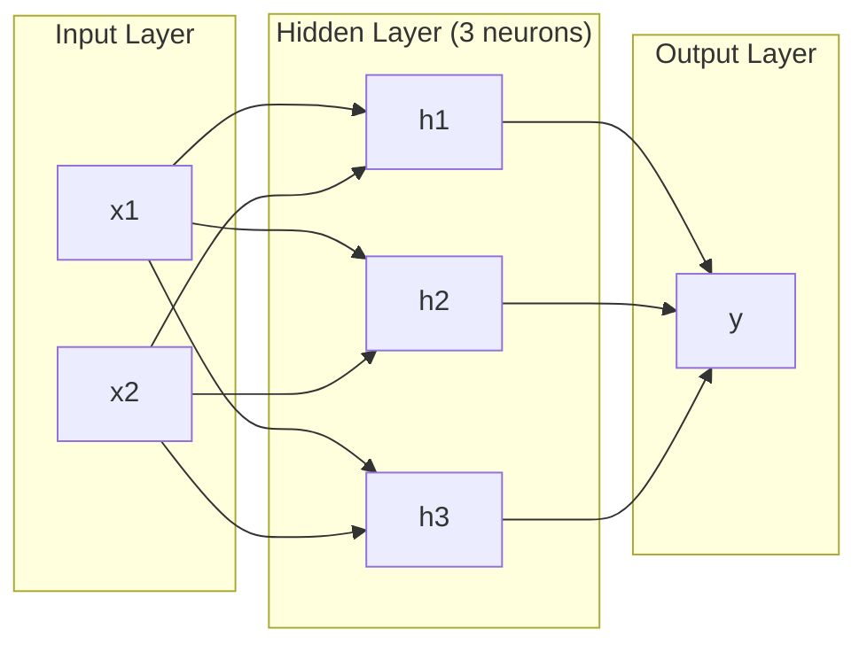
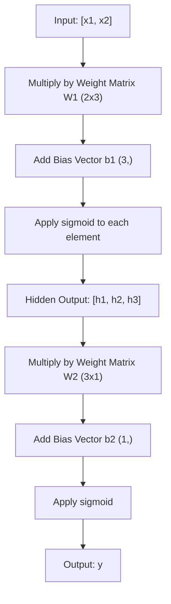
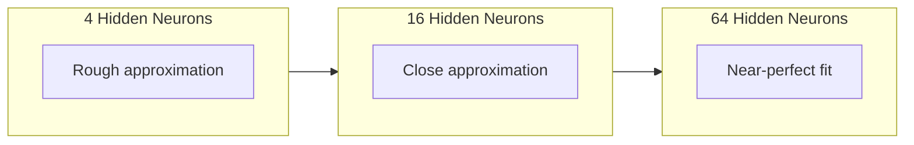

# شبكات متعددة الطبقات والمركز الأمامي

> إحدى الخلايا العصبية ترسم خطاً، قم بتجميعها، ويمكنك رسم أي شيء.

**Type:** Build
**Languages:** Python
**Prerequisites:** Phase 01 (Math Foundations), Lesson 03.01 (The Perceptron)
**Time:** ~90 minutes

## أهداف التعلم

- بناء شبكة متعددة الطبقات من الصفر مع طبقات الطبقة والشبكة التي تقوم بإجراء مرور كامل إلى الأمام
- قم بتعقب أبعاد المصفوفة عبر كل طبقة من الشبكة وتحديد عدم مطابقة الشكل
- شرح كيفية تخزين التفعيلات غير الخطية تمكن الشبكة من تعلم حدود القرار الملتوية
- حل مشكلة XOR باستخدام بنية 2-2-1 مع أوزان sigmoid المنسقة يدويا

## المشكلة

العصبية الوحيدة هي سحب خط. هذا هو. خط مستقيم واحد عبر بياناتك. كل مشكلة حقيقية في الذكاء الاصطناعي -- التعرف على الصور، فهم اللغة، اللعب على الجو -- تتطلب منحنى.

في عام 1969، أثبت مينسكي وبابر هذا القيود أنه كان قاتلا: لا يمكن لشبكة ذات طبقة واحدة تعلم XOR. لا "تتصارعات لتعلم" - رياضيا لا يمكن. جدول الحقيقة XOR يضع [0,1] و [1,0] على جانب واحد، [0,0] و [1,1] على الآخر. لا خط واحد يفصل بينهما.

هذا أدى إلى إيقاف تمويل الشبكات العصبية لأكثر من عقد. كان التحدي واضحاً في الآونة الأخيرة: توقف عن استخدام طبقة واحدة. قم بتجميع الخلايا العصبية إلى طبقات. دع الطبقة الأولى تخطي مساحة المدخل إلى ميزات جديدة، ودع الطبقة الثانية تجمع هذه الميزات إلى قرارات لا يمكن لأي سطر واحد اتخاذها.

هذه الدرجة هي الشبكة متعددة الطبقات. إنها أساس كل نموذج للتعلم العميق في الإنتاج اليوم. المضي قدما -- البيانات التي تتدفق من المدخل عبر الطبقات الخفية إلى الخروج -- هو أول شيء تحتاج إلى بناء قبل أن يعمل أي شيء آخر.

## المفهوم

### الطبقات: المدخل، المخفي، الخروج

شبكة متعددة الطبقات لديها ثلاثة أنواع من الطبقات:

**Input layer**-- ليس طبقة حقيقية. انها تحتوي على بياناتك الخام. اثنين من الميزات تعني عقدين دخول. لا حساب يحدث هنا.

**Hidden layers**حيث يحدث العمل. كل خلية عصبية تأخذ كل خروج من الطبقة السابقة، وتطبق الوزن والتحيز، ثم تمرنت النتيجة من خلال وظيفة تنشيط. "خفية" لأنك لا ترى هذه القيم مباشرة في بيانات التدريب.

**Output layer**الجواب النهائي. للتصنيف الثنائي، عصب واحد مع sigmoid. للطبقة متعددة، عصب واحد لكل طبقة.



هذه شبكة 2-3-1 . اثنين من المدخلات ، ثلاثة الخلايا العصبية الخفية ، واحد الخروج. كل اتصال يحمل وزن. كل خلايا العصبية (باستثناء المدخل) يحمل تحيز.

كل طبقة تنتج متجه للأرقام يسمى حالة مخفية. بالنسبة للنص، تزيد الحالات الخفية من الامتعداد -- تشفير كلمة كمعدد 768 لالتقاط المعنى التمويلي. بالنسبة للصور، تقلل من الامتعداد -- تضغط على ملايين البيكسل في تمثيل قابلة للتحكم. الحالة الخفية هي حيث يعيش التعلم.

### العصبية والفعال

كل خلية عصبية تفعل ثلاثة أشياء:

1. ضرب كل مدخل بمساويه
2. جمع جميع المنتجات و إضافة التحيز
3. إرسال المبلغ من خلال وظيفة التفعيل

في الوقت الحالي، التفعيل هو sigmoid:

```
sigmoid(z) = 1 / (1 + e^(-z))
```

سيغمايد يضرب أي عدد في النطاق (0,1) ، مدخلات إيجابية كبيرة تدفع نحو 1. مدخلات سلبية كبيرة تدفع نحو 0. خرائط صفر إلى 0.5. هذا المنحنى السلس هو ما يجعل التعلم ممكن - على عكس خطوة صعبة من perceptron، سيغمايد لديها تراجع في كل مكان.

### التسلل إلى الأمام: كيف تتدفق البيانات

يضغط الممر المسبق بيانات المدخل عبر الشبكة، طبقة بعد طبقة، حتى تصل إلى الخروج. لا يحدث أي تعلم أثناء الممر المسبق. إنه حساب خالص: مضاعفة، إضافة، تفعيل، تكرار.



في كل طبقة، تحدث ثلاث عمليات متتالية:

```
z = W * input + b       (linear transformation)
a = sigmoid(z)           (activation)
```

إنخراج طبقة واحدة يصبح مدخل للطبقة التالية. هذا هو المخطط الأمامي بأكمله.

### أبعاد المصفوفة

أبعاد التتبع هي أهم مهارة إصلاح الأجهزة في التعلم العميق.

| Step | Operation | Dimensions | Result Shape |
|------|-----------|------------|-------------|
| Input | x | -- | (2,) |
| Hidden linear | W1 * x + b1 | W1: (3, 2), b1: (3,) | (3,) |
| Hidden activation | sigmoid(z1) | -- | (3,) |
| Output linear | W2 * h + b2 | W2: (1, 3), b2: (1,) | (1,) |
| Output activation | sigmoid(z2) | -- | (1,) |

القاعدة: المصفوفة الوزن W في الطبقة k لها شكل (الأنبياطية_in_layer_k، والأنبياطية_in_layer_k_minus_1). الصفوف تتطابق مع الطبقة الحالية. الأعمدة تتطابق مع الطبقة السابقة. إذا كانت الأشكال لا تتطابق، لديك خطأ.

### نظرية التقريب العالمي

في عام 1989، أثبت جورج سيبينكو شيئاً ملحوظاً: شبكة عصبية ذات طبقة واحدة مخفية وموجودة عدد كافٍ من الخلايا العصبية يمكنها تقريب أي وظيفة مستمرة إلى أي دقة مرغوب فيها.

هذا لا يعني أن طبقة واحدة مخفية هي الأفضل دائماً. هذا يعني أن الهندسة المعمارية قادرة نظرياً. في الممارسة العملية، تتعلم الشبكات العميقة (أكثر طبقات، عدد أقل من الخلايا العصبية لكل طبقة) نفس الوظائف مع معايير إجمالية أقل بكثير من الشبكات السطحية. هذا هو السبب في أن التعلم العميق يعمل.

الاندماج: كل عصبية في الطبقة الخفية تتعلم "تضخم" أو ميزة واحدة. الضخم الكافي الموضح في المواقع الصحيحة يمكن تقرب أي منحنى سلس. المزيد من الخلايا العصبية، المزيد من الضخم، تقرب أفضل.



### التراكم

شبكات العصبية قابلة للتكوين. يمكنك تجميعها، وتسلسلها، وتشغيلها بالتوازي. تستخدم نموذج Whisper شبكة مُشفّر لمعالجة الصوت وشبكة مُشفّر منفصلة لتوليد النص. هي الشبكات العصرية الحديثة مُشفّرة فقط. BERT مُشفّر فقط. T5 مُشفّر مُشفّر. اختيار الهندسة المعمارية يحدد ما يمكن أن يفعله النموذج.

```figure
mlp-forward
```

## بناءها

بيثون خالص، لا توجد عمالة، كل عملية ماتريكس مكتوبة من الصفر

### الخطوة الأولى: تنشيط سيغمويد

```python
import math

def sigmoid(x):
    x = max(-500.0, min(500.0, x))
    return 1.0 / (1.0 + math.exp(-x))
```

القيادة إلى [500، 500] تمنع الإفراط. `math.exp(500)`ضخمة ولكن محدودة`math.exp(1000)`هو اللانهاية.

### الخطوة الثانية: فئة الطبقة

أهم عملية في كل التعلم العميق هو مضاعفة المصفوفة. كل طبقة، كل رأس الاهتمام، كل مرور إلى الأمام -- إنها متمولات في كل الطريق إلى أسفل. طبقة خطية تأخذ متجه إدخال، تضاعفها بمصفوفة الوزن، وتضيف متجه تحيز: y = Wx + b. هذه المعادلة الوحيدة هي 90٪ من الحساب في شبكة عصبية.

تحتوي الطبقة على ماتريكس وزن و متجه تحيز. طريقة التقدم لها تأخذ متجه مدخل وتعيد الخروج المفعول.

```python
class Layer:
    def __init__(self, n_inputs, n_neurons, weights=None, biases=None):
        if weights is not None:
            self.weights = weights
        else:
            import random
            self.weights = [
                [random.uniform(-1, 1) for _ in range(n_inputs)]
                for _ in range(n_neurons)
            ]
        if biases is not None:
            self.biases = biases
        else:
            self.biases = [0.0] * n_neurons

    def forward(self, inputs):
        self.last_input = inputs
        self.last_output = []
        for neuron_idx in range(len(self.weights)):
            z = sum(
                w * x for w, x in zip(self.weights[neuron_idx], inputs)
            )
            z += self.biases[neuron_idx]
            self.last_output.append(sigmoid(z))
        return self.last_output
```

المصفوفة الوزن لها شكل (n_neurons, n_inputs). كل سطر هو وزن عصب واحد عبر جميع المدخلات. يدور طريقة الأمام عبر الخلايا العصبية، يحسب المبلغ الموزن بالإضافة إلى التحيز، ويطبق sigmoid، ويجمع النتائج.

### الخطوة الثالثة: فئة الشبكة

شبكة هي قائمة من الطبقات. يسلسل السفر الأمامي لهم: إنتاج الطبقة k يغذى إلى الطبقة k + 1.

```python
class Network:
    def __init__(self, layers):
        self.layers = layers

    def forward(self, inputs):
        current = inputs
        for layer in self.layers:
            current = layer.forward(current)
        return current
```

هذه هي المخطط الأمامي بأكمله أربعة خطوط من المنطق البيانات تدخل وتدفق عبر كل طبقة وتخرج من الجانب الآخر

### الخطوة الرابعة: XOR مع الوزن المنسق يدوياً

في الدروس 01, حلنا XOR عن طريق دمج OR, NAND, و AND perceptrons. الآن نفعل الشيء نفسه مع طبقات الطبقة والشبكة لدينا. بنية 2-2-1: مدخلين، وعملية تخفيض مختبئين، وناتج واحد.

```python
hidden = Layer(
    n_inputs=2,
    n_neurons=2,
    weights=[[20.0, 20.0], [-20.0, -20.0]],
    biases=[-10.0, 30.0],
)

output = Layer(
    n_inputs=2,
    n_neurons=1,
    weights=[[20.0, 20.0]],
    biases=[-30.0],
)

xor_net = Network([hidden, output])

xor_data = [
    ([0, 0], 0),
    ([0, 1], 1),
    ([1, 0], 1),
    ([1, 1], 0),
]

for inputs, expected in xor_data:
    result = xor_net.forward(inputs)
    predicted = 1 if result[0] >= 0.5 else 0
    print(f"  {inputs} -> {result[0]:.6f} (rounded: {predicted}, expected: {expected})")
```

الوزن الكبير (20، -20) يجعل السيغميد يعمل كعمل خطوة. الخلايا العصبية الأولى مخفية تقترب من OR. الثانية تقترب من NAND. الخروج الخلايا العصبية يجمع بينهم في AND، وهو XOR.

### الخطوة 5: تصنيف الدوائر

مشكلة أصعب: تصنيف النقاط الثنائية الأبعاد داخل أو خارج دائرة ذات نصف قطر 0.5 مركزية على المنشأ. وهذا يتطلب حدود قرار منحنية - مستحيلة لمستشعر واحد.

```python
import random
import math

random.seed(42)

data = []
for _ in range(200):
    x = random.uniform(-1, 1)
    y = random.uniform(-1, 1)
    label = 1 if (x * x + y * y) < 0.25 else 0
    data.append(([x, y], label))

circle_net = Network([
    Layer(n_inputs=2, n_neurons=8),
    Layer(n_inputs=8, n_neurons=1),
])
```

مع الوزن العشوائية، لن تصنف الشبكة بشكل جيد. ولكن الممر الأمامي لا يزال يعمل. هذه هي النقطة - الممر الأمامي هو مجرد الحساب. تعلم الوزن الصحيح هو الانتشار الخلفي، يأتي في الدروس 03.

```python
correct = 0
for inputs, expected in data:
    result = circle_net.forward(inputs)
    predicted = 1 if result[0] >= 0.5 else 0
    if predicted == expected:
        correct += 1

print(f"Accuracy with random weights: {correct}/{len(data)} ({100*correct/len(data):.1f}%)")
```

الوزن العشوائي يعطي دقة سيئة -- غالبا ما أسوأ من تخمين الطبقة الأغلبية. بعد التدريب (المدرسة 03) ، هذه الهندسة المعمارية ذات 8 خلية عصبية مخفية سوف ترسم حدودًا مُلتوية تفصل بين الداخل والخارج.

## استخدمها

(بيتورش) يقوم بكل شيء أعلاه في أربع خطوط:

```python
import torch
import torch.nn as nn

model = nn.Sequential(
    nn.Linear(2, 8),
    nn.Sigmoid(),
    nn.Linear(8, 1),
    nn.Sigmoid(),
)

x = torch.tensor([[0.0, 0.0], [0.0, 1.0], [1.0, 0.0], [1.0, 1.0]])
output = model(x)
print(output)
```

`nn.Linear(2, 8)`هو طبقة الطبقة الخاصة بك: المصفوفة الوزن من الشكل (8, 2) ، متجه التوجه من الشكل (8,). `nn.Sigmoid()`هو وظيفة سيغمويد الخاصة بك تطبيق العنصر الحكيم. `nn.Sequential`هو فئة شبكتك: طبقات السلسلة في ترتيب.

الفرق هو السرعة والحجم. بيتورش تعمل على أجهزة المعالجة المعالجة، وتتعامل مع مجموعات من الملايين من العينات، وتحسب تلقائياً تراجع للتنشر للخلف. ولكن منطق المضي قدما هو نفسه لما قمت ببناءه من الصفر.

## أرسله

هذا الدروس ينتج طلب قابلا للاستعمال مرة أخرى لتصميم معالم شبكة:

- `outputs/prompt-network-architect.md`

استخدمها عندما تحتاج إلى تحديد عدد الطبقات، عدد الخلايا العصبية لكل طبقة، وأي وظائف التفعيل تستخدم لمشكلة معينة.

## التمارين

1. قم ببناء شبكة 2-4-2-1 (قوائم مخفية) وتشغيل الإرسال الأمامي على بيانات XOR مع أوزان عشوائية. طبع نتائج الطبقة المخفية المتوسطة لمعرفة كيف يتحول التمثيل في كل طبقة.

2. تغيير حجم الطبقة الخفية في تصنيف الدورة من 8 إلى 2 ثم إلى 32. قم بتشغيل الممر المباشر مع الوزن العشوائي في كل مرة. هل عدد الخلايا العصبية الخفية يغير نطاق الخروج أو التوزيع؟ لماذا؟

3. تنفيذ`count_parameters`طريقة على فئة الشبكة التي تعيد العدد الإجمالي من الوزن والتحيزات التي يمكن تدريبها. اختبره على شبكة 784-256-128-10 (المعماريات MNIST الكلاسيكية). كم عدد المعلمات التي لديها؟

4. قم ببناء مرسلة إلى الأمام لشبكة 3-4-4-2. قم بإعطائها قيم ألوان RGB (معادلة إلى 0-1) ومراقبة المخرجين. هذه هي الهندسة المعمارية لتصنيف اللون البسيط مع فئتين.

5. استبدل sigmoid بـ"خطوة تسرب": أعيد 0.01 * z إذا z < 0, وإلا 1.0. قم بتشغيل الممر المباشر على XOR بنفس الوزن المنسق يدوياً من الخطوة 4. هل لا يزال يعمل؟ لماذا يفضل sigmoid السلس على قطع الصلب؟

## الشروط الرئيسية

| Term | What people say | What it actually means |
|------|----------------|----------------------|
| Forward pass | "Running the model" | Pushing input through every layer -- multiply by weights, add bias, activate -- to produce an output |
| Hidden layer | "The middle part" | Any layer between input and output whose values are not directly observed in the data |
| Multi-layer network | "A deep neural network" | Layers of neurons stacked sequentially, where each layer's output feeds the next layer's input |
| Activation function | "The nonlinearity" | A function applied after the linear transformation that introduces curves into the decision boundary |
| Sigmoid | "The S-curve" | sigma(z) = 1/(1+e^(-z)), squashes any real number to (0,1), smooth and differentiable everywhere |
| Weight matrix | "The parameters" | A matrix W of shape (current_layer_neurons, previous_layer_neurons) containing learnable connection strengths |
| Bias vector | "The offset" | A vector added after the matrix multiply that lets neurons activate even when all inputs are zero |
| Universal approximation | "Neural nets can learn anything" | A single hidden layer with enough neurons can approximate any continuous function -- but "enough" can mean billions |
| Linear transformation | "The matrix multiply step" | z = W * x + b, the computation before activation, which maps inputs to a new space |
| Decision boundary | "Where the classifier switches" | The surface in input space where the network output crosses the classification threshold |

## المزيد من القراءة

- مايكل نيلسن، "الشبكات العصبية والتعلم العميق"، الفصل 1-2 (http://neuralnetworksanddeeplearning.com/) -- أوضح شرح مجاني للمخطوطات الأمامية وهيكل الشبكة ، مع التصورات التفاعلية
- سيبينكو، "الاقتراب عن طريق التنفيذ من وظيفة سيغمايدال" (1989) -- ورقة نظرية التقريب العالمية الأصلية، يمكن قراءتها بشكل مفاجئ
- 3Blue1Brown، "ولكن ما هي الشبكة العصبية؟"https://www.youtube.com/watch?v=aircAruvnKk) -- 20 دقيقة من المشي البصري من خلال الطبقات والوزن والمرورات إلى الأمام التي تبني النموذج العقلي المناسب
- (مُحَبَّبٌ، (بنجيو) ، (كورفيل) ، "التعلم العميق"، الفصل 6 (https://www.deeplearningbook.org/) -- المرجع القياسي لشبكات متعددة الطبقات، مجاناً عبر الإنترنت
