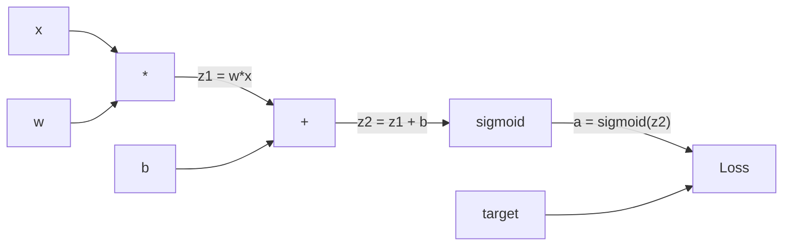
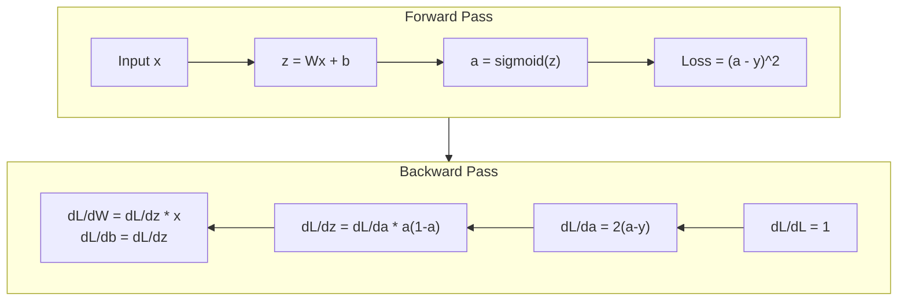
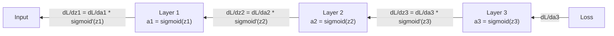

# التنشر الخلفي من الصفر

> التنشر الخلفي هو الخوارزمية التي تجعل التعلم ممكنًا. بدونها، الشبكات العصبية هي مجرد مولدات أرقام عشوائية مكلفة.

**Type:** Build
**Languages:** Python
**Prerequisites:** Lesson 03.02 (Multi-Layer Networks)
**Time:** ~120 minutes

## أهداف التعلم

- تنفيذ محرك أوتوجراد القائم على القيمة الذي يبنو رسومًا محاسبية ويحسب التراجع عبر التنظيم التوبولوجي
- استنتاج الممر الخلفي للضخمة والضاعفة والسيمويد باستخدام قاعدة السلسلة
- تدريب شبكة متعددة الطبقات على XOR وتصنيف الدوائر باستخدام محرك التنشر الخلفي الخاص بك فقط من الصفر
- تحديد مشكلة التهاب المرافق في شبكات sigmoid العميقة وتفسير لماذا تتقلص المرافق بشكل متسارع

## المشكلة

شبكتك لديها طبقة واحدة مخفية مع 768 مدخل و 3072 خروجا. هذا هو 2,359,296 وزنه. لقد قام بتنبؤ خاطئ. أي وزنه أدت إلى الخطأ؟ اختبار كل وزنه بشكل فردي يعني 2.3 مليون مرور إلى الأمام. التنشر الخلفي يحسب جميع 2.3 مليون تراجع في مرور واحد إلى الوراء. هذا ليس تحسينا. هذا هو الفرق بين المدرب والمعجز.

النهج البغيض: أخذ وزن واحد، دفعها بكمية صغيرة، تشغيل الممر إلى الأمام مرة أخرى، قياس ما إذا كان الخسارة ارتفعت أو انخفضت. وهذا يعطي لك تراجع لهذا الوزن. الآن افعله لكل وزن في الشبكة. ضربها بألاف خطوات التدريب وملايين نقاط البيانات. كنت بحاجة إلى وقت جيولوجي لتدريب أي شيء مفيد.

التنشر الخلفي يحل هذا. واحد تقدم، واحد تراجع، جميع التراجع الحوسبة. الحيلة هي قاعدة سلسلة من الحساب، تطبق بشكل منهجي على الرسم البياني الحوسبي. هذا هو الخوارزمية التي جعلت التعلم العميق عملية. بدونها، كنا لا يزال عالقا على مشاكل اللعبة.

## المفهوم

### قاعدة السلسلة، تطبق على الشبكات

لقد رأيت قاعدة السلسلة في المرحلة 01, الدروس 05. إعادة التعبير السريع: إذا y = f(g(x) ، ثم dy/dx = f'(g(x)) * g'(x. أنت ضرب المشتقات على طول السلسلة.

في شبكة عصبية، "السلسلة" هي تسلسل العمليات من المدخل إلى الخسارة. تطبق كل طبقة أوزانًا، تضيف تحيزات، تمر عبر تنشيط. تقوم وظيفة الخسارة بمقارنة الخروج النهائي مع الهدف. تتبع التنشر الخلفي هذه السلسلة إلى الوراء، وتحسب كيفية مساهمة كل عملية في الخطأ.

### الرسومات الحسابية

كل مرور إلى الأمام يبني رسمياً. كل عقدة هي عملية (مضاعفة، مضافة، sigmoid). كل حافة تحمل قيمة إلى الأمام وتحرك إلى الوراء.



المضي قدما: تدفق القيم من اليسار إلى اليمين. x و w ينتج z1 = w * x. إضافة b للحصول على z2. سيغمايد يعطي تفعيل a. مقارنة a إلى الهدف y باستخدام وظيفة الخسارة.

الممر الخلفي: تدفق التدرج يمينا إلى اليسار. تبدأ بـ dL/da (كيف تتغير الخسارة مع التفعيل). مضاعفة بـ da/dz2 (مشتق سيغمايد). هذا يعطي dL/dz2. تقسيم إلى dL/db (الذي يساوي dL/dz2 ، حيث z2 = z1 + b) و dL/dz1. ثم dL/dw = dL/dz1 * x و dL/dx = dL/dz1 * w.

كل عقدة في الرسم البياني لديها وظيفة واحدة خلال المرور إلى الوراء: تأخذ التراجع قادم من الأعلى، و مضاعفة بمشتقها المحلي، و تمررها إلى أسفل.

### للأمام مقابل الخلف



يحتفظ المرور الأمامي بكل قيمة متوسطة: z، a، المدخلات لكل طبقة. يحتاج المرور الخلفي إلى هذه القيم المخزنة لحساب التراجعيات. هذا هو التنازل بين الذاكرة والحوسبة في قلب الوصول الخلفي. تقوم بتبادل الذاكرة (تنشيط التخزين) بالسرعة (مرور واحد بدلاً من ملايين).

### تدريجية تتدفق عبر الشبكة

لشبكة ثلاث طبقات، سلسلة التدفقات عبر كل طبقة:



في كل طبقة، يتم ضرب التراجع بالمت مشتقة sigmoid. المشتقة sigmoid هي * (1 - a) ، والتي تصل إلى 0.25 (عندما a = 0.5). ثلاثة طبقات عميقة، تم ضرب التراجع بأكثر من 0.25^3 = 0.0156. عشرة طبقات عميقة: 0.25^10 = 0.000001.

### الدرجات المختفية

هذه هي مشكلة التراجع المتلاشى. سيقمويد يضرب انتاجها بين 0 و 1. مشتقها دائما أقل من 0.25. قم بتجميع طبقات سيقمويد كافية وتقلص التراجع إلى لا شيء. بالكاد تتعلم الطبقات الأولى لأنها تتلقى تراجعات قريبة من الصفر.

```
sigmoid(z):     Output range [0, 1]
sigmoid'(z):    Max value 0.25 (at z = 0)

After 5 layers:   gradient * 0.25^5 = 0.001x original
After 10 layers:  gradient * 0.25^10 = 0.000001x original
```

هذا هو السبب في أن شبكات sigmoid العميقة مستحيلة تقريبا لتدريب. الإصلاح -- ريلو ومتغيراتها -- هو موضوع الدروس 04.

### استنتاج المراحل لشبكة 2 طبقات

الرياضيات الملموسة لشبكة مع المدخل x، الطبقة الخفية مع sigmoid، الطبقة الخروج مع sigmoid، وفقدان MSE.

التسلل الأمامي:
```
z1 = W1 * x + b1
a1 = sigmoid(z1)
z2 = W2 * a1 + b2
a2 = sigmoid(z2)
L = (a2 - y)^2
```

التخطيط للخلف (تطبيق قاعدة السلسلة خطوة بخطوة):
```
dL/da2 = 2(a2 - y)
da2/dz2 = a2 * (1 - a2)
dL/dz2 = dL/da2 * da2/dz2 = 2(a2 - y) * a2 * (1 - a2)

dL/dW2 = dL/dz2 * a1
dL/db2 = dL/dz2

dL/da1 = dL/dz2 * W2
da1/dz1 = a1 * (1 - a1)
dL/dz1 = dL/da1 * da1/dz1

dL/dW1 = dL/dz1 * x
dL/db1 = dL/dz1
```

كل تراجع هو نتاج من المشتقات المحلية تتبع من الخسارة هذا كل ما هو الانتشار الخلفي.

```figure
backprop-vanishing
```

## بناءها

### الخطوة الأولى: عقد القيمة

كل رقم في الحساب يصبح قيمة. فإنه يحتفظ ببياناته، ومحافضتها، وكيفية إنشاؤها (لذا هو يعرف كيفية حساب المحافضات إلى الوراء).

```python
class Value:
    def __init__(self, data, children=(), op=''):
        self.data = data
        self.grad = 0.0
        self._backward = lambda: None
        self._children = set(children)
        self._op = op

    def __repr__(self):
        return f"Value(data={self.data:.4f}, grad={self.grad:.4f})"
```

لا يوجد تراجع بعد (0. 0) لا يوجد وظيفة تراجع بعد (لا تشغيل)`_children`تتبع أي قيمة أنتجت هذه، حتى يمكننا ترتيب الجرافة من الناحية التوضيحية في وقت لاحق.

### الخطوة الثانية: عمليات مع وظائف متأخرة

كل عملية تخلق قيمة جديدة وتحدد كيفية تدفق التدرج إلى الوراء من خلالها.

```python
def __add__(self, other):
    other = other if isinstance(other, Value) else Value(other)
    out = Value(self.data + other.data, (self, other), '+')

    def _backward():
        self.grad += out.grad
        other.grad += out.grad

    out._backward = _backward
    return out

def __mul__(self, other):
    other = other if isinstance(other, Value) else Value(other)
    out = Value(self.data * other.data, (self, other), '*')

    def _backward():
        self.grad += other.data * out.grad
        other.grad += self.data * out.grad

    out._backward = _backward
    return out
```

لضافة: d(a+b) /da = 1، d(a+b) /db = 1. لذلك كل من المدخلات تحصل على تراجع الخروج مباشرة.

للضرب: d(a*b)/da = b، d(a*b)/db = a. كل مدخل يحصل على قيمة الآخر مضربة على تراجع الخروج.

- نعم`+=`القيمة يمكن استخدامها في عمليات متعددة. تراجعتها هي مجموع تراجعات من جميع المسارات.

### الخطوة الثالثة: سيغمايد والخسارة

```python
import math

def sigmoid(self):
    x = self.data
    x = max(-500, min(500, x))
    s = 1.0 / (1.0 + math.exp(-x))
    out = Value(s, (self,), 'sigmoid')

    def _backward():
        self.grad += (s * (1 - s)) * out.grad

    out._backward = _backward
    return out
```

مشتق سيغمويد: sigmoid(x) * (1 - sigmoid(x)). قمنا بحساب sigmoid(x) = s خلال المضي قدما. استعمله مرة أخرى. لا عمل إضافي.

```python
def mse_loss(predicted, target):
    diff = predicted + Value(-target)
    return diff * diff
```

MSE لإنتاج واحد: (توقعات - هدف) ^ 2 . نعبر عن الحد كجمع مع قيمة سلبية.

### الخطوة الرابعة: التراجع

التنظيم التوبولوجي يضمن أننا نعمل على العقد في الترتيب الصحيح -- تراجع العقد يتم تراكمها بالكامل قبل أن نتكاثر من خلالها.

```python
def backward(self):
    topo = []
    visited = set()

    def build_topo(v):
        if v not in visited:
            visited.add(v)
            for child in v._children:
                build_topo(child)
            topo.append(v)

    build_topo(self)
    self.grad = 1.0
    for v in reversed(topo):
        v._backward()
```

ابدأ في الخسارة (المرح = 1.0 ، منذ dL / dL = 1).`_backward`يضغط على التدفقات إلى أطفالها

### الخطوة 5: الطبقة والشبكة

```python
import random

class Neuron:
    def __init__(self, n_inputs):
        scale = (2.0 / n_inputs) ** 0.5
        self.weights = [Value(random.uniform(-scale, scale)) for _ in range(n_inputs)]
        self.bias = Value(0.0)

    def __call__(self, x):
        act = sum((wi * xi for wi, xi in zip(self.weights, x)), self.bias)
        return act.sigmoid()

    def parameters(self):
        return self.weights + [self.bias]


class Layer:
    def __init__(self, n_inputs, n_outputs):
        self.neurons = [Neuron(n_inputs) for _ in range(n_outputs)]

    def __call__(self, x):
        out = [n(x) for n in self.neurons]
        return out[0] if len(out) == 1 else out

    def parameters(self):
        params = []
        for n in self.neurons:
            params.extend(n.parameters())
        return params


class Network:
    def __init__(self, sizes):
        self.layers = []
        for i in range(len(sizes) - 1):
            self.layers.append(Layer(sizes[i], sizes[i + 1]))

    def __call__(self, x):
        for layer in self.layers:
            x = layer(x)
            if not isinstance(x, list):
                x = [x]
        return x[0] if len(x) == 1 else x

    def parameters(self):
        params = []
        for layer in self.layers:
            params.extend(layer.parameters())
        return params

    def zero_grad(self):
        for p in self.parameters():
            p.grad = 0.0
```

يأخذ العصبية المدخلات ، ويحسب المجموع الموزن + التحيز ، ويتطبق sigmoid. يُقيم مقياس البدء في الوزن بواسطة sqrt(2/n_inputs) لمنع شبع sigmoid في الشبكات العميقة. الطبقة هي قائمة بالعصبية. شبكة هي قائمة بالطبقات.`parameters()`طريقة جمع جميع القيم التي يمكن تعلمها حتى نتمكن من تحديثها.

### الخطوة 6: القطار على XOR

```python
random.seed(42)
net = Network([2, 4, 1])

xor_data = [
    ([0.0, 0.0], 0.0),
    ([0.0, 1.0], 1.0),
    ([1.0, 0.0], 1.0),
    ([1.0, 1.0], 0.0),
]

learning_rate = 1.0

for epoch in range(1000):
    total_loss = Value(0.0)
    for inputs, target in xor_data:
        x = [Value(i) for i in inputs]
        pred = net(x)
        loss = mse_loss(pred, target)
        total_loss = total_loss + loss

    net.zero_grad()
    total_loss.backward()

    for p in net.parameters():
        p.data -= learning_rate * p.grad

    if epoch % 100 == 0:
        print(f"Epoch {epoch:4d} | Loss: {total_loss.data:.6f}")

print("\nXOR Results:")
for inputs, target in xor_data:
    x = [Value(i) for i in inputs]
    pred = net(x)
    print(f"  {inputs} -> {pred.data:.4f} (expected {target})")
```

شاهد انخفاض الخسارة من التنبؤات العشوائية إلى تصحيح خروجيات XOR، مدفوعة بالكامل من قبل تراجع التنشر الحوسبة التدريجية والدفع الوزن في الاتجاه الصحيح.

### الخطوة السابعة: تصنيف الدوائر

في الدروس 02, قمت بتنسيق الأوزان يدوياً لتصنيف الدوائر. الآن دع الشبكة تتعلمها.

```python
random.seed(7)

def generate_circle_data(n=100):
    data = []
    for _ in range(n):
        x1 = random.uniform(-1.5, 1.5)
        x2 = random.uniform(-1.5, 1.5)
        label = 1.0 if x1 * x1 + x2 * x2 < 1.0 else 0.0
        data.append(([x1, x2], label))
    return data

circle_data = generate_circle_data(80)

circle_net = Network([2, 8, 1])
learning_rate = 0.5

for epoch in range(2000):
    random.shuffle(circle_data)
    total_loss_val = 0.0
    for inputs, target in circle_data:
        x = [Value(i) for i in inputs]
        pred = circle_net(x)
        loss = mse_loss(pred, target)
        circle_net.zero_grad()
        loss.backward()
        for p in circle_net.parameters():
            p.data -= learning_rate * p.grad
        total_loss_val += loss.data

    if epoch % 200 == 0:
        correct = 0
        for inputs, target in circle_data:
            x = [Value(i) for i in inputs]
            pred = circle_net(x)
            predicted_class = 1.0 if pred.data > 0.5 else 0.0
            if predicted_class == target:
                correct += 1
        accuracy = correct / len(circle_data) * 100
        print(f"Epoch {epoch:4d} | Loss: {total_loss_val:.4f} | Accuracy: {accuracy:.1f}%")
```

نحن نستخدم SGD على الانترنت هنا -- تحديث الوزن بعد كل عينة بدلا من تراكم المجموعة الكاملة. هذا يكسر التماثل بشكل أسرع وتجنب الاكتفاء sigmoid على المشهد الخسارة الكاملة. خلط البيانات في كل عصر يمنع الشبكة من حفظ النظام.

لا توجد ضبط يدوي. الشبكة تكتشف حدود القرار الدائري بمفردها. هذه هي قوة الانتشار الخلفي: تحدد الهندسة المعمارية، وظيفة الخسارة، والبيانات. الخوارزمية تحدد الوزن.

## استخدمها

يقوم PyTorch بكل شيء أعلاه في عدد قليل من الخطوط. الفكرة الأساسية هي نفسها -- Autograd يبنى رسم حسابي خلال المضي قدما ويتتبعها إلى الوراء لحساب التراجع.

```python
import torch
import torch.nn as nn

model = nn.Sequential(
    nn.Linear(2, 4),
    nn.Sigmoid(),
    nn.Linear(4, 1),
    nn.Sigmoid(),
)
optimizer = torch.optim.SGD(model.parameters(), lr=1.0)
criterion = nn.MSELoss()

X = torch.tensor([[0,0],[0,1],[1,0],[1,1]], dtype=torch.float32)
y = torch.tensor([[0],[1],[1],[0]], dtype=torch.float32)

for epoch in range(1000):
    pred = model(X)
    loss = criterion(pred, y)
    optimizer.zero_grad()
    loss.backward()
    optimizer.step()

print("PyTorch XOR Results:")
with torch.no_grad():
    for i in range(4):
        pred = model(X[i])
        print(f"  {X[i].tolist()} -> {pred.item():.4f} (expected {y[i].item()})")
```

`loss.backward()`هل هو لك`total_loss.backward()`. .`optimizer.step()`هل هو دليلك`p.data -= lr * p.grad`. .`optimizer.zero_grad()`هل هو لك`net.zero_grad()`نفس الخوارزمية، تنفيذ القوة الصناعية. PyTorch يدير تسريع GPU، الدقة المختلطة، التفتيش التدريجي، ومئات من أنواع الطبقة. ولكن المرور الخلفي هو نفس قاعدة سلسلة تطبق على نفس الرسم البياني الحوسبي.

التدريب يدير المرحلة الأمامية ثم المرحلة الخلفية ثم تحديث الأوزان الإحتمالية تُجري فقط المُسلّم الأمامي. لا توجد تراجعات، لا تحديثات. هذا التمييز مهم لأن الاستنتاج هو ما يحدث في الإنتاج. عندما تدعون API مثل كلود أو GPT، تقومون بإستستنتاج -- تتوجه طلبك إلى الأمام عبر الشبكة، وتخرج الرموز من الطرف الآخر. لا تغيير في الوزن فهم الرفع الخلفي مهم لأنه شكّل كل وزن في تلك الشبكة.

## أرسله

هذا الدرس ينتج عن:
- `outputs/prompt-gradient-debugger.md`-- محاولة إعادة استخدام لتشخيص مشاكل التراجع (الاختفاء، الانفجار، NaN) في أي شبكة عصبية

## التمارين

1. إضافة`__sub__`طريقة إلى فئة القيمة (a - b = a + (-1 * b)). ثم تنفيذ a `__neg__`التحقق من صحة التدرج عن طريق مقارنة مع الحساب اليدوي لمعبرة بسيطة مثل (a - b) ^ 2.

2. إضافة`relu`طريقة إلى القيمة (خروج أقصى ((0، x) ، المشتق هي 1 إذا x > 0 ، ثم 0). استبدل sigmoid مع relu في الطبقات الخفية وتدرب على XOR مرة أخرى. مقارنة سرعة التقارب. يجب أن ترى تدريب أسرع -- هذا يقدم الدروس 04.

3. تنفيذ`__pow__`طريقة على القيمة لأقوى الأعداد الكاملة. استخدمها لتحل محل `mse_loss`مع مناسبة`(predicted - target) ** 2`التحقق من أن التدرج يطابق التنفيذ الأصلي.

4. إضافة التقطيع التدريبي إلى حلقة التدريب: بعد الدعوة `backward()`، قم بتقطيع جميع التدرجات إلى [-1, 1]. قم بتدريب شبكة أعمق (أربعة طبقات مع sigmoid) وقارن منحنى الخسارة مع ودون التدريب. هذا هو دفاعك الأول ضد التدرجات المتفجرة.

5. بناء تصميم: بعد التدريب على XOR، طبع تراجع كل معايير في الشبكة. حدد أي طبقة لديها أصغر تراجات. هذا يظهر مشكلة تراجع تختفي التي قرأت عنها في قسم المفهوم.

## الشروط الرئيسية

| Term | What people say | What it actually means |
|------|----------------|----------------------|
| Backpropagation | "The network learns" | An algorithm that computes dL/dw for every weight by applying the chain rule backward through the computational graph |
| Computational graph | "The network structure" | A directed acyclic graph where nodes are operations and edges carry values (forward) and gradients (backward) |
| Chain rule | "Multiply the derivatives" | If y = f(g(x)), then dy/dx = f'(g(x)) * g'(x) -- the mathematical foundation of backpropagation |
| Gradient | "The direction of steepest ascent" | The partial derivative of the loss with respect to a parameter -- tells you how to change that parameter to reduce the loss |
| Vanishing gradient | "Deep networks don't learn" | Gradients shrink exponentially as they propagate through layers with saturating activations like sigmoid |
| Forward pass | "Running the network" | Computing the output from inputs by sequentially applying each layer's operations and storing intermediate values |
| Backward pass | "Computing gradients" | Traversing the computational graph in reverse, accumulating gradients at each node using the chain rule |
| Learning rate | "How fast it learns" | A scalar that controls the step size when updating weights: w_new = w_old - lr * gradient |
| Topological sort | "The right order" | An ordering of graph nodes where each node appears after all nodes it depends on -- ensures gradients are fully accumulated before propagation |
| Autograd | "Automatic differentiation" | A system that builds computational graphs during forward computation and automatically computes gradients -- what PyTorch's engine does |

## المزيد من القراءة

- روميل هارت، هينتون وويليامز، "تعلم التمثيلات عن طريق أخطاء التنشر الخلفي" (1986) -- الورقة التي جعلت التنشر الخلفي منتشراً رئيسياً وتدريب شبكة متعددة الطبقات غير مقفل
- 3Blue1Brown، سلسلة "شبكات العصبية" (https://www.youtube.com/playlist?list=PLZHQObOWTQDNU6R1_67000Dx_ZCJB-3pi) -- أفضل تفسير بصري للتنشر الخلفي وتدفق التدفق عبر الشبكات
