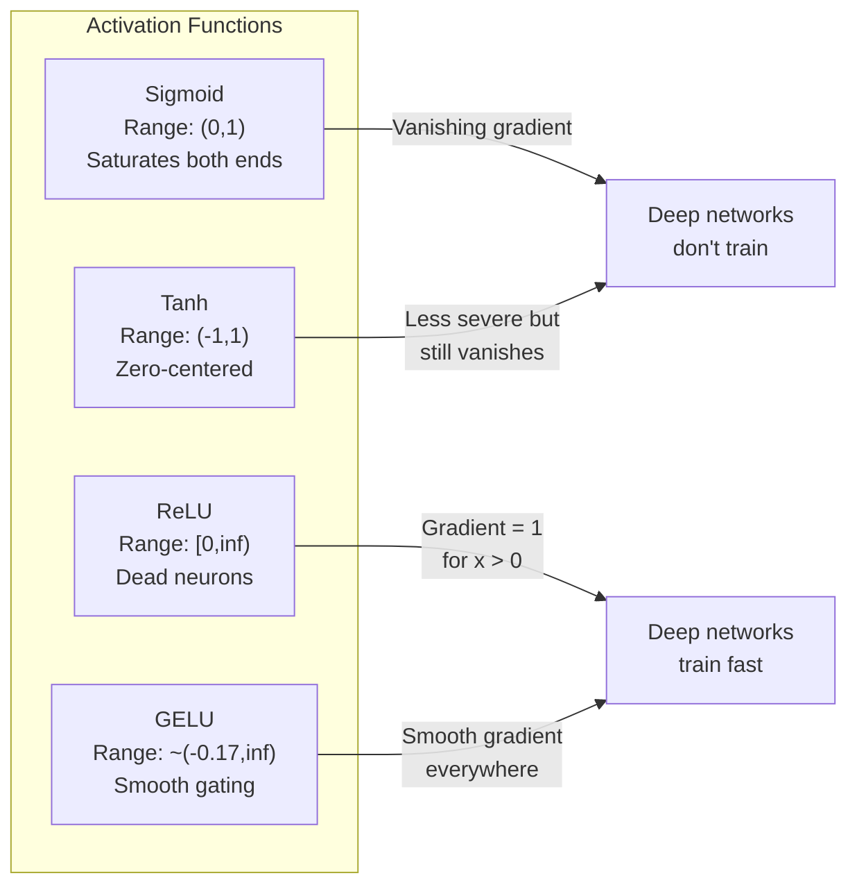
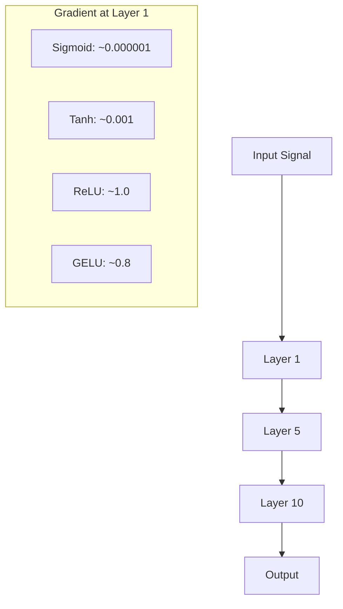
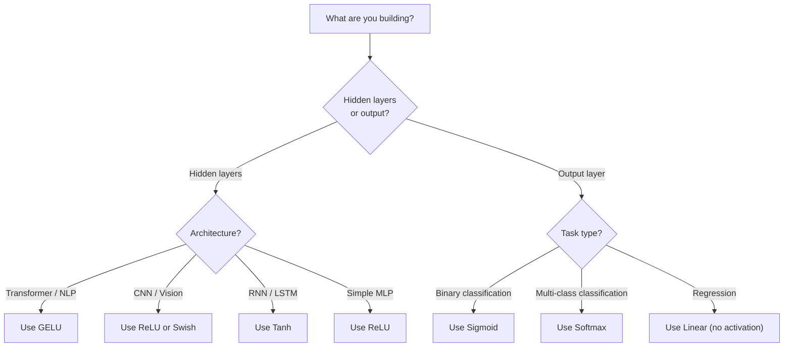

# وظائف التفعيل

> بدون عدم الخيارات الخارجيّة، شبكتك المكونة من 100 طبقة هي مضاعفة ماريخة رائعة. التفعيلات هي البوابات التي تسمح للشبكات العصبية بالتفكير في منحنى.

**Type:** Build
**Languages:** Python
**Prerequisites:** Lesson 03.03 (Backpropagation)
**Time:** ~75 minutes

## أهداف التعلم

- تنفيذ sigmoid، tanh، ReLU، Leaky ReLU، GELU، Swish، و softmax مع مشتقاتها من الصفر
- تشخيص مشكلة التهاب المراحل عن طريق قياس حجم التفعيل عبر 10+ طبقة مع تنشيطات مختلفة
- اكتشاف الخلايا العصبية الميتة في شبكة ReLU وشرح لماذا GELU يتجنب هذا وضع الفشل
- حدد وظيفة التفعيل الصحيحة لهيكل معين (المتحول، CNN، RNN، طبقة الخروج)

## المشكلة

قم بتجميع اثنين من التحوّلات الخطية: y = W2(W1x + b1) + b2. قم بتوسيعها: y = W2W1x + W2b1 + b2. هذا فقط y = Ax + c -- تحوّل خطي واحد. مهما كانت عدد الطبقات الخطية التي تقوم بتجميعها، فإن النتيجة تنهار إلى مصفوفة واحدة مضاعفة. شبكة 100 طبقة لديك نفس القدرة التمثيلية مثل طبقة واحدة.

هذا ليس فضول نظري. هذا يعني أن شبكة خطية عميقة لا تستطيع حرفياً تعلم XOR، لا تستطيع تصنيف مجموعة بيانات مستديرة، لا تستطيع التعرف على وجه. بدون وظائف التفعيل، العمق وهم.

وظائف التفعيل تقطع الخطية يختلفون خروج كل طبقة من خلال وظيفة غير خطية، مما يعطي الشبكة القدرة على منحنى حدود القرار، وتقريب وظائف تعسفية، وتعلم فعليا. ولكن اختر التفعيل الخطأ وتختفي تراجعاتك إلى الصفر (السيغمود في الشبكات العميقة) ، وتنفجر إلى اللانهاية (التفعيلات غير المحدودية دون بدء بعناية) ، أو تموت الخلايا العصبية بشكل دائم (ReLU مع تحيزات سلبية كبيرة). اختيار وظيفة التفعيل يحدد مباشرة ما إذا كانت شبكتك تتعلم على الإطلاق.

## المفهوم

### لماذا لا يتطلب الأمر خطية

مضاعفة المصفوفة قابلة للتكوين. مضاعفة متجهة بمصفوفة A ثم المصفوفة B هو نفس مضاعفة ب AB. وهذا يعني أن تجميع عشرة طبقات خطية يعادل رياضياً طبقة خطية واحدة مع مصفوفة كبيرة واحدة. كل تلك المعايير، كل هذا العمق -- مضيعة. تحتاج إلى شيء لتحطيم السلسلة. هذا ما تفعله وظائف التفعيل.

هنا هو دليل. طبقة خطية يحسب f ((x) = Wx + b. كومة اثنين:

```
Layer 1: h = W1 * x + b1
Layer 2: y = W2 * h + b2
```

البديل:

```
y = W2 * (W1 * x + b1) + b2
y = (W2 * W1) * x + (W2 * b1 + b2)
y = A * x + c
```

طبقة واحدة. أدخل تنشيط غير خطي g() بين الطبقات:

```
h = g(W1 * x + b1)
y = W2 * h + b2
```

الآن يتم كسر الاستبدال. W2 * g(W1 * x + b1) + b2 لا يمكن تقليصها إلى تحول خطي واحد. الشبكة يمكن أن تمثل وظائف غير خطية. كل طبقة إضافية مع تنشيط يضيف القدرة التمثيلية.

### السجمايد

وظيفة التفعيل الأصلية لشبكات العصبية

```
sigmoid(x) = 1 / (1 + e^(-x))
```

نطاق الخروج: (0, 1). سلاسة، قابلة للتفريق، تقوم بتخطيط أي رقم حقيقي إلى قيمة تشبه الاحتمالات.

المشتق:

```
sigmoid'(x) = sigmoid(x) * (1 - sigmoid(x))
```

القيمة القصوى لهذا المشتق هو 0.25 ، والتي تحدث عند x = 0. في الانتشار الخلفي ، تتضاعف التدرجات عبر الطبقات. عشرة طبقات من sigmoid يعني أن التدرجة تتضاعف بأكثر من 0.25 عشرة مرات:

```
0.25^10 = 0.000000953674
```

أقل من مليون جزء من الإشارة الأصلية. هذه مشكلة التهاب المراحل. تصبح المراحل في الطبقات الأولى صغيرة جداً بحيث لا تتحديث الأوزان بالكاد. ويبدو أن الشبكة تتعلم - الخسارة تقل في الطبقات اللاحقة - ولكن الطبقات الأولى تتجمد. شبكات sigmoid العميقة ببساطة لا تتدرب.

مشكلة إضافية: إنتاجات السيغميد تكون دائما إيجابية (0 إلى 1), مما يعني أن تراجعيات على الوزن هي دائما نفس العلامة. وهذا يسبب زيك زاجغ أثناء انخفاض تراجع.

### (تان)

النسخة المركزية من sigmoid.

```
tanh(x) = (e^x - e^(-x)) / (e^x + e^(-x))
```

نطاق الخروج: (-1, 1). مركز على الصفر، مما يزيل مشكلة الزيغ زاج.

المشتق:

```
tanh'(x) = 1 - tanh(x)^2
```

المشتق الأقصى هو 1.0 عند x = 0 -- أربع مرات أفضل من sigmoid. ولكن مشكلة التراجع تختفي لا تزال موجودة. بالنسبة للمدخلات الإيجابية أو السلبية الكبيرة، المشتق يقترب من الصفر. عشرة طبقات لا تزال تحطم التراجع، فقط أقل عدوانية.

### الـ (رليو): الانفجار

وحدة خطية تصحيحة. تم تسليطها للدقة من قبل ناير وهينتون في عام 2010 (المهام نفسها تعود إلى عمل فوكوشيما عام 1969) ، غيرت كل شيء.

```
relu(x) = max(0, x)
```

نطاق الخروج: [0، لا نهاية لها). المشتق هي بسيطة بشكل بسيط:

```
relu'(x) = 1  if x > 0
            0  if x <= 0
```

لا يوجد تراجع يختفي للمدخلات الإيجابية. تراجع هو بالضبط 1، تمر مباشرة. هذا هو السبب في أن الشبكات العميقة أصبحت قابلة للتدريب -- ريلو يحافظ على حجم تراجع عبر الطبقات.

ولكن هناك وضع فشل: مشكلة الخلايا العصبية الميتة. إذا كانت مدخلات الخلايا العصبية الموزعة سلبية دائمًا (بسبب تحيز سلبي كبير أو بدء وزن مؤسف) ، فإن خروجه دائمًا صفر ، وتحديدها دائمًا صفر ، ولا يحتديث أبدًا. إنها ميتة بشكل دائم. في الممارسة العملية ، يمكن أن يموت 10-40٪ من الخلايا العصبية في شبكة ReLU أثناء التدريب.

### " ريلو " متسرب

أسهل علاج للخلايا العصبية الميتة

```
leaky_relu(x) = x        if x > 0
                alpha * x if x <= 0
```

حيث أن ألفا ثابت صغير، عادةً 0.01، الجانب السلبي لديه ميل صغير بدلاً من الصفر، لذا لا يزال الخلايا العصبية الميتة تحصل على إشارة تراجع ويمكن أن تعافى.

### جيلو: الخلل الحديث

وحدة الخطوطية للخطأ الغاسية. قدمتها هندريكس وجيمبل في عام 2016. تنشيط الافتراضي في BERT وGPT ومعظم المحولات الحديثة.

```
gelu(x) = x * Phi(x)
```

حيث Phi ((x) هو وظيفة التوزيع التراكمية لتوزيع الطبيعي القياسي. التقريب المستخدم في الممارسة العملية:

```
gelu(x) ~= 0.5 * x * (1 + tanh(sqrt(2/pi) * (x + 0.044715 * x^3)))
```

GELU مسلس في كل مكان ، ويحتوي على قيم سلبية صغيرة (على عكس ReLU التي تصفح صلبًا إلى الصفر) ، ولها تفسير محتمل: يوزن كل مدخل من خلال احتمال أن يكون إيجابيًا تحت توزيع غوسسي. هذا التغليف السلس يفوق ReLU في معماري المحولات لأنه يوفر تدفق تراجعي أفضل ويجنب مشكلة العصبية الميتة بالكامل.

### سويش / سيلو

اكتشاف التفعيل الذاتي الذي اكتشفته راماشندران وآخرون في عام 2017 من خلال البحث الآلي.

```
swish(x) = x * sigmoid(x)
```

سويش رسمياً هو x * sigmoid ((x) ، اكتشفتها جوجل من خلال البحث الآلي على مساحة وظيفة التفعيل -- شبكة عصبية تصميم أجزاء من الشبكات العصبية.

مثل GELU ، هو سلس وغير متناغم ، ويسمح بقيمات سلبية صغيرة. الفرق خفيف: Swish يستخدم sigmoid للقبض بينما GELU يستخدم CDF غوسية. في الممارسة العملية ، الأداء هو متطابق تقريبًا. يستخدم Swish في EfficientNet وبعض نماذج الرؤية. يهيمن GELU في نماذج اللغة.

### Softmax: تنشيط الخروج

لا تستخدم في الطبقات الخفية. Softmax تحويل متجه من النتائج الخام (اللوجيتس) إلى توزيع الاحتمالات.

```
softmax(x_i) = e^(x_i) / sum(e^(x_j) for all j)
```

كل خروج تتراوح بين 0 و 1. كل الخروج جمع إلى 1. وهذا يجعلها التفعيل النهائي القياسي للتصنيف متعدد الفئات. يحصل أكبر منطقة على أعلى احتمال ، ولكن على عكس argmax ، softmax يمكن التمييز ويحفظ المعلومات حول الثقة النسبية.

### مقارنة الأشكال



### مقارنة تدريجية



### أي تنشيط عندما



```figure
softmax-temperature
```

## بناءها

### الخطوة الأولى: تنفيذ جميع وظائف التفعيل مع المشتقات

كل وظيفة تأخذ عجلة واحدة وتعطي عجلة. كل وظيفة مشتقة تأخذ نفس المدخل وتعطي تراجع.

```python
import math

def sigmoid(x):
    x = max(-500, min(500, x))
    return 1.0 / (1.0 + math.exp(-x))

def sigmoid_derivative(x):
    s = sigmoid(x)
    return s * (1 - s)

def tanh_act(x):
    return math.tanh(x)

def tanh_derivative(x):
    t = math.tanh(x)
    return 1 - t * t

def relu(x):
    return max(0.0, x)

def relu_derivative(x):
    return 1.0 if x > 0 else 0.0

def leaky_relu(x, alpha=0.01):
    return x if x > 0 else alpha * x

def leaky_relu_derivative(x, alpha=0.01):
    return 1.0 if x > 0 else alpha

def gelu(x):
    return 0.5 * x * (1 + math.tanh(math.sqrt(2 / math.pi) * (x + 0.044715 * x ** 3)))

def gelu_derivative(x):
    phi = 0.5 * (1 + math.erf(x / math.sqrt(2)))
    pdf = math.exp(-0.5 * x * x) / math.sqrt(2 * math.pi)
    return phi + x * pdf

def swish(x):
    return x * sigmoid(x)

def swish_derivative(x):
    s = sigmoid(x)
    return s + x * s * (1 - s)

def softmax(xs):
    max_x = max(xs)
    exps = [math.exp(x - max_x) for x in xs]
    total = sum(exps)
    return [e / total for e in exps]
```

### الخطوة الثانية: تخيل مكان يموت فيه المتدفقون

قم بحساب التراجع في 100 نقطة متساوية من -5 إلى 5. طبع نظام تاريخي نصي يظهر حيث يكون تراجع كل تنشيط قريب من الصفر.

```python
def gradient_scan(name, derivative_fn, start=-5, end=5, n=100):
    step = (end - start) / n
    near_zero = 0
    healthy = 0
    for i in range(n):
        x = start + i * step
        g = derivative_fn(x)
        if abs(g) < 0.01:
            near_zero += 1
        else:
            healthy += 1
    pct_dead = near_zero / n * 100
    print(f"{name:15s}: {healthy:3d} healthy, {near_zero:3d} near-zero ({pct_dead:.0f}% dead zone)")

gradient_scan("Sigmoid", sigmoid_derivative)
gradient_scan("Tanh", tanh_derivative)
gradient_scan("ReLU", relu_derivative)
gradient_scan("Leaky ReLU", leaky_relu_derivative)
gradient_scan("GELU", gelu_derivative)
gradient_scan("Swish", swish_derivative)
```

### الخطوة الثالثة: اختفاء التجربة التدريجية

إرسال إشارة إلى الأمام عبر طبقات N باستخدام sigmoid vs ReLU. قياس كيفية تغير حجم التفعيل.

```python
import random

def vanishing_gradient_experiment(activation_fn, name, n_layers=10, n_inputs=5):
    random.seed(42)
    values = [random.gauss(0, 1) for _ in range(n_inputs)]

    print(f"\n{name} through {n_layers} layers:")
    for layer in range(n_layers):
        weights = [random.gauss(0, 1) for _ in range(n_inputs)]
        z = sum(w * v for w, v in zip(weights, values))
        activated = activation_fn(z)
        magnitude = abs(activated)
        bar = "#" * int(magnitude * 20)
        print(f"  Layer {layer+1:2d}: magnitude = {magnitude:.6f} {bar}")
        values = [activated] * n_inputs

vanishing_gradient_experiment(sigmoid, "Sigmoid")
vanishing_gradient_experiment(relu, "ReLU")
vanishing_gradient_experiment(gelu, "GELU")
```

### الخطوة الرابعة: كاشف العصبية الميتة

إنشاء شبكة ريلو، إرسال المدخلات العشوائية من خلالها، حساب عدد الخلايا العصبية التي لا تنطلق أبدا.

```python
def dead_neuron_detector(n_inputs=5, hidden_size=20, n_samples=1000):
    random.seed(0)
    weights = [[random.gauss(0, 1) for _ in range(n_inputs)] for _ in range(hidden_size)]
    biases = [random.gauss(0, 1) for _ in range(hidden_size)]

    fire_counts = [0] * hidden_size

    for _ in range(n_samples):
        inputs = [random.gauss(0, 1) for _ in range(n_inputs)]
        for neuron_idx in range(hidden_size):
            z = sum(w * x for w, x in zip(weights[neuron_idx], inputs)) + biases[neuron_idx]
            if relu(z) > 0:
                fire_counts[neuron_idx] += 1

    dead = sum(1 for c in fire_counts if c == 0)
    rarely_fire = sum(1 for c in fire_counts if 0 < c < n_samples * 0.05)
    healthy = hidden_size - dead - rarely_fire

    print(f"\nDead Neuron Report ({hidden_size} neurons, {n_samples} samples):")
    print(f"  Dead (never fired):     {dead}")
    print(f"  Barely alive (<5%):     {rarely_fire}")
    print(f"  Healthy:                {healthy}")
    print(f"  Dead neuron rate:       {dead/hidden_size*100:.1f}%")

    for i, c in enumerate(fire_counts):
        status = "DEAD" if c == 0 else "WEAK" if c < n_samples * 0.05 else "OK"
        bar = "#" * (c * 40 // n_samples)
        print(f"  Neuron {i:2d}: {c:4d}/{n_samples} fires [{status:4s}] {bar}")

dead_neuron_detector()
```

### الخطوة 5: مقارنة التدريب -- Sigmoid vs ReLU vs GELU

قم بتدريب نفس الشبكة ذات الطبقتين على مجموعة بيانات الدور (النقاط داخل دائرة = فئة 1 ، خارج = فئة 0) مع ثلاثة تنشيطات مختلفة. مقارنة سرعة التقارب.

```python
def make_circle_data(n=200, seed=42):
    random.seed(seed)
    data = []
    for _ in range(n):
        x = random.uniform(-2, 2)
        y = random.uniform(-2, 2)
        label = 1.0 if x * x + y * y < 1.5 else 0.0
        data.append(([x, y], label))
    return data


class ActivationNetwork:
    def __init__(self, activation_fn, activation_deriv, hidden_size=8, lr=0.1):
        random.seed(0)
        self.act = activation_fn
        self.act_d = activation_deriv
        self.lr = lr
        self.hidden_size = hidden_size

        self.w1 = [[random.gauss(0, 0.5) for _ in range(2)] for _ in range(hidden_size)]
        self.b1 = [0.0] * hidden_size
        self.w2 = [random.gauss(0, 0.5) for _ in range(hidden_size)]
        self.b2 = 0.0

    def forward(self, x):
        self.x = x
        self.z1 = []
        self.h = []
        for i in range(self.hidden_size):
            z = self.w1[i][0] * x[0] + self.w1[i][1] * x[1] + self.b1[i]
            self.z1.append(z)
            self.h.append(self.act(z))

        self.z2 = sum(self.w2[i] * self.h[i] for i in range(self.hidden_size)) + self.b2
        self.out = sigmoid(self.z2)
        return self.out

    def backward(self, target):
        error = self.out - target
        d_out = error * self.out * (1 - self.out)

        for i in range(self.hidden_size):
            d_h = d_out * self.w2[i] * self.act_d(self.z1[i])
            self.w2[i] -= self.lr * d_out * self.h[i]
            for j in range(2):
                self.w1[i][j] -= self.lr * d_h * self.x[j]
            self.b1[i] -= self.lr * d_h
        self.b2 -= self.lr * d_out

    def train(self, data, epochs=200):
        losses = []
        for epoch in range(epochs):
            total_loss = 0
            correct = 0
            for x, y in data:
                pred = self.forward(x)
                self.backward(y)
                total_loss += (pred - y) ** 2
                if (pred >= 0.5) == (y >= 0.5):
                    correct += 1
            avg_loss = total_loss / len(data)
            accuracy = correct / len(data) * 100
            losses.append(avg_loss)
            if epoch % 50 == 0 or epoch == epochs - 1:
                print(f"    Epoch {epoch:3d}: loss={avg_loss:.4f}, accuracy={accuracy:.1f}%")
        return losses


data = make_circle_data()

configs = [
    ("Sigmoid", sigmoid, sigmoid_derivative),
    ("ReLU", relu, relu_derivative),
    ("GELU", gelu, gelu_derivative),
]

results = {}
for name, act_fn, act_d_fn in configs:
    print(f"\n=== Training with {name} ===")
    net = ActivationNetwork(act_fn, act_d_fn, hidden_size=8, lr=0.1)
    losses = net.train(data, epochs=200)
    results[name] = losses

print("\n=== Final Loss Comparison ===")
for name, losses in results.items():
    print(f"  {name:10s}: start={losses[0]:.4f} -> end={losses[-1]:.4f} (improvement: {(1 - losses[-1]/losses[0])*100:.1f}%)")
```

## استخدمها

توفر PyTorch كل هذه كشكلي وظيفي وكمودول:

```python
import torch
import torch.nn as nn
import torch.nn.functional as F

x = torch.randn(4, 10)

relu_out = F.relu(x)
gelu_out = F.gelu(x)
sigmoid_out = torch.sigmoid(x)
swish_out = F.silu(x)

logits = torch.randn(4, 5)
probs = F.softmax(logits, dim=1)

model = nn.Sequential(
    nn.Linear(10, 64),
    nn.GELU(),
    nn.Linear(64, 32),
    nn.GELU(),
    nn.Linear(32, 5),
)
```

طبقات مخفية في محول: GELU. طبقات مخفية في CNN: ReLU. طبقة خروج للتصنيف: softmax. طبقة خروج للتراجع: لا (خطية). طبقة خروج للمحتملات: sigmoid. هذا هو. ابدأ بهذه التشغيلات. غيرها فقط عندما يكون لديك دليل.

إنما تستخدم الـ RNN والـ LSTM tanh للحالة الخفية و sigmoid للبوابات، ولكن إذا كنت تبني من الصفر اليوم، فمن المحتمل أنك لا تستخدم الـ RNN. إذا كانت الخلايا العصبية تموت في شبكة ReLU، فانتقل إلى GELU. لا تصل إلى Leaky ReLU إلا إذا كان لديك سبب محدد - GELU يحل مشكلة الخلايا العصبية الميتة ويعطي تدفق تراجيع أفضل.

## أرسله

هذا الدرس ينتج عن:
- `outputs/prompt-activation-selector.md`-- طلب قابلة للاستعمال مراراً يساعدك على اختيار وظيفة التفعيل المناسبة لأي بنية

## التمارين

1. تنفيذ ReLU المعلم (PReLU) حيث يكون الميل السلبي ألفا هو ملامح قابل للتعلم. قم بتدريبها على مجموعة بيانات الدائرة ومقارنة مع ReLU الثابتة.

2. قم بتجربة التهاب التهابية مع 50 طبقة بدلا من 10. رسم الحجم في كل طبقة للسيغمويد، تان، ريلو، و GELU. في أي طبقة يصل إشارة كل تنشيط فعالية إلى الصفر؟

3. تنفيذ ELU (وحدة خطية تعريضية): elu(x) = x إذا x > 0, ألفا * (e^x - 1) إذا x <= 0. مقارنة معدل الخلايا العصبية الميتة ل ReLU على نفس الشبكة.

4. قم ببناء "مراقب صحة التدريج" الذي يعمل أثناء التدريب: في كل مرحلة، احسب متوسط حجم التدريج في كل طبقة. طبع تحذير عندما ينخفض التدريج في أي طبقة إلى أقل من 0.001 أو يتجاوز 100.

5. تعديل مقارنة التدريب لاستخدام مجموعة بيانات XOR من الدروس 01 بدلاً من الدوائر. أي تنشيط يتقارب أسرع على XOR؟ لماذا يختلف هذا عن نتائج الدورة؟

## الشروط الرئيسية

| Term | What people say | What it actually means |
|------|----------------|----------------------|
| Activation function | "The nonlinear part" | A function applied to each neuron's output that breaks linearity, enabling the network to learn nonlinear mappings |
| Vanishing gradient | "Gradients disappear in deep networks" | Gradients shrink exponentially through layers when the activation's derivative is less than 1, making early layers untrainable |
| Exploding gradient | "Gradients blow up" | Gradients grow exponentially through layers when the effective multiplier exceeds 1, causing unstable training |
| Dead neuron | "A neuron that stopped learning" | A ReLU neuron whose input is permanently negative, producing zero output and zero gradient |
| Sigmoid | "Squishes values to 0-1" | The logistic function 1/(1+e^-x), historically important but causes vanishing gradients in deep networks |
| ReLU | "Clips negatives to zero" | max(0, x) -- the activation that made deep learning practical by preserving gradient magnitude |
| GELU | "The transformer activation" | Gaussian Error Linear Unit, a smooth activation that weights inputs by their probability of being positive |
| Swish/SiLU | "Self-gated ReLU" | x * sigmoid(x), discovered through automated search, used in EfficientNet |
| Softmax | "Turns scores into probabilities" | Normalizes a vector of logits into a probability distribution where all values are in (0,1) and sum to 1 |
| Leaky ReLU | "ReLU that doesn't die" | max(alpha*x, x) where alpha is small (0.01), preventing dead neurons by allowing small negative gradients |
| Saturation | "The flat part of sigmoid" | Regions where an activation's derivative approaches zero, blocking gradient flow |
| Logit | "The raw score before softmax" | The unnormalized output of the final layer before applying softmax or sigmoid |

## المزيد من القراءة

- ناير وهينتون، "وحدات خطية مصحوبة تحسين آلات بولتزمان المقيدة" (2010) -- الورقة التي قدمت ريلو وتمكين تدريب الشبكات العميقة
- هندريكس و جيمبل، "وحدات الخطوط الخطية غوسيانية الخطأ (GELUs) " (2016) -- قدم وظيفة التفعيل التي أصبحت الافتراضية للمتحولات
- راماشندران وآخرون، "البحث عن وظائف التفعيل" (2017) -- استخدم البحث الآلي لاكتشاف سويش، مما يظهر أن تصميم التفعيل يمكن تلقائيًا
- غلوروت و بينجيو، "فهم صعوبة تدريب شبكات عصبية متقدمة بعمق" (2010) -- الورقة التي تشخيصت التدهور / انفجار التدرج وتقترح تشغيل خافيير
- (جودفيل، بينجيو، كورفيل، "التعلم العميق" الفصل 6.3 (https://www.deeplearningbook.org/) -- معالجة صارمة للوحدات الخفية و وظائف التفعيل
