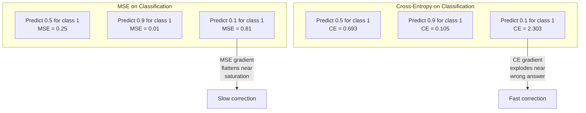
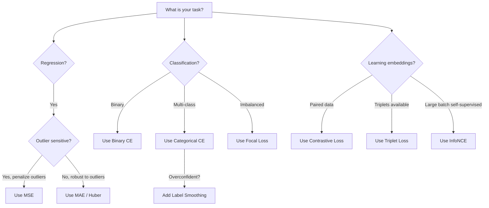
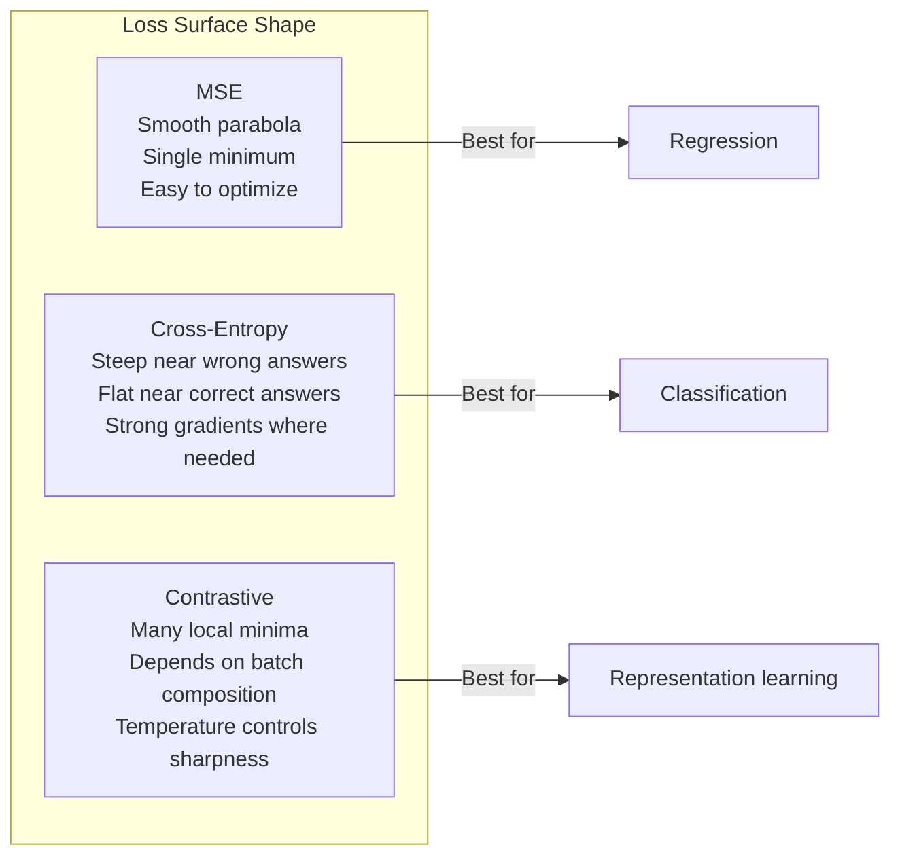

# فقدان الوظائف

> شبكتك تقوم بالتنبؤ. الحقيقة الأرضية تقول خلاف ذلك. كم هو خطأ؟ هذا الرقم هو الخسارة. اختر وظيفة الخسارة الخطأ ونموذجك يُحسن للشيء الخطأ تماما.

**Type:** Build
**Languages:** Python
**Prerequisites:** Lesson 03.04 (Activation Functions)
**Time:** ~75 minutes

## أهداف التعلم

- تنفيذ MSE، الدخول المتقاطع الثنائي، الدخول المتقاطع الفئري، والخسارة المقابلة (InfoNCE) من الصفر مع تراجعهم
- شرح سبب فشل MSE في التصنيف عن طريق إظهار وضع فشل "التنبؤ 0.5 لكل شيء"
- تطبيق تسهيل اللقب على الانتروبيا المتقاطعة ووصف كيفية منع التنبؤات المفرطة الثقة
- اختيار وظيفة الخسارة الصحيحة للعودة، التصنيف الثنائي، التصنيف متعدد الفئات، وتضمين مهام التعلم

## المشكلة

نموذج يقلل من MSE في مشكلة التصنيف سوف يتوقع بثقة 0.5 لكل شيء. هو يقلل من الخسارة. وهو أيضا غير مفيد.

وظيفة الخسارة هي الشيء الوحيد الذي يتحسن نموذجك ليس دقة لا نسبة في فورمولا 1 ليس أيّها المقياس الذي تقرّر به إلى مديرك يُخذ المحفّظ تراجع وظيفة الخسارة ويُعدّل الوزن لجعله أصغر. إذا لم يتمكن وظيفة الخسارة من التقاط ما يهمك، فإن النموذج سوف يجد الطريقة الأكثر رخيصة رياضياً لرضائها، وهذه الطريقة هي تقريباً أبداً ما كنت تريده.

ها هو مثال ملموس لديك مهمة تصنيف ثنائي فصولين، 50/50 تقسيم. تستخدمين الإصابة بالتهابات الكهربائية كخسارة النموذج يتوقع 0.5 لكل مدخل واحد. متوسط مستوى الجهاز المعدني هو 0.25، وهو الحد الأدنى الممكن دون تعلم أي شيء. النموذج ليس لديه قدرة تمييزية لكن تقنياً فقد قلل من وظيفة الخسارة الانتقال إلى التشابه المتقاطع و نفس النموذج يضطر إلى دفع التنبؤات نحو 0 أو 1 ، لأن -log(0.5) = 0.693 هو خسارة رهيبة ، في حين -log(0.99) = 0.01 مكافأة الثقة التنبؤات الصحيحة. اختيار وظيفة الخسارة هو الفرق بين نموذج يتعلم ونموذج يلعب الميتريك.

الأمر يزداد سوءاً. في التعلم الذاتي، لا يوجد لديك حتى علامات. الخسارة المقابلة تعريف إشارة التعلم بالكامل: ما الذي يعتبر مماثلاً، وما الذي يعتبر مختلفاً، ومدى صعوبة النموذج يجب أن يدفعهم إلى جانب. الحصول على الخسارة المقابلة خطأ وتنهار التوابع الخاصة بك إلى نقطة واحدة - كل خريطة مدخلة إلى نفس المتجه. صفر الخسارة تقنياً. بلا قيمة تماماً.

## المفهوم

### متوسط الخطأ التربيعي (MSE)

الاختيار الافتراضي للعودة. احسب الفرق المربع بين التنبؤ والهدف، متوسط على جميع العينات.

```
MSE = (1/n) * sum((y_pred - y_true)^2)
```

لماذا التربيع مهم: فإنه يعاقب الأخطاء الكبيرة رباعيا. خطأ من 2 تكلف 4x أكثر من خطأ من 1. خطأ من 10 تكلف 100x. وهذا يجعل MSE حساسة للخسائر - تنبؤ واحد خاطئ للغاية يهيمن على الخسارة.

الأرقام الحقيقية: إذا كان نموذجك يتوقع أسعار السكن و هو خارج عن $10,000 on most houses but off by $200 ألف في قصر واحد، سوف يحاول MSE بشكل عنيف إصلاح ذلك القصر واحد، وربما يؤذي الأداء على 99 منزل آخرين.

إن تراجع MSE فيما يتعلق بالتنبؤ هو:

```
dMSE/dy_pred = (2/n) * (y_pred - y_true)
```

خطية في الخطأ. الأخطاء الأكبر تحصل على تراجع أكبر. هذه ميزة للعودة (خطأ كبير يحتاج تصحيحات كبيرة) والخطأ للتصنيف (تريد أن تعاقب الردود الخاطئة الثقة بشكل متسارع ، وليس خطيا).

### الخسارة المتقاطعة

وظيفة الخسارة للتصنيف. متجذرة في نظرية المعلومات -- إنها تقيس الاختلاف بين توزيع الاحتمال المتوقع والتوزيع الحقيقي.

**Binary Cross-Entropy (BCE):**

```
BCE = -(y * log(p) + (1 - y) * log(1 - p))
```

حيث y هو العلامة الحقيقية (0 أو 1) و p هو الاحتمال المتوقع.

لماذا -log(p) يعمل: عندما يكون العلامة الحقيقية 1 وتتوقع p = 0.99, الخسارة هي -log(0.99) = 0.01. عندما تتوقع p = 0.01, الخسارة هي -log(0.01) = 4.6. هذا الفرق 460x هو السبب في أن الانتروبيا المتقاطعة تعمل.

التراجع يروي نفس القصة:

```
dBCE/dp = -(y/p) + (1-y)/(1-p)
```

عندما ي = 1 و p قريب من الصفر، فإن التراجع هو -1/p الذي يقترب من اللانهاية السلبية. يحصل النموذج على إشارة هائلة لتصحيح خطأه. عندما p قريب من 1، التراجع صغير. بالفعل صحيحة، لا شيء لتصحيح.

**Categorical Cross-Entropy:**

للتصنيف متعدد الفئات مع أهداف مشفرة واحدة.

```
CCE = -sum(y_i * log(p_i))
```

يساهم الطبقة الحقيقية فقط في الخسارة (لأن جميع y_i الأخرى صفر). إذا كان هناك 10 فئات وتحصل الطبقة الصحيحة على احتمال 0.1 (التخمين العشوائي) ، فإن الخسارة هي -log(0.1) = 2.3. إذا حصلت الطبقة الصحيحة على احتمال 0.9, فإن الخسارة هي -log(0.9) = 0.105. يتعلم النموذج تركيز كتلة الاحتمال على الجواب الصحيح.

### لماذا تفشل MSE في التصنيف



تراجع MSE عندما تكون التنبؤات قريبة من 0 أو 1 (بسبب تثبيت sigmoid). تراجع التنقل التقاطعي تعوض لهذا - -الملحوي يلغي مناطق sigmoid مسطحة، مما يعطي تراجع قوية بالضبط حيث هم أكثر حاجة.

### التسمية التسمية

"تلك هي 100% من الفئة الثالثة و 0% من كل شيء آخر" هذا دعوى قوية

```
smooth_label = (1 - alpha) * one_hot + alpha / num_classes
```

مع الف = 0.1 و 10 فئات: بدلا من [0, 0, 1, 0, ... ] ، يصبح الهدف [0.01 ، 0.01 ، 0.91 ، 0.01 ، ...].

لماذا يعمل هذا: يجب على نموذج يحاول إخراج 1.0 بالضبط من خلال softmax دفع اللوجيت إلى اللانهاية. هذا يسبب ثقة مفرطة ، يؤذي التعميم ، ويجعلها النموذج هشة للتحول في التوزيع. يضع تسهيل اللوحة حدًا لـ 0.9 (مع ألفا = 0.1) ، ويحافظ على السلطة في نطاق معقول. تستخدم GPT ومعظم النماذج الحديثة تسهيل اللوحة أو ما يعادلها.

### الخسارة المقابلة

لا تسميات، لا فصول، مجرد زوجين من المدخلات والسؤال: هل هي متشابهة أم مختلفة؟

**SimCLR-style contrastive loss (NT-Xent / InfoNCE):**

خذ صورة واحدة. إنشأ نظرتين متزايدة لها (قطع، تدور، حركة اللون). هذه هي "الزوج الإيجابي" - يجب أن يكون لها إضافة مماثلة. كل صورة أخرى في المجموعة تشكل "زوج سلبي" - يجب أن يكون لها إضافة مختلفة.

```
L = -log(exp(sim(z_i, z_j) / tau) / sum(exp(sim(z_i, z_k) / tau)))
```

حيث sim() هو تشابه الكوسين، z_i و z_j هي الزوج الإيجابي، والجمع هو فوق جميع السلبيات، وتتحكم تاو (الدرجة الحرارة) كيف الحادة التوزيع هو. درجة الحرارة المنخفضة = السلبيات الأصعب = الفصل الأكثر عدوانية.

الأرقام الحقيقية: حجم اللحظة 256 يعني 255 سلبي لكل زوج إيجابي. درجة الحرارة تاو = 0.07 (SimCLR الافتراضي). الخسارة تبدو مثل a softmax على التشابهات - انها تريد أن تشابه الزوج الإيجابي يكون أعلى بين جميع الخيارات 256.

**Triplet Loss:**

يأخذ ثلاثة مدخلات: المرسوم، الإيجابي (من نفس الفئة) ، السلبي (من فئة مختلفة).

```
L = max(0, d(anchor, positive) - d(anchor, negative) + margin)
```

يفرض الحد الأدنى للفجوة بين المسافات الإيجابية والسلبية. إذا كان السلبي بعيدًا بما فيه الكفاية بالفعل، فإن الخسارة هي صفر - لا تراجع، لا تحديث. هذا يجعل التدريب فعالًا ولكن يتطلب عمليات التعدين الثلاثية بعناية (اختيار السلبيات الصلبة القريبة من المُرس).

### فقدان التركيز

لمجموعات بيانات غير متوازنة. التعامل مع جميع الأمثلة المرتبطة بشكل صحيح على قدم المساواة. الخسارة المركزية إلى أسفل الوزن أمثلة سهلة:

```
FL = -alpha * (1 - p_t)^gamma * log(p_t)
```

حيث p_t هو احتمال المتوقع للدرجة الحقيقية و غاما تحكم التركيز. مع غاما = 0 ، هذا هو الإنتروبي المتقاطع القياسي. مع غاما = 2 (المتخلف):

- مثال سهل (p_t = 0.9): الوزن = (0.1)^2 = 0.01. تم تجاهله بشكل فعال.
- مثال صلب (p_t = 0.1): الوزن = (0.9) ^ 2 = 0.81. إشارة تراجع كاملة.

تم تقديم فقدان التركيز من قبل لين وزملاء للكشف عن الكائنات، حيث 99٪ من المناطق المرشحة هي خلفية (سلبيات سهلة). بدون فقدان التركيز، يغرق النموذج في أمثلة خلفية سهلة ولا يتعلم أبدا الكشف عن الكائنات. مع ذلك، يركز النموذج قدرته على الحالات الصعبة والمتضاربة التي تهم.

### شجرة قرار الخسارة



### فقدان المشهد



```figure
cross-entropy-loss
```

## بناءها

### الخطوة الأولى: MSE ومرحله

```python
def mse(predictions, targets):
    n = len(predictions)
    total = 0.0
    for p, t in zip(predictions, targets):
        total += (p - t) ** 2
    return total / n

def mse_gradient(predictions, targets):
    n = len(predictions)
    grads = []
    for p, t in zip(predictions, targets):
        grads.append(2.0 * (p - t) / n)
    return grads
```

### الخطوة الثانية: الإنتروبي الثنائي

مشكلة log(0) حقيقية. إذا كان النموذج يتوقع بالضبط 0 لمثال إيجابي، log(0) = لا نهاية سلبية. الحذف يمنع هذا.

```python
import math

def binary_cross_entropy(predictions, targets, eps=1e-15):
    n = len(predictions)
    total = 0.0
    for p, t in zip(predictions, targets):
        p_clipped = max(eps, min(1 - eps, p))
        total += -(t * math.log(p_clipped) + (1 - t) * math.log(1 - p_clipped))
    return total / n

def bce_gradient(predictions, targets, eps=1e-15):
    grads = []
    for p, t in zip(predictions, targets):
        p_clipped = max(eps, min(1 - eps, p))
        grads.append(-(t / p_clipped) + (1 - t) / (1 - p_clipped))
    return grads
```

### الخطوة الثالثة: التشويق المتقاطع مع Softmax

سوف ماكس تحويل المواد الخام إلى احتمالات ثم نحسب الانتروبيا المتقاطعة ضد أهداف واحدة حار

```python
def softmax(logits):
    max_val = max(logits)
    exps = [math.exp(x - max_val) for x in logits]
    total = sum(exps)
    return [e / total for e in exps]

def categorical_cross_entropy(logits, target_index, eps=1e-15):
    probs = softmax(logits)
    p = max(eps, probs[target_index])
    return -math.log(p)

def cce_gradient(logits, target_index):
    probs = softmax(logits)
    grads = list(probs)
    grads[target_index] -= 1.0
    return grads
```

إن تراجع softmax + cross-entropy يسهل بشكل جميل: هو فقط (احتمال متوقع - 1) للصف الحقيقي، و (احتمال متوقع) لجميع الفئات الأخرى. هذا التبسيط المبتكر ليس صدفة - هذا هو السبب softmax و cross-entropy يتم إزواجها.

### الخطوة الرابعة: تسطيع اللوحة

```python
def label_smoothed_cce(logits, target_index, num_classes, alpha=0.1, eps=1e-15):
    probs = softmax(logits)
    loss = 0.0
    for i in range(num_classes):
        if i == target_index:
            smooth_target = 1.0 - alpha + alpha / num_classes
        else:
            smooth_target = alpha / num_classes
        p = max(eps, probs[i])
        loss += -smooth_target * math.log(p)
    return loss
```

### الخطوة 5: الخسارة المقابلة (InfoNCE)

```python
def cosine_similarity(a, b):
    dot = sum(x * y for x, y in zip(a, b))
    norm_a = math.sqrt(sum(x * x for x in a))
    norm_b = math.sqrt(sum(x * x for x in b))
    if norm_a < 1e-10 or norm_b < 1e-10:
        return 0.0
    return dot / (norm_a * norm_b)

def contrastive_loss(anchor, positive, negatives, temperature=0.07):
    sim_pos = cosine_similarity(anchor, positive) / temperature
    sim_negs = [cosine_similarity(anchor, neg) / temperature for neg in negatives]

    max_sim = max(sim_pos, max(sim_negs)) if sim_negs else sim_pos
    exp_pos = math.exp(sim_pos - max_sim)
    exp_negs = [math.exp(s - max_sim) for s in sim_negs]
    total_exp = exp_pos + sum(exp_negs)

    return -math.log(max(1e-15, exp_pos / total_exp))
```

### الخطوة 6: MSE مقابل التشريع المتقاطع في التصنيف

تدريب نفس الشبكة من الدروس 04 (مجموعة بيانات دائرة) مع كل من وظائف الخسارة. مشاهدة التنازل المتقاطع التقارب أسرع.

```python
import random

def sigmoid(x):
    x = max(-500, min(500, x))
    return 1.0 / (1.0 + math.exp(-x))

def make_circle_data(n=200, seed=42):
    random.seed(seed)
    data = []
    for _ in range(n):
        x = random.uniform(-2, 2)
        y = random.uniform(-2, 2)
        label = 1.0 if x * x + y * y < 1.5 else 0.0
        data.append(([x, y], label))
    return data


class LossComparisonNetwork:
    def __init__(self, loss_type="bce", hidden_size=8, lr=0.1):
        random.seed(0)
        self.loss_type = loss_type
        self.lr = lr
        self.hidden_size = hidden_size

        self.w1 = [[random.gauss(0, 0.5) for _ in range(2)] for _ in range(hidden_size)]
        self.b1 = [0.0] * hidden_size
        self.w2 = [random.gauss(0, 0.5) for _ in range(hidden_size)]
        self.b2 = 0.0

    def forward(self, x):
        self.x = x
        self.z1 = []
        self.h = []
        for i in range(self.hidden_size):
            z = self.w1[i][0] * x[0] + self.w1[i][1] * x[1] + self.b1[i]
            self.z1.append(z)
            self.h.append(max(0.0, z))

        self.z2 = sum(self.w2[i] * self.h[i] for i in range(self.hidden_size)) + self.b2
        self.out = sigmoid(self.z2)
        return self.out

    def backward(self, target):
        if self.loss_type == "mse":
            d_loss = 2.0 * (self.out - target)
        else:
            eps = 1e-15
            p = max(eps, min(1 - eps, self.out))
            d_loss = -(target / p) + (1 - target) / (1 - p)

        d_sigmoid = self.out * (1 - self.out)
        d_out = d_loss * d_sigmoid

        for i in range(self.hidden_size):
            d_relu = 1.0 if self.z1[i] > 0 else 0.0
            d_h = d_out * self.w2[i] * d_relu
            self.w2[i] -= self.lr * d_out * self.h[i]
            for j in range(2):
                self.w1[i][j] -= self.lr * d_h * self.x[j]
            self.b1[i] -= self.lr * d_h
        self.b2 -= self.lr * d_out

    def compute_loss(self, pred, target):
        if self.loss_type == "mse":
            return (pred - target) ** 2
        else:
            eps = 1e-15
            p = max(eps, min(1 - eps, pred))
            return -(target * math.log(p) + (1 - target) * math.log(1 - p))

    def train(self, data, epochs=200):
        losses = []
        for epoch in range(epochs):
            total_loss = 0.0
            correct = 0
            for x, y in data:
                pred = self.forward(x)
                self.backward(y)
                total_loss += self.compute_loss(pred, y)
                if (pred >= 0.5) == (y >= 0.5):
                    correct += 1
            avg_loss = total_loss / len(data)
            accuracy = correct / len(data) * 100
            losses.append((avg_loss, accuracy))
            if epoch % 50 == 0 or epoch == epochs - 1:
                print(f"    Epoch {epoch:3d}: loss={avg_loss:.4f}, accuracy={accuracy:.1f}%")
        return losses
```

## استخدمها

يقدم PyTorch جميع وظائف الخسارة القياسية مع الاستقرار الرقمي مدمج في:

```python
import torch
import torch.nn as nn
import torch.nn.functional as F

predictions = torch.tensor([0.9, 0.1, 0.7], requires_grad=True)
targets = torch.tensor([1.0, 0.0, 1.0])

mse_loss = F.mse_loss(predictions, targets)
bce_loss = F.binary_cross_entropy(predictions, targets)

logits = torch.randn(4, 10)
labels = torch.tensor([3, 7, 1, 9])
ce_loss = F.cross_entropy(logits, labels)
ce_smooth = F.cross_entropy(logits, labels, label_smoothing=0.1)
```

استخدام`F.cross_entropy`(لا)`F.nll_loss`مزيد من اللونغ المرن المرن المرن المرن المرن المرن المرن المرن المرن المرن المرن المرن المرن المرن المرن المرن المرن المرن المرن المرن المرن المرن المرن المرن المرن المرن المرن المرن المرن المرن المرن المرن المرن المرن المرن المرن المرن المرن المرن المرن المرن المرن المرن المرن المرن المرن المرن المرن المرن المرن المرن المرن المرن المرن المرن المرن المرن المرن المرن المرن المرن المرن المرن المرن المرن المرن المرن المرن المرن المرن المرن المرن المرن المرن المرن المرن المرن المرن المرن المرن المرن المرن المرن المرن المرن المرن المرن المرن المرن المرن المرن المرن المرن المرن المرن المرن المرن المرن المرن المرن المرن المرن المرن المرن المرن

للتعلم المقابل، تستخدم معظم الفرق تنفيذات مخصصة أو مكتبات مثل `lightly`أو`pytorch-metric-learning`الحلقة الأساسية هي دائما نفسها: حساب التشابهات بالتزاوج، خلق الـ softmax على الإيجابيات والسلبيات، الترويج الخلفي.

## أرسله

هذا الدرس ينتج عن:
- `outputs/prompt-loss-function-selector.md`-- تحذير قابلة لإعادة الاستخدام لتحديد وظيفة الخسارة الصحيحة
- `outputs/prompt-loss-debugger.md`-- تحذير تشخيصي عندما تعوير الخسارة الخاص بك يبدو خاطئا

## التمارين

1. تنفيذ خسارة هوبر (خسارة L1 الناعمة) ، وهي MSE للخطأ الصغير و MAE للخطأ الكبير. قم بتدريب شبكة تراجع تتوقع y = sin(x) مع MSE مقابل هوبر عندما تضاف 5% من أهداف التدريب ضوضاء عشوائية (معدلات خارجية). مقارنة خطأ الاختبار النهائي.

2. إضافة فقدان التركيز إلى حلقة تدريب التصنيف الثنائي. إنشاء مجموعة بيانات غير متوازنة (90% فئة 0, 10% فئة 1). مقارنة القياسية BCE مقابل فقدان التركيز (غاما = 2) على استدعاء فئة الأقلية بعد 200 عصر.

3. تنفيذ خسارة الثلاثة مع التعدين السلبي شبه الصعب. توليد بيانات تضمين 2D ل 5 فئات. لكل مرسوم، العثور على السلبي الأكثر صعوبة التي هي أبعد من الإيجابية (الثلاثة الصعب). مقارن التقارب مع اختيار الثلاثة عشوائية.

4. قم بتقارنة MSE مقابل الانتروبيا المتقاطعة ولكن تتبع حجم التدفق في كل طبقة أثناء التدريب. رسم معدل التدفق في كل عصر. تحقق من أن الانتروبيا المتقاطعة تنتج تراجعات أكبر في الأوقات المبكرة عندما يكون النموذج غير مؤكد.

5. تنفيذ خسارة الانحراف KL وتحقق من أن تقليل KL ((صديق التنبؤ) يمنح نفس التراجعات مثل الانتروبيا المتقاطعة عندما يكون التوزيع الحقيقي واحد حار. ثم تجرب أهداف ناعمة (مثل نزيف المعرفة) حيث يأتي التوزيع "الصديق" من النتائج النموذج المعلمية الناعمة.

## الشروط الرئيسية

| Term | What people say | What it actually means |
|------|----------------|----------------------|
| Loss function | "How wrong the model is" | A differentiable function mapping predictions and targets to a scalar that the optimizer minimizes |
| MSE | "Average squared error" | Mean of squared differences between predictions and targets; penalizes large errors quadratically |
| Cross-entropy | "The classification loss" | Measures divergence between predicted probability distribution and true distribution using -log(p) |
| Binary cross-entropy | "BCE" | Cross-entropy for two classes: -(y*log(p) + (1-y)*log(1-p)) |
| Label smoothing | "Softening the targets" | Replacing hard 0/1 targets with soft values (e.g., 0.1/0.9) to prevent overconfidence and improve generalization |
| Contrastive loss | "Pull together, push apart" | A loss that learns representations by making similar pairs close and dissimilar pairs far in embedding space |
| InfoNCE | "The CLIP/SimCLR loss" | Normalized temperature-scaled cross-entropy over similarity scores; treats contrastive learning as classification |
| Focal loss | "The imbalanced data fix" | Cross-entropy weighted by (1-p_t)^gamma to down-weight easy examples and focus on hard ones |
| Triplet loss | "Anchor-positive-negative" | Pushes anchor closer to positive than negative by at least a margin in embedding space |
| Temperature | "Sharpness knob" | A scalar divisor on logits/similarities that controls how peaked the resulting distribution is; lower = sharper |

## المزيد من القراءة

- لين وزملاءه، "الخسارة المركزية لاكتشاف الكائنات الكثيفة" (2017) -- أدخل فقدان المركزية للتعامل مع عدم التوازن القصير في الفئة في الكشف عن الكائنات (RetinaNet)
- تشين وغيرهم، "إطار بسيط للتعلم المضاد للتمثيلات المرئية" (SimCLR، 2020) -- حدد خط الأنابيب الحديث للتعلم المضاد مع فقدان NT-Xent
- سيزيدي وآخرون، "إعادة التفكير في معمارة البداية" (2016) -- قدم تسطيح العلامات كطريقة للتنظيم، والتي أصبحت الآن قياسية في معظم النماذج الكبيرة
- هينتون وغيره، "مقطوعة المعرفة في شبكة عصبية" (2015) -- تمقطيع المعرفة باستخدام أهداف ناعمة واختلاف KL، أساسي للضغط النموذجي
