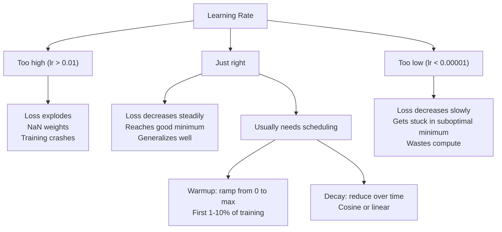
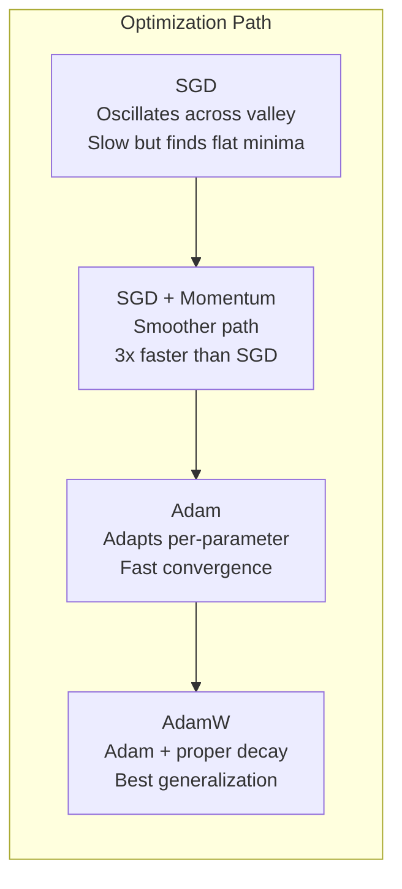
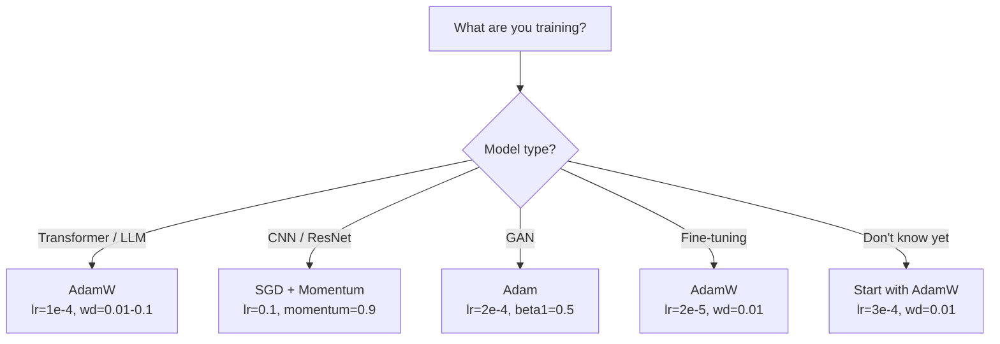

# المُحسنات

> التراجع التدريجي يخبرك في أي اتجاه تتحرك لا يخبرك بأي مسافة أو سرعة

**Type:** Build
**Languages:** Python
**Prerequisites:** Lesson 03.05 (Loss Functions)
**Time:** ~75 minutes

## أهداف التعلم

- تنفيذ SGD، SGD مع الزخم، آدم، وأدمW المتحفسين من الصفر في بيثون
- شرح كيف تعويض تصحيح التحيز آدم للتقديرات الصفر المبدئية لحظات في مراحل التدريب المبكرة
- إظهار لماذا AdamW تنتج التعميم أفضل من آدم مع تنظيم L2 في نفس المهمة
- حدد المحفزات المناسبة والمعايير المضطربة الافتراضية للمتحولات والسي إن إن، والإضفاءات النطاقية، والتحسينات الدقيقة

## المشكلة

لقد حاسبت المرافق. تعرف أن الوزن # 4,721 يجب أن تنخفض 0.003 لتقليل الخسارة. ولكن 0.003 في أي وحدات؟ مقياساً بماذا؟ و يجب أن تحرك نفس الكمية على الخطوة 1 كما على الخطوة 1000؟

تنخفض نسبة التعلم الفانيليا نفس معدل التعلم لكل معايير في كل خطوة: w = w - lr * نسبة التدفق. هذا يخلق ثلاثة مشاكل تجعل تدريب شبكات العصبية مؤلمة في الممارسة.

أولاً، التذبذب. لا يُظهر المشهد المُضايق بشكل شائع كوعة سلسة إنه أكثر مثل وادي طويل و ضيق يُحدد التراجع عبر الوادي (الجهة الرطبة) وليس على طوله (الجهة الرطبة). إنخفاض التدريجي يقلع ذهاباً وإياباً عبر الأبعاد الضيقة بينما يتقدم تقدماً صغيراً على طول الأبعاد المفيدة. لقد رأيتم هذا: الخسارة تنخفض بسرعة بعد مرتفعات، ليس لأن النموذج يتقارب ولكن لأنه يتذبذب.

ثانياً، إن معدل واحد للتعلم لجميع المعلمات خاطئ. بعض الأوزان تحتاج إلى تحديثات كبيرة (إنها في مرحلة مبكرة، غير مناسبة). آخرون بحاجة إلى تحديثات صغيرة (إنها قريبة من قيمتها المثلى). معدل التعلم الذي يعمل للقاعدة يدمر الأخيرة، وعكس ذلك.

ثالثاً، نقاط القعد. في الأبعاد العالية، فإنّ المشهد المضاد لديه مناطق مسطحة واسعة حيث يكون التنحيل قريبًا من الصفر. الجدول المضاد المضاد المزدوج يزحف عبر هذه المناطق بسرعة التنحيل، والتي هي في الواقع صفر. يبدو أن النموذج عالق.

(آدم) يحل كلّ الثلاثة يحافظ على متوسطين متجاريين لكل مبرمج - المتوسط (الحركة، يتعامل مع التذبذب) و المتوسط المربع (المعدل التكيفي، يتعامل مع المقاييس المختلفة). يجمع مع تصحيح التحيز للخطوات القليلة الأولى، فإنه يعطيك تحسين واحد يعمل على 80% من المشاكل مع المعلمات المفرطة الافتراضية. هذا الدروس يبنيها من الصفر حتى تفهم بالضبط متى ولماذا يفشل في الـ 20% الآخرين

## المفهوم

### التراجع المتدريج (SGD)

أسهل محفز، احسب التراجع على مجموعة صغيرة وخطوة في الاتجاه المعاكس

```
w = w - lr * gradient
```

"الستوكاستيك" يعني أنك تستخدم مجموعة فرعية عشوائية (ميني-بارت) من البيانات لتقدير التدفق، بدلا من مجموعة البيانات الكاملة. هذا الضجيج مفيد في الواقع -- يساعد على التخلص من الحد الأدنى المحلي الحاد. ولكن الضجيج يسبب أيضا التذبذب.

معدل التعلم هو الزر الوحيد. مرتفع جداً: تختلف الخسائر. منخفض جداً: يستغرق التدريب إلى الأبد. يعتمد القيمة المثلى على الهندسة المعمارية والبيانات وحجم الحزمة والمرحلة الحالية للتدريب. بالنسبة لـ SGD الفانيليا على الشبكات الحديثة، تتراوح القيم النموذجية من 0.01 إلى 0.1. ولكن حتى في غضون جولة تدريب واحدة، يتغير معدل التعلم المثالي.

### الزخم

تشبيه التدفقات المستخدمة بشكل مفرط ولكنها دقيقة، بدلاً من الدخول عبر التدفق وحده، تحافظ على سرعة تتراكم عبر التدفقات.

```
m_t = beta * m_{t-1} + gradient
w = w - lr * m_t
```

يتحكم التاريخ في التاريخ (عادة 0.9) ، مع التاريخ التاريخي = 0.9 ، فإن الزخم هو متوسط آخر 10 تراجعات (1 / (1 - 0.9) = 10).

لماذا هذا يصلح التذبذب: تراكم التدرج الذي يشير في نفس الاتجاه. تتباطأ التدرج التي تغير الاتجاه. في ذلك الوادي الضيق، يتحول المكون "العكس" كل خطوة ويصبح ضباب. يبقى المكون "على طول" متسقًا ويصبح مضخمًا. النتيجة تسريع سلس في الاتجاه المفيد.

الأرقام الحقيقية: قد يستغرق SGD وحده على مشهد الخسائر السيئة 10,000 خطوة. SGD مع الزخم (بيتا = 0.9) عادة ما يستغرق 3,000-5,000 خطوة على نفس المشكلة. السرعة ليست هامشية.

### RMSProp

أول طريقة لعدد التعلم التكيفي لكل مبرمير عملت فعلاً. اقترحها هينتون في محاضرة في كورسيرا (لم يتم نشرها رسمياً قط).

```
s_t = beta * s_{t-1} + (1 - beta) * gradient^2
w = w - lr * gradient / (sqrt(s_t) + epsilon)
```

تتبع s_t المتوسط الجاري للمرافق المربعة. يتم تقسيم المعايير ذات المرافق الكبيرة باستمرار بأعداد كبيرة (متوسط التعلم الفعلي الأصغر). يتم تقسيم المعايير ذات المرافق الصغيرة بأعداد صغيرة (متوسط التعلم الفعلي الأكبر).

هذا يحل مشكلة "متوسط واحد للتعلم لجميع المعلمات". الوزن الذي يحصل بالفعل على تحديثات كبيرة هو على الأرجح قريب من هدفه -- يبطئ. الوزن الذي يحصل على تحديثات صغيرة قد يكون دون تدريب -- تسريع.

يمنع إيبسيلون (عادة 1e-8) من الانقسام بالصفر عندما لم يتم تحديث أحد المعلمات.

### آدم: الزخم + RMSProp

آدم يجمع بين هذين الفكرين، وهو يحافظ على متوسطين متحركين متكيفين لكل مبرمج:

```
m_t = beta1 * m_{t-1} + (1 - beta1) * gradient        (first moment: mean)
v_t = beta2 * v_{t-1} + (1 - beta2) * gradient^2       (second moment: variance)
```

**Bias correction**هو التفاصيل الرئيسية التي تفوت معظم التفسيرات. في الخطوة 1، m_1 = (1 - بيتا1) * تراجيع. مع بيتا1 = 0.9, هذا هو 0.1 * تراجيع -- عشرة مرات صغيرة جدا. المتوسط المتحرك لم يُحترم بعد. تعويض تعديل التحيز:

```
m_hat = m_t / (1 - beta1^t)
v_hat = v_t / (1 - beta2^t)
```

في الخطوة 1 مع beta1 = 0.9: m_hat = m_1 / (1 - 0.9) = m_1 / 0.1 = التنحدر الفعلي. في الخطوة 100: (1 - 0.9^100) هو حوالي 1.0, لذلك تختفي التصحيح. التصحيح التحيزية مهمة بالنسبة لأول ~ 10 خطوات وغير ذات صلة بعد ~ 50.

التحديث:

```
w = w - lr * m_hat / (sqrt(v_hat) + epsilon)
```

أديام الافتراضات: lr = 0.001، beta1 = 0.9، beta2 = 0.999, epsilon = 1e-8. هذه الافتراضات تعمل على 80% من المشاكل. عندما لا يفعلون ذلك، تغيير lr أولا. ثم بيتا2.

### إنخفاض الوزن قد تم بشكل صحيح

يضيف التنظيم L2 لامبا * w^2 إلى الخسارة. في SGD الفانيليا، هذا يعادل تدهور الوزن (إخراج لامبا * w من الوزن في كل خطوة). في آدم، هذا التكافؤ ينفذ.

نظرة لوششيلوف وهاتر: عندما تضيف L2 إلى الخسارة ثم يعالج آدم التدفق، معدل التعلم التكيفي يُقيس أيضاً مصطلح التدفق. العناصر ذات التباين الكبير يتحصل على تقييم أقل. العناصر ذات التباين الصغير تتحصل على المزيد. هذا ليس ما تريده - تريد تقييم متساو بغض النظر عن إحصاءات التدفق.

يصلح AdamW هذا الأمر عن طريق تطبيق التدهور الوزن مباشرة على الوزن، بعد تحديث آدم:

```
w = w - lr * m_hat / (sqrt(v_hat) + epsilon) - lr * lambda * w
```

لا يتم قياس مصطلح التدهور في الوزن (lr * lambda * w) بواسطة عامل آدم التكيفي. كل معايير تحصل على نفس الانكماش النسبي.

يبدو هذا كجزء بسيط. ليس كذلك. يتقارب AdamW إلى حلول أفضل من إعادة تنظيم Adam + L2 في كل مهمة تقريبًا. إنه المحفز الافتراضي في PyTorch لتدريب المحولات، ونماذج التوزيع، ومعظم الهندسة المعمارية الحديثة. BERT، GPT، LLaMA، التوزيع المستقر - جميعها مدربة مع AdamW.

### معدل التعلم: أهم معايير



إذا قمت بتحديد معايير فائقة واحدة، تحبط معدل التعلم. تغيير 10x في معدل التعلم مهم أكثر من أي قرار معماري سوف تتخذ.

- SGD: lr = 0.01 إلى 0.1
- آدم/آدمW: lr = 1e-4 إلى 3e-4
- النماذج المُدربة مسبقاً للتحقيق: lr = 1e-5 إلى 5e-5
- ارتفاع معدل التعلم: ريمب خطية خلال الخطوات الأولى 1-10%

### مقارنة تحسين



### عندما يفوز كل من يُحسن



```figure
optimizer-trajectory
```

## بناءها

### الخطوة الأولى: SGD الفانيليا

```python
class SGD:
    def __init__(self, lr=0.01):
        self.lr = lr

    def step(self, params, grads):
        for i in range(len(params)):
            params[i] -= self.lr * grads[i]
```

### الخطوة الثانية: SGD مع الزخم

```python
class SGDMomentum:
    def __init__(self, lr=0.01, beta=0.9):
        self.lr = lr
        self.beta = beta
        self.velocities = None

    def step(self, params, grads):
        if self.velocities is None:
            self.velocities = [0.0] * len(params)
        for i in range(len(params)):
            self.velocities[i] = self.beta * self.velocities[i] + grads[i]
            params[i] -= self.lr * self.velocities[i]
```

### الخطوة الثالثة: آدم

```python
import math

class Adam:
    def __init__(self, lr=0.001, beta1=0.9, beta2=0.999, epsilon=1e-8):
        self.lr = lr
        self.beta1 = beta1
        self.beta2 = beta2
        self.epsilon = epsilon
        self.m = None
        self.v = None
        self.t = 0

    def step(self, params, grads):
        if self.m is None:
            self.m = [0.0] * len(params)
            self.v = [0.0] * len(params)

        self.t += 1

        for i in range(len(params)):
            self.m[i] = self.beta1 * self.m[i] + (1 - self.beta1) * grads[i]
            self.v[i] = self.beta2 * self.v[i] + (1 - self.beta2) * grads[i] ** 2

            m_hat = self.m[i] / (1 - self.beta1 ** self.t)
            v_hat = self.v[i] / (1 - self.beta2 ** self.t)

            params[i] -= self.lr * m_hat / (math.sqrt(v_hat) + self.epsilon)
```

### الخطوة الرابعة:

```python
class AdamW:
    def __init__(self, lr=0.001, beta1=0.9, beta2=0.999, epsilon=1e-8, weight_decay=0.01):
        self.lr = lr
        self.beta1 = beta1
        self.beta2 = beta2
        self.epsilon = epsilon
        self.weight_decay = weight_decay
        self.m = None
        self.v = None
        self.t = 0

    def step(self, params, grads):
        if self.m is None:
            self.m = [0.0] * len(params)
            self.v = [0.0] * len(params)

        self.t += 1

        for i in range(len(params)):
            self.m[i] = self.beta1 * self.m[i] + (1 - self.beta1) * grads[i]
            self.v[i] = self.beta2 * self.v[i] + (1 - self.beta2) * grads[i] ** 2

            m_hat = self.m[i] / (1 - self.beta1 ** self.t)
            v_hat = self.v[i] / (1 - self.beta2 ** self.t)

            params[i] -= self.lr * m_hat / (math.sqrt(v_hat) + self.epsilon)
            params[i] -= self.lr * self.weight_decay * params[i]
```

### الخطوة 5: مقارنة التدريب

قم بتدريب نفس الشبكة ذات الطبقتين على مجموعة بيانات الدورة من الدروس 05 مع جميع المحفزات الأربعة. مقارنة التقارب.

```python
import random

def sigmoid(x):
    x = max(-500, min(500, x))
    return 1.0 / (1.0 + math.exp(-x))

def make_circle_data(n=200, seed=42):
    random.seed(seed)
    data = []
    for _ in range(n):
        x = random.uniform(-2, 2)
        y = random.uniform(-2, 2)
        label = 1.0 if x * x + y * y < 1.5 else 0.0
        data.append(([x, y], label))
    return data


class OptimizerTestNetwork:
    def __init__(self, optimizer, hidden_size=8):
        random.seed(0)
        self.hidden_size = hidden_size
        self.optimizer = optimizer

        self.w1 = [[random.gauss(0, 0.5) for _ in range(2)] for _ in range(hidden_size)]
        self.b1 = [0.0] * hidden_size
        self.w2 = [random.gauss(0, 0.5) for _ in range(hidden_size)]
        self.b2 = 0.0

    def get_params(self):
        params = []
        for row in self.w1:
            params.extend(row)
        params.extend(self.b1)
        params.extend(self.w2)
        params.append(self.b2)
        return params

    def set_params(self, params):
        idx = 0
        for i in range(self.hidden_size):
            for j in range(2):
                self.w1[i][j] = params[idx]
                idx += 1
        for i in range(self.hidden_size):
            self.b1[i] = params[idx]
            idx += 1
        for i in range(self.hidden_size):
            self.w2[i] = params[idx]
            idx += 1
        self.b2 = params[idx]

    def forward(self, x):
        self.x = x
        self.z1 = []
        self.h = []
        for i in range(self.hidden_size):
            z = self.w1[i][0] * x[0] + self.w1[i][1] * x[1] + self.b1[i]
            self.z1.append(z)
            self.h.append(max(0.0, z))

        self.z2 = sum(self.w2[i] * self.h[i] for i in range(self.hidden_size)) + self.b2
        self.out = sigmoid(self.z2)
        return self.out

    def compute_grads(self, target):
        eps = 1e-15
        p = max(eps, min(1 - eps, self.out))
        d_loss = -(target / p) + (1 - target) / (1 - p)
        d_sigmoid = self.out * (1 - self.out)
        d_out = d_loss * d_sigmoid

        grads = [0.0] * (self.hidden_size * 2 + self.hidden_size + self.hidden_size + 1)
        idx = 0
        for i in range(self.hidden_size):
            d_relu = 1.0 if self.z1[i] > 0 else 0.0
            d_h = d_out * self.w2[i] * d_relu
            grads[idx] = d_h * self.x[0]
            grads[idx + 1] = d_h * self.x[1]
            idx += 2

        for i in range(self.hidden_size):
            d_relu = 1.0 if self.z1[i] > 0 else 0.0
            grads[idx] = d_out * self.w2[i] * d_relu
            idx += 1

        for i in range(self.hidden_size):
            grads[idx] = d_out * self.h[i]
            idx += 1

        grads[idx] = d_out
        return grads

    def train(self, data, epochs=300):
        losses = []
        for epoch in range(epochs):
            total_loss = 0.0
            correct = 0
            for x, y in data:
                pred = self.forward(x)
                grads = self.compute_grads(y)
                params = self.get_params()
                self.optimizer.step(params, grads)
                self.set_params(params)

                eps = 1e-15
                p = max(eps, min(1 - eps, pred))
                total_loss += -(y * math.log(p) + (1 - y) * math.log(1 - p))
                if (pred >= 0.5) == (y >= 0.5):
                    correct += 1
            avg_loss = total_loss / len(data)
            accuracy = correct / len(data) * 100
            losses.append((avg_loss, accuracy))
            if epoch % 75 == 0 or epoch == epochs - 1:
                print(f"    Epoch {epoch:3d}: loss={avg_loss:.4f}, accuracy={accuracy:.1f}%")
        return losses
```

## استخدمها

تعمل محفزات PyTorch على تعديل مجموعات المعلمات، وتقطيع التراجع، وتخطيط معدل التعلم:

```python
import torch
import torch.optim as optim

model = torch.nn.Sequential(
    torch.nn.Linear(784, 256),
    torch.nn.ReLU(),
    torch.nn.Linear(256, 10),
)

optimizer = optim.AdamW(model.parameters(), lr=3e-4, weight_decay=0.01)

scheduler = optim.lr_scheduler.CosineAnnealingLR(optimizer, T_max=100)

for epoch in range(100):
    optimizer.zero_grad()
    output = model(torch.randn(32, 784))
    loss = torch.nn.functional.cross_entropy(output, torch.randint(0, 10, (32,)))
    loss.backward()
    torch.nn.utils.clip_grad_norm_(model.parameters(), max_norm=1.0)
    optimizer.step()
    scheduler.step()
```

النمط هو دائما: zero_grad، forward، loss، backward، (clip) ، step، (schedule). حفظ هذا الترتيب. الحصول على خطأ (على سبيل المثال، الاتصال المخطط.step() قبل optimizer.step()) هو مصدر شائع للخطأ الخفيف.

بالنسبة لسي إن إن، لا يزال العديد من الممارسين يفضلون SGD + الزخم (lr=0.1 ، الزخم = 0.9 ، الوزن_انهيار = 1e-4) مع جدول خطوة أو كوسين. يجد SGD أدنى مستويات مسطحة ، والتي غالباً ما تجميع بشكل أفضل. بالنسبة للمتحولين والإل إل إم ، فإن AdamW مع التدفئة + تدهور كوسين هو الافتراض الشامل. لا تقاتل التوافق دون سبب مقيّر.

## أرسله

هذا الدرس ينتج عن:
- `outputs/prompt-optimizer-selector.md`-- تحرك قرار لتحديد المُحسن ومعدل التعلم المناسب لأي بنية

## التمارين

1. قم بتنفيذ زخم نستروف، حيث تقوم بحساب التراجع في وضع "النظر" (w - lr * beta * v) بدلاً من الموقف الحالي. مقارنة التقارب مع زخم قياسي على مجموعة بيانات الدائرة.

2. تنفيذ جدول تعليمي للتدفئة: ريمب خطي من 0 إلى ماكس_لر خلال 10% من مراحل التدريب الأولى ، ثم تدهور الكوسين إلى 0. تدريب مع آدم + التدفئة مقابل آدم دون التدفئة. قياس عدد الفترات التي يستغرقها الوصول إلى دقة 90٪ على مجموعة بيانات الدائرة.

3. تتبع معدل التعلم الفعلي لكل معايير خلال تدريب آدم. المعدل الفعلي هو lr * m_hat / (sqrt(v_hat) + eps). رسم توزيع المعدلات الفعالة بعد 10، 50 و 200 خطوة. هل يتم تحديث جميع المعايير بنفس السرعة؟

4. قم بتنفيذ قطع التدرج (التقاط حسب المعيار العالمي). حدد معيار التدرج الأقصى إلى 1.0. قم بتدريب مع ودون قطع باستخدام معدل تعلم مرتفع (lr=0.01 بالنسبة لآدم). احسب عدد الركود التي تختلف (الخسارة تذهب إلى NaN) مع ودون قطع أكثر من 10 بذور عشوائية.

5. مقارنة آدم مقابل آدم و على شبكة مع أوزان كبيرة. قم بتبني جميع الأوزان إلى قيم عشوائية في [-5, 5] (أكبر بكثير من الطبيعي). قم بتدريب 200 عصر مع وزن_انحدار = 0.1. رسم معايير الوزن L2 على التدريب لكل من المحفسينين. يجب أن يظهر آدم ووتان تقلص الوزن بشكل أسرع.

## الشروط الرئيسية

| Term | What people say | What it actually means |
|------|----------------|----------------------|
| Learning rate | "Step size" | The scalar multiplier on the gradient update; the single most impactful hyperparameter in training |
| SGD | "Basic gradient descent" | Stochastic gradient descent: update weights by subtracting lr * gradient, computed on a mini-batch |
| Momentum | "Rolling ball analogy" | Exponential moving average of past gradients; dampens oscillation and accelerates consistent directions |
| RMSProp | "Adaptive learning rate" | Divides each parameter's gradient by the running RMS of its recent gradients; equalizes learning rates |
| Adam | "The default optimizer" | Combines momentum (first moment) and RMSProp (second moment) with bias correction for the initial steps |
| AdamW | "Adam done right" | Adam with decoupled weight decay; applies regularization directly to weights rather than through the gradient |
| Bias correction | "Warmup for running averages" | Dividing by (1 - beta^t) to compensate for the zero-initialization of Adam's moment estimates |
| Weight decay | "Shrink the weights" | Subtracting a fraction of the weight value at each step; a regularizer that penalizes large weights |
| Learning rate schedule | "Changing lr over time" | A function that adjusts the learning rate during training; warmup + cosine decay is the modern default |
| Gradient clipping | "Capping the gradient norm" | Scaling down the gradient vector when its norm exceeds a threshold; prevents exploding gradient updates |

## المزيد من القراءة

- كينغما وبا، "آدام: طريقة للتحسين الاستوكاسطي" (2014) -- ورقة آدم الأصلية مع تحليل التقارب وتحليل التحسّل التحيزي
- لوششيلوف وهاتر، "تعديل التدهور في الوزن منفصل" (2017) -- أثبت أن تقييم L2 وتدهور الوزن ليسوا متساوين في آدم، واقترح أن آدم
- سميث، "تطورات التعلم الدوري للشبكات العصبية التدريبية" (2017) -- قدمت اختبار مجموعة LR والجدول الزمني الدوري الذي يزيل الحاجة إلى ضبط معدل التعلم الثابت
- رودر، "مراجعة عامة لخوارزميات تحسين التراجع التدريجي" (2016) -- أفضل مسح واحد لجميع أنواع المحفزات، مع مقارنات وضوحية والحسبان
