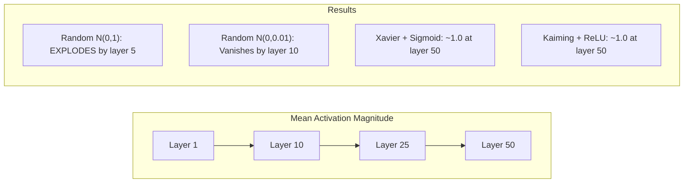
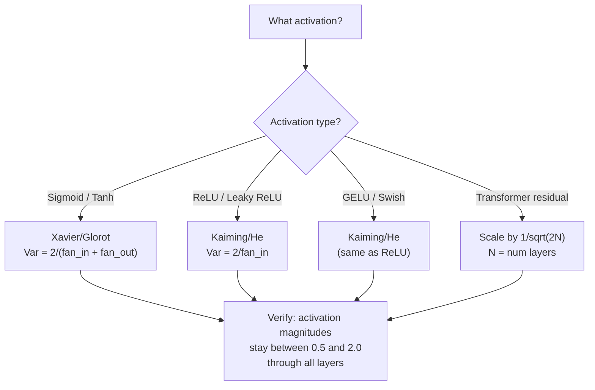

# إطلاق الوزن واستقرار التدريب

> إبدأ خطأ وتدريب لا يبدأ أبدا إبدأ صحيحا و 50 طبقة تدريب بسلاسة مثل 3.

**Type:** Build
**Languages:** Python
**Prerequisites:** Lesson 03.04 (Activation Functions), Lesson 03.07 (Regularization)
**Time:** ~90 minutes

## أهداف التعلم

- تنفيذ استراتيجيات التبديل الصفرية والربطية والزافير/جلوروت وكايمينغ/ه وقياس تأثيرها على حجم التفعيل عبر 50 طبقة
- استنتاج لماذا يستخدم Xavier init Var(w) = 2/(fan_in + fan_out) و Kaiming يستخدم Var(w) = 2/fan_in
- إظهار مشكلة التناظر مع صفر التبني وتفسير لماذا مقياس عشوائي وحده غير كافية
- مطابقة استراتيجية البدء الصحيحة لـ وظيفة التفعيل: خافير لـ sigmoid/tanh، كايمينغ لـ ReLU/GELU

## المشكلة

إبتدائية كل الوزن إلى الصفر. لا شيء يتعلم. كل خلية عصبية تقوم بحساب نفس الوظيفة، وتتلقى نفس التراجع، وتحديثات بشكل متطابق. بعد 10،000 عصر، طبقة الخلية من 512 خلية عصبية ما زالت 512 نسخة من نفس الخلية. دفعت ل 512 مبرميرات وحصلت على 1.

إبدأوا أكبر من اللازم. تنفجر التفعيلات عبر الشبكة. عند الطبقة 10 ، تصل قيمها إلى 1e15. عند الطبقة 20 ، تتجاوز إلى اللانهاية. تتبع المعدلات نفس المسار العكسي.

قم بتشغيلها عشوائيًا من توزيع طبيعي قياسي. يعمل لمدة 3 طبقات. عند 50 طبقة ، تتراجع الإشارة إلى الصفر أو تفجر إلى اللانهاية اعتمادا على ما إذا كان النطاق العشوائي صغيرًا جدًا أو كبيرًا جدًا. الحدود بين "العمل" و "الكسور" رقيقة مثل الحلاقة.

إن إطلاق الوزن هو أكثر القرارات إقلالًا في التعلم العميق. الهندسة المعمارية تحصل على ورق. المتحسينات تحصل على مشاركات مدونة. الإطلاق يحصل على ملاحظة أقدامية. ولكن إخطأ الأمر ولا يهم شيء آخر - شبكتك ميتة قبل بدء التدريب.

## المفهوم

### مشكلة التناظر

كل عصبية في طبقة لها نفس الهيكل: مضاعفة المدخلات بالوزن، أضف التحيز، وتطبيق التفعيل. إذا بدأت جميع الوزن في نفس القيمة (الصفر هو الحالة القصوى) ، فإن كل عصبية تقوم بحساب نفس الخروج. أثناء الانتشار الخلفي، يتلقى كل عصبية نفس التراجع. خلال خطوة التحديث، تتغير كل عصبية بنفس الكمية.

أنت عالق. الشبكة لديها مئات المعلمات، ولكنها تتحرك كلها في حلقة. وهذا يسمى التناظر، والبدء عشوائي هو الطريقة القوة الخامة للكسر. كل عصبية تبدأ في نقطة مختلفة في الفضاء الوزن، لذلك كل تعلم ميزة مختلفة.

لكن "الصدفة" ليست كافية * مقياس * من الصدفة يحدد ما إذا كانت الشبكة تتجه.

### التباين ينتشر من خلال الطبقات

اعتبر طبقة واحدة مع مدخلات fan_in:

```
z = w1*x1 + w2*x2 + ... + w_n*x_n
```

إذا تم استخراج كل وزن wi من توزيع مع اختلاف Var(w) وكل مدخل xi لديه اختلاف Var(x) ، فإن المتغير الخارجي هو:

```
Var(z) = fan_in * Var(w) * Var(x)
```

إذا كان Var(w) = 1 و fan_in = 512, فإن المتغيرات الخارجة 512x المتغيرات المدخلة. بعد 10 طبقات: 512^10 = 1.2e27. لقد انفجرت إشارتك.

إذا كان Var ((w) = 0.001، فإن التباين الخارجي ينخفض بنسبة 0.001 * 512 = 0.512 لكل طبقة. بعد 10 طبقات: 0.512^10 = 0.00013. اختفى إشارتك.

الهدف: اختيار Var(w) بحيث Var(z) = Var(x). يبقى حجم الإشارة ثابتًا عبر الطبقات.

### إعدادات إعدادات إعدادات إعدادات إعدادات إعدادات إعدادات إعدادات إعدادات إعدادات إعدادات إعدادات إعدادات إعدادات إعدادات إعدادات إعدادات إعدادات إعدادات إعدادات إعدادات إعدادات إعدادات إعدادات إعدادات إعدادات إعدادات إعدادات إعدادات إعدادات إعدادات إعدادات إعدادات إعدادات إعدادات إعدادات إعدادات إعدادات إعدادات إعدادات إعدادات إعدادات إعدادات إعدادات إعدادات إعدادات إعدادات إعدادات إعدادات إعدادات إعدادات إعدادات إعدادات إعدادات إعدادات إعدادات إعدادات إعدادات إعدادات إعدادات إعدادات إعدادات إعدادات إعداداتات إعدادات إعداداتاتات إعدادات إعداداتاتات إعدادات إعداداتاتات إعدادات إعداداتات إعدادات إعدادات إعدادات إعدادات إعداداتات إعدادات إعداداتات إعدادات إعدادات إعدادات إعدادات إعدادات إعدادات إعدادات إعدادات إعدادات إعدادات إعدادات إعدادات إعدادات إعدادات إعدادات إعدادات إعدادات إعدادات إعدادات إعدادات إعدادات إعدادات إعدادات إعدادات إعدادات إعدادات إعدادات إعدادات إعدادات إعدادات إعدادات إعدادات إعدادات إعدادات إعدادات إعدادات إعدادات إعدادات إعدادات إعدادات إعدادات إعدادات إعدادات إعدادات إعدادات إعدادات إعدادات إعدادات إعدادات إعدادات إعدادات إعدادات إعدادات إعدادات إعدادات إعدادات إعدادات إعدادات إعدادات إعدادات إعدادات إعدادات إعدادات إعدادات إعدادات إعدادات إعدادات إعدادات إعدادات إعدادات إ إ إعدادات إ إ إ إ إ إ إ إ إ إ إ إ إ إ إ إ إ إ إ إ إ إ إ إ إ إ إ إ إ إ إ إ إ إ إ إ إ إ إ إطار إطار إ إ إ إ إ

استخرج غلوروت و بينجيو (2010) الحل لتنشيط sigmoid و tanh. للحفاظ على التباين ثابت في كل من الممر الأمامي والخلفي:

```
Var(w) = 2 / (fan_in + fan_out)
```

في الممارسة العملية، يتم استخلاص الوزن من:

```
w ~ Uniform(-limit, limit)  where limit = sqrt(6 / (fan_in + fan_out))
```

أو:

```
w ~ Normal(0, sqrt(2 / (fan_in + fan_out)))
```

هذا يعمل لأن sigmoid و tanh خطية تقريبًا بالقرب من الصفر ، حيث يعيش التفعيلات المبكرة بشكل صحيح. يبقى التباين مستقراً عبر عشرات الطبقات.

### كايمينغ/هي إبتدائية

ReLU يقتل نصف المخرجات (كل شيء سلبي يصبح صفر). يتم تقليل fan_in الفعال إلى النصف لأن نصف المدخلات في المتوسط صفر. لا يحسب Xavier init هذا - فإنه يقلل من التباين المطلوب.

He et al. (2015) قام بتعديل الصيغة:

```
Var(w) = 2 / fan_in
```

يتم استخراج الوزن من:

```
w ~ Normal(0, sqrt(2 / fan_in))
```

عامل 2 يعوض عن ReLU صفر نصف التفعيلات. دون ذلك، تقلص الإشارة بنسبة ~ 0.5x لكل طبقة. مع 50 طبقة: 0.5^50 = 8.8e-16.

### إطلاق المحول

أدى GPT-2 إلى وضع نمط مختلف. تضيف الاتصالات المتبقية إنتاج كل طبقة فرعية إلى مدخلها:

```
x = x + sublayer(x)
```

يزيد كل إضافة التباين. مع N طبقات بقايا، يتزايد التباين بالتناظير مع N. يسلّط GPT-2 وزن الطبقات المتبقيّة بمقدار 1/sqrt(2N) ، حيث أن N هو عدد الطبقات. وهذا يبقي حجم الإشارة المتراكم مستقراً.

يستخدم Llama 3 (405B المعلمات، 126 طبقة) مخططًا مماثلًا. بدون هذا التوسع، فإن التدفق المتبقي سيصبح غير محدود عبر 126 طبقة من الاهتمام والبلوكات المسبقة.

```mermaid
flowchart TD
    subgraph "Zero Init"
        Z1["Layer 1<br/>All weights = 0"] --> Z2["Layer 2<br/>All neurons identical"]
        Z2 --> Z3["Layer 3<br/>Still identical"]
        Z3 --> ZR["Result: 1 effective neuron<br/>regardless of width"]
    end

    subgraph "Xavier Init"
        X1["Layer 1<br/>Var = 2/(fan_in+fan_out)"] --> X2["Layer 2<br/>Signal stable"]
        X2 --> X3["Layer 50<br/>Signal stable"]
        X3 --> XR["Result: Trains with<br/>sigmoid/tanh"]
    end

    subgraph "Kaiming Init"
        K1["Layer 1<br/>Var = 2/fan_in"] --> K2["Layer 2<br/>Signal stable"]
        K2 --> K3["Layer 50<br/>Signal stable"]
        K3 --> KR["Result: Trains with<br/>ReLU/GELU"]
    end
```



### حجم التفعيل عبر 50 طبقة



### اختيار النوايا الصحيحة



```figure
weight-init-variance
```

## بناءها

### الخطوة الأولى: استراتيجيات التشغيل

أربعة طرق لتبني المصفوفة الوزن. كل واحد يعود قائمة من القوائم (مصفوفة 2D) مع عمودات fan_in وطرق fan_out.

```python
import math
import random


def zero_init(fan_in, fan_out):
    return [[0.0 for _ in range(fan_in)] for _ in range(fan_out)]


def random_init(fan_in, fan_out, scale=1.0):
    return [[random.gauss(0, scale) for _ in range(fan_in)] for _ in range(fan_out)]


def xavier_init(fan_in, fan_out):
    std = math.sqrt(2.0 / (fan_in + fan_out))
    return [[random.gauss(0, std) for _ in range(fan_in)] for _ in range(fan_out)]


def kaiming_init(fan_in, fan_out):
    std = math.sqrt(2.0 / fan_in)
    return [[random.gauss(0, std) for _ in range(fan_in)] for _ in range(fan_out)]
```

### الخطوة الثانية: وظائف التفعيل

نحتاج إلى sigmoid, tanh, و ReLU لاختبار كل استراتيجية init مع تنشيطها المقصود.

```python
def sigmoid(x):
    x = max(-500, min(500, x))
    return 1.0 / (1.0 + math.exp(-x))


def tanh_act(x):
    return math.tanh(x)


def relu(x):
    return max(0.0, x)
```

### الخطوة الثالثة: اجتياز 50 طبقة

إرسال البيانات العشوائية عبر شبكة عميقة وقياس متوسط حجم التفعيل في كل طبقة.

```python
def forward_deep(init_fn, activation_fn, n_layers=50, width=64, n_samples=100):
    random.seed(42)
    layer_magnitudes = []

    inputs = [[random.gauss(0, 1) for _ in range(width)] for _ in range(n_samples)]

    for layer_idx in range(n_layers):
        weights = init_fn(width, width)
        biases = [0.0] * width

        new_inputs = []
        for sample in inputs:
            output = []
            for neuron_idx in range(width):
                z = sum(weights[neuron_idx][j] * sample[j] for j in range(width)) + biases[neuron_idx]
                output.append(activation_fn(z))
            new_inputs.append(output)
        inputs = new_inputs

        magnitudes = []
        for sample in inputs:
            magnitudes.append(sum(abs(v) for v in sample) / width)
        mean_mag = sum(magnitudes) / len(magnitudes)
        layer_magnitudes.append(mean_mag)

    return layer_magnitudes
```

### الخطوة الرابعة: التجربة

قم بتشغيل جميع الجمعيات: صفر init، عشوائي N(0,1), عشوائي N(0,0.01), Xavier مع sigmoid، Xavier مع tanh، Kaiming مع ReLU. طبع الحجم في طبقات رئيسية.

```python
def run_experiment():
    configs = [
        ("Zero init + Sigmoid", lambda fi, fo: zero_init(fi, fo), sigmoid),
        ("Random N(0,1) + ReLU", lambda fi, fo: random_init(fi, fo, 1.0), relu),
        ("Random N(0,0.01) + ReLU", lambda fi, fo: random_init(fi, fo, 0.01), relu),
        ("Xavier + Sigmoid", xavier_init, sigmoid),
        ("Xavier + Tanh", xavier_init, tanh_act),
        ("Kaiming + ReLU", kaiming_init, relu),
    ]

    print(f"{'Strategy':<30} {'L1':>10} {'L5':>10} {'L10':>10} {'L25':>10} {'L50':>10}")
    print("-" * 80)

    for name, init_fn, act_fn in configs:
        mags = forward_deep(init_fn, act_fn)
        row = f"{name:<30}"
        for idx in [0, 4, 9, 24, 49]:
            val = mags[idx]
            if val > 1e6:
                row += f" {'EXPLODED':>10}"
            elif val < 1e-6:
                row += f" {'VANISHED':>10}"
            else:
                row += f" {val:>10.4f}"
        print(row)
```

### الخطوة 5: إظهار التناظر

أظهر أن الصفر يُنتج الخلايا العصبية المتطابقة.

```python
def symmetry_demo():
    random.seed(42)
    weights = zero_init(2, 4)
    biases = [0.0] * 4

    inputs = [0.5, -0.3]
    outputs = []
    for neuron_idx in range(4):
        z = sum(weights[neuron_idx][j] * inputs[j] for j in range(2)) + biases[neuron_idx]
        outputs.append(sigmoid(z))

    print("\nSymmetry Demo (4 neurons, zero init):")
    for i, out in enumerate(outputs):
        print(f"  Neuron {i}: output = {out:.6f}")
    all_same = all(abs(outputs[i] - outputs[0]) < 1e-10 for i in range(len(outputs)))
    print(f"  All identical: {all_same}")
    print(f"  Effective parameters: 1 (not {len(weights) * len(weights[0])})")
```

### الخطوة 6: تقرير الكبيرة الطبقة على الطبقة

طبع مخطط بصري من حجم التفعيل عبر 50 طبقة

```python
def magnitude_report(name, magnitudes):
    print(f"\n{name}:")
    for i, mag in enumerate(magnitudes):
        if i % 5 == 0 or i == len(magnitudes) - 1:
            if mag > 1e6:
                bar = "X" * 50 + " EXPLODED"
            elif mag < 1e-6:
                bar = "." + " VANISHED"
            else:
                bar_len = min(50, max(1, int(mag * 10)))
                bar = "#" * bar_len
            print(f"  Layer {i+1:3d}: {bar} ({mag:.6f})")
```

## استخدمها

يقدم PyTorch هذه الوظائف المدمجة:

```python
import torch
import torch.nn as nn

layer = nn.Linear(512, 256)

nn.init.xavier_uniform_(layer.weight)
nn.init.xavier_normal_(layer.weight)

nn.init.kaiming_uniform_(layer.weight, nonlinearity='relu')
nn.init.kaiming_normal_(layer.weight, nonlinearity='relu')

nn.init.zeros_(layer.bias)
```

عندما تتصلين`nn.Linear(512, 256)`وذلك هو السبب في أن معظم الشبكات البسيطة "تعمل فقط" - PyTorch قد اتخذت بالفعل الخيار الصحيح. ولكن عندما تقوم ببناء بنيات مخصصة أو تذهب أعمق من 20 طبقة، تحتاج إلى فهم ما يحدث وربما تفضيض الافتراض.

بالنسبة للمتحولات، عادة ما تتعامل نماذج HuggingFace مع التبديل في أجهزة التشغيل الخاصة بهم.`_init_weights`طريقة. تنفيذ GPT-2 يقيّم التوقعات المتبقية بمقدار 1/sqrt ((N). إذا كنت تبني محول من الصفر، تحتاج إلى إضافة هذا بنفسك.

## أرسله

هذا الدرس ينتج عن:
- `outputs/prompt-init-strategy.md`-- إرسال استقال يُشخيص مشاكل إطلاق الوزن ويوصي بالستراتيجية الصحيحة

## التمارين

1. إضافة تشغيل LeCun (Var = 1/fan_in ، مصممة لتنشيط SELU). قم بتشغيل تجربة 50 طبقة مع LeCun init + tanh ومقارنة مع Xavier + tanh.

2. تنفيذ مقياس بقايا GPT-2: مضاعفة خروج كل طبقة بمقدار 1/sqrt ((2 * N) قبل إضافةها إلى تيار البقايا. تشغيل 50 طبقة مع ودون مقياس، قياس سرعة نمو حجم البقايا.

3. قم بإنشاء وظيفة "تحقق صحة التشغيل" التي تأخذ أبعاد طبقة الشبكة ونوع تفعيلها، ثم توصي بالبدء الصحيح وتحذير إذا كان التشغيل الحالي سيسبب مشاكل.

4. قم بتشغيل التجربة مع fan_in = 16 مقابل fan_in = 1024. يتكيف Xavier و Kaiming مع fan_in ، ولكن الابتكار العشوائي لا يفعل ذلك. أظهر كيف يتوسع الفجوة بين "العمل" و "الفراغات" مع طبقات أكبر.

5. تنفيذ التبني المُستقيم (إنشاء مصفوفة عشوائية، حساب SVD، استخدام المصفوفة المُستقيمة U). مقارنة مع كايمينغ لشبكات ReLU في 50 طبقة.

## الشروط الرئيسية

| Term | What people say | What it actually means |
|------|----------------|----------------------|
| Weight initialization | "Set starting weights randomly" | The strategy for choosing initial weight values that determines whether a network can train at all |
| Symmetry breaking | "Make neurons different" | Using random initialization to ensure neurons learn distinct features instead of computing identical functions |
| Fan-in | "Number of inputs to a neuron" | The number of incoming connections, which determines how input variance accumulates in the weighted sum |
| Fan-out | "Number of outputs from a neuron" | The number of outgoing connections, relevant for maintaining gradient variance during backpropagation |
| Xavier/Glorot init | "The sigmoid initialization" | Var(w) = 2/(fan_in + fan_out), designed to preserve variance through sigmoid and tanh activations |
| Kaiming/He init | "The ReLU initialization" | Var(w) = 2/fan_in, accounts for ReLU zeroing half the activations |
| Variance propagation | "How signals grow or shrink through layers" | The mathematical analysis of how activation variance changes layer by layer based on weight scale |
| Residual scaling | "GPT-2's init trick" | Scaling residual connection weights by 1/sqrt(2N) to prevent variance growth through N transformer layers |
| Dead network | "Nothing trains" | A network where poor initialization causes all gradients to be zero or all activations to saturate |
| Exploding activations | "Values go to infinity" | When weight variance is too high, causing activation magnitudes to grow exponentially through layers |

## المزيد من القراءة

- غلوروت و بينجيو، "فهم صعوبة تدريب شبكات عصبية متقدمة بعمق" (2010) -- ورقة تشغيل كاسبير الأصلية مع تحليل التباين
- هو وآخرون، "التعمق بعمق في المصلحات" (2015) -- قدم إطلاق كايمينغ للشبكات ReLU
- رادفورد وغيرهم، "نموذجات اللغة هي متعلمين متعددين المهام غير المشرفين" (2019) -- ورقة GPT-2 مع بدء التوسع المتبقي
- مشكين وماتاس، "كل ما تحتاجه هو بداية جيدة" (2016) -- تعريف التسلسلات الوحيدة-المتغيرات الطبقة، بديل تجربي للصيغ التحليلية
