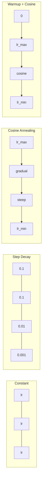
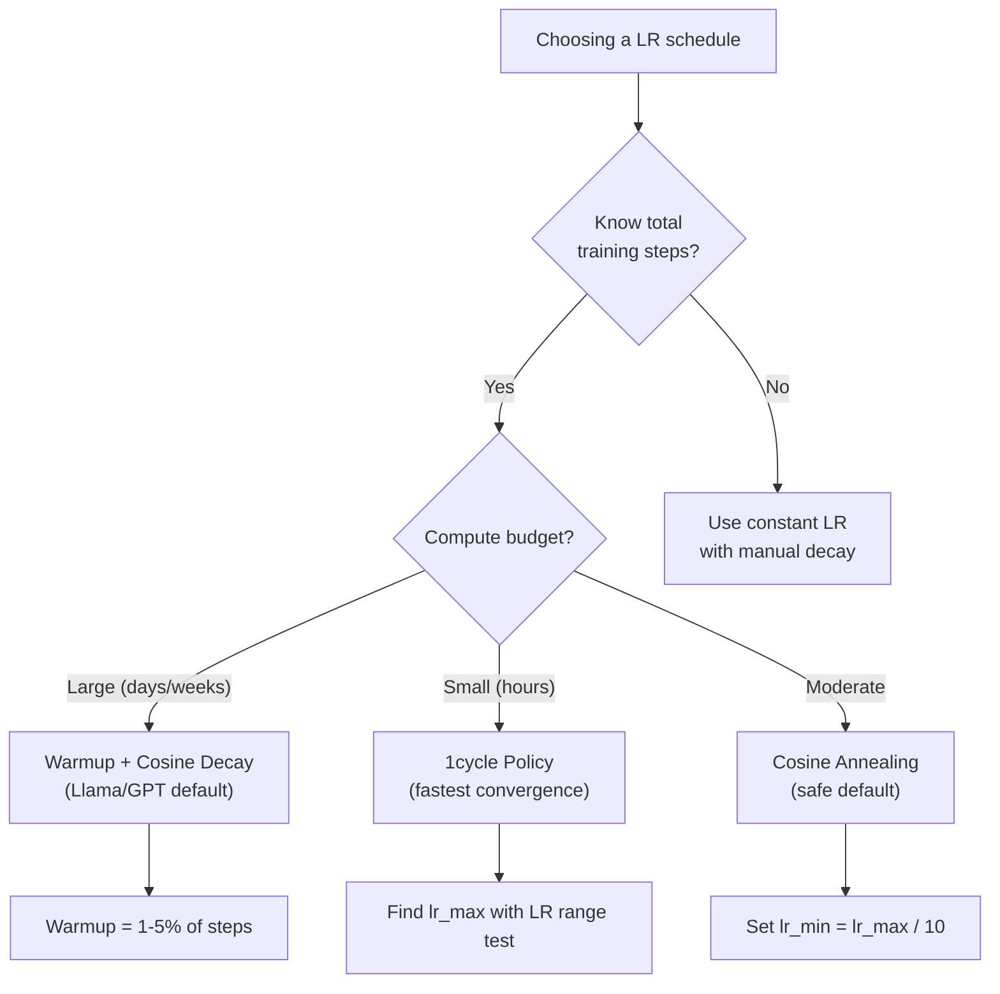
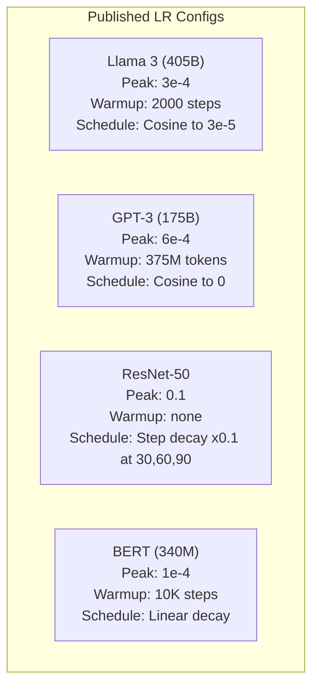

# جدولات دراسة وتدفئة

> معدل التعلم هو المعيار الأكثر أهمية ليس الهندسة المعمارية ليس حجم مجموعة البيانات ليس وظيفة التفعيل معدل التعلم إذا لم تتنغم شيئا آخر، تنغم هذا

**Type:** Build
**Languages:** Python
**Prerequisites:** Lesson 03.06 (Optimizers), Lesson 03.08 (Weight Initialization)
**Time:** ~90 minutes

## أهداف التعلم

- تنفيذ جدولات ثابتة، تدريجية التدهور، التخفيف الكوسيني، التدفئة + الكوسيني، وتدريب معدل التعلم في دورة واحدة من الصفر
- إظهار أساليب الفشل الثلاثة لانتخاب معدل التعلم: الانحراف (على الدرجة العالية جدا) ، والتوقف (أقل جدا) ، والتذبذب (لا تدهور)
- شرح لماذا الحرارة ضرورية للمحسنين على أساس آدم وكيف أنها تستقر التدريب المبكر
- مقارنة سرعة التقارب بين كل المواعيد الخمسة في نفس المهمة واختيار المواعيد المناسبة لميزانية تدريب معينة

## المشكلة

حدد معدل التعلم إلى 0.1. التدريب يختلف -- الخسارة تقفز إلى لا نهاية لها في 3 خطوات. حدد إلى 0.0001. التدريب التزحلق -- بعد 100 عصر، النموذج بالكاد انتقل من العشوائية. حدد إلى 0.01. التدريب يعمل لمدة 50 عصر، ثم الخسارة تتذبذب حول الحد الأدنى الذي لا يمكن أن يصل إليه أبدا لأن الخطوات كبيرة جدا.

معدل التعلم المثالي ليس ثابتًا. يتغير أثناء التدريب. في البداية ، تريد خطوات كبيرة لتغطية الأرض بسرعة. في وقت متأخر من التدريب ، تريد خطوات صغيرة لتستقر في الحد الأدنى الحاد. الفرق بين نموذج دقيق بنسبة 90% ونموذج دقيق بنسبة 95% هو غالبًا مجرد الجدول الزمني.

كل نموذج رئيسي نشرته في السنوات الثلاث الماضية يستخدم جدول معدل التعلم. استخدم Llama 3 ذروة lr = 3e-4 مع 2000 خطوة حرارة وتدهور كوسين إلى 3e-5. استخدم GPT-3 lr = 6e-4 مع حرارة أكثر من 375 مليون رمز. هذه ليست خيارات تعسفية. إنها نتيجة لمتساحات فرعية فائقة المدى التي تكلف ملايين الدولارات.

يجب أن تفهم الجدول الزمني لأن الخطط الافتراضية لن تعمل لمشكلةك. عندما تقوم بتحسين نموذج متدرب مسبقًا، فإن الجدول الزمني الصحيح مختلف عن التدريب من الصفر. عندما تزيد حجم الحزمة، يجب أن يتغير فترة التدفئة. عندما تنتهي التدريب عند الخطوة 10,000، تحتاج إلى معرفة ما إذا كان ذلك مشكلة في الجدول الزمني أو شيء آخر.

## المفهوم

### معدل التعلم المستمر

أسهل طريقة، إختار رقمًا واستخدمه في كل خطوة

```
lr(t) = lr_0
```

نادراً ما يكون مثاليًا. إما أنه مرتفع جدًا في نهاية التدريب (التذبذب حول الحد الأدنى) أو منخفض جدًا في البداية (حساب مضيعة على خطوات صغيرة). يعمل بشكل جيد للنماذج الصغيرة وإعداد التحليلات. خيار رهيب لأي شيء يتدرب لأكثر من ساعة.

### التهالك الخطوة

النهج القديم من عصر ريسنت: خفض معدل التعلم بمقدار عامل (عادةً 10x) في حقول ثابتة.

```
lr(t) = lr_0 * gamma^(floor(epoch / step_size))
```

حيث غاما = 0.1 و step_size = 30 يعني: lr ينخفض 10x كل 30 عصر.

المشكلة: نقاط التدهور المثلى تعتمد على مجموعة البيانات والهندسة المعمارية. الانتقال إلى مشكلة مختلفة و تحتاج إلى إعادة ضبط متى تنخفض. الانتقالات مفاجئة - يمكن أن يرتفع الخسارة عندما يتغير المعدل فجأة.

### كوسين انيلينغ

التراجع السلس من معدل التعلم القصوى إلى الحد الأدنى، وذلك بعد منحنى الكوسين:

```
lr(t) = lr_min + 0.5 * (lr_max - lr_min) * (1 + cos(pi * t / T))
```

حيث t هو الخطوة الحالية و T هو العدد الإجمالي للخطوات.

عند t=0، يكون مصطلح الكوسين 1، لذا lr = lr_max. عند t=T، يكون مصطلح الكوسين -1, لذا lr = lr_min. يكون التهالك لطيفا في البداية، ويتسارع في الوسط، ويصبح لطيفا مرة أخرى بالقرب من النهاية.

هذا هو الافتراض الافتراضي لمعظم عمليات التدريب الحديثة. لا توجد مفاصيل فائقة للتنسيق خارج lr_max و lr_min. شكل الكوزين يطابق الملاحظة التجريبية التي تحدث معظم التعلم في منتصف التدريب -- تريد أحجام خطوات معقولة خلال تلك الفترة الحرجة.

### التدفئة: لماذا تبدأ من الصغر

يحتفظ آدم وغيره من المحفسين التكيفيين بتقديرات تشغيلية لمتوسط التدرج والتباعد. في الخطوة 0 ، يتم تشغيل هذه التقديرات إلى الصفر. تستند التحديثات القليلة الأولى للتدرج إلى إحصاءات القمامة. إذا كان معدل التعلم كبير خلال هذه الفترة ، فإن النموذج يتخذ خطوات ضخمة ، غير موجهة بشكل سيء.

يصلح Warmup هذا. تبدأ مع معدل التعلم الصغير (غالباً ما lr_max / warmup_steps أو حتى صفر) وتسلق خطياً إلى lr_max على مدار الخطوات الأولى N. بحلول الوقت الذي تصل فيه إلى معدل التعلم الكامل ، فإن إحصاءات آدم قد استقرت.

```
lr(t) = lr_max * (t / warmup_steps)     for t < warmup_steps
```

التدفئة النموذجية: 1-5% من إجمالي مراحل التدريب. تدرب Llama 3 على حوالي 1.8 تريليون رمز وتدفأ على 2000 خطوة. GPT-3 حرارة أكثر من 375 مليون رمز.

### التدفئة الخطية + تدهور الكوزين

الوضع الاصطناعي الحديث، يرتفع خطياً ثم يتحلل مع الكوسين:

```
if t < warmup_steps:
    lr(t) = lr_max * (t / warmup_steps)
else:
    progress = (t - warmup_steps) / (total_steps - warmup_steps)
    lr(t) = lr_min + 0.5 * (lr_max - lr_min) * (1 + cos(pi * progress))
```

هذا ما يستخدمه لاما، GPT، PaLM، ومعظم المحولات الحديثة. الحرارة تمنع عدم الاستقرار المبكر. تدهور الكوسين يضع النموذج إلى الحد الأدنى.

### سياسة دورة 1

اكتشاف ليزلي سميث (2018): زيادة معدل التعلم من قيمة منخفضة إلى قيمة عالية في النصف الأول من التدريب، ثم زيادة ذلك مرة أخرى في النصف الثاني.

النظرية: ارتفاع معدل التعلم يعمل كتنظيم من خلال إضافة الضوضاء إلى مسار التحسين. يستكشف النموذج المزيد من المشهد الخساري خلال مرحلة الإرتفاع ، ويحصل على أحواض أفضل. ثم تتطور مرحلة الإرتفاع في أفضل الحوض الموجود.

```
Phase 1 (0 to T/2):    lr ramps from lr_max/25 to lr_max
Phase 2 (T/2 to T):    lr ramps from lr_max to lr_max/10000
```

1 دورة غالبا ما تتدرب أسرع من التدريب على الكوسين لحدد حساب ثابت.

### أشكال الجدول



### مخطط تدفق القرار



### الأرقام الحقيقية من النماذج المنشورة



```figure
lr-schedule
```

## بناءها

### الخطوة الأولى: جدولة الوظائف

كل وظيفة تأخذ الخطوة الحالية وتعيد معدل التعلم في تلك الخطوة.

```python
import math


def constant_schedule(step, lr=0.01, **kwargs):
    return lr


def step_decay_schedule(step, lr=0.1, step_size=100, gamma=0.1, **kwargs):
    return lr * (gamma ** (step // step_size))


def cosine_schedule(step, lr=0.01, total_steps=1000, lr_min=1e-5, **kwargs):
    if step >= total_steps:
        return lr_min
    return lr_min + 0.5 * (lr - lr_min) * (1 + math.cos(math.pi * step / total_steps))


def warmup_cosine_schedule(step, lr=0.01, total_steps=1000, warmup_steps=100, lr_min=1e-5, **kwargs):
    if total_steps <= warmup_steps:
        return lr * (step / max(warmup_steps, 1))
    if step < warmup_steps:
        return lr * step / warmup_steps
    progress = (step - warmup_steps) / (total_steps - warmup_steps)
    return lr_min + 0.5 * (lr - lr_min) * (1 + math.cos(math.pi * progress))


def one_cycle_schedule(step, lr=0.01, total_steps=1000, **kwargs):
    mid = max(total_steps // 2, 1)
    if step < mid:
        return (lr / 25) + (lr - lr / 25) * step / mid
    else:
        progress = (step - mid) / max(total_steps - mid, 1)
        return lr * (1 - progress) + (lr / 10000) * progress
```

### الخطوة الثانية: تصور كل المواعيد

طبع خطة بناء على نص يظهر كيف يتطور كل جدول خلال التدريب.

```python
def visualize_schedule(name, schedule_fn, total_steps=500, **kwargs):
    steps = list(range(0, total_steps, total_steps // 20))
    if total_steps - 1 not in steps:
        steps.append(total_steps - 1)

    lrs = [schedule_fn(s, total_steps=total_steps, **kwargs) for s in steps]
    max_lr = max(lrs) if max(lrs) > 0 else 1.0

    print(f"\n{name}:")
    for s, lr_val in zip(steps, lrs):
        bar_len = int(lr_val / max_lr * 40)
        bar = "#" * bar_len
        print(f"  Step {s:4d}: lr={lr_val:.6f} {bar}")
```

### الخطوة الثالثة: شبكة التدريب

شبكة بسيطة من طبقتين على مجموعة بيانات الدورة، نفس الدروس السابقة، ولكن الآن نحن نغير الجدول الزمني.

```python
import random


def sigmoid(x):
    x = max(-500, min(500, x))
    return 1.0 / (1.0 + math.exp(-x))


def relu(x):
    return max(0.0, x)


def relu_deriv(x):
    return 1.0 if x > 0 else 0.0


def make_circle_data(n=200, seed=42):
    random.seed(seed)
    data = []
    for _ in range(n):
        x = random.uniform(-2, 2)
        y = random.uniform(-2, 2)
        label = 1.0 if x * x + y * y < 1.5 else 0.0
        data.append(([x, y], label))
    return data


def train_with_schedule(schedule_fn, schedule_name, data, epochs=300, base_lr=0.05, **kwargs):
    random.seed(0)
    hidden_size = 8
    total_steps = epochs * len(data)

    std = math.sqrt(2.0 / 2)
    w1 = [[random.gauss(0, std) for _ in range(2)] for _ in range(hidden_size)]
    b1 = [0.0] * hidden_size
    w2 = [random.gauss(0, std) for _ in range(hidden_size)]
    b2 = 0.0

    step = 0
    epoch_losses = []

    for epoch in range(epochs):
        total_loss = 0
        correct = 0

        for x, target in data:
            lr = schedule_fn(step, lr=base_lr, total_steps=total_steps, **kwargs)

            z1 = []
            h = []
            for i in range(hidden_size):
                z = w1[i][0] * x[0] + w1[i][1] * x[1] + b1[i]
                z1.append(z)
                h.append(relu(z))

            z2 = sum(w2[i] * h[i] for i in range(hidden_size)) + b2
            out = sigmoid(z2)

            error = out - target
            d_out = error * out * (1 - out)

            for i in range(hidden_size):
                d_h = d_out * w2[i] * relu_deriv(z1[i])
                w2[i] -= lr * d_out * h[i]
                for j in range(2):
                    w1[i][j] -= lr * d_h * x[j]
                b1[i] -= lr * d_h
            b2 -= lr * d_out

            total_loss += (out - target) ** 2
            if (out >= 0.5) == (target >= 0.5):
                correct += 1
            step += 1

        avg_loss = total_loss / len(data)
        accuracy = correct / len(data) * 100
        epoch_losses.append(avg_loss)

    return epoch_losses
```

### الخطوة الرابعة: مقارنة جميع الجدول

قم بتدريب نفس الشبكة مع كل جدول و قم بتقارن الخسارة النهائية و سلوك التقارب.

```python
def compare_schedules(data):
    configs = [
        ("Constant", constant_schedule, {}),
        ("Step Decay", step_decay_schedule, {"step_size": 15000, "gamma": 0.1}),
        ("Cosine", cosine_schedule, {"lr_min": 1e-5}),
        ("Warmup+Cosine", warmup_cosine_schedule, {"warmup_steps": 3000, "lr_min": 1e-5}),
        ("1cycle", one_cycle_schedule, {}),
    ]

    print(f"\n{'Schedule':<20} {'Start Loss':>12} {'Mid Loss':>12} {'End Loss':>12} {'Best Loss':>12}")
    print("-" * 70)

    for name, schedule_fn, extra_kwargs in configs:
        losses = train_with_schedule(schedule_fn, name, data, epochs=300, base_lr=0.05, **extra_kwargs)
        mid_idx = len(losses) // 2
        best = min(losses)
        print(f"{name:<20} {losses[0]:>12.6f} {losses[mid_idx]:>12.6f} {losses[-1]:>12.6f} {best:>12.6f}")
```

### الخطوة 5: LR مرتفعة جدا مقابل منخفضة جدا

أظهر ثلاثة أوضاع الفشل: عالية جدا (التباين) ، منخفضة جدا (الزحف) ، والصواب.

```python
def lr_sensitivity(data):
    learning_rates = [1.0, 0.1, 0.01, 0.001, 0.0001]

    print("\nLR Sensitivity (constant schedule, 100 epochs):")
    print(f"  {'LR':>10} {'Start Loss':>12} {'End Loss':>12} {'Status':>15}")
    print("  " + "-" * 52)

    for lr in learning_rates:
        losses = train_with_schedule(constant_schedule, f"lr={lr}", data, epochs=100, base_lr=lr)
        start = losses[0]
        end = losses[-1]

        if end > start or math.isnan(end) or end > 1.0:
            status = "DIVERGED"
        elif end > start * 0.9:
            status = "BARELY MOVED"
        elif end < 0.15:
            status = "CONVERGED"
        else:
            status = "LEARNING"

        end_str = f"{end:.6f}" if not math.isnan(end) else "NaN"
        print(f"  {lr:>10.4f} {start:>12.6f} {end_str:>12} {status:>15}")
```

## استخدمها

تقدم شركة PyTorch المخططات في `torch.optim.lr_scheduler`:

```python
import torch
import torch.optim as optim
from torch.optim.lr_scheduler import CosineAnnealingLR, OneCycleLR, StepLR

model = nn.Sequential(nn.Linear(10, 64), nn.ReLU(), nn.Linear(64, 1))
optimizer = optim.Adam(model.parameters(), lr=3e-4)

scheduler = CosineAnnealingLR(optimizer, T_max=1000, eta_min=1e-5)

for step in range(1000):
    loss = train_step(model, optimizer)
    scheduler.step()
```

لتحسين التدفئة + التدفق، استخدم جهاز تخطيط لامپدا أو `get_cosine_schedule_with_warmup`من " HuggingFace "

```python
from transformers import get_cosine_schedule_with_warmup

scheduler = get_cosine_schedule_with_warmup(
    optimizer,
    num_warmup_steps=2000,
    num_training_steps=100000,
)
```

وظيفة HuggingFace هي ما تستخدمه معظم نصوص التنسيق الدقيق للاما و GPT. عندما تكون في شك، استخدم التدفئة + كوسين مع التدفئة = 3-5% من إجمالي الخطوات. يعمل على كل شيء تقريبًا.

## أرسله

هذا الدرس ينتج عن:
- `outputs/prompt-lr-schedule-advisor.md`-- طلب يوصي بتوقيت معدل التعلم المناسب وبرامج فائقة لترتيب التدريب الخاص بك

## التمارين

1. تنفيذ التدهور المرتفع: lr(t) = lr_0 * غاما^t حيث غاما = 0.999. مقارنة مع التخفيف الكوسين على مجموعة البيانات الدائرة.

2. تنفيذ اختبار نطاق معدل التعلم (ليسي سميث): تدريب لعدة مئات من الخطوات مع زيادة نمطية لـ LR من 1e-7 إلى 1. خسارة اللقطة مقابل LR.

3. تدريب مع التدفئة + كوسين ولكن تغير طول التدفئة: 0٪، 1٪، 5٪، 10٪، 20٪ من إجمالي الخطوات. العثور على نقطة الحلوة حيث التدريب أكثر استقرارا.

4. تنفيذ التمرد الكوسيني مع إعادة تشغيل دافئ (SGDR): إعادة تعيين معدل التعلم إلى lr_max كل خطوة T وتحلل مرة أخرى. مقارنة مع الكوسيني القياسي على دور تدريب أطول.

5. بناء "جراح جدول" الذي يراقب فقدان التدريب ويتحول تلقائيا من التدفئة إلى السينوم عندما يتحسن الخسارة، ويقلل من العدالة إذا كانت الخسارة مرتفعة لفترة طويلة جدا.

## الشروط الرئيسية

| Term | What people say | What it actually means |
|------|----------------|----------------------|
| Learning rate | "How fast the model learns" | The scalar that multiplies the gradient to determine the parameter update size |
| Schedule | "Change the LR over time" | A function that maps training step to learning rate, designed to optimize convergence |
| Warmup | "Start with a small LR" | Linearly ramping the LR from near-zero to the target value over the first N steps to stabilize optimizer statistics |
| Cosine annealing | "Smooth LR decay" | Decreasing the LR following a cosine curve from lr_max to lr_min over training |
| Step decay | "Drop LR at milestones" | Multiplying the LR by a factor (usually 0.1) at fixed epoch intervals |
| 1cycle policy | "Up then down" | Leslie Smith's method of ramping LR up then down in a single cycle for faster convergence |
| LR range test | "Find the best learning rate" | Training briefly while increasing LR to find the value where loss starts diverging |
| Cosine with warm restarts | "Reset and repeat" | Periodically resetting the LR to lr_max and decaying again (SGDR) |
| Eta min | "The floor for the LR" | The minimum learning rate that the schedule decays to |
| Peak learning rate | "The maximum LR" | The highest LR reached during training, typically after warmup |

## المزيد من القراءة

- لوششيلوف وهاتر، "SGDR: التنزل المستقيم مع إعادة البدء الحار" (2017) -- أدخل التنقل الكوسيني وإعادة البدء الحار
- سميث، "التحول الخارق: تدريب سريع جدا للشبكات العصبية باستخدام معدلات التعلم الكبيرة" (2018) -- ورقة السياسة الدورة الأولى
- توفرون وغيره، "لاما 2: أساس مفتوح ونماذج الدردشة المنسقة" (2023) -- توثيق جدول التدفئة + الجدول المستخدم على نطاق واسع
- Goyal et al., "دقيق، مجموعة صغيرة SGD: تدريب ImageNet في ساعة واحدة" (2017) -- قاعدة التوسع الخطوي والحرارة للتدريب على مجموعات كبيرة
