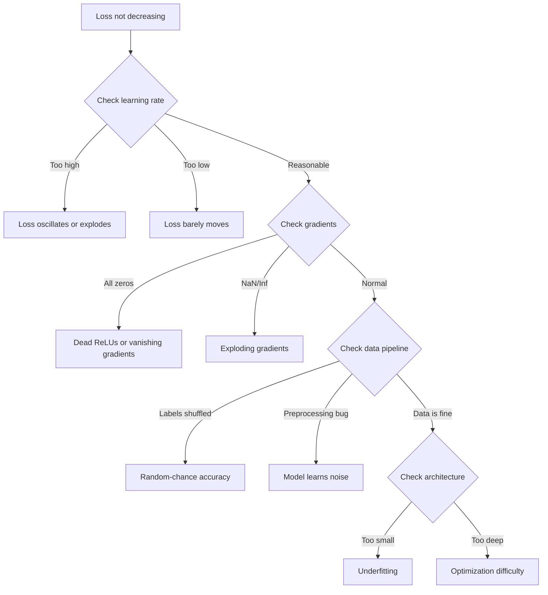
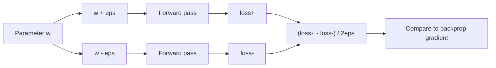
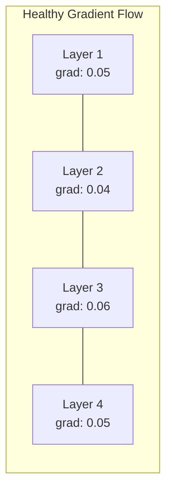
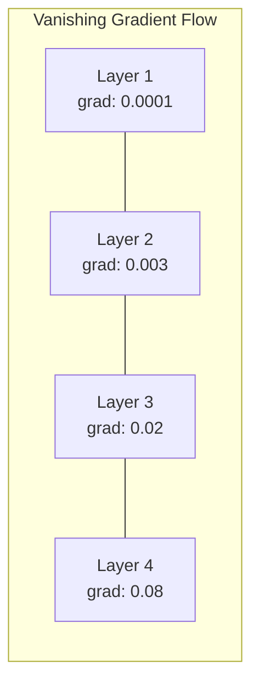
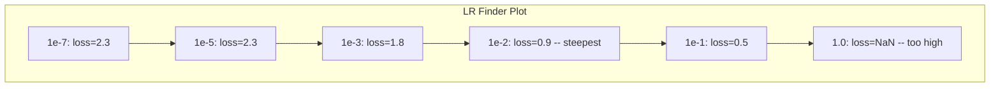

# إصلاح شبكات الأعصاب

> شبكتك مرتبة. لقد شنت. لقد أنتجت رقم. الرقم خاطئ ولا شيء قد اصطدم. مرحباً بك في نوع أسوأ إزالة التحذير -- نوع حيث لا توجد رسالة خطأ.

**Type:** Build
**Languages:** Python, PyTorch
**Prerequisites:** Phase 03 Lessons 01-10 (especially backpropagation, loss functions, optimizers)
**Time:** ~90 minutes

## أهداف التعلم

- تشخيص فشل الشبكة العصبية الشائعة (خسارة NaN ، منحنى الخسارة المسطح ، الإفراط في التكيف ، التذبذب) باستخدام استراتيجيات التحليل المنهجي
- تطبيق تقنية "تجاوز المجموعة الواحدة" للتحقق من أن بنية النموذج الخاص بك و حلقة التدريب صحيحة
- فحص حجم التنحى وتوزيعات التفعيل ومعايير الوزن لتحديد مشاكل التنحى المتلاشى/المفجرة
- قم ببناء قائمة تفحص لإلغاء التحليلات التي تغطي خط الأنابيب البيانات ، ومهارات النموذج ، و وظيفة الخسارة ، و المحفزات ، و قضايا معدل التعلم

## المشكلة

البرمجيات التقليدية تتعطل عندما تكون محطمة. يشير صفر إلى استثناء. يفشل عدم مطابقة النوع في وقت التجميع. خطأ منفصل واحد ينتج نتائج خاطئة بوضوح.

الشبكات العصبية لا تعطيك هذا الفاخر

شبكة عصبية مكسورة تعمل حتى الانتهاء، طباعة قيمة الخسارة، وتخرج التنبؤات. قد تقلل الخسارة قد تبدو التنبؤات معقولة لكن النموذج خاطئ صامتًا - تعلم الشروط المختصرة، حفظ الضوضاء، أو التقارب إلى أدنى الحد المحلي غير المفيد. يقدر باحثو جوجل أن 60-70% من وقت إزالة التحليلات المستخدمة في ML ينفق على أخطاء "صامتة" لا تنتج أي أخطاء ولكن يضعف نوعية النموذج.

الفرق بين نموذج عمل و نموذج مكسور هو غالباً خط واحد ضائع: خط مفقود `zero_grad()`، بعدة نقل، معدل التعلم أقل بنسبة 10x. يبدأ "وصفة لتدريب الشبكات العصبية" (2019) القنونيّة بهذا: "أشعاب الأخطاء في شبكة العصبية هي الأخطاء التي لا تتحطم".

هذه الدروس تعلّمك إيجاد تلك الحشرات

## المفهوم

### النزعة العقلية الخاطئة

انسى تحميل الخطأ في الطباعة والإصدار. تحميل الشبكة العصبية يتطلب نهجا منهجيا لأن حلقة التعليق بطيئة (دقائق إلى ساعات في كل دورة تدريبية) والأعراض غامضة (يمكن أن يعني فقدان سيء 20 شيء مختلف).

القاعدة الذهبية:**start simple, add complexity one piece at a time, and verify each piece independently.**



### العلامة الأولى: عدم انخفاض الخسارة

هذه الشكوى الأكثر شيوعاً، حلقة التدريب تتدفق، وتتدفق العصور، وتبقى الخسارة ثابتة أو تتذبذب بشكل وحشي.

**Wrong learning rate.**مرتفع جداً: الخسارة تتذبذب أو تقفز إلى NaN. منخفض جداً: الخسارة تقلّص ببطء بحيث تبدو مسطحة. بالنسبة لأدم، ابدأ من 1e-3. بالنسبة لـ SGD، ابدأ من 1e-1 أو 1e-2. حاول دائمًا 3 معدلات تعلم تتراوح بين 10x لكل واحد (مثل 1e-2, 1e-3, 1e-4) قبل استنتاج شيء آخر خاطئ.

**Dead ReLUs.**إذا تلقى عصبية ريلو إدخال سلبي كبير، فإنه يخرج 0 و تراجعتها هي 0. فإنه لا ينشط مرة أخرى. إذا مات عدد كاف من الخلايا العصبية، فإن الشبكة لا يمكن أن تتعلم. تحقق: طباعة الجزء من التنشيط التي هي بالضبط 0 بعد كل طبقة ريلو. إذا > 50% مات، التبديل إلى ريلو سلبي أو تقليل معدل التعلم.

**Vanishing gradients.**في الشبكات العميقة مع تنشيط sigmoid أو tanh ، تتقلص التدرج بشكل متسارع مع انتشارها إلى الوراء. في الوقت الذي تصل فيه إلى الطبقة الأولى ، تكون ~ 0. تتوقف الطبقات الأولى عن التعلم.

**Exploding gradients.**المشكلة المعاكسة -- التدرج ينمو بشكل متسارع. شائع في RNNs وشبكات عميقة جدا. الخسارة قفز إلى NaN.`torch.nn.utils.clip_grad_norm_`), انخفاض معدل التعلم، أو إضافة التطبيع.

### العلامة الثانية: انخفاض الخسارة لكن النموذج سيء

إن الخسارة تقلّت، دقة التدريب تصل إلى 99٪، لكن دقة الاختبار تصل إلى 55٪، أو النموذج ينتج نتائج غير منطقية على البيانات الحقيقية.

**Overfitting.**النموذج يتذكر بيانات التدريب بدلاً من أنماط التعلم. يزداد الفجوة بين التدريب وفقدان التحقق من التحقق من التحقق من التحقق من التحقق من التحقق من التحقق من التحقق من التحقق من التحقق من التحقق من التحقق من التحقق من التحقق من التحقق من التحقق من التحقق من التحقق من التحقق من التحقق من التحقق من التحقق من التحقق من التحقق من التحقق من التحقق من التحقق من التحقق من التحقق من التحقق من التحقق من التحقق من التحقق من التحقق من التحقق من التحقق من التحقق من التحقق من التحقق من التحقق من التحقق من التحقق من التحقق من التحقق من التحقق من التحقق من التحقق من التحقق من التحقق من التحقق من التحقق من التحقق من التحقق من التحقق من التحقق من التحقق من التحقق من التحقق من التحقق من التحقق من التحقق من التحقق من التحقق من التحقق من التحقق من التحقق من التحقق من التحقق من التحقق.

**Data leakage.**تسرب بيانات الاختبار في التدريب. الدقة مرتفعة بشكل مشبوه. الأسباب الشائعة: التخليط قبل التقسيم، المعالجة المسبقة مع الإحصاءات من مجموعة البيانات الكاملة، النسخة المكررة من عينات عبر التقسيمات. تصحيح: التقسيم الأول، والمعالجة المسبقة الثانية، التحقق من النسخة المكررة.

**Label errors.**5-10٪ من اللبكات في معظم مجموعات البيانات الحقيقية خاطئة (نورتكوت وآخرون ، 2021 -- "خطأ اللباقة الشاملة في مجموعات الاختبار"). يتعلم النموذج الضوضاء. تصحيح: استخدام التعلم الثقة للعثور على أمثلة خاطئة في اللبغة وإصلاحها ، أو استخدام تخفيض الخسارة لتجاهل عينات الخسارة العالية.

### العرض الثالث: نأن أو انف في الخسارة

قيمة الخسارة تصبح`nan`أو`inf`التدريب قد انتهى

**Learning rate too high.**تحديثات التدريجية تتجاوز الوزن حتى ينفجر

**log(0) or log(negative).**محاسبات الخسارة المتقاطعة للاندروبي`log(p)`إذا كان النموذج الخاص بك تصدر بالضبط 0 أو احتمال سلبي، سجل انفجار.`[eps, 1-eps]`أين`eps=1e-7`. . .

**Division by zero.**ينفصل تطبيع اللحظة عن طريق الانحراف القياسي. اللحظة ذات القيم الثابتة لديها std=0.

**Numerical overflow.**التفعيلات الكبيرة مدفوعة في `exp()`إنتاج Inf. Softmax هو عرضة بشكل خاص. تحديد: خصم القصوى قبل التعريض (حيلة التخفيض-الجمع-الاضافه).

### التقنية 1: التحقق من التدريج

مقارنة تراجع التحليل الخاص بك (من backprop) إلى تراجع عددي (من الاختلافات المحدودة). إذا كانوا لا يوافقون، فإن مرورك إلى الوراء لديه خطأ.

التراجع الرقمي للفارغ `w`:

```
grad_numerical = (loss(w + eps) - loss(w - eps)) / (2 * eps)
```

مقياس الاتفاق (الفارق النسبي):

```
rel_diff = |grad_analytical - grad_numerical| / max(|grad_analytical|, |grad_numerical|, 1e-8)
```

إذا`rel_diff < 1e-5`صحيح، إذا`rel_diff > 1e-3`بالتأكيد حشرة



### التقنية 2: إحصاءات التفعيل

مراقبة متوسط وفروق قياسي للتفعيلات بعد كل طبقة خلال التدريب. الشبكات الصحية تبقي التفعيلات مع متوسط قريب من 0 و std قريب من 1 (بعد التطبيع) أو على الأقل محدودة.

| Health indicator | Mean | Std | Diagnosis |
|-----------------|------|-----|-----------|
| Healthy | ~0 | ~1 | Network is learning normally |
| Saturated | >>0 or <<0 | ~0 | Activations stuck at extreme values |
| Dead | 0 | 0 | Neurons are dead (all zeros) |
| Exploding | >>10 | >>10 | Activations growing without bound |

### التقنية الثالثة: تصوير تدريجي للدفق

رسم متوسط حجم التهاب لكل طبقة. في شبكة صحية، يجب أن تكون magnitudes التهاب تقريبا مماثلة عبر الطبقات. إذا كانت الطبقات الأولى لديها تراجع 1000x أصغر من الطبقات اللاحقة، لديك تراجع تختفي.





### التقنية الرابعة: اختبار المعدات المفروضة في مجموعة واحدة

أهم تقنية تحريف أجهزة التعلم العميق

خذ مجموعة صغيرة واحدة (8-32 عينات). قم بتدريبها لمدة 100 مرة أو أكثر. يجب أن يصل الخسارة إلى الصفر تقريبًا وتحقيق التدريب إلى 100%. إذا لم يفعل ذلك، فإن نموذجك أو حلقة التدريب لديك خطأ أساسي - لا تتقدم إلى التدريب الكامل.

هذا الاختبار يحتوي على:
- وظائف الخسارة المكسورة
- المخطوطات الخلفية المكسورة
- الهندسة المعمارية صغيرة جداً لتمثيل البيانات
- المحفز غير متصل بمعايير النموذج
- البيانات والعلامات غير المنسقة

هذا يستغرق 30 ثانية للعمل ويوفر ساعات من التحريف كامل التدريب تشغيل.

### التقنية 5: عازف تعلّم

اقترحت ليزلي سميث (2017) مسح معدل التعلم من صغير جدا (1e-7) إلى كبير جدا (10) على مدى حقبة واحدة مع تسجيل الخسارة. خسارة المؤثر مقابل معدل التعلم. معدل التعلم المثالي هو أقل بنحو 10 مرات من معدل حيث يبدأ الخسارة في الانخفاض أسرع.



أفضل LR في هذا المثال: ~1e-3 (ترتيب واحد من الكبيرة قبل نقطة الركبة).

### حشرات البيتورش الشائعة

هذه هي الحشرات التي تضيع ساعات أكثر جماعية في مجتمع (بايتورش):

| Bug | Symptom | Fix |
|-----|---------|-----|
| Forgetting `optimizer.zero_grad()` | Gradients accumulate across batches, loss oscillates | Add `optimizer.zero_grad()` before `loss.backward()` |
| Forgetting `model.eval()` at test time | Dropout and batch norm behave differently, test accuracy varies between runs | Add `model.eval()` and `torch.no_grad()` |
| Wrong tensor shapes | Silent broadcasting produces wrong results, no error | Print shapes after every operation during debugging |
| CPU/GPU mismatch | `RuntimeError: expected CUDA tensor` | Use `.to(device)` on model AND data |
| Not detaching tensors | Computation graph grows forever, OOM | Use `.detach()` or `with torch.no_grad()` |
| In-place operations breaking autograd | `RuntimeError: modified by in-place operation` | Replace `x += 1` with `x = x + 1` |
| Data not normalized | Loss stuck at random-chance level | Normalize inputs to mean=0, std=1 |
| Labels as wrong dtype | Cross-entropy expects `Long`, got `Float` | Cast labels: `labels.long()` |

### طاولة إصلاح الأخطاء الرئيسية

| Symptom | Likely cause | First thing to try |
|---------|-------------|-------------------|
| Loss stuck at -log(1/num_classes) | Model predicting uniform distribution | Check data pipeline, verify labels match inputs |
| Loss NaN after a few steps | Learning rate too high | Reduce LR by 10x |
| Loss NaN immediately | log(0) or division by zero | Add epsilon to log/division operations |
| Loss oscillating wildly | LR too high or batch size too small | Reduce LR, increase batch size |
| Loss decreasing then plateaus | LR too high for fine-tuning phase | Add LR schedule (cosine or step decay) |
| Training acc high, test acc low | Overfitting | Add dropout, weight decay, more data |
| Training acc = test acc = chance | Model not learning anything | Run overfit-one-batch test |
| Training acc = test acc but both low | Underfitting | Bigger model, more layers, more features |
| Gradients all zero | Dead ReLUs or detached computation graph | Switch to LeakyReLU, check `.requires_grad` |
| Out of memory during training | Batch too large or graph not freed | Reduce batch size, use `torch.no_grad()` for eval |

```figure
learning-curves
```

## بناءها

مجموعة أدوات تشخيصية تتبع تنشيطات، تراجع، و منحنى الخسارة. سوف تفشل عمدا شبكة واستخدام مجموعة الأدوات لتشخيص كل مشكلة.

### الخطوة الأولى: فئة NetworkDebugger

يربط في نموذج PyTorch لتسجيل إحصاءات التفعيل والتحركات على كل طبقة.

```python
import torch
import torch.nn as nn
import math


class NetworkDebugger:
    def __init__(self, model):
        self.model = model
        self.activation_stats = {}
        self.gradient_stats = {}
        self.loss_history = []
        self.lr_losses = []
        self.hooks = []
        self._register_hooks()

    def _register_hooks(self):
        for name, module in self.model.named_modules():
            if isinstance(module, (nn.Linear, nn.Conv2d, nn.ReLU, nn.LeakyReLU)):
                hook = module.register_forward_hook(self._make_activation_hook(name))
                self.hooks.append(hook)
                hook = module.register_full_backward_hook(self._make_gradient_hook(name))
                self.hooks.append(hook)

    def _make_activation_hook(self, name):
        def hook(module, input, output):
            with torch.no_grad():
                out = output.detach().float()
                self.activation_stats[name] = {
                    "mean": out.mean().item(),
                    "std": out.std().item(),
                    "fraction_zero": (out == 0).float().mean().item(),
                    "min": out.min().item(),
                    "max": out.max().item(),
                }
        return hook

    def _make_gradient_hook(self, name):
        def hook(module, grad_input, grad_output):
            if grad_output[0] is not None:
                with torch.no_grad():
                    grad = grad_output[0].detach().float()
                    self.gradient_stats[name] = {
                        "mean": grad.mean().item(),
                        "std": grad.std().item(),
                        "abs_mean": grad.abs().mean().item(),
                        "max": grad.abs().max().item(),
                    }
        return hook

    def record_loss(self, loss_value):
        self.loss_history.append(loss_value)

    def check_loss_health(self):
        if len(self.loss_history) < 2:
            return "NOT_ENOUGH_DATA"
        recent = self.loss_history[-10:]
        if any(math.isnan(v) or math.isinf(v) for v in recent):
            return "NAN_OR_INF"
        if len(self.loss_history) >= 20:
            first_half = sum(self.loss_history[:10]) / 10
            second_half = sum(self.loss_history[-10:]) / 10
            if second_half >= first_half * 0.99:
                return "NOT_DECREASING"
        if len(recent) >= 5:
            diffs = [recent[i+1] - recent[i] for i in range(len(recent)-1)]
            if max(diffs) - min(diffs) > 2 * abs(sum(diffs) / len(diffs)):
                return "OSCILLATING"
        return "HEALTHY"

    def check_activations(self):
        issues = []
        for name, stats in self.activation_stats.items():
            if stats["fraction_zero"] > 0.5:
                issues.append(f"DEAD_NEURONS: {name} has {stats['fraction_zero']:.0%} zero activations")
            if abs(stats["mean"]) > 10:
                issues.append(f"EXPLODING_ACTIVATIONS: {name} mean={stats['mean']:.2f}")
            if stats["std"] < 1e-6:
                issues.append(f"COLLAPSED_ACTIVATIONS: {name} std={stats['std']:.2e}")
        return issues if issues else ["HEALTHY"]

    def check_gradients(self):
        issues = []
        grad_magnitudes = []
        for name, stats in self.gradient_stats.items():
            grad_magnitudes.append((name, stats["abs_mean"]))
            if stats["abs_mean"] < 1e-7:
                issues.append(f"VANISHING_GRADIENT: {name} abs_mean={stats['abs_mean']:.2e}")
            if stats["abs_mean"] > 100:
                issues.append(f"EXPLODING_GRADIENT: {name} abs_mean={stats['abs_mean']:.2e}")
        if len(grad_magnitudes) >= 2:
            first_mag = grad_magnitudes[0][1]
            last_mag = grad_magnitudes[-1][1]
            if last_mag > 0 and first_mag / last_mag > 100:
                issues.append(f"GRADIENT_RATIO: first/last = {first_mag/last_mag:.0f}x (vanishing)")
        return issues if issues else ["HEALTHY"]

    def print_report(self):
        print("\n=== NETWORK DEBUGGER REPORT ===")
        print(f"\nLoss health: {self.check_loss_health()}")
        if self.loss_history:
            print(f"  Last 5 losses: {[f'{v:.4f}' for v in self.loss_history[-5:]]}")
        print("\nActivation diagnostics:")
        for item in self.check_activations():
            print(f"  {item}")
        print("\nGradient diagnostics:")
        for item in self.check_gradients():
            print(f"  {item}")
        print("\nPer-layer activation stats:")
        for name, stats in self.activation_stats.items():
            print(f"  {name}: mean={stats['mean']:.4f} std={stats['std']:.4f} zero={stats['fraction_zero']:.1%}")
        print("\nPer-layer gradient stats:")
        for name, stats in self.gradient_stats.items():
            print(f"  {name}: abs_mean={stats['abs_mean']:.2e} max={stats['max']:.2e}")

    def remove_hooks(self):
        for hook in self.hooks:
            hook.remove()
        self.hooks.clear()
```

### الخطوة الثانية: اختبار المعدات المفروضة

```python
def overfit_one_batch(model, x_batch, y_batch, criterion, lr=0.01, steps=200):
    optimizer = torch.optim.Adam(model.parameters(), lr=lr)
    model.train()
    print("\n=== OVERFIT ONE BATCH TEST ===")
    print(f"Batch size: {x_batch.shape[0]}, Steps: {steps}")

    for step in range(steps):
        optimizer.zero_grad()
        output = model(x_batch)
        loss = criterion(output, y_batch)
        loss.backward()
        optimizer.step()

        if step % 50 == 0 or step == steps - 1:
            with torch.no_grad():
                preds = (output > 0).float() if output.shape[-1] == 1 else output.argmax(dim=1)
                targets = y_batch if y_batch.dim() == 1 else y_batch.squeeze()
                acc = (preds.squeeze() == targets).float().mean().item()
            print(f"  Step {step:3d} | Loss: {loss.item():.6f} | Accuracy: {acc:.1%}")

    final_loss = loss.item()
    if final_loss > 0.1:
        print(f"\n  FAIL: Loss did not converge ({final_loss:.4f}). Model or training loop is broken.")
        return False
    print(f"\n  PASS: Loss converged to {final_loss:.6f}")
    return True
```

### الخطوة الثالثة: تعقب معدل التعلم

```python
def find_learning_rate(model, x_data, y_data, criterion, start_lr=1e-7, end_lr=10, steps=100):
    import copy
    original_state = copy.deepcopy(model.state_dict())
    optimizer = torch.optim.SGD(model.parameters(), lr=start_lr)
    lr_mult = (end_lr / start_lr) ** (1 / steps)

    model.train()
    results = []
    best_loss = float("inf")
    current_lr = start_lr

    print("\n=== LEARNING RATE FINDER ===")

    for step in range(steps):
        optimizer.zero_grad()
        output = model(x_data)
        loss = criterion(output, y_data)

        if math.isnan(loss.item()) or loss.item() > best_loss * 10:
            break

        best_loss = min(best_loss, loss.item())
        results.append((current_lr, loss.item()))

        loss.backward()
        optimizer.step()

        current_lr *= lr_mult
        for param_group in optimizer.param_groups:
            param_group["lr"] = current_lr

    model.load_state_dict(original_state)

    if len(results) < 10:
        print("  Could not complete LR sweep -- loss diverged too quickly")
        return results

    min_loss_idx = min(range(len(results)), key=lambda i: results[i][1])
    suggested_lr = results[max(0, min_loss_idx - 10)][0]

    print(f"  Swept {len(results)} steps from {start_lr:.0e} to {results[-1][0]:.0e}")
    print(f"  Minimum loss {results[min_loss_idx][1]:.4f} at lr={results[min_loss_idx][0]:.2e}")
    print(f"  Suggested learning rate: {suggested_lr:.2e}")

    return results
```

### الخطوة الرابعة: التحقق من درجة

```python
def _flat_to_multi_index(flat_idx, shape):
    multi_idx = []
    remaining = flat_idx
    for dim in reversed(shape):
        multi_idx.insert(0, remaining % dim)
        remaining //= dim
    return tuple(multi_idx)


def gradient_check(model, x, y, criterion, eps=1e-4):
    model.train()
    x_double = x.double()
    y_double = y.double()
    model_double = model.double()

    print("\n=== GRADIENT CHECK ===")
    overall_max_diff = 0
    checked = 0

    for name, param in model_double.named_parameters():
        if not param.requires_grad:
            continue

        layer_max_diff = 0

        model_double.zero_grad()
        output = model_double(x_double)
        loss = criterion(output, y_double)
        loss.backward()
        analytical_grad = param.grad.clone()

        num_checks = min(5, param.numel())
        for i in range(num_checks):
            idx = _flat_to_multi_index(i, param.shape)
            original = param.data[idx].item()

            param.data[idx] = original + eps
            with torch.no_grad():
                loss_plus = criterion(model_double(x_double), y_double).item()

            param.data[idx] = original - eps
            with torch.no_grad():
                loss_minus = criterion(model_double(x_double), y_double).item()

            param.data[idx] = original

            numerical = (loss_plus - loss_minus) / (2 * eps)
            analytical = analytical_grad[idx].item()

            denom = max(abs(numerical), abs(analytical), 1e-8)
            rel_diff = abs(numerical - analytical) / denom

            layer_max_diff = max(layer_max_diff, rel_diff)
            checked += 1

        overall_max_diff = max(overall_max_diff, layer_max_diff)
        status = "OK" if layer_max_diff < 1e-5 else "MISMATCH"
        print(f"  {name}: max_rel_diff={layer_max_diff:.2e} [{status}]")

    model.float()

    print(f"\n  Checked {checked} parameters")
    if overall_max_diff < 1e-5:
        print("  PASS: Gradients match (rel_diff < 1e-5)")
    elif overall_max_diff < 1e-3:
        print("  WARN: Small differences (1e-5 < rel_diff < 1e-3)")
    else:
        print("  FAIL: Gradient mismatch detected (rel_diff > 1e-3)")
    return overall_max_diff
```

### الخطوة 5: شبكات مكسورة عمداً

الآن تطبيق مجموعة الأدوات على الشبكات المكسورة وتشخيص كل واحد منهم.

```python
def demo_broken_networks():
    torch.manual_seed(42)
    x = torch.randn(64, 10)
    y = (x[:, 0] > 0).long()

    print("\n" + "=" * 60)
    print("BUG 1: Learning rate too high (lr=10)")
    print("=" * 60)
    model1 = nn.Sequential(nn.Linear(10, 32), nn.ReLU(), nn.Linear(32, 2))
    debugger1 = NetworkDebugger(model1)
    optimizer1 = torch.optim.SGD(model1.parameters(), lr=10.0)
    criterion = nn.CrossEntropyLoss()
    for step in range(20):
        optimizer1.zero_grad()
        out = model1(x)
        loss = criterion(out, y)
        debugger1.record_loss(loss.item())
        loss.backward()
        optimizer1.step()
    debugger1.print_report()
    debugger1.remove_hooks()

    print("\n" + "=" * 60)
    print("BUG 2: Dead ReLUs from bad initialization")
    print("=" * 60)
    model2 = nn.Sequential(nn.Linear(10, 32), nn.ReLU(), nn.Linear(32, 32), nn.ReLU(), nn.Linear(32, 2))
    with torch.no_grad():
        for m in model2.modules():
            if isinstance(m, nn.Linear):
                m.weight.fill_(-1.0)
                m.bias.fill_(-5.0)
    debugger2 = NetworkDebugger(model2)
    optimizer2 = torch.optim.Adam(model2.parameters(), lr=1e-3)
    for step in range(50):
        optimizer2.zero_grad()
        out = model2(x)
        loss = criterion(out, y)
        debugger2.record_loss(loss.item())
        loss.backward()
        optimizer2.step()
    debugger2.print_report()
    debugger2.remove_hooks()

    print("\n" + "=" * 60)
    print("BUG 3: Missing zero_grad (gradients accumulate)")
    print("=" * 60)
    model3 = nn.Sequential(nn.Linear(10, 32), nn.ReLU(), nn.Linear(32, 2))
    debugger3 = NetworkDebugger(model3)
    optimizer3 = torch.optim.SGD(model3.parameters(), lr=0.01)
    for step in range(50):
        out = model3(x)
        loss = criterion(out, y)
        debugger3.record_loss(loss.item())
        loss.backward()
        optimizer3.step()
    debugger3.print_report()
    debugger3.remove_hooks()

    print("\n" + "=" * 60)
    print("HEALTHY NETWORK: Correct setup for comparison")
    print("=" * 60)
    model_good = nn.Sequential(nn.Linear(10, 32), nn.ReLU(), nn.Linear(32, 2))
    debugger_good = NetworkDebugger(model_good)
    optimizer_good = torch.optim.Adam(model_good.parameters(), lr=1e-3)
    for step in range(50):
        optimizer_good.zero_grad()
        out = model_good(x)
        loss = criterion(out, y)
        debugger_good.record_loss(loss.item())
        loss.backward()
        optimizer_good.step()
    debugger_good.print_report()
    debugger_good.remove_hooks()

    print("\n" + "=" * 60)
    print("OVERFIT-ONE-BATCH TEST (healthy model)")
    print("=" * 60)
    model_test = nn.Sequential(nn.Linear(10, 32), nn.ReLU(), nn.Linear(32, 2))
    overfit_one_batch(model_test, x[:8], y[:8], criterion)

    print("\n" + "=" * 60)
    print("LEARNING RATE FINDER")
    print("=" * 60)
    model_lr = nn.Sequential(nn.Linear(10, 32), nn.ReLU(), nn.Linear(32, 2))
    find_learning_rate(model_lr, x, y, criterion)

    print("\n" + "=" * 60)
    print("GRADIENT CHECK")
    print("=" * 60)
    model_grad = nn.Sequential(nn.Linear(10, 8), nn.ReLU(), nn.Linear(8, 2))
    gradient_check(model_grad, x[:4], y[:4], criterion)
```

## استخدمها

### أدوات متكاملة بـ "بيتورش"

```python
import torch
import torch.nn as nn

model = nn.Sequential(
    nn.Linear(768, 256),
    nn.ReLU(),
    nn.Linear(256, 10),
)

with torch.autograd.detect_anomaly():
    output = model(input_tensor)
    loss = criterion(output, target)
    loss.backward()

for name, param in model.named_parameters():
    if param.grad is not None:
        print(f"{name}: grad_mean={param.grad.abs().mean():.2e}")
```

### الوزن والتحيزات

```python
import wandb

wandb.init(project="debug-training")

for epoch in range(100):
    loss = train_one_epoch()
    wandb.log({
        "loss": loss,
        "lr": optimizer.param_groups[0]["lr"],
        "grad_norm": torch.nn.utils.clip_grad_norm_(model.parameters(), float("inf")),
    })

    for name, param in model.named_parameters():
        if param.grad is not None:
            wandb.log({f"grad/{name}": wandb.Histogram(param.grad.cpu().numpy())})
```

### المكتب التنسري

```python
from torch.utils.tensorboard import SummaryWriter

writer = SummaryWriter("runs/debug_experiment")

for epoch in range(100):
    loss = train_one_epoch()
    writer.add_scalar("Loss/train", loss, epoch)

    for name, param in model.named_parameters():
        writer.add_histogram(f"weights/{name}", param, epoch)
        if param.grad is not None:
            writer.add_histogram(f"gradients/{name}", param.grad, epoch)
```

### قائمة التحقق من إصلاحات (قبل التدريب الكامل)

1. اجري اختبار "تفيت" في مجموعة واحدة، وإذا فشلت، توقف
2. لنشر ملخص النموذج -- التحقق من عدد المعايير معقول.
3. قم بإجراء مرور واحد للأمام مع بيانات عشوائية -- تحقق شكل الخروج.
4. التدريب لمدة 5 حقول -- التحقق من انخفاض الخسائر.
5. تحقق من إحصاءات التفعيل لا توجد طبقات ميتة ولا انفجارات
6. تحقق من تدفق التهاب -- لا اختفاء، لا انفجار.
7. التحقق من خط البيانات -- طبع 5 عينات عشوائية مع العلامات.

## أرسله

هذا الدرس ينتج عن:
- `outputs/prompt-nn-debugger.md`-- تحذير للتشخيص فشل في تدريب شبكة الأعصاب
- `outputs/skill-debug-checklist.md`-- قائمة تفحص شجرة القرار لمشاكل إصلاح التدريب

أنماط النشر الرئيسية لإلغاء التحليل:
- إضافة خطافات مراقبة إلى نصوص تدريب الإنتاج
- إشغال السجلات وإحصاءات التراجع إلى W&B أو TensorBoard كل خطوة N
- تنفيذ تنبيهات تلقائية لخسارة NaN ، والعصبية الميتة (> 80٪ صفر) ، أو انفجار التراجع
- إعادة اختبار الإصلاحات المضافة إلى مجموعة واحدة عند تغيير الهندسة المعمارية أو خطوط البيانات

## التمارين

1. **Add an exploding gradient detector.**تعديل`NetworkDebugger`للكشف عن عندما تتجاوز التدرج عتبة وتقترح تلقائيًا قيمة قطع التدرج. اختبره على شبكة 20 طبقة دون أي تطبيع.

2. **Build a dead neuron resurrector.**اكتب وظيفة تحدد الخلايا العصبية الميتة ReLU (دائما الخروج 0) وتعيد تشغيل أوزانها المقبلة مع تشغيل كايمينغ. أظهر أن هذا يعيد شبكة حيث > 70% من الخلايا العصبية ميتة.

3. **Implement the learning rate finder with plotting.**التمديد`find_learning_rate`لإنشاء النتائج كـ CSV و كتابة نص منفصل يقرأ CSV و يعرض منحنى LR مقابل الخسارة باستخدام matplotlib. حدد LR الأمثل لـ ResNet-18 على CIFAR-10.

4. **Create a data pipeline validator.**اكتب وظيفة تحقق من: عينات مزدوجة عبر الانقسامات القطارية / الاختبارية ، وعدم توازن توزيع اللوحات (> نسبة 10: 1) ، وتطبيع المدخلات (متوسط قريب من 0 ، std قريب من 1) ، وقيم NaN / Inf في البيانات. قم بتشغيلها على مجموعة بيانات فاسدة عمدا.

5. **Debug a real failure.**خذ الإطار الصغير من الدروس 10 ، قم بتقديم خطأ خفيف (على سبيل المثال ، نقل المصفوفة الوزن إلى الوراء) ، واستخدم فحص التدفقات لمعرفة بالضبط أي معايير لها تدفقات غير صحيحة. وثيق عملية التحليل.

## الشروط الرئيسية

| Term | What people say | What it actually means |
|------|----------------|----------------------|
| Silent bug | "It runs but gives bad results" | A bug that produces no error but degrades model quality -- the dominant failure mode in ML |
| Dead ReLU | "The neurons died" | A ReLU neuron whose input is always negative, so it outputs 0 and receives 0 gradient permanently |
| Vanishing gradients | "Early layers stop learning" | Gradients shrink exponentially through layers, making weights in early layers effectively frozen |
| Exploding gradients | "Loss went to NaN" | Gradients grow exponentially through layers, causing weight updates so large they overflow |
| Gradient checking | "Verify backprop is correct" | Comparing analytical gradients from backprop to numerical gradients from finite differences |
| Overfit-one-batch | "The most important debug test" | Training on a single small batch to verify the model CAN learn -- if it cannot, something is fundamentally broken |
| LR finder | "Sweep to find the right learning rate" | Exponentially increasing the learning rate over one epoch and picking the rate just before loss diverges |
| Data leakage | "Test data leaked into training" | When information from the test set contaminates training, producing artificially high accuracy |
| Activation statistics | "Monitor layer health" | Tracking mean, std, and zero-fraction of each layer's output to detect dead, saturated, or exploding neurons |
| Gradient clipping | "Cap the gradient magnitude" | Scaling gradients down when their norm exceeds a threshold, preventing exploding gradient updates |

## المزيد من القراءة

- سميث، "تطورات التعلم الدورية للتدريب الشبكات العصبية" (2017) -- الورقة التي تعرض اختبار نطاق معدل التعلم (ملاحظ لـLR)
- نورثكوت وآخرون، "خطأ اللبنانات المنتشرة في مجموعات الاختبار تزعزع استقرار معايير التعلم الآلي" (2021) -- يظهر أن 3-6٪ من العلامات في ImageNet، CIFAR-10، وغيرها من المعايير الرئيسية خاطئة
- تشانغ وغيره، "فهم التعلم العميق يتطلب إعادة التفكير في التعميم" (2017) -- الورقة التي تظهر أن الشبكات العصبية يمكن أن تتذكر العلامات العشوائية، وهذا هو السبب في أن اختبار Overfit-One-batch يعمل
- وثائق PyTorch على `torch.autograd.detect_anomaly`و`torch.autograd.set_detect_anomaly`للكشف عن NaN/Inf المدمج
