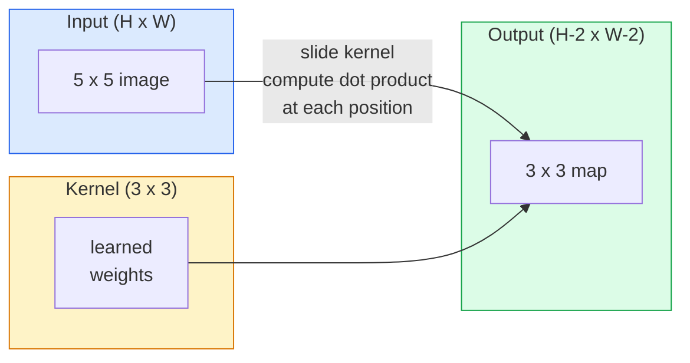
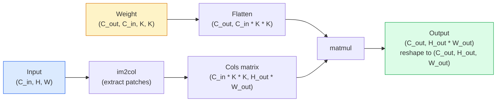

# التحولات من الصفر

> التموج هو طبقة صغيرة كثيفة تتسلل عبر صورة، وتشارك نفس الوزن في كل موقع.

**Type:** Build
**Languages:** Python
**Prerequisites:** Phase 3 (Deep Learning Core), Phase 4 Lesson 01 (Image Fundamentals)
**Time:** ~75 minutes

## أهداف التعلم

- تنفيذ التخزين الثنائي الأبعاد من الصفر باستخدام NumPy فقط، بما في ذلك إصدار الحلقة المربطة والمركز `im2col`الإصدار
- احسب حجم المساحة المخرجة لأي مزيج من حجم المدخل وحجم النواة والشحنة والخطوة ، وبرر`(H - K + 2P) / S + 1`الصيغة
- النواة المصممة يدويا (حافة، ضبابية، حادة، صوبيل) ويشرح لماذا كل واحد ينتج نمط التفعيل الذي يفعل
- تحويلات الدرج إلى مستخرج خاصية وربط عمق الدرج بحجم الحقل الاستقبالي

## المشكلة

طبقة متصلة بالكامل على صورة RGB 224 × 224 ستحتاج إلى 224 * 224 * 3 = 150,528 وزناً إدخالياً لكل خلية عصبية. طبقة واحدة مخفية مع 1000 وحدة هي بالفعل 150 مليون مبرمير قبل أن تتعلم أي شيء مفيد. والأسوأ من ذلك، أن هذه الطبقة لا تملك فكرة أن الكلب في الأعلى اليسار وكلب في الأسفل اليمين هي نفس النمط. إنه يعامل كل موقع بيكسل على أنه مستقل، وهو أمر خاطئ تماماً بالنسبة للصور: ترجمة قطة بثلاثة بيكسل لا يجب أن تجبر الشبكة على إعادة تعلم المفهوم.

الخصائص الثانية التي يحتاجها نموذج الصورة هي**translation equivariance**(تغير الناتج عند تغير المدخل) و **parameter sharing**(المكشف نفسه يعمل في كل مكان) الطبقات الكثيفة تعطيك لا شيء. التحول يعطيك كليهما مجانا.

لم يتم اختراع التحول للتعلم العميق. إنها نفس العملية التي تعمل على ضغط JPEG ، والضباب الغاسسي في Photoshop ، وكشف الحافة في الرؤية الصناعية ، وجميع مرشحات الصوت التي تم شحنها من أي وقت مضى. السبب في سي أن إنز هيمنت على ImageNet من 2012 إلى 2020 هو أن التحول هو السباق الصحيح للبيانات التي ترتبط بها القيم القريبة ويمكن أن يظهر نفس النمط في أي مكان.

## المفهوم

### ذرة واحدة، تتزلج

تأخذ صيغة ثنائية الأبعاد ماتريساً صغيرةً للوزن تسمى النواة (أو المرشح) ، وتسلطها عبر المدخل، وتحسب في كل موقع مجموع المنتجات الحكيمة عن العناصر. يصبح هذا المبلغ بكسلًا واحدًا للخروج.



مثال 3x3 ملموس على مدخل 5x5 (لا ملابس، خطوة 1):

```
Input X (5 x 5):                Kernel W (3 x 3):

  1  2  0  1  2                   1  0 -1
  0  1  3  1  0                   2  0 -2
  2  1  0  2  1                   1  0 -1
  1  0  2  1  3
  2  1  1  0  1

The kernel slides across every valid 3 x 3 window. Output Y is 3 x 3:

 Y[0,0] = sum( W * X[0:3, 0:3] )
 Y[0,1] = sum( W * X[0:3, 1:4] )
 Y[0,2] = sum( W * X[0:3, 2:5] )
 Y[1,0] = sum( W * X[1:4, 0:3] )
 ... and so on
```

هذه الصيغة الوحيدة**shared weights, locality, sliding window**كل شيء آخر هو الحساب

### صيغة حجم الإنتاج

نظراً لقياس مساحة المدخلات`H`، حجم النجم`K`، التشويش`P`، خطوة`S`:

```
H_out = floor( (H - K + 2P) / S ) + 1
```

تذكر هذا، ستحسبها عشرات المرات لكل معمارة

| Scenario | H | K | P | S | H_out |
|----------|---|---|---|---|-------|
| Valid conv, no padding | 32 | 3 | 0 | 1 | 30 |
| Same conv (preserves size) | 32 | 3 | 1 | 1 | 32 |
| Downsample by 2 | 32 | 3 | 1 | 2 | 16 |
| Pool 2x2 | 32 | 2 | 0 | 2 | 16 |
| Large receptive field | 32 | 7 | 3 | 2 | 16 |

"المثل" يعني اختيار P بحيث H_out == H عندما S == 1. بالنسبة K غير مقارنة، وهذا هو P = (K - 1) / 2. لهذا السبب 3x3 النواة تهيمن  هم أصغر النواة غير مقارنة التي لا تزال لديها مركز.

### التدليك

بدون التدفق، كل صعوبة تقلص خريطة الميزات. قم بتجميع 20 منها وتصبح صورتك 224x224 184x184، مما يضيع الحساب على الحدود ويعقد الاتصالات المتبقية التي تحتاج إلى أشكال مطابقة.

```
Zero padding (P = 1) on a 5 x 5 input:

  0  0  0  0  0  0  0
  0  1  2  0  1  2  0
  0  0  1  3  1  0  0
  0  2  1  0  2  1  0       Now the kernel can centre on pixel
  0  1  0  2  1  3  0       (0, 0) and still have three rows and
  0  2  1  1  0  1  0       three columns of values to multiply.
  0  0  0  0  0  0  0
```

الأساليب التي تواجهها في الممارسة:`zero`(أكثر شيوعًا) ،`reflect`(مراياً على الحافة، يتجنب الحدود الصلبة في النماذج التوليدية)`replicate`(نسخ الحافة) ،`circular`(ملفوفة حولها، تستخدم في مشاكل الورم الحمضي).

### خطوة

خطوة هي حجم خطوة من المنحدر. `stride=1`هو الافتراضي`stride=2`يقلل من نصف الأبعاد الفضائية و هو الطريقة الكلاسيكية لإخراج العينات داخل سي إن إن دون طبقة تجميع منفصلة

```
Stride 1 on a 5 x 5 input, 3 x 3 kernel:

  starts: (0,0) (0,1) (0,2)        -> output row 0
          (1,0) (1,1) (1,2)        -> output row 1
          (2,0) (2,1) (2,2)        -> output row 2

  Output: 3 x 3

Stride 2 on the same input:

  starts: (0,0) (0,2)              -> output row 0
          (2,0) (2,2)              -> output row 1

  Output: 2 x 2
```

### قنوات مدخول متعددة

الصور الحقيقية لديها ثلاثة قنوات. تحويل 3x3 على مدخل RGB هو في الواقع حجم 3x3x3: قطعة 3x3 واحدة لكل قناة مدخلة. في كل موقف فضائي، تضيف وتضاعف عبر جميع القنوات الثلاثة وتضيف تحيزًا.

```
Input:   (C_in,  H,  W)        3 x 5 x 5
Kernel:  (C_in,  K,  K)        3 x 3 x 3 (one kernel)
Output:  (1,     H', W')       2D map

For a layer that produces C_out output channels, you stack C_out kernels:

Weight:  (C_out, C_in, K, K)   e.g. 64 x 3 x 3 x 3
Output:  (C_out, H', W')       64 x 3 x 3

Parameter count: C_out * C_in * K * K + C_out   (the + C_out is biases)
```

هذه الخط الأخير هو الذي سوف تحسب عند تخطيط نموذج.`64 * 3 * 3 * 3 + 64 = 1,792`المعلمات. رخيصة.

### خدعة إم2كول

الحلقات المضغوطة سهلة القراءة ولكن بطيئة. تريد GPU مضاعفات المصفوفة الكبيرة. الخدعة: تسطح كل نافذة حقل الاستقبال من المدخل إلى عمود واحد من المصفوفة الكبيرة، تسطح النواة إلى صف، وتصبح التخزين بأكمله مالم واحد.



كل تنفيذ إنتاج conv هو نوع من هذه بالإضافة إلى خدوش التخزين المتخزين (conv مباشرة، Winograd، FFT conv للنواة الكبيرة). فهم im2col وأنت تفهم الأساس.

### الحقل الاستقبالي

3x3 Conv واحد ينظر إلى 9 بيكسلات مدخلة. مكعبين 3x3 Conv و العصبية في الطبقة الثانية ينظر إلى 5x5 بيكسلات مدخلة. 3 3x3 Conv يعطي 7x7.

```
RF after L stacked K x K convs (stride 1) = 1 + L * (K - 1)

With strides:   RF grows multiplicatively with stride along each layer.
```

السبب الكامل "3x3 down all the way" يعمل (VGG، ResNet، ConvNeXt) هو أن 2 3x3 convs ترى نفس مساحة المدخل مثل واحد 5x5 conv ولكن مع أقل ملامح و غير خطية إضافية بينهما.

```figure
convolution-kernel
```

## بناءها

### الخطوة الأولى: إضافة صف

ابدأ بأصغر بدائية: وظيفة تضع الصفر حول صفوف H x W.

```python
import numpy as np

def pad2d(x, p):
    if p == 0:
        return x
    h, w = x.shape[-2:]
    out = np.zeros(x.shape[:-2] + (h + 2 * p, w + 2 * p), dtype=x.dtype)
    out[..., p:p + h, p:p + w] = x
    return out

x = np.arange(9).reshape(3, 3)
print(x)
print()
print(pad2d(x, 1))
```

خدعة المحورات التابعة`x.shape[:-2]`يعني نفس الوظيفة تعمل على `(H, W)`،`(C, H, W)`أو`(N, C, H, W)`بدون تعديل

### الخطوة 2: التشويق ثنائي الأبعاد مع حلقات مستقرة

تنفيذ المرجعية بطيئة ولكن لا لبس فيه. هذا ما`torch.nn.functional.conv2d`في المبدأ.

```python
def conv2d_naive(x, w, b=None, stride=1, padding=0):
    c_in, h, w_in = x.shape
    c_out, c_in_w, kh, kw = w.shape
    assert c_in == c_in_w

    x_pad = pad2d(x, padding)
    h_out = (h + 2 * padding - kh) // stride + 1
    w_out = (w_in + 2 * padding - kw) // stride + 1

    out = np.zeros((c_out, h_out, w_out), dtype=np.float32)
    for oc in range(c_out):
        for i in range(h_out):
            for j in range(w_out):
                hs = i * stride
                ws = j * stride
                patch = x_pad[:, hs:hs + kh, ws:ws + kw]
                out[oc, i, j] = np.sum(patch * w[oc])
        if b is not None:
            out[oc] += b[oc]
    return out
```

أربعة حلقات مستجمعة (قناة الخروج، الصف، العمود، زائد المبلغ الضمني على C_in، kh، kw). هذه هي الحقيقة الأرضية التي سوف تحقق كل تنفيذ أسرع ضد.

### الخطوة 3: التحقق من ذلك باستخدام النجم المصمم يدوياً

بناء ذرة صوبيل عمودية، تطبيقها على صورة خطوة اصطناعية، ومشاهدة حافة عمودية يضيء.

```python
def synthetic_step_image():
    img = np.zeros((1, 16, 16), dtype=np.float32)
    img[:, :, 8:] = 1.0
    return img

sobel_x = np.array([
    [[-1, 0, 1],
     [-2, 0, 2],
     [-1, 0, 1]]
], dtype=np.float32)[None]

x = synthetic_step_image()
y = conv2d_naive(x, sobel_x, padding=1)
print(y[0].round(1))
```

توقع قيم إيجابية كبيرة على العمود 7 (زيادة في البهاء من اليسار إلى اليمين) والصفر في كل مكان آخر. هذه الطباعة الوحيدة هي التحقق من صحة العقل الخاص بك أن الرياضيات صحيحة.

### الخطوة الرابعة:

تحويل كل نافذة بحجم النواة في المدخل إلى عمود من المصفوفة.`C_in=3, K=3`كل عمود 27 رقم

```python
def im2col(x, kh, kw, stride=1, padding=0):
    c_in, h, w = x.shape
    x_pad = pad2d(x, padding)
    h_out = (h + 2 * padding - kh) // stride + 1
    w_out = (w + 2 * padding - kw) // stride + 1

    cols = np.zeros((c_in * kh * kw, h_out * w_out), dtype=x.dtype)
    col = 0
    for i in range(h_out):
        for j in range(w_out):
            hs = i * stride
            ws = j * stride
            patch = x_pad[:, hs:hs + kh, ws:ws + kw]
            cols[:, col] = patch.reshape(-1)
            col += 1
    return cols, h_out, w_out
```

لا يزال حلقة Python، ولكن الآن رفع الثقيلة سيكون واحد متمل متجه.

### الخطوة 5: التسجيل السريع عبر im2col + matmul

استبدل الحلقة الأربعة بمضاعفة ماتريكية واحدة.

```python
def conv2d_im2col(x, w, b=None, stride=1, padding=0):
    c_out, c_in, kh, kw = w.shape
    cols, h_out, w_out = im2col(x, kh, kw, stride, padding)
    w_flat = w.reshape(c_out, -1)
    out = w_flat @ cols
    if b is not None:
        out += b[:, None]
    return out.reshape(c_out, h_out, w_out)
```

التحقق من الدقة: تشغيل كلا التنفيذات ومقارنة.

```python
rng = np.random.default_rng(0)
x = rng.normal(0, 1, (3, 16, 16)).astype(np.float32)
w = rng.normal(0, 1, (8, 3, 3, 3)).astype(np.float32)
b = rng.normal(0, 1, (8,)).astype(np.float32)

y_naive = conv2d_naive(x, w, b, padding=1)
y_im2col = conv2d_im2col(x, w, b, padding=1)

print(f"max abs diff: {np.max(np.abs(y_naive - y_im2col)):.2e}")
```

`max abs diff`يجب أن تكون في الجوار`1e-5`الفرق هو ترتيب التراكم في النقطة العائمة، وليس حشرة.

### الخطوة 6: بنك من الأرز المصممة يدوياً

خمسة مرشحات تظهر ما يمكن أن تعبّر به طبقة واحدة قبل أي تدريب

```python
KERNELS = {
    "identity": np.array([[0, 0, 0], [0, 1, 0], [0, 0, 0]], dtype=np.float32),
    "blur_3x3": np.ones((3, 3), dtype=np.float32) / 9.0,
    "sharpen": np.array([[0, -1, 0], [-1, 5, -1], [0, -1, 0]], dtype=np.float32),
    "sobel_x": np.array([[-1, 0, 1], [-2, 0, 2], [-1, 0, 1]], dtype=np.float32),
    "sobel_y": np.array([[-1, -2, -1], [0, 0, 0], [1, 2, 1]], dtype=np.float32),
}

def apply_kernel(img2d, kernel):
    x = img2d[None].astype(np.float32)
    w = kernel[None, None]
    return conv2d_im2col(x, w, padding=1)[0]
```

تطبق على أي صورة على نطاق الرمادي ، تُضفف ، وتُضفف الحواف ، وتُضفف الشفافات فوق الحواف ، تُضف Sobel-x الحواف العمودية ، تُضف Sobel-y الحواف الأفقية. هذه هي بالضبط الأنماط التي تعلمتها طبقة conv المدربة الأولى في AlexNet و VGG  لأن نموذج الصورة الجيد يحتاج إلى كشف الحواف والبقع بغض النظر عن المهمة التي تأتي في وقت لاحق.

## استخدمها

(بيتورش)`nn.Conv2d`يحتوي نفس العملية مع أوتوجراد، نواة CUDA، وتحسين cuDNN.

```python
import torch
import torch.nn as nn

conv = nn.Conv2d(in_channels=3, out_channels=64, kernel_size=3, stride=1, padding=1)
print(conv)
print(f"weight shape: {tuple(conv.weight.shape)}   # (C_out, C_in, K, K)")
print(f"bias shape:   {tuple(conv.bias.shape)}")
print(f"param count:  {sum(p.numel() for p in conv.parameters())}")

x = torch.randn(8, 3, 224, 224)
y = conv(x)
print(f"\ninput  shape: {tuple(x.shape)}")
print(f"output shape: {tuple(y.shape)}")
```

التغيير`padding=1`لـ`padding=0`وتخفض الناتج إلى 222 × 222`stride=1`لـ`stride=2`و ينخفض إلى 112 × 112 نفس الصيغة التي حفظتها أعلاه

## أرسله

هذا الدرس ينتج عن:

- `outputs/prompt-cnn-architect.md` عرض يضع، نظراً لقياس المدخلات، ميزانية المعلمات، وحقل الاستقبال المستهدف، مجموعة من`Conv2d`طبقات مع الـ K/S/P الصحيحة في كل خطوة.
- `outputs/skill-conv-shape-calculator.md` مهارة تمشي على مستوى شبكة المحدد طبقة بعد طبقة وتعيد الشكل الخروج، والحقل الاستقبال، وعداد المعلمات لكل كتلة.

## التمارين

1. **(Easy)**نظراً لـ 128 × 128 مدخل على مقياس الرمادي و كومة من `[Conv3x3(s=1,p=1), Conv3x3(s=2,p=1), Conv3x3(s=1,p=1), Conv3x3(s=2,p=1)]`، حساب حجم المساحة الخارجة والحقل الاستقبالي في كل طبقة يدويا. التحقق من مع PyTorch `nn.Sequential`من الحافلات المزيفة
2. **(Medium)**التمديد`conv2d_naive`و`conv2d_im2col`للاعتراف`groups`دعيني أريكم ذلك`groups=C_in=C_out`يعيد التخزين بعمق و أن عدد المعايير له`C * K * K`بدلاً من`C * C * K * K`. . .
3. **(Hard)**تنفيذ التخطيط الراجعي لـ `conv2d_im2col`باليد: بالنظر إلى تراجع الخروج، احسب تراجع `x`و`w`- تأكيد ضد`torch.autograd.grad`على نفس المدخلات والوزن. الخدعة: تراجع im2col هو`col2im`و يجب أن تتراكم النوافذ المتداخلة

## الشروط الرئيسية

| Term | What people say | What it actually means |
|------|----------------|----------------------|
| Convolution | "Sliding a filter" | A learnable dot product applied at every spatial location with shared weights; mathematically a cross-correlation, but everyone calls it convolution |
| Kernel / filter | "The feature detector" | A small weight tensor of shape (C_in, K, K) whose dot product with a window of input produces one output pixel |
| Stride | "How far you jump" | The step size between consecutive kernel placements; stride 2 halves each spatial dimension |
| Padding | "Zeros on the edges" | Extra values added around the input so the kernel can centre on border pixels; `same` padding keeps output size equal to input size |
| Receptive field | "How much the neuron sees" | The patch of original input that a given output activation depends on, growing with depth and stride |
| im2col | "The GEMM trick" | Rearranging every receptive window into columns so convolution becomes one big matrix multiply — the core of every fast conv kernel |
| Depthwise conv | "One kernel per channel" | A conv with `groups == C_in`, computing each output channel from only its matching input channel; the backbone of MobileNet and ConvNeXt |
| Translation equivariance | "Shift in, shift out" | Property that shifting the input by k pixels shifts the output by k pixels; comes for free with shared weights |

## المزيد من القراءة

- [A guide to convolution arithmetic for deep learning (Dumoulin & Visin, 2016)](https://arxiv.org/abs/1603.07285) الرسومات النهائية للتدليك/التوسع/التوسع التي تقوم كل دورة بتنسخها بهدوء
- [CS231n: Convolutional Neural Networks for Visual Recognition](https://cs231n.github.io/convolutional-networks/) ملاحظات المحاضرة القنونية، بما في ذلك تفسير im2col الأصلي
- [The Annotated ConvNet (fast.ai)](https://nbviewer.org/github/fastai/fastbook/blob/master/13_convolutions.ipynb) دفتر ملاحظات يذهب من التخفيف اليدوي إلى مصنف أرقام مدرب
- [Receptive Field Arithmetic for CNNs (Dang Ha The Hien)](https://distill.pub/2019/computing-receptive-fields/) شرح تفاعلي نوعية الورق لحسابات الحقل الاستقبالي
