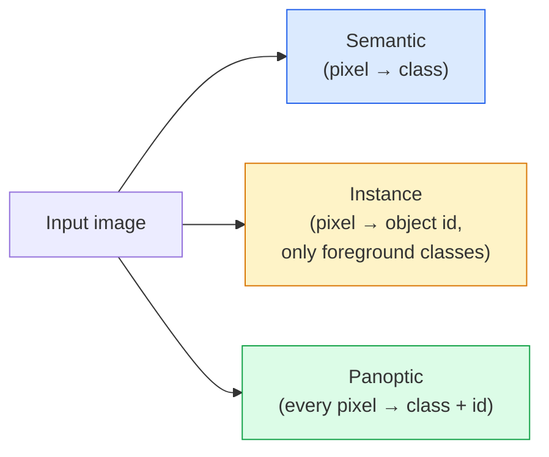
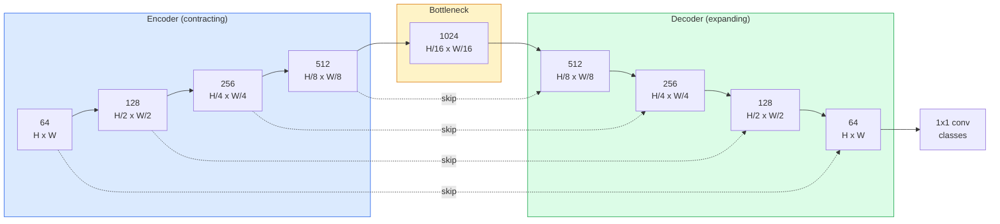

# التقسيم الترجموي  U-Net

> التقسيم هو تصنيف في كل بيكسل. يجعلها U-Net تعمل عن طريق ربط مرموزة downsampling مع مرموزة upsampling والسلكية تخطي الاتصالات بينهم.

**Type:** Build
**Languages:** Python
**Prerequisites:** Phase 4 Lesson 03 (CNNs), Phase 4 Lesson 04 (Image Classification)
**Time:** ~75 minutes

## أهداف التعلم

- تمييز التقسيمات النطاقية والمثلية والشعبية واختيار المهمة المناسبة لمشكلة معينة
- بناء شبكة U-Net من الصفر في PyTorch مع كتلة تشفير، وعنق زجاجة، وحدة فك مع تحويلات، والفوت اتصال
- تنفيذ الاندروبي المتقاطع ذو النقاط البكسلية ، خسارة القضيب ، والخسارة المشتركة التي هي الافتراض الحالي للتقسيم الطبي والصناعي
- اقرأ مقاييس IoU و Dice لكل فئة وتشخيص ما إذا كانت النتيجة السيئة تأتي من استدعاء الأشياء الصغيرة ، دقة الحدود ، أو عدم توازن الفئة

## المشكلة

تصنيف تصدر علامة واحدة لكل صورة. الكشف يخرج حفنة من الصناديق لكل صورة. التقسيم يخرج علامة واحدة لكل بكسل. لدخول حجم `H x W`، إنتاجها هو تنصر الشكل`H x W`(مؤثرة) أو `H x W x N_instances`هذا ملايين التنبؤات لكل صورة، وليس واحدة.

هيكل التقسيم هو السبب في أنه يعمل على كل منتج رؤية التنبؤ الكثيف تقريبًا: التصوير الطبي (أقنعة الورم) ، والقيادة الذاتية (الطريق ، والمركبة ، والعقبة) ، والقمر الصناعي (بوابات المبنى ، حدود المحاصيل) ، ومحاكاة الوثائق (منطقة التخطيط) ، والروبوتات (منطقة يمكن التقاطها). لا يمكن حل أي من هذه المهام عن طريق وضع مربع حول الكائن؛ فإنها تحتاج إلى الصورة الدقيقة.

مشكلة الهندسة المعمارية بسيطة أن تقول وليس سهلا لحلها: تحتاج الشبكة لرؤية السياق العالمي لصور (ما هو نوع من المشهد هذا) وتفاصيل البيكسل المحلية (حسناً أي بيكسل هو الطريق مقابل الرصيف) في نفس الوقت.

## المفهوم

### النطقية مقابل النقطة مقابل النظرية



- **Semantic**يقول "هذا البيكسل هو الطريق، وهذا البيكسل هو السيارة". سيارتان بجانب بعضها البعض تنهار إلى بقعة واحدة.
- **Instance**يقول "هذا البيكسل هو السيارة رقم 3، وهذا البيكسل هو السيارة رقم 5". يتجاهل الأشياء الخلفية ("الشئ" = السماء، الطريق، العشب).
- **Panoptic**يوحد كلتا: كل بكسل يحصل على علامة طبقة، كل حالة تحصل على هوية فريدة، الأشياء والأشياء كلتا قطعات.

هذا الدروس يغطي التعابير. الدروس التالية (Mask R-CNN) تغطي المثال.

### شكل شبكة U-Net



يقلل المرفق من القرار الفضائي أربع مرات ويضاعف القنوات. يعكس المرفق: يضاعف القرار الفضائي أربع مرات ويضع نصف القنوات. تتوافق وصلات القفز مع ميزات المرفق المتناسب مع ميزات المرفق في كل قرار. الخرائط النهائية 1x1 conv`64 -> num_classes`بمقرر كامل

لماذا تكون الاتصالات القفزة ضرورية: لم يرى المقرر خرائط ميزات صغيرة فقط عندما يحاول إصدار التنبؤات على مستوى البيكسل. بدون القفزات لا يمكن تحديد الحواف بدقة لأن هذه المعلومات قد ضُغطت بعيداً في المقرر. تمنح الاتصالات القفزة خرائط ميزة عالية القرارة المقرر المقرر في طريق الهبوط.

### نقل مقابل عينة فوق المخطين

يجب على المفكّر توسيع الأبعاد الفضائية خياران:

- **Transposed convolution**(`nn.ConvTranspose2d`)  نموذج عالي التعلم. تاريخي U-Net افتراضي. يمكن أن تنتج أدوات لوحة الشطرنج إذا لم تكن حجم الخطوة والكربون تقسم بالتساوي.
- **Bilinear upsample + 3x3 conv** نموذج عالي السلس يليه صيغة. أقل أثاث، أقل ملامح، الآن الاختيار المتبني الحديث.

كلاهما يظهر في البرية، بالنسبة لأول شبكة U، المزدوج أكثر أماناً.

### التشابه المتقاطع على شبكة البيكسل

بالنسبة للتقسيم الدلالي مع فئات C، فإن النموذج الخارجي هو `(N, C, H, W)`الهدف هو`(N, H, W)`مع أرقام تعريف فئة كاملة. التشابه المتقاطع هو نفس حالة التصنيف، فقط تطبيق في كل موقع فضائي:

```
Loss = mean over (n, h, w) of -log( softmax(logits[n, :, h, w])[target[n, h, w]] )
```

`F.cross_entropy`في (بيتورش) يتعامل مع هذا الشكل بشكل طبيعي، لا حاجة لإعادة تشكيل.

### خسارة الارقام ولماذا تحتاجها

التعامل مع كل بكسل على قدم المساواة. هذا خطأ عندما تهيمن فئة واحدة على الإطار (التصوير الطبي: 99٪ خلفية، 1٪ ورم). يمكن للشبكة الحصول على دقة 99٪ من خلال التنبؤ بالخلفية في كل مكان ومازالت غير مفيدة.

فقدان الارقام يحل هذا الأمر عن طريق تحسين التداخل بين القناع المتوقع والحقيقي مباشرة:

```
Dice(p, y) = 2 * sum(p * y) / (sum(p) + sum(y) + epsilon)
Dice_loss = 1 - Dice
```

أين`p`هو خريطة الاحتمالات sigmoid/softmax لفئة و `y`هو قناع الحقيقة الأرضية الثنائية. الخسارة هي صفر فقط عندما التداخل هو مثالية. لأنه يعتمد على النسب، عدم التوازن الطبقي غير ذي صلة.

في الممارسة العملية، استخدم**combined loss**:

```
L = L_cross_entropy + lambda * L_dice       (lambda ~ 1)
```

يعطي التشابك المتقاطع تراجعات مستقرة في وقت مبكر من التدريب؛ يركز ديس ذيل التدريب على مطابقة شكل القناع. هذه المجموعة هي الاختيار الطبية للتصوير الصحي ومن الصعب هزيمتها على أي مجموعة بيانات غير متوازنة من الفصول.

### مقاييس التقييم

- **Pixel accuracy**% من البيكسلات تم التنبؤ بها بشكل صحيح. رخيص. تم كسر البيانات غير المتوازنة لسبب نفسه الذي يجعلها دقيقة في التصنيف.
- **IoU per class** التقاطع على الاتحاد للكلة الواحدة من قناع كل فئة؛ متوسط بين الفئات = mIoU.
- **Dice (F1 on pixels)** مشابهة لـ IoU`Dice = 2 * IoU / (1 + IoU)`التصوير الطبي يفضل القليل، والجماعة القيادة تفضل الـ IoU؛ فهي مرتبطة بشكل متزايد.
- **Boundary F1** تقيس مدى قرب الحدود المتوقعة من الحدود الحقيقية الأرضية، مع تعاقب حتى التحولات الصغيرة.

تقرير IUI لكل فئة، وليس فقط MIoU. متوسط IUI يخفي فئة عند 15% بينما تسعة آخرين على 85%.

### التداول في حل المدخل

يقلل مبرمج U-Net من النصف من القرار أربع مرات ، لذلك يجب أن تكون المدخل قابلة للقسمة بـ 16. الصور الطبية غالباً ما تكون 512x512 أو 1024x1024.`H * W * C_max`و عند 1024x1024 مع 1024 قناة عنق الزجاجة الممر الأمامي يستخدم بالفعل جيجا بايت من VRAM.

حلول عمل قياسية:
1. طلاء المدخل  عملية 256x256 طلاء مع التداخل والخياطة.
2. استبدل ضغينة الزجاجة بالانحناءات الموسعة التي تبقي الحل الفضائي أعلى ولكن توسع مجال الاستقبال (عائلة DeepLab).

بالنسبة للنموذج الأول، مدخل 256 × 256 مع شبكة U-Net ذات قاعدة 64 قناة يتدرب بشكل مريح على 8 جيجابايت VRAM.

```figure
segmentation-flood
```

## بناءها

### الخطوة 1: حظر تشفير

اثنان من القنوات 3 × 3 مع معايير اللحظة و ReLU. القنوات الأولى تغير عدد القنوات؛ والثانية تحتفظ بها.

```python
import torch
import torch.nn as nn
import torch.nn.functional as F

class DoubleConv(nn.Module):
    def __init__(self, in_c, out_c):
        super().__init__()
        self.net = nn.Sequential(
            nn.Conv2d(in_c, out_c, kernel_size=3, padding=1, bias=False),
            nn.BatchNorm2d(out_c),
            nn.ReLU(inplace=True),
            nn.Conv2d(out_c, out_c, kernel_size=3, padding=1, bias=False),
            nn.BatchNorm2d(out_c),
            nn.ReLU(inplace=True),
        )

    def forward(self, x):
        return self.net(x)
```

هذه الكتلة تستخدم مرة أخرى في كل مكان.`bias=False`لأن بيتا (بن) يتعامل مع التحيز

### الخطوة الثانية: الكتل الهبوطية والارتفاعية

```python
class Down(nn.Module):
    def __init__(self, in_c, out_c):
        super().__init__()
        self.net = nn.Sequential(
            nn.MaxPool2d(2),
            DoubleConv(in_c, out_c),
        )

    def forward(self, x):
        return self.net(x)


class Up(nn.Module):
    def __init__(self, in_c, out_c):
        super().__init__()
        self.up = nn.Upsample(scale_factor=2, mode="bilinear", align_corners=False)
        self.conv = DoubleConv(in_c, out_c)

    def forward(self, x, skip):
        x = self.up(x)
        if x.shape[-2:] != skip.shape[-2:]:
            x = F.interpolate(x, size=skip.shape[-2:], mode="bilinear", align_corners=False)
        x = torch.cat([skip, x], dim=1)
        return self.conv(x)
```

التحقق من الشكل في المكان فقط (`shape[-2:]`) يُعامل المدخلات التي لا يمكن تقسيم أبعادها بـ16 ،`F.interpolate`يُحَسِّنُ الجهاز الجهاز الجهاز الجهاز الجهاز الجهاز الجهاز الجهاز الجهاز الجهاز الجهاز الجهاز الجهاز الجهاز الجهاز الجهاز الجهاز الجهاز الجهاز الجهاز الجهاز الجهاز الجهاز الجهاز الجهاز الجهاز الجهاز الجهاز الجهاز الجهاز الجهاز الجهاز الجهاز الجهاز الجهاز الجهاز الجهاز الجهاز الجهاز الجهاز الجهاز الجهاز الجهاز الجهاز الجهاز الجهاز الجهاز الجهاز الجهاز الجهاز الجهاز الجهاز الجهاز الجهاز الجهاز الجهاز الجهاز الجهاز الجهاز الجهاز الجهاز الجهاز الجهاز الجهاز الجهاز الجهاز الجهاز الجهاز الجهاز الجهاز الجهاز الجهاز الجهاز الجهاز الجهاز الجهاز الجهاز الجهاز الجهاز الجهاز الجهاز الجهاز الجهاز الجهاز الجهاز الجهاز الجهاز الجهاز الجهاز الجهاز الجهاز الجهاز الجهاز الجهاز الجهاز الجهاز الجهاز الجهاز الجهاز الجهاز الجهاز الجهاز الجهاز الجهاز الجهاز الجهاز

### الخطوة الثالثة: شبكة الإنترنت

```python
class UNet(nn.Module):
    def __init__(self, in_channels=3, num_classes=2, base=64):
        super().__init__()
        self.inc = DoubleConv(in_channels, base)
        self.d1 = Down(base, base * 2)
        self.d2 = Down(base * 2, base * 4)
        self.d3 = Down(base * 4, base * 8)
        self.d4 = Down(base * 8, base * 16)
        self.u1 = Up(base * 16 + base * 8, base * 8)
        self.u2 = Up(base * 8 + base * 4, base * 4)
        self.u3 = Up(base * 4 + base * 2, base * 2)
        self.u4 = Up(base * 2 + base, base)
        self.outc = nn.Conv2d(base, num_classes, kernel_size=1)

    def forward(self, x):
        x1 = self.inc(x)
        x2 = self.d1(x1)
        x3 = self.d2(x2)
        x4 = self.d3(x3)
        x5 = self.d4(x4)
        x = self.u1(x5, x4)
        x = self.u2(x, x3)
        x = self.u3(x, x2)
        x = self.u4(x, x1)
        return self.outc(x)

net = UNet(in_channels=3, num_classes=2, base=32)
x = torch.randn(1, 3, 256, 256)
print(f"output: {net(x).shape}")
print(f"params: {sum(p.numel() for p in net.parameters()):,}")
```

شكل الخروج`(1, 2, 256, 256)` نفس حجم المساحة التي تم إدخالها، `num_classes`قنوات. حوالي 7.7M المعلمات في`base=32`. . .

### الخطوة الرابعة: الخسائر

```python
def dice_loss(logits, targets, num_classes, eps=1e-6):
    probs = F.softmax(logits, dim=1)
    targets_one_hot = F.one_hot(targets, num_classes).permute(0, 3, 1, 2).float()
    dims = (0, 2, 3)
    intersection = (probs * targets_one_hot).sum(dim=dims)
    denom = probs.sum(dim=dims) + targets_one_hot.sum(dim=dims)
    dice = (2 * intersection + eps) / (denom + eps)
    return 1 - dice.mean()


def combined_loss(logits, targets, num_classes, lam=1.0):
    ce = F.cross_entropy(logits, targets)
    dc = dice_loss(logits, targets, num_classes)
    return ce + lam * dc, {"ce": ce.item(), "dice": dc.item()}
```

يتم حساب الارقام لكل فئة ثم متوسطها (الارقام الكبيرة).`eps`يمنع تقسيم الصفر على الفئات الغائبة من اللحظة.

### الخطوة 5: مقياس IoU

```python
@torch.no_grad()
def iou_per_class(logits, targets, num_classes):
    preds = logits.argmax(dim=1)
    ious = torch.zeros(num_classes)
    for c in range(num_classes):
        pred_c = (preds == c)
        true_c = (targets == c)
        inter = (pred_c & true_c).sum().float()
        union = (pred_c | true_c).sum().float()
        ious[c] = (inter / union) if union > 0 else torch.tensor(float("nan"))
    return ious
```

يعيد متجه طول C. `nan`علامات فئات غائبة من اللحظة  لا تتوسط على تلك التي عند الحساب mIoU.

### الخطوة 6: مجموعة بيانات اصطناعية للتحقق من النهاية إلى النهاية

إنشاء أشكال على خلفيات ملونة حتى تتعلم الشبكة الشكل وليس لون البيكسل

```python
import numpy as np
from torch.utils.data import Dataset, DataLoader

def synthetic_segmentation(num_samples=200, size=64, seed=0):
    rng = np.random.default_rng(seed)
    images = np.zeros((num_samples, size, size, 3), dtype=np.float32)
    masks = np.zeros((num_samples, size, size), dtype=np.int64)
    for i in range(num_samples):
        bg = rng.uniform(0, 1, (3,))
        images[i] = bg
        masks[i] = 0
        num_shapes = rng.integers(1, 4)
        for _ in range(num_shapes):
            cls = int(rng.integers(1, 3))
            color = rng.uniform(0, 1, (3,))
            cx, cy = rng.integers(10, size - 10, size=2)
            r = int(rng.integers(4, 12))
            yy, xx = np.meshgrid(np.arange(size), np.arange(size), indexing="ij")
            if cls == 1:
                mask = (xx - cx) ** 2 + (yy - cy) ** 2 < r ** 2
            else:
                mask = (np.abs(xx - cx) < r) & (np.abs(yy - cy) < r)
            images[i][mask] = color
            masks[i][mask] = cls
        images[i] += rng.normal(0, 0.02, images[i].shape)
        images[i] = np.clip(images[i], 0, 1)
    return images, masks


class SegDataset(Dataset):
    def __init__(self, images, masks):
        self.images = images
        self.masks = masks

    def __len__(self):
        return len(self.images)

    def __getitem__(self, i):
        img = torch.from_numpy(self.images[i]).permute(2, 0, 1).float()
        mask = torch.from_numpy(self.masks[i]).long()
        return img, mask
```

ثلاث فئات: الخلفية (0) ، الدائرات (1) ، المربع (2). يجب على الشبكة أن تتعلم تمييز الشكل.

### الخطوة 7: حلقة التدريب

```python
def train_one_epoch(model, loader, optimizer, device, num_classes):
    model.train()
    loss_sum, total = 0.0, 0
    iou_sum = torch.zeros(num_classes)
    for x, y in loader:
        x, y = x.to(device), y.to(device)
        logits = model(x)
        loss, _ = combined_loss(logits, y, num_classes)
        optimizer.zero_grad()
        loss.backward()
        optimizer.step()
        loss_sum += loss.item() * x.size(0)
        total += x.size(0)
        iou_sum += iou_per_class(logits, y, num_classes).nan_to_num(0)
    return loss_sum / total, iou_sum / len(loader)
```

إضافة إلى ذلك، قم بتشغيل هذه المجموعة لمدة 10 إلى 30 فترة على مجموعة البيانات الاصطناعية ومشاهدة ارتفاع mIoU فوق 0.9 في فئات الشكل. لاحظ`nan_to_num(0)`يعامل الفئات الغائبة من اللحظة على أنها صفر، بالنسبة للوحدة الدقيقة لكل فئة، القناع حسب الوجود والاستخدام `torch.nanmean`عبر اللويات في وقت التقييم بدلا من متوسط هنا.

## استخدمها

للإنتاج`segmentation_models_pytorch`("smp") تغطي كل معمارة التقسيم القياسي مع أي رؤية مشعل أو العمود الفقري timm. ثلاث خطوط:

```python
import segmentation_models_pytorch as smp

model = smp.Unet(
    encoder_name="resnet34",
    encoder_weights="imagenet",
    in_channels=3,
    classes=3,
)
```

أيضاً يستحق معرفة العمل الحقيقي:
- **DeepLabV3+**يبدل العينات التدريجية القائمة على المجموعة القصوى بعينات متوسعة بحيث يحافظ عقد الزجاجة على الدقة؛ حدود أسرع على بيانات الأقمار الصناعية والقيادة.
- **SegFormer**يغير مُرمّد المُخزنات إلى محول سلسلي؛ SOTA الحالية على العديد من المعايير.
- **Mask2Former**- لا ، لا**OneFormer**يوحد التقسيم المفصلي والحرفي والشعبي في بنية واحدة.

كلّ الثلاثة هي استبدالات في القيادة`smp`أو`transformers`مع نفس محمول البيانات.

## أرسله

هذا الدرس ينتج عن:

- `outputs/prompt-segmentation-task-picker.md` عرض يختار بين التقسيم المفصل، والحالة، والشكل العام، ويعطي أسماءً للهندسة المعمارية للمهمة المعينة.
- `outputs/skill-segmentation-mask-inspector.md` مهارة تقرير توزيع الفصول، والإحصاءات المتوقعة، والفصول التي تكون أقل من المتوقع أو غير واضحة.

## التمارين

1. **(Easy)**تنفيذ`bce_dice_loss`لمهام التقسيم الثنائي (المنص المسبق مقابل الخلفية). تحقق على مجموعة بيانات مصنوعية ذات فئتين أن الخسارة المشتركة تتقارب أسرع من BCE وحدها عندما تكون الخلفية 5٪ من البكسلات.
2. **(Medium)**استبدل`nn.Upsample + conv`- إضافة مع`nn.ConvTranspose2d`إعادة تعديل كل من مجموعة البيانات الاصطناعية ومقارنة mIoU. لاحظ أين تظهر أدوات اللوحة الشطرنجية في النسخة المنقولة.
3. **(Hard)**خذ مجموعة بيانات تقسيم حقيقية (حيوانات أوكسفورد- IIIT، Cityscapes mini split، أو مجموعة فرعية طبية) ومدربة شبكة U-Net إلى داخل 2 نقطة IoU من `smp.Unet`الإشارة. تقرير لكل فئة IoU وتحديد أي فئات تستفيد أكثر من إضافة Dice إلى الخسارة.

## الشروط الرئيسية

| Term | What people say | What it actually means |
|------|----------------|----------------------|
| Semantic segmentation | "Label every pixel" | Per-pixel classification into C classes; instances of the same class merge |
| Instance segmentation | "Label every object" | Separates distinct instances of the same class; foreground-only |
| Panoptic segmentation | "Semantic + instance" | Every pixel gets a class; every thing instance also gets a unique id |
| Skip connection | "U-Net bridge" | Concatenation of encoder features into matching-resolution decoder features; preserves high-frequency detail |
| Transposed conv | "Deconvolution" | Learnable upsampling; can produce checkerboard artifacts |
| Dice loss | "Overlap loss" | 1 - 2|A ∩ B| / (|A| + |B|); optimises mask overlap directly and is robust to class imbalance |
| mIoU | "Mean intersection over union" | Average IoU across classes; the community-standard metric for segmentation |
| Boundary F1 | "Boundary accuracy" | F1 score computed on boundary pixels only; matters for precision-critical tasks |

## المزيد من القراءة

- [U-Net: Convolutional Networks for Biomedical Image Segmentation (Ronneberger et al., 2015)](https://arxiv.org/abs/1505.04597) الورق الأصلي، والرقم الذي ينسخ كل شخص هو على الصفحة 2
- [Fully Convolutional Networks (Long et al., 2015)](https://arxiv.org/abs/1411.4038) الورقة التي جعلت أول قسم مشكلة نهاية إلى نهاية
- [segmentation_models_pytorch](https://github.com/qubvel/segmentation_models.pytorch) الإشارة لتقسيم الإنتاج؛ كل بنية قياسية بالإضافة إلى كل خسارة قياسية
- [Lessons learned from training SOTA segmentation (kaggle.com competitions)](https://www.kaggle.com/code/iafoss/carvana-unet-pytorch) دراسة لمَ تُعتبر TTA، التسمية السائدة، ووزن الفئة مهمة في البيانات الحقيقية
