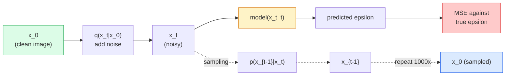

# إنتاج الصور  نماذج التوزيع

> تعلم نموذج التوزيع التخريب، تدربها على إزالة ضجيج صغير من الصورة الضوضاء، كرر ذلك إلى الوراء ألف مرة، ولديك مولد الصورة.

**Type:** Build
**Languages:** Python
**Prerequisites:** Phase 4 Lesson 07 (U-Net), Phase 1 Lesson 06 (Probability), Phase 3 Lesson 06 (Optimizers)
**Time:** ~75 minutes

## أهداف التعلم

- استنتاج عملية الضوضاء الأمامية `x_0 -> x_1 -> ... -> x_T`و اشرح لماذا النموذج المغلق`q(x_t | x_0)`يحتفظ بأي t
- تنفيذ هدف تدريب على شكل DDPM الذي يعيد الضجيج المضاف في كل خطوة، ومعينة تتراجع من الضجيج النقي إلى صورة
- بناء شبكة U-Net ذات تكييف زمني (صغيرة بما فيه الكفاية للتدريب على CPU) التي تنبأ الضجيج لأي خطوة زمنية
- شرح الفرق بين أخذ العينات من DDPM وDDIM، وعندما يكون كل منها مناسبًا (تتناول الدروس 23 مطابقة التدفق وتحقيق التدفق في العمق)

## المشكلة

المواد المضادة تنشئ صورة واحدة: ضجيج داخل، صورة خارج، مرسلة واحدة إلى الأمام. إنهم سريعون و صعوبة التدريب نموذجات التنشر تولد بشكل متكرر: تبدأ من الضوضاء النقية، وتحدد في خطوات صغيرة، تظهر الصورة. إنهم بطيئون وسهل التدريب خلال السنوات الخمس الماضية، هيمنت هذه الميزة الأخيرة: يمكن لأي فريق صغير تدريب نموذج التوزيع والحصول على عينات معقولة؛ تدريب GAN هو مهارة تتعلمها على مدار سنوات من الجري الفاشل.

وبالإضافة إلى استقرار التدريب، هي الهيكل التكراري للتشويش الذي يفتح كل ما يفعله توليد الصور الحديث: تكييف النص، التلوين، تحرير الصور، عالية القرار، النمط القيادي. كل خطوة من حلقة أخذ العينات هي مكان لتحقق قيوداً جديدة. هذا هو السبب في أنّ "المركز المتواصل" و "الصورة" و "دال-إيه 3" و "ميدجورني" وكل نموذج صورة قابلة للتحكم ستستخدمونه يعتمد على التواصل.

هذه الدروس تبني الحد الأدنى من DDPM: الضوضاء إلى الأمام، التخفيض إلى الخلف، حلقة التدريب. الدروس التالية (الانتشار المستقر) تشتريها في نظام إنتاج مع VAE، مرموز نص، والإرشاد خالي من المصنف.

## المفهوم

### العملية المقبلة

خذ صورة`x_0`أضف كمية صغيرة من الضوضاء الغاسية للحصول على`x_1`إضافة كمية صغيرة أكثر للحصول على`x_2`استمر في خطوات T حتى`x_T`هو تقريبا لا يمكن التمييز عن الضوضاء الغاوسية النقية.

```
q(x_t | x_{t-1}) = N(x_t; sqrt(1 - beta_t) * x_{t-1},  beta_t * I)
```

`beta_t`هو جدول متغير صغير، عادة خطي من 0.0001 إلى 0.02 على T = 1000 خطوات. كل خطوة تقلص قليلا من الإشارة وتحقق ضجيج جديد.

### قفزة الشكل المغلق

إضافة الضوضاء خطوة واحدة في كل مرة هي سلسلة ماركوف، ولكن الرياضيات تطوي: يمكنك أن تأخذ عينات`x_t`مباشرة من`x_0`في خطوة واحدة.

```
Define alpha_t = 1 - beta_t
Define alpha_bar_t = prod_{s=1..t} alpha_s

Then:
  q(x_t | x_0) = N(x_t; sqrt(alpha_bar_t) * x_0,  (1 - alpha_bar_t) * I)

Equivalently:
  x_t = sqrt(alpha_bar_t) * x_0 + sqrt(1 - alpha_bar_t) * epsilon
  where epsilon ~ N(0, I)
```

هذه المعادلة الوحيدة هي السبب كله للتوزيع هو عملي. أثناء التدريب تحصل على عشوائية`t`، عينة`x_t`مباشرة من`x_0`، وتركّب في خطوة واحدة لا حاجة إلى محاكاة سلسلة ماركوف الكاملة

### العملية العكسية

العملية الأمامية ثابتة. العملية العكسية `p(x_{t-1} | x_t)`هذا ما تتعلمه الشبكة العصبية.`x_{t-1}`مباشرة ، إنهم يتوقعون الضجيج`epsilon`و يضاف في الخطوة t، و النتائج الرياضية`x_{t-1}`من ذلك.



### فقدان التدريب

لكل خطوة تدريبية:

1. عينة صورة حقيقية`x_0`. . .
2. عينة خطوة زمنية `t`بشكل متساوي من [1, T].
3. النموذج الضجيج`epsilon ~ N(0, I)`. . .
4. الحساب`x_t = sqrt(alpha_bar_t) * x_0 + sqrt(1 - alpha_bar_t) * epsilon`. . .
5. التنبؤ`epsilon_theta(x_t, t)`مع الشبكة.
6. الحد الأدنى `|| epsilon - epsilon_theta(x_t, t) ||^2`. . .

هذا كل شيء الشبكة العصبية تتعلم التنبؤ بالضوضاء في أي مرحلة زمنية الخسارة هي MSE لا يوجد لعبة معادلة، لا انهيار، لا تذبذب.

### عينة (DDPM)

لتوليد: البدء من `x_T ~ N(0, I)`ومرّاً إلى الوراء خطوةً في كل مرة

```
for t = T, T-1, ..., 1:
    eps = model(x_t, t)
    x_{t-1} = (1 / sqrt(alpha_t)) * (x_t - (beta_t / sqrt(1 - alpha_bar_t)) * eps) + sqrt(beta_t) * z
    where z ~ N(0, I) if t > 1, else 0
return x_0
```

المفتاح هو أنه على الرغم من أن الشروط العكسية غير معروفة في شكل مغلق بشكل عام، لهذا العملية الجاوسيية المقدمة المحددة هو.

### لماذا 1000 خطوة

يتم اختيار جدول الضوضاء المقبلة بحيث تضيف كل خطوة ما يكفي من الضوضاء بحيث يكون الخطوة العكسية تقريبا غوسية. قليلة جداً والخطوة العكسية بعيدة عن غوسية، لا يمكن للشبكة أن تقوم بتصميمها بشكل جيد. تصبح الخطوات والعينة كثيرة جداً مكلفة مع زيادة تقلص. T = 1000 مع جدول خطي هو DDPM افتراضي.

### الـ DDIM: 20 مرة أسرع أخذ العينات

التدريب هو نفسه. تغيرات العينات. DDIM (Song et al., 2020) تعرّف عملية معاكسة تحديدية تتخطى خطوات زمنية دون إعادة التدريب. يعطي العينات في 50 خطوة مع DDIM نوعية DDPM قريبة من 1000 خطوة. كل نظام إنتاج يستخدم DDIM أو فاريان أسرع حتى (DPM-Solver ، أجداد Euler).

### تكييف الوقت

الشبكة`epsilon_theta(x_t, t)`تحتاج إلى معرفة الخطوة الزمنية التي يحددها.`t`عبر التوابل الزمنية السينوسويدية (المفكرة نفسها كالتشفير الموضعي في المحولات) التي يتم إضافةها إلى خرائط الميزات على كل مستوى U-Net.

```
t_embedding = sinusoidal(t)
feature_map += MLP(t_embedding)
```

بدون تكييف الوقت، يجب على الشبكة تخمين مستوى الضوضاء من الصورة نفسها، والتي تعمل ولكن أقل كفاءة في استخدام العينات.

```figure
cv-diffusion-image
```

## بناءها

### الخطوة الأولى: جدول الضوضاء

```python
import torch

def linear_beta_schedule(T=1000, beta_start=1e-4, beta_end=2e-2):
    return torch.linspace(beta_start, beta_end, T)


def precompute_schedule(betas):
    alphas = 1.0 - betas
    alphas_cumprod = torch.cumprod(alphas, dim=0)
    return {
        "betas": betas,
        "alphas": alphas,
        "alphas_cumprod": alphas_cumprod,
        "sqrt_alphas_cumprod": torch.sqrt(alphas_cumprod),
        "sqrt_one_minus_alphas_cumprod": torch.sqrt(1.0 - alphas_cumprod),
        "sqrt_recip_alphas": torch.sqrt(1.0 / alphas),
    }

schedule = precompute_schedule(linear_beta_schedule(T=1000))
```

احسب من قبل مرة واحدة، اجمع عن طريق المؤشر أثناء التدريب والعينة.

### الخطوة الثانية: التوزيع الأمامي (مثال Q_sample)

```python
def q_sample(x0, t, noise, schedule):
    sqrt_a = schedule["sqrt_alphas_cumprod"][t].view(-1, 1, 1, 1)
    sqrt_one_minus_a = schedule["sqrt_one_minus_alphas_cumprod"][t].view(-1, 1, 1, 1)
    return sqrt_a * x0 + sqrt_one_minus_a * noise
```

شكل مغلق من خط واحد`t`هي مجموعة من خطوات الزمن، واحدة لكل صورة في المجموعة.

### الخطوة الثالثة: شبكة U-net الصغيرة ذات التكييف في الوقت المناسب

```python
import torch.nn as nn
import torch.nn.functional as F
import math

def timestep_embedding(t, dim=64):
    half = dim // 2
    freqs = torch.exp(-math.log(10000) * torch.arange(half, device=t.device) / half)
    args = t[:, None].float() * freqs[None]
    emb = torch.cat([args.sin(), args.cos()], dim=-1)
    return emb


class TinyUNet(nn.Module):
    def __init__(self, img_channels=3, base=32, t_dim=64):
        super().__init__()
        self.t_mlp = nn.Sequential(
            nn.Linear(t_dim, base * 4),
            nn.SiLU(),
            nn.Linear(base * 4, base * 4),
        )
        self.t_dim = t_dim
        self.enc1 = nn.Conv2d(img_channels, base, 3, padding=1)
        self.enc2 = nn.Conv2d(base, base * 2, 4, stride=2, padding=1)
        self.mid = nn.Conv2d(base * 2, base * 2, 3, padding=1)
        self.dec1 = nn.ConvTranspose2d(base * 2, base, 4, stride=2, padding=1)
        self.dec2 = nn.Conv2d(base * 2, img_channels, 3, padding=1)
        self.time_proj = nn.Linear(base * 4, base * 2)

    def forward(self, x, t):
        t_emb = timestep_embedding(t, self.t_dim)
        t_emb = self.t_mlp(t_emb)
        t_proj = self.time_proj(t_emb)[:, :, None, None]

        h1 = F.silu(self.enc1(x))
        h2 = F.silu(self.enc2(h1)) + t_proj
        h3 = F.silu(self.mid(h2))
        d1 = F.silu(self.dec1(h3))
        d2 = torch.cat([d1, h1], dim=1)
        return self.dec2(d2)
```

شبكة U-Net ذات مستوياتين مع تكييف الوقت المدفوع في عنق الزجاجة، قم بتحسين عمق وعرض الصور الحقيقية

### الخطوة الرابعة: حلقة التدريب

```python
def train_step(model, x0, schedule, optimizer, device, T=1000):
    model.train()
    x0 = x0.to(device)
    bs = x0.size(0)
    t = torch.randint(0, T, (bs,), device=device)
    noise = torch.randn_like(x0)
    x_t = q_sample(x0, t, noise, schedule)
    pred = model(x_t, t)
    loss = F.mse_loss(pred, noise)
    optimizer.zero_grad()
    loss.backward()
    optimizer.step()
    return loss.item()
```

هذا هو حلقة التدريب بأكملها لا لعبة GAN، لا خسارة متخصصة، مكالمة واحدة من MSE.

### الخطوة 5: عينة (DDPM)

```python
@torch.no_grad()
def sample(model, schedule, shape, T=1000, device="cpu"):
    model.eval()
    x = torch.randn(shape, device=device)
    betas = schedule["betas"].to(device)
    sqrt_one_minus_a = schedule["sqrt_one_minus_alphas_cumprod"].to(device)
    sqrt_recip_alphas = schedule["sqrt_recip_alphas"].to(device)

    for t in reversed(range(T)):
        t_batch = torch.full((shape[0],), t, dtype=torch.long, device=device)
        eps = model(x, t_batch)
        coef = betas[t] / sqrt_one_minus_a[t]
        mean = sqrt_recip_alphas[t] * (x - coef * eps)
        if t > 0:
            x = mean + torch.sqrt(betas[t]) * torch.randn_like(x)
        else:
            x = mean
    return x
```

1000 مرسلة إلى الأمام لإنتاج مجموعة واحدة من العينات. في الرمز الحقيقي كنت ستبادل هذا مع عينة DDIM 50 خطوة.

### الخطوة 6: عينة DDIM (تتحديدية، ~20x أسرع)

```python
@torch.no_grad()
def sample_ddim(model, schedule, shape, steps=50, T=1000, device="cpu", eta=0.0):
    model.eval()
    x = torch.randn(shape, device=device)
    alphas_cumprod = schedule["alphas_cumprod"].to(device)

    ts = torch.linspace(T - 1, 0, steps + 1).long()
    for i in range(steps):
        t = ts[i]
        t_prev = ts[i + 1]
        t_batch = torch.full((shape[0],), t, dtype=torch.long, device=device)
        eps = model(x, t_batch)
        a_t = alphas_cumprod[t]
        a_prev = alphas_cumprod[t_prev] if t_prev >= 0 else torch.tensor(1.0, device=device)
        x0_pred = (x - torch.sqrt(1 - a_t) * eps) / torch.sqrt(a_t)
        sigma = eta * torch.sqrt((1 - a_prev) / (1 - a_t) * (1 - a_t / a_prev))
        dir_xt = torch.sqrt(1 - a_prev - sigma ** 2) * eps
        noise = sigma * torch.randn_like(x) if eta > 0 else 0
        x = torch.sqrt(a_prev) * x0_pred + dir_xt + noise
    return x
```

`eta=0`هو تحديد كامل (المدخول نفس الضجيج دائماً ينتج نفس الخروج). `eta=1`يعود الـ DDPM

## استخدمها

للعمل الإنتاجية، استخدام `diffusers`:

```python
from diffusers import DDPMScheduler, UNet2DModel

unet = UNet2DModel(sample_size=32, in_channels=3, out_channels=3, layers_per_block=2)
scheduler = DDPMScheduler(num_train_timesteps=1000)
```

تقوم المكتبة بإرسال المخططات المعدة (DDPM، DDIM، DPM-Solver، Euler، Heun) ، و U-Nets قابلة للتكوين، والخطوط الأنابيبية للنص إلى الصورة والصورة إلى الصورة، ومساعدات تحسين LoRA.

للبحث`k-diffusion`(كاترين كراوسون) لديه أشد عمليات مرجعية وفيدة وأفضل إختلافات أخذ العينات.

## أرسله

هذا الدرس ينتج عن:

- `outputs/prompt-diffusion-sampler-picker.md` استشارة تختار DDPM / DDIM / DPM-Solver / Euler بناء على هدف الجودة ، ميزانية التأخير ، ونوع التشغيل.
- `outputs/skill-noise-schedule-designer.md` مهارة تنتج جدول بيتا خطي أو كوسين أو سيغماود مع T ومستوى الفساد المستهدف، بالإضافة إلى مخططات تشخيصية من نسبة الإشارة إلى الضوضاء مع مرور الوقت.

## التمارين

1. **(Easy)**تخيل العملية المقبلة: خذ صورة واحدة وتخطيط`x_t`في`t in [0, 100, 250, 500, 750, 1000]`تأكد من ذلك`x_1000`يبدو مثل ضجيج غوسيان خالص
2. **(Medium)**قم بتدريب TinyUNet على مجموعة بيانات الدوائر الاصطناعية لمدة 20 حقبة وعين 16 دائرة. مقارنة DDPM (1000 خطوة) و DDIM (50 خطوة) العينات  هل تنتج صور مماثلة من نفس بذرة الضوضاء؟
3. **(Hard)**تنفيذ جدول ضجيج الكوسين (نيكل وداريوال ، 2021): `alpha_bar_t = cos^2((t/T + s) / (1 + s) * pi / 2)`. قم بتدريب نفس النموذج مع جدول خطي وكوسين وظهر أن كوسين يعطي عينات أفضل عند عدد خطوات منخفضة.

## الشروط الرئيسية

| Term | What people say | What it actually means |
|------|----------------|----------------------|
| Forward process | "Add noise over time" | Fixed Markov chain that corrupts an image into Gaussian noise over T steps |
| Reverse process | "Denoise step by step" | Learned distribution that walks back from noise to image |
| Epsilon prediction | "Predict the noise" | The training target: `epsilon_theta(x_t, t)` predicts the noise added at step t |
| Beta schedule | "Noise amounts" | Sequence of T small variances that define how much noise enters per step |
| alpha_bar_t | "Cumulative retain factor" | Product of (1 - beta_s) up to time t; bigger t means less signal left |
| DDPM sampler | "Ancestral, stochastic" | Samples each x_{t-1} from its conditional Gaussian; 1000 steps |
| DDIM sampler | "Deterministic, fast" | Rewrites sampling as a deterministic ODE; 20-100 steps with similar quality |
| Time conditioning | "Tell the model which t" | Sinusoidal embedding of t injected into the U-Net so it knows the noise level |

## المزيد من القراءة

- [Denoising Diffusion Probabilistic Models (Ho et al., 2020)](https://arxiv.org/abs/2006.11239) الورقة التي جعلت التوزيع عملي وتغلب على GANs على FID
- [Improved DDPM (Nichol & Dhariwal, 2021)](https://arxiv.org/abs/2102.09672) جدول الكوسين و v-parameterisation
- [DDIM (Song, Meng, Ermon, 2020)](https://arxiv.org/abs/2010.02502) العينة التحديدية التي جعلت استنتاج الوقت الحقيقي ممكن
- [Elucidating the Design Space of Diffusion (Karras et al., 2022)](https://arxiv.org/abs/2206.00364) رؤية موحدة لكل خيار تصميم التوزيع؛ أفضل مرجع حالي
