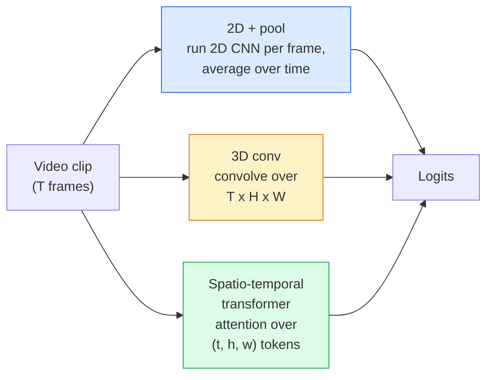

# الفيديو الفهم  نموذج مؤقت

> الفيديو هو تسلسل من الصور بالإضافة إلى الفيزياء التي تربطها. كل نموذج فيديو يعامل الوقت إما كمحور إضافي (3D conv) ، أو تسلسل للاستضافة (تحول) ، أو ميزة لاستخراج مرة واحدة ومجمله (2D + المجمله).

**Type:** Learn + Build
**Languages:** Python
**Prerequisites:** Phase 4 Lesson 03 (CNNs), Phase 4 Lesson 04 (Image Classification)
**Time:** ~45 minutes

## أهداف التعلم

- تمييز بين ثلاثة طرق نمذجة الفيديو الرئيسية (2D+pool، 3D conv، space-temporal transformer) وتنبؤ بالتنازلات بين تكلفة ودقة
- تنفيذ عينة الإطار، التجميع الزمني، وتصنيف خط أساسي 2D + المجم في PyTorch
- شرح لماذا تقوم الأجرام الثلاثية الأبعاد "المضخمة" في I3D بنقل جيد من وزنات ImageNet وما الذي يفعله المجموعة (2+1)
- اقرأ مجموعات بيانات ومقاييس التعرف على الإجراءات القياسية: Kinetics-400/600، UCF101, Something-Something V2; دقة 1 في مستوى المقطع والفيديو

## المشكلة

فيديو 30 ثانية عند 30 fps هو 900 صورة. بشكل ساذج، تصنيف الفيديو تصنيف الصورة يتم تشغيله 900 مرة تليها نوع من الجمع. هذا يعمل عندما يكون العمل مرئيًا في كل إطار تقريبًا (الرياضة والطهي ومقاطع الفيديو للتمرين) ويفشل بشكل سيء عندما يتم تعريف الإجراء بالحركة نفسها: "دفع شيء من اليسار إلى اليمين" يبدو مثل كائنات ثابتة في كل إطار.

السؤال الأساسي لكل معمارة فيديو هو: متى يتم نمذجة الهيكل الزمني، وكيف؟ الإجابة تدفع كل شيء آخر  حساب التكلفة، استراتيجية قبل التدريب، ما إذا كان يمكنك إعادة استخدام أوزان ImageNet، ما هي مجموعات البيانات التي يتدرب عليها النموذج.

هذه الدروس قصيرة عمداً من دروس الصورة الدقيقة. الآلة الأساسية للصورة موجودة بالفعل، وفهم الفيديو يتعلق في الغالب بالقصة الزمنية: أخذ العينات، والنمذجة، والجمع.

## المفهوم

### العائلات المعماريّة الثلاثة



### 2D + حوض السباحة

خذ CNN 2D (ResNet، EfficientNet، ViT). قم بتشغيله بشكل مستقل على كل إطار تم أخذ العينات. متوسط (أو أقصى استجمام، أو استجمام الاهتمام) التوابع لكل إطار. إعطاء المتجه المجمع إلى مصنف.

المزايا:
- تحويلات قبل التدريب مباشرة
- أسهل شيء لتنفيذها
- رخيص: إطارات T * تكلفة استنتاج صورة واحدة.

السلبيات:
- لا أستطيع أن أظهر الحركة، العمل = مجموع المظاهر
- التجميع المؤقت لا يتغير حسب النظام؛ "البواب المفتوح" و "البواب المغلق" تبدو نفسها.

متى تستخدم: مهام ذات مظهر ثقيل، ونقل التعلم على مجموعات بيانات فيديو صغيرة، خطوط أساسية أولية.

### التحولات الثلاثية الأبعاد

استبدل الأجزاء الثنائية الأبعاد (H، W) بأجزاء الثلاثية الأبعاد (T، H، W). تتدفق الشبكة عبر الفضاء والزمان. العائلة الأولى: C3D، I3D، SlowFast.

خدعة I3D: خذ نموذج ImageNet 2D مسبقًا ، "تضخم" كل جوهر 2D عن طريق نسخته على طول محور زمني جديد. يصبح محور 3x3 2D محور 3x3 3D. وهذا يعطي نموذج 3D أوزانًا قوية مسبقاً بدلاً من التدريب من الصفر.

المزايا:
- بشكل مباشر نموذج الحركة.
- التضخم I3D يعطي التعلم المجانى للتنقل

السلبيات:
- T/8 أكثر FLOPs من نظيره 2D (لجيّة الزمن من 3 مكبّأ 3 مرات).
- الأجزاء الزمنية صغيرة، الحركة طويلة المدى تحتاج إلى نهج الهرم أو التدفق المزدوج.

متى تستخدم: التعرف على العمل حيث الحركة هي الإشارة (شيء-شيء V2 ، السرعة مع فصول الحركة الثقيلة).

### محولات الفضاء-الوقت

إضافة الفيديو إلى شبكة من المزادات الفضائية-الوقتية وشاهدها في جميعها.

أنماط الاهتمام التي تهم:
- **Joint** واحد اهتمام كبير على (ت، ه، و). مربع في `T*H*W`؛ مكلفة.
- **Divided**اثنين من الانتباهات لكل كتلة: واحدة عبر الزمن، واحدة عبر الفضاء.
- **Factorised** الاهتمام بالوقت يتناوب مع الاهتمام بالمكان عبر الكتل.

المزايا:
- دقة SOTA على كل مقياس مقارن كبير.
- نقلات من محولات الصورة (ViT) عبر التضخم في المزيفات.
- يدعم الفيديو طويل السياق عبر الاهتمام النادر.

السلبيات:
- جشع الحاسوب
- يتطلب اختيار نمط الاهتمام بعناية أو بالونات

متى تستخدم: مجموعات بيانات كبيرة، فهم الفيديو عالي الوفاء، مهام الفيديو + النص متعددة الطرق.

### أخذ عينات الإطار

شريط 10 ثواني عند 30 صورة في الثانية = 300 إطار؛ إطعام كل 300 إلى أي نموذج هو مضيعة. الاستراتيجيات القياسية:

- **Uniform sampling**اختر إطارات T بالتساوي عبر المقطوعة
- **Dense sampling**نافذة T-إطار متواصلة عشوائية. شائعة للسيارات ثلاثية الأبعاد لأن الحركة تتطلب الإطار المجاور.
- **Multi-clip** عينة العديد من نوافذ T-إطار من نفس الفيديو، وتصنيف كل، المتوسط التنبؤات في وقت الاختبار.

عادةً ما تكون T 8، 16، 32 أو 64 T أعلى = إشارة زمنية أكثر عند الحساب.

### التقييم

مستويات:
- **Clip-level accuracy** النموذج يرى شريط واحد من إطار T، وتقرير top-k.
- **Video-level accuracy** متوسط توقعات مستوى المقطع عبر مقاطع متعددة لكل فيديو؛ أعلى وأكثر استقرارًا.

دائماً ما تقرر كليهما. النموذج الذي يحصل على 78٪ من المقطع / 82٪ من الفيديو يعتمد بشكل كبير على متوسط وقت الاختبار ؛ النموذج الذي يحصل على 80٪ / 81٪ هو أكثر قوة لكل مقطع.

### مجموعات البيانات التي ستقابلها

- **Kinetics-400 / 600 / 700** مجموعة بيانات العمل العامة. 400 ألف شريط؛ عناوين URL لـ YouTube (الكثير منها مات الآن).
- **Something-Something V2** أفعال محددة بالحركة ("تحريك X من اليسار إلى اليمين"). لا يمكن حلها بواسطة 2D + بول.
- **UCF-101**،**HMDB-51** أكبر سناً، أصغر، لا يزال يبلغ عن ذلك.
- **AVA** العمل *الوضع المحلي* في الفضاء والزمان؛ أصعب من التصنيف.

```figure
v4-video-temporal
```

## بناءها

### الخطوة الأولى: عينة الإطار

عينة موحدة و كثيفة تعمل على قائمة من الإطارات (أو تنزور الفيديو).

```python
import numpy as np

def sample_uniform(num_frames_total, T):
    if num_frames_total <= T:
        return list(range(num_frames_total)) + [num_frames_total - 1] * (T - num_frames_total)
    step = num_frames_total / T
    return [int(i * step) for i in range(T)]


def sample_dense(num_frames_total, T, rng=None):
    rng = rng or np.random.default_rng()
    if num_frames_total <= T:
        return list(range(num_frames_total)) + [num_frames_total - 1] * (T - num_frames_total)
    start = int(rng.integers(0, num_frames_total - T + 1))
    return list(range(start, start + T))
```

كلاهما يعود`T`مؤشرات تستخدمها لقطع الجهاز التنسوري الفيديو

### الخطوة الثانية: خط أساس 2D + المجموعة

إشغلي 2D ResNet-18 على كل إطار، ميزات المجموعة المتوسط، تصنيف.

```python
import torch
import torch.nn as nn
from torchvision.models import resnet18, ResNet18_Weights

class FramePool(nn.Module):
    def __init__(self, num_classes=400, pretrained=True):
        super().__init__()
        weights = ResNet18_Weights.IMAGENET1K_V1 if pretrained else None
        backbone = resnet18(weights=weights)
        self.features = nn.Sequential(*(list(backbone.children())[:-1]))  # global avg pool kept
        self.head = nn.Linear(512, num_classes)

    def forward(self, x):
        # x: (N, T, 3, H, W)
        N, T = x.shape[:2]
        x = x.view(N * T, *x.shape[2:])
        feats = self.features(x).view(N, T, -1)
        pooled = feats.mean(dim=1)
        return self.head(pooled)

model = FramePool(num_classes=10)
x = torch.randn(2, 8, 3, 224, 224)
print(f"output: {model(x).shape}")
print(f"params: {sum(p.numel() for p in model.parameters()):,}")
```

11 مليون مبرمج، ImageNet تدرب مسبقا، تعمل لكل إطار، متوسطات، تصنيف. هذا الخط الأساسي غالبا ما يكون ضمن 5-10 نقاط من النماذج الثلاثية الأبعاد المناسبة على المهام التي تعتبر ثقيلة في المظهر  أحيانا أفضل، لأنه يستخدم مرة أخرى العمود الفقري ImageNet أقوى.

### الخطوة الثالثة: صمام 3D مضخم على الطراز I3D

حول محفظة 2D واحدة إلى محفظة 3D من خلال تكرار الأوزان على طول محور وقت جديد.

```python
def inflate_2d_to_3d(conv2d, time_kernel=3):
    out_c, in_c, kh, kw = conv2d.weight.shape
    weight_3d = conv2d.weight.data.unsqueeze(2)  # (out, in, 1, kh, kw)
    weight_3d = weight_3d.repeat(1, 1, time_kernel, 1, 1) / time_kernel
    conv3d = nn.Conv3d(in_c, out_c, kernel_size=(time_kernel, kh, kw),
                        padding=(time_kernel // 2, conv2d.padding[0], conv2d.padding[1]),
                        stride=(1, conv2d.stride[0], conv2d.stride[1]),
                        bias=False)
    conv3d.weight.data = weight_3d
    return conv3d

conv2d = nn.Conv2d(3, 64, kernel_size=3, padding=1, bias=False)
conv3d = inflate_2d_to_3d(conv2d, time_kernel=3)
print(f"2D weight shape:  {tuple(conv2d.weight.shape)}")
print(f"3D weight shape:  {tuple(conv3d.weight.shape)}")
x = torch.randn(1, 3, 8, 56, 56)
print(f"3D output shape:  {tuple(conv3d(x).shape)}")
```

التقسيم من قبل`time_kernel`يحتفظ حجم التفعيل باستمرار تقريبًا  مهم لعدم كسر إحصائيات القاعدة في اللحظة الأولى.

### الخطوة الرابعة: مقياس (2+1)

تقسيم محفظة 3D إلى محفظة 2D (مكاني) و 1D (زمني) نفس الحقل الاستقبالي ، معايير أقل ، دقة أفضل على بعض المعايير.

```python
class Conv2Plus1D(nn.Module):
    def __init__(self, in_c, out_c, kernel_size=3):
        super().__init__()
        mid_c = (in_c * out_c * kernel_size * kernel_size * kernel_size) \
                // (in_c * kernel_size * kernel_size + out_c * kernel_size)
        self.spatial = nn.Conv3d(in_c, mid_c, kernel_size=(1, kernel_size, kernel_size),
                                 padding=(0, kernel_size // 2, kernel_size // 2), bias=False)
        self.bn = nn.BatchNorm3d(mid_c)
        self.act = nn.ReLU(inplace=True)
        self.temporal = nn.Conv3d(mid_c, out_c, kernel_size=(kernel_size, 1, 1),
                                  padding=(kernel_size // 2, 0, 0), bias=False)

    def forward(self, x):
        return self.temporal(self.act(self.bn(self.spatial(x))))

c = Conv2Plus1D(3, 64)
x = torch.randn(1, 3, 8, 56, 56)
print(f"(2+1)D output: {tuple(c(x).shape)}")
```

شبكة R(2+1)D كاملة هي نفس شبكة ResNet-18 مع كل 3x3 conv استبدالها `Conv2Plus1D`. . .

## استخدمها

توجد مكتبات فيديو تخطيطية:

- `torchvision.models.video` R(2+1) D، MViT، Swin3D مع وزن السرعة المسبقة. نفس API مثل نماذج الصورة.
- `pytorchvideo`(ميتا)  نموذج حديقة الحيوان، محملات البيانات للكيناتيكس / SSv2 / AVA، تحويلات قياسية.

لنماذج الفيديو في لغة الرؤية (مؤشر الفيديو، تحليل الفيديو) ، استخدم `transformers`(`VideoMAE`،`VideoLLaMA`،`InternVideo`)

## أرسله

هذا الدرس ينتج عن:

- `outputs/prompt-video-architecture-picker.md` عرض يختار محول 2D+pool / I3D / (2+1)D / محول بناء على المظهر مقابل الحركة وحجم مجموعة البيانات وميزانية الحساب.
- `outputs/skill-frame-sampler-auditor.md` مهارة تفتيش عينة خط الفيديو وتعريض الأخطاء الشائعة: مؤشر غير متكامل، أخذ العينات غير متساوية عندما `num_frames < T`، عدم وجود المحاصيل المحافظة على الجوانب ، إلخ.

## التمارين

1. **(Easy)**احسب FLOPs (تقريبي) لـ FramePool مع T=8 مقابل ResNet 3D على الطراز I3D مع T=8.
2. **(Medium)**إنشاء مجموعة بيانات فيديو اصطناعية: كرات عشوائية تتحرك في اتجاهات عشوائية، مدعومة بتوجيه الحركة ("من اليسار إلى اليمين"، "من اليمين إلى اليسار"، "القطعية إلى الأعلى"). قم بتدريب FramePool عليها. أظهر أنه يحقق دقة تقريبية، إثبات ظهور وحده غير كافٍ لمهام الحركة.
3. **(Hard)**بناء R(2+1) D-18 عن طريق استبدال كل Conv2d في ResNet-18 مع `Conv2Plus1D`. إضغط وزن أول محركات من جهاز ResNet 18 الذي تم تدريبه من قبل ImageNet.

## الشروط الرئيسية

| Term | What people say | What it actually means |
|------|----------------|----------------------|
| 2D + pool | "Per-frame classifier" | Run a 2D CNN on every sampled frame, average-pool features across time, classify |
| 3D convolution | "Spatio-temporal kernel" | Kernel that convolves over (T, H, W); can model motion natively |
| Inflation | "Lift 2D weights to 3D" | Initialise 3D conv weights by repeating a 2D conv's weights along the new time axis, then divide by kernel_T to preserve activation scale |
| (2+1)D | "Factorised conv" | Split 3D into 2D spatial + 1D temporal; fewer parameters, extra non-linearity between |
| Divided attention | "Time then space" | Transformer block with two attentions per layer: one over tokens at the same frame, one over tokens at the same position |
| Clip | "T-frame window" | A sampled subsequence of T frames; the unit a video model consumes |
| Clip vs video accuracy | "Two eval settings" | Clip = one sample per video, video = average across multiple sampled clips |
| Kinetics | "The ImageNet of video" | 400-700 action classes, 300k+ YouTube clips, the standard video pretraining corpus |

## المزيد من القراءة

- [I3D: Quo Vadis, Action Recognition (Carreira & Zisserman, 2017)](https://arxiv.org/abs/1705.07750) يقدم التضخم ومجموعة بيانات كيناتيكس
- [R(2+1)D: A Closer Look at Spatiotemporal Convolutions (Tran et al., 2018)](https://arxiv.org/abs/1711.11248) التخميسات المفصلة، لا تزال خطة أساسية قوية
- [TimeSformer: Is Space-Time Attention All You Need? (Bertasius et al., 2021)](https://arxiv.org/abs/2102.05095)أول محول فيديو قوي
- [VideoMAE (Tong et al., 2022)](https://arxiv.org/abs/2203.12602) التدريب المسبق للفيديو
