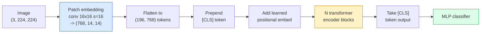

# تحويلات الرؤية (ViT)

> قطع الصورة إلى ملصقات، تعامل كل ملصقة ككلمة، تشغيل محول قياسي. لا تنظر للخلف.

**Type:** Build
**Languages:** Python
**Prerequisites:** Phase 7 Lesson 02 (Self-Attention), Phase 4 Lesson 04 (Image Classification)
**Time:** ~45 minutes

## أهداف التعلم

- تنفيذ إضافة المفاتيح ، والتطبيقات الموضعية المتعلمة ، والرمز الطبقي ، وكمات مبرمجة المحول من الصفر لبناء ViT الحد الأدنى
- شرح لماذا كان يعتقد أن في تي بحاجة إلى بيانات ضخمة قبل التدريب حتى أثبت دي تي و MAE خلاف ذلك
- مقارنة ViT، Swin، و ConvNeXt على ما سبق معمارياتهم (لا، انتباه النافذة المحلية، الخلية المكونة)
- ضبط ViT المسبق للتدريب على مجموعة بيانات صغيرة باستخدام `timm`و وصفة الصفحة الخالصة القياسية

## المشكلة

لمدة عقد ، كان التحول مترادفًا لرؤية الكمبيوتر. كان لدى سي إن إن تحيزات استناداوية قوية  المحلية ، وتساوي الترجمة  لا أحد يعتقد أنه يمكن استبدالها. ثم أظهر دوسويتسكي وآخرون (2020) أن محول بسيط يتم تطبيقه على مسطحات الصورة المسطحة ، دون أي آلية تغيير على الإطلاق ، يمكن أن يطابق أو يفوز بأفضل سي إن إن على نطاق واسع.

لقد كان الصيد "في نطاق واسع" فقدت (في تي) على (إيمجنيت-1ك) من (ريستنيت). ويت تدرب على ImageNet-21k أو JFT-300M ثم تحسن على ImageNet-1k ضرب ذلك. النتيجة كانت أن المحولات لم تكن لديها سابقات مفيدة لكنها يمكن أن تتعلمها من بيانات كافية. أظهرت الدراسات اللاحقة (DeiT، MAE، DINO) أن مع وصفات التدريب الصحيحة  زيادة قوية، الإشراف على الذات قبل التدريب، التقطير  تدريب الفيتات على البيانات الصغيرة أيضا.

بحلول عام 2026 ، لا تزال سي إن إنات نقية تنافسية على أجهزة الحافة (كونفنيكت هي أقوى) ، ولكن المحولات تهيمن على كل شيء آخر: التقسيم (ماسك2فورمر ، سيغفورمر) ، الكشف (ديتير ، آر تي-ديتير) ، المليمولدا (كليب ، سيجليب) ، الفيديو (فيديوما إي ، فيجي إي بي إي). بنية كتلة فييت هي التي يجب معرفتها.

## المفهوم

### خط الأنابيب



سبع خطوات. معطيات -> رموز -> انتباه -> تصنيف. كل فاريج (DeiT ، Swin ، ConvNeXt ، MAE قبل التدريب) يغير واحد أو اثنين من السبع ويترك الباقي وحده.

### إضافة المفاتيح

أول مخزن هو السر. حجم الأساس 16، خطوة 16، لذلك تصميم 224x224 يصبح شبكة 14x14 من 16x16 المقطوعات، كل منها مدروسة إلى 768-dim تضمين. هذا مخزن واحد كل من المقطوعات وتقديم مشروعات خطية.

```
Input:  (3, 224, 224)
Conv (3 -> 768, k=16, s=16, no padding):
Output: (768, 14, 14)
Flatten spatial: (196, 768)
```

196 معدل = 196 رمزا. طول ميزة كل رمزا هو 768 (ViT-B) ، 1024 (ViT-L) ، أو 1280 (ViT-H).

### رمز الفئة

متجه واحد تعلمت قبل التسلسل:

```
tokens = [CLS; patch_1; patch_2; ...; patch_196]   shape (197, 768)
```

بعد N كتلة المحول،`[CLS]`النتائج هي تمثيل الصورة العالمي. رأس التصنيف يقرأ فقط هذا المتجه واحد.

### إضافة موضعية

المحولات لا تملك فكرة متكاملة للموقع الفضائي إضافة متجه تعلم لكل رمز:

```
tokens = tokens + learned_pos_embedding   (also shape (197, 768))
```

إن الإدراج هو مبرمير للنموذج؛ يتكيف التدريب القائم على التدرج مع هيكل الصورة 2D. توجد بدائل 2D سينوسويدية ولكن نادرا ما تستخدم في الممارسة.

### حجر مُشفّر المحول

القياسية، الاهتمام الذاتي متعدد الرؤوس، MLP، وصلات بقايا، قبل الطبقة.

```
x = x + MSA(LN(x))
x = x + MLP(LN(x))

MLP is two-layer with GELU: Linear(d -> 4d) -> GELU -> Linear(4d -> d)
```

تعدد ViT-B/16 12 من هذه الكتل، كل منها 12 رأسًا للاهتمام، وبلغ إجماليها 86 مليون ملامح.

### لماذا قبل الـ LN

المحولات المبكرة المستخدمة بعد LN (`x = LN(x + sublayer(x))`وواجهت صعوبة في التدريب بعد 6-8 طبقات دون تدفئة.`x = x + sublayer(LN(x))`يستخدم كل برنامج فييت وكل برنامج دراسية حديثة قبل الـ LN.

### التنازل عن حجم اللصوص

- 16×16 اللقطات -> 196 رمزا، قياسية.
- 32x32 تصفيات -> 49 رموز، أسرع ولكن أقل قرار.
- 8×8 اللقطات -> 784 رموز، دقيقة ولكن O n^2) التكلفة الاهتمام مقياس سيئة.

المساحات الأكبر = أقل رموز = أسرع ولكن أقل تفاصيل فضائية. SwinV2 يستخدم مساحات 4x4 في النوافذ الهرمية.

### وصفة DeiT لتدريب ViT على ImageNet-1k

احتجت شركة ViT الأصلية JFT-300M لتغلب على قناة CNN. تدرب DeiT (Touvron et al., 2020) ViT-B إلى 81.8% من أول مستوى على ImageNet-1k وحدها مع أربع تغييرات:

1. التكثيف الثقيل: التكثيف العشوائي، الاختلاط، القطع المختلط، التمرير العشوائي.
2. عمق استوكاستيك (سقط كتلة كاملة عشوائيا أثناء التدريب).
3. التكبير المتكرر (مختبر نفس الصورة 3 مرات في كل دفعة).
4. التقطير من معلم سي إن إن (اختياري، يزيد من الدقة).

كل وصفة تدريبية حديثة من "ديي تي"

### سوين مقابل كونفنيكس

- **Swin**(Liu et al., 2021)  الاهتمام القائم على النافذة. كل كتلة تلتقي ضمن نافذة محلية؛ وتحول كتلة متناوبة النافذة لمزيج المعلومات عبر النافذة. يعيد موقعًا يشبه CNN إلى ما قبل مع الحفاظ على عامل الاهتمام.
- **ConvNeXt**(Liu et al., 2022)  أعيد تصميم CNN التي تطابق اختيارات معمارية سوين (Convs عميقة، LayerNorm، GELU، عكس عنق الزجاجة). أظهر أن الفجوة ليست "الاهتمام مقابل التحول" ولكن "وصفة التدريب الحديثة + العمارة".

في عام 2026، كونفنيكت-ف2 و سوين-ف2 هما كلاهما من نوع الإنتاج؛ والخيار الصحيح يعتمد على كومة استنتاجك (كونفنيكت يجمع أفضل للجوار) والجسم قبل التدريب.

### التدريب المسبق

المُخترع الآلي المُغطى (He et al., 2022): قُم بتغطية 75% من المُصَلِّحات عشوائية، تدرب المُخترع لمعالجة 25% المرئية فقط، تدرب مُخترع صغير لإعادة بناء المُصَلِّحات المُغطية من خروج المُخترع. بعد التدريب المسبق، فلتخلص من المُخترع وتحسن المُخترع.

MAE يجعل ViT قابل للتدريب على ImageNet-1k وحدها، يضرب SOTA، وهو الوصفة القابلة للتدقيق الذاتي.

```figure
batchnorm-inference
```

## بناءها

### الخطوة الأولى: إضافة الملفات

```python
import torch
import torch.nn as nn

class PatchEmbedding(nn.Module):
    def __init__(self, in_channels=3, patch_size=16, dim=192, image_size=64):
        super().__init__()
        assert image_size % patch_size == 0
        self.proj = nn.Conv2d(in_channels, dim, kernel_size=patch_size, stride=patch_size)
        num_patches = (image_size // patch_size) ** 2
        self.num_patches = num_patches

    def forward(self, x):
        x = self.proj(x)
        return x.flatten(2).transpose(1, 2)
```

واحد من التجميع، واحد من السطح، واحد من الترجمة. هذا هو خطوة الصورة إلى الرموز بأكملها.

### الخطوة الثانية: حلقة تحويل

قبل الـ (إل إن) ، الاهتمام الذاتي متعدد الرؤوس، (م.إل.بي) مع (جي.إل.يو) ، الاتصالات المتبقية

```python
class Block(nn.Module):
    def __init__(self, dim, num_heads, mlp_ratio=4, dropout=0.0):
        super().__init__()
        self.ln1 = nn.LayerNorm(dim)
        self.attn = nn.MultiheadAttention(dim, num_heads, dropout=dropout, batch_first=True)
        self.ln2 = nn.LayerNorm(dim)
        self.mlp = nn.Sequential(
            nn.Linear(dim, dim * mlp_ratio),
            nn.GELU(),
            nn.Dropout(dropout),
            nn.Linear(dim * mlp_ratio, dim),
            nn.Dropout(dropout),
        )

    def forward(self, x):
        a, _ = self.attn(self.ln1(x), self.ln1(x), self.ln1(x), need_weights=False)
        x = x + a
        x = x + self.mlp(self.ln2(x))
        return x
```

`nn.MultiheadAttention`يدير الانقسام إلى رؤوس، ومنتج النقطة المتوسطة، والتنبؤ المخرج. `batch_first=True`لذا الأشكال هي`(N, seq, dim)`. . .

### الخطوة الثالثة:

```python
class ViT(nn.Module):
    def __init__(self, image_size=64, patch_size=16, in_channels=3,
                 num_classes=10, dim=192, depth=6, num_heads=3, mlp_ratio=4):
        super().__init__()
        self.patch = PatchEmbedding(in_channels, patch_size, dim, image_size)
        num_patches = self.patch.num_patches
        self.cls_token = nn.Parameter(torch.zeros(1, 1, dim))
        self.pos_embed = nn.Parameter(torch.zeros(1, num_patches + 1, dim))
        self.blocks = nn.ModuleList([
            Block(dim, num_heads, mlp_ratio) for _ in range(depth)
        ])
        self.ln = nn.LayerNorm(dim)
        self.head = nn.Linear(dim, num_classes)
        nn.init.trunc_normal_(self.pos_embed, std=0.02)
        nn.init.trunc_normal_(self.cls_token, std=0.02)

    def forward(self, x):
        x = self.patch(x)
        cls = self.cls_token.expand(x.size(0), -1, -1)
        x = torch.cat([cls, x], dim=1)
        x = x + self.pos_embed
        for blk in self.blocks:
            x = blk(x)
        x = self.ln(x[:, 0])
        return self.head(x)

vit = ViT(image_size=64, patch_size=16, num_classes=10, dim=192, depth=6, num_heads=3)
x = torch.randn(2, 3, 64, 64)
print(f"output: {vit(x).shape}")
print(f"params: {sum(p.numel() for p in vit.parameters()):,}")
```

حوالي 2.8M المعلمات  ViT صغير قابل للتعامل على CPU. ViT-B الحقيقي هو 86M؛ نفس تعريف الفئة مع `dim=768, depth=12, num_heads=12`. . .

### الخطوة الرابعة: التحقق من الصحة العقلية  استنتاج صورة واحدة

```python
logits = vit(torch.randn(1, 3, 64, 64))
print(f"logits: {logits}")
print(f"probs:  {logits.softmax(-1)}")
```

يجب أن تعمل دون خطأ.

## استخدمها

`timm`يُرسل كل نوع من طرازات "في تي" مع أوزان "إيمج نت" المُتدربة مسبقاً

```python
import timm

model = timm.create_model("vit_base_patch16_224", pretrained=True, num_classes=10)
```

`timm`هو افتراض الإنتاج لتحولات الرؤية في عام 2026. يدعم ViT ، DeiT ، Swin ، Swin-V2 ، ConvNeXt ، ConvNeXt-V2 ، MaxViT ، MViT ، EfficientFormer ، وعشرات أخرى تحت نفس API.

للعمل المتعدد الطرق (الصورة + النص) ، `transformers`سفن CLIP، SigLIP، BLIP-2، LLaVA. رمز الصورة في كل هذه هي فاريان ViT.

## أرسله

هذا الدرس ينتج عن:

- `outputs/prompt-vit-vs-cnn-picker.md` طلب يختار بين ViT، ConvNeXt، أو Swin بناء على حجم مجموعة البيانات، الحساب، والإستنتاج.
- `outputs/skill-vit-patch-and-pos-embed-inspector.md` مهارة تثبت أن تشكيلات إدخال اللمسات الخاصة بـ ViT وتشكيلات إدخال المواقع تتطابق مع طول التسلسل المتوقع للنموذج ، وتصطياد أخطاء التنسيق الأكثر شيوعاً.

## التمارين

1. **(Easy)**طبع شكل كل مؤشر متوسط لتمرير إلى الأمام من خلال ViT الصغيرة أعلاه. تأكيد: المدخل `(N, 3, 64, 64)`-> المزقات`(N, 16, 192)`-> مع CLS `(N, 17, 192)`-> إدخال المصنف `(N, 192)`-> الخروج `(N, num_classes)`. . .
2. **(Medium)**- أجهزوا جيداً`timm`ViT-S/16 على مجموعة بيانات CIFAR الاصطناعية من الدروس 4. مقارنة مع تحسينات ResNet-18 على نفس البيانات. تقرير وقت التدريب والدقة النهائية.
3. **(Hard)**تنفيذ تدريب MAE قبل التدريب على ViT الصغيرة: غط 75% من المفاتيح ، تدريب المُشفّر + مُشفّر صغير لإعادة بناء المفاتيح المُغطّاة. تقييم دقة الصوتية على البيانات الاصطناعية قبل وبعد التدريب.

## الشروط الرئيسية

| Term | What people say | What it actually means |
|------|----------------|----------------------|
| Patch embedding | "The first conv" | A conv with kernel size = stride = patch size; turns the image into a grid of token embeddings |
| Class token | "[CLS]" | A learned vector prepended to the token sequence; its final output is the global image representation |
| Positional embedding | "Learned pos" | A learned vector added to every token so the transformer knows where each patch came from |
| Pre-LN | "LayerNorm before sublayer" | The stable transformer variant: `x + sublayer(LN(x))` instead of `LN(x + sublayer(x))` |
| Multi-head attention | "Parallel attention" | Standard transformer attention split into num_heads independent subspaces, concatenated afterwards |
| ViT-B/16 | "Base, patch 16" | The canonical size: dim=768, depth=12, heads=12, patch_size=16, image=224; ~86M params |
| DeiT | "Data-efficient ViT" | ViT trained on ImageNet-1k alone with strong augmentation; proved large pretraining datasets are not strictly required |
| MAE | "Masked autoencoder" | Self-supervised pretraining: mask 75% of patches, reconstruct; the dominant ViT pretraining recipe |

## المزيد من القراءة

- [An Image is Worth 16x16 Words (Dosovitskiy et al., 2020)](https://arxiv.org/abs/2010.11929) ورقة ViT
- [DeiT: Data-efficient Image Transformers (Touvron et al., 2020)](https://arxiv.org/abs/2012.12877) كيفية تدريب ViT على ImageNet-1k وحدها
- [Masked Autoencoders are Scalable Vision Learners (He et al., 2022)](https://arxiv.org/abs/2111.06377) التدريب المسبق
- [timm documentation](https://huggingface.co/docs/timm) الإشارة لكل محول للرؤية الذي ستستخدم في الإنتاج
