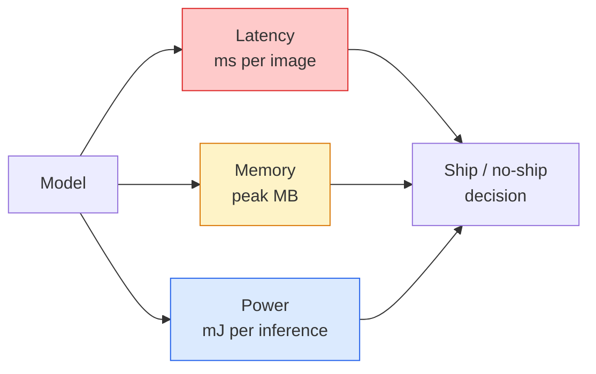

# رؤية في الوقت الحقيقي  نشر الحافة

> استنتاج الحافة هو تخصص الحصول على نموذج 90 دقيقة ليتم تشغيله بسرعة 30 fps على جهاز لديه 2 جيجابايت من ذاكرة الوصول الذكي. يتم تداول كل نقطة مئوية من الدقة مقابل ملثنيات من التأخير.

**Type:** Learn + Build
**Languages:** Python
**Prerequisites:** Phase 4 Lesson 04 (Image Classification), Phase 10 Lesson 11 (Quantization)
**Time:** ~75 minutes

## أهداف التعلم

- قياس تأخير الإستنتاجات، الذكرى الذروة، والمدخل لأي نموذج PyTorch، وقراءة FLOPs / Params / تأخير التداول
- قم بتقييم نموذج الرؤية إلى INT8 باستخدام كمية PyTorch بعد التدريب وتحقق من فقدان الدقة < 1٪
- تصدير إلى ONNX وترتيب مع ONNX Runtime أو TensorRT؛ أسمائ ثلاثة أخطاء التصدير الأكثر شيوعا وتصحيحاتها
- شرح متى يجب اختيار MobileNetV3، EfficientNet-Lite، ConvNeXt-Tiny، أو MobileViT لقيود الحافة

## المشكلة

نموذج رؤية في وقت التدريب هو وحش نقطة عائمة. 100 مليون ملاميتر، 10 GFLOPs لكل مرور إلى الأمام، 2 جيجابايت من VRAM. لا شيء من ذلك يناسب هاتف، وحدة إعلامية السعة في السيارة، وكاميرا صناعية، أو طائرة بدون طيار. شحن نظام رؤية يعني تكييف التنبؤات نفسها في ميزانية أقل من 100 مرة.

تقوم ثلاث أزرار معظم العمل: اختيار النموذج (معمارة أصغر بنفس الوصفة) ، والكمية (INT8 بدلا من FP32) ، وزمنية تشغيل الاستنتاج (ONNX Runtime ، TensorRT ، Core ML ، TFLite). الحصول على الحق هو الفرق بين عرض تجريبي يعمل على محطة عمل ومنتج يتم شحن عليه على شكل كاميرا بقيمة 30 دولار.

هذه الدروس تعيين الانضباط القياس أولا (لا يمكنك تحسين ما لا يمكنك قياسه) ، ثم يمشي على الأزرار الثلاثة. الهدف ليس تعلم كل حافة تشغيل الوقت ولكن لمعرفة ما هي الرافعات الموجودة وكيفية التحقق من كل واحد يفعل ما تعتقد.

## المفهوم

### الميزانيات الثلاثة



- **Latency**: p50، p95، p99، متوسط p50 فقط يخفي سلوك الذيل الذي يهم للأنظمة في الوقت الحقيقي.
- **Peak memory**: أقصى ما يراه الجهاز، وليس متوسط حالة ثابتة.
- **Power / energy**: مليليوجول لكل استنتاج على جهاز يعمل بطارية. غالباً ما يتم استغلالها بواسطة وقت استخدام CPU/GPU *.

جدول (النموذج، التأخير، الذاكرة، الدقة) هو ما يتم اتخاذ قرار الحافة من. يتم قياس كل خلية على الجهاز المستهدف، وليس محطة العمل.

### تأديب القياس

ثلاثة قواعد يجب أن تتبعها كل ملف حافة:

1. **Warm up**النموذج مع 5-10 مرّات مخففة إلى الأمام قبل قياس. الكاشوف الباردة وتجميع JIT تنتج أرقام أولية غير ممثلة.
2. **Synchronise**عبء عمل GPU مع `torch.cuda.synchronize()`قبل وبعد الكتلة المحددة بالتوقيت. بدون هذا تقيس إرسال النواة، وليس تنفيذ النواة.
3. **Fix input sizes**التأخير على 224 × 224 ليس التأخير على 512 × 512.

### الـ "FLOPs" كوكيل

FLOPs (عمليات نقطة عائمة حسب الاستنتاج) هو وكيل رخيصة ، مستقلة عن الجهاز للمقارنة مع الهندسة المعمارية ، مفيدة كمقارنة حائطية مطلقة. يمكن أن يكون نموذجًا لديه 10٪ من FLOPs أسرع مرتين في الممارسة لأنه يستخدم عمليات صديقة للأجهزة (التجمعات العميقة تقوم بتجميع جيد ، والتصالات الكبيرة 7x7 لا تفعل ذلك).

القاعدة: استخدام FLOPs للبحث عن الهندسة المعمارية، استخدام تأخر على الجهاز لقرارات التنفيذ.

### الكمية في فقرة واحدة

استبدل وزنات FP32 وتفعيلاتها بـ INT8. انخفض حجم النموذج 4x، انخفض عرض النطاق النطاق 4x، انخفض الحساب 2-4x على الأجهزة التي لديها نواة INT8 (كل SoC المحمول الحديث، كل GPU NVIDIA مع أجزاء تنسور). فقدان الدقة في مهام الرؤية عادة 0.1-1 نقاط مئوية مع الكمية ثابتة بعد التدريب.

الأنواع:

- **Dynamic** الوزن الكم إلى INT8، تنشيطات محاسبة في FP. سهلة، تسريع صغيرة.
- **Static (post-training)** الوزن الكم + نطاق تنشيط التصفية على مجموعة تصويب صغيرة. أسرع بكثير من الديناميكية.
- **Quantisation-aware training (QAT)** محاكاة الكمية أثناء التدريب حتى يتعلم النموذج حولها.

بالنسبة للرؤية، فإن الكمية الدقيقة بعد التدريب توفر 95٪ من الفائدة مع 5٪ من الجهد. استخدم QAT فقط عندما يكون فقدان الدقة من PTQ غير مقبول.

### الحصص والنزيف

- **Pruning** إزالة الأوزان غير المهمة (بناء على الكبيرة) أو القنوات (مهيكلة). يعمل بشكل جيد على النماذج المفرطة المعايير؛ أقل فائدة على الهندسة المعمارية المتكاملة بالفعل.
- **Distillation** تدريب الطالب الصغير على تقليد منطقات المعلم الكبير. غالبًا ما يسترد معظم دقة المفقودة عن طريق تقليص النموذج. معيار لنماذج الحافة الإنتاجية.

### توقيت التخلص

- **PyTorch eager** بطيئة، لا تستخدم للتنفيذ فقط
- **TorchScript** إرث.`torch.compile`و صادرات ONNX
- **ONNX Runtime**الوقت المباشر المحايد، CPU، CUDA، CoreML، TensorRT، OpenVINO كل لديهم مزودي ONNX. ابدأ هنا.
- **TensorRT** محفز NVIDIA. أفضل تأخير على GPUs NVIDIA (محطة عمل وجيتسون). يدمج مع ONNX Runtime أو مستقل.
- **Core ML** وقت تشغيل أبل لـ iOS/macOS. احتياجات `.mlmodel`أو`.mlpackage`. . .
- **TFLite** وقت تشغيل جوجل لـ Android/ARM. احتياجات `.tflite`. . .
- **OpenVINO** وقت تشغيل إنتل لـ CPU/VPU. احتياجات `.xml`+ `.bin`. . .

في الممارسة العملية: تصدير PyTorch -> ONNX -> اختيار وقت تشغيل الهدف. ONNX هي اللغة الفرنسية.

### محركات تحديد المعماريات

| Budget | Model | Why |
|--------|-------|-----|
| < 3M params | MobileNetV3-Small | Compiles everywhere, good baseline |
| 3-10M | EfficientNet-Lite-B0 | Best accuracy per param on TFLite |
| 10-20M | ConvNeXt-Tiny | Best accuracy-per-param, CPU-friendly |
| 20-30M | MobileViT-S or EfficientViT | Transformer with ImageNet accuracy |
| 30-80M | Swin-V2-Tiny | If stack supports window attention |

قم بتحديد كل هذه إلى INT8 ما لم يكن لديك سبب محدد لعدم القيام بذلك.

```figure
cnn-param-count
```

## بناءها

### الخطوة 1: قياس التأخير بشكل صحيح

```python
import time
import torch

def measure_latency(model, input_shape, device="cpu", warmup=10, iters=50):
    model = model.to(device).eval()
    x = torch.randn(input_shape, device=device)
    with torch.no_grad():
        for _ in range(warmup):
            model(x)
        if device == "cuda":
            torch.cuda.synchronize()
        times = []
        for _ in range(iters):
            if device == "cuda":
                torch.cuda.synchronize()
            t0 = time.perf_counter()
            model(x)
            if device == "cuda":
                torch.cuda.synchronize()
            times.append((time.perf_counter() - t0) * 1000)
    times.sort()
    return {
        "p50_ms": times[len(times) // 2],
        "p95_ms": times[int(len(times) * 0.95)],
        "p99_ms": times[int(len(times) * 0.99)],
        "mean_ms": sum(times) / len(times),
    }
```

إثارة، التزامن، الاستخدام`time.perf_counter()`-أبلغ عن النسب، وليس فقط السوء

### الخطوة الثانية: حسابات المعلمات و FLOP

```python
def parameter_count(model):
    return sum(p.numel() for p in model.parameters())

def flops_estimate(model, input_shape):
    """
    Rough FLOP count for a conv/linear-only model. For production use `fvcore` or `ptflops`.
    """
    total = 0
    def conv_hook(m, inp, out):
        nonlocal total
        c_out, c_in, kh, kw = m.weight.shape
        h, w = out.shape[-2:]
        total += 2 * c_in * c_out * kh * kw * h * w
    def linear_hook(m, inp, out):
        nonlocal total
        total += 2 * m.in_features * m.out_features
    hooks = []
    for m in model.modules():
        if isinstance(m, torch.nn.Conv2d):
            hooks.append(m.register_forward_hook(conv_hook))
        elif isinstance(m, torch.nn.Linear):
            hooks.append(m.register_forward_hook(linear_hook))
    model.eval()
    with torch.no_grad():
        model(torch.randn(input_shape))
    for h in hooks:
        h.remove()
    return total
```

للاستخدام في المشاريع الحقيقية`fvcore.nn.FlopCountAnalysis`أو`ptflops`؛ يتعاملون مع كل نوع من وحدات الدواء بشكل صحيح.

### الخطوة الثالثة: الكمية الدقيقة بعد التدريب

```python
def quantise_ptq(model, calibration_loader, backend="x86"):
    import torch.ao.quantization as tq
    model = model.eval().cpu()
    model.qconfig = tq.get_default_qconfig(backend)
    tq.prepare(model, inplace=True)
    with torch.no_grad():
        for x, _ in calibration_loader:
            model(x)
    tq.convert(model, inplace=True)
    return model
```

ثلاث خطوات: تكوين، وإعداد (إدراج المراقبين) ، وتصفية مع البيانات الحقيقية، وتحويل (التضخم + الكمية).`Conv -> BN -> ReLU`-> `ConvBnReLU`) الذي`torch.ao.quantization.fuse_modules`اليدين

### الخطوة الرابعة: تصدير إلى ONNX

```python
def export_onnx(model, sample_input, path="model.onnx"):
    model = model.eval()
    torch.onnx.export(
        model,
        sample_input,
        path,
        input_names=["input"],
        output_names=["output"],
        dynamic_axes={"input": {0: "batch"}, "output": {0: "batch"}},
        opset_version=17,
    )
    return path
```

`opset_version=17`هو الاختلالات الآمنة في عام 2026`dynamic_axes`يسمح لك بتشغيل نموذج ONNX مع حجم اللحظة التعسفي.

### الخطوة 5: قم بتحديد النظم ومقارنتها

```python
import torch.nn as nn
from torchvision.models import mobilenet_v3_small

def compare_regimes():
    model = mobilenet_v3_small(weights=None, num_classes=10)
    params = parameter_count(model)
    flops = flops_estimate(model, (1, 3, 224, 224))
    lat_fp32 = measure_latency(model, (1, 3, 224, 224), device="cpu")
    print(f"FP32 MobileNetV3-Small: {params:,} params  {flops/1e9:.2f} GFLOPs  "
          f"p50={lat_fp32['p50_ms']:.2f}ms  p95={lat_fp32['p95_ms']:.2f}ms")
```

إشغال نفس الوظيفة`resnet50`،`efficientnet_v2_s`و`convnext_tiny`ولديك جدول المقارنة الذي تحتاجه لقرار نشر.

## استخدمها

تتقارب كومات الإنتاج على أحد ثلاثة مسارات:

- **Web / serverless**: PyTorch -> ONNX -> ONNX Runtime (مدونة CPU أو CUDA). أسهل، جيد بما فيه الكفاية بالنسبة لمعظم.
- **NVIDIA edge (Jetson, GPU server)**: PyTorch -> ONNX -> TensorRT. أفضل تأخير، أكبر جهد هندسي.
- **Mobile**: PyTorch -> ONNX -> Core ML (iOS) أو TFLite (Android).

للقياس`torch-tb-profiler`،`nvprof`- لا ، لا`nsys`و الأدوات على macOS تعطى تفكيكات طبقة بعد طبقة. `benchmark_app`(OpenVINO) و `trtexec`(تنسور آر تي) أعطوا أرقام CLI مستقلة.

## أرسله

هذا الدرس ينتج عن:

- `outputs/prompt-edge-deployment-planner.md` استشارة تحدد العمود الفقري، استراتيجية الكمية، وقتا تشغيل مع إعطاء جهاز الهدف و SLA التأخير.
- `outputs/skill-latency-profiler.md` مهارة تكتب نصًا كاملًا للتقييمات التأخيرية مع تسخين التزامنا والرسومات وتتبع الذاكرة.

## التمارين

1. **(Easy)**قياس p50 تأخير ل `resnet18`،`mobilenet_v3_small`،`efficientnet_v2_s`و`convnext_tiny`في 224 × 224 على CPU. إبلغ عن الجدول وتحديد أي الهندسة المعمارية لديها أفضل دقة في كل أجزاء.
2. **(Medium)**تطبيق الكميات الدقيقة بعد التدريب على `mobilenet_v3_small`. إبلاغ عن فقدان تأخر FP32 مقابل INT8 ودقة على مجموعة فرعية من CIFAR-10 أو ما شابه ذلك.
3. **(Hard)**الصادرات`convnext_tiny`إلى ONNX، إشغله`onnxruntime`مع`CPUExecutionProvider`و قم بتقارن التأخير مع خط أساس PyTorch الإهتمام. حدد الطبقة الأولى حيث ONNX Runtime أسرع و اشرح لماذا.

## الشروط الرئيسية

| Term | What people say | What it actually means |
|------|----------------|----------------------|
| Latency | "How fast" | Time from input to output; p50/p95/p99 percentiles, not mean |
| FLOPs | "Model size" | Floating-point ops per forward pass; rough proxy for compute cost |
| INT8 quantisation | "8-bit" | Replace FP32 weights/activations with 8-bit integers; ~4x smaller, 2-4x faster |
| PTQ | "Post-training quantisation" | Quantise a trained model without retraining; easy, usually enough |
| QAT | "Quantisation-aware training" | Simulate quantisation during training; best accuracy, requires labelled data |
| ONNX | "The neutral format" | Model exchange format supported by every mainstream inference runtime |
| TensorRT | "NVIDIA compiler" | Compiles ONNX into an optimised engine for NVIDIA GPUs |
| Distillation | "Teacher -> student" | Train a small model to mimic a big model's logits; recovers most lost accuracy |

## المزيد من القراءة

- [EfficientNet (Tan & Le, 2019)](https://arxiv.org/abs/1905.11946) التوسع المركب لهياكل معمارية فعالة
- [MobileNetV3 (Howard et al., 2019)](https://arxiv.org/abs/1905.02244) الهندسة المعمارية المتنقلة أولاً مع h-swish و squeeze-excite
- [A Practical Guide to TensorRT Optimization (NVIDIA)](https://developer.nvidia.com/blog/accelerating-model-inference-with-tensorrt-tips-and-best-practices-for-pytorch-users/) كيفية الحصول على أرقام التدفق في الورقة
- [ONNX Runtime docs](https://onnxruntime.ai/docs/) تعريف المعدلات، تحسين الرسم البياني، اختيار المقدمين
