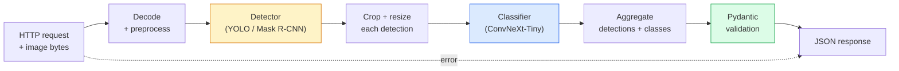

# بناء خط أنابيب رؤية كاملة  كابستون

> نظام رؤية الإنتاج هو سلسلة من النماذج والقواعد التي تم اختراقه بعقود البيانات.

**Type:** Build
**Languages:** Python
**Prerequisites:** Phase 4 Lessons 01-15
**Time:** ~120 minutes

## أهداف التعلم

- تصميم خط أنابيب رؤية الإنتاج التي تكتشف الأشياء وتصنفها وتصدر JSON مهيكلة  مع كل مسار فشل يتم التعامل معه
- توصيل جهاز كشف (Mask R-CNN أو YOLO) ، وصف (ConvNeXt-Tiny) ، وعقد البيانات (Pydantic) إلى خدمة واحدة
- قم بتحديد خط الأنابيب من نهاية إلى نهاية وتحديد العنق الزجاجة الأولى (عادةً معالجة مسبقة، ثم الكاشف)
- إرسال خدمة FastAPI الحد الأدنى التي تقبل تحميل الصور وتشغيل خط الأنابيب وتعطي الكشفات مع التصنيفات

## المشكلة

نموذج الرؤية الفردية مفيدة؛ منتجات الرؤية هي سلسلة منها. مراجعة رف التجزئة هي كاشف مزيد من تصنيف المنتج مزيد من خط أنابيب OCR السعر. القيادة الذاتية هي كاشف 2D مزيد من كاشف 3D مزيد من قطعة مزيد من متابعة مزيد من خطط.

إن توصيل هذه السلاسل هو الجزء الذي يفصل نموذج ML عن منتج. كل واجهة بين النماذج هي مكان جديد للخطأ. كل تحويل منسجم، كل قياس، كل تحويل حجم القناع هو مرشح لفشل صامت. خط أنابيب قوي بقدر ضعف واجهته.

هذه الحجر النهائي يضع الحد الأدنى من خط الأنابيب القابلة للتطبيق: الكشف + التصنيف + الخروج المهيكلي + طبقة الخدمة. كل شيء آخر في الفتحات في المرحلة 4 في هذا العظم: تبادل Mask R-CNN لYOLOv8, إضافة رأس OCR, إضافة فرع التقسيم, إضافة متابعة. الهندسة المعمارية مستقرة؛ قطع قابلة للتشبيك.

## المفهوم

### خط الأنابيب



سبعة مراحل. المرحلتين النموذجية مكلفة؛ الخمسة الأخرى هي حيث يعيش الحشرات.

### عقود البيانات مع Pydantic

كل حدود نموذج تصبح كائنًا مكتوبًا، وهذا يحول الفشل الصامت إلى الفشل الصاخب.

```
Detection(
    box: tuple[float, float, float, float],   # (x1, y1, x2, y2), absolute pixels
    score: float,                              # [0, 1]
    class_id: int,                             # from detector's label map
    mask: Optional[list[list[int]]],           # RLE-encoded if present
)

PipelineResult(
    image_id: str,
    detections: list[Detection],
    classifications: list[Classification],
    inference_ms: float,
)
```

عندما يعيد جهاز الكشف الصناديق في`(cx, cy, w, h)`بدلاً من`(x1, y1, x2, y2)`، تفشل تصحيح (بيدانتيك) في الحدود وتكتشف فوراً بدلاً من تحديد المحاصيل التي تعود بهدوء إلى مناطق فارغة

### حيث يذهب التأخير

ثلاثة حقائق موجودة في كل خط أنبوب الرؤية تقريبا:

1. **Preprocessing is often the biggest single block.**فك الفاتورة JPEG، تحويل المساحات اللونية، إعادة الحجم  هذه مربوطة مع المعالجة المركزية وسهلة للنسيان.
2. **The detector dominates GPU time.**70-90٪ من وقت GPU في الكشف الأمامية.
3. **Postprocessing (NMS, RLE encode/decode) is cheap on GPU, expensive on CPU.**دائماً أظهري مع الهدف الفعلي

معرفة التوزيع هو ما يجعل التحسين قائمة أولويات.

### أساليب الفشل

- **Empty detections**عُد قائمة فارغة، لا تتعطل.
- **Out-of-bounds boxes** التمسك بحجم الصورة قبل الحصاد.
- **Tiny crops** تخطي التصنيف للصناديق الصغيرة من أدنى مدخل للمصنف.
- **Corrupt upload** 400 رد مع رمز خطأ محدد، وليس 500.
- **Model load failure** فشل في بدء الخدمة، وليس عند الطلب الأول.

خط إنتاج يدير كل هذه دون كتابة عادي `try/except`كل فشل يحصل على رمز معين ورد

### التجميع

خدمة الإنتاج تخدم العديد من العملاء. الكشف عن المجموعات والتصنيفات عبر الطلبات تضاعف التنفيذ. التنازل: تأخر إضافي من انتظار المجموعة لملء. الإعداد النموذجي: جمع الطلبات لمدة تصل إلى 20ms ، المجموعة معا ، المعالجة ، توزيع الاستجابات. `torchserve`و`triton`القيام بذلك بشكل طبيعي؛ الخدمات الصغيرة مع الحمل المتوقع يرتدي ميكرو-باتشير الخاص بها.

```figure
v4-vision-pipeline
```

## بناءها

### الخطوة الأولى: عقود البيانات

```python
from pydantic import BaseModel, Field
from typing import List, Optional, Tuple

class Detection(BaseModel):
    box: Tuple[float, float, float, float]
    score: float = Field(ge=0, le=1)
    class_id: int = Field(ge=0)
    mask_rle: Optional[str] = None


class Classification(BaseModel):
    detection_index: int
    class_id: int
    class_name: str
    score: float = Field(ge=0, le=1)


class PipelineResult(BaseModel):
    image_id: str
    detections: List[Detection]
    classifications: List[Classification]
    inference_ms: float
```

خمس ثوانٍ من الرمز يُوفّر ساعة من التحليل على أي خط خط خط خط خط خط خط خط خط خط خط خط خط خط خط خط خط خط خط خط خط خط خط خط خط خط خط خط خط خط خط خط خط خط خط خط خط خط خط خط خط خط خط خط خط خط خط خط خط خط خط خط خط خط خط خط خط خط خط خط خط خط خط خط خط خط خط خط خط خط خط خط خط خط خط خط خط خط خط خط خط خط خط خط خط خط خط خط خط خط خط خط خط خط خط خط خط خط خط خط خط خط خط خط خط خط خط خط خط خط خط خط خط خط خط خط خط خط خط خط خط خط خط خط خط خط خط خط خط خط خط خط خط خط خط خط خط خط خط خط خط خط خط خط خط خط خط خط خط خط خط خط خط خط خط خط خط

### الخطوة الثانية: فئة خط أنابيب أدنى

```python
import time
import numpy as np
import torch
from PIL import Image

class VisionPipeline:
    def __init__(self, detector, classifier, class_names,
                 device="cpu", min_crop=32):
        self.detector = detector.to(device).eval()
        self.classifier = classifier.to(device).eval()
        self.class_names = class_names
        self.device = device
        self.min_crop = min_crop

    def preprocess(self, image):
        """
        image: PIL.Image or np.ndarray (H, W, 3) uint8
        returns: CHW float tensor on device
        """
        if isinstance(image, Image.Image):
            image = np.asarray(image.convert("RGB"))
        tensor = torch.from_numpy(image).permute(2, 0, 1).float() / 255.0
        return tensor.to(self.device)

    @torch.no_grad()
    def detect(self, image_tensor):
        return self.detector([image_tensor])[0]

    @torch.no_grad()
    def classify(self, crops):
        if len(crops) == 0:
            return []
        batch = torch.stack(crops).to(self.device)
        logits = self.classifier(batch)
        probs = logits.softmax(-1)
        scores, cls = probs.max(-1)
        return list(zip(cls.tolist(), scores.tolist()))

    def run(self, image, image_id="anonymous"):
        t0 = time.perf_counter()
        tensor = self.preprocess(image)
        det = self.detect(tensor)

        crops = []
        detections = []
        valid_indices = []
        for i, (box, score, cls) in enumerate(zip(det["boxes"], det["scores"], det["labels"])):
            x1, y1, x2, y2 = [max(0, int(b)) for b in box.tolist()]
            x2 = min(x2, tensor.shape[-1])
            y2 = min(y2, tensor.shape[-2])
            detections.append(Detection(
                box=(x1, y1, x2, y2),
                score=float(score),
                class_id=int(cls),
            ))
            if (x2 - x1) < self.min_crop or (y2 - y1) < self.min_crop:
                continue
            crop = tensor[:, y1:y2, x1:x2]
            crop = torch.nn.functional.interpolate(
                crop.unsqueeze(0),
                size=(224, 224),
                mode="bilinear",
                align_corners=False,
            )[0]
            crops.append(crop)
            valid_indices.append(i)

        class_preds = self.classify(crops)

        classifications = []
        for valid_idx, (cls_id, cls_score) in zip(valid_indices, class_preds):
            classifications.append(Classification(
                detection_index=valid_idx,
                class_id=int(cls_id),
                class_name=self.class_names[cls_id],
                score=float(cls_score),
            ))

        return PipelineResult(
            image_id=image_id,
            detections=detections,
            classifications=classifications,
            inference_ms=(time.perf_counter() - t0) * 1000,
        )
```

كل واجهة يتم كتابتها. كل مسار فشل لديه قرار معين للتعامل معه.

### الخطوة الثالثة: قم بتشغيل جهاز كشف ومرسوم

```python
from torchvision.models.detection import maskrcnn_resnet50_fpn_v2
from torchvision.models import convnext_tiny

# Use ImageNet-pretrained weights for a realistic pipeline without training
detector = maskrcnn_resnet50_fpn_v2(weights="DEFAULT")
classifier = convnext_tiny(weights="DEFAULT")
class_names = [f"imagenet_class_{i}" for i in range(1000)]

pipe = VisionPipeline(detector, classifier, class_names)

# Smoke test with a synthetic image
test_image = (np.random.rand(400, 600, 3) * 255).astype(np.uint8)
result = pipe.run(test_image, image_id="demo")
print(result.model_dump_json(indent=2)[:500])
```

### الخطوة الرابعة: خدمة FastAPI

```python
from fastapi import FastAPI, UploadFile, HTTPException
from io import BytesIO

app = FastAPI()
pipe = None  # initialised on startup

@app.on_event("startup")
def load():
    global pipe
    detector = maskrcnn_resnet50_fpn_v2(weights="DEFAULT").eval()
    classifier = convnext_tiny(weights="DEFAULT").eval()
    pipe = VisionPipeline(detector, classifier, class_names=[f"c{i}" for i in range(1000)])

@app.post("/detect")
async def detect_endpoint(file: UploadFile):
    if file.content_type not in {"image/jpeg", "image/png", "image/webp"}:
        raise HTTPException(status_code=400, detail="unsupported image type")
    data = await file.read()
    try:
        img = Image.open(BytesIO(data)).convert("RGB")
    except Exception:
        raise HTTPException(status_code=400, detail="cannot decode image")
    result = pipe.run(img, image_id=file.filename or "upload")
    return result.model_dump()
```

اجري مع`uvicorn main:app --host 0.0.0.0 --port 8000`. اختبار مع`curl -F 'file=@dog.jpg' http://localhost:8000/detect`. . .

### الخطوة 5: قم بتحديد خط الأنابيب

```python
import time

def benchmark(pipe, num_runs=20, image_size=(400, 600)):
    img = (np.random.rand(*image_size, 3) * 255).astype(np.uint8)
    pipe.run(img)  # warm up

    stages = {"preprocess": [], "detect": [], "classify": [], "total": []}
    for _ in range(num_runs):
        t0 = time.perf_counter()
        tensor = pipe.preprocess(img)
        t1 = time.perf_counter()
        det = pipe.detect(tensor)
        t2 = time.perf_counter()
        crops = []
        for box in det["boxes"]:
            x1, y1, x2, y2 = [max(0, int(b)) for b in box.tolist()]
            x2 = min(x2, tensor.shape[-1])
            y2 = min(y2, tensor.shape[-2])
            if (x2 - x1) >= pipe.min_crop and (y2 - y1) >= pipe.min_crop:
                crop = tensor[:, y1:y2, x1:x2]
                crop = torch.nn.functional.interpolate(
                    crop.unsqueeze(0), size=(224, 224), mode="bilinear", align_corners=False
                )[0]
                crops.append(crop)
        pipe.classify(crops)
        t3 = time.perf_counter()
        stages["preprocess"].append((t1 - t0) * 1000)
        stages["detect"].append((t2 - t1) * 1000)
        stages["classify"].append((t3 - t2) * 1000)
        stages["total"].append((t3 - t0) * 1000)

    for stage, times in stages.items():
        times.sort()
        print(f"{stage:12s}  p50={times[len(times)//2]:7.1f} ms  p95={times[int(len(times)*0.95)]:7.1f} ms")
```

الناتج النموذجي على المعالجة المركزية: التحليل قبل العملية ~ 3 ms ، الكشف عن 300-500 ms ، تصنيف 20-40 ms ، إجمالي 350-550 ms. على GPU ، الكشف هو 20-40 ms والتحليل + تصنيف يبدأ في الأهمية أكثر من الناحية النسبية.

## استخدمها

نماذج الإنتاج تتحرك إلى نفس الهيكل، بالإضافة إلى:

- **Model versioning** دائما تسجيل اسم النموذج وزيادة الهاشش في الإجابة.
- **Per-request trace IDs** سجل كل مرحلة توقيت لكل طلب حتى تتمكن من ربط الاستجابات البطيئة مع المراحل.
- **Fallback path** إذا انتهى وقت التصنيف، أعد الكشف دون تصنيف بدلاً من عدم إنجاز الطلب بأكمله.
- **Safety filters** فلترات NSFW / PII تعمل بعد التصنيف ، قبل أن يغادر الاستجابة الخدمة.
- **Batch endpoint** أ `/detect_batch`قبول قائمة عناوين URL للصور لعملية المعالجة الجماعية.

للخدمة الإنتاجية`torchserve`،`Triton Inference Server`و`BentoML`التعامل مع الإعدادات، الإصدارات، المقاييس، والتحقق من الصحة خارج الصندوق.`FastAPI`مباشرة هو جيد للنموذج الأول والمنتجات الصغيرة.

## أرسله

هذا الدرس ينتج عن:

- `outputs/prompt-vision-service-shape-reviewer.md` طلب يراجع رمز خدمة الرؤية لانتهاكات شكل العقد / الاستجابة ويعطي الاسم للكذب الأول.
- `outputs/skill-pipeline-budget-planner.md` مهارة تعطي، بالنظر إلى التأخير المستهدف والعبث، ميزانية زمنية لكل مرحلة من خط الأنابيب وتحدد المرحلة التي ستفوت ميزانيتها أولاً.

## التمارين

1. **(Easy)**قم بتشغيل خط الأنابيب على 10 صور من أي مجموعة بيانات مفتوحة. قم بتقديم تقرير عن متوسط الوقت لكل مرحلة وتوزيع عدد الكشف لكل صورة.
2. **(Medium)**إضافة حقل خروج القناع إلى `Detection`وتقوم بتشفيرها على أنها RLE. التحقق من أن JSON يبقى أقل من 1MB حتى لو كانت صورة 10 كائنات.
3. **(Hard)**إضافة مجموعة صغيرة أمام المصنف: جمع المحاصيل لمدة تصل إلى 10 ميس، تصنيفها كلها في اتصال واحد لـ GPU، إرجاع النتائج لكل طلب. قياس زيادة التوصيل عند 5 طلبات متزايدة في الثانية والانخفاض المضاف.

## الشروط الرئيسية

| Term | What people say | What it actually means |
|------|----------------|----------------------|
| Pipeline | "The system" | An ordered chain of preprocessing, inference, and postprocessing steps with a typed interface between each pair |
| Data contract | "The schema" | Pydantic / dataclass definitions that every stage input and output conforms to; catches integration bugs at the boundary |
| Preprocessing | "Before the model" | Decoding, colour conversion, resizing, normalising; usually the biggest CPU time sink |
| Postprocessing | "After the model" | NMS, mask resize, threshold, RLE encode; cheap on GPU, expensive on CPU |
| Microbatcher | "Collect then forward" | Aggregator that waits a fixed window for multiple requests, runs a single batched forward pass |
| Trace ID | "Request id" | Per-request identifier logged at every stage so slow requests can be traced end-to-end |
| Failure code | "Named error" | Specific error code per failure class instead of generic 500; enables client retry logic |
| Health check | "Readiness probe" | Cheap endpoint that reports whether the service can answer; loadbalancers rely on this |

## المزيد من القراءة

- [Full Stack Deep Learning — Deploying Models](https://fullstackdeeplearning.com/course/2022/lecture-5-deployment/) الرؤية العامة للإنتاج
- [BentoML docs](https://docs.bentoml.com) إطار خدمة مع الإجراءات المشتركة، الإصدارات، والمقاييس
- [torchserve docs](https://pytorch.org/serve/)مكتبة "بيتورش" الرسمية
- [NVIDIA Triton Inference Server](https://developer.nvidia.com/triton-inference-server) خدمة عالية التدفق مع دعم المجموعات والعديد النماذج
