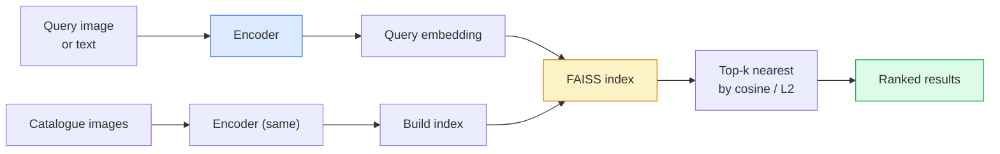

# استرداد الصور والتعلم الميتر

> نظام الاسترداد يرتب المرشحين حسب المسافة في إدراج الفضاء. تعلم الميتر هو تخصص تشكيل ذلك الفضاء حتى يعني المسافات ما تريد.

**Type:** Build
**Languages:** Python
**Prerequisites:** Phase 4 Lesson 14 (ViT), Phase 4 Lesson 18 (CLIP)
**Time:** ~45 minutes

## أهداف التعلم

- شرح خسائر التعلم الميتركي الثلاثية، والمقارنة، والتي تستند إلى النظام التنفيذي واختيار المعلم المناسب لمجموعة بيانات معينة
- تنفيذ تطبيق L2 وتشابه الكوزين بشكل صحيح ومراجعة الفرق بين "المادة نفسها" و"المجموعة نفسها"
- قم ببناء مؤشر FAISS، استفساره عن طريق النص والصورة، وإبلاغ recall@K لمجموعة استفسارات متأخرة
- استخدم DINOv2، CLIP، و SigLIP كعظمات مضخمة خارج المستودع وتعرف متى يفوز كل واحد

## المشكلة

التقاط المعلومات موجود في كل مكان في رؤية الإنتاج: الكشف عن المكرر، البحث عن الصورة العكسية، البحث البصري ("العثور على منتجات مماثلة") ، إعادة التعرف على الوجه، إعادة التعرف على الشخص للمراقبة، تطابق مستوى الحالة للتجارة الإلكترونية. سؤال المنتج هو دائما نفسها: "نظراً لهذه الصورة المطلوبة، رتب كتالوجي".

تقرير: (تصفيق) ، (تصفيق) ، (تصفيق) ، (تصفيق) ، (تصفيق) ، (تصفيق) ، (تصفيق) ، (تصفيق) ، (تصفيق) ، (تصفيق) ، (تصفيق) ، (تصفيق) ، (تصفيق) ، (تصفيق) ، (تصفيق) ، (تصفيق) ، (تصفيق) ، (تصفيق) ، (تصفيق) ، (تصفيق) ، (تصفيق) ، (تصفيق) ، (تصفيق) ، (تصفيق) ، (تصفيق) ، (تصفيق) ، (تصفيق) ، (تصفيق) ، (تصفيق) ، (تصفيق) ، (تصفيق) ، (تصفيق) ، (تصفيق) ، (تصفيق) ، (تصفيق) ، (تصفيق) ، (تصفيق) ، (تصفيق) ، (تصفيق) ، (تصفيق) ، (تصفيق) ، (تصفيق) ، (تصفيق) ، (تصفيق) ، (تصفيق) ، (تصفيق) ، (تصفيق) ، (تصفيق) ، (تصفيق) ، (تصفيق) ، (تصفيق) ، (تصفيق) ، (تصفيق) ، (تصفيق) (تصفيق) ، (تصفيق) (تصفيق) (تصفيق) (ت) (تصفيق) (ت) (تصفيق) (ت) (تت) (تصفيق) (ت) (تتت) (تتت) (ت) (ت) (ت) (ت) (ت) (ت) (ت) (ت) (ت) (ت) (ت) (ت) (ت) (ت) (ت) (ت) (ت) (ت) (ت) (ت) (ت) (ت) (ت) (ت) (ت) (ت) (ت) (ت) (ت) (ت) (ت) (ت) (ت) (ت) (ت) (ت) (ت) (ت) (ت) (ت) (ت

هذا التشكيل هو التعلم الميتركي إنه تخصص صغير لكنه ذو نفوذ كبير

## المفهوم

### إعادة في نظرة واحدة



### الأسر الأربعة التي خسرت

| Loss | Requires | Pros | Cons |
|------|----------|------|------|
| **Contrastive** | (anchor, positive) + negatives | Simple, works with any pair label | Slow to converge without many negatives |
| **Triplet** | (anchor, positive, negative) | Intuitive; direct margin control | Hard-triplet mining is expensive |
| **NT-Xent / InfoNCE** | Pairs + batch-mined negatives | Scales to large batches | Needs big batch or momentum queue |
| **Proxy-based (ProxyNCA)** | Class labels only | Fast, stable, no mining | Can overfit to proxies on small datasets |

بالنسبة لمعظم حالات الاستخدام في الإنتاج، ابدأ مع العمود الفقري المُدرب مسبقاً وإضافة تحسينات للتعلم الميتركي فقط إذا كانت عمليات التثبيت المُنتظمة في المكتب غير جيدة في مجموعة الاختبار الخاصة بك.

### خسارة ثلاثية رسميا

```
L = max(0, ||f(a) - f(p)||^2 - ||f(a) - f(n)||^2 + margin)
```

سحب المرسومة`a`قريبة من الإيجابية`p`، دفعها بعيدا عن السلبية `n`، مع `margin`يضمن الفجوة. بنية الصور الثلاثة تعميم لأي ترتيب مماثل.

المواد المعدنية: ثلاثية سهلة (`n`بعيد جداً`a`() المساهمة في تساوي الخسارة صفر؛ فقط الثلاثة الصعبة تدريس الشبكة.`n`أكثر من `p`ولكن في حدود الحدود) هو وصفة 2016 FaceNet وما زالت تهيمن.

### تشابه كوزين مقابل L2

مقاييس، اتفاقيات:

- **Cosine**: زاوية بين المتجهات. يتطلب إدخال L2 معادلة.
- **L2**: المسافة الأوكليدية. يعمل على التوابل الخام أو المعتادة، ولكن عادة ما يتم ربطها مع L2 المعتاد + L2 المربع.

بالنسبة لمعظم الشبكات الحديثة ، هما متساويان: `||a - b||^2 = 2 - 2 cos(a, b)`متى`||a|| = ||b|| = 1`اختروا المؤتمر الذي يطابق تدريبك في التثبيت، مزيجهم بصمت يغير ما يعنيه "الأقرب".

### تذكر

المقياس القياسي لاسترداد:

```
recall@K = fraction of queries where at least one correct match is in the top K results
```

تقرير recall@1, @5, @10 جنبا إلى جنب. recall@10 فوق 0.95 مع recall@1 تحت 0.5 يعني أن مساحة التثبيت لديها الهيكل الصحيح ولكن التصنيف ضجيج  حاول المزيد من المزجات الدقيقة أو خطوة إعادة التصنيف.

بالنسبة للكشف عن المكرر، فإن الدقة @K مهمة أكثر لأن كل إيجابية خاطئة مرئية للمستخدم. بالنسبة للبحث البصري، فإن recall@K هو إشارة المنتج.

### فيس في فقرة واحدة

بحث شبيهات الفيسبوك عن الذكاء الاصطناعي. مكتبة الفاكتية للبحث عن أقرب جيران. ثلاثة خيارات مؤشر:

- `IndexFlatIP`- لا ، لا`IndexFlatL2`القوة الخامة، دقيقة، لا تدريب.
- `IndexIVFFlat` تقسيم إلى خلايا K، البحث فقط عن القليل من الخلايا القريبة. تقريبي، سريع، يحتاج إلى بيانات التدريب.
- `IndexHNSW` على أساس الرسم البياني، أسرع للعديد من الاستفسارات، حجم المؤشر كبير.

بالنسبة لـ 100 ألف متجه ربما تريد`IndexFlatIP`على شبيهة الكوسينات. مقابل 10 مليون تريد`IndexIVFFlat`. لـ 100 مليون+ مزجراً مع كمية المنتجات (`IndexIVFPQ`)

### استرداد مستوى الحالة مقابل مستوى الفئة

مشاكل مختلفة جداً ذات الاسم نفسه:

- **Category-level** "العثور على القطط في كتالوجي". تشابه طبقي مشروط؛ لا يمكن استخدام CLIP / DINOv2 إضافة جيدة.
- **Instance-level** "العثور على *المنتج الدقيق* في كاتالوجي الخاص بي". يحتاج إلى تمييز دقيق بين الأشياء المماثلة بصريا في نفس الفئة؛ التوابل غير المطبقة لا تؤدي بشكل جيد؛ وتحسين معايير التعلم الميتريكي.

اسأل دائماً أي واحد تحل قبل اختيار النموذج

```figure
metric-embedding
```

## بناءها

### الخطوة الأولى: فقدان الثلاثة

```python
import torch
import torch.nn.functional as F

def triplet_loss(anchor, positive, negative, margin=0.2):
    d_ap = F.pairwise_distance(anchor, positive, p=2)
    d_an = F.pairwise_distance(anchor, negative, p=2)
    return F.relu(d_ap - d_an + margin).mean()
```

خط واحد يعمل على إضافة L2 معادلة أو خامة

### الخطوة الثانية: التعدين شبه الصعب

بالنظر إلى مجموعة من التوابل والعلامات، العثور على أصعب سلبي نصف صلب لكل مرسومة.

```python
def semi_hard_negatives(emb, labels, margin=0.2):
    dist = torch.cdist(emb, emb)
    same_class = labels[:, None] == labels[None, :]
    diff_class = ~same_class
    N = emb.size(0)

    positives = dist.clone()
    positives[~same_class] = float("-inf")
    positives.fill_diagonal_(float("-inf"))
    pos_idx = positives.argmax(dim=1)

    semi_hard = dist.clone()
    semi_hard[same_class] = float("inf")
    d_ap = dist[torch.arange(N), pos_idx].unsqueeze(1)
    semi_hard[dist <= d_ap] = float("inf")
    neg_idx = semi_hard.argmin(dim=1)

    fallback_mask = semi_hard[torch.arange(N), neg_idx] == float("inf")
    if fallback_mask.any():
        hardest = dist.clone()
        hardest[same_class] = float("inf")
        neg_idx = torch.where(fallback_mask, hardest.argmin(dim=1), neg_idx)
    return pos_idx, neg_idx
```

كل مرسا يحصل على أقوى إيجابية في الفئة و سلبي نصف صلبة أبعد من الإيجابية ولكن داخل الهامش.

### الخطوة الثالثة: تذكر

```python
def recall_at_k(query_emb, gallery_emb, query_labels, gallery_labels, k=1):
    sim = query_emb @ gallery_emb.T
    _, top_k = sim.topk(k, dim=-1)
    matches = (gallery_labels[top_k] == query_labels[:, None]).any(dim=-1)
    return matches.float().mean().item()
```

أعلى k من خلال المنتج الداخلي على L2 المطبوعة التوابل تساوي أعلى k من خلال cosine.

### الخطوة الرابعة: وضعها معاً

```python
import torch
import torch.nn as nn
from torch.optim import Adam

class Encoder(nn.Module):
    def __init__(self, in_dim=128, emb_dim=64):
        super().__init__()
        self.net = nn.Sequential(
            nn.Linear(in_dim, 128), nn.ReLU(),
            nn.Linear(128, emb_dim),
        )

    def forward(self, x):
        return F.normalize(self.net(x), dim=-1)

torch.manual_seed(0)
num_classes = 6
protos = F.normalize(torch.randn(num_classes, 128), dim=-1)

def sample_batch(bs=32):
    labels = torch.randint(0, num_classes, (bs,))
    x = protos[labels] + 0.15 * torch.randn(bs, 128)
    return x, labels

enc = Encoder()
opt = Adam(enc.parameters(), lr=3e-3)

for step in range(200):
    x, y = sample_batch(32)
    emb = enc(x)
    pos_idx, neg_idx = semi_hard_negatives(emb, y)
    loss = triplet_loss(emb, emb[pos_idx], emb[neg_idx])
    opt.zero_grad(); loss.backward(); opt.step()
```

بعد بضع مئات الخطوات تشكل مجموعة التضمين مجموعة واحدة لكل فئة.

## استخدمها

مستويات الإنتاج في عام 2026:

- **DINOv2 + FAISS**-المتسع بصري عام، يعمل خارج الرف
- **CLIP + FAISS**عندما تكون الأسئلة نصية.
- **Fine-tuned DINOv2 + FAISS** استرداد مستوى الحالة، إعادة التعرف على الوجه، الأزياء، التجارة الإلكترونية.
- **Milvus / Weaviate / Qdrant** غلفات DB المتجهة إلى المتجهات المدارة حول FAISS أو HNSW.

لاسترداد مثال SOTA، وصفة هي: DINOv2 العمود الفقري، إضافة رأس التضمين، تحسين مع ثلاثية أو InfoNCE الخسارة على أزواج مع علامة على المثال، مؤشر في FAISS.

## أرسله

هذا الدرس ينتج عن:

- `outputs/prompt-retrieval-loss-picker.md` طلب يختار الثلاثة / InfoNCE / ProxyNCA لمشكلة استرداد معينة.
- `outputs/skill-recall-at-k-runner.md` مهارة تكتب حزمة تقييم نظيفة لـ recall@K مع تقسيمات القطار / القسم / المعرض وعقد بيانات مناسبة.

## التمارين

1. **(Easy)**قم بتشغيل مثال اللعبة أعلاه، قم بتخطيط التوابل مع PCA قبل وبعد التدريب لرؤية تشكيل الستة مجموعات.
2. **(Medium)**إضافة تنفيذ خسارة ProxyNCA: واحد تعلم "وكس" لكل فئة، الدخول المتقاطع القياسي على شبيهة كوسين. مقارنة سرعة التقارب مقابل خسارة ثلاثية على بيانات اللعبة.
3. **(Hard)**خذ 1000 صورة تصحيح ImageNet ، وضعت مع DINOv2 عبر HuggingFace ، وبناء مؤشر FAISS مسطح ، وتقرير recall@{1, 5, 10} ضد نفس الصور مثل الاستفسارات (يجب أن يكون 1.0) ومع الانقسام المتواصل مع علامات ImageNet على أنها الحقيقة الأرضية.

## الشروط الرئيسية

| Term | What people say | What it actually means |
|------|----------------|----------------------|
| Metric learning | "Shape the space" | Training an encoder so distances in its output space reflect a target similarity |
| Triplet loss | "Pull and push" | L = max(0, d(a, p) - d(a, n) + margin); the canonical metric-learning loss |
| Semi-hard mining | "Useful negatives" | Negatives further from the anchor than the positive but within margin; empirically the most informative |
| Proxy-based loss | "Class prototypes" | One learned proxy per class; cross-entropy over similarity-to-proxies; no pair mining |
| Recall@K | "Top-K hit rate" | Fraction of queries with at least one correct result in the top K |
| Instance retrieval | "Find this exact thing" | Fine-grained matching; off-the-shelf features usually underperform |
| FAISS | "The NN library" | Facebook's nearest-neighbour library; supports exact and approximate indexes |
| HNSW | "Graph index" | Hierarchical navigable small world; fast approximate NN with small memory overhead |

## المزيد من القراءة

- [FaceNet: A Unified Embedding for Face Recognition (Schroff et al., 2015)](https://arxiv.org/abs/1503.03832) الخسارة الثلاثية / ورق التعدين شبه الصلب
- [In Defense of the Triplet Loss for Person Re-Identification (Hermans et al., 2017)](https://arxiv.org/abs/1703.07737) دليل عملي لتأقلم الثلاثة
- [FAISS documentation](https://github.com/facebookresearch/faiss/wiki) كل مؤشر، كل تعادل
- [SMoT: Metric Learning Taxonomy (Kim et al., 2021)](https://arxiv.org/abs/2010.06927) مسح الخسائر الحديثة ورباطاتها
