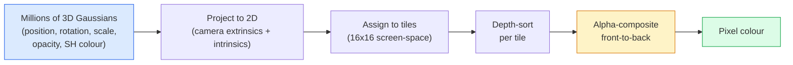

# 3D غوسيانة التشويش من الصفر

> المشهد هو سحابة من ملايين الغوسيانات الثلاثية الأبعاد. كل منها لديه موقع، التوجه، المقياس، الضبابية، واللون الذي يعتمد على اتجاه المشاهدة.

**Type:** Build
**Languages:** Python
**Prerequisites:** Phase 4 Lesson 13 (3D Vision & NeRF), Phase 1 Lesson 12 (Tensor Operations), Phase 4 Lesson 10 (Diffusion basics optional)
**Time:** ~90 minutes

## أهداف التعلم

- شرح لماذا استبدل 3D Gaussian Splatting NeRF كمتروك إنتاج لإعادة بناء 3D واقعي في عام 2026
- تحديد المعلمات الستة لكل غوسيان (موقف، ربعية الدوران، النطاق، الضموضة، ألوان الأرمنيكات الكرة، الميزة الاختيارية) وعدد الملاحين لكل منها
- تنفيذ 2D غوسيانة شقق rasterizer من الصفر باستخدام `alpha`التكوين، ثم عرض كيفية مشروعات الحالة 3D إلى نفس الحلقة
- استخدام`nerfstudio`،`gsplat`أو`SuperSplat`لإعادة بناء مشهد من 20 إلى 50 صورة وتصدير إلى `KHR_gaussian_splatting`إضافة glTF أو OpenUSD 26.03 `UsdVolParticleField3DGaussianSplat`النظام

## المشكلة

تخزين NeRF مشهدًا كوزن MLP. كل بكسل تمثيل هو مئات استفسارات MLP على طول شعاع. يستغرق التدريب ساعات ، يستغرق التسجيل ثوانيًا ، ولا يمكن تحرير الوزن.

استبدل 3D Gaussian Splatting (Kerbl، Kopanas، Leimkühler، Drettakis، SIGGRAPH 2023) كل ذلك. المشهد هو مجموعة صريحة من الغوسيان 3D. التعبير هو رسترية GPU عند 100 + fps. التدريب يستغرق دقائق التحرير مباشر: ترجمة مجموعة فرعية من غوسيانز وأنت قد نقل الكرسي. بحلول عام 2026، صدقت مجموعة خرونوس على تمديد GLTF للمناطق الغاوسية، وشركة OpenUSD 26.03 تمر بخطط المناطق الغاوسية، ويعطي Zillow و Apartments.com العقارات معهم، ومعظم أوراق البحث الجديدة حول إعادة الإعمار ثلاثي الأبعاد هي تغيرات على فكرة 3DGS الأساسية.

النموذج العقلي بسيط، والرياضيات لديها ما يكفي من الأجزاء المتحركة التي تبدأ معظم المقدمة في الشتات والقفز ما وراء التنبؤات والهرمونيات الكرة. هذا الدروس يبني كل شيء  نسخة 2D أولا، ثم التوسع 3D.

## المفهوم

### ما يحمله غوسيان

غوسيان 3D هو قلة معايرية في الفضاء مع هذه الصفات:

```
position         mu         (3,)    centre in world coordinates
rotation         q          (4,)    unit quaternion encoding orientation
scale            s          (3,)    log-scales per axis (exponentiated at render time)
opacity          alpha      (1,)    post-sigmoid opacity [0, 1]
SH coefficients  c_lm       (3 * (L+1)^2,)   view-dependent colour
```

التناوب + النطاق بناء 3x3 تغلبة: `Sigma = R S S^T R^T`هذا هو شكل غوسيان في 3D. الأرمنيكات الكرةية تسمح تغيير اللون مع اتجاه المشاهدة  الاكتشافات المتضاربة، النور الخفيف، الوهاء يعتمد على المشاهدة  دون تخزين النسيج لكل المشاهدة. مع درجة SH 3 تحصل على 16 معدل لكل قناة لون، 48 عائما لكل غوسيان للون وحده.

يحتوي المشهد عادة على 1-5 مليون غوسيان. كل مخزن حوالي 60 عائماً (3 + 4 + 3 + 1 + 48 + مخلوط). وهذا 240 MB لمشهد غوسيان خمسة ملايين  أصغر بكثير من سحابة النقطة الموازية ذات نسيج لكل نقطة ، وترتيب من حجم أقل من أوزان MLP من NeRF يتم إعادة تقديمها عند عالية القرار.

### التشريع، لا تشريع الأشعة



خمسة خطوات، جميعها صديقة لـ (جي بي يو) لا يوجد استفسار (م إل بي) لكل بيكسل

### خطوة التنبيه

غوسيان ثلاثي الأبعاد في وضع العالم`mu`مع تغطية ثلاثية الأبعاد `Sigma`المشروعات إلى غوسيان 2D في وضع الشاشة `mu'`مع تغطية ثنائية الأبعاد `Sigma'`:

```
mu' = project(mu)
Sigma' = J W Sigma W^T J^T          (2 x 2)

W = viewing transform (rotation + translation of camera)
J = Jacobian of the perspective projection at mu'
```

بصمة غوسيان 2D هي كُرُشٍ تُعد محورها متجهات خاصة`Sigma'`كل بكسل داخل تلك الكتل تتلقى مساهمة غوسيان، وزنها`exp(-0.5 * (p - mu')^T Sigma'^-1 (p - mu'))`. . .

### قاعدة التركيب الألفي

بالنسبة لبرمجة واحدة ، يتم فرز غوسيانات تغطيها من الأمام إلى الأمام (أو بمعادل ذلك من الأمام إلى الأمام مع الصيغة المعاكسة). يتم تجميع اللون بنفس المعادلة التي تمثل كل رسطير شبه شفاف منذ الثمانينيات:

```
C_pixel = sum_i alpha_i * T_i * c_i

T_i = prod_{j < i} (1 - alpha_j)       transmittance up to i
alpha_i = opacity_i * exp(-0.5 * d^T Sigma'^-1 d)   local contribution
c_i = eval_SH(SH_i, view_direction)    view-dependent colour
```

هذا هو**the same equation as NeRF's volumetric render**هذا هو السبب في أن الجودة التي تم تقديمها تطابق مع NeRF  كلاهما يدمج نفس المعادلة من حقل الإشعاع.

### لماذا هذا يمكن التمييز

كل خطوة  التبديل، وتخصيص الطلاء، وتكوين ألفا، تقييم SH  يمكن التمييز فيما يتعلق بالمعايير غوسيان. بالنظر إلى صورة الحقيقة الأرضية، الحساب تقديم فقدان البكسل، والعودة من خلال الراستريزر، تحديث كل `(mu, q, s, alpha, c_lm)`أكثر من 30 ألف تكرار، يجد الغوسيان مواقفهم الصحيحة، ومقاييسهم، وألوانهم.

### التثبيت والقسم

مجموعة ثابتة من غوسيان لا يمكن تغطية مشهد معقد. التدريب يتضمن آليتين تكييفية:

- **Clone**غوسيان في موقعه الحالي عندما تكون حجم تراجعها مرتفع ولكن مقياسها صغير
- **Split**غوسيان واسع النطاق إلى اثنين أصغر عندما يكون تراجعها مرتفع غوسيان كبير كبير جداً ليس مناسب للمنطقة.
- **Prune**غوسيان الذين ينخفض ضبابيتهم تحت عتبة لا يسهمون

يدير التكثيف كل تكرار N. ينمو المشهد عادة من ~ 100k غوسيانات أولية (التي تم زرعها من نقاط SfM) إلى 1-5M في نهاية التدريب.

### المنسيقات الكهرومونية في فقرة واحدة

اللون يعتمد على الرؤية هو وظيفة `c(direction)`على الكرة الوحيدة. الهرمونيكا الكرة هي أساس الكرة فوريه.`L`و ستحصلين`(L+1)^2`تُعدّل أسلوبات الأساسية لكل قناة. تقييم اللون لمشاهدة جديدة هو نسبة نقطة بين معايير SH المكتسبة والقاعدة التي يتم تقييمها في اتجاه المشاهدة. درجة 0 = معايير واحدة = لون ثابت. درجة 3 = معايير 16 = كافية لالتقاط الظلال لامبيرطي، والرؤية المتضاهرة، والعكس الخفيف. تستخدم ورق SD Gaussian Splatting درجة 3 حسب الاختيار.

### سلسلة الإنتاج لعام 2026

```
1. Capture         smartphone / DJI drone / handheld scanner
2. SfM / MVS       COLMAP or GLOMAP derives camera poses + sparse points
3. Train 3DGS      nerfstudio / gsplat / inria official / PostShot (~10-30 min on RTX 4090)
4. Edit            SuperSplat / SplatForge (clean floaters, segment)
5. Export          .ply -> glTF KHR_gaussian_splatting or .usd (OpenUSD 26.03)
6. View            Cesium / Unreal / Babylon.js / Three.js / Vision Pro
```

### الإصدارات 4D والإصدارات التوليدية

- **4D Gaussian Splatting** غوسيان هي وظائف من الوقت؛ تستخدم في الفيديو الحجمي (سوبرمان 2026، "هليكوبتر" A$AP روكي).
- **Generative splats** نماذج نصية إلى مساحة (الماربل من قبل مختبرات العالم) التي تحسّن مشاهد كاملة.
- **3D Gaussian Unscented Transform** إصدار NVIDIA NuRec للتحاكي الحالي للقيادة.

```figure
cv3-gaussian-splat
```

## بناءها

### الخطوة الأولى: غوسيان ثنائي الأبعاد

أولاً، سنبني شاشة 2D، والحالة 3D تقلل إليها بعد التنبيه.

```python
import torch
import torch.nn as nn
import torch.nn.functional as F


def eval_2d_gaussian(means, covs, points):
    """
    means:  (G, 2)      centres
    covs:   (G, 2, 2)   covariance matrices
    points: (H, W, 2)   pixel coordinates
    returns: (G, H, W)  density at every pixel for every Gaussian
    """
    G = means.size(0)
    H, W, _ = points.shape
    flat = points.view(-1, 2)
    inv = torch.linalg.inv(covs)
    diff = flat[None, :, :] - means[:, None, :]
    d = torch.einsum("gpi,gij,gpj->gp", diff, inv, diff)
    density = torch.exp(-0.5 * d)
    return density.view(G, H, W)
```

`einsum`هل الشكل التربيعي`diff^T Sigma^-1 diff`لكل زوج (غوسيان، بكسل)

### الخطوة 2: 2D مسطح الرصيف

تعقيد الفا من الأمام إلى الخلف، العمق في التابع الثاني لا معنى له، لذا نستخدم مستوى علمي لكل غوسيان للنظام.

```python
def rasterise_2d(means, covs, colours, opacities, depths, image_size):
    """
    means:     (G, 2)
    covs:      (G, 2, 2)
    colours:   (G, 3)
    opacities: (G,)     in [0, 1]
    depths:    (G,)     per-Gaussian scalar used for ordering
    image_size: (H, W)
    returns:   (H, W, 3) rendered image
    """
    H, W = image_size
    yy, xx = torch.meshgrid(
        torch.arange(H, dtype=torch.float32, device=means.device),
        torch.arange(W, dtype=torch.float32, device=means.device),
        indexing="ij",
    )
    points = torch.stack([xx, yy], dim=-1)

    densities = eval_2d_gaussian(means, covs, points)
    alphas = opacities[:, None, None] * densities
    alphas = alphas.clamp(0.0, 0.99)

    order = torch.argsort(depths)
    alphas = alphas[order]
    colours_sorted = colours[order]

    T = torch.ones(H, W, device=means.device)
    out = torch.zeros(H, W, 3, device=means.device)
    for i in range(means.size(0)):
        a = alphas[i]
        out += (T * a)[..., None] * colours_sorted[i][None, None, :]
        T = T * (1.0 - a)
    return out
```

ليس سريعا  تنفيذ حقيقي يستخدم أجزاء CUDA القائمة على البلاط  ولكن بالضبط الرياضيات الصحيحة ويمكن التمييز الكامل.

### الخطوة الثالثة: مشهد 2D قابل للتدريب

```python
class Splats2D(nn.Module):
    def __init__(self, num_splats=128, image_size=64, seed=0):
        super().__init__()
        g = torch.Generator().manual_seed(seed)
        H, W = image_size, image_size
        self.means = nn.Parameter(torch.rand(num_splats, 2, generator=g) * torch.tensor([W, H]))
        self.log_scale = nn.Parameter(torch.ones(num_splats, 2) * math.log(2.0))
        self.rot = nn.Parameter(torch.zeros(num_splats))  # single angle in 2D
        self.colour_logits = nn.Parameter(torch.randn(num_splats, 3, generator=g) * 0.5)
        self.opacity_logit = nn.Parameter(torch.zeros(num_splats))
        self.depth = nn.Parameter(torch.rand(num_splats, generator=g))

    def covs(self):
        s = torch.exp(self.log_scale)
        c, si = torch.cos(self.rot), torch.sin(self.rot)
        R = torch.stack([
            torch.stack([c, -si], dim=-1),
            torch.stack([si, c], dim=-1),
        ], dim=-2)
        S = torch.diag_embed(s ** 2)
        return R @ S @ R.transpose(-1, -2)

    def forward(self, image_size):
        covs = self.covs()
        colours = torch.sigmoid(self.colour_logits)
        opacities = torch.sigmoid(self.opacity_logit)
        return rasterise_2d(self.means, covs, colours, opacities, self.depth, image_size)
```

`log_scale`،`opacity_logit`و`colour_logits`هذه هي النمط القياسي لكل تنفيذ 3DGS

### الخطوة الرابعة: تكييف غوسيانات 2D إلى صورة الهدف

```python
import math
import numpy as np

def make_target(size=64):
    yy, xx = np.meshgrid(np.arange(size), np.arange(size), indexing="ij")
    img = np.zeros((size, size, 3), dtype=np.float32)
    # Red circle
    mask = (xx - 20) ** 2 + (yy - 20) ** 2 < 10 ** 2
    img[mask] = [1.0, 0.2, 0.2]
    # Blue square
    mask = (np.abs(xx - 45) < 8) & (np.abs(yy - 40) < 8)
    img[mask] = [0.2, 0.3, 1.0]
    return torch.from_numpy(img)


target = make_target(64)
model = Splats2D(num_splats=64, image_size=64)
opt = torch.optim.Adam(model.parameters(), lr=0.05)

for step in range(200):
    pred = model((64, 64))
    loss = F.mse_loss(pred, target)
    opt.zero_grad(); loss.backward(); opt.step()
    if step % 40 == 0:
        print(f"step {step:3d}  mse {loss.item():.4f}")
```

أكثر من 200 خطوة، ينسحب 64 غوسياً في الشكلين، وهذا هو الفكرة الكاملة

### الخطوة 5: من 2D إلى 3D

التوسع ثلاثي الأبعاد يبقى نفس الحلقة.

1. الدوران الفقري هو الرباعي بدلاً من زاوية واحدة.
2. التباين هو`R S S^T R^T`مع`R`بنيت من الرباعية و`S = diag(exp(log_scale))`. . .
3. التنبؤ`(mu, Sigma) -> (mu', Sigma')`يستخدم خارج الكاميرا والجاكوبيان من التنبيه المنظور في `mu`. . .
4. يصبح اللون توسعاً كرويياً-هرموني؛ تقييمه في اتجاه المشاهدة.
5. التنظيم العميق هو من الفضاء الفعلي الكاميرا z بدلا من المتعلمين.

كل تنفيذ إنتاج (`gsplat`،`inria/gaussian-splatting`،`nerfstudio`) يفعل هذا بالضبط على GPU مع نواة CUDA على أساس البلاط.

### الخطوة 6: تقييم الأرمنيكات الكهرومونيكية

قاعدة SH حتى درجة 3 لديها 16 شرط لكل قناة.

```python
def eval_sh_degree_3(sh_coeffs, dirs):
    """
    sh_coeffs: (..., 16, 3)   last dim is RGB channels
    dirs:      (..., 3)       unit vectors
    returns:   (..., 3)
    """
    C0 = 0.282094791773878
    C1 = 0.488602511902920
    C2 = [1.092548430592079, 1.092548430592079,
          0.315391565252520, 1.092548430592079,
          0.546274215296039]
    x, y, z = dirs[..., 0], dirs[..., 1], dirs[..., 2]
    x2, y2, z2 = x * x, y * y, z * z
    xy, yz, xz = x * y, y * z, x * z

    result = C0 * sh_coeffs[..., 0, :]
    result = result - C1 * y[..., None] * sh_coeffs[..., 1, :]
    result = result + C1 * z[..., None] * sh_coeffs[..., 2, :]
    result = result - C1 * x[..., None] * sh_coeffs[..., 3, :]

    result = result + C2[0] * xy[..., None] * sh_coeffs[..., 4, :]
    result = result + C2[1] * yz[..., None] * sh_coeffs[..., 5, :]
    result = result + C2[2] * (2.0 * z2 - x2 - y2)[..., None] * sh_coeffs[..., 6, :]
    result = result + C2[3] * xz[..., None] * sh_coeffs[..., 7, :]
    result = result + C2[4] * (x2 - y2)[..., None] * sh_coeffs[..., 8, :]

    # degree 3 terms omitted here for brevity; full 16-coefficient version in the code file
    return result
```

تعلمت`sh_coeffs`تخزين "الوان في كل اتجاه" لهذا الغوسيان. في وقت التصوير تقوم بتقييم ضد اتجاه الرؤية الحالية وتحصل على RGB ثلاثية المتجهات.

## استخدمها

للعمل الحقيقي في 3DGS، استخدم `gsplat`(ميتا) أو `nerfstudio`:

```bash
pip install nerfstudio gsplat
ns-download-data example
ns-train splatfacto --data path/to/data
```

`splatfacto`هو مدرب 3DGS في استوديو العصبية، يستغرق الجري 10-30 دقيقة على جهاز RTX 4090

خيارات الصادرات التي تهم في عام 2026:

- `.ply` سحاب غوسي خام (ملف قابل للنقل، أكبر ملف).
- `.splat` تنسيق PlayCanvas / SuperSplat الكمية.
- غالف`KHR_gaussian_splatting` معيار كرونوس، قابل للنقل عبر المشاهدين (فبراير 2026 RC).
- أوفن دولس`UsdVolParticleField3DGaussianSplat` أمريكي أمريكي، لخطوط الأنابيب NVIDIA Omniverse و Vision Pro.

للمشاهد 4D / ديناميكية، `4DGS`و`Deformable-3DGS`يمتد نفس الآلة بوسائل مختلفة في الزمن وغموضات.

## أرسله

هذا الدرس ينتج عن:

- `outputs/prompt-3dgs-capture-planner.md` طلب يخطط للانتظار للانتظار (عدد الصور، مسار الكاميرا، الإضاءة) لنوع المشهد المعين.
- `outputs/skill-3dgs-export-router.md` مهارة تختار شكل التصدير المناسب (`.ply`- لا ، لا`.splat`(غلتف/دولار) في حالة عرض المشاهد أو المحرك.

## التمارين

1. **(Easy)**أستخدموا مدربة التفجير الثنائي الأبعاد فوق على صورة اصطناعية مختلفة`num_splats`في`[16, 64, 256]`وخطة MSE مقابل خطوة لكل منها. حدد نقطة انخفاض العائدات.
2. **(Medium)**توسيع مستوى 2D لتساعد الألوان RGB لكل غوسية التي تعتمد على "زاوية الرؤية" المتعددة من خلال مستوى-2 التناغم. قم بتدريب زوج من الصور المستهدفة وتحقق من إعادة بناء النموذج على حد سواء.
3. **(Hard)**النسخة`nerfstudio`و القطار`splatfacto`على 20 صورة لقطة أي مشهد لديك (المكتب، النبات، الوجه، الغرفة).`KHR_gaussian_splatting`وفتحها في المشاهد (Three.js `GaussianSplats3D`(SuperSplat, Babylon.js V9). تقرير وقت التدريب، عدد غوسيان، ووضع الفب.

## الشروط الرئيسية

| Term | What people say | What it actually means |
|------|----------------|----------------------|
| 3DGS | "Gaussian splats" | Explicit scene representation as millions of 3D Gaussians with per-Gaussian position, rotation, scale, opacity, SH colour |
| Covariance | "Shape of the Gaussian" | `Sigma = R S S^T R^T`; orientation and anisotropic scale of one Gaussian |
| Alpha compositing | "Back-to-front blend" | Same equation as NeRF's volumetric render, now over an explicit sparse set |
| Densification | "Clone and split" | Adaptive addition of new Gaussians where reconstruction is under-fit |
| Pruning | "Delete low-opacity" | Remove Gaussians that have collapsed to near-zero opacity during training |
| Spherical harmonics | "View-dependent colour" | Fourier basis on the sphere; stores colour as a function of viewing direction |
| Splatfacto | "nerfstudio's 3DGS" | The easiest path to training 3DGS in 2026 |
| `KHR_gaussian_splatting` | "glTF standard" | Khronos 2026 extension that makes 3DGS portable across viewers and engines |

## المزيد من القراءة

- [3D Gaussian Splatting for Real-Time Radiance Field Rendering (Kerbl et al., SIGGRAPH 2023)](https://repo-sam.inria.fr/fungraph/3d-gaussian-splatting/) الورق الأصلي
- [gsplat (Meta/nerfstudio)](https://github.com/nerfstudio-project/gsplat) كيودا راستريزر ذات جودة إنتاجية
- [nerfstudio Splatfacto](https://docs.nerf.studio/nerfology/methods/splat.html) وصفة تدريبية مرجعية
- [Khronos KHR_gaussian_splatting extension](https://github.com/KhronosGroup/glTF/blob/main/extensions/2.0/Khronos/KHR_gaussian_splatting/README.md) النموذج المحمول لعام 2026
- [OpenUSD 26.03 release notes](https://openusd.org/release/) `UsdVolParticleField3DGaussianSplat`النظام
- [THE FUTURE 3D State of Gaussian Splatting 2026](https://www.thefuture3d.com/blog-0/2026/4/4/state-of-gaussian-splatting-2026) نظرة عامة للقطاع
